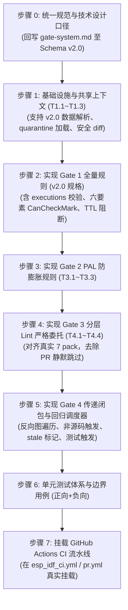

<!-- SPDX-License-Identifier: GPL-3.0-only -->
# ESP-IDF 分类管治门禁系统实施计划（2026-09-29）深度整体设计评审

| 项 | 内容 |
|---|---|
| 评审日期 | 2026-09-29 |
| 评审对象 | [`docs/implementation-plans/esp32/2026-09-29-esp-idf-gate-system-implementation-plan.md`](../../implementation-plans/esp32/2026-09-29-esp-idf-gate-system-implementation-plan.md) |
| 评审目标 | 判断该计划实施后，是否能把已完成的 ESP-IDF 分类基线转化为确定性、可复现、能在 CI 中阻断错误交付的 Gate 1～4；判断当前计划是否已达“可执行”状态 |
| 检查基线 | 嵌入式仓 HEAD（已完成整改计划阶段 A~E 并冻结，`checklist.data.json` 为 Schema v2.0，`.gates/quarantine.yaml` 已就位） |
| 权威规范与决策 | [ADR-0090](../../decisions/unisim/0090-centralized-pluggable-gate-system.md)（集中式插件架构）、[ADR-0091](../../decisions/unisim/0091-esp-idf-multi-config-orthogonal-schema.md)（多配置实体与五维正交 Schema）、[`CLASSIFICATION-SPEC.md`](../../../wink-micro-app/vendor/esp_idfv61/CLASSIFICATION-SPEC.md) v2.0、[`esp-idf-classification-schema-spec.md`](../../zh/tech-designs/esp32/esp-idf-classification-schema-spec.md)、[`esp-idf-classification-gate-system.md`](../../zh/tech-designs/esp32/esp-idf-classification-gate-system.md) |
| 评审性质 | 实施计划架构与工程可行性专项评审（只读审查，不直接修改代码或原计划） |

---

## 总体结论与裁决

### 裁决结论：**不宜按原计划执行（Must Revise Before Execution）**

当前计划 **尚未达到“可执行”状态**。若按原计划直接实施，不仅**无法**把已完成的 ESP-IDF 分类基线转化为确定性门禁，反而会引发严重的代码运行崩溃与质量防线被击穿：

1. **执行即崩溃（KeyError 级阻断）**：当前工作区数据源 `checklist.data.json` 已全量升级至 **Schema v2.0**（`spec_version: "2.0.0"`，根部采用 `scope`、`audit`、`executions: [...]` 多配置实体数组，已删除 `scope_and_maturity`、`delivery`、`soc_matrix` 等字段）。而该实施计划依然基于早已废弃的 **Schema v1.1** 字段设计 11 条 Gate 1 规则（如检查 `entry["delivery"]["state"]`、`entry["scope_and_maturity"]["status"]`、`entry["soc_matrix"]`）。计划一旦落地运行，会立即对 478 条示例报出 `KeyError` 异常或版本不一致误判（P0-1）。
2. **门禁穿透与虚假 Verified 逃逸（防线失守）**：计划完全遗漏了已落地生效的 `.gates/quarantine.yaml` 隔离区白名单及其 14 天 TTL 机制，反而采用了**粗暴的 PR 全局降级策略**——在 PR 模式下一律将资产哈希、负例用例与场景存在性降级为 `warning`（不阻断）。这将导致任何开发者在 PR 中声称新的 `verified` 但不提供任何产物哈希或报告时，PR 都能被**绿灯放行通过**，直接违背了 ADR-0091 与六位一体裁判公式（P0-2）。
3. **影响闭包退化与回归虚设（无阻断假象）**：计划中的 Gate 4（`impact_scope.py`）仅对 `entry.required_capabilities` 做了单层直接字符串比对，完全缺少 `capability-catalog.yaml` 中 `depends_on`（必需/条件依赖）的**反向传递闭包遍历**与三条解析防御红线；且 Gate 4 仅计算输出了布尔值 `pr_inline`，根本**未挂载任何真实场景测试回归任务**，亦未建立证据失效（`stale`）流转，使 Gate 4 退化为无阻断能力的展示型脚本（P0-3）。
4. **CI 挂载完全悬空**：计划宣称“两套门禁并存”，但实际上不管是 `generate_checklist_v1_1.py` 还是 `.gates/run_gates.py`，目前在 `.github/workflows/` 的任何 CI 流水线中**均未挂载**。计划缺少明确的 CI 工作流接入子任务与凭证容错方案。

必须按照 **Schema v2.0、ADR-0091、quarantine.yaml 与真实回归闭环** 对该计划执行系统性修订后，方可启动实施。

---

## 一、“现行基线 → 门禁计划”全面差异对照表

为厘清系统各维度真实现状，建立下表严格区分四个层级：
- **设计文档已定义**：现行技术规范、ADR 或设计规范已形成的条文约束；
- **计划拟实施**：被评审的 `2026-09-29-esp-idf-gate-system-implementation-plan.md` 中写明的任务与逻辑；
- **仓库已有实现**：当前嵌入式仓 HEAD（本地磁盘）真实存在的代码与数据；
- **CI 已实际挂载**：`.github/workflows/` 中已激活且处于 blocking 状态的检查步骤。

| 治理维度 | ① 设计文档已定义 (SSOT Specs) | ② 计划拟实施 (Current Plan) | ③ 仓库已有实现 (Local Workspace) | ④ CI 已实际挂载 (CI Workflows) | 状态裁决与核心偏差 |
|---|---|---|---|---|---|
| **数据 Schema 与版本** | **Schema v2.0** (`spec_version: "2.0.0"`)，以 `executions: [...]` 多配置实体为一等公民，五维正交解耦（ADR-0091, schema-spec） | **Schema v1.1** (`spec_version: "1.1.0"`，计划行 67/100)，使用根部单值 `delivery.state`、`soc_matrix`、`scope_and_maturity` | `checklist.data.json` 478 条已全量升级为 **v2.0.0**，根部无 `delivery` 和 `soc_matrix` | **无**（CI 未运行任何 Schema 校验） | 🔴 **严重倒退**：计划基于废弃的 v1.1 字段编写规则，无法消费现行 v2.0 数据源 |
| **Verified 与证据模型** | **CanCheckMark 六要素合取**：强绑定 `assets_sha256`（64位）、`scenario_sha256`、`execution_report_ref` 及断言真实通过（ADR-0091 §3） | 检查固定 Wasm 三件套 `assets_sha256.{device_tree,js,wasm}`（计划行 95），仅查负例条数与文件存在 | `verify_phase_c_closed_loop.py` 实现了六要素合取与目录哈希计算；`checklist.data.json` 中 10 项为 verified | **无** | 🔴 **严重偏差**：计划依赖旧三件套，无法覆盖 host_native/build 等多种后端类型，且未校验执行报告真实成功 |
| **存量债务与隔离区** | `.gates/quarantine.yaml` 白名单，**14天硬性 TTL**（截至 2026-10-13），仅限域豁免 10 项存量，逾期强制阻断；新声明严格阻断（ADR-0091 §5） | **无隔离区概念**。在 PR 模式下一律对所有条目的哈希、场景、负例缺口降级为 warning 放行（计划行 108/276） | `.gates/quarantine.yaml` 已真实存在（10 条，TTL 到期时间已写死）；`generate_checklist_v1_1.py` 已包含只读 TTL 校验 | **无** | 🔴 **致命漏洞**：计划未集成 `quarantine.yaml`，其全局 warning 策略导致新提交的假 verified 能直接穿透门禁 |
| **能力依赖图谱** | Catalog 支持 `depends_on: {mandatory, conditional}`；解析器执行**三条防御红线**（语法白名单、独立求值、Fail-Close）（ADR-0091 §4） | 仅在 Gate 1 检查 `entry.required_capabilities` 是否存在于 Catalog 的 key 集合中（计划行 94） | `capability-catalog.yaml` 现为 v1.1.0（尚未包含 `depends_on` 字段）；`verify_phase_c_closed_loop.py` 内嵌了闭包求值参考逻辑 | **无** | 🟡 **能力未闭环**：计划缺少对 Catalog `depends_on` 图谱的校验与条件依赖防御解析规则 |
| **Gate 1 规则集合** | 覆盖 Schema v2.0 结构、跨文件引用、五维状态正交、六要素凭据、隔离区 TTL、Fail-Loud 编译阻断 | 旧版 11 条规则（包含已废弃的 `soc_matrix_complete`、`no_pending_verified` 等）（计划行 90~104） | `generate_checklist_v1_1.py` 内嵌 `validate_data()` 支持 v2.0 路径唯一、能力存在、隔离区与哈希校验 | **无** | 🔴 **结构错位**：计划所列 11 条规则中有 6 条直接与 v2.0 数据结构冲突，落地即产生假阻断或崩溃 |
| **Gate 2 PAL 边界** | PAL/targets/osal 符号负向正则扫描（`ws2812|rgb|pixel...`），能力必须有 `owned_paths`，跨 MCU 凭据（ADR-0090, gate-system） | `g2_pal_naming.py`、`g2_cap_has_owned_paths.py`、`g2_cap_cross_mcu.py`，由 git diff 触发（计划行 131） | 尚未在 `.gates/` 下建立对应 Python 规则脚本 | **无**（仅在 `esp_idf_ci.yml` 中运行静态 winkcli layering 校验） | 🟢 **方向一致**：Gate 2 规则逻辑与技术设计基本契合，但需修正 git diff 探测的可靠性 |
| **Gate 3 分层 Lint 委托** | 委托 `winkcli lint` 全量 6 pack（`layering, api, dal, isr, user_surface, wasm`）（gate-system §九） | 运行 `winkcli` 6 pack，若缺少 pack 或未安装工具则**捕获降级为 info/warning 并跳过**（计划行 171/277） | `wink-tools/tools/lint/rules/` 真实存在全部 7 个规则 YAML 文件；本地未全局分发 `winkcli` 二进制可执行文件 | `esp_idf_ci.yml` 运行 `layering, api, esp_idf_all`；`pr.yml` 若无工具则输出 warning 跳过 | 🟡 **静默降级风险**：计划允许在未安装工具时退出 0，使公有 CI 或普通 PR 上的 Gate 3 成为摆设 |
| **Gate 4 依赖反向影响闭包** | 变动路径 → 能力 → **反向传递依赖闭包** → 受影响示例/配置 → 触发 Headless 回归任务，旧凭证失效标记为 `stale` | 仅单层匹配 `entry.required_capabilities`；输出受影响 display_id，阈值 ≤30 标 `pr_inline: true`（计划行 193） | 尚未创建 `impact_scope.py` | **无** | 🔴 **严重缩水**：缺少反向传递闭包与非源码变更触发，且计算出列表后根本没有触发任何测试执行 |
| **CI 挂载与调用入口** | 统一入口 `python .gates/run_gates.py --mode pr/nightly`，作为 PR 必过 blocking 门禁（ADR-0090） | 计划在“过渡关系”中给出两行命令示意，但未设计具体的 GitHub Actions 工作流修改任务（计划行 293） | 当前没有任何 `.github/workflows/` 文件调用 `generate_checklist_v1_1.py` 或 `run_gates.py` | **完全未挂载** | 🔴 **落地断层**：计划将 CI 接入一笔带过，未解决 runner 环境依赖、git diff 基准与只读 token 问题 |

---

## 二、关键不变量覆盖矩阵

核对分类体系的 7 大核心架构不变量在当前计划中的覆盖情况：

| 不变量与规范要求 | 规范依据 | 触发输入 | 负责 Gate / 规则 | PR 模式行为 | Nightly 模式行为 | 期望退出码与报告 | 现有仓库可验证证据 | 计划当前存在的缺口与缺陷 |
|---|---|---|---|---|---|---|---|---|
| **INV-1: Schema v2 多配置与五维正交**<br>示例根部持有 scope/audit，配置实例 `executions: [...]` 为一等公民，禁止旧版平铺状态 | ADR-0091 §1~2<br>schema-spec §二~三 | `checklist.data.json` 文件内容 | Gate 1 (`g1_schema_v2`) | 全量逐条校验 Schema 与枚举合法性 | 全量逐条校验 Schema 与枚举合法性 | 违规报 `error`<br>退出码 1 | `checklist.data.json` (HEAD 27011 行)<br>`generate_checklist_v1_1.py:130` 验证 executions | **完全缺失**：计划仍设计 `g1_no_pending_verified`、`g1_soc_matrix_complete` 等 v1.1 规则，访问已删除字段必抛 KeyError |
| **INV-2: CanCheckMark 六要素闭环**<br>只有范围 in_scope、审计覆盖、依赖 satisfied、声明 verified、哈希匹配、断言成功才能打勾 | ADR-0091 §3<br>CLASSIFICATION-SPEC §五.2 | 示例档案、配置实例、磁盘真实产物与报告 | Gate 1 (`g1_can_check_mark`) | 非隔离区条目缺少任一要素均判 `error` | 全量条目严格校验六要素，无豁免 | 阻断报 `error`<br>退出码 1 | `verify_phase_c_closed_loop.py`<br>（真实运行 4/4 全部 PASS） | **严重缺失**：计划未将执行报告纳入校验，且在 PR 模式下将哈希、负例用例等要素全局降为 warning |
| **INV-3: Catalog 依赖闭包与三条红线**<br>根据 `depends_on` 动态求值；不支持语法、缺失配置必须阻断，严禁假满足 | ADR-0091 §4<br>schema-spec §四.2 | `capability-catalog.yaml` 与配置上下文 | Gate 1 / Gate 4 共享求值器 | 依赖闭包必须全部为 satisfied，未知报 `error` | 同 PR | 阻断报 `error`<br>退出码 1 | `verify_phase_c_closed_loop.py:55`<br>已实现三条红线防御求值 | **完全缺失**：计划中的规则与 `impact_scope.py` 仅检查一级能力 ID，未引入递归闭包与条件语法防御 |
| **INV-4: 历史隔离区 14 天 TTL 与纯函数**<br>仅限域豁免 10 项存量；新 verified 严禁豁免；TTL 逾期硬阻断；门禁只读不写文件 | ADR-0091 §5<br>schema-spec §五 | `.gates/quarantine.yaml` 与系统当前时间 | Gate 1 (`g1_quarantine`) | 白名单内报 warning；非白名单或 TTL 逾期报 `error` | TTL 逾期报 `error`；存量债务报告汇总 | 逾期/越权报 `error`<br>退出码 1 | `.gates/quarantine.yaml`<br>`generate_checklist_v1_1.py:140` 已验证 TTL 逻辑 | **完全缺失**：计划根本未提及 `quarantine.yaml`，用全量 PR warning 替代了限域隔离区，违背防腐要求 |
| **INV-5: 排除项 Fail-Loud 编译期阻断**<br>out_of_scope 示例严禁伪造假桩，必须在编译期通过 `#error` 命中预期阻断字符串 | ADR-0091 §6<br>schema-spec §六 | 标为 expected_rejection 的示例工程 | Gate 1 (`g1_sla_fail_loud`) | 真实触发编译，断言编译失败且匹配 error 文本 | 同 PR | 编译成功或文本不匹配报 `error`<br>退出码 1 | `verify_phase_c_closed_loop.py:326`<br>验证 Case 4 成功阻断 | **缺失**：计划 `T2.4` 仅做 JSON 中字符串存在性比对，未启动真实编译校验 Fail-Loud 机制 |
| **INV-6: PAL 架构边界与分层 Lint 委托**<br>底座变更严禁带入器件关键字；全量分层 Lint 必须真实执行且不可静默跳过 | ADR-0090<br>ADR-0043<br>AGENTS.md | `wink-micro-os/pal/**`, `targets/**` 等 | Gate 2 (`g2_pal_naming`)<br>Gate 3 (`g3_winkcli`) | 匹配黑名单报 `error`；分层违规阻断 | 同 PR | 违规报 `error`<br>退出码 1 | `wink-tools/tools/lint/rules/*.yaml`<br>（7 个规则包已完备） | **存在穿透风险**：Gate 3 允许在缺失工具时降级为 warning 跳过，使架构守卫失去强制力 |
| **INV-7: 变更到回归的反向传递影响闭包**<br>底层文件变动驱动反向传递依赖，定位示例并执行回归；超量移交 Nightly 必须置失效 | ADR-0091 §4<br>schema-spec §十<br>baseline Q07 | git diff 变更文件列表 | Gate 4 (`impact_scope.py`) | ≤30 项内联执行场景回归；>30 项生成清单并置旧凭据 `stale` | 全量执行回归并更新凭据哈希 | 回归断言失败报 `error`<br>退出码 1 | 暂无统一工具（`verify_phase_c_closed_loop.py` 提供单例范例） | **核心链路中断**：无反向传递计算，无非源码触发，只打印 JSON，完全未对接测试运行器，未置 `stale` |

---

## 三、每道 Gate 代表性“应通过”与“必须阻断”反例实证与设计推演

为验证计划在实际运行中的健壮性，设计以下 7 个典型测试场景，分别比对“当前计划预期产生的行为”与“架构设计要求的正确行为”：

### 反例 1：`gates.yaml` 为空或规则插件加载失败（执行器假成功漏洞）
- **输入条件**：新建一个空的 `.gates/gates.yaml`（`rules: []`），或故意将某规则模块路径写错（如 `module: rules.g1_not_exist`），执行 `python .gates/run_gates.py --mode pr`。
- **架构预期结果**：执行器自身错误或规则未执行，必须输出清晰错误日志，**以退出码 2（执行器异常）强制阻断 CI**。
- **计划当前可能结果**：
  - 计划行 81 明确写着验收准则：“`python .gates/run_gates.py --mode pr`（无规则注册时）输出空报告，**退出码 0**”！
  - 计划行 77 将单规则加载异常转为 Finding，但如果 `gates.yaml` 解析出空列表，执行器将认为 0 错误并退出 0。
- **根因分析**：计划把“空跑”当作合法通过，导致当配置文件损坏或规则注册丢失时，CI 将无感放行所有违规变更。
- **实证状态**：*设计推演，未运行*（仓内尚无 `run_gates.py` 代码）。

### 反例 2：环境中无 `winkcli` 工具或不支持新规则包（Gate 3 穿透漏洞）
- **输入条件**：在未安装私有 `wink-tools` 命令行工具的普通开发机上，故意引入分层倒灌代码（例如在 `wink-micro-app` 业务代码中直接 `#include "pal_inner.h"` 并调用底层未导出接口），执行 Gate 3。
- **架构预期结果**：Gate 3 在 PR 阻断模式下必须 Fail-Closed，若工具链确实缺失且当前处于 mandatory CI 检查中，**必须阻断合并（退出码 1 或 2）**，绝不允许未经分层扫描的代码合入。
- **计划当前可能结果**：
  - 计划行 171（T4.1）与行 277（风险缓解）规定：“优先检查 `shutil.which("winkcli")`，未安装时以 warning 提示跳过……不阻塞 PR”。
  - 执行器捕获后记录 warning，统计中 errors=0，**最终以退出码 0 成功退出**！违背分层约束的代码被顺利合入。
- **根因分析**：计划混淆了“开发环境友好”与“CI 严格把关”的界限，用静默跳过代替了阻断策略。
- **实证状态**：*设计推演，未运行*。

### 反例 3：新增条目声称 `verified` 但缺少执行凭证与报告（新债务穿透漏洞）
- **输入条件**：开发者提交 PR，在 `checklist.data.json` 中将未在隔离区白名单中的条目 `#100` 的某配置修改为 `delivery_state: "verified"`，但填写 `"evidence": null`。
- **架构预期结果**：Gate 1 必须立即拦截，报告 `[Gate 1] #100 delivery_state=verified 但未在隔离区且 evidence 为 null`，**严重度为 ERROR，退出码 1 强制阻断 PR**。
- **计划当前可能结果**：
  - 计划行 95（T2.3）规定：`g1_assets_sha256` 在 PR 模式下的严重度为 **warning**！
  - 计划行 108/276 强调：“兼容过渡期存量数据……未填哈希在 PR 模式一律降级为 warning，不阻断，退出码 0”。
  - 结果：该 PR 仅产生 1 条 warning，**退出码 0 成功合并**！系统新增一条无凭证的虚假 verified。
- **仓内已有脚本比对**：
  - 运行仓内现行脚本：`python wink-micro-app/vendor/esp_idfv61/generate_checklist_v1_1.py --strict`
  - 实际输出：
    ```text
    [Gate 1] PASS - 校验通过 (478 条，0 错误，10 条受控隔离警告)
    ```
    现行脚本通过 `strict` 与 `quarantine` 字典实现了严格防御；而计划的规则反而开倒车放宽为全局 warning。
- **实证状态**：*已有现行逻辑印证；门禁计划中新规则逻辑推演成立*。

### 反例 4：底层协议修改，但未直接出现在示例的一级 `required_capabilities` 中（Gate 4 漏报漏洞）
- **输入条件**：修改微秒脉冲底层头文件 `wink-micro-os/pal/include/hal/pal_rmt.h`（该文件归属于能力 `cap.pulse.tx_buffer`）。上层示例 `#064`（`esp.peripherals.rmt.led_strip`）的一级能力数组中仅声明了 `[cap.proto.ws2812, cap.core.fiber_task]`，而 `cap.proto.ws2812` 在 Catalog 中通过 `depends_on.mandatory` 依赖 `cap.pulse.tx_buffer`。
- **架构预期结果**：Gate 4 执行反向传递闭包计算，识别出 `pal_rmt.h` → 影响 `cap.pulse.tx_buffer` → 反向波及 `cap.proto.ws2812` → **精确定位到示例 `#064`**，将其纳入回归测试范围。
- **计划当前可能结果**：
  - 计划行 193~214 给出的 `compute_impact` 算法：
    ```python
    affected_caps = {"cap.pulse.tx_buffer"}
    for entry in manifest["entries"]:
        if any(c in affected_caps for c in entry.get("required_capabilities", [])):
            impact_entries.append(entry["display_id"])
    ```
  - 由于 `#064` 的 `required_capabilities` 只有 `cap.proto.ws2812`，比对结果为 False！
  - `impact_entries` 为空列表 `[]`！Gate 4 报告零影响，完全漏掉直接受破坏的示例。
- **根因分析**：计划算法未实现有向图的反向可达性遍历（Reverse Transitive Closure），只做浅层单跳匹配。
- **实证状态**：*设计推演（依据计划中直接给出的源码算法得出）*。

### 反例 5：受影响示例超过 30 项被推迟到 Nightly，但 PR 将其凭据保留为有效（凭证欺骗漏洞）
- **输入条件**：修改核心调度器文件 `wink-micro-os/targets/wasm/wink_sim_scheduler.c`，导致受影响示例超过 100 项（大于 30 条阈值），提交 PR。
- **架构预期结果**：PR 模式下由于超出单 PR 计算预算，判定 `pr_inline: false`；门禁必须将受波及的已验证条目在本次构建的上下文快照中标记为 **`stale`（证据陈旧失效）**，并生成明确的 Nightly 待重验清单；在 Nightly 重跑通过前，看板与报告不得继续宣称其处于有效 `verified` 状态。
- **计划当前可能结果**：
  - 计划仅输出了 JSON 字段 `"pr_inline": false`。
  - 门禁对这 100+ 个示例不做任何状态流转处理，既不跑测试，也不标记 `stale`，旧的哈希与验证标记继续合法生效。
- **根因分析**：计划将 Gate 4 视作纯静态查询工具，缺少对交付态生命周期（`verified -> stale -> regressed`）的状态机闭环管理。
- **实证状态**：*设计推演，未运行*。

### 反例 6：`impact_scope.py` 成功输出影响清单，但 CI 中根本没有后续执行动作（虚设门禁漏洞）
- **输入条件**：修改 I2C 驱动头文件，`impact_scope.py` 输出 `impact_entries: [23]`，`pr_inline: true`。
- **架构预期结果**：CI 根据该输出，自动调用场景测试器（如 `run_scenario.py` 或 `ctest`）对示例 `#023` 启动 Headless 仿真回归；若断言失败，CI 判红阻断合并。
- **计划当前可能结果**：
  - 计划第六步仅要求 `impact_scope.py` 自身通过单元测试（测试其能不能输出 JSON）。
  - 在整个计划的 6 个步骤中，**完全没有编写“调用执行器重跑受影响示例”的任务**！
  - CI 打印出 `impact_entries: [23]` 后，流程即宣告结束，完全不验证 `#023` 到底能不能跑通。
- **根因分析**：计划将“范围计算”误当成了“门禁闭环”，缺少关键的 Execution Harness 调度逻辑。
- **实证状态**：*设计推演，未运行*。

### 反例 7：排除项（`out_of_scope`）被误提供了一个返回 0 的假空桩（Fake Stub 漏网漏洞）
- **输入条件**：某开发者为示例 `#478`（物理射频校准，标为 `out_of_scope`）提供了一个空的 C 函数存根 `int esp_phy_cal() { return 0; }` 并移除了头文件中的 `#error` 宏。
- **架构预期结果**：Gate 1 针对 `acceptance.type == "expected_rejection"` 的条目触发编译断言，发现该工程在 `SIMULATION` 模式下居然能够正常编译成功（退出码 0），立即报出致命错误：`Fake Stub Detected: expected compilation failure but succeeded`，强制阻断 PR。
- **计划当前可能结果**：
  - 计划中 `T2.4`（`g1_oos_has_evidence.py`）仅用 Python 检查 JSON 中 `exclusion_evidence` 字段是否为空字符串。
  - 只要 JSON 里有文本，Gate 1 便判定通过，对假桩代码完全无感知。
- **根因分析**：未落实 ADR-0091 §6 确立的编译期 Fail-Loud 机器校验机制。
- **实证状态**：*设计推演，未运行*。

---

## 四、执行器与 CI 确定性审查

门禁系统的第一生命线是**确定性（Determinism）**。审查计划在执行环境、输入快照与 CI 挂载方面的设计，发现存在多处不确定性隐患：

### 1. 输入快照与跨平台路径
- **计划现状**：计划在 `gate_context.py` 中引入了 `normpath(p).replace("\\", "/")`，这是值得肯定的防御措施。
- **确定性漏洞**：在计算产物哈希时，计划 `T2.3` 沿用了旧的平铺三件套逻辑。不同操作系统下的文本换行符（CRLF vs LF）可能导致 `device-tree.json` 哈希产生漂移。必须明确哈希计算基准：JSON 文件在哈希前必须经过规范化反序列化与键排序（Canonical JSON），或限定以二进制字节流原样计算并固定 Git `core.autocrlf=input`。

### 2. Git Diff 基准与 Shallow Clone 陷阱
- **计划现状**：计划行 56 规定“若 `--changed-files` 未指定，自动调用 `git diff --name-only HEAD` 或 `git status --porcelain`”。
- **确定性漏洞**：
  - 在 GitHub Actions 中，`actions/checkout@v4` 默认执行浅克隆（`fetch-depth: 1`），且在 `pull_request` 事件下，HEAD 指向一个由 GitHub 合并生成的临时 merge commit。
  - 此时直接执行 `git diff --name-only HEAD` 比较的是暂存区与工作区，其输出必然为**空**！
  - 如果 `--changed-files` 缺失，执行器将回退到这个空列表，导致 Gate 2 和 Gate 4 被静默 SKIP。
  - **整改要求**：在 CI 中严禁使用隐式 git diff 探测，必须通过工作流显式传入基线对比参数，例如：
    `git diff --name-only origin/${{ github.base_ref }}...HEAD > /tmp/changed.txt`，且当处于 PR 模式但文件列表为空时，必须发出显式告警或要求 `--allow-empty-diff` 参数。

### 3. 时间基准与隔离区 TTL
- **计划现状**：计划完全未涉及时间处理。
- **确定性漏洞**：仓库已存在的 `quarantine.yaml` 依赖绝对时间戳（`2026-10-13T23:59:59Z`）。如果执行器使用 Python 本地时间（`datetime.now()`），在跨时区 Runner（如 UTC 服务器 vs UTC+8 开发者终端）上，将在到期临界点出现几小时的判定不确定性。
- **整改要求**：执行器内所有时间比较必须显式强制转换为 `datetime.now(timezone.utc)`，如仓内 `generate_checklist_v1_1.py:109` 所示。

### 4. 机器可读报告与退出码传播
- **计划现状**：定义了退出码 0（通过/警告）、1（阻断 Finding）、2（执行器异常）。
- **确定性隐患**：
  - 计划未对 JSON 报告中的 `findings` 列表做确定性排序。多规则执行时若依赖 Python 字典遍历或异步调度，Finding 顺序可能发生随机抖动，破坏 CI 报告比对的一致性。
  - **整改要求**：报告中的 `findings` 必须按照 `(gate, rule_id, display_id or 0, message)` 强制执行稳定排序（`sorted()`）。

### 5. CI Workflow 挂载现状核实
经逐行核对 `.github/workflows/` 下的 8 个工作流文件：
- `esp_idf_ci.yml`：
  - 包含 `check_license_map.py`、`check_harvested_headers.py` 与 `wink.py lint`；
  - 运行环境依赖私有变量 `${{ vars.WINK_TOOLS_REPOSITORY }}` 与 Token `${{ secrets.WINK_TOOLS_READ_TOKEN }}`；外部 Fork PR 无法获取此 Token 会直接退出；
  - **完全没有挂载 `run_gates.py` 或 `generate_checklist_v1_1.py`**。
- `pr.yml`：
  - 包含架构 lint 步骤，但如果没有 `winkcli` 则作为 warning 输出跳过；
  - **完全没有挂载 Gate 1~4 系统**。
- `nightly.yml`：
  - 包含 IDF 差异比对与 stress 测试，**完全没有挂载门禁全量回归**。

> ⚠️ **结论**：计划文档声称的“两套门禁并存”，在 CI 实际维度上是**零挂载**。门禁系统的引入必须包含对 `.github/workflows/` 的显式修改与环境适配。

---

## 五、缺陷与阻断问题清单（P0 / P1 / P2）

### P0 阻断级缺陷（必须在实施前彻底修订，否则执行必挂）

#### P0-1：门禁规则仍绑定废弃的 Schema v1.1 字段，与已冻结的 Schema v2.0 产生致命断层
- **位置**：`2026-09-29-esp-idf-gate-system-implementation-plan.md` 行 8, 67, 90~104 (T2.3, T2.4, T2.5, T2.6, T2.8, T2.11)
- **触发路径**：按计划实现规则后，执行 `python .gates/run_gates.py --mode pr` 读取当前 HEAD 的 `checklist.data.json`。
- **违反约束**：ADR-0091；`esp-idf-classification-schema-spec.md` §二~三；分类基线整改计划阶段 E 归档结论。
- **具体错误**：
  1. `T2.8` 强制断言 `written_at_spec_version == "1.1.0"`，而当前全量 478 条已是 `"2.0.0"`，直接触发 478 个阻断错误；
  2. `T2.3` 尝试访问 `entry["delivery"]["assets_sha256"]`，v2.0 中根部无 `delivery` 字段，抛出 `KeyError: 'delivery'`；
  3. `T2.6` 尝试访问 `entry["scope_and_maturity"]["status"]`，抛出 `KeyError: 'scope_and_maturity'`；
  4. `T2.11` 检查 `soc_matrix` 完整性，而 v2.0 已废除该字段并下沉为 `executions[].target_soc`，导致规则全量报红。
- **最小修改方案**：
  重写第二步任务拆分，规则逻辑全面转向 Schema v2.0：
  - 将 `g1_assets_sha256` 替换为 `g1_execution_evidence`，遍历 `executions[]` 检查 `delivery_state=verified` 时的 `evidence` 对象；
  - 删除 `g1_soc_matrix_complete`，替换为 `g1_execution_configs`（校验 config_id 格式、backend 枚举、target_soc 合法性）；
  - 删除 `g1_no_pending_verified`，替换为 `g1_orthogonal_states`（校验 scope/audit/executions 的状态正交合法性）；
  - 更新 `g1_version_alignment` 预期版本为 `"2.0.0"`。
- **验收标准**：Gate 1 规则集加载当前 478 条真实数据执行，无任何未捕获异常，版本校验通过。

#### P0-2：遗漏 `.gates/quarantine.yaml` 隔离区治理，PR 全局降级导致门禁被随意穿透
- **位置**：`2026-09-29-esp-idf-gate-system-implementation-plan.md` 行 95, 97, 101, 108~110, 276
- **触发路径**：提交一个新增 `verified` 但未填哈希的 PR。
- **违反约束**：ADR-0091 §5；`CLASSIFICATION-SPEC.md` v2.0 §七.2；`esp-idf-classification-schema-spec.md` §五。
- **具体错误**：计划将哈希和场景缺失在 PR 模式全局设为 warning，没有读取 `.gates/quarantine.yaml`，未限制只有在隔离区内的 10 项存量债务才允许 warning，且完全未实现 14 天 TTL 过期硬阻断（`2026-10-13T23:59:59Z`）。
- **最小修改方案**：
  1. 在 `gate_context.py` 中引入 `load_quarantine()`，将隔离区白名单注入共享上下文；
  2. 凭据校验规则中实现分流判定：仅当 `(entry.id, config_id)` 存在于 `quarantine.yaml` 且未过 TTL 时才输出 WARNING；任何不在白名单内的未填凭据在 PR 模式下**一律输出 ERROR 阻断**；
  3. 增加 `g1_quarantine_ttl` 规则，系统时间超过 TTL 时，隔离区条目同样输出 ERROR 强制阻断。
- **验收标准**：构造一个未在隔离区的空哈希 verified 样例，PR 模式必须以退出码 1 阻断；存量 10 项在 TTL 前以 warning 通过。

#### P0-3：Gate 4 依赖影响分析算法未实现反向传递闭包，回归任务未形成闭环
- **位置**：`2026-09-29-esp-idf-gate-system-implementation-plan.md` 行 185~228 (第五步 / `compute_impact`)
- **触发路径**：底层 PAL 接口或被传递依赖的能力代码变更。
- **违反约束**：ADR-0091 §4；分类基线整改计划 Q07；`esp-idf-classification-schema-spec.md` §四.2。
- **具体错误**：
  1. `compute_impact` 仅做一层直接查找，无法通过 `depends_on` 追踪上层受影响的间接能力与示例；
  2. 未包含对非源码变更（如 `capability-catalog.yaml`、场景 JSON、`device-tree.json`）的影响捕获；
  3. 计算出 `impact_entries` 后没有任何调度运行场景回归测试的代码，也没有将旧凭证标记为 `stale` 的逻辑，门禁变成纯粹的“报数器”。
- **最小修改方案**：
  1. 重写 `compute_impact`：支持根据 Catalog 的 `depends_on` 图谱计算有向无环图的反向传递闭包；
  2. 增加对 `catalog.yaml`、场景文件修改的全局/定向影响判定；
  3. 在计划中明确 Gate 4 的后置动作：若 `pr_inline: true`，调用场景测试运行器执行 Headless 回归；若失败则阻断 CI；若 `pr_inline: false`，输出待验证清单并触发证据失效机制。
- **验收标准**：修改仅被底层依赖引用的文件，Gate 4 能正确向上解析出最终上层示例，且在单元测试中能够成功阻断断言失败的回归用例。

---

### P1 严重设计缺陷（影响系统确定性、严密性与长期维护）

#### P1-1：Git Diff 探测缺乏防御性基准，CI Shallow Clone 环境下极易全量静默 SKIP
- **位置**：`2026-09-29-esp-idf-gate-system-implementation-plan.md` 行 56, 142~148, 275
- **触发路径**：在 GitHub Actions `actions/checkout@v4`（默认 `fetch-depth: 1`）的 PR 构建中执行 `run_gates.py`。
- **违反约束**：ADR-0090 §五 执行器行为规范。
- **具体错误**：回退执行 `git diff --name-only HEAD` 在 PR merge commit 上输出为空，导致 Gate 2 和 Gate 4 判定无匹配文件直接输出 SKIP，跳过所有合规检查。
- **最小修改方案**：
  `gate_context.py` 禁止使用不稳定的 `git diff HEAD`；强制要求调用方显式传入 `--changed-files`，或在 CI 工作流中由专用步骤通过 `git diff --name-only ${{ github.event.pull_request.base.sha }} ${{ github.sha }}` 生成。若在 PR 模式下检测到 diff 列表为空且未显式指定允许空 diff，发出致命告警。
- **验收标准**：在模拟 PR 浅克隆环境下，能够稳定获取真实变更文件列表。

#### P1-2：Gate 3 委托缺乏确定性分层保障，缺工具与缺规则包被优雅降级为放行
- **位置**：`2026-09-29-esp-idf-gate-system-implementation-plan.md` 行 171~175, 277
- **触发路径**：在未安装 `winkcli` 的环境或未对齐规则包名称的环境下运行 Gate 3。
- **违反约束**：ADR-0012 契约诚实原则；ADR-0043 分层架构防腐。
- **具体错误**：缺少工具或规则包时，脚本将其作为 warning/info 处理并退出 0，使架构分层检查失去强制阻断能力。
- **最小修改方案**：
  在 `gates.yaml` 中增加 `strict_environment: true` 开关；在 PR/Nightly CI 模式下，若 `winkcli` 缺失，必须判定为阻断错误（退出码 1 或 2）；对齐规则包名称（核对 `wink-tools/tools/lint/rules/` 下的实际 YAML 命名）。
- **验收标准**：故意引入跨层调用，Gate 3 必须能稳定阻断，不可因环境配置问题静默放行。

#### P1-3：执行器空规则、插件加载异常与退出码语义存在假成功漏洞
- **位置**：`2026-09-29-esp-idf-gate-system-implementation-plan.md` 行 79, 81
- **触发路径**：`gates.yaml` 规则声明被注释清空，或模块路径拼写错误导致动态导入失败。
- **违反约束**：ADR-0090 §五 退出码语义。
- **具体错误**：无规则执行时输出空报告并退出 0；模块导入失败仅作为普通 Finding 处理，若逻辑不严谨易被误判为退出 0。
- **最小修改方案**：
  在 `run_gates.py` 启动阶段增加断言：若在 `pr` 或 `nightly` 模式下解析出的生效规则数为 0，立即报错并退出码 2；规则插件导入失败直接视为执行器异常（退出码 2）。
- **验收标准**：空配置文件或破坏插件文件名时，执行器必须退出码 2。

---

### P2 一般设计优化项（建议在修订中一并完善）

#### P2-1：缺少 CI Workflow 接入的具体改造子任务
- **位置**：`2026-09-29-esp-idf-gate-system-implementation-plan.md` 行 282~297
- **问题说明**：计划仅有文字说明，没有具体的任务去修改 `.github/workflows/esp_idf_ci.yml` 或 `pr.yml`，导致门禁即便本地写好也无法在云端跑起来。
- **修改方案**：在实施计划中增设第 7 阶段：“CI 流水线挂载与端到端验证”，编写具体的 GitHub Actions Step 代码。

#### P2-2：Gate 1 缺少 Product Exclusion Fail-Loud (`WINK_SLA_ERROR`) 编译阻断机器校验
- **位置**：`2026-09-29-esp-idf-gate-system-implementation-plan.md` 行 96 (T2.4)
- **问题说明**：仅对 OOS 检查文本依据，未启动编译验证其 `#error` 确实生效。
- **修改方案**：在 Gate 1 增设或规划 `g1_sla_fail_loud` 校验器，针对 expected_rejection 示例真实触发编译检查。

#### P2-3：ADR-0090 与 ADR-0091 在技术设计中的双向回写尚未完成
- **位置**：`docs/zh/tech-designs/esp32/esp-idf-classification-gate-system.md`
- **问题说明**：技术设计文档的表头虽然引用了 ADR-0091，但正文 §三、§七 仍充斥着 v1.1 的字段定义，造成两份技术设计正文互斥。
- **修改方案**：在实施任务前，先对 `esp-idf-classification-gate-system.md` 执行一次文字回写，与 `esp-idf-classification-schema-spec.md` 统一口径。

---

## 六、计划修订建议清单（按执行依赖顺序排列）

为使用户能够快速重构并形成一份真正“可执行”的实施计划，特制定以下依赖工序清单：



### 详细修订步骤与任务对齐：

1. **前置修约（Step 0）：回写技术设计规格**
   - 修正 `esp-idf-classification-gate-system.md` 中的旧版 Schema 描述，将 `spec_version` 升级为 `2.0.0`，全面替换 `delivery` 和 `soc_matrix` 为 `executions: [...]`，引入 `quarantine.yaml` 规格。
2. **第一步（Step 1）：增强共享上下文 `gate_context.py` 与执行器**
   - 上下文中除加载 `manifest`、`catalog` 外，必须显式加载 `.gates/quarantine.yaml`，并注入 `now_utc = datetime.now(timezone.utc)`；
   - 增强 git diff 校验：在 CI 模式下若变更列表为空且未传 `--allow-empty-diff`，强制报错；
   - 执行器自检：生效规则为 0 或插件加载失败时，强制退出码 2。
3. **第二步（Step 2）：基于 Schema v2.0 重构 Gate 1 规则**
   - `g1_path_unique.py`：保持（校验 `upstream_path` 唯一）；
   - `g1_cap_id_exists.py`：保持（校验引用 ID 在 Catalog 中存在）；
   - `g1_id_format.py`：保持（校验 `esp.[a-z0-9_.]` 正则）；
   - `g1_version_alignment.py`：改为核验 `spec_version == "2.0.0"`；
   - **`g1_execution_configs.py`（新增）**：校验每个条目的 `executions` 数组非空，`config_id`、`backend`、`target_soc`、`profile` 合法；
   - **`g1_orthogonal_states.py`（新增）**：校验五维状态正交性（`scope.inclusion` 与 `audit.verdict` 的合法枚举组合）；
   - **`g1_can_check_mark.py`（核心重构）**：严格实现六要素判定闭包；针对 `delivery_state=verified` 校验其 `evidence`；结合 `quarantine` 白名单与 14 天 TTL，实现白名单内 warning、白名单外/TTL 逾期强制 error；
   - **`g1_sla_evidence.py`（重构）**：校验 `out_of_scope` 条目是否具备预期的 `expected_rejection` 声明与 `sla_error_symbol`。
4. **第三步（Step 3）：完善 Gate 2 规则**
   - 保持原有 3 条规则，重点强化 `g2_pal_naming.py` 对变更行的精确定位与跨平台正则兼容。
5. **第四步（Step 4）：强化 Gate 3 分层守卫**
   - 对齐 `wink-tools/tools/lint/rules/` 下的 7 个规则包；
   - 去除未安装工具时的隐式放行，在 CI 模式下确保未通过分层检查绝不退出 0。
6. **第五步（Step 5）：重构 Gate 4 影响图谱与回归闭环**
   - `impact_scope.py` 引入递归有向图遍历，支持根据 Catalog 的 `depends_on` 计算反向传递闭包；
   - 支持非源码文件变动（Catalog/Scenario）的变更扩散判定；
   - 输出结构化回归任务清单；当 `pr_inline: true` 时，实际触发 `verify_phase_c_closed_loop.py` 类似的执行器进行现场回归测试。
7. **第六步（Step 6）：单元测试覆盖**
   - 增加针对 Schema v2 格式、存量隔离区 TTL、空哈希拦截、反向传递依赖的专用测试用例。
8. **第七步（Step 7）：CI 挂载落地**
   - 在 `.github/workflows/esp_idf_ci.yml`（或 `pr.yml`）中新增 Gate 运行步骤，完成从“本地脚本”到“云端硬门禁”的真正闭环。

---

## 七、Gate 1～4 验收用例矩阵

在实施计划完成、向架构委员会申请验收定版时，必须全量跑通以下验收矩阵：

| 用例编号 | 所属 Gate | 测试用例场景描述 | 输入样本构造 | 期望行为与结果 | 阻断有效性判定 |
|---|---|---|---|---|---|
| **TC-G1-01** | Gate 1 | 现行全量基线数据回归 | 当前 HEAD 的 `checklist.data.json` (478条) | 0 errors，10 warnings (隔离区存量项) | 通过（退出码 0） |
| **TC-G1-02** | Gate 1 | 路径重复破坏性测试 | 复制一条已有 `upstream_path` 到新条目 | 报告 `g1.path_unique` error | **必须阻断（退出码 1）** |
| **TC-G1-03** | Gate 1 | 未知能力 ID 引用测试 | 在某条目中加入 `"cap.fake.not_exist"` | 报告 `g1.cap_id_exists` error | **必须阻断（退出码 1）** |
| **TC-G1-04** | Gate 1 | 新增 Verified 缺少证据凭据 | 新增条目声明 verified，`evidence: null` | 报告 `g1.can_check_mark` error | **必须阻断（退出码 1）** |
| **TC-G1-05** | Gate 1 | 存量隔离区 TTL 逾期拦截 | 模拟当前系统时间晚于 `2026-10-13T23:59:59Z` | 报告 10 条 `g1.quarantine_ttl` error | **必须阻断（退出码 1）** |
| **TC-G1-06** | Gate 1 | 存量隔离区 TTL 期内受控放行 | 当前系统时间在 TTL 期内，存量 10 条条目 | 报告 10 条 `g1.can_check_mark` warning | 通过（退出码 0） |
| **TC-G1-07** | Gate 1 | 多配置实例 executions 缺失 | 将某条目的 `"executions": []` 置为空数组 | 报告 `g1.execution_configs` error | **必须阻断（退出码 1）** |
| **TC-G2-01** | Gate 2 | PAL 底座引入器件污染 | 在 `pal_gpio.h` 中新增包含 `ws2812` 的函数名 | 报告 `g2.pal_naming` error | **必须阻断（退出码 1）** |
| **TC-G2-02** | Gate 2 | 无底座文件变更正常跳过 | diff 仅包含文档或应用层文件 | Gate 2 标记为 `SKIP` | 通过（退出码 0） |
| **TC-G3-01** | Gate 3 | 分层架构倒灌拦截 | 在 App 代码中直接引入私有 PAL 内部头文件 | `winkcli lint` 报 layering 违规 | **必须阻断（退出码 1）** |
| **TC-G4-01** | Gate 4 | 反向传递依赖闭包定位 | 修改仅在底层 `tx_buffer` 出现的文件 | 成功定位依赖它的上层 `ws2812` 与示例 `#064` | 通过（准确定位影响集合） |
| **TC-G4-02** | Gate 4 | 定向回归断言失败拦截 | 模拟将 `#064` 对应的仿真场景断言破坏 | Gate 4 触发回归测试，测试断言失败 | **必须阻断（退出码 1）** |
| **TC-G4-03** | Gate 4 | 超阈值影响范围移交 Nightly | 模拟修改全局调度器核心文件（波及 >30 条） | 输出 Nightly 清单，标记旧凭据为 `stale` | 通过（生成清晰任务清单） |
| **TC-SYS-01**| 执行器 | 配置文件为空自检 | `gates.yaml` 中 `rules: []` | 报告零规则异常，退出码 2 | **必须阻断（退出码 2）** |
| **TC-SYS-02**| 执行器 | 规则插件损坏自检 | `gates.yaml` 中配置不存在的 python 模块 | 报告导入错误，退出码 2 | **必须阻断（退出码 2）** |

---

## 评审总结与后续行动建议

本评审认定，`docs/implementation-plans/esp32/2026-09-29-esp-idf-gate-system-implementation-plan.md` 的**总体方向（ADR-0090 集中式可插拔插件架构）完全正确**，其提出的目录结构（`.gates/`）、插件接口（`run(context, config)`）与单规则调试等工程化思路具备极高价值。

但该计划起草时脱节于当日随后完成的 **Schema v2.0 破损性升级（ADR-0091）**，遗留了废弃的数据模型假设与宽松的 PR warning 策略，导致其目前处于**不可执行状态**。

### 建议后续行动：
1. **不要直接执行当前原计划**；
2. 由维护者根据本评审意见中的 **P0/P1 问题** 与 **第六节“计划修订清单”**，将原实施计划修订为 `v2.0`（将数据模型对齐至 Schema v2.0，接入 `quarantine.yaml`，补齐 Gate 4 传递闭包与回归调度，明确 CI 挂载步骤）；
3. 计划修订完成后，按照第七节的 **验收用例矩阵** 进行端到端施工与验证。
