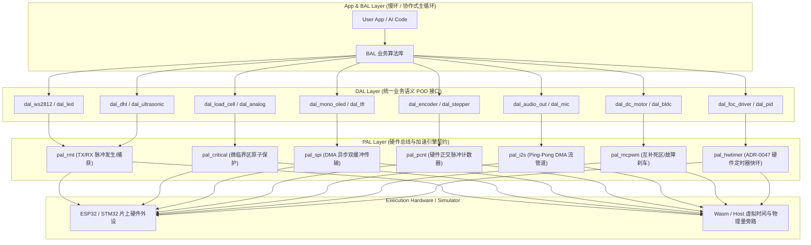

# 嵌入式外设时序分类体系与 wink-micro-os DAL/PAL 架构演进全景指南

| 元数据项 | 说明 |
| :--- | :--- |
| **文档编号** | ARCH-GUIDE-2026-08-01 |
| **所属模块** | `wink-micro-os`（DAL / PAL / OSAL / Runtime） |
| **关联决策** | ADR-0002（双Target同源）、ADR-0003（仿真可信度边界）、ADR-0004（静态分发）、ADR-0007（协作式主循环）、ADR-0012（契约诚实）、ADR-0017（阻塞API硬隔离）、ADR-0047（FOC ISR与pal_hwtimer） |
| **目标受众** | 嵌入式内核架构师、驱动开发工程师、AI Codegen 引擎设计者 |
| **状态** | **Draft / Architecture RFC** |

---

## 摘要（Executive Summary）

在低代码与跨平台嵌入式运行时（`wink-micro-os`）中，**器件抽象层 (DAL)** 承载着业务语义转换的核心使命。然而，微控制器物理外设的时序要求跨越了从**数百纳秒到数百毫秒**的 6 个数量级，且控制模式涵盖了**纯软件翻转、硬件状态机、DMA 管道与硬件互锁闭环**。

本文档系统性地解构嵌入式外设的时序本质，将工程实践中碎片化的“经验分类”升华为**严密的学术多维正交分类体系**，正式确立了覆盖嵌入式领域的 **8 大外设时序类别**。针对每一类别，深入剖析了目前 `wink-micro-os` 代码库中的现存问题、失效机理，并给出了具体、可落地的体系结构级演进方案与 To-Do 清单。

---

## 一、外设时序分类体系构建：工程经验 vs 学术理论

### 1.1 学术理论基石（4 个正交维度）

在计算机体系结构与实时系统（RTS, Real-Time Systems）理论中，外设时序由以下 4 个正交维度唯一定义：

```text
                           外设时序形式化 4 维正交空间
                                       │
         ┌─────────────────────────────┼─────────────────────────────┐
         ▼                             ▼                             ▼
【维度 1：时钟同步机制】       【维度 2：时序约束严格度】     【维度 3：硬件解耦与执行主体】
(Synchronization Paradigm)     (Timing Strictness)          (Decoupling & Execution Mode)
 • 显式源同步 (Source-Sync)     • 亚微秒硬时隙 (Hard-Slot)    • CPU紧耦合 (Bit-Banging)
 • 异步过采样 (Asynchronous)    • 有界窗口型 (Bounded-Window) • 硬件状态机 (RMT/PIO/DMA)
 • 脉宽/自时钟 (Self-Clocked)   • 速率弹性 (Rate-Elastic)     • 硬件互锁闭环 (TRGO Pipeline)
```

1. **维度 1：时钟同步机制（Synchronization Paradigm）**
   - **显式源同步（Source-Synchronous）**：独立时钟线（SCL/SCK），由时钟沿锁定数据，需满足建立/保持时间（$t_{su}/t_h$）。支持时钟延展。
   - **异步过采样（Asynchronous Oversampled）**：无时钟线，靠名义波特率与起始沿过采样对齐，容差 $\pm 2\% \sim \pm 3\%$。
   - **脉宽调制自同步（Self-Clocking / Pulse-Duration Encoded）**：时钟内嵌于高低电平持续时间，单沿对齐，绝对时间极度敏感。
2. **维度 2：时序约束严格度（Timing Strictness & Jitter Budget）**
   - **硬实时时隙（Hard Time-Slot）**：超出微秒/纳秒级窗口即产生物理失效（如通信帧错、逆变器直通）。
   - **有界窗口型（Bounded Window）**：存在允许的 $t_{min} \sim t_{max}$ 范围，只要不超时或不早退即安全。
   - **速率弹性型（Rate-Elastic）**：仅约束平均吞吐率，瞬时抖动（Jitter）由 FIFO/缓冲吸收，不影响功能正确性。
3. **维度 3：硬件解耦与执行主体（Execution Offloading Mode）**
   - **CPU 紧耦合（CPU Bit-Banging）**：依赖 CPU 顺序指令与忙等延时，与抢占式多任务系统天然冲突。
   - **硬件协处理（Autonomous Coprocessor / DMA / PIO）**：CPU 仅配置描述符，波形由硬件引擎生成，时序精度绑定晶振。
   - **硬件互锁闭环（Hardware-Triggered Pipeline）**：零 CPU 介入的事件级联（如 PWM TRGO 触发 ADC）。
4. **维度 4：多通道空间相位关系（Spatial & Phase Alignment）**
   - **独立单通道（Independent Channel）**：无跨引脚严格时钟相位依赖。
   - **多通道绝对相位对齐（Phase-Aligned / Complementary）**：多路 PWM 具备纳秒级对称性与死区插入。

---

### 1.2 完整映射表：工程经验分类 <---> 学术 4 维正交分类

| # | 类别名称 | 工程经验描述 | 学术正交分类定义 (时钟 ✕ 约束 ✕ 卸载 ✕ 空间) | 典型容差预算 (Jitter Budget) | 代表外设 |
| :- | :--- | :--- | :--- | :--- | :--- |
| **1** | **纳秒脉宽自时钟型** | 极窄脉冲、单线控制、中断一打就花屏 | 脉宽自同步 ✕ 硬实时时隙 ✕ 必须硬件协处理 ✕ 独立 | $\pm 150\text{ns}$ | WS2812B, SK6812, 红外 NEC TX |
| **2** | **微秒单总线握手型** | 慢速单线、双向握手、抢占会导致读数错 | 异步自同步 ✕ 有界窗口/硬时隙 ✕ 临界区/硬件捕获 ✕ 独立 | $\pm 2\text{µs} \sim \pm 10\text{µs}$ | DHT11/22, DS18B20, 单引脚超声波 |
| **3** | **慢速同步串行型** | 慢速双线、时钟由CPU抖出来、掉电易死锁 | 显式源同步 ✕ 有界窗口 ✕ CPU紧耦合+微临界区 ✕ 独立 | $t_{high} < 60\text{µs}$ | HX711, TM1637, MAX7219, 74HC595 |
| **4** | **高速总线流传输型** | 屏幕/存储器、大数据块、刷屏耗尽CPU | 显式源同步/异步 ✕ 速率弹性 ✕ 硬件控制器+DMA ✕ 独立 | 毫秒级 (依赖FIFO深度) | SSD1306/ST7789 SPI, SPI Flash, GPS UART |
| **5** | **高频边沿事件计数型**| 旋转编码器/测速、高频中断致CPU瘫痪 | 异步外部事件 ✕ 硬实时吞吐 ✕ 硬件定时器/PCNT ✕ 双通道正交 | 零丢步要求 ($>10\text{kHz}$) | 光电正交编码器, 霍尔测速, 流量计, 红外RX |
| **6** | **连续等时流式传输型**| 音频播放/录音、连续波形、长期不可漂移 | 显式源同步等时 ✕ 零累积相位漂移 ✕ 双缓冲DMA ✕ 独立/立体声 | $\Delta t \approx 0$ (严格固定采样率) | I2S 音频 DAC (MAX98357A), I2S 麦克风, DAC DMA |
| **7** | **多轴相位互补驱动型**| 电机驱动、防炸管、需要互补和死区 | 硬件定时器同步 ✕ 纳秒级安全互锁 ✕ 硬件PWM发生器 ✕ 多轴相位对齐 | 死区误差 $< 50\text{ns}$ | 三相无刷逆变桥, H桥电机驱动, 互补PWM |
| **8** | **高频闭环互锁管线型**| FOC/高频控制环、10kHz以上、PWM与ADC联动 | 周期性硬实时 ✕ 严格时钟窗口 ✕ 硬件级联触发+快慢环隔离 ✕ 跨外设互锁 | 采样延迟 $< 1\text{µs}$ | SimpleFOC 电流环 (10~20kHz), 步进电机脉冲发生 |

---

## 二、8 大外设类型深度剖析与架构解决方案



---

### 第 1 类：纳秒级脉宽自时钟编码外设（WS2812B / 红外 TX）

#### 1. 学术定义与时序特征
- **时钟机制**：脉宽调制单线自同步（NRZ 编码）。
- **容差要求**：$T_{0H} = 350\text{ns} \pm 150\text{ns}$, $T_{0L} = 800\text{ns}$, $T_{1H} = 700\text{ns} \pm 150\text{ns}$, $T_{1L} = 600\text{ns}$，Reset 间隔 $> 50\text{µs}$。
- **系统影响**：禁止单字节间产生 $>50\text{µs}$ 的暂停；一旦被抢占，低电平拉长即被硬件判定为 Frame Reset，导致颜色错位与闪烁。

#### 2. 目前 `wink-micro-os` 存在的问题
- **PAL 层无脉冲序列发射抽象**：目前仅有 `pal_rmt_pulse_capture`（接收捕获），**没有 RMT 发送（TX）抽象**。
- **软件模拟不可行**：在 C 语言层调用 `pal_gpio_write`（ESP32 上耗时约 400~600ns）无法满足 350ns 窄脉冲要求；若在多任务 RTOS 下关中断发射长灯带（如 100 颗灯需 $30\text{µs} \times 100 = 3\text{ms}$），会导致系统其他中断严重滞后并违反实时性。

#### 3. 架构解决方案
- **PAL 扩展**：在 `pal_rmt.h` 中增加 `pal_rmt_tx_symbols()` 接口，将字节流转化为 RMT 硬件脉冲符号。
- **备选硬件方案**：在无 RMT 的平台（如 STM32/RP2040），利用 **SPI MOSI 模拟**（SPI 运行在 2.4MHz~3.2MHz，用 3~4 个 SPI bit 模拟 1 个 WS2812 bit）结合 DMA 发送。
- **仿真对齐（ADR-0003）**：Wasm 仿真端不模拟纳秒波形，DAL 将 RGB 缓冲区经 `wasm_bridge` 直接透传为 WebGL / Canvas 渲染像素。

---

### 第 2 类：微秒级单总线自同步半双工外设（DHT11/22 / DS18B20）

#### 1. 学术定义与时序特征
- **时钟机制**：异步电平握手 + 脉冲宽度鉴频（Bit 0 为 26µs 高电平，Bit 1 为 70µs 高电平）。
- **容差要求**：脉冲识别窗口 $\pm 10\text{µs}$，单次完整读数持续约 4~5ms。

#### 2. 目前 `wink-micro-os` 存在的问题
- **长忙等阻塞破坏协作式主循环**：若在 DAL 采用传统 Arduino 式 `while(gpio_read())` 忙等（约 4ms），严重违反 [ADR-0017 阻塞 API 硬隔离](file:///d:/MyWorkSpace_program/lowcode-nocode/ai-app/wink-ai-embedded/docs/decisions/core/0017-blocking-api-hard-isolation.md)。
- **抢占导致校验失败**：若不关中断，FreeRTOS 1ms Tick 中断介入会导致 26µs 脉冲被测量为 1026µs，导致 Checksum 持续校验错误。

#### 3. 架构解决方案
- **方案 A（硬件卸载，推荐）**：使用 `pal_rmt` 配置为输入捕获模式，一次性硬件捕获 40 个边沿时间序列，DAL 仅需在线性数组中做脉宽分类（$\text{width} > 40\text{µs} \implies 1$，否则 $\implies 0$）。
- **方案 B（状态机化 + 微临界区）**：若无硬件 RMT，将发起 Start 脉冲与读取拆分为异步状态机（`request` $\to$ 定时器等待 18ms $\to$ 关中断极速读取 4ms $\to$ 恢复中断），并将 API 标为 `WINK_BLOCKING` 放入内部工作线程。

---

### 第 3 类：慢速同步串行外设（HX711 / TM1637 / 74HC595）

#### 1. 学术定义与时序特征
- **时钟机制**：主机显式提供 SCK 时钟，沿时钟边沿移位输入/输出。
- **容差要求**：时钟建立/保持时间宽裕（微秒级），但**存在高电平上限窗口**（如 HX711 要求 $t_{high} < 60\text{µs}$，超时强制掉电复位）。

#### 2. 目前 `wink-micro-os` 存在的问题
- **源码隐患**：[`dal_load_cell.c:168-181`](file:///d:/MyWorkSpace_program/lowcode-nocode/ai-app/wink-ai-embedded/wink-micro-os/dal/src/sensor/dal_load_cell.c#L168-L181) 中的 24-bit 循环没有临界区保护：
  ```c
  for (int i = 0; i < 24; i++) {
      pal_gpio_write(dev->config.sck_pin, PAL_GPIO_LEVEL_HIGH);
      pal_os_busy_wait_us(1);
      /* ... 若在此处被 RTOS 调度抢占 > 60us，HX711 立即掉电复位 ... */
      pal_gpio_write(dev->config.sck_pin, PAL_GPIO_LEVEL_LOW);
      pal_os_busy_wait_us(1);
  }
  ```
- **故障现象**：在多任务或开启 Wi-Fi 情况下，称重传感器周期性读出 `0x7FFFFF` 或 `0x000000` 乱码。

#### 3. 架构解决方案
- **轻量临界区保护**：在 24-bit 循环外部包裹 `PAL_CRITICAL_SECTION({ ... })`。24 次翻转总耗时仅约 $24 \times 2\text{µs} = 48\text{µs}$，远在系统关中断安全阈值（$<100\text{µs}$）以内，彻底杜绝掉电事故。
- **硬件 SPI 映射**：若硬件引脚支持，配置硬件 SPI 控制器以 1MHz 纯接收模式读取 3 字节，完全卸载 CPU。

---

### 第 4 类：高速总线流传输外设（SSD1306/ST7789 SPI / Flash / UART）

#### 1. 学术定义与时序特征
- **时钟机制**：高频硬件同步总线（SPI 10MHz~80MHz）或异步串口（UART 115200~921600）。
- **容差要求**：速率弹性型，依赖硬件控制器保证建立保持时间，核心瓶颈在 **CPU 吞吐量与帧耗时**。

#### 2. 目前 `wink-micro-os` 存在的问题
- **缺少 `pal_spi.h` 抽象**：[`dal_mono_oled.c:64-92`](file:///d:/MyWorkSpace_program/lowcode-nocode/ai-app/wink-ai-embedded/wink-micro-os/dal/src/display/dal_mono_oled.c#L64-L92) 采用纯 GPIO 软件模拟 SPI 写入：
  - 刷新一帧 128x64 图像（1024 字节）需执行 24,576 次 GPIO 读写，在 ESP32 上耗时 **30ms ~ 50ms**。
  - 这严重破坏了 [ADR-0007](file:///d:/MyWorkSpace_program/lowcode-nocode/ai-app/wink-ai-embedded/docs/decisions/core/0007-cooperative-loop-execution-model.md) 协作式主循环的 10ms Tick 预算，频繁触发 `WINK_WARN_TICK_OVERRUN`。

#### 3. 架构解决方案
- **建立 `pal_spi.h` 统一契约**：
  ```c
  /* PAL SPI 异步传输契约 */
  wink_status_t pal_spi_init(uint8_t port, const pal_spi_config_t *cfg);
  wink_status_t pal_spi_transmit_dma(uint8_t port, const uint8_t *data, size_t len, pal_spi_callback_t cb, void *arg);
  ```
- **双缓冲异步刷新**：DAL 维护前台/后台显存缓冲，`dal_mono_oled_flush()` 将显存指针交给 SPI DMA 后立即返回，由 DMA 硬件在后台 1ms 内自动搬运完毕，CPU 占用降至 0.1%。

---

### 第 5 类：高速脉冲输入与事件捕获外设（正交编码器 / 霍尔测速）

#### 1. 学术定义与时序特征
- **时钟机制**：外部物理运动驱动的异步脉冲输入。
- **容差要求**：硬实时吞吐要求，任何脉冲边沿丢失均会导致角度/位置累积误差（失步）。

#### 2. 目前 `wink-micro-os` 存在的问题
- **GPIO 中断开销不可持续**：[`dal_encoder.c:47-59`](file:///d:/MyWorkSpace_program/lowcode-nocode/ai-app/wink-ai-embedded/wink-micro-os/dal/src/sensor/dal_encoder.c#L47-L59) 在 Pin A 上升沿触发 CPU 软中断。
- **极限工况失效**：当电机转速达到 3000 RPM、光电码盘 500 线时，脉冲频率高达 $25\text{kHz}$（4倍频达 $100\text{kHz}$）。频繁的中断上下文切换直接导致 CPU 负荷 100%，并在中断延迟（Latency）抖动时漏计脉冲。

#### 3. 架构解决方案
- **引入 `pal_pcnt.h`（硬件脉冲计数器）**：
  - 适配 ESP32 硬件 PCNT 单元和 STM32 定时器 Encoder 模式（TIM_ENCODERMODE_TI12）。
  - 硬件具备滤波与双向增减计数功能，无需 CPU 介入任何中断。上层 `dal_encoder_get_count()` 仅做一次寄存器读取。

---

### 第 6 类：连续等时流式传输外设（I2S 音频 DAC / ADC）

#### 1. 学术定义与时序特征
- **时钟机制**：等时传输（Isochronous），主时钟 MCLK、位时钟 BCLK、左右声道选择时钟 WS 紧密耦合。
- **容差要求**：严格固定采样率（如 44.1kHz），要求**长期零累积相位抖动**，任何几微秒的时钟停顿都会产生爆音（Audio Glitch）。

#### 2. 目前 `wink-micro-os` 存在的问题
- 框架完全缺少音频流与等时连续传输通道，`pal_osal` 与 `wink_runtime` 仅面向离散事件和单次采样设计。

#### 3. 架构解决方案
- **新增 `pal_i2s.h` 抽象**：封装硬件 I2S 控制器与双缓冲 Ping-Pong DMA 管道。
- **DAL 环形缓冲解耦**：DAL 提供非阻塞 `dal_audio_write_async()`，将 PCM 音频块写入环形队列，由 DMA 中断自动衔接缓冲块，主循环仅需在 10ms 慢环中补充数据。

---

### 第 7 类：多轴相位对齐与死区互补驱动外设（BLDC 逆变器 / H 桥）

#### 1. 学术定义与时序特征
- **时钟机制**：中心对齐互补 PWM（Center-Aligned Complementary PWM）。
- **容差要求**：上桥臂与下桥臂开关信号之间必须插入严格的**纳秒级硬件死区时间（Dead-Time，典型 200ns ~ 1000ns）**，且故障信号（nFAULT/Overcurrent）必须能在 **亚微秒级（$<500\text{ns}$）** 硬件直连关断 PWM。

#### 2. 目前 `wink-micro-os` 存在的问题
- [`pal_pwm_init_ex`](file:///d:/MyWorkSpace_program/lowcode-nocode/ai-app/wink-ai-embedded/wink-micro-os/pal/include/hal/pal_hal.h#L91) 目前仅支持单端独立 PWM（基于 ESP32 LEDC），无法配置互补通道与死区；若直接用两路独立 PWM 驱动半桥，由于时钟相位无法绝对保证，极易导致上下桥臂直通短路烧毁功率器件。

#### 3. 架构解决方案
- **引入 `pal_mcpwm.h`（电机专用高级 PWM 控制器）**：
  - 支持 3 对互补通道配对；
  - 硬件自动插入纳秒级死区发生器（Dead-time Generator）；
  - 绑定硬件故障刹车输入（Fault Break Event），发生过流时硬件瞬间拉低栅极电平，无需软件干预。

---

### 第 8 类：高频闭环控制与硬件互锁管线外设（SimpleFOC / 步进多轴插补）

#### 1. 学术定义与时序特征
- **时钟机制**：周期性硬实时快环（10kHz ~ 20kHz） + 跨外设事件级联触发（PWM TRGO $\to$ ADC 采样）。
- **容差要求**：ADC 采样时刻必须与 PWM 调制周期中心完全同步（消除开关噪声），电流环计算延迟必须确定（$<50\text{µs}$）。

#### 2. 目前 `wink-micro-os` 存在的问题
- 系统目前仅有 10ms 协作式 App Loop，无法支撑 10kHz 的 FOC 快环。
- 虽然 [ADR-0047](file:///d:/MyWorkSpace_program/lowcode-nocode/ai-app/wink-ai-embedded/docs/decisions/core/0047-foc-isr-layering-and-pal-hwtimer.md) 已经规划了 `pal_hwtimer`，但目前代码库中尚无生产实现。

#### 3. 架构解决方案
- **全面落实 ADR-0047 快慢环隔离架构**：
  - **快环（Fast Loop, 10kHz+）**：由 `pal_hwtimer` / MCPWM 硬件中断驱动，代码放入 `IRAM_ATTR`，执行 Clarke/Park 变换与 SVPWM 调制。快环严禁使用日志、动态分配或阻塞调用。
  - **慢环（Slow Loop, 10ms）**：用户 App 在主循环中通过 BAL（业务算法层）向快环下发目标速度/位置，并读取状态。

---

## 三、`wink-micro-os` DAL/PAL 时序架构演进路线图（To-Do List）

```text
========================================================================================
阶段 (Phase)      核心交付目标 (Milestone Deliverables)              优先级 (Priority)
========================================================================================
Phase 1 (稳固基座)  [x] HX711 等微秒 Bit-Bang 加微临界区保护 (P0)      CRITICAL (立即实施)
                   [ ] 扩展 pal_rmt 消除单例限制，支持多路脉冲捕获 (P0)  
----------------------------------------------------------------------------------------
Phase 2 (硬件补齐)  [ ] 建立 pal_spi 抽象契约与 ESP32/STM32 DMA 实现 (P1) HIGH (近期推进)
                   [ ] 建立 pal_pcnt 硬件脉冲计数器契约 (P1)
                   [ ] 扩展 pal_rmt 支持 TX 发送模式 (WS2812B 驱动) (P1)
----------------------------------------------------------------------------------------
Phase 3 (硬实时闭环) [ ] 落地 ADR-0047 pal_hwtimer 硬件定时器与 IRAM-safe (P1) MEDIUM
                   [ ] 建立 pal_mcpwm 互补死区与硬件刹车契约 (P2)
----------------------------------------------------------------------------------------
Phase 4 (流媒体扩展) [ ] 建立 pal_i2s 音频双缓冲 DMA 契约 (P3)        LOW (按需演进)
========================================================================================
```

### 具体待办实施清单（Actionable Tasks）

- [ ] **Task 1-1（修复 HX711 掉电死锁）**：在 `dal_load_cell.c` 的 24-bit 移位循环两端增加 `PAL_CRITICAL_SECTION` 宏，消除 RTOS 调度导致的时序越界。
- [ ] **Task 1-2（消除 RMT 单例限制）**：重构 `pal_rmt.h`，引入 `pal_rmt_channel_handle_t`，支持多个超声波和红外接收实例共存。
- [ ] **Task 2-1（交付 `pal_spi` 核心契约）**：
  - 新增 `pal/include/hal/pal_spi.h`；
  - 在 `targets/esp32/pal_hal_spi_esp32.c` 实现 SPI Master + DMA 传输；
  - 重构 `dal_mono_oled.c`，彻底移除 `spi_bitbang_write`，接入 DMA 异步刷新。
- [ ] **Task 2-2（交付 `pal_pcnt` 硬件计数器）**：
  - 新增 `pal/include/hal/pal_pcnt.h`；
  - 改造 `dal_encoder.c`，优先尝试绑定硬件 PCNT 通道，无法分配时降级为 GPIO 中断。
- [ ] **Task 2-3（交付 WS2812B 驱动）**：
  - 在 `pal_rmt.h` 增加 TX 脉冲发生 API；
  - 新增 `dal/src/output/dal_ws2812.c`，通过 RMT 硬件发射纳秒脉冲序列。
- [ ] **Task 3-1（生产落地 ADR-0047 `pal_hwtimer`）**：
  - 新增 `pal/include/hal/pal_hwtimer.h`；
  - 实现 ESP32 GPTimer / MCPWM 硬件中断快环绑定与 `PAL_ISR` IRAM 安全隔离。

---

## 四、结语

通过将外设时序清晰划分为 **8 大学术与工程正交类别**，我们彻底厘清了微控制器外设控制的物理本质：
> **“软件 Bit-Banging 是多任务 OS 中的权宜之计，硬件协处理与快慢环隔离才是高精度时序控制的根本归宿。”**

本方案在严格恪守 `wink-micro-os` **“编译期静态分发（ADR-0004）”** 与 **“双 Target 同源保真（ADR-0002/0003）”** 架构原则的前提下，为平台补齐了高精度物理时序的硬件基座，为从简单的传感器演示迈向高可靠工业级物联网应用奠定了坚实的架构基础。
