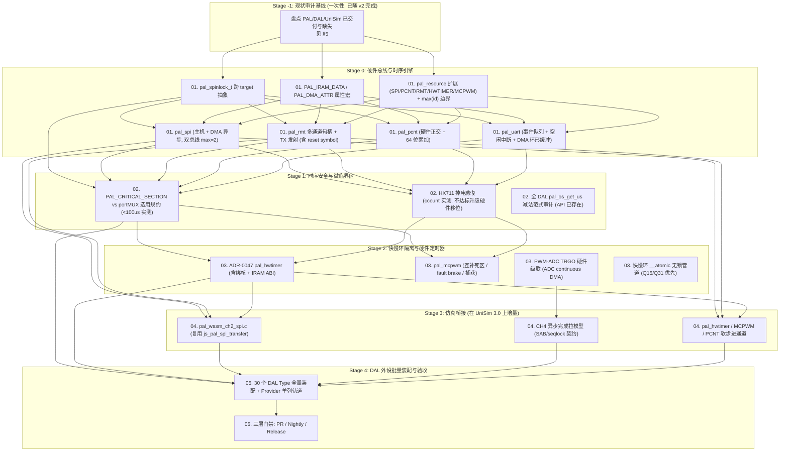

# 嵌入式硬件时序基础设施与 DAL 外设工程主计划（Master Plan）

| 元数据项 | 说明 |
| :--- | :--- |
| **文档编号** | PLAN-TIMING-INFRA-2026-M0 |
| **所属模块** | `wink-micro-os`（PAL / HAL / OSAL / DAL / UniSim Bridge） |
| **理论基线** | [`peripheral-timing-classification-and-dal-architecture-guide.md`](../peripheral-timing-classification-and-dal-architecture-guide.md)（8+1 阶时序分类） |
| **外设标准** | [`00.1-category-type-variant-wokwi-ssot.md`](../../implementation-plans/wokwi-dal-type-coverage-type/00.1-category-type-variant-wokwi-ssot.md)（30 Type SSOT，见 §6 计数说明） |
| **状态** | **Approved / Execution Ready（v3，经架构师评审修订）** |
| **最后更新** | 2026-08-23 |
| **Target Scope** | ESP32 classic (ESP32-WROOM-32 / DevKitC, Xtensa LX6 dual-core)。ESP32-S2/S3/C3 等 variant **不在本路线图范围**；后续独立适配。Host = x86_64 Linux/macOS，Wasm = emscripten wasm32。 |

---

## 1. 计划背景与愿景

在低代码与跨平台嵌入式运行时（`wink-micro-os`）中，**器件抽象层 (DAL)** 统一暴露语义化 POD API，屏蔽底层物理引脚细节。然而，物理外设时序跨越 **100 ns ~ 100 ms**，涵盖单总线微秒 Bit-Bang、硬件 SPI-DMA 传输、硬件正交脉冲捕获到 10~20 kHz FOC 电流环。

为消除当前代码库中的**长忙等击穿 10 ms Tick、多任务下 Bit-Bang 时序撕裂、缺失硬件 SPI/PCNT/MCPWM 导致 CPU 过载丢步**等结构性问题，本计划采用**“基础设施与时序引擎先行，DAL 外设批量装配”**路线。

> **核心原则**：
> 1. **底座先行**：先完成 PAL 硬件加速总线、微临界区保护、快慢环调度隔离和 Wasm 仿真桥接基础设施；
> 2. **现状优先**：所有 Stage 任务以 §5 的 Stage -1 审计基线为准，已交付能力不重复立项；
> 3. **DAL 批量装配**：具体的 DAL 外设驱动严格遵循 SSOT 及分外设计划推进，DAL 驱动只做“业务组装”，物理时序由底层引擎保障。

---

## 2. 计划结构与分阶段文档索引

```text
docs/todolist/timing-infrastructure-and-dal-roadmap/
├── 00-master-plan.md                                   # [本文件] 总纲、依赖拓扑、审计基线、验收门禁
├── 01-stage0-pal-hardware-acceleration-engines.md      # Stage 0：PAL 硬件加速引擎 (SPI-DMA / RMT 多通道+TX / PCNT / MCPWM / UART-DMA / IRAM-data)
├── 02-stage1-timing-safety-and-critical-section.md     # Stage 1：微秒级时序安全、微临界区加固、HX711 掉电修复
├── 03-stage2-fast-slow-loop-and-hwtimer.md             # Stage 2：快慢环隔离、ADR-0047 pal_hwtimer、MCPWM 互补死区、IRAM-safe
├── 04-stage3-wasm-simulation-virtual-timing-bridge.md  # Stage 3：在 UniSim 3.0 既有桥接上补齐新 PAL 模块通道 (ADR-0003)
└── 05-stage4-dal-peripheral-rollout-and-testing.md     # Stage 4：DAL 外设全量装配与三层 CI 门禁
```

> **阶段顺序说明**：理论基线 guide 把“时序安全（Phase 1）”排在“硬件引擎（Phase 2）”之前。本路线图将硬件引擎列为 Stage 0 先行，是因为 Stage 1 的 HX711 修复若实测临界区超标需升级为 RMT/SPI 硬件移位，依赖 Stage 0 先落地；同时 WS2812/编码器等驱动的正确实现本身就需要 RMT TX / PCNT。两阶段紧耦合，顺序不影响安全规约先行的原则。

---

## 3. 依赖拓扑与实施流水线

> **T0.0 开工前阻塞项（Blocker）**：以下三项必须在 Stage 0 任何代码动工之前关闭，否则所有 PR Gate 失去基础：
> 1. **确认 `wink lint` 工具与规则路径**：ADR-0043 写 `tools/lint/rules/`，UniSim 文档写 `wink-tools/tools/lint/rules/`，仓内 `Glob **/lint/rules/*.yaml` 当前**零命中**。由 wink-tools owner 在 Stage 0 启动前给出真实路径并在 CI 跑通空规则集；未关闭前 Stage 0 T0.8 视为阻塞。
> 2. **建立四 target 编译矩阵**：IDF 5.4 / IDF 6.0 / host / wasm 四路 CI 必须在 Stage 0 首个 PR 前可用。
> 3. **验证 `_Static_assert` 跨 target**：用一个已知尺寸结构体在四路编译中触发断言，确认三 target 行为一致。



---

## 4. 各阶段交付成果与里程碑

| 阶段 | 核心任务与基础设施交付 | 关联时序类别 | 预期产出 |
| :--- | :--- | :--- | :--- |
| **Stage -1** | 一次性现状审计，结论固化在本文 §5 与各 Stage 文档 | 全部 | 已交付/部分/缺失基线表，防止重复立项 |
| **Stage 0** | `pal_spinlock_t`、`PAL_IRAM_DATA/PAL_DMA_ATTR`、`pal_spi`、`pal_rmt`(多通道+TX)、`pal_pcnt`、`pal_uart`(事件队列)、`pal_resource` 扩展+max 边界 | Class 1 / 4 / 5 | 6 个 HAL 头 + ESP32/Host/Wasm 三 target 适配 + CMake 依赖更新 + 各资源 max 静态断言 |
| **Stage 1** | 临界区选用规约、HX711 修复、64 位时钟减法范式全 DAL 审计 | Class 2 / 3 | 微临界区安全规约；HX711 压测达标；DAL 无 32 位时间戳 |
| **Stage 2** | ADR-0047 `pal_hwtimer`、`pal_mcpwm`、PWM-ADC TRGO、`__atomic` 无锁管道 | Class 7 / 8 | 硬件定时器快环契约 + MCPWM 互补死区 + 快慢环锁无关 |
| **Stage 3** | `pal_wasm_ch2_spi.c`、CH4 异步完成拉模型契约、hwtimer/MCPWM/PCNT 软步进通道 | 仿真全外设同源 | 三 target 行为对齐；零新增 `#ifdef SIMULATION` 业务代码 |
| **Stage 4** | 30 DAL Type 装配（Provider 单列）+ 三层 CI 门禁 | 全量 | 完整 DAL 驱动库、lint/host/wasm/真机量化门禁 |

---

## 5. Stage -1 现状审计基线（v2 新增）

本节是路线图 v2 的事实基线。各 Stage 文档中的“现状/交付物”描述必须与本表一致；与本表冲突者以本表为准。

### 5.1 PAL 基座：已交付 / 部分 / 缺失

| 能力 | 状态 | 证据 / 缺口 |
|---|---|---|
| GPIO / PWM / I2C（合并于 `pal_hal.h`） | ✅ | `pal/include/hal/pal_hal.h`；PWM 走 LEDC 低速、中断禁用、无死区/互补/break |
| ADC oneshot + 校准 | 🟡 | `pal_adc.h`；仅 oneshot，无 continuous/DMA/TRGO |
| `pal_pwm_router`（ADR-0034） | ✅ | `pal_pwm_router.h`；4 定时器 refcount |
| `pal_rmt` 脉冲捕获 | 🟡 | 单例、RX-only、无 TX、`with_dma=false`（`targets/esp32/pal_hal_rmt_esp32.c:72`） |
| `pal_uart` 基础流 | 🟡 | 轮询读、`uart_driver_install(..., 0, NULL)` 无事件队列（`pal_hal_uart_esp32.c:42`） |
| `pal_os_get_us/get_ms` 64 位单调时钟 | ✅ | 已返回 `uint64_t`（`pal_osal.h:42,48`），Stage 1 不重建 |
| 临界区双机制 | ✅ | OSAL `pal_os_critical_enter/exit`（FreeRTOS portMUX，SMP 安全）vs IRQ `PAL_CRITICAL_SECTION`（本核中断屏蔽，非跨核互斥）—— 选用规约见 Stage 1 |
| `PAL_ISR` / `PAL_DEFINE_ISR` | ✅ | `pal_irq.h:83-113` |
| IRQ allocator | 🟡 | 硬编码仅软件中断 7/8（`pal_irq_esp32.c:61-63`），外设中断无法走 `pal_irq_enable` |
| `PAL_IRAM_DATA` / `PAL_DMA_ATTR` / IRAM rodata 抽象 | ❌ | `wink_compiler.h` 仅有 `WINK_WEAK`；DMA 描述符无放置宏 |
| 可移植原子 / spinlock | 🟡 | 仅 ESP32 私有 `pal_atomic_esp32.h`（u32 inc/dec/load）；无跨平台 `pal_atomic.h`；无 `pal_spinlock`；5 处 `.c` 直接 `portMUX_TYPE mux = portMUX_INITIALIZER_UNLOCKED` 污染 target 私有细节（`pal_resource_esp32.c:1`、`pal_hal_gpio/i2c/adc_esp32.c`、`pal_osal_freertos_esp32.c`） |
| `pal_resource` API 形态 | ✅ 存在但命名为 `claim/release/is_claimed`（非 `take/release`），`pal_resource_max(type)` **不存在**；多实例 ID 无 target-specific 上界校验 |
| `pal_spi` | ❌ | 无头文件、无 TU、未进 REQUIRES；wasm 端 `js_pal_spi_transfer` 已声明但无 C PAL |
| `pal_pcnt` | ❌ | 编码器当前走 GPIO ISR 软件计数（`dal_encoder.c:47-59`） |
| `pal_hwtimer`（ADR-0047） | ❌ | 树内无任何符号；ADR-0047 C2 未完成 |
| `pal_mcpwm` | ❌ | 无互补/死区/break/capture |
| `pal_i2s`（Class 6） | ❌ | 无头无实现；本路线图暂不立项，audio DAL 用 stub 返回 UNSUPPORTED（ADR-0012），独立计划另行排期 |
| `pal_resource` 仲裁范围 | 🟡 | 仅 GPIO_PIN/PWM_CHANNEL/I2C_PORT/I2C_ADDR/UART_PORT/ADC_CHANNEL；SPI/PCNT/RMT/HWTIMER/MCPWM/MCPWM_SYNC 未纳入 |
| ESP-IDF 组件依赖 | 🟡 | `targets/esp32/CMakeLists.txt` REQUIRES 缺 `esp_driver_spi/pcnt/gptimer/mcpwm/gdma`；已有 IDF ≥5.4 / ≥6.0 版本门控分支可参照 |
| `wink lint` 规则 | ❌ | ADR-0043 引用 `tools/lint/rules/*.yaml`，UniSim 文档引用 `wink-tools/tools/lint/rules/*.yaml`，**仓内零命中**。Stage 0 启动前阻塞项（见 §3） |

### 5.2 DAL 现状（15 个真实驱动 + 1 个 BAL 伴生）

- **已落地且基本可用**：button、analog_knob、keypad、led、relay、buzzer、rc_servo、mono_oled（I2C variant）、ultrasonic（HCSR04 GPIO/RMT 初始化）。
- **部分落地 / variant 未完成**：dc_motor（仅 IN_IN）、encoder（仅 X1，X2/X4 返回 UNSUPPORTED）、mono_oled（SPI variant 走软件 bitbang，见下）。
- **Stub 全部返回 UNSUPPORTED**：gps（`dal_gps.c:14-42`）、eeprom（`dal_eeprom.c:15-78`）。
- **存在已知缺陷**：load_cell HX711 24-bit 移位循环**未包任何临界区**（`dal_load_cell.c:169-199`），与理论指南 Phase 1 `[x]` 标记矛盾；以代码为准，Stage 1 必修。
- **伪 DAL 测试**：`test_dal_ws2812_sim.c` 直接测 `pal_ws2812_write`（targets/wasm/ch4），无 `dal_ws2812` 驱动。
- **关键 bitbang 热点**：`dal_mono_oled.c:64-92` `spi_bitbang_write`，1024 字节刷屏约 17k 次 GPIO 调用（30~50 ms），Stage 0 `pal_spi` 落地后必须切换。
- **结构体字段对齐**：Stage 1 计划示例使用 `tare_offset_raw`、乘法 `calibration_factor`、`last_grams`、`last_sample_ms`，但实际结构体为 `zero_offset`、除法 `calibration_factor`、`last_weight_g`，且无时间戳字段。修复补丁必须以现有头文件为准。

### 5.3 UniSim / Wasm 现状

- **UniSim 3.0** 自 2026-08-02 Active；四层结构（overview/mechanisms/axes/assurance）齐备；成熟度标签 Landed/Partial/Stub/Planned。
- **虚拟时钟** 2026-06-29 Landed：`s_virtual_us`（`osal/wasm/pal_osal_wasm.c:33`）、唯一 Gate `wink_vclock_advance_internal`、导出 `pal_wasm_advance_virtual_clock`、Bigint 跨语言契约。Stage 3 不重建。
- **`wasm_bridge.h`** 387 行，按 Axis A–F 组织；ABI hash 纪律：任何新增 `js_pal_*` / `pal_wasm_*` 符号必须 bump `PAL_WASM_ABI_HASH`（当前 `0x50333036`，`pal_wasm_degradation.c:80`）并同步 TS `WasmImports/WasmExports`。
- **已存在的桥接符号**：`js_pal_spi_transfer`（line 97，Phase 4 T5 stub）、UART async RX（`pal_wasm_push_uart_rx_byte/error`、`pal_wasm_get_uart_rx_available`）、ADC（`js_pal_adc_read_norm` + RC/噪声）、WS2812（`js_pal_ws2812_write`）。
- **缺口**：无 `pal_wasm_ch2_spi.c`（SPI C PAL 未对接已有 JS import）；CH4 DMA/帧完成协议 Planned（SAB/seqlock/Atomics 未设计）；无 pal_hwtimer/MCPWM/PCNT 软步进通道。
- **DAL 零 `#ifdef SIMULATION`** 已达成（ADR-0003 合规日志 2026-08-02）；旁路下沉至 PAL Wasm + Plugin。
- **硬约束**：Axis E 禁止 C 同步调用链中 JS 重入；ABI #6 禁止 Asyncify 休眠态 host 调用；Stage 3 **严禁** DMA 同步回调，必须走 pull 模型（软中断 + Phase 0 排空）。

### 5.4 关键 ADR 索引（修正路径）

> 所有 ADR 位于 `docs/decisions/`，非 `docs/design/decisions/`。

| ADR | 路径 | 对本路线图的约束 |
|---|---|---|
| ADR-0001 | `docs/decisions/core/0001-error-code-sign-convention.md` | 负数错误码 |
| ADR-0002 | `docs/decisions/unisim/0002-dual-target-compilation.md` | 跨平台结构体**禁用位域 / `#pragma pack`** |
| ADR-0003 | `docs/decisions/unisim/0003-simulation-fidelity-boundary.md` | 旁路仅在物理量源头；虚拟时钟 Landed |
| ADR-0007 | `docs/decisions/core/0007-cooperative-loop-execution-model.md` | 10 ms Tick；Core 0 跑 Wi-Fi，Core 1 跑协作循环（不对称物理隔离） |
| ADR-0012 | `docs/decisions/core/0012-contract-honesty-over-silent-degradation.md` | 不做假就返回 `WINK_ERR_UNSUPPORTED` |
| ADR-0017 | `docs/decisions/core/0017-blocking-api-hard-isolation.md` | `WINK_BLOCKING` + `WINK_STRICT_NONBLOCKING` |
| ADR-0034 | `docs/decisions/core/0034-dal-progressive-config-disclosure.md` | PWM 共享定时器资源模型 |
| ADR-0043 | `docs/decisions/tools/0043-yaml-driven-layer-lint.md` | `wink lint --pack layering --pack api [--pack dal]` |
| ADR-0047 | `docs/decisions/core/0047-foc-isr-layering-and-pal-hwtimer.md` | pal_hwtimer / IRAM ABI / Q15-Q31 优先 / 两类 ISR / 仿真软步进 |

---

## 6. SSOT 计数与 Provider 边界说明

- SSOT 文档自称“32 个 DAL Type”，但表内实际编号 1~30 + 5b + 18b，共 **30 行**；`audio/i2s`（Class 6）在分类指南中存在但表内无行。
- Types 28~30（`io_expander` / `multiplexer` / `i2c_mux`）是 **Pin/Bus Provider**，按 SSOT §4.7 无应用层 C 驱动 API，不能套用 `dal_<type>_init/read/set` 模板。Stage 4 将其单列轨道，不计入“30 个驱动”交付计数。
- SSOT 状态矩阵存在已知偏差：gps/eeprom 标记 ✅ 但实为 stub；load_cell 标记 ❌ 但代码存在（有缺陷）。Stage 4 启动前需回写 SSOT 状态列。
- SSOT “每个 variant 100% 唯一时序类”不变式与表内双标签冲突（rgb_led `Class 0/7`、stepper step_dir `Class 5/7`、max7219_spi `Class 3/4`）。Stage 4 裁决：**时序类由 Type + Variant + Backend 三元组决定**；同一 variant 允许主类 + 副类标注，主类决定首选 PAL 引擎。

---

## 7. 全局时序质量验收红线（Gate Invariants）

所有代码必须强制遵守以下 **8 条硬红线**：

1. **红线 1：主循环 WCET 不超标（ADR-0007 / ADR-0017）**
   协作式主循环单 Tick（10 ms）内，任何 DAL 同步调用耗时 $< 2\text{ms}$，严禁超过 $5\text{ms}$ 的长忙等；长耗时走 DMA、状态机或后台线程。

2. **红线 2：关中断时间严格受限（Micro-Critical Section Invariant）**
   任何 `PAL_CRITICAL_SECTION` 原子区域 $< 100\text{µs}$，且必须以 ESP32 `xthal_get_ccount()` 实测（非纸面估算）；严禁临界区内 log/malloc/`pal_delay_ms`。HX711 修复若实测超标，升级为 RMT/SPI 硬件移位。

3. **红线 3：快环代码 IRAM 安全 + 数值类型锁定（ADR-0047 ABI Invariant）**
   `pal_hwtimer` 回调及其依赖必须 `PAL_ISR` 链入 IRAM，数据/描述符用 `PAL_IRAM_DATA`/`PAL_DMA_ATTR`；严禁访问 SPI Flash / 阻塞 / log / malloc。周期控制 ISR 数值类型 **Q15/Q31 定点优先**；若用 float 必须显式保存/恢复 Xtensa FPU 上下文（ADR-0047 R-006）。

4. **红线 4：双 Target 物理量替换同源（ADR-0002 / ADR-0003）**
   DAL 层严禁 `#ifdef SIMULATION` 旁路；所有状态机、换算、超时、解析两端 100% 同源。跨平台结构体禁用位域 / `#pragma pack`。

5. **红线 5：合约诚实（ADR-0012）**
   Target 无法履行头文件承诺时返回 `WINK_ERR_UNSUPPORTED` 或下调头文件契约；严禁伪造成功、严禁同步 DMA 回调破坏 Wasm 重入模型。

6. **红线 6：PAL 句柄生命周期与内存域约束**
   - PAL/DAL 句柄（`pal_spi_device_handle_t`、`pal_mcpwm_*_handle_t`、`pal_hwtimer` 等）只允许在 **init/acquire 阶段**分配；运行期（ISR、主循环 tick、DMA 完成回调）严禁 `malloc/free`；
   - 需要动态资源（DMA 描述符、channel 上下文）时使用**静态池**，容量由 target-specific `PAL_*_MAX` 宏在编译期固定；
   - DMA 缓冲必须 `PAL_DMA_BUF_ATTR`（内部 RAM + 字对齐，ESP32 classic 不可放 PSRAM，因为 GDMA 无法访问）；
   - 验收：`objdump`/`nm` 检查 ISR 路径目标文件中无 `malloc`/`free` 未解析符号；host TSan 8 h 长跑无 heap 增长。

7. **红线 7：多实例资源上限必须 target 静态可证（Static-Proven Resource Bounds）**
   - 每个 `pal_resource_type_t` 必须提供 `pal_resource_max(type) → uint32_t`，由 target 实现返回该硬件单元的真实上限（ESP32 classic: SPI bus=2、PCNT unit=8、MCPWM unit=2、MCPWM timer/unit=3、RMT channel=8、hwtimer=4、UART=3）；
   - `pal_resource_claim(type, id, owner)` 在 `id >= pal_resource_max(type)` 时返回 `WINK_ERR_INVALID_ARG`，并在 Debug 编译中 `assert`；
   - 编译期 `_Static_assert` 所有 `PAL_*_MAX` 常量不超过 target 硬件上限。

8. **红线 8：ISR 路径禁日志必须编译期可捕（ISR No-Log Static Enforcement）**
   - 三禁止（log/malloc/delay_ms）不仅是规约：
     - `PAL_ISR` / `PAL_DEFINE_ISR` 修饰的函数在 Debug 构建中通过编译器属性 `__attribute__((error("...")))` 或 wrapper 宏拦截 `pal_log*`/`malloc`/`pal_delay_ms` 直接调用；
     - CI 对 `targets/esp32/*.c` 中 `PAL_ISR` 函数体做 `nm`/`objdump` 调用图扫描，禁止引用 `pal_log`/`malloc`/`vprintf`；
   - Release 构建保留属性但不产生运行时开销。

---

## 8. 三层验收门禁

| 层级 | 触发 | 内容 | 超时预算 |
|---|---|---|---|
| **PR Gate** | 每个 PR | `python wink-tools/wink.py lint --pack layering --pack api`（DAL 改动加 `--pack dal`）；Host Unity 单测；Wasm 契约测试 + `wink_sim_stub.js` 导入表比对；ABI hash 不变性断言；`_Static_assert` ABI 尺寸；ISR no-log 调用图扫描；红线 6 heap 增长检查（host） | < 10 min |
| **Nightly Gate** | 每日 main | ESP32 DevKitC 真机冒烟：WS2812 脉宽、SPI 带宽、PCNT 零丢步、FOC 抖动；**pal_hwtimer 20 kHz + NVS/Flash 擦写并发 30 min（IRAM 快环在 cache 禁用期间不丢周期）**；TWDT 喂狗场景；Wasm Headless 确定性回放（同一种子两次结果 bit-exact） | < 2 h |
| **Release Gate**  | 版本发布 | 24 h WDT 多任务高并发压测；$2^{32}\,\text{µs} \approx 71.58\text{ min}$ 32 位溢出边界；全量逻辑分析仪量化；`test/wasm/` 全量；故障注入 L1/L2/L3；heap 水位 24 h 零增长 | < 24 h |

> 示波器 / 逻辑分析仪 / 24 h 压测不进入 PR Gate，避免人为串行化。

---

## 9. 跨 Stage 集成冒烟

每个 Stage 验收除模块级量化外，必须通过对应集成场景，防止"模块单测全绿但拼起来崩"：

| Stage | 集成冒烟 | 时长 | 通过判据 |
|---|---|---|---|
| Stage 0 | WS2812(RMT TX) + SPI OLED + PCNT encoder + UART GPS 四路并发 | 5 min | 零崩溃 / 零丢字节 / 编码器零丢步 / 帧计数连续 |
| Stage 1 | HX711 连续采样 + UART GPS + Wi-Fi 连接背景 | 10 min | HX711 零乱码 / 零掉电；GPS idle 分帧零丢失 |
| Stage 2 | FOC 20 kHz 快环 + ADC TRGO 电流采样 + BAL 慢环命令下发 + nFAULT 注入 | 1 min 闭环 | 速度稳态误差 < 5%；fault 到安全电平 < 1 µs；NVS 并发擦写期间快环不丢周期 |
| Stage 3 | App（OLED + HX711 + WS2812 + 编码器）在 wasm 与 ESP32 两端运行同一段 App | — | 字节级输出一致；同种子 Headless 两次回放 bit-exact |
| Stage 4 | 全量 Batch A~D 随机选 6 个驱动并发 | 30 min | WDT 不触发；heap 水位零增长；Nightly 量化全达标 |

---

## 10. 已知硬件 / IDF 勘误索引（持续更新）

| 编号 | 现象 | 影响 | 缓解 |
|---|---|---|---|
| E-001 | ESP32 classic PCNT 在无滤波时高频输入有 LEAKAGE 计数（silicon bug） | 编码器高速时偶发 ±1 偏差 | `glitch_filter_ns >= 1000`；Stage 0 T0.5 默认 1000 ns |
| E-002 | ESP-IDF < 5.2 `gptimer_set_alarm_action` 重装载行为差异 | hwtimer oneshot→period 切换可能丢首周期 | CMake 强制 IDF ≥ 5.4；不兼容则 `#error` |
| E-003 | ESP32 classic WS2812 RMT 非 DMA 模式在 40 MHz 主频漂移 | 长灯带（>150 LED）末段色彩错位 | TX 路径默认 `dma_enabled=true`（T0.4）；短灯带可显式关闭 |
| E-004 | ESP32 classic ADC continuous 不支持 MCPWM 作为硬件触发源（只有 S2/S3 支持） | T2.4 TRGO 在 classic 上退化 | `pal_adc_continuous_cfg_t.trigger_source` 字段按 `IDF_TARGET` 分支；classic 走 timer 触发，S2/S3 走 MCPWM（详见 Stage 2 T2.4） |
| E-005 | ESP32 classic DMA 通道按外设分组分配（SPI2/SPI3、UART、I2S、RMT 各有独立通道池），但具体池容量与芯片批次相关；评审中"GDMA 仅 2 通道"说法不准确，实际硬约束是 **支持 DMA 的 SPI 主机 = 2 个（SPI2/SPI3）** | 多个 SPI 屏/SDCard 同时启用 DMA 时第三个会 `WINK_ERR_NO_RESOURCES` | `pal_resource_max(PAL_RESOURCE_SPI_BUS)=2`；RMT TX DMA 与 SPI DMA 走独立通道池，不互斥，但 Stage 0 实现时需查 ESP32 Technical Reference Manual 核实并 `_Static_assert` |
| E-006 | Xtensa LX6 FPU 寄存器在 ISR 中不自动保存 | `pal_hwtimer` uses_fpu=true 时 trampoline 必须显式 `frsave`/`frrestor` | Stage 2 T2.2 强制；CI 用浮点已知 pattern 检测 |

新增勘误在实现过程中追加到本表，并回写对应 Stage 文档与 ADR follow-up。

