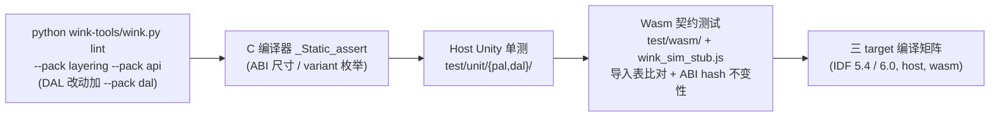

# 阶段 4 计划：DAL 外设全量装配与三层 CI 门禁

| 元数据项 | 说明 |
| :--- | :--- |
| **阶段编号** | STAGE-4-DAL-ROLLOUT-AND-CI |
| **所属模块** | `wink-micro-os/dal/`、`wink-micro-os/test/`、`wink-tools/tools/lint/`、CI |
| **参考 SSOT** | [`00.1-category-type-variant-wokwi-ssot.md`](../../implementation-plans/wokwi-dal-type-coverage-type/00.1-category-type-variant-wokwi-ssot.md) |
| **依赖 ADR** | [ADR-0002 双 Target 编译](../../decisions/unisim/0002-dual-target-compilation.md)、[ADR-0003 仿真边界](../../decisions/unisim/0003-simulation-fidelity-boundary.md)、[ADR-0012 合约诚实](../../decisions/core/0012-contract-honesty-over-silent-degradation.md)、[ADR-0017 阻塞硬隔离](../../decisions/core/0017-blocking-api-hard-isolation.md)、[ADR-0034 DAL 渐进式配置](../../decisions/core/0034-dal-progressive-config-disclosure.md)、[ADR-0043 YAML 分层 lint](../../decisions/tools/0043-yaml-driven-layer-lint.md)、[ADR-0047 FOC ISR 分层](../../decisions/core/0047-foc-isr-layering-and-pal-hwtimer.md) |
| **前置阶段** | Stage 0 / 1 / 2 / 3 全部合并 |
| **基线** | 树内现有 DAL 模块 15 个（非 16）；SSOT 表内编号 1~30 + 5b + 18b 共 **30 行**（非自称的 32）；audio/i2s（Class 6）在分类指南中存在但 SSOT 表内无行；gps/eeprom 是 stub 但被标 ✅，load_cell 有代码但被标 ❌ |
| **状态** | **Ready for Implementation** |

---

## 1. 阶段目标与策略

在 Stage 0~3 底座就绪后，按 SSOT 装配全量 DAL Type。DAL 层只做业务组装、状态机、物理量换算；位级时序由 PAL 引擎（SPI-DMA / RMT TX / PCNT / MCPWM / hwtimer）保障；仿真由 Stage 3 桥接对齐。

> **DAL 驱动编写细节**（POD 结构体、枚举、引脚映射、variant 拆分）严格参照 SSOT 与各外设实施计划，本路线图不重复。本阶段只负责**批次编排、依赖核对、门禁验收**。

---

## 2. SSOT 计数与分类裁决（先校正，再装配）

### 2.1 计数校正（与 SSOT owner 同步回写）

- SSOT 自称 "32 Type"，实际表内 **30 行**（编号 1~30 + 5b + 18b）。
- `audio/i2s`（Class 6 等时音频）在分类指南存在，表内无行。
- **裁决**：本阶段交付口径为 "30 个有应用层 C 驱动 API 的 Type + 3 个 Provider 基础设施 Type + 1 个后续独立立项的 audio Type"，共 34 个分类条目，但**标准 DAL 模板只套用 30 个**。在 Stage 4 启动前发 PR 回写 SSOT 第 101 行 "32" 为正确口径，并补 audio 行或明确标注 "后续独立计划"。

### 2.2 Provider 单列轨道

Types 28~30（`io_expander` / `multiplexer` / `i2c_mux`）按 SSOT §4.7 是 **Pin/Bus Provider**：
- 它们不暴露 `dal_<type>_init/read/set` 模板 API；
- 作用是在 `pal_resource` / 引脚映射阶段扩展可用引脚或总线；
- 作为基础设施配置项存在，不计入 "30 个 DAL 驱动" 计数；
- 由 `pal_resource` + 设备树（config）层处理，单独排期。

### 2.3 双时序类标签裁决

SSOT "每个 variant 100% 唯一时序类" 不变式与表内双标签冲突：
- `rgb_led` Class 0/7（GPIO 直驱 vs WS2812）
- `stepper` step_dir Class 5/7（软件步进 vs hwtimer 步进）
- `max7219_spi` Class 3/4

**裁决**：时序类由 **(Type, Variant, Backend)** 三元组决定。同一 variant 允许 "主类 + 副类" 标注，主类决定首选 PAL 引擎，副类标注回退路径。该裁决写入 SSOT 开头，替换 "100% 唯一" 措辞。

### 2.4 状态矩阵回写

Stage 4 启动前，按代码实况回写 SSOT 状态列：

| Type | SSOT 标注 | 代码实况 | 校正为 |
|---|---|---|---|
| gps | ✅ | `dal_gps.c:14-42` 全 `WINK_ERR_UNSUPPORTED` | 🟡 stub |
| eeprom | ✅ | `dal_eeprom.c:15-78` 全 `WINK_ERR_UNSUPPORTED` | 🟡 stub |
| load_cell | ❌ | 代码存在，HX711 有缺陷（Stage 1 T1.1 修复） | 🟡 partial |
| mono_oled (spi) | 未区分 variant | I2C 可用，SPI variant 走 bitbang（Stage 0 T0.3 后切换） | 🟡 partial |
| encoder (X2/X4) | 未标注 | `dal_encoder.c` X2/X4 返回 UNSUPPORTED（Stage 0 T0.5 后补全） | 🟡 partial |
| ws2812 | 看似有测试 | `test_dal_ws2812_sim.c` 直测 `pal_ws2812_write`，无 `dal_ws2812` 驱动 | ❌ missing DAL |

---

## 3. DAL 四批次推进表（校正版）

```text
=============================================================================================================
批次                                         依赖的底座能力
=============================================================================================================
【A 基准外设（基座已就绪）】
button, led, relay, buzzer, analog_knob,
analog_sensor, digital_sensor, keypad,
rtc(ds1307 i2c), imu(mpu6050 i2c)             pal_gpio / pal_adc / pal_i2c（已存在）
-------------------------------------------------------------------------------------------------------------
【B SPI/移位 + 慢速同步串行】
mono_oled(spi variant) ──切 pal_spi──┐
tft(ili9341 spi)                    ├─ pal_spi DMA (Stage 0 T0.3)
sdcard(spi)                         ──┘
load_cell(hx711/ads1232)              PAL_CRITICAL_SECTION/portMUX (Stage 1 T1.1)
                                        超标则升级 RMT/SPI
led_bar(74hc595 spi)                  pal_spi
seg_display(tm1637 类 I2C-ish bitbang) 微临界区 (Stage 1)
eeprom                                从 stub 补真实 I2C/SPI 实现
-------------------------------------------------------------------------------------------------------------
【C 脉冲/自时钟/异步字节流】
led_matrix / ws2812(rgb_led)          pal_rmt TX (Stage 0 T0.4)
temp_humidity(dht22/sht3x)            pal_rmt RX 或 pal_i2c（按 variant）
ultrasonic(hcsr04/ping)               pal_rmt/CH1 pin-event（现有 + Stage 3 环回）
encoder(quad x1/x2/x4)                pal_pcnt (Stage 0 T0.5)
ir_receiver(nec)                      pal_rmt RX + pal_uart（按 variant）
gps(uart)                             pal_uart event/idle (Stage 0 T0.6)
motion(pir)                           pal_gpio IRQ
-------------------------------------------------------------------------------------------------------------
【D 运动与闭环（不含 audio）】
rc_servo                              pal_pwm_router（已存在）
dc_motor(in1_in2 + hbridge)           pal_mcpwm (Stage 2 T2.3) 互补对 + dead-time
stepper(step_dir / a4988)             pal_hwtimer (Stage 2 T2.2) 脉冲生成
SimpleFOC 闭环                         pal_hwtimer + pal_mcpwm + PWM-ADC TRGO (Stage 2)
=============================================================================================================
```

### audio/i2s 移出本路线图（含 stub 占位，评审 S3）

- `audio(i2s)` 属于 Class 6 等时音频，依赖 `pal_i2s`（DMA 音频流、采样率主时钟、PDM/PCM 转换）。
- **本路线图四个 Stage 均未交付 `pal_i2s`**（见 master §5.1 缺失表）。
- **裁决**：audio/i2s 不进 Batch D；在本路线图收尾后另立独立 "Class 6 Audio / pal_i2s" 子计划，避免虚假依赖。SSOT 对应行标注 "后续独立计划"。
- **占位交付（评审 S3）**：Stage 4 仍合入 `dal_audio_stub.c`，公共 API 与未来真实 `dal_audio.h` 对齐（init/start_stream/write/deinit），所有函数体返回 `WINK_ERR_UNSUPPORTED`（ADR-0012 合约诚实），不伪造静音帧。stub 作用：
  1. App 层与代码生成器在 audio 子计划落地前即可链接通过；
  2. SSOT 状态列明确标 `🟡 stub (pending Class 6 plan)`，避免下游误以为已交付；
  3. 子计划落地时直接替换 .c，.h 与 App 调用点不变。
- audio 子计划 owner 在 Stage 4 收尾后 2 周内立项（issue link 补到 SSOT 对应行）。

### Batch 依赖闭环核对

| Batch | 依赖的 PAL 能力 | 由谁交付 |
|---|---|---|
| A | pal_gpio / pal_adc / pal_i2c | 已存在（master §5.1） |
| B | pal_spi DMA | Stage 0 T0.3 |
| B | 微临界区规约 / HX711 修复 | Stage 1 T1.1/T1.2 |
| C | pal_rmt TX/RX | Stage 0 T0.4 |
| C | pal_pcnt | Stage 0 T0.5 |
| C | pal_uart event/idle | Stage 0 T0.6 |
| D | pal_mcpwm | Stage 2 T2.3 |
| D | pal_hwtimer | Stage 2 T2.2 |
| D | PWM-ADC TRGO | Stage 2 T2.4 |
| 全 | wasm 同源 | Stage 3 |

每个 Batch 开工前，对应 Stage 的 "验收门槛" 必须全绿；未绿不开工。

---

## 4. 每个 DAL Type 的交付物模板

每个 Type 一个 PR（或一组紧密关联的 PR），必须包含：

1. **POD 结构体与命名 API**（静态分发，无 vtable，遵循 ADR-0004 与 `.claude/rules/c-code.md`）；
2. **三 target 编译**：esp32 / host / wasm，不允许任何 `#ifdef SIMULATION` 出现在 DAL（ADR-0003）；
3. **资源仲裁**：`init` 阶段 `pal_resource_claim`，`deinit` 释放；多实例资源上限由 Stage 0 T0.2 的 `pal_resource_max(type)` 强制（master §7 红线 7，评审 M2）——`claim(type, id, owner)` 在 `id >= pal_resource_max(type)` 时返回 `WINK_ERR_INVALID_ARG`，DAL 必须把该错误透传给 App（不 panic、不截断）；
4. **非阻塞三段式**（耗时 > 1 ms 的 Type）：`request/poll/get_cached`（ADR-0017，Stage 1 T1.4）；
5. **超时减法范式**：`pal_os_get_us()` 减法（Stage 1 T1.3）；
6. **跨平台结构体**：禁位域 / `#pragma pack`（ADR-0002）；
7. **Host Unity 单测**：`test/unit/dal/test_dal_<type>.c`，覆盖状态机与解析边界；
8. **Wasm 契约测试**：`test/wasm/`，确定性回放（同种子两次字节一致）；完成队列溢出（Stage 3 T3.2，评审 P6）必须有用例：占满 32 项后 `request` 返回 `WINK_ERR_BUSY`，下一 tick 重试成功；
9. **真机量化**（Nightly Gate，不进 PR）：逻辑分析仪/示波器指标见 §5.3；
10. **合约诚实**：target 不支持的 variant 显式返回 `WINK_ERR_UNSUPPORTED`，不伪造（ADR-0012）；
11. **Variant 拆分策略（评审 S5）**：同一 Type 多个 variant（如 `imu` 的 mpu6050/ism330/icm42670、`rtc` 的 ds1307/pcf8563、`mono_oled` 的 ssd1306_i2c/ssd1306_spi/sh1106）：
    - 共享一个 `dal_<type>.h`，公共 POD 结构体含 `variant` 枚举字段（ADR-0034 渐进式配置）；
    - 每个 variant 一个 `dal_<type>_<variant>.c`（例如 `dal_imu_mpu6050.c`、`dal_imu_icm42670.c`），内部静态函数与寄存器表互不污染；
    - 公共 `dal_<type>.c` 只做 init 参数校验 + `switch (config->variant)` 静态分发到对应 variant 的实现，**不使用函数指针表 / vtable**（ADR-0004）；
    - 链接期由 `dal_<type>_<variant>.c` 注册（弱符号或 build-system 条件编译），未选中 variant 不参与链接，节省 flash；
    - 单 variant Type（如 `button`）仍单文件，不强行拆分。

---

## 5. 三层测试与门禁体系

### 5.1 PR Gate（每个 PR，< 10 min）



- **lint**：ADR-0043 规则；本阶段 T4.1 同步更新 YAML；
- **ABI hash 检查**：PR diff 若触碰 `wasm_bridge.h` 而未 bump `PAL_WASM_ABI_HASH`，CI 失败；反之未触碰却 bump 也失败；
- **`_Static_assert`**：所有新 PAL/DAL 公共结构体尺寸、variant 枚举值在三 target 一致；
- **不跑**真机、不跑示波器、不跑 24 h 压测（避免串行化）。

### 5.2 Nightly Gate（每日 main，< 2 h）

ESP32 DevKitC 真机冒烟：

| 外设 | 测量引脚 | 量化指标 |
|---|---|---|
| WS2812B（Class 1） | DIN | $T_{0H}=350\pm20$ ns, $T_{1H}=700\pm20$ ns, Reset > 50 µs |
| HX711（Class 3） | SCK | SCK 高电平最大 $\le 50$ µs（永不触碰 60 µs 掉电红线）；ccount 实测记录 |
| SPI 显示（Class 4） | CS/SCLK | 40 MHz 稳定；1024 B DMA < 250 µs |
| 编码器（Class 5） | A/B | 50 kHz 正交，100 万周期零丢步（64 位 `get_count` 校验） |
| FOC 快环（Class 8） | ISR toggle | 20 kHz 抖动 < 500 ns；单次 ISR < 15 µs |
| MCPWM 死区 | A/B 互补 | dead time = 配置 ± 50 ns；brake 到安全电平 < 200 ns |
| **pal_hwtimer 20 kHz + NVS/Flash 擦写并发（评审 S6）** | ISR toggle + Flash CS | 后台任务循环 `nvs_set`/`nvs_commit`/`spi_flash_erase` 30 min，IRAM 快环零丢周期、抖动 < 1 µs（flash cache 禁用期间 ISR 仍在 IRAM 执行）；TWDT 不触发（Stage 2 T2.2 WDT 指引） |

加上：
- Wasm Headless 确定性回放（同一种子两次结果 bit-exact）；
- Wi-Fi + 外设并发压力 30 min（不崩、不丢字节、不 WDT）。

### 5.3 Release Gate（版本发布，< 24 h）

- **24 h WDT 多任务高并发压测**：所有 Batch A~D 外设并发跑，零卡死、零 WDT、零未处理异常；
- **71.58 min 溢出边界（$2^{32}$ µs，评审 P7）**：把虚拟时钟或 `pal_os_get_us` 推过 $2^{32}$ µs ≈ 4294.97 s ≈ 71.58 min，所有 DAL 超时逻辑无死锁；禁止在文档/代码里写 "72 min" 这一非精确值；
- **全量逻辑分析仪量化**：每个时序类抽样 3 个 variant，指标全达标；
- **全量 `test/wasm/`**：所有 fixture 回放通过；
- **故障注入** L1/L2/L3（按 UniSim assurance 层）：nFAULT 拉低、SPI 总线噪声、UART framing error、RMT 溢出、DMA 描述符耗尽；
- **ABI 兼容矩阵**：当前版本与上一 release 的 `PAL_WASM_ABI_HASH` 变化记录在 release notes。

---

## 6. ADR-0043 lint 规则更新任务（T4.1）

Stage 0~3 新增头文件与 DAL 模板必须在 YAML 规则中登记。开工前确认规则文件真实路径（ADR-0043 写 `tools/lint/rules/`，UniSim 文档写 `wink-tools/tools/lint/rules/`，本仓库 checkout 中未见——与 wink-tools owner 确认）。

更新内容：
- `layering.yaml`：
  - PAL 公共头 allowlist：`pal_spi.h`、`pal_pcnt.h`、`pal_hwtimer.h`、`pal_mcpwm.h`、`pal_atomic.h`、`pal_adc.h`（continuous 扩展后）；`pal_rmt.h`（Stage 0 重写）、`pal_uart.h`（Stage 0 扩入异步事件 API，无 `pal_uart_ex.h`，按 PLAN-PRE-STAGE0-PAL-NAMING v2 该头已取消）；
  - DAL 只能包含 `pal_*.h` 与同层 `dal/*.h`，禁止包含 `targets/` 与 `osal/` 私有头；
  - `targets/wasm/` 下 `pal_wasm_ch*.c` 可包含 `wasm_bridge.h`，其他目录禁止。
- `api.yaml`：
  - 硬件回调类型名以 `_cb_t` / `_callback_t` / `_isr_t` 结尾；
  - ISR 上下文回调的 Doxygen 必须含 `ISR context`；
  - 所有可能失败函数返回 `wink_status_t` 且标 `WINK_WARN_UNUSED_RESULT`；
  - 跨 target 公共结构体禁位域（正则检测 `: [0-9]+;`）。
- 新增 `dal.yaml`（若不存在）：
  - 每个 `dal_<type>.h` 必须有 `init/request 或 read/deinit`；
  - DAL 源文件禁 `#ifdef SIMULATION` / `#ifdef ESP_PLATFORM`（target 差异在 target 层）；
  - DAL 不得直接调用 `esp_*` / `arduino_*`。

运行：
```bash
python wink-tools/wink.py lint --pack layering --pack api --pack dal
```
PR Gate 零错误。

---

## 7. Host 虚拟时间波形注入测试桩范例（校正）

旧文档示例用 `dal_dht22_*` 命名，但树内 DAL 名为 `dal_temp_humidity_*`（`dal_temp_humidity.h`），DHT22/SHT3x 是 variant。校正示例：

```c
/* test/unit/dal/test_dal_temp_humidity_dht22.c */
#include "unity.h"
#include "sensor/dal_temp_humidity.h"

void test_dht22_parse_valid_packet(void) {
    /* 40 个脉冲宽度（µs），按 DHT22 协议：高电平 ~26µs=0, ~70µs=1 */
    uint32_t pulses_us[40] = {
        26,26,26,26,26,26,70,26,    /* 湿度高字节 0x02 */
        70,26,26,26,70,70,26,26,    /* 湿度低字节 0x8C -> 65.2 % */
        26,26,26,26,26,26,26,70,    /* 温度高字节 0x01 */
        26,26,26,26,26,70,26,26,    /* 温度低字节 0x04 -> 26.0 C */
        70,26,26,70,26,26,70,70     /* checksum 0x93 */
    };

    stub_inject_rmt_rx_pulses(DAL_TEMP_HUMIDITY_VARIANT_DHT22, pulses_us, 40);

    dal_temp_humidity_t dev;
    dal_temp_humidity_config_t cfg = { .variant = DAL_TEMP_HUMIDITY_VARIANT_DHT22 };
    TEST_ASSERT_EQUAL(WINK_OK, dal_temp_humidity_init(&dev, &cfg));
    TEST_ASSERT_EQUAL(WINK_OK, dal_temp_humidity_poll(&dev));

    float temp_c = 0.0f, hum_pct = 0.0f;
    TEST_ASSERT_EQUAL(WINK_OK, dal_temp_humidity_get_cached(&dev, &temp_c, &hum_pct));
    TEST_ASSERT_FLOAT_WITHIN(0.01f, 26.0f, temp_c);
    TEST_ASSERT_FLOAT_WITHIN(0.01f, 65.2f, hum_pct);
}
```

> 实际枚举名以 `dal_temp_humidity.h` 为准；若字段不同，以头文件为真相源。每个 DAL Type 至少一个 happy-path + 一个 checksum/CRC 失败 + 一个超时用例。

---

## 8. 验收门槛（路线图收尾）

- [ ] SSOT 计数 / 状态 / 双类标签回写完成；
- [ ] 30 个应用层 DAL Type 合入（不含 3 个 Provider）；
- [ ] Provider（io_expander / multiplexer / i2c_mux）单列基础设施轨道排期；
- [ ] audio/i2s 明确移出，独立子计划立项；
- [ ] ADR-0043 YAML 规则更新并全仓 lint 零错误；
- [ ] PR Gate 在 CI 中强制；
- [ ] Nightly Gate 真机量化全绿至少连续 7 天；
- [ ] Release Gate 24 h 压测 + 71.58 min（$2^{32}$ µs）边界 + 故障注入全通过；
- [ ] 所有 Stage 0~4 ADR follow-up 勾选并回写对应设计规范（① 层活文档）。
