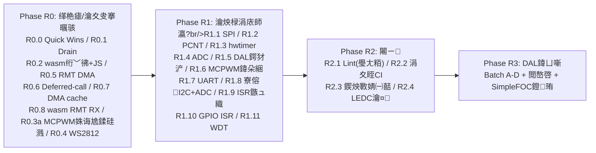

# 鏃跺簭鍩虹璁炬柦涓?DAL 椹卞姩 鈥斺€?鏋舵瀯瀹¤鏁存敼涓庡叏閲忛摵璁惧垎闃舵鎵ц璁″垝

| 鍏冩暟鎹」 | 璇存槑 |
| :--- | :--- |
| **鏂囨。缂栧彿** | `PLAN-REMEDIATION-AND-ROLLOUT-2026-08-23` |
| **鏂囦欢璺緞** | `docs/todolist/timing-infrastructure-and-dal-roadmap/11-phased-remediation-execution-plan.md` |
| **浠ｇ爜鍩虹嚎** | `master` @ `099759d`锛坒eat(dal): Stage 4 DAL peripheral rollout锛?|
| **渚濊禆杈撳叆** | [`10-review-2026-08-23-code-audit.md`](10-review-2026-08-23-code-audit.md)銆佷袱杞灦鏋勫笀璇勫銆佷袱娆″瓙浠ｇ悊鍏ㄤ粨鏍搁獙 |
| **鎵ц鍘熷垯** | 鍏堢紪璇?閾炬帴/flash-cache 瀹夊叏锛屽啀纭欢鐐哥涓庝豢鐪熸柇瑁傦紝鍐嶅疄鏃跺師瀛愶紝鏈€鍚?CI 涓?DAL 閾鸿 |
| **鐘舵€?* | **Ready for Phased Execution锛坴4锛屽凡骞跺叆缂哄彛澶嶆牳 1鈥?4+18锛?5鈥?7 TBD锛?* |

---

## 0. 淇璇存槑

### v5锛堟湰杞級鐩稿 v4 鐨勪慨姝?
**A1 鏋舵瀯绾х‖浼わ紙鏈€楂樹紭鍏堬紝褰卞搷 R0.5/R0.4锛?*
1. **R0.5 琛?classic ESP32 RMT 鏃?DMA Target Gate**锛歚rmt_new_tx_channel` 鍦?classic锛堝強 S2锛夎繑鍥?`ESP_ERR_NOT_SUPPORTED`锛孏DMA 浠?S3 鎵嶆湁锛沜lassic 姣忛€氶亾浠?64脳32-bit RAM block锛岄暱甯у繀椤昏蛋 `rmt_new_bytes_encoder`/`led_strip_encoder`锛屼笉鑳界洿浼?1500 symbol 缂撳啿锛汻0.5 瀹炴柦鎸?target 鍒嗚矾锛宑lassic 寮哄埗 `dma_enabled=false`锛沇S2812锛圧0.4锛夊缓璁洿鎺ラ噰鐢?IDF `led_strip_encoder` 鑼冨紡娑堥櫎鏍?姹?DMA 涓変釜闂銆?
**瀹夊叏鐩稿叧**
2. **G6 淇 R0.6**锛歁CPWM async fault 鎺ュソ鍚庣‖浠舵湰韬?sub-碌s `force_level`锛屽埞杞﹀畨鍏ㄥ姩浣滀笉闈犺蒋浠讹紱ISR 鍙仛閫氱煡+鎭㈠锛涜ˉ `PAL_DEFERRED_LOSSY/CRITICAL` 鍒嗙被锛欳RITICAL 婊℃椂瑙﹀彂 fault锛屼笉闈欓粯涓㈠純銆?3. **A6 淇 R0.6**锛歞eferred worker 绂佺敤 binary task notification锛堝娆?Give 鍚堝苟涓€娆″敜閱掍細涓簨浠讹級锛屾敼鐢?*璁℃暟淇″彿閲?+ drain 寰幆**銆?4. **G1 琛?R0.3a**锛歄ST 鍒硅溅妯″紡 fault 鎭㈠鏃跺簭绾︽潫锛坈lear 鍓?poll `mcpwm_fault_get_level`锛涘 operator 鍏变韩 fault 鏃剁殑 clear 椤哄簭锛夈€?5. **A7 琛?R0.3a HW Sign-off**锛氫笂鐢靛垵濮嬪寲瀹夊叏搴忊€斺€斿厛 MCPWM `force_level` 鈫?鎷夐珮 gate driver EN 鈫?閲婃斁 force锛沢ate driver EN 澶栭儴涓嬫媺纭繚涓婄數榛樿瀹夊叏銆?
**DMA/鍐呭瓨瀹夊叏**
6. **G3/A2 琛?R0.7**锛欴MA buffer 鐢熷懡鍛ㄦ湡濂戠害锛堝洖璋冨墠绂佹閲婃斁/淇敼锛夊啓鍏ュご鏂囦欢 Doxygen锛涙柊澧?`PAL_DMA_BUF_ALIGN`锛坄__attribute__((aligned(32)))`锛宑ache line 瀵归綈锛夛紱classic ESP32 GDMA 涓嶈兘璁块棶 PSRAM锛屽姞 RISK-27 + 娈靛睘鎬у畧鍗€?
**纭欢/鏃堕挓瀹夊叏**
7. **A3 鏂板 RISK-26**锛欰PB 鏃堕挓婕傜Щ锛圵iFi/BT 鍒?80/40 MHz锛夌牬鍧?RMT/LEDC 鏃跺簭锛汻0.5/R2.4 鏄庣‘鏃堕挓婧愶紙`RMT_BASECLK_REF_TICK` 鎴?XTAL锛岀鐢?APB锛夈€?8. **A4 淇 R1.11**锛氳ˉ IWDT锛圛nterrupt Watchdog锛夛紱`busy_wait_us` 涓婇檺鍖哄垎浠诲姟涓婁笅鏂囷紙鈮?0碌s锛夊拰 ISR/涓寸晫鍖哄唴锛堟帴杩?0锛夛紱Nightly 鍚屾椂寮€ TWDT + IWDT銆?9. **A5 琛?R2.2**锛歂ightly 鍔?ISR 鏍堬紙`configISR_STACK_SIZE`锛夐珮姘翠綅鎵撳嵃锛屼笉鍙噺 FreeRTOS 浠诲姟鏍堛€?10. **A8 琛?R1.5**锛歚pal_os_get_cycles()` 澶存枃浠跺啓姝?浠呭仛宸€硷紝绂佺粷瀵规椂闂存埑"锛?2 浣?240 MHz 绾?17.9 绉掑洖缁曪級銆?11. **A10 琛?R1.2**锛歝lassic PCNT 15 浣嶆湁绗﹀彿锛埪?2767锛夛紝`high_limit/low_limit` 涓嶅緱瓒呴檺锛涢珮閫?4X 缂栫爜鍣ㄩ』 bound 璇诲彇鍛ㄦ湡銆?
**API/鎺ュ彛淇**
12. **G4 琛?R1.8**锛氳ˉ `pal_i2c_bus_recover()` API锛?-clk SCL recovery锛夛紝楠屾敹鍔?SDA 寮烘媺浣庢椂 recover 涓嶆寕姝?鐢ㄤ緥銆?13. **A9 淇 R1.8**锛欼DF 5.x 宸插純鐢?`esp_adc_cal_*`锛屾敼鐢?`adc_cali_create_scheme_curve_fitting/line_fitting`銆?14. **P3 淇 R1.3**锛歩nit task 鐨?`StaticTask_t` 鍜屾爤 buffer 蹇呴』 module-static锛涚敤 semaphore 閫氱煡璋冪敤鏂瑰畬鎴愬悗鍐?`vTaskDelete(NULL)`銆?15. **P4 淇 R2.2**锛歚check_wasm_abi_hash.py` 鏀圭敤 `hashlib.sha256`锛岀 Python `hash()`锛堣法杩涚▼ hash seed 涓嶇ǔ瀹氾級銆?
**琛ㄨ堪淇锛堥噰绾崇敤鎴锋寚姝ｏ級**
16. **P1 淇**锛歊1.2 PCNT seqlock 涓嶅瓨鍦?a1==a2 浣?raw 杩囨湡"鍦烘櫙鈥斺€攚atch-point ISR 蹇呭仛 ATOMIC_ADD锛屼换浣?ISR 鎻掑叆鍧囦娇 a2鈮燼1 瑙﹀彂 retry锛涚湡姝ｉ棶棰樻槸娲婚攣锛屽姞閲嶈瘯涓婇檺鍗冲彲銆?17. **P2 琛?R2.3**锛歝atch-up 涓婇檺 64 鍖哄垎 headless锛堜弗鏍煎仠鏈猴級鍜?browser 瀹炴椂璺熼殢锛堜粎鍛婅锛変袱绉嶆ā寮忋€?18. **锛堥┏鍥烇級P5**锛氭鍖?`RED==0 || FED==0 鈫?INVALID_ARG` 淇濈暀 `||`锛堝崟渚т负 0 鐨勪簰琛ュ鍧囨湁鐐哥椋庨櫓锛屽師鏂囨纭級銆?
**鑼冨洿鎵╁睍锛堜腑浼橈級**
19. **G7/A11 琛?R1.3**锛氭柊澧?ISR 浼樺厛绾у垎閰嶉鐣欑瓥鐣ヨ〃锛?0kHz 蹇幆 ISR Level 3~4 > 鍒硅溅 deferred HI > FOC 鎺у埗鐜换鍔?> LO worker > App 浠诲姟锛夈€?20. **M3 琛?R1.8**锛欰DC2+WiFi 鍐茬獊鍒椾负 RISK锛岃ˉ `pal_resource` ADC unit/channel 绾у埆 claim銆?21. **M5 琛?R2.2**锛氳缃?`-sASYNCIFY_STACK_SIZE` 涓婇檺锛孨ightly 娴嬫繁璋冪敤閾惧唴瀛樺嘲鍊笺€?22. **M7 琛?R3.C**锛欱atch C 鍓嶈ˉ"DHT22 ESP32 绔椂搴忔柟妗?灏忚璁★紙涓寸晫鍖?bit-bang 椋庨櫓 + RMT 鏇夸唬鍐崇瓥锛夈€?
### v4锛堟湰杞級鐩稿 v3 鐨勪慨姝?
**v3 鐪熸紡锛堝悎鍏ワ級**
1. **R2.3 鍔?fault code 8004 淇**锛歚pal_wasm_fault.c:56` 鐢?8004 鎶?OOM锛屼絾 `wink_fault.h:41` 瀹氫箟 8004=`WINK_WARN_LIGHT_OVERBUDGET`锛涘垎閰?wasm fault 涓撶敤鐮佹锛屼笉鍗犵敤 runtime 80xx銆?2. **鏂板 R0.8 wasm RMT RX + JS 娉ㄥ叆**锛歊0.2 鎶?wasm RX 鐣?UNSUPPORTED锛屼絾 Batch C `ir_receiver`(NEC) 渚濊禆锛涜ˉ wasm RX 杞豢鐪?+ JS 娉ㄥ叆鑴夊啿娉㈠舰 + 瀹屾垚寤烘ā锛孯0.5 涔嬪悗鍋氥€?3. **鏂板 R1.10 GPIO ISR 璺緞瀹¤**锛歚gpio_esp32.c:273` 鏈?IRAM ISR锛屼絾 `pal_gpio_set_irq_callback`/鍘绘姈/鏍镐翰鍜屼粠鏈牳楠岋紱鎸夐敭/閿洏/PIR/澶栭儴瑙﹀彂渚濊禆銆?4. **鏂板 R1.11 PAL WDT 鎶借薄**锛歊elease 闂ㄧ鍐?24h WDT 涓嶅浣?鍗存棤浠诲姟閰?TWDT/瑙勫畾鍠傜嫍锛?0kHz 蹇幆涓?yield 浼氶タ姝?idle 瑙﹀彂 TWDT銆?5. **搂9 DAL checklist 鍔犲悓瀹炰緥绾跨▼瀹夊叏濂戠害**锛氬悓涓€ DAL 瀹炰緥琚?app 浠诲姟 + deferred 鍥炶皟骞跺彂璁块棶锛坓ps poll/get_position 绛夛級鐨勮鐭┾€斺€旈粯璁や笉鍙噸鍏ワ紝璋冪敤鏂逛覆琛岋紱鍙噸鍏ラ渶鍐呴儴鍔犻攣骞舵枃妗ｅ寲銆?6. **搂9 checklist 鏄庣‘鍐呴儴璧勬簮 claim**锛歅CNT unit/RMT channel/MCPWM operator/LEDC timer/GDMA channel 閮界粡 `pal_resource_claim`锛屼笉姝?GPIO 鑴氥€?
**璺ㄥ垏闈紙鍐欒繘 R2.3 寰复鐣屽尯鏂囨。锛?*
7. 鍏ㄥ眬娴偣绛栫暐锛歠loat 鍙噯浠诲姟涓婁笅鏂囷紝涓嶅噯 ISR/蹇幆锛圧1.3 浠呯 hwtimer锛屾墿鍒板叏閮?PAL/DAL锛夛紱DAL 婊ゆ尝/IMU/绉伴噸鎹㈢畻鐓ф銆?8. `pal_os_busy_wait_us` 棰勭畻涓婇檺锛欵SP32 鍗犳牳銆亀asm asyncify 澶辩湡锛涙枃妗ｇ粰闃堝€硷紙濡傚崟璋冪敤 鈮?0碌s锛夛紝瓒呴檺鐢?RMT/瀹氭椂鍣ㄣ€?9. 浼樺厛绾у弽杞細HI deferred worker 鎸侀攣蹇呴』璧?priority-inheriting `pal_mutex_t`锛屼换鍔′笂涓嬫枃绂侀暱鑷棆銆?10. **R2.2 Nightly 鍔犳爤/姹犻珮姘翠綅**锛歚uxTaskGetStackHighWaterMark` + completion/deferred/DAL 姹犻珮姘翠綅 metric锛屼笉鍙祴婧㈠嚭銆?11. **R1.8 鍔?ADC eFuse 鏍″噯**锛歰neshot/continuous mV 璧?`esp_adc_cal` 鏍″噯鏇茬嚎锛宎nalog_sensor 鐩存帴鐢ㄦ牎鍑嗗€笺€?12. **R2.3 瀹氫箟鏁呴殰娉ㄥ叆 L1/L2/L3**锛歊elease 闂ㄧ寮曠敤鍗存湭瀹氫箟锛涙槑纭眰绾ф槧灏勫埌鐜版湁 6 绫?fault锛屽苟鏍?SPI/RMT/ADC 鍣０缂哄彛锛堟槸鍚︽柊澧?fault 绫诲瀷鍦?R2.3 瀹氾級銆?13. **椋庨櫓鍔?HW runner/Wokwi 灞€闄?*锛欻W Sign-off 渚濊禆鑷墭绠?ESP32 runner锛沇okwi 娴嬩笉浜?flash-cache panic/姝诲尯鐢垫皵/ISR 鎶栧姩銆傛棤 runner 鏃?HW 椤归渶鎵嬪姩锛屼笉鑳介粯璁よ烦杩囥€?14. **R2.1 鍔?codegen 妯℃澘璺ㄤ粨鍚屾**锛歊1.1 SPI timeout 瀛楁銆丷1.7 UART init_ex 鏀?PAL 绛惧悕锛宍../wink-tools` 涓?codegen 妯℃澘蹇呴』鍚?PR 鏇存柊銆?
**椤跺眰**
18. **鏂板 搂11 Definition of Done**锛氭暣涓暣鏀圭殑閫€鍑烘爣鍑嗭紙鍏?DAL 钀藉湴銆?4h 绋炽€丄DR 鍥炲啓銆佹枃妗ｃ€乧odegen 鍚屾銆丠W Sign-off 璁板綍褰掓。锛夈€?
**鑼冨洿 TBD锛堥渶鐢ㄦ埛鎷嶆澘锛屼笉闃诲 R0锛?*
15. sdcard锛氳８鍧楄澶?vs FATFS/VFS銆?16. 鐢垫簮绠＄悊/鐫＄湢锛歱al_pm/light-sleep/wakeup 鏄惁绾冲叆鏈疆銆?17. I2S/audio锛欴AL 鏈?audio 鍗犱綅锛屾湰杞槸鍚︾嫭绔嬬珛椤广€?
### v3 鐩稿 v2 鐨勪慨姝ｏ紙淇濈暀锛?
**缂栬瘧鍗虫寕绫伙紙鏈€楂樹紭鍏堬級**
1. R0.0 鎵╋細`WINK_ERR_NOT_SUPPORTED` 鍏ㄤ粨鏈畾涔夛紙姝ｇ‘鍚?`WINK_ERR_UNSUPPORTED`锛夛紝5 涓?ESP 椹卞姩 `#else` stub 鍧楃紪璇戝繀鎸傦紱gptimer/RMT 娉ㄥ唽缂?`ESP_INTR_FLAG_IRAM`锛坒lash 鎿﹀啓闅忔満 panic锛夛紱4 澶勮８ `IRAM_ATTR`銆?2. 鏂板 **R0.6 PAL deferred-call worker**锛氬埞杞?RMT RX/鎹曡幏/UART 鍥涗换鍔￠兘瑕?ISR defer 鍒颁换鍔?锛屼絾鍏ㄤ粨鏃犻€氱敤 bottom-half 璁炬柦锛屽厛寤恒€?3. 鏂板 **R0.7 PAL DMA cache 鍚屾**锛氬叏浠撴棤 `Cache_WriteBack/Invalidate`锛宍PAL_DMA_BUF_ATTR` 鍙斁 DRAM 涓嶅仛 cache 鍚屾锛汼PI/RMT/ADC DMA 缁熶竴缁?`pal_dma_cache_clean/invalidate`銆?
**v2 浼氫骇鍑洪敊璇唬鐮佺被**
4. R1.2 PCNT锛?*鍒犻櫎** v2 鐨?`pcnt_unit_get_count + clear` 绱姞锛坓et 涓?clear 闂磋剦鍐蹭細涓級锛涗繚鐣欑幇鏈夊姞 `high_limit/low_limit` 甯搁噺鐨勬纭ā寮忥紝浠呮妸闈炲師瀛?`+=` 鏀?`PAL_ATOMIC_ADD`锛屼慨璇诲彇渚х珵浜夈€?5. R1.3 FPU锛?*鍒犻櫎** "鎱㈢幆 ISR 閲?frsave/frrestor"锛圶tensa ISR 鏃犵嫭绔?FPU 甯у彲瀛橈紝E-006锛夛紱鏀逛负 hwtimer ISR 涓€寰嬫嫆缁?`uses_fpu=true`锛屾诞鐐?defer 鍒版參鐜换鍔′笂涓嬫枃銆?6. R1.5 HX711锛?*鍒犻櫎** DAL 鐩存帴璋?`xthal_get_ccount()`锛堣繚鍙?ADR-0003锛夛紱鍏堝湪 PAL 鍔?`pal_os_get_cycles()`锛孌AL 鍙皟鍙Щ妞?API銆?7. R0.1锛歚WASM_FAULT_TIMER_OVERRUN` 涓嶅瓨鍦紝fault 鏈哄埗鏄叏灞€绮樿繛鑷村懡鐨勨€斺€旀敼涓哄厛鎵?`pal_wasm_fault_types.h` 鏂板 `FAULT_TYPE_TIMER_OVERRUN`锛屾槑纭?catch-up 璺熶笉涓婂嵆浠跨湡鍋滄満"锛涘姞閲嶅叆瀹堝崼闃?hwtimer 鍥炶皟閫掑綊璋?advance銆?8. R1.4锛?*鍒犻櫎** "classic ESP32 鐩存帴 UNSUPPORTED" 鐨勬鏂?gate锛涘厛鍦?IDF 5.4 classic 瀹炴祴鐜版湁 `adc_continuous_*` 鏄惁鍙伐浣滐紙IDF 5.x 鍦?classic 涓婄粡 I2S0 鎻愪緵锛夛紝鑳借捣灏变繚鐣欏苟淇洖璋冿紝涓嶈兘璧峰啀闄嶇骇锛沗adc_continuous_set_pool` API 瀛樺湪鎬у厛鏍稿ご鏂囦欢銆?9. R0.5锛歚pal_rmt_symbol_t*` 瑁镐紶 `rmt_transmit` 鏄?ABI 璧屽眬锛屽姞 `_Static_assert(sizeof/offsetof)` 閿佸畾甯冨眬鑰﹀悎銆?10. R0.3a锛欼DF 5.x 姝诲尯璺緞鏋氫妇鏄?`MCPWM_DEADTIME_PATH_BYPASS/DELAY`锛屼笉鏄?v2 鍐欑殑 `MCPWM_ACTIVE_HIGH_*`锛涘姞"缂栫爜鍓?grep IDF 澶存枃浠舵牳瀵规灇涓?鍥炶皟瀛楁鍚?妫€鏌ョ偣锛涗簰琛ュ deadtime=0 鐩存帴 `INVALID_ARG`銆?11. R1.1锛歚cfg->timeout_ms` 瀛楁涓嶅瓨鍦ㄢ€斺€斾换鍔℃敼涓哄厛缁?`pal_spi_bus_config_t` 鍔?`timeout_ms` 瀛楁锛圓PI 鍙樻洿锛夋垨鐢?PAL 榛樿甯搁噺銆?12. R1.7锛歚pal_uart_init` 褰撳墠鏄?`(port,tx,rx,baud)` 鍥涘弬鏃?config锛涘姞 RX_IDLE/FIFO 蹇呴』鏀?API鈥斺€旀柊澧?`pal_uart_init_ex(const pal_uart_config_t*)`锛屼繚鐣欐棫绛惧悕 wrapper锛涗簨浠跺悕娌跨敤 `PAL_UART_EVENT_*` 鍓嶇紑銆?
**缂哄け搴曞骇**
13. 鏂板 **R1.8 寮傛 I虏C + 闈為樆濉?ADC oneshot**锛歚WINK_STRICT_NONBLOCKING` 鎶?`pal_i2c_transfer` 鍜?`pal_adc_read_raw/mv` 閮界紪璇戞帀浜嗭紝R3 澶ф壒 I虏C 浼犳劅鍣?analog_sensor 鏃犲簳搴с€俁3 鍓嶇疆銆?14. 鏂板 **R1.9 ISR 鏃ュ織瀹夊叏**锛歚pal_log_isr_write` 闈?IRAM銆佽窇 `vsnprintf`/flash 瀛楃涓诧紝ISR 閲岃皟 `LOG_E` 浼氬穿锛涙敼 IRAM+DRAM ring buffer 浠诲姟鎺掔┖锛屾垨鏄庝护 ISR 闆舵棩蹇椼€?15. R2.1 淇锛歸ink-tools 鏄?*鍏勫紵浠撳簱**锛坄cmake/wink_tools.cmake` 鎸?`../wink-tools`锛夛紝鏈粨鏃?`packages/`锛涜鍒欐敼鍔ㄦ槸璺ㄤ粨 PR锛岃鐗堟湰 pin 鍗忓悓锛沗layering.yaml` 褰撳墠鏍规湰娌℃湁 `pal_public` 灞傦紝鍔犲眰鏄ぇ鏀广€?16. R3 鍓嶆柊澧?**R2.4 LEDC/PWM 璺敱瀹¤**锛歚pal_hal_pwm_esp32.c` 鐢?IDF 4.x 椋庢牸 `ledc_set_duty/freq`锛孉DR-0034 router 鏄惁鐪熸帴绾挎湭鏍革紱rgb_led/buzzer/servo 渚濊禆瀹冿紝涓嶈兘鍐嶇暀"褰技瀹炴棤"銆?
**JS 渚?*
17. R0.2/R0.4锛歸asm RMT鈫扟S 閫氶亾 `js_pal_rmt_tx` 鍏ㄤ粨涓嶅瓨鍦紱淇敼鏂囦欢娓呭崟琛?`wink_sim_js.js`/`wink_sim_stub.js`/`exported_runtime_functions.json`锛宐ump `PAL_WASM_ABI_HASH`锛涘喅绛?ch4_buffer.c 鐨?`pal_ws2812_write` 蹇矾寰勫湪 R0.4 鍚庡垹闄よ繕鏄檷绾т负 RMT 娓叉煋鍚庣銆?18. R0.4 WS2812锛氱洿鎺ユ寜 R/G/B 椤哄簭閫愬瓧鑺備骇 RMT 绗﹀彿锛?*鐪佹帀涓棿 GRB buffer**锛屾爤/姹犻棶棰樹竴璧锋秷澶便€?
**宸ョ▼鍖?*
19. 鎵€鏈変换鍔¤ˉ owner 瑙掕壊 + 绮椾及澶╋紱杩借釜琛ㄥ姞"鍥炴粴/feature flag"鍒椼€?20. 椋庨櫓琛ㄨˉ 8 鏉★紙drain 鏃跺簭鍙樻洿鐮村崟娴嬨€乁ART 绛惧悕鍙樻洿鍔?codegen銆丷MT config 鍔犲瓧娈?ABI 鐮村潖銆亀ink-tools 璺ㄤ粨鍗忓悓銆乧h4 姝讳唬鐮併€乻trict nonblocking 缂哄紓姝ャ€佸井绉掑崗璁湪 asyncify 涓嬪け鐪熴€丩EDC 鏈璁★級銆?
### v2 淇淇濈暀
R0.1 drain 鍗曟帴绾跨偣銆丷0.5 RMT DMA 鍓嶇疆銆丮CPWM 鎷?R0.3a/R1.6銆丷1.7 UART idle銆佷笁灞?CI銆丷3 鍥涚被婕忔斁銆丠W Sign-off 闂ㄧ銆侀闄╄〃銆丏AL checklist 绛?v2 淇鍏ㄩ儴淇濈暀骞跺湪鏈増缁嗗寲銆?
---

## 1. 鎬讳綋鐩爣涓庢暣鏀瑰垎鏈熸灦鏋?
閽堝瀹¤"楠ㄦ灦浼樼銆佸疄鐜版柇娴併€佺‖浠跺畨鍏ㄥ舰浼煎疄鏃犮€乫lash-cache 涓嶅畨鍏?锛屾暣鏀瑰垎 **4 涓€掕繘闃舵 + 鍓嶇疆搴曞骇浠诲姟**銆傛瘡涓换鍔＄嫭绔嬪彲鎻愪氦銆佷笁 target锛坔ost/wasm/ESP32锛夋瀯寤轰笉鐮磋锛岀敤 feature flag 淇濇寔甯哥豢銆?


**闃舵闂ㄧ鍘熷垯**锛氬畨鍏ㄤ换鍔★紙R0.3a锛夋帴鍔熺巼妗ュ墠蹇呴』杩?搂8 **HW Sign-off**锛屽崟娴嬩笉鑳芥浛浠ｏ紱浠讳綍鏀?ISR/涓柇娉ㄥ唽鐨勪换鍔″繀椤诲悓鏃朵繚璇?flash-cache 瀹夊叏锛圛RAM 灞炴€?+ `ESP_INTR_FLAG_IRAM`锛夈€?
---

## 2. Phase R0锛氱紪璇戦摼鎺ャ€乫lash-cache 瀹夊叏涓?P0 缂洪櫡

> **鐩爣**锛氳涓?target 鐪熸缂栬繃锛堜慨 NOT_SUPPORTED锛夛紝璁╂墍鏈?ISR 鍦?flash 鎿﹀啓鏃朵笉宕╋紝鎵撻€?wasm 铏氭嫙鏃堕挓 drain锛屼慨 MCPWM 鐩撮€氶殣鎮ｏ紝璁?WS2812 鐪熷彂寰楀嚭鍘汇€?
### 浠诲姟 R0.0锛氱紪璇戝熀绾夸笌 ISR flash-cache 瀹夊叏 Quick Wins

- **闂鏍瑰洜**锛?  1. `WINK_ERR_NOT_SUPPORTED` 鍏ㄤ粨鏈畾涔夛紙姝ｇ‘鍚?`WINK_ERR_UNSUPPORTED`锛寃ink_status.h:87锛夛紝5 涓?ESP 椹卞姩 `#else` stub 鍧楋紙hwtimer:203-214銆乵cpwm:366-377銆乸cnt:290-291锛宻pi/uart 鍚岀被锛夊湪闈?ESP_PLATFORM 缂栬瘧蹇呮寕锛?  2. `targets/esp32/CMakeLists.txt` 缂?`esp_driver_gdma`锛孖DF <5.4 闈欓粯鍥為€€锛?  3. 4 澶?ISR 瑁?`IRAM_ATTR`锛坔wtimer:31銆乸cnt:41銆乺mt:48/64锛夌粫杩?`PAL_ISR`锛?  4. gptimer 閰嶇疆锛坔wtimer:65-69锛夈€丷MT TX/RX 閰嶇疆锛坮mt:128-134/159-164锛?*缂?`.intr_flags = ESP_INTR_FLAG_IRAM`**锛屼腑鏂彲鑳借璺敱鍒?cache 鍏辩敤绾匡紝鍙︽牳鎿?flash 鏃惰Е鍙?鈫?panic銆侴PIO锛坓pio_esp32:273锛変笌 pal_irq锛?73锛夊凡姝ｇ‘璁剧疆銆?- **淇敼鏂囦欢**锛?  - `wink-micro-os/targets/esp32/pal_hal_hwtimer_esp32.c`
  - `wink-micro-os/targets/esp32/pal_hal_pcnt_esp32.c`
  - `wink-micro-os/targets/esp32/pal_hal_rmt_esp32.c`
  - `wink-micro-os/targets/esp32/pal_hal_spi_esp32.c`
  - `wink-micro-os/targets/esp32/pal_hal_uart_esp32.c`
  - `wink-micro-os/targets/esp32/pal_hal_mcpwm_esp32.c`
  - `wink-micro-os/targets/esp32/CMakeLists.txt`
- **瀹炴柦鏍囧噯**锛?  1. 鍏ㄤ粨 `WINK_ERR_NOT_SUPPORTED` 鈫?`WINK_ERR_UNSUPPORTED`锛堟敼鍚嶏紝涓嶅姞鍒悕瀹忥紝閬垮厤涓や釜鍚嶅瓧闀挎湡鍏卞瓨锛夛紱
  2. CMake REQUIRES 鍔?`esp_driver_gdma`锛汭DF <5.4 鏀?`message(FATAL_ERROR "ESP-IDF >= 5.4 required")`锛?  3. 4 澶勮８ `IRAM_ATTR` 鈫?`PAL_ISR`锛?  4. gptimer/RMT 鎵€鏈?channel config 鍔?`.intr_flags = ESP_INTR_FLAG_IRAM`锛涢『鎵嬫牳 SPI/PCNT/MCPWM/UART 鐨勪腑鏂敞鍐屾槸鍚﹀悓鏍峰甫 IRAM flag锛圫PI 鍚屾浼犺緭鏃?ISR锛孌MA 瀹屾垚 ISR 瑕佹煡锛沀ART 浜嬩欢浠诲姟璧?queue 浣?UART ISR 鐢遍┍鍔ㄧ锛宖lag 鐢遍┍鍔ㄩ粯璁ゅ甫鈥斺€旀牳瀵癸級锛?  5. 鍔犱竴鏉?lint/grep 瀹堥棬锛圧2.1锛夛細娉ㄥ唽 ISR 鐨?config 缁撴瀯浣撳繀椤诲惈 `ESP_INTR_FLAG_IRAM`銆?- **楠屾敹闂ㄧ**锛歨ost/wasm/ESP32 涓?target 缂栬瘧閫氳繃锛堜慨 NOT_SUPPORTED 鍓?host 缂栬瘧灏卞彲鑳界孩锛夛紱`grep -r IRAM_ATTR targets/esp32/` 浠呭懡涓?`wink_compiler.h` 瀹忓畾涔夛紱`grep -r WINK_ERR_NOT_SUPPORTED .` 闆跺懡涓紱gptimer/RMT 涓柇娉ㄥ唽琛屽惈 IRAM flag銆?- **Owner/浼版椂**锛歅AL / 0.5d銆?
---

### 浠诲姟 R0.1锛歐asm 铏氭嫙鏃堕挓 Drain 鎺ョ嚎锛堣В閿?Stage 3锛?
- **闂鏍瑰洜**锛歚pal_wasm_drain_completions()` 涓?`pal_wasm_hwtimer_drain()` 瀹炵幇姝ｇ‘浣嗛浂澶栭儴璋冪敤锛沗pal_osal_wasm.c` 涓や釜鏃跺熀鎺ㄨ繘鐐癸紙export 鍏ュ彛 :47 涓?headless idle-jump :551锛夛紝鍚庤€呯洿鎺ヨ皟 static `wink_vclock_advance_internal` 涓旇繛 waveform drain 閮芥病鎺ャ€?- **鍏抽敭浜嬪疄锛堢粡瀛愪唬鐞嗘牳楠岋級**锛?  - 涓?drain 绛惧悕鍧?`void f(void)`锛坔wtimer.c:90銆乧ompletion.h:53锛夛紝鍐呴儴鑷彇 `pal_os_get_us()`锛?  - `pal_wasm_hwtimer_drain()` 姣忚疆姣?timer 鍙?fire 涓€娆★紙hwtimer.c:92锛夛紝澶ц烦鍙樹涪鍛ㄦ湡锛?  - `pal_wasm_hwtimer.h` **涓嶅瓨鍦?*锛宒rain 鍘熷瀷鍙湪 .c 鍐咃紝闇€鏂板缓鍐呴儴澶存垨鏀捐繘 `pal_wasm_internal.h`锛?  - `change_period`锛坔wtimer.c:58-66锛夊綋鍓嶇珛鍗?`next_fire_us = now + new_period_us`锛堜粠鐜板湪閲嶇疆锛夛紝闈炰笅涓€鍛ㄦ湡鐢熸晥锛?  - wasm fault 绫诲瀷鍙湁 5 绉嶏紙`pal_wasm_fault_types.h:16-22`锛夛紝鏃?timer overrun锛沗pal_wasm_is_faulted()` 鏄叏灞€绮樿繛鑷村懡鏍囧織锛岀疆浣嶅悗鎵€鏈?`WASM_FAULT_GUARD_*` 鐩存帴 return锛屾暣涓?sim 鍋溿€?- **淇敼鏂囦欢**锛?  - `wink-micro-os/osal/wasm/pal_osal_wasm.c`
  - `wink-micro-os/targets/wasm/pal_wasm_hwtimer.c`
  - `wink-micro-os/targets/wasm/pal_wasm_hwtimer.h` [NEW锛屾垨骞跺叆 pal_wasm_internal.h]
  - `wink-micro-os/targets/wasm/pal_wasm_fault_types.h`锛堝姞 fault 绫诲瀷锛?  - `wink-micro-os/targets/wasm/wink_sim_js.js`锛堟覆鏌撴柊 fault 绫诲瀷锛?- **瀹炴柦鏍囧噯**锛?  1. **鍗曚竴鎺ョ嚎鐐?*锛歚wink_vclock_advance_internal()`锛?40锛夊唴 `s_virtual_us += delta_us` 涔嬪悗锛岀粺涓€璋冪敤 waveform drain 鈫?hwtimer drain 鈫?completion drain锛岃鐩?export 涓?headless idle-jump锛?  2. **閲嶅叆瀹堝崼**锛氬姞 `static bool s_draining`锛宧wtimer/completion 鍥炶皟鑻ワ紙閿欒鍦帮級閲嶅叆 `pal_wasm_advance_virtual_clock` 鐩存帴璺宠繃锛岄槻閫掑綊锛?  3. **鏈夌晫 catch-up**锛歚pal_wasm_hwtimer_drain()` 鍐呮瘡鍒版湡 timer 寰幆 fire 鑷?`next_fire_us > now` 鎴?oneshot锛宍PAL_WASM_HWTIMER_MAX_CATCHUP`锛?64锛変笂闄愶紝瓒呴檺锛?     - 鍏堝湪 `pal_wasm_fault_types.h` 鏂板 `FAULT_TYPE_TIMER_OVERRUN = 6`锛?     - 璋?`pal_wasm_log_fault(FAULT_TYPE_TIMER_OVERRUN, timer_id)` 骞剁疆 faulted锛堟槑纭涔夛細catch-up 璺熶笉涓?= 浠跨湡宸插け鐪燂紝鑷村懡鍋滄満锛屼笉鏄?涓嶅穿缁х画"锛夛紱
  4. **澶?pass**锛氬浐瀹?hwtimer 鈫?completion 涓よ稛锛坔wtimer 鍥炶皟鍙兘 schedule delta=0 completion锛沜ompletion 鍥炶皟鍙兘 arm timer锛夛紱
  5. **`change_period` 璇箟淇**锛氳褰?`pending_period_us`锛屼笅娆?fire 鏃舵墠搴旂敤骞?`next_fire_us = previous_fire + new_period`锛堜繚鐣欑浉浣嶏紝涓嶄粠 now 閲嶇疆锛夛紱
  6. **ABI 灏哄鏂█**锛歚_Static_assert` 鍦?`sizeof(void*)==4` 鏉′欢涓嬫柇瑷€ wasm 涓?ESP32 鐨?`pal_hwtimer_cfg_t` 甯冨眬涓€鑷达紙64 浣?host 涓婂嚱鏁版寚閽?8 瀛楄妭锛屼笉鑳介拤姝绘暟鍊硷級锛?  7. **娴嬭瘯杩佺Щ瀛愪换鍔?*锛氱洏鐐规墍鏈夊亣璁惧閽熺殑 wasm 鍗曟祴锛屾彁渚?`pal_test_advance_us()` 娴嬭瘯杈呭姪锛屾壒閲忔敼涓洪┍鍔ㄨ櫄鎷熸椂閽熴€?- **楠屾敹闂ㄧ**锛?  - 20kHz hwtimer + SPI DMA锛屼互 鈮? period 姝ヨ繘鎺ㄨ繘 10ms锛屾柇瑷€绾?200 娆?hwtimer 鍥炶皟 + 1 娆?DMA 瀹屾垚鍦ㄩ鏈?碌s 瑙﹀彂锛?  - headless 鍗曟 100ms锛宑atch-up 瑙﹀彂涓旇秴 MAX_CATCHUP 鏃剁疆 TIMER_OVERRUN fault 骞跺仠鏈猴紙鏂█ fault 绫诲瀷锛夛紱
  - 鏃犻噸鍏ャ€佹棤闈欓粯鎸傝捣锛涙棫澧欓挓鍗曟祴鍏ㄩ儴杩佺Щ鎴栧垹闄ゃ€?- **Owner/浼版椂**锛歅AL wasm / 2d銆?
---

### 浠诲姟 R0.2锛歐asm SPI/PCNT 绗﹀彿淇 + RMT 杞豢鐪燂紙鍚?JS 渚э級

- **闂鏍瑰洜锛堢粡鏍搁獙锛?*锛?  - `pal_wasm_ch2_spi.c:49` 鐨?`pal_spi_add_device` 缂?`bus` 棣栧弬锛岃涓嶅瓨鍦ㄧ殑 `cfg->bus_id`锛堝叕鍏卞ご `pal_spi.h:41-48` 鏃犳瀛楁锛孴U 鍐呮湰鍦伴噸瀹氫箟缁撴瀯浣撻€犳垚 ODR 鍐茬獊锛夛紱`s_adapt[]` + `slot_idx=0` 鍒悕锛?115-117锛夋槸鍐呭瓨鐮村潖闅愭偅锛?  - `pal_wasm_pcnt.c` 鍏ㄧ瘒鐢ㄦ棫 `pal_pcnt_handle_t` 涓庢湰鍦?`pal_pcnt_start/stop/clear_count`锛屼笉鍖归厤鍏叡澶?`pal_pcnt_unit_handle_t`/`pal_pcnt_clear`锛?  - 鏃?wasm RMT TU锛?*鍏ㄤ粨鏃?`js_pal_rmt_tx`**锛坓rep 闆跺懡涓級锛涚幇鏈?ws2812 wasm 璧?ch4_buffer.c 鐨?`pal_ws2812_write`鈫抈js_pal_ws2812_write` 涓撶敤蹇矾寰勶紝涓嶇粡 RMT锛?  - `wasm_bridge.h:94` 娉ㄩ噴 "minimal stub" 闄堟棫锛沗js_pal_spi_transfer` 鏄?7 鍙傜鍚嶏紙:97-100锛夈€?- **淇敼鏂囦欢**锛?  - `wink-micro-os/targets/wasm/pal_wasm_ch2_spi.c`
  - `wink-micro-os/targets/wasm/pal_wasm_pcnt.c`
  - `wink-micro-os/targets/wasm/pal_wasm_rmt.c` [NEW]
  - `wink-micro-os/targets/wasm/CMakeLists.txt`
  - `wink-micro-os/targets/wasm/wasm_bridge.h`锛堟柊 extern + 娉ㄩ噴 + ABI hash 璇存槑锛?  - `wink-micro-os/targets/wasm/wink_sim_js.js`锛堟柊 `js_pal_rmt_tx` + deps锛?  - `wink-micro-os/targets/wasm/wink_sim_stub.js`锛堢鍙峰叆琛級
  - `wink-micro-os/targets/wasm/exported_runtime_functions.json`锛堝闇€瑕侊級
  - `wink-micro-os/targets/wasm/pal_wasm_degradation.c:80`锛?*bump `PAL_WASM_ABI_HASH`**锛屾柊鍊兼寜瑙勫垯璁＄畻锛?  - host `pal_spi_deinit_bus`锛坈s_pin >=0 妫€鏌ワ紝浣嶇疆浠ユ牳楠屼负鍑嗭細esp32 :124 宸叉湁锛岃ˉ host/wasm锛?- **瀹炴柦鏍囧噯**锛?  1. `pal_spi_add_device` 瀵归綈 `(uint8_t bus, const pal_spi_device_config_t *cfg, pal_spi_device_handle_t*)`锛屾€荤嚎璇婚鍙?`bus` 骞舵牎楠?`< WASM_SPI_BUS_MAX`锛屽垹鏈湴缁撴瀯浣撻噸瀹氫箟锛?  2. 瀹屾垚鍥炶皟鍘诲苟鍙戦闄╋細搴熷純 per-device `s_adapt[]`锛屼粠 32 椤?completion 姹犳惡甯?`(cb,arg)`锛屽垹 `slot_idx=0` 鍒悕锛?  3. `pal_wasm_pcnt.c` 绫诲瀷鏀?`pal_pcnt_unit_handle_t`锛孉PI 瀵归綈 `init/deinit/get_count/clear/set_glitch_filter`锛屽垹鏈湴 start/stop/clear_count锛?  4. **鏂板缓 `pal_wasm_rmt.c` 杞豢鐪?TX**锛氱淮鎶ら€氶亾鐘舵€侊紝`pal_rmt_tx_send` 缁?completion 鎷夋ā鍨嬫寜 `symbol_count / resolution_hz` 寤烘ā瀹屾垚鏃跺欢锛岃皟鏂板 `js_pal_rmt_tx(port, symbols, count, resolution_hz)` 閫?JS 娓叉煋锛圠ED/閫昏緫鍒嗘瀽浠級锛汻X 鍏?`WINK_ERR_UNSUPPORTED`锛圓DR-0012锛夛紝TX 蹇呴』鍙敤锛?  5. **ch4_buffer.c 鍐崇瓥**锛歊0.4 鎶?ws2812 鍒囧埌 RMT 鍚庯紝`pal_ws2812_write`/`js_pal_ws2812_write` 瑕佷箞鍒犻櫎锛圝S 渚?ws2812 娓叉煋鏀圭敱 `js_pal_rmt_tx` 鏁版嵁娴侀┍鍔級锛岃涔堟槑纭檷绾т负"wasm RMT 鐨勬覆鏌撳悗绔?锛坵asm RMT TX 鍐呴儴鎶?ws2812 绗﹀彿杞粰瀹冿級銆傛湰浠诲姟閫夊畾鏂规骞跺啓娉ㄩ噴锛屼笉鐣欐浠ｇ爜锛?  6. `js_pal_spi_transfer` 7 鍙傜鍚嶏細鑻ョ浉瀵?Stage 3 鍩虹嚎鍙樺鍒欐柊澧?`_v2` 骞?bump hash锛涜嫢涓€鐩?7 鍙備粎鏀规敞閲婁负"Stage R0 fully wired"锛?  7. ABI hash bump 瑙勫垯锛坵asm_bridge.h:284锛夛細鏈换鍔℃柊澧?鍒?鏀瑰悕 extern 蹇呴』 bump锛宍check_wasm_abi_hash.py`锛圧2.2锛夊畧闂ㄣ€?- **楠屾敹闂ㄧ**锛歚emcmake cmake` + `emmake` 閾炬帴閫氳繃鏃犳湭瀹氫箟绗﹀彿锛泈asm RMT TX 鍗曟祴锛坅cquire鈫抰x鈫抎rain鈫掑畬鎴愬洖璋?+ JS 鏀跺埌绗﹀彿锛夛紱SPI 閲嶅彔浼犺緭涓ゅ洖璋冨悇鏀舵纭?arg锛汵ode 涓?stub 瀹炰緥鍖栨棤 undefined import銆?- **渚濊禆**锛氭棤銆?*R0.5 鍦ㄦ湰浠诲姟涔嬪悗**锛堝悓鏂囦欢 pal_wasm_rmt.c锛夈€?- **Owner/浼版椂**锛歅AL wasm + JS / 2.5d銆?
---

### 浠诲姟 R0.5锛歅AL RMT DMA 涓庡ぇ瀹归噺 TX锛圧0.4 鍓嶇疆锛?
- **闂鏍瑰洜锛堟牳楠岋級**锛歚pal_rmt_channel_config_t`锛坮mt.h:56-61锛夋棤 `dma_enabled/max_symbols`锛屽彧鏈?`pin/direction/resolution_hz/mem_block_symbols`锛汦SP32 `pal_rmt_tx_send` 鍦ㄦ寔閿佺姸鎬佹爤鍒嗛厤 `rmt_symbol_word_t sym_words[256]`锛?KB锛宺mt_esp32.c:239锛夛紝64 鐏?WS2812 闇€ 1536 symbol锛沗with_dma` 瀛楁瀹屽叏娌¤锛沗rx_stop`锛?304-309锛夋槸绌?no-op锛汻X ISR锛?64-85锛夊湪 ISR 鍐呭惊鐜浆 256 symbol锛岃繚 ISR 濂戠害銆?- **淇敼鏂囦欢**锛?  - `wink-micro-os/pal/include/hal/pal_rmt.h`
  - `wink-micro-os/targets/esp32/pal_hal_rmt_esp32.c`
  - `wink-micro-os/targets/host/pal_hal_rmt_host.c`
  - `wink-micro-os/targets/wasm/pal_wasm_rmt.c`锛圧0.2 寤猴級
- **瀹炴柦鏍囧噯**锛?  0. **Target Gate锛坈lassic ESP32 鏃?DMA锛寁5 鏂板锛岀紪鐮佸墠蹇呮牳锛?*锛歚rmt_new_tx_channel(..., with_dma=true)` 鍦?classic ESP32锛堝強 S2锛夎繑鍥?`ESP_ERR_NOT_SUPPORTED`锛汫DMA 浠?S3 鎵嶆湁銆俢lassic 姣忛€氶亾浠?64脳32-bit RAM block銆?*鎸?target 鍒嗚矾瀹炴柦**锛?     - `CONFIG_IDF_TARGET_ESP32`锛坈lassic锛夛細`dma_enabled` 寮哄埗 `false`锛汿X 璧?`rmt_new_bytes_encoder`/`led_strip_encoder` callback 杈圭敓鎴愯竟鍙戯紱WS2812锛圧0.4锛?*鐩存帴閲囩敤 IDF `led_strip_encoder` 鑼冨紡**锛屾爤/姹?DMA 涓変釜闂涓€骞舵秷澶憋紱
     - S3+锛坄CONFIG_SOC_RMT_SUPPORT_DMA`锛夛細淇濈暀 DMA 鐩翠紶澶х紦鍐茶矾寰勶紱
     - `with_dma` 鐩稿叧浠ｇ爜鐢?`#if CONFIG_SOC_RMT_SUPPORT_DMA` 瀹堝崼锛宑lassic 涓婁笉缂栬瘧锛?     - **RMT 鏃堕挓婧愮鐢?APB**锛圵iFi/BT 鍒囬鏃?APB 80鈫?0 MHz锛學S2812 卤150 ns 瀹瑰樊琚牬鍧忥紝Wokwi 娴嬩笉鍑猴級锛歝lassic 鐢?`RMT_BASECLK_REF_TICK`锛孲3+ 鐢?`RMT_CLK_SRC_XTAL`锛?  1. config 鍔?`bool dma_enabled; uint32_t max_symbols;`锛? = 椹卞姩鍐呴儴涓婇檺锛夛紱杩欐槸 **PAL ABI 鐮村潖**锛屽悓姝ユ敼鎵€鏈?target 涓庤皟鐢ㄦ柟锛?  2. S3+锛歚rmt_tx_channel_config_t.flags.with_dma = cfg->dma_enabled`锛沜lassic 蹇界暐 `dma_enabled`锛沜onfig 鍔?`.intr_flags = ESP_INTR_FLAG_IRAM`锛圧0.0 宸茬粺涓€锛岃繖閲岀‘璁わ級锛?  3. S3+ `pal_rmt_tx_send` 鍘绘帀 256 symbol 鏍堜腑杞紝鐩存帴浼?caller buffer 缁?`rmt_transmit`锛?*鍔?`_Static_assert(sizeof(pal_rmt_symbol_t)==sizeof(rmt_symbol_word_t))` 涓庡瓧娈?offsetof 鏂█**锛屾敞閲婂啓鏄?PAL/IDF 甯冨眬鑰﹀悎锛孖DF 鍗囩骇闇€閲嶆柊鏍稿锛涘ぇ缂撳啿濂戠害瑕佹眰 `PAL_DMA_BUF_ATTR` + `PAL_DMA_BUF_ALIGN`锛?2 瀛楄妭瀵归綈锛夊啓杩涘ご鏂囦欢锛沜lassic 缁?encoder callback 鍒嗘壒閫侊紱
  4. 鎸侀攣鑼冨洿缂╁埌閫氶亾鏌ユ壘锛?2碌s锛夛紝`rmt_transmit` 绉诲嚭 spinlock锛?  5. `pal_rmt_rx_stop` 鐪熸璋?`rmt_disable`/`rmt_rx_stop`锛?  6. RX ISR 涓嶅湪涓柇閲岃浆 symbol锛氭妸鍘熷 `rmt_symbol_word_t` 鎷峰埌 DRAM ring锛岀粡 **R0.6 deferred-call worker** 鍦ㄤ换鍔′笂涓嬫枃杞崲骞跺洖璋冪敤鎴凤紱
  7. 渚濊禆 **R0.7**锛歍X 鍓?`pal_dma_cache_clean(buf, len)`锛圧MT DMA 璇诲唴瀛橈級銆?- **楠屾敹闂ㄧ**锛?500+ symbol 鍦?ESP32 + wasm TX 鎴愬姛锛涙爤姘翠綅鏃?1KB 绐佸锛沗rx_stop` 鍚庡洖璋冧笉鍐嶈Е鍙戯紱`_Static_assert` 缂栬瘧閫氳繃锛汻X 楂樺悶鍚?ISR 鑰楁椂 <10碌s锛坈count 涓捐瘉锛夈€?- **渚濊禆**锛歊0.2锛坵asm 鏂囦欢锛夈€丷0.6锛坉efer锛夈€丷0.7锛坈ache锛夈€?- **Owner/浼版椂**锛歅AL / 2d銆?
---

### 浠诲姟 R0.6锛歅AL Deferred-Call Worker锛圛SR Bottom-Half锛塠NEW]

- **闂鏍瑰洜**锛歊0.3a锛堝埞杞﹂€氱煡锛夈€丷0.5锛圧MT RX symbol 杞崲锛夈€丷1.6锛圡CPWM 鎹曡幏锛夈€丷1.7锛圲ART 浜嬩欢锛夐兘瑕佹眰"ISR defer 鍒颁换鍔?锛屼絾鍏ㄤ粨鏃犻€氱敤 bottom-half/work-queue 璁炬柦銆傚悇椹卞姩鑷缓浠诲姟浼氬鑷翠紭鍏堢骇/鏍?閲嶅閫犺疆瀛愭贩涔憋紝涓?ISR鈫掍换鍔℃姇閫掓満鍒朵笉缁熶竴銆?- **淇敼鏂囦欢**锛?  - `wink-micro-os/pal/include/osal/pal_deferred.h` [NEW]
  - `wink-micro-os/osal/freertos_esp32/pal_deferred_freertos.c` [NEW]
  - `wink-micro-os/osal/wasm/pal_deferred_wasm.c` [NEW]
  - `wink-micro-os/osal/host/pal_deferred_host.c` [NEW]
  - 鍚?target CMakeLists
- **瀹炴柦鏍囧噯**锛?  1. 璁捐涓ゆ。浼樺厛绾?worker锛?     - `PAL_DEFERRED_HI`锛氫竴涓?Core1-pinned 楂樹紭浠诲姟锛屾湇鍔″埞杞?鎹曡幏绛?碌s~ms 绾у搷搴旓紱
     - `PAL_DEFERRED_LO`锛氭櫘閫氫换鍔★紝鏈嶅姟 RMT RX/UART/鏃ュ織绛夛紱
  2. ISR 渚?API锛團romISR 瀹夊叏锛岄浂 malloc锛夛細
     ```c
     typedef enum { PAL_DEFERRED_LOSSY, PAL_DEFERRED_CRITICAL } pal_deferred_policy_t;
     typedef void (*pal_deferred_cb_t)(void *arg);
     wink_status_t pal_deferred_post_from_isr(pal_deferred_pri_t pri,
                                             pal_deferred_policy_t policy,
                                             pal_deferred_cb_t cb, void *arg);
     ```
     鍐呴儴鐢?*璁℃暟淇″彿閲?*锛坄xSemaphoreCreateCountingStatic`锛汭SR 渚?`xSemaphoreGiveFromISR` 姣忔 +1锛泈orker **寰幆** `xSemaphoreTake(sem, 0)` drain 鎵€鏈?pending slot锛? 闈欐€?slot 鐜舰鏁扮粍锛?     **绂佹鐢?binary task notification**鈥斺€斿娆?`xTaskNotifyGive` 浼氬悎骞朵负涓€娆″敜閱掞紝鍒硅溅 ISR 鍚庣浜屼釜浜嬩欢灏嗛潤榛樹涪澶憋紙v5 A6 淇锛夛紱
     `PAL_DEFERRED_LOSSY`锛氶槦鍒楁弧杩斿洖 `WINK_ERR_BUSY` 骞惰鏁帮紙RMT RX/UART/GPIO 浜嬩欢浣跨敤锛夛紱
     `PAL_DEFERRED_CRITICAL`锛氶槦鍒楁弧璋?`pal_wasm_log_fault(FAULT_TYPE_DEFERRED_OVERFLOW)` 骞剁疆 fault锛屼笉闈欓粯涓㈠純锛堝埞杞﹂€氱煡浣跨敤锛夛紱
     娉ㄦ剰锛?*鍒硅溅瀹夊叏鍔ㄤ綔鏈韩鐢?MCPWM 纭欢 sub-碌s `force_level` 瀹屾垚**锛孯0.6 worker 鍙仛鍚庣画閫氱煡鍜屾仮澶嶏紝涓嶆槸瀹夊叏淇濋殰鏈綋锛?  3. 浠诲姟渚?API锛歚pal_deferred_post()`锛堜换鍔′笂涓嬫枃鎶曢€掞級銆乣pal_deferred_init()`锛堝湪鎸囧畾鏍稿垱寤?worker锛孍SP32 鐢?`xTaskCreatePinnedToCoreStatic`锛夛紱
  4. 闈欐€佷换鍔℃爤 + 闈欐€侀槦鍒楋紙闆跺姩鎬佸垎閰嶏紝绗﹀悎鐑矾寰勭瓥鐣ワ級锛?  5. wasm锛歞eferred 鍦?drain 闃舵浜庝富涓婁笅鏂囨墽琛岋紙completion 鍥炶皟妯″瀷澶╃劧閫傞厤锛夛紱host锛氫富绾跨▼鎴?worker 绾跨▼鎵ц锛?  6. 鎻愪緵闃熷垪楂樻按浣?涓㈠純璁℃暟 metric锛屼緵 R2.3 婧㈠嚭娴嬭瘯涓庨暱绋宠娴嬨€?- **楠屾敹闂ㄧ**锛欼SR post 10 涓囨鏃犱涪澶憋紙闃熷垪瓒冲鏃讹級銆佹弧鏃惰繑鍥?BUSY 涓嶅穿锛汬I worker 绔埌绔欢杩?<50碌s锛圗SP32 瀹炴祴锛夛紱涓?target 鍗曟祴閫氳繃锛汻0.5/R0.3a 绛夊悗缁换鍔℃敼鐢ㄦ湰璁炬柦鑰岄潪鑷缓浠诲姟銆?- **Owner/浼版椂**锛歅AL OSAL / 2d銆?
---

### 浠诲姟 R0.7锛歅AL DMA Cache 鍚屾鎶借薄 [NEW]

- **闂鏍瑰洜**锛歚PAL_DMA_BUF_ATTR`锛坵ink_compiler.h:38/44锛夊彧淇濊瘉 buffer 鏀?DRAM锛?*鍏ㄤ粨鏃?`Cache_WriteBack/Invalidate` 璋冪敤**锛坓rep 闆讹級銆係PI DMA銆丷MT DMA銆丄DC DMA銆丼DMMC 閮芥秹鍙?cache 涓€鑷存€э細DMA 璇诲唴瀛樺墠瑕?clean锛堝啓鍥烇級锛孌MA 鍐欏唴瀛樺悗瑕?invalidate锛堜綔搴燂級銆侲SP32 鍐欏洖 cache 涓嬩笉鍋氳繖姝ヤ細鍑虹幇闅忔満鏁版嵁鎹熷潖锛岄毦澶嶇幇銆俙pal_resource` 宸插畾涔?GDMA 璧勬簮绫讳絾鏃犲垎閰?API銆?- **淇敼鏂囦欢**锛?  - `wink-micro-os/pal/include/hal/pal_dma.h` [NEW]
  - `wink-micro-os/targets/esp32/pal_dma_esp32.c` [NEW]
  - `wink-micro-os/targets/wasm/pal_dma_wasm.c` [NEW, no-op]
  - `wink-micro-os/targets/host/pal_dma_host.c` [NEW, no-op]
  - CMakeLists
- **瀹炴柦鏍囧噯**锛?  1. API锛?     ```c
     void pal_dma_cache_clean(const void *addr, size_t len);    // write-back: CPU鈫扗MA (TX)
     void pal_dma_cache_invalidate(const void *addr, size_t len); // DMA鈫扖PU (RX)
     ```
     ESP32 鍖?`Cache_WriteBack_Addr`/`Cache_Invalidate_Addr`锛坅ddr 瀵归綈鍒?cache line锛岄暱搴﹀悜涓婂彇鏁达級锛泈asm/host 涓虹┖锛?  2. **DMA buffer 浣跨敤濂戠害锛坴5 G3/A2 寮哄埗锛?*锛屽啓鍏?`pal_dma.h` 椤堕儴娉ㄩ噴锛?     - **鐢熷懡鍛ㄦ湡**锛歜uffer 蹇呴』鎸佺画鏈夋晥鐩村埌瀹屾垚鍥炶皟瑙﹀彂锛屽洖璋冭Е鍙戝墠璋冪敤鏂逛笉寰楅噴鏀炬垨淇敼 buffer锛堥浂鎷疯礉璁捐锛宑aller 鑷鐢熷懡鍛ㄦ湡锛夛紱
     - **瀵归綈**锛氭柊澧?`PAL_DMA_BUF_ALIGN` 瀹忥紙`__attribute__((aligned(32)))`锛夛紝cache line = 32 瀛楄妭锛沚uffer 澶у皬鍚戜笂瀵归綈鍒?32 瀛楄妭锛沘ddr 涓嶅榻愬垯 `pal_dma_cache_clean/invalidate` 鎵╁睍瑕嗙洊鏁翠釜 cache line锛堜笉宕╋紝鍙 flush锛夛紱
     - **PSRAM 绂佸繉锛坈lassic ESP32锛?*锛歝lassic ESP32 GDMA 涓嶈兘璁块棶 PSRAM锛涜嫢宸ョ▼浣胯兘 SPIRAM锛坄CONFIG_SPIRAM`锛夛紝buffer 鍙兘琚摼鎺ュ櫒鏀惧叆 PSRAM锛屽鑷?DMA 璇诲啓鍏ㄩ儴闈欓粯澶辫触鎴栭殢鏈洪敊璇紱鍦?`pal_dma.h` 鐢?`static_assert CONFIG_SPIRAM == 0 || ... /* internal buffer must be in IRAM/DRAM */` 鎴栬繍琛屾湡妫€鏌?`esp_ptr_in_dram(addr)`锛屽姞 RISK-27锛堣 搂7锛夛紱
  3. 鏂囨。鍐欐竻浣跨敤濂戠害锛欴MA TX 鍓?clean锛孯X 鍚?invalidate锛宐uffer 蹇呴』 `PAL_DMA_BUF_ATTR | PAL_DMA_BUF_ALIGN` 涓?32 瀛楄妭瀵归綈锛?  4. 鍙€夛細`pal_dma_channel_alloc/release` 鍖?GDMA 閫氶亾鍒嗛厤锛圛DF 鏂伴┍鍔ㄥ鑷锛屽厛鍙仛 cache 鍚屾锛岄€氶亾鍒嗛厤鎸夐渶鍐嶅姞锛夛紱鏂囨。璇存槑鏈€澶у苟鍙?DMA 鏁伴噺涓婇檺锛圙DMA 閫氶亾鏈夐檺锛夛紱
  5. R1.1(SPI DMA TX/RX)銆丷0.5(RMT TX)銆丷1.4(ADC RX) 鎺ュ叆鏈?API銆?- **楠屾敹闂ㄧ**锛歋PI DMA 鍥炵幆锛圡OSI鈫扢ISO锛? RMT TX 閫昏緫鍒嗘瀽浠?+ ADC DMA 杩炵画閲囨牱闀跨ǔ锛?30min锛夋棤闅忔満鏁版嵁鎹熷潖锛沜ache line 瀵归綈鍗曟祴锛堜紶鍏ユ湭瀵归綈 addr 涓嶅穿锛夈€?- **Owner/浼版椂**锛歅AL / 1.5d銆?
---

### 浠诲姟 R0.8锛歐asm RMT RX 杞豢鐪熶笌 JS 娉ㄥ叆锛坕r_receiver 鍓嶇疆锛塠NEW]

- **闂鏍瑰洜**锛歊0.2 鎶?wasm RMT RX 鐣?`WINK_ERR_UNSUPPORTED`锛屼絾 Batch C `ir_receiver`(NEC) 渚濊禆 RMT RX銆侲SP32 `pal_hal_rmt_esp32.c` RX 璺緞锛?64-85/304锛夋湰韬篃鏈?ISR 杞崲/rx_stop no-op 闂锛岀敱 R0.5 淇€?- **淇敼鏂囦欢**锛?  - `wink-micro-os/targets/wasm/pal_wasm_rmt.c`锛圧0.2 寤猴紝鎵?RX锛?  - `wink-micro-os/targets/wasm/wasm_bridge.h`锛坄js_pal_rmt_rx_*`锛?  - `wink-micro-os/targets/wasm/wink_sim_js.js` + `wink_sim_stub.js`
  - `wink-micro-os/targets/wasm/pal_wasm_degradation.c`锛坆ump ABI hash锛?  - `wink-micro-os/pal/include/hal/pal_rmt.h`锛堝闇€ RX 瀹屾垚浜嬩欢锛?- **瀹炴柦鏍囧噯**锛?  1. wasm RMT 閫氶亾鏀寔 RX锛歛cquire 鏃?direction=RX 寤洪€氶亾锛岄厤 resolution锛?  2. JS 渚ф彁渚涜剦鍐叉尝褰㈡敞鍏ワ紙璧锋鏃堕棿鎴?+ 鐢靛钩搴忓垪锛屾ā鎷?NEC 绛夊崗璁級锛岀粡 completion 鎷夋ā鍨嬫寜绗﹀彿鏁?resolution 寤烘ā瀹屾垚鏃跺欢锛?  3. RX 瀹屾垚鍦?drain 闃舵鎶婄鍙峰簭鍒楄浆 `pal_rmt_symbol_t` 骞跺洖璋冪敤鎴凤紙wasm 鏃犵湡 ISR锛岀洿鎺ヤ富涓婁笅鏂囧洖璋冨嵆鍙紝涓嶉渶瑕?R0.6锛夛紱
  4. `pal_rmt_rx_start/stop/enable/disable` wasm 绔湡姝ｅ疄鐜扮姸鎬佹満锛屼笉鍐?UNSUPPORTED锛?  5. ABI hash bump + stub 绗﹀彿涓€鑷淬€?- **楠屾敹闂ㄧ**锛歸asm 鍗曟祴娉ㄥ叆涓€娈?NEC 鑴夊啿锛孌AL ir_receiver锛圧3.C锛夎В鐮佸嚭姝ｇ‘鍦板潃/鍛戒护锛況x_stop 鍚庝笉鍐嶅洖璋冿紱stub 瀹炰緥鍖栨棤 undefined銆?- **渚濊禆**锛歊0.2銆丷0.5銆?- **Owner/浼版椂**锛歅AL wasm + JS / 2d銆?
---

### 浠诲姟 R0.3a锛欵SP32 MCPWM 浜掕ˉ姝诲尯涓庣‖浠跺紓姝ュ埞杞︼紙楂樺嵄瀹夊叏锛?
- **闂鏍瑰洜锛堟牳楠岋級**锛歚mcpwm_generator_set_dead_time(slot->gen_a, slot->gen_a, &dt_red)`锛?185锛夌浜屽弬浼犱簡 generator 鑰岄潪 comparator锛屼笖鍙湁 gen_a銆乨elay=0锛坄mcpwm_dead_time_config_t` 闆跺垵濮嬪寲锛宑fg 鐨?red/fed ticks 鏍规湰娌¤锛夛紱`mcpwm_new_gpio_fault`锛?265锛夎繑鍥炲€间涪寮冿紱**`mcpwm_operator_connect_fault` 鍏ㄤ粨闆惰皟鐢?*锛沗async_brake/safe_level_a/safe_level_b/on_brake_isr`锛坧al_mcpwm.h:58-61锛塃SP32 椹卞姩**涓€涓兘娌¤**锛沗fault_clear`锛?345-348锛夈€乣timer_enable_phase_lock`锛?335锛夈€乣trigger_software_sync`锛?341锛夊叏绌?no-op锛沗new_capture`锛?277-309锛夋病璋?`mcpwm_new_capture_channel`锛沗del_timer`锛?350-361锛夊彧鍒?timer 婕忛噴鏀?oper/cmp/gpio銆傛帴鐪熷疄浜掕ˉ妗ヨ噦鏈夌洿閫氱偢绠￠闄┿€?- **淇敼鏂囦欢**锛?  - `wink-micro-os/targets/esp32/pal_hal_mcpwm_esp32.c`
  - `wink-micro-os/pal/include/hal/pal_mcpwm.h`锛堝闇€琛?CBC/OST 鏋氫妇锛?- **瀹炴柦鏍囧噯锛堢紪鐮佸墠蹇呭仛锛?*锛?  0. **IDF 5.4 澶存枃浠舵牳瀵规鏌ョ偣**锛歚grep -r "deadtime_path_policy\|mcpwm_fault_event_callbacks_t\|mcpwm_generator_set_dead_time\|mcpwm_operator_set_brake_mode" $ENV{IDF_PATH}/components/esp_driver_mcpwm/include/`锛岀‘璁ょ湡瀹炴灇涓惧悕涓庡洖璋冨瓧娈靛悕銆傚凡鐭?v2 鍐欑殑 `MCPWM_ACTIVE_HIGH_DELAY/BYPASS` 鏄敊鐨勶紝IDF 5.x 姝诲尯璺緞鏋氫妇褰㈠ `MCPWM_DEADTIME_PATH_BYPASS`/`MCPWM_DEADTIME_PATH_DELAY`锛沗mcpwm_fault_event_callbacks_t` 鐨?brake 鍥炶皟瀛楁鍚嶄互澶存枃浠朵负鍑嗐€傛牳瀵圭粨鏋滃啓杩涗唬鐮佹敞閲娿€?  1. **浜掕ˉ瀵圭О姝诲尯**锛氬浜掕ˉ瀵逛袱涓?generator 鍒嗗埆 `mcpwm_generator_set_dead_time(gen, cmp, &dt)`锛堢浜屽弬鏄?comparator锛屼笉鏄?generator锛夛細
     - AH generator锛歊ED锛宍posedge/negedge_path` 鎸夋牳瀵圭粨鏋滃～锛宍delay = cfg->deadtime_red_ticks`锛?     - AL generator锛欶ED锛宒elay = `cfg->deadtime_fed_ticks`锛?     - 鏋佹€?code review 绗簩浜虹‘璁わ紱
     - **瀹夊叏闂?*锛氫簰琛ュ閰嶇疆涓?`deadtime_red_ticks==0 || deadtime_fed_ticks==0` 鈫?init 杩斿洖 `WINK_ERR_INVALID_ARG`锛? 姝诲尯鍙厑璁告樉寮?`single_ended=true` 鍗曠 PWM锛夛紱
  2. **纭欢绾ц仈寮傛鍒硅溅**锛?     - 璇?cfg 鐨?`async_brake`锛屼负 true 鏃讹細`mcpwm_operator_connect_fault(oper, fault)` + `mcpwm_operator_set_brake_mode(oper, fault, CBC 鎴栨寜 cfg OST)` + `mcpwm_generator_set_force_level(gen, safe_level?1:0, true/*hold*/)`锛?     - `mcpwm_fault_register_event_callbacks(fault, &cbs, arg)`锛孖SR 鍐呭彧缃?tripped 鏍囧織 + `portYIELD_FROM_ISR`锛岀敤鎴?`on_brake_isr` 缁?**R0.6** `pal_deferred_post_from_isr(HI, CRITICAL, ...)` 鎶曢€掞紝涓嶅湪 ISR 鐩存帴璋冿紱
     - 妫€鏌?`mcpwm_new_gpio_fault` 绛夋墍鏈夎繑鍥炲€硷紱
     - **OST 鍒硅溅妯″紡 fault 鎭㈠鏃跺簭绾︽潫锛坴5 G1锛?*锛?       - CBC 妯″紡锛歠ault 閲婃斁鍚庣‖浠惰嚜鎭㈠锛岃皟鐢ㄦ柟 clear 鍚庡彲鐩存帴閲嶆柊浣胯兘锛?       - OST 妯″紡锛歝lear 鍓嶅繀椤诲厛 poll `mcpwm_fault_get_level()` 纭 fault 寮曡剼宸插幓婵€娲伙紙閬垮厤 OST 鍐嶆鑷Е鍙戣繘鍏ラ攣瀹氭€侊級锛涘 operator 鍏变韩鍚屼竴 fault 鏃讹紝鎸夊浐瀹氶『搴忛€愪釜 clear锛堥伩鍏嶉儴鍒?clear 鏈熼棿鍙︿竴 operator 閲嶆柊瑙﹀彂 fault 瀵艰嚧 clear 澶辫触锛夛紱clear 鍚庨噸鏂颁娇鑳?operator 鐨勬渶澶у厑璁稿欢杩熼』鍐欒繘澶存枃浠舵敞閲婏紙鍙傝€?gate driver 鏁版嵁鎵嬪唽锛岄€氬父 <10ms锛夛紱
     - `pal_mcpwm_fault_clear`锛欳BC 妯″紡 fault 閲婃斁鍚庣‖浠惰嚜鎭㈠锛汷ST 妯″紡鎸夋牳瀵圭粨鏋滆皟 IDF clear API 骞堕噸鏂颁娇鑳?operator锛?  3. 琚?ISR 璁块棶鐨勯潤鎬佹暟缁勫瓧娈垫爣 `PAL_IRAM_DATA`锛涗腑鏂厤缃甫 `ESP_INTR_FLAG_IRAM`锛圧0.0锛夛紱
  4. 鎹曡幏/鐩镐綅/杞欢鍚屾/璧勬簮鍥炴敹鎷?R1.6锛屾湰浠诲姟鍙仛姝诲尯+鍒硅溅銆?- **楠屾敹闂ㄧ锛堝垎绾?搂8锛?*锛?  - CI锛歨ost/wasm 鍗曟祴鏂█閰嶇疆瀛楁姝ｇ‘浼犲叆锛涙鍖?0 + 浜掕ˉ瀵硅繑鍥?INVALID_ARG锛?  - **HW Sign-off锛堟帴妗ュ墠寮哄埗锛?*锛氶€昏緫鍒嗘瀽浠疄娴?RED/FED 鍏虫柇鏃堕棿 鈮?閰嶇疆鍊硷紱fault 寮曡剼鍒?PWM 瀹夊叏鐢靛钩寤惰繜 <1碌s锛涘厛鐢甸樆/鍋囪礋杞藉啀鐢垫満锛涙瀬鎬х敱绗簩浜哄鏍革紱
  - **涓婄數鍒濆鍖栧畨鍏ㄥ簭锛坴5 A7锛?*锛歡ate driver EN 寮曡剼椤诲閮ㄤ笅鎷夛紙涓婄數榛樿瀹夊叏锛夛紱杞欢鍒濆鍖栭『搴忥細鈶?`pal_mcpwm_init`锛堟鏃惰緭鍑?force-low锛夆啋 鈶?鎷夐珮 gate driver EN 寮曡剼 鈫?鈶?绛夊緟 gate driver bootstrap 绋冲畾锛堝弬鏁版墜鍐岋紝閫氬父 鈮?00碌s锛夆啋 鈶?`pal_mcpwm_release_force`锛堟澗寮€ force锛岃繘鍏ユ甯?PWM锛夛紱椤哄簭閿欒锛堝厛鎷?EN 鍚?init锛夋湡闂村紩鑴氶珮闃?= 涓嶅畾鎬侊紱浠ヤ笂椤哄簭鍐欒繘 HW Sign-off checklist 骞剁敱绗簩浜烘牳瀵广€?- **渚濊禆**锛歊0.6锛堝埞杞?defer锛夈€傚彲涓?wasm 淇骞惰銆?- **Owner/浼版椂**锛歅AL motor + HW / 3d銆?
---

### 浠诲姟 R0.4锛欴AL WS2812 閲嶆瀯涓?codegen

- **闂鏍瑰洜锛堟牳楠岋級**锛歚dal_ws2812.c:57` 璋冨叏浠撲笉瀛樺湪鐨?`pal_rmt_ws2812_write`锛沗dal_ws2812.h:14` 杩濊 `#include "hal/pal_hal.h"`锛涙棤 `codegen/drivers/ws2812.yaml`锛?48 鏍堜笂 `uint8_t grb_buffer[64*3]` 涓旀湁 64 鐏‖涓婇檺锛沜onfig 鏃?variant銆?- **鍓嶇疆**锛?*R0.2锛坵asm RMT+JS锛? R0.5锛圧MT DMA锛夊繀椤诲厛鍚?*銆?- **淇敼鏂囦欢**锛?  - `wink-micro-os/dal/include/output/dal_ws2812.h`
  - `wink-micro-os/dal/src/output/dal_ws2812.c`
  - `wink-micro-os/codegen/drivers/ws2812.yaml` [NEW]
  - `wink-micro-os/test/unit/dal/test_dal_ws2812.c` [NEW]
  - `wink-micro-os/test/wasm/test_wasm_ws2812.c` [NEW]
  - `wink-micro-os/targets/wasm/pal_wasm_ch4_buffer.c`锛堟寜 R0.2 鍐崇瓥鍒?闄嶇骇锛?- **瀹炴柦鏍囧噯**锛?  1. 澶存枃浠剁Щ闄?`pal_hal.h`锛屾敼 include `hal/pal_rmt.h` + `pal_resource.h`锛涙寜 SSOT Boundary D 鍔?`variant` 鏋氫妇锛坄DAL_WS2812_VARIANT_WS2812`锛岄鐣?SK6812锛? `_Static_assert` ABI 灏哄锛?  2. **涓嶅缓涓棿 GRB buffer**锛氬疄鐜伴噷鎸夊儚绱犻『搴忛€愬瓧鑺備骇 RMT 绗﹀彿鈥斺€擶S2812 绾垮簭 G,R,B锛屽姣忎釜鍍忕礌鐨?g/r/b 鐩存帴鐢熸垚瀵瑰簲 T0H/T0L/T1H/T1L 鐨?`pal_rmt_symbol_t`锛屽啓鍏?caller 鎻愪緵鐨?symbol 缂撳啿鎴?DAL 闈欐€?symbol 姹犮€傜渷鎺?GRB 涓浆锛屾爤/姹犻棶棰樹竴璧锋秷澶憋紱
  3. `pal_rmt_acquire_channel`锛坮esolution 10MHz=100ns/tick锛宍dma_enabled=true`锛宍max_symbols = num_leds*24+reset_symbols`锛? `pal_rmt_tx_send`锛況eset 绗﹀彿 鈮?0碌s 浣庣數骞筹紱
  4. 鍘?64 鐏笂闄愶細symbol 缂撳啿鎸?config `num_leds` 闈欐€佹睜锛堝崟瀹炰緥锛夋垨 caller 鎻愪緵锛涢暱鐏潯璧?`request_write/poll/write_ready` 涓夋€侊紙>1ms锛岀鍚?搂9锛夛紱
  5. 鏂板缓 `codegen/drivers/ws2812.yaml`锛?  6. 鍗曟祴锛氭甯稿啓鍏ャ€佽秴 `num_leds` 鎷掔粷銆乺eset 鏃堕暱姝ｇ‘锛泈asm 鍥炴斁锛歍X 绗﹀彿缁?drain 鍚?JS 渚э紙`js_pal_rmt_tx`锛夋敹鍒伴鏈?G/R/B 搴忓垪銆?- **楠屾敹闂ㄧ**锛氫笁 target 闈欐€侀摼鎺ワ紱`test_dal_ws2812` + wasm 鍥炴斁閫氳繃锛汦SP32 瀹炴満 鈮?4 鐏埛鏂帮紙Nightly HW锛夛紱ch4_buffer.c 鏃犻仐鐣欐浠ｇ爜銆?- **Owner/浼版椂**锛欴AL / 1.5d銆?
---

## 3. Phase R1锛氬疄鏃舵€с€佸師瀛愭€с€佸苟鍙戜笌缂哄け搴曞骇

> **鐩爣**锛氭秷闄よ嚜鏃嬮攣鍐呴樆濉烇紝淇?PCNT 鍘熷瓙绱姞锛岃惤瀹?hwtimer 鏍镐翰鍜?IRAM/瀹氱偣绛栫暐锛岃ˉ ADC/UART/I虏C 寮傛搴曞骇锛屼慨 DAL 骞冲彴瀹忎笌鏃堕棿鎴筹紝ISR 鏃ュ織瀹夊叏锛孧CPWM 鍏朵綑鍔熻兘銆?
### 浠诲姟 R1.1锛欵SP32 SPI 涓寸晫鍖虹缉灏忎笌浼犺緭骞跺彂

- **鏍搁獙浜嬪疄**锛歚spi_device_queue_trans(..., portMAX_DELAY)` 鍦?`s_spi_lock` 鑷棆閿佸唴锛坰pi_esp32.c:236-264锛夛紱鍙湁鍏ㄥ眬 `s_spi_lock`锛?38锛夛紝鏃?per-bus mutex锛沗pal_spi_bus_config_t`锛坰pi.h:31-39锛変笌 device config锛?41-48锛?*閮芥病鏈?timeout 瀛楁**锛坴2 寮曠敤 `cfg->timeout_ms` 鏄敊鐨勶級锛涙湁 `cs_setup_ns/cs_hold_ns`銆?- **淇敼鏂囦欢**锛?  - `wink-micro-os/pal/include/hal/pal_spi.h`锛堝姞 timeout 瀛楁锛?  - `wink-micro-os/targets/esp32/pal_hal_spi_esp32.c`
  - host/wasm spi TU锛堝瓧娈靛悓姝ワ級
- **瀹炴柦鏍囧噯**锛?  1. `pal_spi_bus_config_t` 鍔?`uint32_t timeout_ms;`锛? = PAL 榛樿 `PAL_SPI_DEFAULT_TIMEOUT_MS`锛孉PI 鍙樻洿锛屽悓姝?codegen 妯℃澘涓庤皟鐢ㄦ柟锛夛紱
  2. spinlock 浠呬繚鎶ゆ睜鍒嗛厤/in_use 鏌ユ壘锛?2碌s锛夛紝涓嶅寘浠讳綍 IDF 浼犺緭锛?  3. `spi_device_queue_trans(..., pdMS_TO_TICKS(cfg->timeout_ms))` 绉诲嚭鑷棆閿侊紝澶辫触杩斿洖 `WINK_ERR_TIMEOUT`锛岀鐢?`portMAX_DELAY`锛?  4. per-bus `pal_mutex_t` 涓茶鍚?bus polling 涓?DMA锛坄spi_device_polling_transmit` 缁曞紑 IDF 闃熷垪涓?queue_trans 骞跺彂涓嶅畨鍏級锛宮utex 鍦?spinlock 澶栬幏鍙栵紱
  5. `cs_setup_ns/cs_hold_ns` 鎸?SPI 鏃堕挓鎹㈢畻 cycles 鏄犲皠 `cs_setup_cycles/cs_hold_cycles`锛?  6. DMA TX 鍓?`pal_dma_cache_clean`锛孯X 鍚?`pal_dma_cache_invalidate`锛圧0.7锛夛紱
  7. 妫€鏌ユ墍鏈?`spi_device_*` 杩斿洖鍊硷紱DMA 瀹屾垚 ISR 甯?IRAM flag 缁?R0.6 defer 鍥炶皟銆?- **楠屾敹闂ㄧ**锛氶珮骞跺彂澶氳澶囧绾跨▼ SPI 鍘嬫祴鏃犲叧涓柇瓒呮椂鍛婅锛泂pinlock 鎸侀攣 ccount <10碌s锛沺olling+DMA 鍚?bus 涓嶆挒杞︼紱DMA 鍥炵幆闀跨ǔ鏃犳崯鍧忋€?- **渚濊禆**锛歊0.6銆丷0.7銆?- **Owner/浼版椂**锛歅AL / 2d銆?
---

### 浠诲姟 R1.2锛欵SP32 PCNT 64 浣嶅師瀛愮疮鍔犱笌 E-001 鎶楁瘺鍒?
- **鏍搁獙浜嬪疄**锛欼SR锛坧cnt_esp32.c:47-53锛夊湪楂?浣庨檺 watch 鐐瑰姞 `u->high_limit/low_limit` 甯搁噺鈥斺€?*杩欐槸 Espressif 瀹樻柟 pulse_counter 渚嬬▼鐨勬纭ā寮?*锛坵atch 鐐硅Е鍙戞椂纭欢璁℃暟鎭颁负 卤limit锛屽姞甯搁噺绮剧‘锛夛紝v2 寤鸿鐨?`pcnt_unit_get_count + clear` 鍙嶈€屼細涓?get/clear 闂磋剦鍐层€傜湡姝ｇ己闄锋槸锛歚accum_count` 鏄?`volatile int64_t`锛?33锛夛紝ISR 闈炲師瀛?`+=`锛?48/51锛夛紝Xtensa LX6 涓?64 浣嶅瓨鍌ㄩ潪鍗曟寚浠わ紝璇诲彇渚э紙:228-249锛夎櫧鍦?spinlock 鍐呰浣?ISR 涓嶆嬁閿?鈫?鎾曡璇伙紱glitch filter锛?122-127锛夊師鏍蜂紶 `cfg->filter_ns` 鏃犻挸浣嶏紝澶存枃浠舵壙璇?clamped to hardware capability"浣嗘病鍋氥€?- **淇敼鏂囦欢**锛?  - `wink-micro-os/targets/esp32/pal_hal_pcnt_esp32.c`
  - `wink-micro-os/test/unit/pal/test_pal_pcnt.c`
- **瀹炴柦鏍囧噯**锛?  1. **淇濈暀鍔?limit 甯搁噺妯″紡**锛屾妸 `u->accum_count += u->high_limit` 鏀逛负锛?     ```c
     PAL_ATOMIC_ADD(&u->accum_count, (int64_t)u->high_limit, PAL_RELAXED);
     pcnt_unit_clear_count(u->unit_handle);
     ```
     浣庨檺鍚岀悊鍔?`-low_limit`锛?  2. 璇诲彇渚ф秷闄ゆ椿閿侀闄╋細`int64_t a1 = PAL_ATOMIC_LOAD(&accum, PAL_ACQUIRE); int raw; pcnt_unit_get_count(&raw); int64_t a2 = PAL_ATOMIC_LOAD(&accum, PAL_ACQUIRE); if (a1 != a2) retry;`锛涙敞鎰忥細watch-point ISR 蹇呭仛 ATOMIC_ADD锛屼换浣?ISR 鎻掑叆鍧囧鑷?a2鈮燼1 瑙﹀彂 retry锛屼笉瀛樺湪"a1==a2 浣?raw 杩囨湡"鐨勯€昏緫婕忔礊锛坴5 P1 淇锛夛紱**鐪熸椋庨櫓鏄珮鑴夊啿閫熺巼涓嬫椿閿?*锛屽姞閲嶈瘯涓婇檺锛? 娆★級锛岃秴闄愭姤 `WINK_WARN` 骞惰繑鍥炴渶鍚庝竴娆?a2+raw锛?  3. glitch filter 涓夋€佽涔夛細`filter_ns==0` 鍏抽棴婊ゆ尝锛堟枃妗ｆ敞鏄庢姉鎵伴闄╋級锛沗1..999` 閽冲埌 1000ns锛圗-001 classic PCNT 娉勬紡姣涘埡锛夛紱`>max_glitch_ns`锛圛DF 涓婇檺锛岀害 2.5碌s锛屼互澶存枃浠朵负鍑嗭級杩斿洖 `WINK_ERR_INVALID_ARG`锛?  4. 4X 妯″紡 `pcnt_new_channel(chan_b)` 妫€鏌ヨ繑鍥炲€硷紱ISR 鏀?`PAL_ISR`锛宑onfig 甯?`ESP_INTR_FLAG_IRAM`锛圧0.0锛夛紱
  5. **classic PCNT 15 浣嶆湁绗﹀彿纭欢闄愬埗锛坴5 A10锛?*锛歝lassic ESP32 PCNT 璁℃暟鍣ㄦ槸 15 浣嶆湁绗﹀彿锛堣寖鍥?-32768~32767锛夛紱`high_limit` 涓嶅緱瓒呰繃 32767锛宍low_limit` 涓嶅緱浣庝簬 -32768锛岄厤缃椂鍔犳柇瑷€锛涢珮閫?4X 缂栫爜鍣紙濡傜數鏈鸿浆閫?>2000rpm + 1000绾跨紪鐮佸櫒 = 绾?133kHz锛夐渶淇濊瘉 ISR watch-point 瑙﹀彂棰戠巼瓒冲锛?=32767 鑴夊啿/瑙﹀彂锛夛紝鍚﹀垯纭欢婧㈠嚭闈欓粯涓㈣剦鍐诧紱鏂囨。娉ㄦ槑鏈€澶у畨鍏ㄦ祴閲忚浆閫熶笌缂栫爜鍣ㄧ嚎鏁板叧绯诲叕寮忋€?- **楠屾敹闂ㄧ**锛氬弻鏍哥湡瀹?GPIO/PCNT 娉ㄥ叆 10 涓囪剦鍐诧紝`get_count` 涓ユ牸鍗曡皟闆舵挄瑁傦紱`filter_ns=500` 琚挸鍒?1000锛沗filter_ns=0` 鍏抽棴涓斾笉鎶ラ敊锛涜秴闄愯繑鍥?INVALID_ARG銆?- **Owner/浼版椂**锛歅AL + HW / 1.5d銆?
---

### 浠诲姟 R1.3锛欵SP32 pal_hwtimer 鏍镐翰鍜屻€佸畾鐐圭瓥鐣ヤ笌 IRAM 瀹夊叏

- **鏍搁獙浜嬪疄**锛歚s_timers`锛坔wtimer_esp32.c:28锛夋棤 `PAL_IRAM_DATA`锛汭SR锛?31锛夎８ `IRAM_ATTR`锛沗core_affinity/uses_fpu` 瀛樹簡浣嗗叏浠撴棤 `xTaskCreatePinnedToCore`/`esp_intr_set_affinity`/`frsave`/`frrestore`锛坓rep 闆讹級锛沗gptimer_register_event_callbacks/enable/start`锛?95/97/104锛夎繑鍥炲€煎叏涓紱`fire_soft`锛?201-204锛夎繑 `WINK_ERR_UNSUPPORTED`锛沗pal_hwtimer_cfg_t`锛坔wtimer.h:34-44锛夋湁 `core_affinity/isr_priority/uses_fpu`銆?- **淇敼鏂囦欢**锛歚wink-micro-os/targets/esp32/pal_hal_hwtimer_esp32.c`
- **瀹炴柦鏍囧噯**锛?  1. **鏍镐翰鍜岋紙pinned-task 鏂规锛?*锛欼DF 5.x gptimer 涓嶇洿鎺ユ毚闇?intr handle 渚?`esp_intr_set_affinity`銆傚湪 `pal_hwtimer_init` 鏃舵寜 `cfg->core_affinity` 鐢?`xTaskCreatePinnedToCoreStatic` 寤轰竴娆℃€?init task锛屽湪璇?task 鍐?`gptimer_register_event_callbacks/enable/start`锛圛SR 娉ㄥ唽鍦ㄨ皟鐢ㄦ牳锛夈€?*涓€娆℃€?init task 鐢熷懡鍛ㄦ湡绾︽潫锛坴5 P3锛?*锛歵ask 鐨?`StaticTask_t` TCB 鍜屾爤 buffer 蹇呴』鏄?**module-static 鍙橀噺**锛堜笉鑳芥槸 `pal_hwtimer_init` 鐨勫眬閮ㄥ彉閲忥紝鍚﹀垯鍑芥暟杩斿洖鍚?UB锛夛紱task 鍐呴儴瀹屾垚鎵€鏈?gptimer 娉ㄥ唽鍚庣敤 `xSemaphoreGiveStatic` 閫氱煡璋冪敤鏂癸紝璋冪敤鏂?`xSemaphoreTake` 闃诲绛夊緟纭鍚庢墠杩斿洖锛屼箣鍚?task `vTaskDelete(NULL)` 鑷垹锛涢粯璁?Core 1锛圓DR-0047/0007 蹇幆锛夛紝`core_affinity=0xFF` 涓?pin锛?  2. **FPU 绛栫暐锛堜慨姝?v2锛?*锛歑tensa ISR 鏃犵嫭绔?FPU 甯э紝`frsave/frrestor` 鍦?ISR 涓嶅彲鐢紙E-006锛夈€?*`pal_hwtimer_init` 瀵逛换浣?`uses_fpu=true` 涓€寰嬭繑鍥?`WINK_ERR_INVALID_ARG`**锛屼笉鍒嗗揩鎱紱澶存枃浠?Doxygen 鍐欐槑锛歨wtimer ISR 蹇呴』 Q15/Q31 瀹氱偣锛岄渶瑕佹诞鐐圭殑婊ゆ尝/瑙掑害璁＄畻鐢?ISR 缁?R0.6 defer 鍒版參鐜换鍔★紙浠诲姟涓婁笅鏂?FreeRTOS 淇濆瓨 FPU锛夈€俙uses_fpu` 瀛楁淇濈暀浣嗗己鍒?false锛堟垨鏍?deprecated锛夛紱
  3. **IRAM 瀹夊叏**锛歚s_timers` 鍙?ISR 璁块棶瀛楁鍔?`PAL_IRAM_DATA`锛汭SR 鏀?`PAL_ISR`锛沜onfig 鍔?`.intr_flags = ESP_INTR_FLAG_IRAM`锛沜allback 鍑芥暟鎸囬拡鏂囨。濂戠害瑕佹眰 `PAL_IRAM_TEXT`锛?  4. **`fire_soft`**锛歚#if WINK_BUILD_TESTS` 涓嬪湪 ESP32 鐩存帴杞杩涜皟 callback锛岄潪娴嬭瘯杩?`WINK_ERR_UNSUPPORTED`锛?  5. 妫€鏌ユ墍鏈?`gptimer_*` 杩斿洖鍊硷紱
  6. TWDT锛氬揩鐜杺鐙楃瓥鐣ュ姞娉ㄩ噴鍗犱綅锛屽叿浣撳懆鏈熼殢 SimpleFOC 璁捐瀹氾紱
  7. **ISR 浼樺厛绾у垎閰嶉鐣欑瓥鐣ワ紙v5 G7/A11锛屼负 FOC 闂幆棰勭暀锛?*锛欵SP32 Xtensa 涓柇浼樺厛绾?Level 1~7锛圠evel 5/6/7 涓轰笉鍙睆钄斤級銆傚悇 PAL 椹卞姩棰勭暀浼樺厛绾ц寖鍥达細
     ```
     Level 4~5 (IRAM)    : 20kHz 蹇幆 gptimer ISR锛堟渶楂樺彲鐢ㄨ蒋涓柇绾э紝楂樹簬 FreeRTOS 绯荤粺璋冪敤 Level 3锛?     Level 3   (IRAM)    : ADC DMA 瀹屾垚 ISR銆佸埞杞?MCPWM ISR
     Level 2             : RMT RX ISR銆丟PIO ISR銆丼PI DMA ISR
     Level 1 (FreeRTOS)  : UART 浜嬩欢 ISR銆丳CNT watch-point ISR
     Tasks (FreeRTOS)    : deferred HI worker > FOC 鎺у埗鐜?> deferred LO > App 浠诲姟
     ```
     娉ㄦ剰锛欻I deferred worker 浼樺厛绾у繀椤?*浣庝簬**蹇幆 ISR 鏈綋锛圛SR defer 鍒颁换鍔★紝浠诲姟涓嶈兘鎶㈠崰 ISR锛夛紱gptimer 瀹為檯娉ㄥ唽浼樺厛绾ч渶鐢?`esp_intr_dump()` 鎴?IDF 婧愮爜鏍稿疄锛堜笉涓€瀹氭槸 Level 1锛夛紱R0.6 HI worker 鍙傛暟 `configMAX_PRIORITIES - 2` 钀?FreeRTOS 浠诲姟浼樺厛绾у煙鍗冲彲銆?- **楠屾敹闂ㄧ**锛氬悗鍙板苟鍙?NVS/flash 鎿﹀啓 30min锛?0kHz 蹇幆闆朵涪鍛ㄦ湡銆佹棤 cache-disable 宕╂簝锛汣oreID 鎺㈤拡/`esp_intr_dump` 纭 ISR 鍦?Core 1锛沗uses_fpu=true` 琚嫆锛沢ptimer 杩斿洖鍊奸敊璇兘浼犳挱銆?- **渚濊禆**锛歊0.0銆丷0.6銆?- **Owner/浼版椂**锛歅AL + HW / 2d銆?
---

### 浠诲姟 R1.4锛欵SP32 ADC Continuous 鈥斺€?瀹炴祴鍚庡啀瀹?target gate

- **鏍搁獙浜嬪疄**锛氬綋鍓?`pal_hal_adc_esp32.c:468-509` **宸茬粡鏃犳潯浠?* `#include "esp_adc/adc_continuous.h"` 骞惰皟 `adc_continuous_new_handle/config/start/stop/deinit`锛涚‖缂栫爜 `.sample_freq_hz=20000`锛?494锛夛紱`dma_buf_a/b` 浠?NULL 妫€鏌ワ紙:473锛変粠涓嶄紶椹卞姩锛沗on_half_full/on_full` 浠庝笉娉ㄥ唽锛汳CPWM TRGO 鍦?classic 姝ｇ‘杩斿洖 UNSUPPORTED锛?477-482锛孍-004锛夈€傛敞鎰忥細IDF 5.x `adc_continuous` 鍦ㄧ粡鍏?ESP32 涓婄粡 I2S0 DMA **鍙兘鍙敤**锛寁2 姝︽柇 gate 鎴?UNSUPPORTED 鍙兘璇垹鍙伐浣滅壒鎬с€?- **淇敼鏂囦欢**锛歚wink-micro-os/targets/esp32/pal_hal_adc_esp32.c`銆乣pal/include/hal/pal_adc.h`
- **瀹炴柦鏍囧噯锛堝厛瀹炴祴锛?*锛?  1. **绗?0 姝ュ疄娴?*锛氬湪 IDF 5.4 缁忓吀 ESP32 涓婅窇鐜版湁 `adc_continuous_*` 璺緞锛岀‘璁よ兘鍚?new/start銆佽兘鍚︽敹 `on_conv_done`銆丏MA 鏄惁鍑烘暟銆傜粨鏋滀簩閫変竴锛?     - 鍙敤锛氫繚鐣欙紝淇洖璋冩帴绾夸笌鍙岀紦鍐诧紱
     - 涓嶅彲鐢紙閾炬帴缂哄け/杩愯鎶ラ敊锛夛細`#if CONFIG_IDF_TARGET_ESP32` 杩斿洖 `WINK_ERR_UNSUPPORTED`锛宑ontinuous 浠?S2/S3/C3/C6/H2锛?  2. 鏍稿 IDF 5.4 澶存枃浠剁‘璁?`adc_continuous_set_pool`/`adc_new_pool`/`adc_continuous_register_event_callbacks` 鐪熷疄 API 鍚嶄笌绛惧悕锛坴2 鍐欑殑 `adc_continuous_set_pool` 鍙兘鏄柊 API锛屾牳瀹炲瓨鍦ㄦ€т笌鐗堟湰锛夛紱
  3. **鍙岀紦鍐?*锛氱敤椹卞姩鍐呴儴 pool + `adc_continuous_read_bytes` 鎷疯礉鍒?caller `dma_buf_a/b`锛堝崐婊?A銆佸叏婊?B锛夛紝鍐?`pal_dma_cache_invalidate`锛圧0.7锛? 璋冪敤鎴?`on_half_full/on_full`锛堢粡 R0.6 defer锛夈€備笉鎶?caller buffer 鐩翠紶 DMA锛?  4. pattern 琛ㄦ寜 `cfg->channels/channel_count`锛涢噰鏍风巼鐢?`sampling_period_pwm` 涓庡叧鑱?timer 绠楋紝鍒犵‖缂栫爜 20000锛涘簲鐢?`edge`锛?  5. 妫€鏌ユ墍鏈?`adc_continuous_*` 杩斿洖鍊笺€?- **楠屾敹闂ㄧ**锛氬彈鏀寔 target锛圫3 鐪熸満/QEMU 鎴栧疄娴嬪彲鐢ㄧ殑 classic锛変笂 `test_pal_adc_continuous` 鐪熷疄鏀跺崐婊?鍏ㄦ弧鍥炶皟涓旀暟鎹惤 dma_buf_a/b锛涗笉鍙敤 target 杩?UNSUPPORTED 涓嶅穿锛汳CPWM TRGO 鍦?classic 浠?UNSUPPORTED銆?- **渚濊禆**锛歊0.6銆丷0.7銆?- **Owner/浼版椂**锛歅AL + HW / 2.5d锛堝惈瀹炴祴锛夈€?
---

### 浠诲姟 R1.5锛欴AL 鏃堕棿鎴炽€佸幓骞冲彴瀹忋€丒EPROM 澶氬疄渚嬩笌 HX711 涓捐瘉

- **鏍搁獙浜嬪疄**锛歚dal_ultrasonic.c:247` 鏈?`#if defined(ESP_PLATFORM) __asm__ memw`锛沗dal_eeprom.c:10` 鍏ㄥ眬 `s_eeprom_rx_buf[128]` 澶氬疄渚嬩簰涓诧紝`request_write` 鍚庢棤 5ms 鍐欏懆鏈熺姸鎬佹満锛?71 鐩存帴 READY锛夛紱`dal_gps.c:38`/`dal_relay.c`/`dal_keypad.c` 鏈?`(uint32_t)` 鏃堕棿鎴虫埅鏂紱`dal_load_cell.c:280-291` tare 鐢?`elapsed_us += 10000` 鍋囨椂閽燂紱涓寸晫鍖虹敤 `pal_os_critical_enter/exit`锛?179/199锛変笖鍐呴儴璋?`pal_os_busy_wait_us`锛涘叏浠撴棤 `xthal_get_ccount`锛沗pal_atomic.h:29` 宸叉湁 `PAL_ATOMIC_THREAD_FENCE`锛屾棤 `PAL_MEMORY_BARRIER`銆?- **淇敼鏂囦欢**锛?  - `wink-micro-os/pal/include/osal/pal_osal.h`锛堝姞 `pal_os_get_cycles`锛?  - `wink-micro-os/osal/freertos_esp32/pal_osal_freertos_esp32.c`锛坄xthal_get_ccount`锛?  - `wink-micro-os/osal/wasm/`銆乣osal/host/`锛坈ycles 瀹炵幇锛?  - `wink-micro-os/dal/src/sensor/dal_ultrasonic.c`
  - `wink-micro-os/dal/src/storage/dal_eeprom.c`
  - `wink-micro-os/dal/src/comm/dal_gps.c` + `dal/include/comm/dal_gps.h`
  - `wink-micro-os/dal/src/output/dal_relay.c`
  - `wink-micro-os/dal/src/input/dal_keypad.c`
  - `wink-micro-os/dal/src/sensor/dal_load_cell.c`
- **瀹炴柦鏍囧噯**锛?  1. **鍏堝姞鍙Щ妞嶅懆鏈熻鏁板櫒**锛圖AL 涓嶈兘鐩存帴璋?xthal锛孉DR-0003锛夛細
     ```c
     uint64_t pal_os_get_cycles(void);  // ESP32=xthal_get_ccount, host=rdtsc/clock_gettime, wasm=0鎴杙erf.now
     ```
     **32 浣嶅洖缁曠害鏉燂紙v5 A8锛?*锛歚xthal_get_ccount` 鏄?32 浣嶆棤绗﹀彿璁℃暟鍣紝240 MHz 涓嬬害 **17.9 绉?*鍥炵粫锛?鲁虏/240M锛夛紱澶存枃浠?Doxygen **蹇呴』**鍐欐锛?`pal_os_get_cycles()` 浠呯敤浜?*宸€艰绠?*锛坄uint32_t delta = (uint32_t)(b - a)`锛夛紝绂佹鐢ㄤ簬缁濆鏃堕棿鎴虫垨璺?~17s 鍛ㄦ湡鐨勮秴鏃讹紱瓒呰繃 17s 鐨勮秴鏃跺拰鎵€鏈夋椂闂存埑涓€寰嬬敤 `pal_os_get_us()`锛坋sp_timer锛?4 浣嶏紝绾?584542 骞存墠鍥炵粫锛?锛汥AL HX711/bit-bang 璺緞鍙仛 delta锛岀鍚堢害鏉燂紱
  2. `dal_ultrasonic.c:247` 鐨?ESP_PLATFORM 鍧楁浛鎹负宸叉湁 `PAL_ATOMIC_THREAD_FENCE(PAL_ACQ_REL)`锛堜笉鏂板 `PAL_MEMORY_BARRIER` 瀹忥紝閬垮厤閲嶅锛夛紝DAL 闆跺钩鍙板畯锛?  3. EEPROM锛氬垹鍏ㄥ眬 `s_eeprom_rx_buf`锛宲er-instance 缂撳啿鍐呭祵 `dal_eeprom_t`锛涘啓鍛ㄦ湡鐘舵€佹満锛歚request_write` 鍚?BUSY + 璁板綍 `write_start_us`锛宍poll` 妫€鏌?`pal_os_get_us() - write_start_us >= 5000` 鎵嶈浆 READY锛涗袱瀹炰緥骞跺彂鍗曟祴锛?  4. gps/relay/keypad 鎵€鏈?`(uint32_t)pal_os_get_ms()` 鏀?`uint64_t`锛屽ご鏂囦欢瀛楁鍚屾锛涜秴鏃剁敤鏃犵鍙峰洖缁曞畨鍏?`now - start < interval`锛?  5. `tare()` 鍒犲亣鏃堕挓锛屾敼 `pal_os_get_us()` 鐪熷疄瓒呮椂锛?4 浣嶏紱
  6. HX711锛歚dal_load_cell_read_weight_g` 涓寸晫鍖哄墠鍚?`pal_os_get_cycles()` 璁＄畻鎬?bit-bang 涓庡崟 SCK 楂樼數骞虫椂闀匡紝娉ㄩ噴璁板綍瀹炴祴锛堢洰鏍囨€?<100碌s銆丼CK 楂?<50碌s锛夛紱瓒呮爣寮€ issue 鍗囩骇 RMT/SPI锛?  7. MSVC barrier 鍒嗘敮鍒犻櫎锛圧2.2 宸插純 MSVC锛夈€?- **楠屾敹闂ㄧ**锛歡rep DAL 鐩綍闆?`ESP_PLATFORM/SIMULATION`锛涗袱 EEPROM 瀹炰緥骞跺彂閫氳繃锛?49.7 澶╄櫄鎷熸椂閽熸棤鍥炵粫锛汬X711 娉ㄩ噴鏈夊疄娴?cycles 鍊笺€?- **Owner/浼版椂**锛欴AL / 2d銆?
---

### 浠诲姟 R1.6锛歁CPWM 鎹曡幏銆佺浉浣嶅悓姝ヤ笌璧勬簮鍥炴敹锛圧0.3a 涔嬪悗锛?
- **淇敼鏂囦欢**锛歚wink-micro-os/targets/esp32/pal_hal_mcpwm_esp32.c`銆乣pal/include/hal/pal_mcpwm.h`
- **瀹炴柦鏍囧噯**锛?  1. `pal_mcpwm_new_capture` 鐪熸璋?`mcpwm_new_capture_channel` + `mcpwm_capture_channel_register_event_callbacks`锛汭SR 鍐呭彧瀛?`(timestamp,edge)` 鍒?DRAM lock-free slot锛岀粡 **R0.6** defer 鐢ㄦ埛鍥炶皟锛?  2. `pal_mcpwm_timer_enable_phase_lock` 璋?`mcpwm_timer_set_phase_on_sync` + `mcpwm_sync_enable`锛圙PIO 鍚屾婧?`mcpwm_new_gpio_sync_src`锛夛紱`pal_mcpwm_trigger_software_sync` 璋?`mcpwm_timer_trigger_software_sync`锛圛DF 5.x 鏍稿鐪熷悕锛夛紱
  3. `pal_mcpwm_del_timer` 绾ц仈锛歞isable timer 鈫?鍒犲叧鑱?comparator/generator 鈫?鍒?operator 鈫?鍒?fault/capture 鈫?閲婃斁 GPIO 涓?`pal_resource_*`锛涜ˉ `del_oper/del_cmp/del_fault/del_capture` 瀵圭О API锛堝ご鏂囦欢缂哄垯鍔狅級锛?  4. `counter_top` 瀛楁鐢熸晥锛坰et_top 鎴栧弬涓?period 璁＄畻锛夛紱
  5. 鎵€鏈?`mcpwm_*` 杩斿洖鍊兼鏌ワ紱闈欐€佹暟缁?`PAL_IRAM_DATA`銆?- **楠屾敹闂ㄧ**锛氭崟鑾?ISR 鐪熸満杩斿洖姝ｇ‘鏃堕棿鎴筹紱澶?timer 鐩镐綅绀烘尝鍣ㄥ悓鐩革紱`del_timer` 鍚?`pal_resource_is_claimed` 鍏?false 涓斿彲閲嶆柊 claim銆?- **渚濊禆**锛歊0.3a銆丷0.6銆?- **Owner/浼版椂**锛歅AL + HW / 2.5d銆?
---

### 浠诲姟 R1.7锛歅AL UART RX_IDLE 浜嬩欢涓?FIFO 闃堝€硷紙gps NMEA 鍓嶇疆锛?
- **鏍搁獙浜嬪疄**锛歚pal_uart_event_t`锛坲art.h:24-32锛夊彧鏈?RX_DATA/FIFO_OVF/BUFFER_FULL/BREAK/PARITY_ERR/FRAME_ERR/TX_DONE锛?*鏃?RX_IDLE/FIFO_HIGH**锛沗pal_uart_init` 鏄?`(port,tx,rx,baud)` 鍥涘弬鏃?config锛?60锛夛紱ESP32 浜嬩欢浠诲姟锛坲art_esp32.c:42-98锛夊湪 `UART_DATA` 閲?`uart_read_bytes` 鍒版爤 `dtmp[128]` 鍐嶄紶鎸囬拡缁欏洖璋冿紙鍥炶皟杩斿洖鍚庢爤澶辨晥锛夛紝涓斾笌 `pal_uart_read`锛?247锛夊悓璇荤‖浠?FIFO 浜掔浉鍋峰瓧鑺傦紱`pal_uart_write_async`锛?275锛夊彧鏄悓姝?wrapper锛孴X_DONE 娌℃帴锛沗set_event_callback` 鍦?host 鏄?no-op锛?284锛夈€?- **淇敼鏂囦欢**锛?  - `wink-micro-os/pal/include/hal/pal_uart.h`锛堟柊 config + 浜嬩欢锛?  - `wink-micro-os/targets/esp32/pal_hal_uart_esp32.c`
  - `wink-micro-os/targets/host/pal_hal_uart_host.c`
  - `wink-micro-os/targets/wasm/pal_wasm_ch2_uart.c`
  - `wink-micro-os/dal/src/comm/dal_gps.c`锛堥€傞厤鏂?init锛?  - codegen 妯℃澘锛堣嫢寮曠敤 `pal_uart_init`锛?- **瀹炴柦鏍囧噯**锛?  1. **API 鍙樻洿**锛氭柊澧?`pal_uart_init_ex(const pal_uart_config_t *cfg)`锛宑fg 鍚?port/tx/rx/baud + `uint16_t rx_fifo_threshold; uint16_t idle_to_us; size_t rx_ring_buffer_bytes;`锛涗繚鐣?`pal_uart_init(port,tx,rx,baud)` 涓鸿皟 init_ex 鐨?inline wrapper锛堥粯璁ら厤缃級锛屼笉鐮村潖鐜版湁璋冪敤锛?  2. 浜嬩欢 enum 鍔?`PAL_UART_EVENT_RX_IDLE`銆乣PAL_UART_EVENT_RX_FIFO_HIGH`锛堟部鐢?`PAL_UART_EVENT_` 鍓嶇紑锛屼笉閫?`PAL_UART_EVT_`锛夛紱
  3. ESP32锛氬崟涓€ RX ring buffer锛堥潤鎬佸垎閰嶏級锛屼簨浠朵换鍔?ISR 鍙～ ring锛屼笉鐩存帴鎶婃爤 buffer 鎸囬拡浼犲洖璋冿紱`pal_uart_read` 涓庝簨浠跺洖璋冧粠**鍚屼竴涓?ring** 鍙栵紝淇伔瀛楄妭锛況ing 婊＄瓥鐣ユ槑纭紙oldest-discard 鎴栬繑 BUSY锛夊苟娴嬭瘯锛涚敤 IDF `UART_DATA` 鐨?`size` + 杞欢 idle 璁℃椂锛堟垨 `RXFIFO_TOUT`锛夊垽甯у垎闅旓紱
  4. `pal_uart_write_async` 鐪熸寮傛锛宍UART_EVENT_TX_DONE` 鎺ラ€氬洖璋冿紱
  5. `xTaskCreate` 鈫?`xTaskCreatePinnedToCoreStatic`锛沝einit 鍙戦€€鍑轰俊鍙峰啀鍒犱换鍔★紝涓嶆潃闃诲浠诲姟锛汭SR鈫掍换鍔＄粡 R0.6锛?  6. host/wasm 瀵圭瓑锛歨ost 娴嬭瘯妗╁彲娉ㄥ叆 idle 浜嬩欢锛泈asm 缁?`pal_wasm_push_uart_rx_byte` + 铏氭嫙鏃堕挓鍒?idle锛?  7. 淇?`pal_wasm_ch2_uart.c:94` 鐨?`uint8_t`/`wink_pin_t` 鍘熷瀷涓嶅尮閰嶃€?- **楠屾敹闂ㄧ**锛氭敞鍏?NMEA `$...\r\n` 鍚庨潤榛?1 瀛楃鏃堕棿锛孯X_IDLE 鍥炶皟瑙﹀彂涓€娆′笖 payload 瀹屾暣锛汧IFO_HIGH 闃堝€煎瑙﹀彂锛涢珮鍚炲悙涓?read 涓庡洖璋冧笉涓?涓嶉噸锛汿X_DONE 瑙﹀彂锛涗笁 target 閫氳繃銆?- **渚濊禆**锛歊0.6銆?- **Owner/浼版椂**锛歅AL + DAL / 3d銆?
---

### 浠诲姟 R1.8锛氬紓姝?I虏C + 闈為樆濉?ADC oneshot锛圧3 浼犳劅鍣ㄥ墠缃級[NEW]

- **闂鏍瑰洜**锛歚pal_hal.h` 鏍?`pal_i2c_transfer/scan/gpio_pulse_in` 涓?blocking锛沗pal_adc_read_raw/mv` 鍦?`WINK_STRICT_NONBLOCKING` 涓嬭缂栬瘧鎺掗櫎锛沗pal_i2c.h` 鍙湁 `bus_init/deinit`锛屾棤寮傛浜嬪姟/瓒呮椂/clock-stretch 閰嶇疆銆俁3 鐨?rtc/imu/eeprom/pcf8574/sht3x/temp_humidity 绛?I虏C 椹卞姩涓?analog_sensor 鍦?strict nonblocking 鏋勫缓閲?*娌℃湁鍙敤鐨勯潪闃诲 API**锛屾棤娉曞紑宸ャ€?- **淇敼鏂囦欢**锛?  - `wink-micro-os/pal/include/hal/pal_i2c.h`锛堝紓姝?API锛?  - `wink-micro-os/pal/include/hal/pal_adc.h`锛堥潪闃诲 oneshot锛?  - targets/esp32/host/wasm 瀵瑰簲瀹炵幇
- **瀹炴柦鏍囧噯**锛?  1. I虏C 寮傛锛歚pal_i2c_transfer_async(port, addr, tx, tx_len, rx, rx_len, cb, arg)` 缁?completion锛坵asm锛夋垨 IDF `i2c_master_*_async`/浠诲姟锛圗SP32锛夛紱鎻愪緵 `pal_i2c_transfer` 闃诲 wrapper锛堥潪 strict 鏋勫缓淇濈暀锛夛紱鍔?`timeout_ms` 涓?clock-stretch 澶勭悊锛?  2. **I虏C 鎬荤嚎鎭㈠ API锛坴5 G4锛?*锛氳ˉ `pal_i2c_bus_recover(uint8_t port)` 鈥?SDA 鍗′綆锛堜粠璁惧 clock-stretching 瓒呮椂杩涘叆鍍垫€侊級鏃讹紝杞欢 bit-bang 9 涓?SCL 鑴夊啿寮哄埗浠庤澶囬噴鏀?SDA锛屽啀鍙?STOP锛圛2C 瑙勮寖寮哄埗 recovery 娴佺▼锛夛紱ESP32 IDF 5.x 鍏堝皾璇?`i2c_master_bus_reset(handle)`锛岃嫢涓嶈冻鍐?bit-bang 琛ュ厖锛涢獙鏀跺姞"SDA 鐢?100惟 寮烘媺浣庯紝璋?`pal_i2c_bus_recover` 鍚庢€荤嚎鎭㈠姝ｅ父锛屼笉鎸傛"鐢ㄤ緥锛?  3. ADC oneshot 闈為樆濉烇細`pal_adc_read_raw_async`/`pal_adc_read_mv_async` + completion锛屾垨鍦?strict 涓嬫彁渚涘熀浜?ADC 鍗曟杞崲閿佺殑闈為樆濉炲彉浣擄紱鏄庣‘ oneshot 涓?continuous 鐨勯€夋嫨濂戠害锛?  4. DAL 浼犳劅鍣ㄧ粺涓€鐢ㄥ紓姝ヤ笁鎬侊紙request/poll/get_cached锛夛紝strict 鏋勫缓鍙摼鎺ワ紱
  5. wasm 缁忕幇鏈?i2c drop/noise fault 娉ㄥ叆锛坄pal_wasm_degradation.c`锛夊缓妯″紓姝ュ畬鎴愭椂寤讹紱
  6. **ADC eFuse 鏍″噯锛坴5 A9 淇 API 鐗堟湰锛?*锛欼DF 5.x 宸插純鐢?`esp_adc_cal_*`锛涙敼鐢?`adc_cali_create_scheme_curve_fitting`锛坋Fuse 澶氱偣鏇茬嚎鎷熷悎锛岄珮绮惧害锛夋垨 `adc_cali_create_scheme_line_fitting`锛堜袱鐐圭嚎鎬э紝鍚戝悗鍏煎锛夛紱**缂栫爜鍓?grep IDF 5.4 澶存枃浠剁‘璁?API 鍚嶄笌绛惧悕**锛堜笌璁″垝宸叉湁妫€鏌ョ偣涓€鑷达級锛涙牎鍑嗗彞鏌勬寜 unit/atten 缂撳瓨锛沗pal_adc_read_mv*` 杩斿洖鏍″噯鍚?mV锛孌AL analog_sensor 鐩存帴娑堣垂锛涙牎鍑嗗け璐ヨ繑鍥?`WINK_ERR_NOT_SUPPORTED` 鎴?raw 骞舵枃妗ｅ寲闄嶇骇锛?  7. **ADC2+WiFi 鍐茬獊锛坴5 M3锛?*锛欵SP32 ADC2 鍦?WiFi 浣跨敤鏃剁‖浠朵笉鍙敤锛沗pal_adc_init` 瀵?ADC unit 2 鍔?`pal_resource_claim(PAL_RESOURCE_ADC_UNIT, 1)` 骞跺湪鏂囨。娉ㄦ槑"鑻ュ伐绋嬪紑 WiFi锛孉DC2 鎵€鏈夐€氶亾闄嶇骇杩斿洖 `WINK_ERR_NOT_SUPPORTED`"锛涘嵆浣垮綋鍓嶄笉鐢?WiFi 涔熼』鏍囨敞锛屽苟鍔?RISK-28锛堣 搂7锛夈€?- **楠屾敹闂ㄧ**锛歴trict nonblocking 鏋勫缓涓?rtc/eeprom/analog_sensor锛圔atch A 鍏堣鏍锋澘锛夊彲閾炬帴骞惰窇閫氾紱I虏C 鎬荤嚎鏁呴殰锛圫DA 鎷変綆锛塦pal_i2c_bus_recover` 鎭㈠涓嶆寕姝伙紱ESP32 宸茬煡鐢靛帇杈撳叆 mV 璇樊鍦ㄦ牎鍑嗘洸绾胯寖鍥村唴锛圢ightly HW锛夈€?- **渚濊禆**锛歊0.6銆?- **Owner/浼版椂**锛歅AL / 3.5d銆?
---

### 浠诲姟 R1.9锛欼SR 鏃ュ織 flash-cache 瀹夊叏 [NEW]

- **闂鏍瑰洜**锛歚targets/esp32/pal_log_esp32.c:20-35` 鐨?`pal_log_in_isr()`/`pal_log_isr_write()` 闈?IRAM锛沗pal_log_isr_write` 鍦?ISR 閲岃窇 `vsnprintf`锛坣ewlib锛宖lash锛夈€佽闂?`static const char k_letter[]` 涓?tag 瀛楃涓层€佽皟 `esp_rom_printf`銆俙pal_log.h:116/138` 鐨?`LOG_E/LOG_W` inline wrapper 鍙粠 IRAM ISR 璋冨畠 鈫?cache-disabled 绐楀彛宕┿€?- **淇敼鏂囦欢**锛歚wink-micro-os/targets/esp32/pal_log_esp32.c`銆乣pal/include/pal_log.h`
- **瀹炴柦鏍囧噯**锛堜簩閫変竴锛屾帹鑽愭柟妗?A锛夛細
  - **鏂规 A锛堟帹鑽愶級ISR 闆舵棩蹇?*锛欼SR 涓婁笅鏂囬噷鎵€鏈?`LOG_*` 缂栬瘧涓虹┖锛坄pal_log_in_isr()` 涓?true 鏃?macro 鐩存帴 no-op锛夛紝绱ф€ョ姸鎬佺敤 R0.6 defer 鍒颁换鍔″啀鎵擄紱`pal_log_isr_write` 鍒犻櫎鎴栨爣璁?`__attribute__((error("no log in ISR")))`锛?  - 鏂规 B锛欼RAM+DRAM ring buffer锛圛SR 鍐欏畾闀夸簩杩涘埗璁板綍鍒?DRAM ring锛屼换鍔′笂涓嬫枃鏍煎紡鍖栨帓绌猴級锛屼笉鍦?ISR 璺?vsnprintf/flash锛?  2. R2.2 鐨?`check_isr_no_log.py` 涓庢湰绛栫暐涓€鑷达紙鏂规 A 涓嬫壂鎻?ISR 鍐呬换浣?LOG_/printf 璋冪敤鍗?fail锛夈€?- **楠屾敹闂ㄧ**锛歠lash 鎿﹀啓鏈熼棿鍦?ISR 涓婁笅鏂囨敞鍏?LOG_E锛堟祴璇曢挬瀛愶級涓嶅穿锛涜剼鏈畧闂ㄧ敓鏁堛€?- **Owner/浼版椂**锛歅AL / 1d銆?
---

### 浠诲姟 R1.10锛欸PIO ISR 璺緞瀹¤锛堟寜閿?閿洏/PIR 鍓嶇疆锛塠NEW]

- **闂鏍瑰洜**锛歚pal_hal_gpio_esp32.c:273` 鏈?IRAM ISR锛屼絾 `pal_gpio_set_irq_callback` 鐨勫洖璋冩槸鍚﹀湪 ISR 鐩存帴鎵ц銆佸幓鎶栧湪 ISR 杩樻槸浠诲姟銆丟PIO 涓柇娉ㄥ唽鏄惁甯?`ESP_INTR_FLAG_IRAM`銆佸洖璋冩牳浜插拰銆乬pio_install_isr_service 鏄惁浼?flags锛屽潎鏈牳楠屻€傛寜閿?閿洏/PIR/motion/澶栭儴瑙﹀彂绛?DAL 渚濊禆姝よ矾寰勶紝鍙兘瀛樺湪涓?hwtimer/RMT 鍚岀被鐨?flash-cache 瀹夊叏闂銆?- **淇敼鏂囦欢**锛氬璁″悗瀹氾紙涓昏 `targets/esp32/pal_hal_gpio_esp32.c`锛屽彲鑳?`pal/include/hal/pal_gpio.h`銆亀asm/host 瀵圭瓑锛夈€?- **瀹炴柦鏍囧噯**锛?  1. 瀹¤ GPIO ISR service 鍒濆鍖?flags锛圛RAM锛夈€佹瘡鑴?ISR 灞炴€с€佺敤鎴峰洖璋冩墽琛屼笂涓嬫枃锛?  2. 鑻ョ敤鎴峰洖璋冨湪 ISR 鐩存帴鎵ц锛氱粡 **R0.6** defer 鍒颁换鍔★紙GPIO 鍘绘姈銆佹寜閿姸鎬佹満澶╃劧閫傚悎 LO worker锛夛紝鎴栨槑纭枃妗?鍥炶皟杩愯鍦?ISR锛岀害鏉熷悓 R2.3 寰复鐣屽尯"锛?  3. 鍘绘姈锛欼SR 鍙褰曡竟娌挎椂闂存埑锛屽幓鎶栧垽瀹氬湪浠诲姟涓婁笅鏂囷紱
  4. 鎵€鏈?`gpio_isr_handler_add`/gpio_config 杩斿洖鍊兼鏌ワ紱
  5. wasm/host GPIO 涓柇瀵圭瓑锛坵asm 缁?JS 娉ㄥ叆杈规部锛宧ost 娴嬭瘯妗╁彲瑙﹀彂锛夛紱
  6. 鍙戠幇"褰技瀹炴棤"鎸?R0/R1 鏍囧噯淇€?- **楠屾敹闂ㄧ**锛氬璁℃姤鍛婂綊妗?reviews/锛沠lash 鎿﹀啓鏈熼棿娉ㄥ叆 GPIO 涓柇涓嶅穿锛涙寜閿幓鎶栧湪涓?target 涓€鑷达紱GPIO 涓柇楂樻按浣?metric銆?- **渚濊禆**锛歊0.6銆?- **Owner/浼版椂**锛歅AL + HW / 1.5d銆?
---

### 浠诲姟 R1.11锛歅AL WDT 鎶借薄涓庡揩鐜杺鐙楃瓥鐣?[NEW]

- **闂鏍瑰洜**锛歊elease 闂ㄧ瑕佹眰"24h WDT 涓嶅浣?锛屼絾鍏ㄤ粨鏃?WDT 閰嶇疆/鍠傜嫍浠诲姟锛?0kHz 蹇幆鑻ラ暱鏈熷崰鏍镐笉 yield锛宨dle 浠诲姟楗挎 鈫?TWDT 澶嶄綅鎴栧叾浠栦换鍔￠タ姝汇€傞渶鏄庣‘鐪嬮棬鐙楄亴璐ｄ笌鍠傜嫍鐐广€?- **淇敼鏂囦欢**锛?  - `wink-micro-os/pal/include/osal/pal_wdt.h` [NEW]
  - `wink-micro-os/osal/freertos_esp32/pal_wdt_freertos.c` [NEW]锛坋sp_task_wdt锛?  - `wink-micro-os/osal/wasm/`銆乣osal/host/`锛坣o-op锛?  - 蹇幆璋冨害浠ｇ爜锛堝杺鐙楃偣锛孲impleFOC 璁捐鏃跺畾锛?- **瀹炴柦鏍囧噯**锛?  1. API锛歚pal_wdt_init(timeout_ms)`銆乣pal_wdt_feed()`銆乣pal_wdt_deinit()`锛汦SP32 鍖?`esp_task_wdt_*`锛岃闃呴渶鐩戞帶鐨勪换鍔★紱
  2. 绛栫暐锛氭參鐜?涓诲惊鐜换鍔″畾鏈熷杺鐙楋紱蹇幆锛?0kHz ISR/task锛?*涓嶅杺鐙椾篃涓嶈兘闃诲**锛屾枃妗ｈ瀹氬揩鐜瘡娆℃墽琛屽繀椤诲湪鍛ㄦ湡鍐呭畬鎴愬苟璁╁嚭锛坹ield 鎴栫瓑涓嬩竴鍛ㄦ湡锛夛紝涓嶅緱鑷棆鍗犳牳锛?  3. **IWDT锛圛nterrupt Watchdog锛寁5 A4锛?*锛氳鍒掍箣鍓嶄粎瑕嗙洊 TWDT锛圱ask Watchdog锛夈€傝繕闇€鍚屾椂閰嶇疆 **IWDT**锛堥粯璁ら槇鍊肩害 300ms锛夛細IWDT 鍦ㄤ腑鏂垨涓寸晫鍖鸿鎸佺画淇濇寔锛堝叧涓柇锛夎秴杩囬槇鍊兼椂澶嶄綅绯荤粺锛屼笉娑夊強浠诲姟璋冨害銆傜‘淇濇墍鏈変复鐣屽尯/鑷棆閿佹寔鏈夋椂闀胯繙灏忎簬 IWDT 绐楀彛锛堝疄娴?<100碌s锛屽畨鍏ㄨ竟鐣?1%锛夛紱Nightly 鍚屾椂寮€ TWDT + IWDT锛?4h 涓よ€呭潎涓嶅浣嶏紱
  4. **`pal_os_busy_wait_us` 涓婇檺淇锛坴5 A4锛?*锛氬師璁″垝鐨?鈮?0碌s 涓婇檺閫傜敤浜?*浠诲姟涓婁笅鏂?*锛?*ISR/涓寸晫鍖哄唴鐨?busy wait 涓婇檺鎺ヨ繎 0**锛?40MHz 涓?50碌s = 12000 鍛ㄦ湡锛屼腑鏂睆钄芥椂闂翠笉鍙帴鍙楋級锛涙枃妗ｄ腑鏄庣‘鍖哄垎涓や釜鍦烘櫙锛孖SR/涓寸晫鍖哄唴绂佹浠讳綍 busy wait锛堟敼鐢ㄧ‖浠惰鏁版垨瀹氭椂鍣級锛?  5. wasm/host no-op锛?  6. 涓?SimpleFOC 璋冨害璁捐鑱斿姩锛堝揩鐜杺鐙楃偣闅忚璁捐纭畾锛夈€?- **楠屾敹闂ㄧ**锛?4h 闀跨ǔ鏃?TWDT 澶嶄綅锛涗汉涓哄崱姝绘參鐜换鍔¤兘瑙﹀彂 WDT 澶嶄綅锛堟晠闅滄敞鍏ラ獙璇侊級銆?- **Owner/浼版椂**锛歅AL / 1d銆?
---

## 4. Phase R2锛氶棬绂併€丆I 涓庡璁?
> **鐩爣**锛欰DR-0043 lint 瑙勫垯锛堣法浠?wink-tools锛夎ˉ榻愶紝涓夊眰 CI锛寃asm 鍥炴斁/婧㈠嚭娴嬭瘯锛孡EDC/PWM 璺敱瀹¤銆?
### 浠诲姟 R2.1锛欰DR-0043 Lint 瑙勫垯锛堣法浠?wink-tools锛?
- **鏍搁獙浜嬪疄锛堥噸瑕侊級**锛歸ink-tools 鏄?*鍏勫紵浠撳簱**锛屾湰浠撴棤 `packages/` 鐩綍銆俙cmake/wink_tools.cmake:15` 瑙ｆ瀽 `WINK_TOOLS_ROOT` 涓?`../wink-tools`锛堟垨鐜鍙橀噺锛夛紱`wink.py` 鍦?`../wink-tools/wink.py`銆傝鍒欏湪 `../wink-tools/tools/lint/rules/{layering,api,dal,...}.yaml`銆俙layering.yaml` 褰撳墠灞傚彧鏈?bal/dal/app/runtime/targets_wasm/wasm_fault锛?*娌℃湁 `pal_*` 灞?*锛堝姞 `pal_public` 鏄緝澶ф敼鍔紝闈炵畝鍗曠櫥璁帮級锛沗WASM-DAL-ISOLATION` 涓嶆 `ESP_PLATFORM`锛沗dal.yaml` 鍥涗釜瑙勫垯鏁扮粍鍏ㄦ槸 `[]`銆?- **淇敼鏂囦欢锛堣法浠?PR锛?*锛?  - `../wink-tools/tools/lint/rules/layering.yaml`
  - `../wink-tools/tools/lint/rules/api.yaml`
  - `../wink-tools/tools/lint/rules/dal.yaml`
  - `../wink-tools/tools/lint/`锛堝鍔?ISR flag 妫€鏌ヨ剼鏈級
  - 鏈粨 `wink-micro-os/cmake/wink_tools.cmake`锛坧in wink-tools 鐗堟湰/commit锛?- **瀹炴柦鏍囧噯**锛?  1. layering.yaml锛氭柊澧?`pal_public` 灞傦紙鐧昏 `pal_spi/rmt/pcnt/uart/i2c/adc/hwtimer/mcpwm/pwm_router/atomic/spinlock/resource/irq/compiler/storage/deferred/dma.h` 绛夛級锛孌AL 鍙緷璧?`pal_public` 浣嗕笉鑳戒緷璧?`pal_src`锛沗WASM-DAL-ISOLATION` 姝ｅ垯琛?`ESP_PLATFORM|ESP_IDF`锛涙敹绱?`DAL-HDR-NO-HAL`锛堣鐩?`hal/pal_hal.h` 涓?`<pal_hal.h>`锛夛紝ws2812.h R0.4 鍚庣Щ鍑鸿繚瑙勶紱鏂拌鍒欙細浠?`targets/wasm/pal_wasm_ch*.c` 鍙?include `wasm_bridge.h`锛涙柊瑙勫垯锛氭敞鍐?ISR 鐨?config 蹇呴』鍚?`ESP_INTR_FLAG_IRAM`锛?  2. api.yaml锛氬洖璋冪被鍨嬪懡鍚嶄互 `_cb_t/_callback_t/_isr_t` 缁撳熬锛汭SR 鍥炶皟 Doxygen 鍚?"ISR context"/"涓柇涓婁笅鏂?锛涘叕鍏?struct 绂?C 浣嶅煙锛坄: [0-9]+;`锛変笌 `#pragma pack`锛沠allible 鍑芥暟甯?`WINK_WARN_UNUSED_RESULT`锛堝厛 warn锛夛紱
  3. dal.yaml锛欴AL 蹇呴』 init/deinit锛?1ms 鎿嶄綔锛坉isplay/storage/comm锛夊繀椤?request/poll/get_cached锛涚 `esp_*/arduino_*/xthal_*` 骞冲彴璋冪敤锛涚 `#ifdef SIMULATION/ESP_PLATFORM/WASM/__EMSCRIPTEN__`锛?  4. **璺ㄤ粨鍗忓悓**锛歸ink-tools 鏀瑰姩鍏堝彂鐙珛 PR銆佹墦 tag/commit pin锛屾湰浠?`wink_tools.cmake` pin 鍒拌鐗堟湰锛屼袱浠撳崗鍚屽悎鍏ワ紙CI 鍏堟洿鏂?wink-tools 鍐嶆洿鏂?wink-micro-os锛夛紱
  5. **codegen 妯℃澘鍚屾锛堣法浠擄級**锛歊1.1 缁?`pal_spi_bus_config_t` 鍔?timeout 瀛楁銆丷1.7 鏂板 `pal_uart_init_ex` 绛?PAL 绛惧悕鍙樻洿锛宍../wink-tools` 涓嬬殑 codegen 妯℃澘蹇呴』鍚?PR 鏇存柊锛堥伩鍏嶇敓鎴愮殑 DAL 鏍锋澘浠嶇敤鏃х鍚嶏級锛?  6. 涓存椂杩濊 allowlist 蹇呴』甯?issue 鍙凤紝涓嶆斁浠汇€?- **楠屾敹闂ㄧ**锛歚python ../wink-tools/wink.py lint --pack layering --pack api --pack dal` 闆堕敊璇紙allowlist 闄ゅ锛夛紱CI 鐢?pinned wink-tools 鐗堟湰锛沜odegen 閲嶇敓鎴愭棤鏃х鍚嶆畫鐣欍€?- **Owner/浼版椂**锛歍ools + PAL / 2.5d锛堝惈璺ㄤ粨鍗忚皟锛夈€?
---

### 浠诲姟 R2.2锛氫笁灞?GitHub Actions 闂ㄧ

- **鍓嶇疆**锛歊0.0銆丄DR-0045 鍥哄畾鍫嗭紙鏈换鍔″唴鍚級銆乣wink-micro-os/scripts/` 鐩綍闇€鏂板缓銆?- **淇敼鏂囦欢**锛?  - `wink-micro-os/CMakeLists.txt`锛圓DR-0045锛?  - `.github/workflows/pr.yml` [NEW]銆乣nightly.yml` [NEW]銆乣release.yml` [NEW]锛沗clang-tidy.yml` 淇濈暀鎴栧苟鍏?  - `wink-micro-os/scripts/check_wasm_abi_hash.py` [NEW]
  - `wink-micro-os/scripts/check_wasm_stub_symbols.py` [NEW]
  - `wink-micro-os/scripts/check_isr_no_log.py` [NEW]
  - `wink-micro-os/scripts/check_isr_iram_flag.py` [NEW]
- **瀹炴柦鏍囧噯**锛?
  **(a) ADR-0045 鍥哄畾鍫?*锛欳MakeLists.txt:300-302 鏀?`-sALLOW_MEMORY_GROWTH=0`锛屽浐瀹?`-sINITIAL_MEMORY`锛堝嘲鍊煎疄娴嬬暀 20% 浣欓噺锛屽 16MB锛夛紝鍒?`MAXIMUM_MEMORY`锛涜窇鍏?wasm 娴嬫棤 OOB锛屽嘲鍊煎啓鍥?ADR-0045銆?
  **(b) PR锛?10min锛屾棤 IDF 鍏ㄩ噺鏋勫缓锛?*锛?  - 鐭╅樀 host-gcc锛圲buntu锛夈€乭ost-clang锛坢acOS 鍙€夛級銆亀asm-emscripten锛涗笉寮€ MSVC锛堜唬鐮佺敤 GCC `__atomic`/`__attribute__`锛學indows 鐢?MinGW 鍙€夛級锛?  - 姝ラ锛歭int锛圧2.1锛宲inned wink-tools锛夆啋 host `ctest --output-on-failure`锛圥AL+DAL锛孉San/UBSan 鍙€夊紑鍚級鈫?wasm 鏋勫缓 + Node 鍥炴斁 鈫?`check_isr_no_log.py` 鈫?`check_isr_iram_flag.py` 鈫?`check_wasm_abi_hash.py`锛堣В鏋?`wasm_bridge.h` 鐨?extern 澹版槑闆嗗悎绠?hash锛屼笌 `pal_wasm_degradation.c:80` 鐨?`PAL_WASM_ABI_HASH` 姣斿锛歜ridge.h 鏀逛簡 extern 蹇呴』 bump锛屾湭鏀圭 bump锛夆啋 `check_wasm_stub_symbols.py`锛坋xtern 闆嗗悎涓?`wink_sim_stub.js` 鍒楄〃涓€鑷达級鈫?`_Static_assert` 澶?`-Werror` 缂栬瘧 鈫?鍥哄畾鍫?gate锛?  - `check_wasm_abi_hash.py` 涓嶈兘闈?grep 瀛楃涓诧細鐢ㄦ鍒?ctags 瑙ｆ瀽 `extern ... js_pal_*` 澹版槑锛岃鑼冨寲鍚庣敤 **`hashlib.sha256`** 鍝堝笇锛坴5 P4锛氱鐢?Python `hash()`锛岃法杩涚▼ hash seed 涓嶇ǔ瀹氾紝CI 涓ゆ杩愯缁撴灉鍙兘涓嶅悓锛夛紝閬垮厤娉ㄩ噴/鏍煎紡骞叉壈銆?
  **(c) Nightly锛堝畾鏃?+ 鐪熸満/QEMU锛?*锛?  - IDF 5.4锛堝繀缁匡級+ IDF 6.0锛坄continue-on-error: true` 瑙傛祴 API 鐮村潖锛夛紱
  - `idf.py build` + QEMU/ESP32-DevKitC runner ctest锛?  - 30min 骞跺彂搴斿姏锛圫PI/UART/RMT/MCPWM 娣峰悎璐熻浇锛夛紱
  - wasm 纭畾鎬у洖鏀撅紙鍚?seed 涓よ疆 ReplayHash 涓€鑷达級锛?  - 鍙嚜鍔ㄥ寲鐨?HW Sign-off锛歠lash 鎿﹀啓鏈熼棿 20kHz 蹇幆闆朵涪鍛ㄦ湡锛圧1.3锛夈€丏MA cache 闀跨ǔ锛圧0.7锛夛紱
  - **鏍?姹犻珮姘翠綅**锛歚uxTaskGetStackHighWaterMark` 鎵撳嵃鎵€鏈?PAL 闈欐€佷换鍔★紙deferred HI/LO銆乁ART 浜嬩欢绛夛級鏍堜綑閲忥紱**ISR 鏍堥珮姘翠綅锛坴5 A5锛?*锛氬姞 `uxTaskGetStackHighWaterMark(xTaskGetCurrentTaskHandle())` 璋冪敤鍓嶅悗瀵规瘮 ISR 涓婁笅鏂囨渶澶ф繁搴︼紝鎴栭€氳繃鏍堢潃鑹叉硶浼扮畻 `configISR_STACK_SIZE` 浣跨敤閲忥紙鎵€鏈?PAL ISR 鍏辩敤鍚屼竴涓柇鏍堬紝RMT RX symbol 鎷疯礉 + GPIO 鍘绘姈鏃堕棿鎴抽兘鍦ㄤ笂闈級锛屼綑閲?<25% 鎶?warning锛沜ompletion 姹犮€乨eferred 闃熷垪銆丏AL 闈欐€佹睜楂樻按浣?涓㈠純璁℃暟锛圧0.6 metric锛夛紝浣欓噺 <25% 鎶?warning锛?  - **asyncify 鏍堝ぇ灏忥紙v5 M5锛?*锛氳缃?`-sASYNCIFY_STACK_SIZE=65536`锛堟垨瀹炴祴宄板€煎悜涓婂彇鏁达級锛岄槻姝㈡繁璋冪敤閾撅紙PAL鈫扗AL鈫抋pp鈫掑啀璋?PAL锛夊湪鍥哄畾鍫嗕笅 OOM锛汵ightly 璺戞繁璋冪敤閾炬祴璇曠敤渚嬶紝娴嬮噺 asyncify 灞曞紑鏍堝嘲鍊硷紱鑻ヨ秴杩?`ASYNCIFY_STACK_SIZE` 鎶?OOM锛屽垯閫傚綋澧炲ぇ骞跺洖鍐?ADR-0045銆?
  **(d) Release锛堟墜鍔?+ 闀跨ǔ锛?*锛?4h TWDT + IWDT 涓嶅浣嶏紙v5 A4锛夛紱71.58min=2鲁虏碌s 杈圭晫锛圖AL 瓒呮椂鍑忔硶鐢ㄤ緥锛屼慨 `test_clock_overflow.c` 鍔?DAL 灞傦級锛涙晠闅滄敞鍏?L1/L2/L3锛汚BI 鍏煎鐭╅樀锛堝巻鍙?hash 鍥炴斁锛屽０鏄庢棫 replay 鍏煎绐楀彛锛夈€?
  **(e) ISR 鑴氭湰**锛歚check_isr_no_log.py` 鎵?`PAL_ISR`/`IRAM_ATTR` 鍑芥暟浣撳唴 LOG_/printf/puts锛沗check_isr_iram_flag.py` 鎵?gptimer/rmt/pcnt/mcpwm 绛?config 缂?`ESP_INTR_FLAG_IRAM`銆?- **楠屾敹闂ㄧ**锛歅R 鍏ㄧ煩闃?10min 缁跨伅锛汵ightly 24h 鍐呭嚭鎶ュ憡锛汻elease 鎵嬪姩瑙﹀彂褰掓。銆?- **Owner/浼版椂**锛欳I / 3d銆?
---

### 浠诲姟 R2.3锛歐asm 瀹屾垚闃熷垪婧㈠嚭銆佺‘瀹氭€у洖鏀句笌鏂囨。鍥炲啓

- **淇敼鏂囦欢**锛?  - `wink-micro-os/test/unit/pal/test_pal_wasm_completion.c`锛堟墿锛?  - `wink-micro-os/test/wasm/test_wasm_replay.c` [NEW]
  - `docs/design/04-wasm-simulation-3.0/02-mechanisms/09-timer-and-pwm-semantics.md`
  - `docs/design/04-wasm-simulation-3.0/01-overview/01-architecture.md`锛堜慨涓嶅瓨鍦ㄦ枃浠跺悕锛?  - `docs/design/04-wasm-simulation-3.0/02-mechanisms/08-channel-routing.md`锛圫PI/RMT Landed 鐘舵€佹帴绾垮悗纭锛?  - `docs/design/02-wink-micro-os/micro-critical-section-policy.md` [NEW]
- **瀹炴柦鏍囧噯**锛?  1. 婧㈠嚭 e2e锛氬～婊?32 completion 妲斤紝DAL `request_*`锛坵s2812/mono_oled锛夎繑鍥?`WINK_ERR_BUSY`/`RESOURCE_EXHAUSTED`锛屼笅涓?10ms tick 閲嶈瘯鎴愬姛锛涘姞 completion 姹犻珮姘翠綅/涓㈠純璁℃暟锛圧0.6 metric锛夛紱
  2. 纭畾鎬у洖鏀撅細鍥哄畾 PRNG seed 涓よ疆锛宍pal_wasm_export_state_hash_buffer` 閫愬瓧鑺備竴鑷达紱
  3. **淇?fault code 8004 鎾炵爜**锛歚pal_wasm_fault.c:56` 鐢?8004 鎶?OOM锛屼絾 runtime `wink_fault.h:41` 瀹氫箟 8004=`WINK_WARN_LIGHT_OVERBUDGET`銆備负 wasm 娉ㄥ叆 fault 鍒嗛厤鐙珛鐮佹锛堝 90xx 鎴栨枃妗ｆ槑纭繚鐣欐锛夛紝涓嶅崰鐢?runtime 80xx锛涘叏灞€ fault 鐮佽〃寤哄崟涓€鐧昏琛紙涓€澶勫畾涔夛紝wasm 涓?runtime 鍏辩敤锛夛紝鍔犺剼鏈?鏂█闃叉挒鐮侊紱
  4. **瀹氫箟鏁呴殰娉ㄥ叆 L1/L2/L3**锛圧elease 闂ㄧ寮曠敤鍗存湭瀹氫箟锛夛細
     - L1锛堝崟甯?鐬椂锛夛細GPIO bounce銆両2C drop/noise銆乁ART overrun銆乧lock drift銆乼imer overrun銆丼PI/RMT 鍗曞瓧鑺傚櫔澹扳€斺€斿崟娴?PR 鍙窇锛?     - L2锛堟寔缁?璧勬簮鍘嬪姏锛夛細completion 姹犳弧銆乨eferred 闃熷垪婊°€乥us 闀挎湡鍗犵敤銆乧ache 鎶栧姩銆佹爤閫艰繎楂樻按浣嶁€斺€擭ightly 璺戯紱
     - L3锛堥暱绋?杈圭晫锛夛細24h WDT銆?鲁虏碌s 鍥炵粫銆佽繛缁?flash 鎿﹀啓銆佸璁惧骞跺彂鈥斺€擱elease 璺戯紱
     鐜版湁 6 绫?wasm fault 鏄犲皠鍒?L1锛汼PI/RMT/ADC 鍣０鑻ラ渶鏂板 fault 绫诲瀷锛屽湪鏈换鍔¤瘎浼帮紙鍔?`pal_wasm_fault_types.h` 绫诲瀷 + JS 娉ㄥ叆鐐?+ ABI bump锛夛紱
  5. 鏂囨。锛歨wtimer catch-up 璇箟锛堝惈 TIMER_OVERRUN 鑷村懡鍋滄満锛夊啓鍏?mechanisms锛涙灦鏋勯〉鏂囦欢鍚嶄慨姝ｏ紙`pal_wasm_ch1_gpio.c` 绛夌湡鍚嶏級锛?  6. **寰复鐣屽尯绛栫暐鏂囨。锛堣法鍒囬潰鍏ㄥ眬瑙勫垯锛屼笉鍙?hwtimer锛?*锛?     - 涓夌琛紙log/malloc/delay_ms锛夐€傜敤浜庢墍鏈変复鐣屽尯涓?ISR锛?     - `PAL_CRITICAL_SECTION`锛堟湰鍦板叧涓柇锛塿s `pal_spinlock`锛堣法鏍歌嚜鏃嬶級閫夋嫨瑙勫垯锛汭SR 涓ょ骇浼樺厛绾т笌鍏佽鎿嶄綔锛沝eferred-call 浣跨敤鍑嗗垯锛?     - **鍏ㄥ眬娴偣绛栫暐**锛氭诞鐐瑰彧鍑嗕换鍔′笂涓嬫枃锛屼笉鍑嗕换浣?ISR/蹇幆锛圧1.3 hwtimer 鍙槸鍏朵竴锛夛紱DAL 婊ゆ尝/IMU/绉伴噸/瑙掑害鎹㈢畻鑻ラ渶娴偣锛岀敱 deferred/鎱㈢幆浠诲姟鎵ц锛孖SR/蹇幆鐢?Q15/Q31 瀹氱偣锛?     - **`pal_os_busy_wait_us` 棰勭畻涓婇檺**锛氬崟娆¤皟鐢?鈮?0碌s锛圗SP32 鍗犳牳銆亀asm asyncify 澶辩湡锛夛紱tm1637/dht22/HX711 绛夊井绉掑崗璁秴姝ら绠楁敼鐢?RMT/瀹氭椂鍣?鍧楃骇鍗忚閫氶亾锛?     - **浼樺厛绾у弽杞槻鎶?*锛欻I deferred worker 涓庢寔閿佷换鍔￠棿鐢?priority-inheriting `pal_mutex_t`锛涗换鍔′笂涓嬫枃绂侀暱鑷棆锛岄攣鍐呯闃诲璋冪敤锛?  7. ADR 鍥炲啓锛歊0.3a/R1.3/R1.4/R2.2/R1.11 娑夊強 ADR-0047/0045/0003/0034 鎸?docs-adr 鍦?Accepted 鍚庣珛鍗冲洖鍐?01~07 璁捐瑙勮寖銆?- **楠屾敹闂ㄧ**锛氭孩鍑?鍥炴斁 CI 閫氳繃锛涙枃妗ｆ棤鎮┖閾炬帴锛沗list_adrs.py` 鐘舵€佷笌鍥炲啓涓€鑷淬€?- **Owner/浼版椂**锛歅AL + Docs / 2d銆?
---

### 浠诲姟 R2.4锛歀EDC/PWM 璺敱瀹¤锛圧3 rgb_led/buzzer/servo 鍓嶇疆锛塠NEW]

- **闂鏍瑰洜**锛歚pal_hal_pwm_esp32.c` 鐢?IDF 4.x 椋庢牸 `ledc_set_duty/ledc_set_freq/ledc_channel_config`锛孉DR-0034 `pal_pwm_router_acquire`锛坧al_pwm_router.h锛夋槸鍚︾湡姝ｆ帴绾裤€乼imer/channel 璧勬簮鏄惁缁?`pal_resource` 浠茶銆亀asm/host 鏄惁瀵圭瓑锛屽潎鏈牳楠屻€俽gb_led(5b)/buzzer/servo/led 閮戒緷璧栧畠锛屼笉鑳藉啀鐣?褰技瀹炴棤"銆?- **淇敼鏂囦欢**锛氬璁″悗瀹氾紙鍙兘 `pal_hal_pwm_esp32.c`銆乣pal_pwm_router.*`銆亀asm/host TU锛夈€?- **瀹炴柦鏍囧噯**锛?  1. 瀹¤ LEDC锛歵imer/channel 鍒嗛厤鏄惁缁?router + pal_resource銆乻et_duty/set_freq 杩斿洖鍊兼槸鍚︽鏌ャ€佹槸鍚︽湁 IRAM/cache 闂锛圠EDC 椹卞姩澶氬湪浠诲姟涓婁笅鏂囷紝椋庨櫓浣庝絾瑕佺‘璁わ級銆乣pal_pwm_router_acquire` 鏄惁琚?`pal_pwm_set_duty` 璺緞瀹為檯璋冪敤锛?  2. wasm/host PWM 瀵圭瓑鎬э細set_duty/set_freq 鍦?wasm 缁忔尝褰㈤€氶亾娓叉煋銆乭ost 鏈夋祴璇曟々锛?  3. 鍒楀嚭缂洪櫡骞朵慨锛堣繑鍥炲€兼鏌ャ€佽祫婧愬绉般€乺outer 鐪熸帴绾匡級锛涜嫢鍙戠幇涓ラ噸"褰技瀹炴棤"锛屾寜 R0/R1 鏍囧噯鍗曠嫭绔嬩慨澶嶄换鍔°€?- **楠屾敹闂ㄧ**锛氬璁℃姤鍛婂綊妗ｏ紙reviews/锛夛紱rgb_led 涓?target 鍙鍗犵┖姣?棰戠巼锛汸WM 璧勬簮 double claim 琚嫆銆?- **Owner/浼版椂**锛歅AL / 1.5d銆?
---

## 5. Phase R3锛氬墿浣?DAL 澶栬鍏ㄩ噺閾鸿

> **鍓嶇疆闂?*锛歊0锝濺2 鍏ㄩ儴鍚堝叆锛堝惈 R0.6/R0.7/R1.8/R2.4 搴曞骇锛夛紝涓?target 甯哥豢锛屼笁灞?CI 鐢熸晥銆傛瘡涓?DAL 婊¤冻 搂9 checklist銆?
### 5.1 鐩樼偣锛堝紑宸ュ墠瀵?Wokwi SSOT 閲嶆柊鏍稿锛?
30 搴旂敤绫诲瀷锛屽凡钀藉湴 16 涓?.c锛堝惈 audio銆亀s2812锛涘璁?v1 璇?14锛屼互 `dal/src` 瀹為檯涓哄噯锛孯3 寮€宸ュ墠鐢ㄨ剼鏈 Wokwi SSOT 閲嶆柊鐩樼偣锛屼笉鍦ㄨ鍒掗噷纭紪鐮佹暟瀛楋級銆俁0.4 浜や粯 ws2812銆傚墿浣欑被鍨嬪垎"鏂板"涓?鏃㈡湁閲嶅啓"锛?
**鏂板**锛堜互 SSOT 鏍稿涓哄噯锛屽垵姝ワ級锛歩r_receiver銆乺gb_led銆乴ed_bar銆乻tepper銆乤nalog_sensor銆乨igital_sensor銆乼emp_humidity銆乵otion銆乮mu銆乴cd_char銆乼ft銆乴ed_matrix銆乻eg_display銆乻dcard銆乺tc銆?
**鏃㈡湁閲嶅啓锛?锛?*锛歟ncoder 鍒?pal_pcnt銆乬ps 鎺?UART idle + NMEA銆乵ono_oled 鍒?SPI DMA銆乨c_motor 鍒?MCPWM 浜掕ˉ姝诲尯銆?
**3 Provider**锛歩o_expander/multiplexer/i2c_mux銆俵cd_char(pcf8574) 寮轰緷璧?io_expander锛?*Provider 蹇呴』鍏堜簬鎴栧悓鏈?Batch A**銆?
> 璁℃暟浠?R3 寮€宸ュ墠 `list_drivers.py` 瀵?SSOT 杈撳嚭涓哄噯锛涙湰鑺傛暟瀛椾笉浣滀负楠屾敹渚濇嵁銆?
### 5.2 鎵规锛堜慨姝ｄ緷璧栵級

```text
=============================================================================================================
鎵规        绫诲瀷                                                渚濊禆搴曞骇
-------------------------------------------------------------------------------------------------------------
銆怋atch A: I虏C/GPIO 鍩虹 + Provider + 鍩虹浼犳劅鍣ㄣ€?rtc(ds1307), imu(mpu6050),                          R1.8 寮傛I虏C + R1.5 鏃堕棿鎴?analog_sensor / digital_sensor,                     R1.8 闈為樆濉濧DC / pal_gpio
lcd_char(pcf8574) + io_expander Provider,           io_expander Provider锛堝悓鏈燂級
seg_display(tm1637, GPIO bit-bang 鑷畾涔夋椂搴?         pal_gpio + pal_os_busy_wait_us锛堥潪 I虏C锛侊級
-------------------------------------------------------------------------------------------------------------
銆怋atch B: 楂橀€?SPI 涓庢樉绀恒€?mono_oled(鍒?pal_spi DMA) [閲嶅啓],                   R0.1/R0.2/R1.1
tft(ili9341), sdcard(spi), led_bar(74hc595 GPIO)     R0.7 cache + R2.3 婧㈠嚭閲嶈瘯
-------------------------------------------------------------------------------------------------------------
銆怋atch C: 鑴夊啿/寮傛娴併€?encoder(鍒?pal_pcnt) [閲嶅啓],                         R1.2 PCNT
temp_humidity(sht3x i2c / dht22 鍗曟€荤嚎),            R1.8 I虏C / 鍗曟€荤嚎寰鏃跺簭璁捐(瑙佷笅)
ir_receiver(nec, RMT RX), motion(pir GPIO),         R0.5 RMT锛圧X 鑻ヤ粛 UNSUPPORTED 闇€鍏堣ˉ RX 杞豢鐪燂級
gps(UART idle + NMEA RMC/GGA) [閲嶅啓]                 R1.7 UART锛堝繀椤诲厛鍋氾級
-------------------------------------------------------------------------------------------------------------
銆怋atch D: 杩愬姩/鐏厜锛圫impleFOC 鐙珛绔嬮」鍚庯級銆?dc_motor(鍒?MCPWM 浜掕ˉ姝诲尯+鍒硅溅) [閲嶅啓],             R0.3a + R1.6
rgb_led(3 璺?PWM), led_matrix(max7219+ws2812 闃靛垪),  R2.4 LEDC瀹¤ / R0.4 ws2812 / pal_spi
stepper(鑴夊啿鍙戠敓, RMT/LEDC 闈?hwtimer 鐙崰)          R0.5 RMT TX锛堟柟妗堝皬璁捐锛?-------------------------------------------------------------------------------------------------------------
```

**SimpleFOC 鍓ョ**锛欶OC 绠楁硶銆佷綅缃紶鎰熷櫒銆佺數娴侀噰鏍枫€佽搴︿及绠楅渶鐙珛 ADR + tech design锛坄docs/design/tech-designs/simplefoc-integration/`锛夛紝鍦?R1.4 ADC + R0.3a MCPWM + lockfree pipeline 涔嬩笂鍗曠嫭绔嬮」銆侭atch D 鍏堝仛 dc_motor/stepper 寮€鐜┍鍔ㄣ€?
**寰绾у崟鎬荤嚎鍗忚淇濈湡锛圖HT22/one-wire锛屾柊澧為闄╋級**锛歸asm 涓?`pal_os_busy_wait_us` 鏄?ASYNCIFY import锛坄wink_sim_js.js:33` 缁?`pal_wasm_advance_virtual_clock`锛夛紝姣忔蹇欑瓑璁╂浮浜嬩欢寰幆銆侱HT22 鐨?碌s 绾ц捣濮嬩俊鍙?鍝嶅簲鍦?asyncify 涓嬪紩鑴氱姸鎬佽兘鍚﹁ JS 涓ゆ閲囨牱闂撮噰鍒伴渶楠岃瘉锛泃m1637 鍚岀悊浣嗗閿欓珮銆侭atch C 鍓嶅嚭灏忚璁★細瑕佷箞涓哄崟鎬荤嚎鍗忚鎻愪緵 wasm 鍧楃骇鍗忚閫氶亾锛堜竴娆?JS 璋冪敤浼犳暣娈垫尝褰級锛岃涔堟槑纭繖绫诲崗璁湪 wasm 闄嶇骇涓烘椂搴忚繎浼煎苟鏂囨。鍖栥€?
### 5.3 婕忔斁绫伙紙v1/v2 婕忥紝宸插苟鍏ユ壒娆★級

- `rgb_led`锛歝ommon_anode/cathode 3 璺?PWM锛孊atch D锛圧2.4 鍚庯級锛?- `analog_sensor`锛歂TC/鍏夋晱/MQ2/鐏劙/澹伴煶/蹇冪巼锛宍pal_adc` + 鏍囧畾锛屾彁鍓?Batch A锛圧1.8 鍚庯級锛?- `digital_sensor`锛歵hreshold_do + 鍘绘姈锛宍pal_gpio`锛屾彁鍓?Batch A锛?- `led_matrix`锛歸s2812_strip/matrix/ring锛堝鐢?R0.4锛? max7219_spi锛屼袱鍙樹綋锛孊atch D銆?
---

## 6. 鎵ц杩涘害涓庨棬绂佽拷韪〃

| 闃舵 | 浠诲姟 | 鏍稿績宸ヤ綔椤?| 闂ㄧ | 鍥炴粴/Flag | 鐘舵€?| Owner | 浼版椂 |
| :--- | :--- | :--- | :---: | :--- | :--- | :--- | :--- |
| R0 | R0.0 | NOT_SUPPORTED鈫扷NSUPPORTED + gdma + PAL_ISR + IRAM flag | CI | 绾慨锛屾棤 flag | 寰呭紑濮?| PAL | 0.5d |
| | R0.1 | drain 鍗曟帴绾跨偣 + catch-up + TIMER_OVERRUN + 閲嶅叆瀹堝崼 | CI | flag 鎺ф柊 drain 璺緞 | 寰呭紑濮?| PAL wasm | 2d |
| | R0.2 | wasm SPI/PCNT + RMT 杞豢鐪?+ JS 渚?+ ABI bump | CI | 鈥?| 寰呭紑濮?| PAL wasm+JS | 2.5d |
| | R0.5 | RMT dma_enabled + 澶у閲?TX + rx_stop | CI+HW | config 鏂板瓧娈?| 寰呭紑濮?| PAL | 2d |
| | R0.6 | deferred-call worker锛坆ottom-half锛塠鏂癩 | CI+HW | 鏂拌鏂?| 寰呭紑濮?| PAL OSAL | 2d |
| | R0.7 | pal_dma_cache_clean/invalidate [鏂癩 | HW | 鏂拌鏂?| 寰呭紑濮?| PAL | 1.5d |
| | R0.8 | wasm RMT RX + JS 娉ㄥ叆锛坕r_receiver 鍓嶇疆锛塠鏂癩 | CI | ABI bump | 寰呭紑濮?| PAL wasm+JS | 2d |
| | R0.3a | MCPWM 姝诲尯 + 纭欢鍒硅溅 + HW Sign-off | **HW** | 姝诲尯閰嶇疆 flag | 寰呭紑濮?| PAL motor | 3d |
| | R0.4 | ws2812 RMT 閲嶆瀯 + codegen | CI+HW | 鈥?| 寰呭紑濮?| DAL | 1.5d |
| R1 | R1.1 | SPI 鍘婚樆濉?+ per-bus mutex + timeout 瀛楁 + cache | CI+HW | API 鍔犲瓧娈靛悜鍚庡吋瀹?| 寰呭紑濮?| PAL | 2d |
| | R1.2 | PCNT ATOMIC_ADD 甯搁噺 + 璇诲彇绔炰簤 + 婊ゆ尝涓夋€?| HW | 鈥?| 寰呭紑濮?| PAL | 1.5d |
| | R1.3 | hwtimer pinned 浜插拰 + 鎷?FPU + IRAM | HW | 鈥?| 寰呭紑濮?| PAL | 2d |
| | R1.4 | ADC continuous 瀹炴祴鍚?gate + 鍙岀紦鍐?| HW | target gate | 寰呭紑濮?| PAL | 2.5d |
| | R1.5 | DAL cycles 鍙Щ妞?+ EEPROM + 鏃堕棿鎴?+ tare | CI | 鈥?| 寰呭紑濮?| DAL | 2d |
| | R1.6 | MCPWM 鎹曡幏/鐩镐綅/璧勬簮鍥炴敹 | HW | 鈥?| 寰呭紑濮?| PAL | 2.5d |
| | R1.7 | UART init_ex + RX_IDLE/FIFO + ring 缁熶竴 | CI+HW | init_ex 鏂?API | 寰呭紑濮?| PAL+DAL | 3d |
| | R1.8 | 寮傛 I虏C + 闈為樆濉?ADC oneshot [鏂癩 | CI | 鏂?API | 寰呭紑濮?| PAL | 3d |
| | R1.9 | ISR 鏃ュ織闆舵棩蹇?DRAM ring [鏂癩 | CI+HW | 鈥?| 寰呭紑濮?| PAL | 1d |
| | R1.10 | GPIO ISR 璺緞瀹¤锛堝幓鎶?浜插拰/IRAM锛塠鏂癩 | CI+HW | 鈥?| 寰呭紑濮?| PAL | 1.5d |
| | R1.11 | PAL WDT 鎶借薄 + 蹇幆鍠傜嫍绛栫暐 [鏂癩 | HW | 鏂拌鏂?| 寰呭紑濮?| PAL | 1d |
| R2 | R2.1 | lint 涓?YAML锛堣法浠?wink-tools pin + codegen 妯℃澘锛?| CI | 鐗堟湰 pin | 寰呭紑濮?| Tools | 2.5d |
| | R2.2 | ADR-0045 + PR/Nightly/Release CI | CI+HW | 鈥?| 寰呭紑濮?| CI | 3d |
| | R2.3 | 婧㈠嚭/鍥炴斁 + 鏂囨。鍥炲啓 + 寰复鐣屽尯鏂囨。 | CI | 鈥?| 寰呭紑濮?| PAL+Docs | 2d |
| | R2.4 | LEDC/PWM router 瀹¤ [鏂癩 | CI+HW | 鈥?| 寰呭紑濮?| PAL | 1.5d |
| R3 | R3.A | Batch A + io_expander Provider | CI+HW | 鈥?| 寰呭紑濮?| DAL | 鈥?|
| | R3.B | Batch B锛坢ono_oled 閲嶅啓锛?| CI+HW | 鈥?| 寰呭紑濮?| DAL | 鈥?|
| | R3.C | Batch C锛坋ncoder/gps 閲嶅啓 + 鍗曟€荤嚎璁捐锛?| CI+HW | 鈥?| 寰呭紑濮?| DAL | 鈥?|
| | R3.D | Batch D锛坉c_motor 閲嶅啓 + 寮€鐜杩?+ 鐏厜锛?| HW | SimpleFOC 鐙珛 | 寰呭紑濮?| DAL | 鈥?|

R3 鍚?Batch 宸ユ湡鍦?R2 瀹屾垚鍚庢寜 SSOT 鐩樼偣缁撴灉缁嗗寲浼版椂銆?
---

## 7. 椋庨櫓鐧昏琛?
| ID | 椋庨櫓 | 褰卞搷 | 缂撹В |
| :--- | :--- | :--- | :--- |
| RISK-01 | MCPWM 姝诲尯/鍒硅溅鏃犵ず娉㈠櫒鏃犳硶楠岃瘉 | 妗ヨ噦鐩撮€氱偢绠?| 搂8 HW Sign-off 寮哄埗锛涘亣璐熻浇鍏堥獙璇侊紱鏋佹€х浜屼汉澶嶆牳锛涗簰琛ュ deadtime=0 鎷掔粷 |
| RISK-02 | R0.4 ws2812 渚濊禆 RMT DMA/wasm RMT JS 涓ゅ簳搴?| R0.4 鍋氫笉瀹?| R0.2+R0.5 纭墠缃紝涓嶅苟琛?|
| RISK-03 | ESP32 classic adc_continuous 鑳藉姏鏈煡 | R1.4 璇垹/璇暀 | 鍏?IDF 5.4 瀹炴祴鍐?gate锛屼笉鍑亣璁?|
| RISK-04 | IDF 6.0 API 鐮村潖 | Nightly 绾?| IDF 6.0 `continue-on-error` 瑙傛祴 |
| RISK-05 | headless 澶ц烦鍙?catch-up 椋庢毚 | 浠跨湡鍗℃ | 鏈夌晫 64 + TIMER_OVERRUN 鑷村懡鍋滄満 |
| RISK-06 | ISR 鐢?FPU / 鏃ュ織 / flash 璁块棶 | cache-disabled panic | R0.0 IRAM flag銆丷1.3 鎷?FPU銆丷1.9 ISR 闆舵棩蹇椼€丷2.2 鑴氭湰瀹堥棬 |
| RISK-07 | ADR-0045 鍥哄畾鍫嗗お灏?OOM | 浠跨湡宕?| 瀹炴祴宄板€肩暀 20%锛孨ightly 娴嬪嘲鍊?|
| RISK-08 | gps 渚濊禆 UART idle锛圱0.6 鏈仛锛?| Batch C 鍗℃ | R1.7 纭墠缃?|
| RISK-09 | pcf8574 渚濊禆 io_expander Provider | Batch A 鍗℃ | Provider 杩?Batch A 鍚屾湡 |
| RISK-10 | R0.3a 鏀?MCPWM 褰卞搷 dc_motor | 琛屼负鐮磋 | 鐙珛鎻愪氦銆佸悜鍚庡吋瀹广€丷3.D 閲嶅啓鏃舵敹绱?|
| RISK-11 | wasm import 涓?stub 涓嶅悓姝?| undefined symbol | R2.2 stub 绗﹀彿涓€鑷存€ц剼鏈?+ ABI hash |
| RISK-12 | R0.1 drain 鏃跺簭鍙樻洿鐮村潖鏃㈡湁 wasm 鍗曟祴 | 澶ч噺娴嬭瘯绾?| 娴嬭瘯杩佺Щ瀛愪换鍔?+ `pal_test_advance_us` 杈呭姪 |
| RISK-13 | R1.7 UART init 绛惧悕鍙樻洿鐮村潖 codegen/璋冪敤鏂?| 缂栬瘧绾?| init_ex + 鏃х鍚?wrapper锛屽悓姝ユā鏉?|
| RISK-14 | R0.5 RMT config 鍔犲瓧娈垫槸 PAL ABI 鐮村潖 | 璺?target 甯冨眬涓嶄竴鑷?| `_Static_assert` + 鍏?target 鍚屾 + ABI hash |
| RISK-15 | wink-tools 鏄法浠擄紝lint 鏀瑰姩闇€鍗忓悓鍙戝竷 | R2.1 鍗?CI | 璺ㄤ粨 PR + 鐗堟湰 pin + 鍗忓悓鍚堝叆 |
| RISK-16 | ch4 `pal_ws2812_write` 蹇矾寰?R0.4 鍚庢垚姝讳唬鐮?| 姝讳唬鐮?鍙岃矾寰?| R0.2 鍐崇瓥鍒犻櫎鎴栭檷绾т负 RMT 鍚庣 |
| RISK-17 | strict nonblocking 缂哄紓姝?I虏C/ADC锛孯3 浼犳劅鍣ㄦ棤娉曢摼鎺?| Batch A 鍗℃ | R1.8 纭墠缃?|
| RISK-18 | DHT22/one-wire 碌s 鏃跺簭鍦?wasm asyncify 涓嬪け鐪?| 浠跨湡涓庣‖浠朵笉涓€鑷?| Batch C 鍓嶅潡绾у崗璁璁℃垨鏂囨。鍖栭檷绾?|
| RISK-19 | DMA 鏃?cache 鍚屾锛岄殢鏈烘暟鎹崯鍧?| 闅惧鐜版暟鎹敊 | R0.7 缁熶竴 clean/invalidate锛屼笁 DMA 璺緞鎺ュ叆 |
| RISK-20 | LEDC/router 鏈璁″嵆閾?rgb_led | 鍙堜竴涓舰浼煎疄鏃?| R2.4 瀹¤鍓嶇疆 |
| RISK-21 | fault 鐮?8004 wasm/runtime 鎾炵爜 | 璇姤 OOM 褰撹秴棰勭畻 | R2.3 鐙珛鐮佹 + 鐧昏琛?+ 鏂█ |
| RISK-22 | 鏃犺嚜鎵樼 ESP32 runner锛孒W Sign-off 琚烦杩?| 鐗╃悊缂洪櫡婕忕綉 | HW 椤瑰垪鍏?Release 鎵嬪姩闂ㄧ娓呭崟锛屾棤 runner 闇€浜哄伐鎵ц骞跺綊妗ｈ褰曪紝涓嶉粯璁よ烦杩?|
| RISK-23 | Wokwi 鏃犳硶妯℃嫙 flash-cache panic/姝诲尯鐢垫皵/ISR 鎶栧姩 | CI 缁夸絾鐪熸満宕?| 鏄庣‘ Wokwi 浠呰涓虹骇锛汻0.3a/R0.7/R1.3 蹇呴』鐪熸満锛屽綊鍏?RISK-22 |
| RISK-24 | 鍚?DAL 瀹炰緥琚?app 浠诲姟 + deferred 鍥炶皟骞跺彂璁块棶 | 鐘舵€佹挄瑁?| 搂9 鍚屽疄渚嬩笉鍙噸鍏ュ绾︼紝璋冪敤鏂逛覆琛?|
| RISK-25 | 20kHz 蹇幆涓?yield 楗挎 idle/TWDT | WDT 澶嶄綅 | R1.11 蹇幆蹇呴』鍛ㄦ湡鍐呰鍑?+ WDT |
| RISK-26 | APB clock drift (WiFi/BT switches 80/40 MHz) destroys RMT/LEDC timing | WS2812 flickers randomly, not detectable in Wokwi | R0.5/R2.4: use RMT_BASECLK_REF_TICK (classic) or XTAL (S3), never APB |
| RISK-27 | classic ESP32 GDMA cannot access PSRAM; DMA buffer in PSRAM = silent data corruption | Intermittent hardware errors, hard to reproduce | R0.7: PAL_DMA_BUF_ALIGN + esp_ptr_in_dram runtime check + static_assert for SPIRAM builds |
| RISK-28 | ESP32 ADC2 unavailable when WiFi active | ADC2 channels silently return errors | R1.8: pal_resource ADC unit claim + document WiFi degradation |
| RISK-29 | IWDT fires on long critical section/spinlock (independent of TWDT) | System reset not caught by TWDT monitoring | R1.11: enable both TWDT+IWDT; prove critical section hold time <100us |
| RISK-30 | classic ESP32 RMT has no DMA; rmt_new_tx_channel with_dma=true returns NOT_SUPPORTED | R0.5/R0.4 fail at init on target platform | R0.5: split by target: classic uses led_strip_encoder, S3+ uses DMA direct transfer |

---

## 8. 楠岃瘉闂ㄧ鍒嗙骇锛圕I vs HW Sign-off锛?
host/wasm 鍗曟祴鍙獙 API 濂戠害涓庡弬鏁颁紶閫掞紝**涓嶈兘楠屾椂搴忋€佺數姘斻€佹姉 flash 鎿﹂櫎銆佸弻鏍稿苟鍙戠瓑鐗╃悊灞炴€?*銆?
### 8.1 CI Gate锛堟瘡 PR锛?10min锛宧ost + wasm锛?- `wink lint`锛坙ayering/api/dal锛宲inned wink-tools锛夛紱
- host GCC/Clang `ctest`锛圥AL+DAL锛孉San/UBSan 鍙€夛級锛?- wasm Emscripten 鏋勫缓 + Node 鍥炴斁锛?- `check_isr_no_log.py`銆乣check_isr_iram_flag.py`銆乣check_wasm_abi_hash.py`銆乣check_wasm_stub_symbols.py`锛?- `_Static_assert`/ABI 灏哄 `-Werror`锛涘浐瀹氬爢 `-sALLOW_MEMORY_GROWTH=0`锛?- grep 瀹堥棬锛氶浂瑁?`IRAM_ATTR`锛堥櫎瀹忓畾涔夛級銆侀浂 `WINK_ERR_NOT_SUPPORTED`銆丏AL 闆跺钩鍙板畯銆?
### 8.2 HW Sign-off锛圗SP32 鐪熸満锛孨ightly 鎴栨墜鍔紝涓嶅彲琚崟娴嬫浛浠ｏ級
- **R0.3a MCPWM**锛氶€昏緫鍒嗘瀽浠?RED/FED 瀹炴祴锛沠ault鈫掑畨鍏ㄧ數骞?<1碌s锛涘亣璐熻浇鍚庣數鏈猴紱
- **R0.7 DMA**锛歋PI 鍥炵幆/RMT TX/ADC 閲囨牱闀跨ǔ鏃犳暟鎹崯鍧忥紱
- **R1.1 SPI**锛歴pinlock ccount <10碌s锛涢珮骞跺彂鏃犱腑鏂秴鏃讹紱
- **R1.2 PCNT**锛氬弻鏍?10 涓囪剦鍐蹭弗鏍煎崟璋冩棤鎾曡锛沢litch 鈮?000ns锛?- **R1.3 hwtimer**锛欳oreID 纭 Core 1锛沠lash 鎿﹀啓 30min 闆朵涪鍛ㄦ湡锛?- **R1.4 ADC**锛氱湡鏈哄崐婊?鍏ㄦ弧 + DMA 鏁版嵁鏍￠獙锛?- **R1.6 MCPWM**锛氭崟鑾锋椂闂存埑銆佺浉浣嶅悓鐩搞€乨el 鍚庤祫婧愬彲閲?claim锛?- **R1.7 UART**锛氶珮鍚炲悙涓嶄涪瀛楄妭锛汻X_IDLE 鏃跺欢锛?- **R1.9 ISR 鏃ュ織**锛歠lash 鎿﹀啓鏈熼棿 ISR 瑙﹀彂涓嶅穿锛?- **R1.10 GPIO ISR**锛歠lash 鎿﹀啓鏈熼棿娉ㄥ叆 GPIO 涓柇涓嶅穿锛涘幓鎶栦笁 target 涓€鑷达紱
- **R0.3a MCPWM 上电安全序（v5 A7）**：gate driver EN 外部下拉确认；软件初始化顺序（force-low → 拉 EN → 等 bootstrap → release force）由第二人核对；
- **R1.11 WDT**锛?4h 鏃?TWDT 澶嶄綅锛涘崱姝绘參鐜兘瑙﹀彂澶嶄綅锛?- **Nightly/Release**锛?0min 骞跺彂銆?4h WDT銆?鲁虏碌s 杈圭晫銆佹晠闅滄敞鍏?L1/L2/L3锛圧2.3 瀹氫箟锛夈€佹爤/姹犻珮姘翠綅銆?
---

## 9. DAL 椹卞姩浜や粯寮哄埗 Checklist锛圧3 姣忕被鍨?+ 閲嶅啓绫诲瀷锛?
1. **鏂囦欢**锛歚dal/<cat>/dal_<type>.{h,c}` + `codegen/drivers/<type>.yaml` + `test/unit/dal/` + `test/wasm/`锛?2. **闈欐€佸垎鍙?*锛歅OD + 鍛藉悕 API锛屾棤 vtable/`container_of`/鍑芥暟鎸囬拡琛紙ADR-0004锛夛紱
3. **閿欒鐮?*锛歠allible 杩斿洖 `wink_status_t`锛?=OK锛岃礋=閿欙級+ `WINK_WARN_UNUSED_RESULT`锛涘仛涓嶅埌杩?`WINK_ERR_UNSUPPORTED`锛堟敞鎰忔槸 UNSUPPORTED 涓嶆槸 NOT_SUPPORTED锛夛紝涓嶄吉閫犳垚鍔燂紙ADR-0001/0012锛夛紱
4. **缁撴瀯浣?*锛氭棤 C 浣嶅煙銆佹棤 `#pragma pack`锛汸OD 璺?target锛沗variant` + `_Static_assert`锛圓DR-0002锛孲SOT Boundary D锛夛紱
5. **骞冲彴闅旂**锛欴AL 闆?`#ifdef SIMULATION/ESP_PLATFORM/WASM/__EMSCRIPTEN__`銆侀浂 `esp_*/arduino_*/xthal_*`锛圓DR-0003锛夛紱骞冲彴宸紓涓嬫矇 PAL锛堝惈 cycles銆乥arrier銆乨elay锛夛紱
6. **璧勬簮**锛氭墍鏈夊崰鐢ㄧ殑纭欢璧勬簮缁?`pal_resource_claim/release` 瀵圭О鈥斺€斾笉姝?GPIO 鑴氾紝杩樺寘鎷?PCNT unit銆丷MT channel銆丮CPWM operator/timer銆丩EDC timer/channel銆両2C/SPI/UART 鎬荤嚎銆丟DMA channel銆丄DC unit 绛夛紱DMA buffer `PAL_DMA_BUF_ATTR` + 缁?`pal_dma_cache_*`锛?7. **鏃跺簭**锛氱儹璺緞鏃?malloc锛坕nit 鍙潤鎬佹睜锛夛紱64 浣?`pal_os_get_us()` 鏃?`(uint32_t)` 鎴柇锛涙棤绗﹀彿鍥炵粫瀹夊叏鍑忔硶锛?8. **涓夋€?*锛?1ms 鎿嶄綔 `request_*/poll/get_cached_*`锛涢樆濉炲彉浣?`#ifndef WINK_STRICT_NONBLOCKING` 瀹堝崼锛泂trict 鏋勫缓涓嬬敤 R1.8 寮傛 API锛?9. **涓寸晫鍖?*锛氶伒寰井涓寸晫鍖虹瓥鐣ワ紙R2.3锛夛紝鍖哄唴绂?log/malloc/delay锛屾椂闀垮彲涓捐瘉锛汭SR 缁?R0.6 defer锛?9a. **鍚屽疄渚嬪苟鍙戝绾?*锛氬悓涓€ DAL 瀹炰緥榛樿**涓嶅彲閲嶅叆**锛岀敱璋冪敤鏂逛繚璇?`request/poll/get_cached`锛堝強 deferred 鍥炶皟锛変覆琛岃闂紱鑻ラ┍鍔ㄥ唴閮ㄥ姞閿佹敮鎸佸苟鍙戯紝蹇呴』鍦ㄥご鏂囦欢 Doxygen 鏄庣‘鏍囨敞绾跨▼瀹夊叏妯″瀷锛涚姝㈠疄渚嬬姸鎬佽 app 浠诲姟涓?R0.6 鍥炶皟鏃犱繚鎶ゅ苟鍙戣鍐欙紙gps poll/get_position銆乻ensor read/callback 绛夛級锛?10. **娴嬭瘯**锛氭甯?+ 鍙傛暟鏍￠獙 + CRC/鏁呴殰 + 瓒呮椂閲嶈瘯 + 澶氬疄渚嬪苟鍙戯紱wasm 鍥炴斁纭畾鎬э紙鍚?seed 鍚?hash锛夛紱
11. **鏂囨。/SSOT**锛氫笌 Wokwi SSOT 绫诲瀷/鍙樹綋瀵归綈锛宑odegen 鐧昏锛涙柊 ADR Accepted 鍚庣珛鍗冲洖鍐?01~07 璁捐瑙勮寖銆?
---

## 10. 鎵ц椤哄簭锛堝叧閿矾寰勶級

```
R0.0 (0.5d) 鈹€鈹攢> R0.6 鈹€> R0.7 鈹€鈹攢> R0.1 鈹€> R0.2 鈹€> R0.5 鈹€鈹攢> R0.4 鈹€鈹?             鈹?                 鈹?                         鈹斺攢> R0.8 鈹€鈹€鈹? 鈹?             鈹?                 鈹溾攢> R0.3a (HW 骞惰) 鈹€> R1.6            鈹? 鈹?             鈹?                 鈹斺攢> R1.x (SPI/PCNT/hwtimer/ADC/UART/I2C/log/GPIO/WDT)
             鈹斺攢鈹€鈹€鈹€鈹€鈹€鈹€鈹€鈹€鈹€鈹€鈹€鈹€鈹€鈹€鈹€鈹€鈹€鈹€鈹€鈹€鈹€鈹€鈹€鈹€鈹€鈹€鈹€鈹€鈹€鈹€鈹€鈹€鈹€鈹€鈹€鈹€鈹€鈹€鈹€鈹€鈹€鈹€鈹€鈹€鈹€鈹€鈹€鈹€鈹€鈹€鈹€鈹€鈹€鈹€鈹€鈹€鈹粹攢鈹€鈹粹攢> R2.* 鈹€> R3.*
```

- R0.0 鍏堣В缂栬瘧/IRAM锛汻0.6/R0.7 鏄涓?R0/R1 浠诲姟鍏变韩搴曞骇锛屽敖鏃╁仛锛?- R0.1/R0.2 瑙ｉ攣 wasm 鐪熷疄鎵ц锛屼紭鍏堢骇鏈€楂橈紱
- R0.2鈫扲0.5鈫扲0.4 涓ユ牸涓茶锛堝悓 wasm RMT 鏂囦欢 + DMA 渚濊禆锛夛紱R0.8 鍦?R0.5 鍚庯紝R3.C ir_receiver 鍓嶇疆锛?- R0.3a 鐗╃悊瀹夊叏锛屽彲涓?wasm 骞惰锛屾帴妗ュ墠蹇呰繃 HW Sign-off锛?- R1.8 鏄?R3 Batch A 纭墠缃紱R1.7 鏄?Batch C gps 纭墠缃紱R1.10 鏄寜閿?PIR 鍓嶇疆锛汻2.4 鏄?rgb_led 鍓嶇疆锛?- R2 涓嶆棭浜?R1锛堝惁鍒欓棬绂佸叏绾級锛屼絾 R2.1 lint 瑙勫垯鍙笌 R1 骞惰寮€鍙戯紙璺ㄤ粨锛夛紱
- R3 鍦?R0-R2 闂ㄧ鐢熸晥鍚庡惎鍔紝Batch A鈫扗 閫掕繘锛孲impleFOC 鐙珛绔嬮」銆?
---

## 11. Definition of Done锛堟暣鏀归€€鍑烘爣鍑嗭級

鏁翠釜鏁存敼锛圧0鈥揜3锛夎涓哄畬鎴愶紝椤诲悓鏃舵弧瓒筹細

1. **浠诲姟鍏ㄩ棴鐜?*锛歊0鈥揜2 鎵€鏈変换鍔″悎鍏ワ紙R0.6/R0.7/R0.8/R1.8/R1.9/R1.10/R1.11/R2.4 绛夊簳搴ф棤閬楃暀 UNSUPPORTED锛夛紝搂6 杩借釜琛ㄥ叏缁匡紱
2. **DAL 鍏ㄩ噺**锛歊3 Batch A鈥揇 鎵€鏈夌被鍨嬭惤鍦帮紙浠?R3 寮€宸ュ墠瀵?Wokwi SSOT 鐩樼偣涓哄噯锛夛紝姣忎釜绫诲瀷杩?搂9 checklist锛宧ost/wasm/ESP32 涓?target 閾炬帴锛涢噸鍐欑被鍨嬶紙encoder/gps/mono_oled/dc_motor锛夊凡鍒囨崲鍒板簳搴?API锛?3. **CI 涓夊眰甯哥豢**锛歅R锛?10min锛宧ost+wasm+lint+鑴氭湰瀹堥棬锛夈€丯ightly锛圛DF 5.4 鐪熸満/QEMU + 30min 搴斿姏 + 纭畾鎬у洖鏀?+ 鏍?姹犻珮姘翠綅锛夈€丷elease锛?4h WDT + 2鲁虏碌s 杈圭晫 + L1/L2/L3 鏁呴殰娉ㄥ叆锛夊叏閮ㄩ€氳繃锛?4. **HW Sign-off 褰掓。**锛毬?.2 姣忛」鐪熸満楠岃瘉鏈夎褰曪紙閫昏緫鍒嗘瀽浠埅鍥?ccount 鏁版嵁/闀跨ǔ鏃ュ織锛夛紝鏃犺嚜鎵樼 runner 鐨勯」鏈変汉宸ユ墽琛岃褰曪紝涓嶅緱璺宠繃锛?5. **ADR 鍥炲啓**锛氭湰鏁存敼浜х敓/淇敼鐨?ADR锛?045/0047/0034/0003/0004 绛夊強鏂?ADR锛夊凡 Accepted 骞跺洖鍐?01~07 璁捐瑙勮寖锛涘井涓寸晫鍖虹瓥鐣ャ€乭wtimer/catch-up銆丮CPWM 瀹夊叏銆丏MA cache 绛夋満鍒舵枃妗ｈ惤鍦帮紝鏃犳偓绌洪摼鎺ワ紱
6. **codegen 鍚屾**锛歚../wink-tools` 妯℃澘涓?PAL 绛惧悕涓€鑷达紝codegen 閲嶇敓鎴愭棤鏃х鍚嶏紱lint 瑙勫垯 pin 鐗堟湰鍗忓悓鍚堝叆锛?7. **鑼冨洿 TBD 宸插喅**锛毬?2 涓夐」锛坰dcard FS銆佺數婧愮鐞嗐€両2S/audio锛夋湁鏄庣‘缁撹锛堢撼鍏ユ垨鎺掗櫎骞惰褰曠悊鐢憋級銆?
---

## 12. 鑼冨洿寰呭畾椤癸紙TBD锛屼笉闃诲 R0锛?
| 椤?| 鍐崇瓥鐐?| 褰卞搷 |
| :--- | :--- | :--- |
| **sdcard 鏂囦欢绯荤粺** | 瑁稿潡璁惧 vs 鎸?FATFS/VFS銆侫pp 鑻ラ渶鏂囦欢 API锛堟暟鎹褰?閰嶇疆锛夐渶 VFS锛涗粎浣滃潡瀛樺偍鍒欒８鎺ュ彛鍗冲彲銆?| Batch B sdcard 鑼冨洿銆佹槸鍚﹀紩鍏?FATFS 缁勪欢 |
| **鐢垫簮绠＄悊/鐫＄湢** | 鏈疆鏄惁绾冲叆 pal_pm/light-sleep/timer wakeup銆備綆鍔熻€椾細鏀瑰彉 IRAM/RAM 鎸佹湁涓?ISR 绛栫暐銆?| 鑻ョ撼鍏ラ渶棰濆 ADR + 浠诲姟锛涗笉绾冲叆鍒欐枃妗ｆ爣娉ㄦ帓闄?|
| **I2S/audio** | DAL 鏈?audio 鍗犱綅锛屾湰璁″垝鏈銆係impleFOC 涓嶄緷璧栭煶棰戙€?| 寤鸿鐙珛绔嬮」锛屾槑纭笉鍦ㄦ湰娆℃椂搴忔暣鏀硅寖鍥?|

> 杩欎笁椤归渶鐢ㄦ埛鎷嶆澘鍚庢洿鏂版湰璁″垝锛汻0鈥揜2 搴曞骇涓嶄緷璧栧叾鍐崇瓥锛屽彲鍏堣銆?
