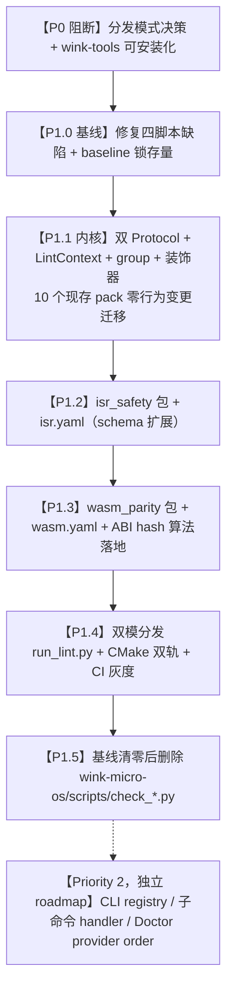

# Wink-Tools 嵌入式底层守卫与 CLI 插件化自发现架构集成计划

> **文档标识**：`docs/todolist/timing-infrastructure-and-dal-roadmap/12-wink-tools-embedded-guard-integration-plan.md`
> **关联 ADR**：[ADR-0003](../../decisions/unisim/0003-simulation-fidelity-boundary.md)（仿真可信度边界）、[ADR-0043](../../decisions/tools/0043-yaml-driven-layer-lint.md)（YAML 驱动分层 Lint）、[ADR-0047](../../decisions/core/0047-foc-isr-layering-and-pal-hwtimer.md)（FOC 前后台 ISR 分层）、[ADR-0051](../../decisions/tools/0051-scannable-codegen-extension-roots.md)（Codegen 扩展根外置）、[ADR-0061](../../decisions/tools/0061-wink-tools-plugin-registration-and-trust-boundary.md)（CLI 插件发现与信任边界）
> **创建日期**：2026-08-24
> **修订**：2026-08-24（架构评审后 v2：修正事实错配、补 P0 分发阻断、重设计 Pack 抽象、阶段重排）
> **演进结构**：P0 分发阻断 → P1.0 基线修复 → P1.1 Lint 内核插件化（零行为变更）→ P1.2/P1.3 ISR/Wasm 守卫 → P1.4 双模分发与 CI 灰度 → P1.5 清理；Priority 2（CLI 现代化）拆至独立 roadmap
> **责任领域**：`wink-tools`（工具链平台，位于兄弟仓 `wink-ai/packages/wink-tools/`）+ `wink-micro-os`（嵌入式固件，本仓）

> **路径约定**：下文 `<wink-tools>/` 指 wink-tools 检出根（当前事实路径 `../wink-ai/packages/wink-tools/`，分发模式落地后可能为 site-packages 或 submodule）。本开源仓 `wink-ai-embedded/` 内 **不存在** `wink-tools/` 目录，所有工具链路径均为 `<wink-tools>/tools/...`。

---

## 0. 评审修订摘要（v2）

v1 计划方向正确，但与代码现状存在多处事实错配。本修订版处理以下问题：

1. **wink-tools 不在本仓**，`pip install winkcli` 尚未实现 —— 升为 P0 阻断项。
2. **四个临时守卫脚本有已知缺陷**（abi hash 比较缺失、stub 只 warn 不 fail、日志文件例外未建模）—— 升为 P1.0 基线。
3. **LintPack 抽象与现存 10 个 pack 的异构签名不兼容**，且丢失 per-file/global 两阶段调度、group 语义、`paths` 增量参数 —— 重新设计为双 Protocol。
4. **新 YAML schema 与现有 `config.py` 允许 key 不兼容**，新规则无法被 allowlist/`--explain` 识别 —— 明确 schema 扩展方案。
5. **ISR 规则宏识别不全、flag 检查会漏报** —— 补宏清单、标注 regex 局限性。
6. **Wasm ABI hash 当前是 ASCII 魔数而非哈希**，且只哈希符号名捕获不到签名变更 —— 拍板算法。
7. **Doctor 已有 `toolchain/providers/REGISTRY`**，不另建平行注册表 —— 改为 provider `order` 属性。
8. 二级子命令 `set_defaults` 传类不传实例，保留懒加载。
9. P2 CLI 现代化与本 roadmap（timing/DAL）主题无关，拆至独立 roadmap。

---

## 1. 总体目标与优先级划分



核心原则：**先解分发（P0）→ 先修缺陷锁基线（P1.0）→ 先无行为变更重构（P1.1）→ 再加规则（P1.2/P1.3）→ 最后切流量与清理（P1.4/P1.5）**。禁止把重构、加规则、切门禁糊在一个阶段。

---

## 2. 【P0】分发阻断：wink-tools 可安装化

### 2.1 现状事实

- 本仓 `.github/workflows/pr.yml` 仅安装 `cmake ninja-build python3`，直接跑 `wink-micro-os/scripts/check_*.py` 四个本地脚本，**不触碰 wink-tools**。
- `.github/workflows/clang-tidy.yml:39-48` 引用 `wink-tools/requirements-lint-dal.txt` 与 `../wink-tools/wink.py lint --strict`，但本仓无 `wink-tools/` 目录，**该 workflow 当前已坏**。
- `wink-micro-os/cmake/wink_tools.cmake:19` 以 `list_drivers.py` 存在性校验 `WINK_TOOLS_ROOT`，缺失即 `FATAL_ERROR`。
- wink-tools 真实代码在兄弟仓 `../wink-ai/packages/wink-tools/`；根 `pyproject.toml` 仅含 `[tool.pyrefly]`，**无 `[project]`、无 `[project.scripts]`、无 CLI entry point**。
- 二进制名在文档/脚本中混用 `wink`、`winkcli`、`wink.py`，未定。
- ADR-0051 已声明 wink-tools 计划为闭源/受限分发产物。

### 2.2 决策项（执行前必须拍板）

| 决策点 | 选项 | 本计划建议 |
|---|---|---|
| 开源 CI 如何获取 wink-tools | (a) PyPI 发包 `winkcli`；(b) Git submodule；(c) CI 用 secret checkout 私有仓 | **(a)**，与 ADR-0051 受限分发方向一致，且本地开发者体验最好 |
| 命令名 | `wink` / `winkcli` | **`winkcli`**（避免与其他 `wink` 命名冲突；保留 `wink` 别名至下一大版本） |
| codegen 是否也走二进制 | 仍要求源码 `WINK_TOOLS_ROOT` / 改走 `winkcli gen ...` 子进程 | **后者**，否则二进制-only 环境 CMake configure 仍 FATAL_ERROR |

### 2.3 交付物

1. `<wink-tools>/pyproject.toml` 增补：
   ```toml
   [project]
   name = "winkcli"
   version = "0.1.0"
   requires-python = ">=3.10"
   dependencies = ["pyyaml", "jinja2", "rich"]
   [project.scripts]
   winkcli = "tools.cli.__main__:main"
   wink = "tools.cli.__main__:main"   # 过渡期别名
   ```
2. `wink-micro-os/cmake/wink_tools.cmake` 增 `find_program(WINK_CLI_EXECUTABLE NAMES winkcli wink)`，codegen 路径统一改调 `${WINK_CLI_EXECUTABLE} gen ...`，删除对 `list_drivers.py` 的直接文件探测（保留 `WINK_TOOLS_ROOT` 源码模式作为开发回退）。
3. 修复 `.github/workflows/clang-tidy.yml` 的路径引用。
4. ADR-0043 "影响范围" 中误写的 `wink-micro-os/tools/lint/` 路径修正为 `<wink-tools>/tools/lint/`。

> **门禁**：P0 未完成前，P1.4 不得合并。P1.1~P1.3 可在源码模式下并行开发。

---

## 3. 【P1.0】基线修复：让现有守卫真正生效

### 3.1 现有脚本缺陷清单

`wink-micro-os/scripts/` 下四个脚本是 P1 完成前的实际门禁，须先修缺陷：

| 脚本 | 缺陷 | 修复 |
|---|---|---|
| `check_wasm_abi_hash.py` | 算出 `computed_u32` 与 `current_u32` 后**从不比较**，无条件 `return 0` | 补比较逻辑，不一致 exit 1 |
| `check_wasm_abi_hash.py` + `pal_wasm_degradation.c:80` | `PAL_WASM_ABI_HASH = 0x50333038` 是 ASCII `"P308"`，非任何哈希前缀 | 采用 §5.3 算法重算并更新宏值 |
| `check_wasm_stub_symbols.py` | 缺失符号只打印 Warning，永远 `return 0` | 缺失即 exit 1（存量缺失项登记 baseline） |
| `check_isr_no_log.py` | 硬编码跳过 `pal_log_*` 文件；deny 列表与 §5.1 不一致 | 例外改为 YAML/配置驱动，deny 列表对齐 |

### 3.2 baseline 锁定

修复后立即用 `winkcli lint --baseline <file>`（已存在的 `engine/baseline.py` fingerprint 减法机制）锁定存量 finding：
```bash
python -m tools.lint.cli --pack layering --pack api --pack dal \
    --root ../wink-micro-os --baseline .github/lint-baseline.json
```
门禁标准为：**baseline 外 0 新增；baseline 内每项有跟踪 issue**。不接受"0 错误 0 警告"式一刀切。

### 3.3 灰度与回滚开关文档化

- 所有新规则首发 `severity: warning`，稳定至少一周后改 `error`。
- 紧急误报用现有 YAML overlay 的 `disable_rules` 机制关闭，无需发版。
- `--rule RULE_ID` 可单独启用/禁用定位问题。

---

## 4. 【P1.1】Lint 内核插件化（零行为变更重构）

### 4.1 现状核对

`<wink-tools>/tools/lint/engine/runner.py`：
- 第 11–20 行：10 个 `from tools.lint.packs.X import check_Y` 手动 import；
- 第 48–76 行：8 个 `if pack_set & {...}` 分支，第一个分支 fan-out 到 3 个 checker（include_graph / path_name / regex_ban），其余 7 个各调一个；
- 默认 pack 集 `{"layering", "api"}`；
- per-file 循环（第 41–56 行）经 `classify_file()` 得到 `layer_id` 后跑 layering+api 类；循环外跑 root 类（arduino/drivers/user_surface/abi/dal/i18n）。

`<wink-tools>/tools/lint/packs/`：17 个 `.py`（10 公开 + 7 个私有 `dal_struct/dal_quantity/dal_yaml_parity/dal_contract_doc/dal_api_shape/dal_lifecycle/dal_concurrency/dal_blocking`，由 `dal.py` 内部调度）。`packs/__init__.py` 仅一行过时 docstring。

**无基类、无注册表、无装饰器**。10 个公开 pack 签名异构：
- per-file：`check_includes(rel, text, layer_id, cfg, *, root)`、`check_api_surface(rel, text, layer_id, kind, cfg)` 等；
- root：`check_arduino_isolation(root)`、`check_drivers(root, *, strict=False)`；
- 特殊：`check_dal(root, *, strict=False, paths=None)`、`check_i18n(root, cfg, mode="report")`。

### 4.2 双 Protocol 抽象（替换 v1 的单一 `run_check` 签名）

`<wink-tools>/tools/lint/engine/base.py`（新建）：

```python
from dataclasses import dataclass
from datetime import date
from pathlib import Path
from typing import Iterable, List, Optional, Protocol, runtime_checkable

from tools.lint.engine.config import LintConfig
from tools.lint.engine.models import Finding

@dataclass(frozen=True)
class LintContext:
    root: Path
    cfg: LintConfig
    strict: bool = False
    paths: Optional[List[Path]] = None
    today: Optional[date] = None

@runtime_checkable
class FilePack(Protocol):
    """逐文件处理：runner 已完成 rglob 与 classify_file。"""
    name: str
    aliases: tuple[str, ...]
    group: Optional[str]
    default_enabled: bool

    def run_on_file(self, rel: str, text: str, layer_id: Optional[str],
                    kind: Optional[str], ctx: LintContext) -> List[Finding]: ...

@runtime_checkable
class GlobalPack(Protocol):
    """全仓库扫描：自行遍历 root。"""
    name: str
    aliases: tuple[str, ...]
    group: Optional[str]
    default_enabled: bool

    def run_on_root(self, ctx: LintContext) -> List[Finding]: ...
```

`scope` 字段由 Protocol 类型本身区分，无需字符串枚举。`paths` 进入 `LintContext`，恢复 dal 包的增量检查能力。

### 4.3 注册器与装饰器

```python
PACK_REGISTRY: dict[str, object] = {}        # alias/name -> 实例
_PACK_GROUPS: dict[str, set[str]] = {}       # group -> {canonical name}

def register_pack(name: str, *, aliases: Iterable[str] = (),
                  group: Optional[str] = None,
                  default_enabled: bool = False):
    def decorator(cls):
        inst = cls()
        inst.name = name
        inst.aliases = tuple(aliases)
        inst.group = group
        inst.default_enabled = default_enabled
        PACK_REGISTRY[name] = inst
        for a in inst.aliases:
            PACK_REGISTRY[a] = inst
        if group:
            _PACK_GROUPS.setdefault(group, set()).add(name)
        return cls
    return decorator

def _reset_registry() -> None:
    """测试专用：清空注册表。"""
    PACK_REGISTRY.clear()
    _PACK_GROUPS.clear()

def _expand_pack_names(requested: Iterable[str]) -> set[str]:
    """把 group 名展开为其下全部 canonical name；'all' 由调用方处理。"""
    out: set[str] = set()
    for r in requested:
        if r in _PACK_GROUPS:
            out |= _PACK_GROUPS[r]
        else:
            out.add(r)
    return out
```

`layering` 不是单个 pack，而是组：

```python
@register_pack("include_graph", group="layering", default_enabled=True)
class IncludeGraphPack:
    def run_on_file(self, rel, text, layer_id, kind, ctx):
        from tools.lint.packs.include_graph import check_includes
        return check_includes(rel, text, layer_id, ctx.cfg, root=ctx.root)

# path_name、regex_ban 同组；api_surface 的 group=None 但 default_enabled=True
```

默认 `{"layering","api"}` 的语义通过组展开得到保留（layering → 3 个 pack，api → api_surface）。

### 4.4 通用调度器

`<wink-tools>/tools/lint/engine/runner.py`（重构后，节选）：

```python
def _auto_discover_packs() -> None:
    if PACK_REGISTRY:
        return
    for _, mod_name, _ in pkgutil.iter_modules(tools.lint.packs.__path__):
        if mod_name.startswith("_"):
            continue
        importlib.import_module(f"tools.lint.packs.{mod_name}")
    # 二期：按 ADR-0061 加载 entry-points 组 wink_tools.lint_packs

def run_lint(root, cfg, packs=None, paths=None, today=None, strict=False):
    _auto_discover_packs()
    ctx = LintContext(root=root, cfg=cfg, strict=strict, paths=paths,
                      today=resolve_today(today))
    requested = set(packs) if packs else \
        {k for k, v in PACK_REGISTRY.items()
         if getattr(v, "default_enabled", False) and k == v.name}
    if "all" in requested:
        active = {v for k, v in PACK_REGISTRY.items() if k == v.name}
    else:
        names = _expand_pack_names(requested)
        active = {PACK_REGISTRY[n] for n in names if n in PACK_REGISTRY}

    file_packs = [p for p in active if isinstance(p, FilePack)]
    global_packs = [p for p in active if isinstance(p, GlobalPack)]

    findings: list[Finding] = []
    for rel, text, layer_id, kind in _iter_classified_files(root, paths, cfg):
        for p in file_packs:
            findings.extend(p.run_on_file(rel, text, layer_id, kind, ctx))
    for p in global_packs:
        findings.extend(p.run_on_root(ctx))
    return apply_allowlist(findings, cfg, ctx.today)
```

要点：
- 下划线前缀模块不扫描；装饰器是唯一注册凭据；私有 `dal_*` 子包不打装饰器、由 `DALPack.run_on_root` 内部 import 调度。
- 保留 per-file/global 两阶段结构与 `classify_file` 调用，行为与重构前等价。
- alias 与 canonical name 共用 `PACK_REGISTRY`，去重靠 `k == v.name`。

### 4.5 迁移纪律

1. **本阶段不加任何新规则**，只把 10 个现存 pack 用适配器类包进装饰器模型，底层仍调原 `check_*` 函数。
2. 全部 18 个现存 lint 测试必须零修改通过；新增 `test_lint_pack_discovery.py` 断言：
   - 自动发现后恰有 10 个公开 pack 实例（按 canonical name 去重）；
   - `layering` 组展开为 3 个；`all` 包含全部；
   - 私有 `dal_*` 不在注册表；
   - alias 解析正确；
   - `_reset_registry()` 后注册表为空。
3. 顺手修正 `packs/__init__.py` 过时 docstring。
4. `--format sarif` 冒烟测试一次，确认 Finding 字段透传无误。

---

## 5. 【P1.2 / P1.3】嵌入式守卫包与 YAML schema

### 5.1 schema 决策

v1 的 `isr.yaml`/`wasm.yaml` 使用了 `rules:` / `deny_calls:` / `match_function_attributes:` 等自创顶层 key，但 `<wink-tools>/tools/lint/engine/config.py` 的 SDK 允许 key 固定为：

```
version, id, metadata, extends, layers,
include_rules, api_rules, path_rules, user_surface_rules, ignore
```

且 `engine/allowlist.py::_index_rules` 只索引后四个规则列表 —— 新 key 下的 finding **无法被 `allow_paths` 豁免**，`--explain` 也读不到 rationale。

**决策（方案 A）**：扩展 config 与 allowlist：
- `config.py` 允许 key 增 `isr_rules`、`wasm_rules`；
- `allowlist._index_rules` 同步索引这两个新列表；
- `--explain` 的规则查找源扩到全部六个规则列表；
- 规则字段沿用现有约定：`id`、`in`/`target_roots`、`deny_regex`/`deny_calls`、`context{strip_comments,strip_strings,scope_by_kind}`、`except_regex`、`allow_paths`、`message`、`severity`、`immutable`、`refs`。

语义检查无法用正则表达的（哈希计算、flag 数据流），由 pack 的 Python 代码完成，YAML 只承载声明式规则与元数据。

### 5.2 ISR 安全包（`<wink-tools>/tools/lint/packs/isr_safety.py` + `rules/isr.yaml`）

**宏/属性识别清单**（源自 `pal/include/wink_compiler.h:40-53` 与 `pal/include/pal_irq.h:85,105-110`）：
- `PAL_ISR`（展开为 `PAL_IRAM_TEXT` → `IRAM_ATTR`）
- `PAL_IRAM_TEXT`、`PAL_IRAM_DATA`、`PAL_IRAM_RODATA`
- `IRAM_ATTR`（ESP-IDF 原生）
- `PAL_DEFINE_ISR(name, type, arg)` —— 这是定义**两个函数**（wrapper + `name##_typed`）的宏，pack 必须识别宏体而非仅按 attribute 匹配函数

**规则 `ISR-NO-FLASH-CALL`**：
- 扫描根：`pal/`、`targets/`、`dal/`、`runtime/`
- 禁调用（YAML 可扩展）：`malloc/calloc/realloc/free`、`printf/vsnprintf/sprintf/snprintf`、`LOG_E/LOG_W/LOG_I/LOG_D`、`pal_os_sleep_ms`、`vTaskDelay`、非 FromISR 版 FreeRTOS API（`xQueueSend`/`xQueueReceive`/`xSemaphoreTake` 等，对应 FromISR 变体放行）、`abort`/`assert`、阻塞式 `pal_i2c_*`/`pal_spi_*` 传输。
- 例外：`pal_log_*` 实现文件用 `except_regex` 或 `allow_paths` 表达（对齐现有 `check_isr_no_log.py` 行为），不硬编码。
- **必须复用 `engine/lexer.py`，并开启 `context.strip_comments` 与 `strip_strings`**，防止注释/字符串中的 `malloc()` 误报。

**规则 `ISR-IRAM-FLAG-REQUIRED`**：
- 扫描 `targets/esp32/`，匹配 `esp_intr_alloc`/`esp_intr_alloc_intrstatus` 调用。
- 唯一真实调用点 `targets/esp32/pal_irq_esp32.c:76` 的 flags 是变量：
  ```c
  int flags = ESP_INTR_FLAG_IRAM | s_prio_flag_map[prio];
  esp_intr_alloc(source, flags, ...);
  ```
  朴素 call-arg AST 匹配看不到字面值。**采用 regex + 文件级兜底**（与现有脚本一致），并在规则 `message`/`help` 中明确标注此局限性，不伪装成精确数据流分析。后续可演进为 clang AST 方案，但不阻塞本阶段。

### 5.3 Wasm 跨端契约包（`<wink-tools>/tools/lint/packs/wasm_parity.py` + `rules/wasm.yaml`）

**ABI hash 算法（本计划拍板）**：
1. 从 `targets/wasm/wasm_bridge.h` 提取所有 `extern` 声明（`js_pal_*` 及其他 extern 函数/变量）；
2. 对每条声明做规范化（剥单行注释、压缩空白、按文本排序）；
3. 输入 = 排序后全部声明文本的拼接；
4. `hash = sha256(input)[:8]`（8 hex = 32-bit），以 `0x%08X` 写入：
   ```c
   #define PAL_WASM_ABI_HASH 0x<8hex>u
   ```
   替换当前 `pal_wasm_degradation.c:80` 的 ASCII 魔数 `0x50333038`。
5. 在 `wasm_bridge.h` 顶部/尾部注释中写明"任何 extern 增删改（含签名）必须重算 hash"。

**规则 `WASM-ABI-HASH-MATCH`**：按上述算法计算并比对，不一致报 error。这同时修复了 `check_wasm_abi_hash.py` 的空操作 bug。

**规则 `WASM-STUB-COVERAGE`**：`wasm_bridge.h` 中每个 `js_pal_*` 符号必须在 `targets/wasm/wink_sim_stub.js` 或 `wink_sim_js.js` 中出现；缺失即 error（对齐 P1.0 对 `check_wasm_stub_symbols.py` 的提级）。存量缺失项走 baseline。

### 5.4 测试交付

- `<wink-tools>/tools/tests/test_lint_isr_safety.py`：合法 ISR 不报、注入 `malloc` 报、`PAL_DEFINE_ISR` 宏体识别、注释/字符串剥离、`pal_log_*` 例外、FreeRTOS FromISR 变体放行。
- `<wink-tools>/tools/tests/test_lint_wasm_parity.py`：hash 匹配/不匹配、签名变更触发 hash 变化、stub 覆盖、存量 baseline。
- 故障注入端到端：临时在 `PAL_ISR` 函数体加 `malloc(10)`、在 `wasm_bridge.h` 加未实现 `js_pal_foo`，验证精准拦截。

---

## 6. 【P1.4】双模分发与 CI 灰度

### 6.1 跨平台分流脚本 `wink-micro-os/tools/run_lint.py`（新建目录）

解析顺序：
1. `$WINK_TOOLS_ROOT` 指向源码 → 调 `python -m tools.lint.cli`；
2. 兄弟目录 `../wink-ai/packages/wink-tools/` 存在 → 同上；
3. 否则回退全局 `winkcli`（P0 安装产物）。

脚本输出与 `winkcli lint` 完全一致（text/json/sarif），参数透传 `--pack`、`--strict`、`--baseline`、`--format`。

### 6.2 CMake 双轨

`wink-micro-os/cmake/wink_tools.cmake`：
- **Lint 轨**：`find_program(WINK_CLI_EXECUTABLE NAMES winkcli wink)`，二进制优先；
- **Codegen 轨**：优先 `${WINK_CLI_EXECUTABLE} gen ...` 子进程；`WINK_TOOLS_ROOT` 源码模式作为开发回退（仍校验 `list_drivers.py`）。
- 两轨独立判定，文档画清，不允许"lint 走二进制、codegen 隐式要求源码"的半吊子状态。

### 6.3 CI 灰度（替换 v1 的一步到位 snippet）

`.github/workflows/pr.yml`：

```yaml
jobs:
  host-build-and-test:
    strategy:
      matrix:
        os: [ubuntu-latest, windows-latest]   # 新增 Windows，覆盖 editable/pkgutil
    steps:
      - uses: actions/checkout@v4
      - uses: actions/setup-python@v5
        with: { python-version: '3.11' }
      - run: pip install winkcli             # P0 完成后生效
      # 1. 现有脚本门禁（P1.0 修完 bug 版），保留至 P1.5
      - run: python wink-micro-os/scripts/check_wasm_abi_hash.py
      - run: python wink-micro-os/scripts/check_wasm_stub_symbols.py
      - run: python wink-micro-os/scripts/check_isr_no_log.py
      - run: python wink-micro-os/scripts/check_isr_iram_flag.py
      # 2. 新引擎灰度采集，不阻塞
      - run: python wink-micro-os/tools/run_lint.py
                 --pack isr_safety --pack wasm_parity
                 --pack layering --pack api --pack dal
                 --baseline .github/lint-baseline.json
        continue-on-error: true
```

稳定一周后：把 `continue-on-error` 去掉，新引擎升为强制门禁；再一周后删除四个 script 步骤（P1.5）。

---

## 7. 【P1.5】清理

基线清零、新引擎强制门禁稳定后：
- 删除 `wink-micro-os/scripts/check_isr_iram_flag.py`、`check_isr_no_log.py`、`check_wasm_abi_hash.py`、`check_wasm_stub_symbols.py`；
- `run_lint.py` 保留为本地开发便捷入口；
- 修复 `clang-tidy.yml` 路径，统一走 `winkcli`。

---

## 8. 【Priority 2】CLI 现代化（拆至独立 roadmap）

以下三项与 timing/DAL 主题无关，拆至 [`docs/todolist/tools-cli-modernization-roadmap/00-cli-modernization-plan.md`](../tools-cli-modernization-roadmap/00-cli-modernization-plan.md)，P1 稳定后启动。此处仅记录约束，不含详细计划。

### 8.1 顶层命令自发现（`<wink-tools>/tools/cli/registry.py`）
- 现状：24 个 `_xxx_factory()` 闭包（第 98–192 行）+ **25** 条顶层 `register(...)`（第 194–218 行，`update` 是 `upgrade` 别名），共约 130 行。
- `@command` 装饰器与 `CommandBase` 已存在（第 46–54 行；`base.py:11-28`），但仅插件路径与 `test_cli_plugin_discovery.py` 使用，24 个内置命令全部走工厂。
- 重构：内置命令类直接标 `@command`，`register_default_commands()` 用 `pkgutil.walk_packages(tools.cli.commands.__path__, ...)` 自动加载，保留 `load_plugins()`（ADR-0061 entry-points）调用顺序。
- 注意：`gen/build/create/schema` **及 `dev/`** 均有 if-elif 梯子（v1 漏了 `dev/`）。

### 8.2 二级子命令懒 handler
- `set_defaults(cmd_handler=...)` 全仓零使用，是新引入。
- **传类不传实例**：`p.set_defaults(cmd_factory=FrontendAppDeviceTreeCommand)`，在 `run()` 内实例化，保留现有工厂的懒加载语义，避免 parser 构建期做工具链探测等重活。

### 8.3 Doctor provider 排序
- **不新建 `PROBE_REGISTRY`**：探针已存在于 `<wink-tools>/tools/toolchain/providers/REGISTRY`，`doctor.py:13-22` 的 `_DOCTOR_PROBE_ORDER` 只控 8 个已知项排序，未知 provider 已自动 append。
- 改造：在 provider 类上加 `order: int = 100` 类属性，`doctor.py` 按 `(order, name)` 排序，删除硬编码列表。新增探针 = 新增 provider 类，单一事实源。

---

## 9. 插件化信任边界（对齐 ADR-0061）

Lint pack 是继 CLI 命令后的第二个扩展面：
- **P1 阶段**：pack 与 wink-tools 同发布，`_auto_discover_packs()` 只扫内置 `tools.lint.packs`。装饰器是唯一注册凭据，下划线前缀模块不扫描。
- **二期（与 P2 协同）**：开放 entry-points 组 `wink_tools.lint_packs`，复用 ADR-0061 的加载、去重、错误隔离与信任边界规则；第三方 pack 冲突内置 name 时 stderr 告警并拒绝。
- 本计划不在 P1 实现第三方 pack 加载，但 `_auto_discover_packs()` 预留扩展点注释。

---

## 10. 里程碑

```text
阶段    任务                                                        目标路径（相对 <wink-tools>/ 或本仓）
----------------------------------------------------------------------------------------------------------
P0      分发决策 + pyproject [project]/scripts + CMake codegen 子进程  <wink-tools>/pyproject.toml, wink-micro-os/cmake/
        + 修 clang-tidy.yml + 修 ADR-0043 路径                         .github/workflows/, docs/decisions/tools/0043-*.md
----------------------------------------------------------------------------------------------------------
P1.0    修四脚本 bug + 重算 PAL_WASM_ABI_HASH + baseline 锁定         wink-micro-os/scripts/, .github/lint-baseline.json
        + 灰度/回滚开关文档                                            docs/design/06-build-toolchain/
----------------------------------------------------------------------------------------------------------
P1.1    新建 base.py(LintContext/FilePack/GlobalPack/装饰器)           tools/lint/engine/base.py
        零行为变更迁移 10 个现存 pack + runner 重构                    tools/lint/engine/runner.py, tools/lint/packs/*.py
        新增 test_lint_pack_discovery.py                              tools/tests/
        全部 18 个现存 lint 测试零修改通过
----------------------------------------------------------------------------------------------------------
P1.2    isr.yaml(schema 扩展 isr_rules) + isr_safety.py                tools/lint/rules/isr.yaml, tools/lint/packs/
        + test_lint_isr_safety.py                                     tools/tests/
----------------------------------------------------------------------------------------------------------
P1.3    wasm.yaml + wasm_parity.py + ABI hash 算法落地                 tools/lint/rules/wasm.yaml, tools/lint/packs/
        更新 pal_wasm_degradation.c 与 wasm_bridge.h 注释             wink-micro-os/targets/wasm/
        + test_lint_wasm_parity.py                                    tools/tests/
----------------------------------------------------------------------------------------------------------
P1.4    run_lint.py 双模分流 + CMake 双轨 + pr.yml 灰度(含 Windows)    wink-micro-os/tools/, cmake/, .github/
----------------------------------------------------------------------------------------------------------
P1.5    baseline 清零后删 scripts/check_*.py，新引擎升强制门禁         wink-micro-os/scripts/
----------------------------------------------------------------------------------------------------------
P2      CLI registry / 子命令懒 handler / Doctor provider order       独立 roadmap：docs/todolist/tools-cli-modernization-roadmap/00-cli-modernization-plan.md
```

---

## 11. 验收门禁

### P1 验收
1. **Pack 自发现**：在 `packs/` 新建带 `@register_pack(name="sample_test")` 的模块（非下划线前缀），`winkcli lint --pack sample_test` 能识别调度；下划线前缀模块被跳过。
2. **零行为变更回归**：P1.1 完成后 `winkcli lint --pack all` 对同一棵 `wink-micro-os` 树的 finding 集合与重构前**逐 fingerprint 一致**。
3. **ISR 故障注入**：在 `PAL_ISR` 函数体注入 `malloc(10)` 精准报 `ISR-NO-FLASH-CALL`；`PAL_DEFINE_ISR` 宏体注入同样命中；注释/字符串中的 `malloc()` 不报；`pal_log_*` 文件例外生效。
4. **Wasm 故障注入**：修改 `wasm_bridge.h` 任一 extern 签名但不改 hash → `WASM-ABI-HASH-MATCH` 报 error；新增 `js_pal_foo` 未在 stub 实现 → `WASM-STUB-COVERAGE` 报 error。
5. **双模分发**：源码模式（`WINK_TOOLS_ROOT`）与二进制模式（仅 `pip install winkcli`）下 `run_lint.py` 输出一致；Windows + `pip install -e` 下 auto-discovery 正常。
6. **存量门禁**：`winkcli lint ... --baseline .github/lint-baseline.json` 在 PR 上 baseline 外 0 新增；baseline 内每项有跟踪 issue。
7. **灰度可回滚**：任一规则可用 `--rule` 或 overlay `disable_rules` 在不发版情况下关闭；新规则首发 warning 有文档记录。

### P2 验收（独立 roadmap 细化）
1. `winkcli --help` 列出全部 25 个顶层命令（含 `update` 别名）与 6 个隐藏命令，功能等价。
2. `winkcli gen app-schema --app oled_dashboard` 直接命中对应 Command 类，无 if-elif。
3. 新增一个 provider 类（如 `NinjaProvider`，`order=45`），`winkcli doctor` 自动在 cmake 与 make 之间输出，无需改 doctor.py。

---

## 12. 文档回写义务（CLAUDE.md 规则）

- ADR-0043 路径修正（`wink-micro-os/tools/lint/` → `<wink-tools>/tools/lint/`）。
- P0 分发决策落地后：更新 `docs/design/06-build-toolchain/` 工具链获取与安装章节；新增 ADR 记录 PyPI/submodule 选择（若决策超出 ADR-0051 现有范围）。
- P1.1 schema 扩展（`isr_rules`/`wasm_rules`）回写 `docs/design/07-platform-governance/` 的 lint 规则目录。
- ISR 规则补充回写 `docs/design/02-wink-micro-os/` 中断/临界区策略章节（与 `micro-critical-section-policy.md` 对齐）。
- 本计划完成后归档至 `docs/design/implementation-plans/`（若转为正式实施计划），并在对应评审记录中链接。
