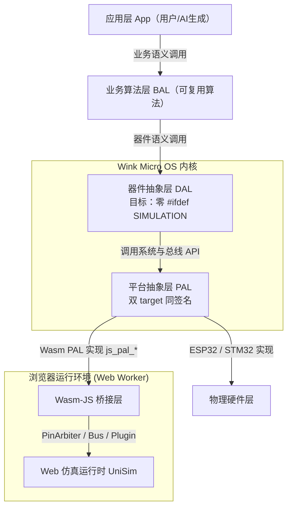

# 3.1 器件抽象层 (DAL) 架构设计规范与设备树生成

| 项 | 内容 |
|----|------|
| **Code-Mapping (内仓)** | `/src/core/dal/` (`dal_gpio.h`, `dal_i2c.h`, `dal_sensor.h`) |
| **关联 ADR** | ADR-0004、**ADR-0003**、ADR-0040、ADR-0046、ADR-0048、ADR-0050、**ADR-0051**、ADR-0056 |
| **关联技术设计** | [user-surface-insulation-design.md](../../tech-designs/tools/2026-07-28-user-surface-insulation-design.md)；[scannable-codegen-extension-roots-design.md](../../tech-designs/tools/2026-07-28-scannable-codegen-extension-roots-design.md) |
| **仿真路由专规** | [04-wasm-simulation/03-multi-channel-sim-routing.md](../04-wasm-simulation/archive/03-multi-channel-sim-routing.md)（四通道 PAL 旁路；DAL 目标零仿真宏） |
| **关联实施计划** | [user-surface-phase1-plan.md](../../implementation-plans/frontend/2026-07-28-user-surface-phase1-plan.md) |
| **关联评审** | [dal-control-semantic-completeness-review §10](../../reviews/core/2026-07-28-dal-control-semantic-completeness-review.md)；[user-surface-phase1-plan-review.md](../../reviews/frontend/2026-07-28-user-surface-phase1-plan-review.md) |
| **实践摘要** | [`dal-best-practices.md`](../../../wink-micro-os/docs/dal-development-guide/dal-best-practices.md) |

器件抽象层 (DAL, Device Abstraction Layer / 业务外设层) 是 WinkMicroOS 内核的核心特色组件。它承上启下，为应用层 (App) 和业务算法层 (BAL) 提供高度语义化的业务接口，为底层平台抽象层 (PAL) 提供器件驱动封装。

> **术语澄清**：
> - ✅ **App 层**：用户代码/AI 生成的一次性业务逻辑（如避障小车的状态机）
> - ✅ **BAL 层**：Business Algorithm Layer（业务算法工具库），包含物理增强、纯算法与闭环控制（内核静态库 `wink-micro-os/bal/`）
> - App 和 BAL 都只调用 DAL 接口，不直接操作硬件

> **DAL 开发手册**：[`wink-micro-os/docs/dal-development-guide/`](../../../wink-micro-os/docs/dal-development-guide/README.md)（快速上手 / 新增外设 / 最佳实践）。  
> **新增外设（ADR-0046 机制 + ADR-0051 路径）**：  
> - **机制保留**（ADR-0046）：单一 registry、`list_drivers` 数据型 CMake、`--mode=source|defs`、禁止手改多处驱动表。  
> - **SSOT 路径（ADR-0051 Accepted）**：默认机读描述在开源扩展根 `wink-micro-os/codegen/`（`drivers/*.yaml` + `roles/*.yaml`）；`wink-tools` 为闭源/引擎（扫描·校验·沙箱渲染·发射）。扫描顺序：**内置 → OS → env（CMake cache `WINK_CODEGEN_PATHS`）→ App**（App 最高）。迁移期可双读旧 `tools/codegen/drivers/*.py`。  
> - 标准路径见 [`adding-peripheral.md`](../../../wink-micro-os/docs/dal-development-guide/adding-peripheral.md)。决策：[ADR-0051](../../decisions/tools/0051-scannable-codegen-extension-roots.md)、[ADR-0046](../../decisions/core/0046-dal-driver-registry-ssot.md)；设计：[scannable-codegen-extension-roots-design](../../tech-designs/tools/2026-07-28-scannable-codegen-extension-roots-design.md)。

---

## 1. 核心愿景与设计初衷

如果让上层业务逻辑直接操作底层的硬件总线（如 GPIO, I2C, SPI, PWM），会带来三大致命缺陷：
1. **开发者心智负担重**：低代码用户或 AI 自动生成器必须关心传感器具体的寄存器读写时序（例如超声波 HC-SR04 的 10us 高电平 Trig 触发、DHT11 复杂的单总线微秒级握手电平）。这极易因时序错乱引起底层崩溃。
2. **Web 仿真性能恶梦**：在浏览器 Wasm 运行时环境中，如果强行去逐周期模拟 GPIO 微秒级的电平翻转或 I2C 时钟线 (SCL) 的波形跳变，会导致 Wasm 与 JS 桥接的通信调用频率极高，从而引发浏览器严重卡顿甚至假死。
3. **软硬件可移植性差**：同一个物理器件在不同板卡上的物理总线可能不同（如有的舵机接在 PWM 通道 0，有的接在通道 2）。把这些引脚和总线物理细节暴露给业务层，将导致业务逻辑无法在不同的硬件方案间移植。

为了彻底解决以上问题，Wink-AI 平台在上层业务（App/BAL）与 PAL 之间，显式地引入**器件抽象层 (DAL)**。它遵循：

1. **业务语义接口**：把外设变成逻辑组件（距离 cm、角度 °、帧缓冲），屏蔽寄存器与引脚时序细节。
2. **物理量来源替换（非业务直通）**：仿真性能优化落在 **PAL / Wasm target**，DAL 与真机跑同一套驱动逻辑；只替换电平、脉宽、总线从机响应、ADC raw、缓冲区等**物理量来源**（见 [ADR-0003](../../decisions/unisim/0003-simulation-fidelity-boundary.md)、[03-multi-channel-sim-routing](../04-wasm-simulation/archive/03-multi-channel-sim-routing.md)）。

---

## 2. 整体分层架构关系

DAL 在系统中的分层位置与数据流向如下图所示：



---

### 2.1 与经典 ops/container_of 四层架构的范式差异与能力映射

> 本节澄清 DAL 的设计范式选择。经典嵌入式 OOP 四层架构（见 skill 参考基线 [`runtime-polymorphism/architecture.md`](../../../.claude/skills/c-runtime-polymorphism-reading/references/runtime-polymorphism/architecture.md)）的核心机制是 **ops 表多态 dispatch（`me->ops->on(me)`）+ `container_of` 反推子类**。本平台的 DAL **有意识地偏离了这一范式**，特此声明，避免实现者误判。
>
> 相关决策见：**[ADR-0004：编译期静态分发与运行期 ops 多态选型决策](../../decisions/core/0004-static-dispatch-vs-runtime-ops.md)**。
> 相关关联：[评审报告 §2.1](../../reviews/core/2026-06-22-architecture-review.md)、[`01-system-overall/01-system-overview.md §3.1`](../01-system-overall/01-system-overview.md) 映射表。

#### 1. 范式差异对比

*   **本平台 DAL 的范式选择**：
    *   DAL 器件结构体（如 `dal_ultrasonic_t`）是**纯 POD 数据结构**，**无 `ops` 指针、无 `vptr`、无 `dal_base` 父类**。
    *   `dal_ultrasonic_read` 等是**按类型静态分发的自由函数**，首参传实例指针，直调底层。
    *   多态性通过**编译期 CMake 路由 + 每器件独立 `.c`** 实现，而非运行期 ops 表查表。
    *   PAL 层同样采用 CMake 静态直调（见 [`02-pal-platform-abstraction.md §1`](./02-pal-platform-abstraction.md)），弃用运行期函数指针注册。
    *   **POD 是内存态、非线协议/flash 布局（review P1-5 / Phase 6 Task 6-1）**：禁 `__attribute__((packed))` / `#pragma pack`（自然对齐，避免 ARM/Xtensa 对齐故障）；成员按对齐需求降序排列；跨进程/边界的 wire/flash 结构须独立命名（`xxx_wire_t` / `xxx_flash_record_t`，带 version/endianness/CRC），**禁 `memcpy` 运行时 POD 到 wire/flash**，须经 serialize/deserialize。详见 [`.claude/rules/c-code.md §4`](../../../.claude/rules/c-code.md)。

*   **为何放弃运行期 ops 多态**：
    1.  **AI 可生成性**：命名式 API（`dal_ultrasonic_read`）比 `me->ops->read(me)` 更直观、更易由 AI 确定性生成、更易通过编译器和静态规则进行指针安全校验。
    2.  **仿真性能**：静态分发消除了 Wasm 环境中的 `call_indirect` 间接调用跳转，大幅降低 Wasm 与 JS 频繁桥接的通信开销。
    3.  **MVP 单实现前提**：本系统外设拓扑在编译期完全确定，不需要运行期动态切换设备驱动实现。

---

#### 2. 对照运行时多态“三大核心好处”的能力映射与代偿

有人可能会质疑：舍弃了运行时多态（C OOP），是否会丢掉其带来的“屏蔽硬件差异”、“统一容器管理”、“动态热插拔”这三大经典优势？
答案是：**我们通过“编译期/代码生成器 (Codegen)”在工具链侧实现了同等代偿，或将其定义为 Non-goal。**

| 运行时多态的核心好处 | 本项目方案的代偿与设计设计（静态分发 + Codegen） | 是否失去 |
| :--- | :--- | :--- |
| **1. 屏蔽硬件差异 (开闭原则 OCP)** | **Codegen 设备树绑定**：当硬件引脚或总线改变时，业务代码 `dal_led_on(&front_led)` **一行都不用改**。修改操作发生在低代码前端，由 Codegen 重新生成 `device_tree.c` 里的全局 POD 实例参数。平台移植则通过 CMake 切换链接 `targets/`。 | **没有失去**，由运行期跳转变为编译期绑定。 |
| **2. 统一容器管理 (生命周期控制)** | **Codegen 静态展开**：虽然无法声明通用指针数组并用 `for` 循环遍历，但 Codegen 会在生成的 `device_tree.c` 中直接帮我们生成扁平的、显式的顺序调用（如自动生成 `device_tree_init()` 统一执行器件初始化）。这换来了**零内存开销、绝对的静态安全和极佳的断点调试体验**。 | **运行时遍历失去，但由 Codegen 静态生成代偿**。 |
| **3. 运行时动态替换与热插拔** | **定义为 Non-goal (非设计目标)**：本低代码系统的外设（舵机、传感器等）在硬件接线确定后即固化，不存在运行时热插拔驱动的需求。 | **彻底失去**，但通过降低 RAM 开销与提升 AI 代码生成率进行了良性交换。 |

> **局部演进路线 (Evolution Path) & 驱动变体兼容策略**：
> 同一种逻辑设备（如直流电机）可能由不同模块/芯片驱动（H 桥 L298N、TB6612、DRV8833，或 I2C 智能驱动等）。上层调用须保持语义一致。处理方式：
>
> 1. **机制一 — 语义不变 + 拓扑枚举（同类电气）**：控制原理相近（如有刷 H 桥）时合并为同一 DAL（如 `dal_dc_motor`）。config 以**同族变体**为一等公民（字段名统一 **`variant`**：默认 **`in_in`**（今日 PWM+IN_A+IN_B）；**预留** `phase_enable` / `pwm_on_in`），可选 `enable_pin`（STBY/nSLEEP）。芯片名仅作 JSON/板级别名，由 codegen 映射到 `variant`；**禁止** `WINK_USE_L298N` 式按芯片条件编译。`WINK_USE_DC_MOTOR` 只裁**整类**驱动；若需按变体裁 `.text`（Wave B），用可选能力宏（如 `WINK_DC_MOTOR_HAS_PWM_ON_IN`）包住 `case DAL_DC_MOTOR_VARIANT_PWM_ON_IN`，由 codegen 按 App JSON 变体并集写 `-D`（全量构建默认 `HAS_*=1`）。默认可不裁、纯 runtime `switch`。代码示意见 [`dal-best-practices.md` §3.3](../../../wink-micro-os/docs/dal-development-guide/dal-best-practices.md)。
> 2. **机制二 — 独立 DAL + 编译期别名（总线/语义不同）**：接口根本不同（GPIO H 桥 vs I2C 寄存器 vs 串口 ESC）时拆成独立 `dal_*` + 各自 `WINK_USE_*`。Codegen 可在 `device_tree.h` 用宏绑定同一业务名：
>    ```c
>    #define left_motor_set_speed(spd)  dal_dc_motor_set_speed(&left_motor, spd)
>    /* 或绑定到其它类型的语义 API */
>    ```
> 这样既避免虚表，又对 App/AI 保持硬件透明。若需运行时探测芯片，仅在**该 DAL `.c` 内部**局部路由，**不破坏**上层静态命名契约。

---

---

## 3. DAL 接口设计规范 (API Design Patterns)

DAL 层主要由两部分组成：
1. **高抽象的 C 语言逻辑句柄结构体**：定义外设的逻辑特性与运行缓存，不耦合物理引脚编号。
2. **无总线依赖的业务语义函数**：仅暴露与物理世界一致的数据接口。

### 3.0 DAL API 稳定性契约（ADR-0015 / ADR-0017）

所有 DAL 驱动必须遵守两条硬契约：

**契约 A · init 必须 claim 物理资源（ADR-0009 落地闭环）**

每个 `dal_xxx_init(dev, cfg)` 在参数校验之后**必须**向 `pal_resource_claim` 登记它占用的硬件资源（GPIO 引脚 / PWM 通道 / I2C 地址 / UART 端口），否则 `pal_resource` 层沦为空壳——host/wasm 单测阶段无法暴露引脚 mux 冲突，到真机才电气冲突。

规则：
- 多资源 claim 需按顺序尝试，任一失败要**回滚已 claim 的资源**（如 `dal_ultrasonic_init` claim trig + echo：echo 失败必须 release trig）。
- claim 失败（`WINK_ERR_BUSY` / `WINK_ERR_RESOURCE_EXHAUSTED`）**直接透传返回值**，不设 `dev.state`——让上层看到明确错误码。**每一错误码的语义 / 恢复策略 / 是否可作 `WINK_PT_EXIT` 条件**：见 [错误模型规范 §11](../07-platform-governance/02-error-fault-model.md#11-ai-codegen-错误码语义详表)（SSOT）。
- owner 字符串使用 `__func__` 或 `"dal_xxx"` 常量（rodata 只读，DAL 传入的字符串生命周期覆盖整个进程）。
- 详细落地清单见 `PLAN-20260701-WMOS-CODE-OPTIMIZATION-Q3` Track A（M1）。

**契约 B · 阻塞 API 硬隔离（ADR-0017 三层保护）**

违反 ADR-0007 协作式执行契约的 API（单次调用 busy-wait > 一个 runtime tick / 硬件轮询未主动 yield）**必须**同时挂载三层保护：

1. **编译期属性**：`WINK_BLOCKING` 触发 `-Wdeprecated` 警告（GCC/Clang/MSVC 三分支）；
2. **符号级剔除**：声明与实现用 `#ifndef WINK_STRICT_NONBLOCKING` 包围，协作式调度构建路径下声明从头文件消失、链接期报 undefined reference；
3. **运行期检测**（协作式调度器 T5 阶段交付）：`WINK_ASSERT_NONBLOCKING()` 统一拦截宏在 PT 上下文触发 panic + trace fault。

首个应用点：`dal_ultrasonic_read`（worst-case ≈60ms busy-wait）。未来慢速传感器（DHT11 / RFID / 慢速 SPI）沿用同样模式。

红线：**不允许**只挂 `WINK_BLOCKING` 而不加 `#ifndef` 包围（AI Codegen 会绕过警告）；**不允许**只提供 blocking 版本而不提供非阻塞替代路径（`@see` 引导必须存在）。

### 3.1 超声波测距传感器 (HC-SR04) 示例

#### 头文件定义：`dal_ultrasonic.h`
```c
#ifndef DAL_ULTRASONIC_H
#define DAL_ULTRASONIC_H

#include <stdint.h>
#include "wink_status.h"

/**
 * @brief 超声波传感器逻辑句柄
 * 属性由低代码前端拖拽编排后自动生成到设备映射表（Device Tree）中
 */
typedef struct {
    uint16_t trig_pin;      // 逻辑触发引脚
    uint16_t echo_pin;      // 逻辑回响引脚
    float last_distance;    // 缓存上一次成功测量的距离 (单位: cm)
} dal_ultrasonic_t;

/**
 * @brief 请求非阻塞距离测量（状态机化，推荐 API）
 * @note request_measurement + get_cached_distance 组成 IDLE/MEASURING/READY/ERROR
 *       状态机；协作式主循环内每 tick 轮询 get_cached_distance,读到 WINK_OK 即用。
 */
WINK_WARN_UNUSED_RESULT wink_status_t dal_ultrasonic_request_measurement(dal_ultrasonic_t *dev);
WINK_WARN_UNUSED_RESULT wink_status_t dal_ultrasonic_get_cached_distance(const dal_ultrasonic_t *dev, float *distance_cm);

#ifndef WINK_STRICT_NONBLOCKING
/**
 * @brief 获取当前障碍物距离（阻塞 busy-wait，@deprecated，ADR-0017 三层硬隔离首个应用点）
 * @deprecated 协作式 runtime 10ms tick 不得调用；worst-case ≈60ms 忙等会挂死真机 WDT。
 *             使用 request_measurement + get_cached_distance 替代。
 * @note 编译层保护：`WINK_BLOCKING` 触发 `-Wdeprecated` 警告（GCC/Clang/MSVC 三分支）。
 * @note 链接层保护：协作式调度构建路径开启 `-DWINK_STRICT_NONBLOCKING=1`，本声明与
 *       实现从头文件与链接符号表中消失，误用编译期即报 undefined reference。
 * @note 运行层保护（协作式调度器 T5 阶段交付）：PT 上下文调用触发
 *       `WINK_ASSERT_NONBLOCKING()` panic + trace fault。
 */
WINK_BLOCKING WINK_WARN_UNUSED_RESULT
wink_status_t dal_ultrasonic_read(dal_ultrasonic_t *dev, float *distance_cm);
#endif  /* WINK_STRICT_NONBLOCKING */

#endif // DAL_ULTRASONIC_H
```

### 3.2 模拟舵机 (SG90) 示例

#### 头文件定义：`dal_rc_servo.h`
```c
#ifndef DAL_RC_SERVO_H
#define DAL_RC_SERVO_H

#include <stdint.h>
#include <stdbool.h>
#include "wink_status.h"

/** @brief 舵机 PWM 时钟需求（DAL 语义；不引用 pal_*，ADR-0034） */
typedef uint8_t dal_rc_servo_clock_requirement_t;
enum {
    DAL_RC_SERVO_CLOCK_AUTO            = 0,
    DAL_RC_SERVO_CLOCK_STABLE_REQUIRED = 1,
};

typedef struct {
    const char                    *owner;
    uint8_t                        pwm_channel;
    uint8_t                        resolution_bits;   /* 0 = AUTO → 平台默认 13-bit */
    dal_rc_servo_clock_requirement_t  clock_requirement; /* 0 = AUTO */
    float                          min_pulse_ms;
    float                          max_pulse_ms;
} dal_rc_servo_config_t;

typedef struct {
    dal_rc_servo_config_t config;
    float              current_angle;
    bool               initialized;
} dal_rc_servo_t;

wink_status_t dal_rc_servo_init(dal_rc_servo_t *dev, const dal_rc_servo_config_t *cfg);
wink_status_t dal_rc_servo_set_angle(dal_rc_servo_t *dev, float angle);
wink_status_t dal_rc_servo_safe_off(dal_rc_servo_t *dev);
wink_status_t dal_rc_servo_deinit(dal_rc_servo_t *dev);

#endif // DAL_RC_SERVO_H
```

> **ADR-0034**：`resolution_bits` / `clock_requirement` 为零时行为等同今日 `pal_pwm_init(ch, 50)`（13-bit + AUTO）。DAL 头文件**禁止**出现 `pal_*` 类型；由 `dal_rc_servo.c` 映射到 `pal_pwm_init_ex`。Flash override wire v1 仍为 **9 bytes**（channel + min/max pulse），**不含** advanced 字段。
### 3.3 LED 指示灯示例

#### 头文件定义：`dal_led.h`
```c
typedef struct {
    uint16_t pin;
    bool active_high;
    bool is_on;
    bool initialized;
} dal_led_t;

wink_status_t dal_led_init(dal_led_t *dev, uint16_t pin, bool active_high);
wink_status_t dal_led_on(dal_led_t *dev);
wink_status_t dal_led_off(dal_led_t *dev);
wink_status_t dal_led_set(dal_led_t *dev, bool on);
wink_status_t dal_led_toggle(dal_led_t *dev);
```

**仿真通道**：通道 1 Pin-Level（见 [03-multi-channel-sim-routing](../04-wasm-simulation/archive/03-multi-channel-sim-routing.md)）。  
`dal_led` **不含** `#ifdef SIMULATION`；电气旁路完全落在 `pal_gpio_write` → `js_pal_gpio_write` → `PinArbiter`。

### 3.4 物理按键示例

#### 头文件定义：`dal_button.h`
```c
#define DAL_BUTTON_DEBOUNCE_THRESHOLD 3

typedef uint8_t dal_button_pull_t;
enum {
    DAL_BUTTON_PULL_AUTO = 0, /* active_low → UP，否则 DOWN（今日默认） */
    DAL_BUTTON_PULL_UP   = 1,
    DAL_BUTTON_PULL_DOWN = 2,
    DAL_BUTTON_PULL_NONE = 3,
};

typedef struct {
    const char        *owner;
    uint16_t           pin;
    bool               active_low;
    dal_button_pull_t  pull; /* 0 = AUTO；ADR-0034 */
} dal_button_config_t;

typedef struct {
    dal_button_config_t config;
    bool    stable_pressed;
    bool    last_reported;
    bool    initialized;
    uint8_t debounce_counter;
    /* … Wave 3/4 event / IRQ 字段见实现头文件 … */
} dal_button_t;

wink_status_t dal_button_init(dal_button_t *dev, const dal_button_config_t *cfg);
wink_status_t dal_button_poll(dal_button_t *dev);
wink_status_t dal_button_is_pressed(const dal_button_t *dev, bool *out_pressed);
wink_status_t dal_button_was_pressed(dal_button_t *dev, bool *out_was_pressed);
```

**仿真通道**：通道 1 Pin-Level。去抖逻辑**同源**（DAL 无 `#ifdef`）；  
`pal_gpio_read` → `js_pal_gpio_read` → `PinArbiter`。  
`dal_button_poll` 在每 tick 调用一次，内部维护计数式去抖状态机。

> **ADR-0034 渐进披露**：
> - `pull=AUTO`（缺省）保持今日行为：`active_low` → 内部上拉，否则下拉。
> - `active_low` 只表示逻辑极性；与电气上下拉解耦（除 AUTO 推导外）。
> - 非法 `pull` 须在 `pal_resource_claim` **之前**返回 `WINK_ERR_INVALID_ARG`。
> - `pull=NONE`：host/wasm 未注入外部电平时 `pal_gpio_read` / `dal_button_poll` 返回 `WINK_ERR_DISCONNECTED`，**不**默认判为按下。

### 3.4.1 渐进披露配置原则（ADR-0034）

| 层 | 暴露内容 |
|----|----------|
| L1 `wink-app.json` | 语义字段 only（button: `pin`/`active_low`；servo: `pwm_channel`/`min_pulse_ms`/`max_pulse_ms`） |
| L2 `advanced.*` | 专家 escape（`pull` / `resolution_bits` / `clock_requirement`）；**唯一** L2 表示 |
| DAL C API | 完整字段，`0`/`AUTO` = 今日默认；**不泄漏** `pal_*` 类型 |

公共 POD 增字段按 [ADR-0028](../../decisions/core/0028-host-binary-abi-toolchain-contract.md) bump ABI（本波次目标 `0.2.0` / `ABI=2`）。
### 3.5 SSD1306 OLED 显示屏示例

#### 头文件定义：`dal_ssd1306.h`
```c
#define SSD1306_FB_SIZE 1024

typedef struct {
    uint8_t  i2c_port;
    uint16_t i2c_addr;
    uint16_t width;
    uint16_t height;
    const char *owner;
} dal_ssd1306_config_t;

typedef struct {
    uint8_t  framebuffer[SSD1306_FB_SIZE];
    uint16_t i2c_addr;
    uint16_t width;
    uint16_t height;
    uint8_t  i2c_port;
    uint8_t  pages;
    bool     initialized;
} dal_ssd1306_t;

wink_status_t dal_ssd1306_init(dal_ssd1306_t *dev, const dal_ssd1306_config_t *cfg);
wink_status_t dal_ssd1306_clear(dal_ssd1306_t *dev);
wink_status_t dal_ssd1306_draw_text(dal_ssd1306_t *dev, uint16_t col, uint8_t page,
                                    const char *str);
wink_status_t dal_ssd1306_flush(dal_ssd1306_t *dev);
```

**仿真通道**：通道 2 Bus Protocol。`dal_ssd1306` **不含** `#ifdef SIMULATION`；  
DAL 只产出 SSD1306 命令/帧缓冲字节并经 `pal_i2c_transfer` 发送。  
旁路落在 `pal_i2c_transfer` → `js_pal_i2c_transfer` → `I2CBus` → `MonoOledPlugin`（framebuffer → UI Canvas / Wokwi）。

**Phase 2 资源治理**：`dal_ssd1306_init` 调用 `pal_resource_claim(PAL_RESOURCE_I2C_ADDR,
pal_resource_i2c_id(port, addr), owner)`，实现 `(port, 7位地址)` 粒度冲突检测。

---

## 4. 虚实融合双模运行机制 (Dual-mode Execution)

DAL **不**再以「DAL 内 `#ifdef SIMULATION` 业务直通」作为仿真主路径。双模差异收敛在 **PAL 的双 target 实现**（ESP32 vs Wasm），DAL / App / BAL 共用同一份驱动与业务代码。

```text
                         ┌─────────────────────────┐
                         │   dal_ultrasonic.c       │  ← 真机 / 仿真同一份
                         │   request + pulse_in     │
                         │   + 换算 / 超时 / 错误码 │
                         └────────────┬────────────┘
                                      │ pal_gpio_* / pal_gpio_pulse_in
                         ┌────────────┴────────────┐
                         ▼                         ▼
              ┌──────────────────┐      ┌──────────────────────────────┐
              │ PAL Esp32 实现   │      │ PAL Wasm 实现                │
              │ 真实 GPIO/定时器 │      │ js_pal_gpio_* → PinArbiter   │
              └──────────────────┘      │ Plugin 注入 ECHO 沿（终态）  │
                                       └──────────────────────────────┘
```

保真原则（[ADR-0003](../../decisions/unisim/0003-simulation-fidelity-boundary.md) + [03-multi-channel-sim-routing](../04-wasm-simulation/archive/03-multi-channel-sim-routing.md)）：

| 层级 | 规则 |
|---|---|
| App / BAL / DAL | **目标零** `#ifdef SIMULATION`；禁止返回 cm/°C 等业务语义捷径 |
| PAL API | 双 target **同签名** |
| PAL Wasm / `wasm_dev_*` / UniSim Plugin | **唯一**合法物理量来源替换点 |
| ProductWorld / Raycaster | 仅表现层；距离注入 Plugin，**禁止**穿透回 DAL |

### 4.1 超声波：目标路径与过渡缺口

> **API 现状**：阻塞式 `dal_ultrasonic_read` 为 **@deprecated**（busy-wait worst-case ≈ 60ms+），BAL/runtime 10ms tick 不得调用。应使用非阻塞 `dal_ultrasonic_request_measurement` + `dal_ultrasonic_get_cached_distance`。所有器件须经 `dal_ultrasonic_init` 显式初始化。

**目标路径（通道 1 Pin-Level，高一致）**：

```text
ControlHub / ProductWorld
  → UltrasonicPlugin（distanceCm）
  → VirtualClock 下向 PinArbiter 注入 ECHO 高低沿
  → C：pal_gpio_write(TRIG) + pal_gpio_pulse_in(ECHO)   ← 测量路径同源
  → DAL：脉宽→cm 换算 / 超时 / 错误码                   ← 业务路径同源
```

**同源示例（示意，无 DAL 仿真分支）**：

```c
#include "dal_ultrasonic.h"
#include "pal_hal.h"
#include "pal_osal.h"

/* 真机与 Wasm 共用：旁路在 PAL，不在本文件 */
wink_status_t dal_ultrasonic_request_measurement(dal_ultrasonic_t *dev) {
    if (dev == NULL || !dev->initialized) return WINK_ERR_INVALID_ARG;

    pal_gpio_write(dev->trig_pin, true);
    pal_delay_us(10);
    pal_gpio_write(dev->trig_pin, false);

    uint32_t pulse_us = 0;
    wink_status_t st = pal_gpio_pulse_in(dev->echo_pin, /*high*/true,
                                         /*timeout_us*/30000u, &pulse_us);
    if (st != WINK_OK) return st;
    if (pulse_us >= 30000u) return WINK_ERR_TIMEOUT;

    dev->last_distance = (float)pulse_us * 0.017f; /* 换算两端同源 */
    return WINK_OK;
}
```

**过渡缺口（须收敛，勿当新样板）**：

* 已淘汰：`js_sim_trigger_ultrasonic` / `js_sim_measure_echo_pulse_us`，以及 DAL 内 `#ifdef SIMULATION` 直读 3D 距离。
* 现状 Partial：`targets/wasm/devices/wasm_dev_ultrasonic.c` 仍可能经 `js_sim_get_plugin_channel(..., "distanceCm")` 在 C 仿真模型内 cm→μs，冒充 `pulse_in` 结果——属 **Deprecated shortcut**，收敛方向见路由专规 §2.1 / §5.1。
* Plugin Channel **允许**向 Plugin 注入物理距离；**禁止** DAL 直接读 channel 并 `return` 给 App。

### 4.2 带来的核心价值

1. **驱动可测**：换算、超时、错误恢复在仿真中真实执行，避免「仿真绿、真机挂」的假覆盖。
2. **性能仍可控**：昂贵部分（I2C bit 时序、WS2812 归零码）在 PAL 通道 2/4 以事务/缓冲区旁路，而不是砍掉 DAL。
3. **表现层解耦**：Three.js Raycaster / ControlHub 只喂 Plugin；与固件边界清晰，便于 Accuracy Mode（`behavioral` / `timing`）门禁。

通道选型、落地状态与验收清单见：**[04-wasm-simulation/03-multi-channel-sim-routing.md](../04-wasm-simulation/archive/03-multi-channel-sim-routing.md)**。

---

## 5. 拓扑编排与静态设备树生成 (Device Tree Codegen)

在低代码编排面板中，用户在可视化的开发板上进行外设器件的“插拔”和“物理连线”。当用户点击“运行仿真”或“编译部署”时，代码生成器会解析前端的电路拓扑描述，静态实例化对应的 DAL 器件结构体，生成对应的**设备树映射代码**。

### 5.1 自动生成的设备描述头文件 `device_tree.h`
```c
#ifndef DEVICE_TREE_H
#define DEVICE_TREE_H

#include "dal_ultrasonic.h"
#include "dal_rc_servo.h"

// 声明外部可访问的逻辑器件实例
extern dal_ultrasonic_t front_radar;
extern dal_rc_servo_t neck_servo;

#endif // DEVICE_TREE_H
```

### 5.2 自动生成的设备描述源文件 `device_tree.c`
```c
#include "device_tree.h"

// 根据画布连线分配物理引脚：Trig -> 4, Echo -> 5
dal_ultrasonic_t front_radar = {
    .trig_pin = 4,
    .echo_pin = 5,
    .last_distance = 0.0f
};

// 映射物理 PWM 通道：Channel -> 0，脉宽范围适配 SG90 (0.5ms - 2.5ms)
dal_rc_servo_t neck_servo = {
    .pwm_channel = 0,
    .current_angle = 90.0f,
    .min_pulse_ms = 0.5f,
    .max_pulse_ms = 2.5f
};
```

### 5.3 静态设备树的 Flash 动态覆写（ADR-0008）

[ADR-0008](../../decisions/core/0008-dynamic-device-tree-config-flash.md) 为静态设备树增设「免编译逃生通道」：上述编译期 POD 默认值可被 Flash 中的覆写 blob 在启动时动态覆写（pin/脉宽等），免编译秒级生效真机调试。

- `device_tree.c` 额外持有一个覆写注册表 `(device_id → dev* → apply_fn)`，并提供 `device_tree_apply_flash_config()`；在 sample `app_init` 顶部、`dal_*_init` 之前调用——读 Flash blob → 改写静态实例字段 → 随后从结构体字段重建 config/引脚喂 `dal_*_init`。
- 各 DAL 提供 `dal_*_apply_override(void *dev, const uint8_t *params, uint16_t len)`，把 16B params 反序列化为类型化字段并做轻校验（与 `dal_*_init` 权威校验纵深配合）；非法不写。
- blob 解析、CRC32 契约、三 target 存储抽象（host 内存 / esp32 NVS / wasm no-op）属 PAL 层，见 [§4.2 PAL 规范](./02-pal-platform-abstraction.md)；损坏静默降级到编译期默认、绝不 Panic。

仿真通道选型、保真红线与验收清单见专有文档：**[04-wasm-simulation/03-multi-channel-sim-routing.md](../04-wasm-simulation/archive/03-multi-channel-sim-routing.md)**。

---

## 6. 外设分类边界规则 (Peripheral Classification Boundaries)

为解决边缘场景外设分类歧义问题，DAL 采用**「主要意图判定规则 (Primary Intent Rule)」**：外设的分类取决于其在系统中的**核心业务用途**，而非其硬件接口或技术实现方式。同一种硬件器件在不同业务场景下可能归属于不同分类。

| 外设 / 器件 | 所属分类 | 主要意图 | 判定理由 |
| :--- | :--- | :--- | :--- |
| **旋转编码器 (HMI 菜单)** | `input` | 人机交互 (Human-Machine Interface) | 由操作人员旋转/按压进行菜单选择，属人机输入事件。 |
| **旋转编码器 (电机测速)** | `sensor` | 客观物理量测量 | 用于测量电机转轴的转速/方向，属物理传感器数据采集。 |
| **NeoPixel (WS2812) 灯带矩阵** | `display` | 图形化 / 矩阵渲染 | 高带宽像素级可视化输出，用于显示图案、波形、动画等。 |
| **NeoPixel (WS2812) 单颗状态灯** | `output` | 简单状态指示 | 仅用于低带宽状态闪烁（如电源灯、连接状态），语义上等同于普通 LED。 |
| **无源蜂鸣器 (提示音)** | `output` | 简单信号指示 | 产生声音提示信号；作为 Output 分类避免过度设计。 |
| **矩阵键盘 / 触摸屏幕** | `input` | 人机交互事件采集 | 收集用户触摸或按键输入事件。 |
| **OLED/LCD 显示屏** | `display` | 文本/图形渲染 | SSD1306 等屏幕驱动归于此分类。 |
| **LED 指示灯** | `output` | 二元开关输出 | 简单通断控制的指示灯。 |
| **物理按键 / 开关** | `input` | 二元输入采集 | 用户按键输入。 |
| **舵机 / 步进电机** | `actuator` | 物理动作执行 | 产生机械运动的执行器。 |
| **超声波 HC-SR04 / DHTxx 温湿度** | `sensor` | 环境感知与测量 | 测距、测温等客观物理量采集。 |

### 6.1 分类目录架构

DAL 采用**扁平分类目录**结构，所有外设驱动按上表规则归类到以下子目录：

```
dal/include/
├── input/        # 人机输入（button, keypad, encoder-hmi, touchscreen）
├── output/       # 简单输出（led, buzzer, relay）
├── actuator/     # 运动执行器（servo, stepper, dc-motor）
├── display/      # 显示器件（ssd1306, ws2812-matrix, lcd1602）
├── sensor/       # 传感器（ultrasonic, dht, infrared, gps）
├── comm/         # 通信外设（uart-wifi, nfc, can, gps）
└── storage/      # 存储外设（eeprom, spi-flash, sdcard）

dal/src/
├── input/
├── output/
├── actuator/
├── display/
├── sensor/
├── comm/
└── storage/
```

> **注**：`comm` 与 `storage` 分类为 IoT 功能扩展预留，见 **Phase 3** 实现计划。

### 6.2 Actuator 控制语义分类（ADR-0048）

`actuator/` 目录下的电机类驱动**按控制语义（控制物理量）拆分**，而非按「是不是电机」命名。决策详见 [ADR-0048](../../decisions/core/0048-actuator-control-semantic-naming.md)、[ADR-0050](../../decisions/core/0050-rc-servo-industrial-servo-naming.md)（`rc_servo` ↔ `industrial_servo`）。

| # | DAL 驱动 | 控制语义 | 典型器件 | 关断语义 | 实现状态 |
|---|---|---|---|---|---|
| 1 | `dal_dc_motor` | 占空比 / 速度（开环） | 有刷 DC + H 桥（L298N / TB6612 / DRV8833） | `brake()` / `coast()` 显式；`safe_off` → **brake** | ✅ 已落地（T1 改名自 `dal_motor`） |
| 2 | `dal_rc_servo` | 绝对角度（开环 PWM） | SG90 / MG996R 航模舵机 | `safe_off` → limp（duty=0） | ✅ 已有 |
| 3 | `dal_stepper` | 步数 / 位置（开环） | 28BYJ-48、A4988、DRV8825、TMC2209 | `hold()` / `release()` | 🟡 预留（C3 触发） |
| 4 | `dal_industrial_servo` | 闭环位置 / 速度 / 力矩 | 工业伺服、ODrive、VESC（总线型） | disable / 抱闸 | 🟢 roadmap |
| 5 | `dal_bldc` | 换相 / FOC | 云台 / 轮毂 BLDC（本地 FOC） | 三相断开 | 🟢 roadmap（[ADR-0026](../../decisions/core/0026-foc-motor-dal-bal-separation.md)；ISR 分层见 [ADR-0047](../../decisions/core/0047-foc-isr-layering-and-pal-hwtimer.md)） |

**命名规范速记：**

- **`motor` 不做具体 DAL 前缀**——泛称 `motor` 仅用于 codegen Capability 别名层（如 `left_wheel_set_speed` → 绑定具体驱动）。
- **`dal_rc_servo` ≠ `dal_industrial_servo`**：前者为航模开环 PWM 角度；后者为工业闭环伺服，禁止混用。
- **关断语义随器件**：每类在 `wink_actuator_registry` 注册正确的 safe-off，不外推通用范式。
- **当前已落地实现**：`dal_rc_servo`、`dal_dc_motor`（`brake()` / `coast()`；`safe_off` 层级见 ADR-0048 附录）。
- **跨 Profile 量纲（ADR-0056）**：DAL 物理量分 A 类（执行器命令）/ B 类（传感器测量）。A 类在所有 Profile（含 32 位 Full）用定标整数、不用 float；B 类 Full 用 float、Micro 用定点，差异由 codegen binding 吸收；同源边界在 binding 层而非 DAL 签名。详见 [ADR-0056](../../decisions/core/0056-cross-profile-quantity-ab-class-and-scaled-integers.md) 与开发指南 [`dal-api-consistency-spec.md §9`](../../../wink-micro-os/docs/dal-development-guide/dal-api-consistency-spec.md)。（现存 `dal_dc_motor_set_speed(float)` 为 stable 迁移前现状，新 A 类驱动以定标整数为准。）

### 6.3 Phase 1 控制语义契约（User-Surface Track C）

> 与 [user-surface-phase1-plan](../../implementation-plans/frontend/2026-07-28-user-surface-phase1-plan.md) Track A/B 锁定；Role 动词表见 [01-app-business-logic § Role](../03-app-codegen/01-app-business-logic.md)。

| 驱动 | 钉死语义 | App 稳定面 |
|------|----------|------------|
| `dal_dc_motor` | 默认 `in_in`；IN/IN 真值表见 [`dal-best-practices §3.1`](../../../wink-micro-os/docs/dal-development-guide/dal-best-practices.md)；`phase_enable`/`pwm_on_in` 预留 | `open_loop_actuator`：`set_speed`/`coast`/`brake`/`safe_off` |
| `dal_encoder` | `variant` 默认 x1；`invert` = 换相极性；x2/x4 fail-closed | `pulse_counter`：`get_count`/`reset`（**无 CPR**） |
| `dal_rc_servo` | `pulse_ms = min + (angle/effective_max)*(max-min)`；`max_angle` 默认 180° | `angular_actuator`：`set_angle` |
| `dal_mono_oled` | JSON **`type`=`mono_oled`**；`variant` 默认 ssd1306 | `text_display`：不暴露芯片名 |

**用户稳定面 vs 驱动面**：App C 推荐 Role；`type`/引脚写各 App JSON（**无板卡模板**）；Escape Hatch = 直调 `dal_*`（lint warn）。详见 [user-surface-insulation-design](../../tech-designs/tools/2026-07-28-user-surface-insulation-design.md)。

---

## 7. DAL Deinit 质量铁律与 Bus-Owner 静态总线模型（ADR-0024 / ADR-0023 落地）

### 7.1 DAL Deinit 清场检查单

所有 DAL 驱动必须提供对称的 `dal_xxx_deinit(dal_xxx_t *dev)` 函数，且在代码头部标注 `/* ADR-0024 §4 deinit — checked: 1/2/3/4/6/7/8/9/10 */` 并严格通过以下 10 项清场自检：

1. **外设停止 (Stop Peripheral)**：关闭外设的运行状态（例如停止 PWM 输出、停用 RMT 接收）。
2. **GPIO 占用撤销 (GPIO Release)**：**强要求**调用 `pal_gpio_reset_pin()` 彻底释放并复位所有使用的 GPIO 引脚。
3. **中断注销顺序 (Interrupt Deregistration)**：按照“先关闭外设中断源 → 撤销 GPIO 中断回调 (isr_handler_remove) → 最后关闭外设时钟/解绑时钟源”的严格顺序执行。
4. **DMA/描述符清理 (DMA & Descriptor Cleanup)**：针对 RMT/UART 等 DMA 驱动，必须释放描述符、重置 FIFO 并清除 pending 中断；停止 DMA 时采用强行 abort 机制而不等待 burst 完成。
5. **总线恢复 (Bus Recovery)**：由 bus-owner deinit 集中负责 I2C 总线恢复（SCL 9-pulse），单器件 deinit 不做。
6. **共享总线所有权 (Shared Bus Ownership)**：对于 SSD1306/EEPROM 等共享 I2C 总线的器件，其 deinit **仅**注销自身的 client 实例（调用 `i2c_master_bus_rm_device` 或等价 API），**禁止**调用 `i2c_del_master_bus` 或销毁共享总线本体。
7. **软件状态复位 (Software State Reset)**：复位 `initialized` 状态标志为 `false`，清空配置副本、各类缓冲区与计数器。
8. **幂等性与 ARG 健壮性 (Idempotency & Args Validation)**：多次重复调用 deinit 必须安全且返回 `WINK_OK`。传入 `NULL` 参数时必须返回 `WINK_ERR_INVALID_ARG`。未初始化实例调用 deinit 必须静默返回 `WINK_OK`。
9. **非阻塞承诺 (Non-blocking Guarantee)**：整个 deinit 过程不得出现长于 50ms 的信号量等待或同步阻塞。对于慢速 DMA 操作须立即强行中止。
10. **签名统一规范 (Uniform Signature)**：统一采用 `wink_status_t dal_xxx_deinit(dal_xxx_t *dev);` 返回值规范。

---

### 7.2 I2C/SPI 共享总线 (Bus-Owner) 静态模型

为了解决多外设共享同一组 I2C 或 SPI 物理总线时、因生命周期冲突导致的运行时崩溃（如 SSD1306 销毁总线导致 EEPROM 无法读写），系统采用 **Bus-Owner 静态模型**：

1. **拓扑决定生命周期**：总线生命周期由 `device_tree.c` 编译期拓扑序管理，而非各器件的动态引用计数。
2. **Codegen 静态生成**：代码生成器（Codegen）自动扫描 `wink-app.json` 中所有外设实例的总线端口（如 `i2c_port`），对于同端口设备自动识别并生成一个静态 of bus-owner 节点。
3. **初始化与去初始化时序**：
   - **Init 阶段**：生成的 `wink_device_tree_init()` 优先调用 `pal_i2c_bus_init(port, sda, scl, hz)`，然后按拓扑序依次调用各外设的 `dal_xxx_init()`。
   - **Deinit 阶段**：生成的 `wink_device_tree_deinit()` 逆序依次调用外设的 `dal_xxx_deinit()`，最后再调用 `pal_i2c_bus_deinit(port)` 释放物理总线。
4. **极简 PAL Bus API**：PAL 仅暴露 `pal_i2c_bus_init` 和 `pal_i2c_bus_deinit`，没有任何动态 client 注册或 handle 传递。DAL 层的 I2C 外设继续按物理端口号直接调用 `pal_i2c_transfer`。

---

### 7.3 BAL 头文件分层红线（分层红线）

业务算法层（BAL）作为 DAL 之上的一等分层，其头文件声明必须保持物理平台无关性，彻底防范类型泄露：

*   🚨 **分层红线**：`bal/include/**/*.h` 目录下**严禁**包含任何 `pal_*.h` 头文件（唯一例外是 `pal_log.h`，因为日志宏不泄露具体的 OSAL 任务/HAL 引脚等物理类型）。
*   若 BAL 服务需要传递优先级、栈深或绑定核心等 RTOS 选项，必须使用 BAL 层定义的 `wink_bal_opts_t` 结构体和 `wink_bal_core_t` 枚举，并在 BAL 的 `.c` 文件内部，将这些通用字段映射转换到 PAL 的 `pal_os_core_id_t` 等平台特定类型（ADR-0038）。

---

## 8. 智能运动执行器（FOC 电机）的 DAL 集成与 Capability 演进（ADR-0026 落地）

针对未来需要对接内置 FOC 算法的电机驱动器（如 ODrive、VESC）或本地运行的 SimpleFOC 算法库，系统在 DAL 层、BAL 层和代码生成器（CodeGen）层面制定了职责划分与依赖注入规范。积木拆分见 [ADR-0026](../../decisions/core/0026-foc-motor-dal-bal-separation.md)；**算法 BAL + 硬件积木 DAL + ISR trampoline（DAL/target）**、DI、`pal_hwtimer` 与数值类型以 [ADR-0047](../../decisions/core/0047-foc-isr-layering-and-pal-hwtimer.md) 为准（部分 supersede ADR-0026）。

### 8.1 外设分类与分层职责划分

FOC 电机在物理形态和控制特征上属于典型的 **`actuator`（运动执行器）**，定义在 `dal/include/actuator/` 下是合理且符合功能属性划分的。其具体的集成策略依物理拓扑而异：

1.  **外部总线型智能驱动 (ODrive / VESC)**：
    *   **物理拓扑**：控制环运行在独立的外部主板上，主控 MCU 通过物理总线（CAN、UART）与其连接。
    *   **DAL 职责**：作为物理驱动，初始化总线连接；在周期轮询中组装并校验特定的通信帧（如 VESC CAN ID 映射）；将接收到的二进制 Byte 转换为可读的物理属性（如速度、电流、母线电压），对上层屏蔽通信细节。
    *   **Scope**：`dal_vesc` 等落 **`actuator/`**（运动执行业务语义）；实现为 CAN/UART **协议组帧**（内部可调 PAL 总线），**无**主控 ISR / **无** `pal_hwtimer`；**不受 ADR-0047 门禁约束**，可独立计划先行。勿因「走总线」改放到 `comm/`。
2.  **本地算法型驱动 (SimpleFOC)**（仅主控跑 FOC；**不含** VESC/ODrive 外部智能驱动，见 [ADR-0047](../../decisions/core/0047-foc-isr-layering-and-pal-hwtimer.md) Scope）：
    *   **物理拓扑**：FOC 控制环直接运行在主控 MCU 本身。
    *   **三块切分（ADR-0047 方案 C）**：
        *   **算法 BAL `control/`**：Clarke / Park / SVPWM / 电流环等纯数学，**无** `pal_*`；数值类型锁定（优先 Q15/Q31；若用 float 须显式处理 Xtensa 中断 FPU 上下文）。
        *   **硬件积木 DAL**：三相 PWM、电流采样、角度传感等，**无**算法认知；不跑 10kHz 数学。
        *   **ISR trampoline（DAL/target）**：`foc_isr_trampoline` 宿主注册/进退中断、调用 BAL 纯函数、读写 DAL 积木；**不进 BAL 公共头**。周期控制 ISR 与 nFAULT 保护 ISR **分列**（R-007；保护路径对齐 [ADR-0024](../../decisions/core/0024-fault-three-phase-model-and-dal-deinit-contract.md)）。
    *   **DI**：Codegen **静态绑定**具体 `dal_*`；禁止运行期 fn/ops 表作为主路径（ADR-0004 / ADR-0047）。
    *   **实时性隔离**：为了避免 10kHz+ 的 FOC 极高频中断拖垮 APP 协作式调度器，必须采用**“前后台物理隔离”**。快环由 `pal_hwtimer` + PWM–ADC 硬件触发驱动（契约见 [02-pal §2.2](02-pal-platform-abstraction.md#22-pal_hwtimer--pwmadc-sync-契约草案adr-0047)）；慢环（~50Hz）在 runtime 协作主循环写入控制目标缓冲区并读取估算状态。

---

### 8.2 接口层“能力契约 (Capability)”编译期别名映射

为了使 AI 自动生成的 APP 业务代码不与特定的电机芯片驱动 API（如 `dal_vesc_motor_set_speed`）强绑定，系统在代码生成时引入 Capability 编译期别名映射：

1.  **JSON 定义**：设备树 JSON 描述设备类型和所拥有的 Capability。
2.  **CodeGen 静态展开**：CodeGen 扫描配置，在生成的 `device_tree.h` 中为逻辑名称自动导出对应的 C 语言宏和类型定义。
    *   若定义 `left_wheel` 具备 `motor` 能力，底层绑定 `dal_vesc_motor` 驱动，生成的 `device_tree.h` 应包含：
    ```c
    /* ── Capability Alias Mapping: Motor ── */
    typedef dal_vesc_motor_t left_wheel_t;
    extern left_wheel_t left_wheel;

    #define left_wheel_init(cfg)        dal_vesc_motor_init(&left_wheel, cfg)
    #define left_wheel_set_speed(spd)   dal_vesc_motor_set_speed(&left_wheel, spd)
    #define left_wheel_safe_off()       dal_vesc_motor_safe_off(&left_wheel)
    ```
这实现了 APP 业务层代码的接口泛化与零运行期 RAM/CPU 开销。

---

### 8.3 仿真端 (Simulation) 物理 plant 与快环执行模型

双模同源要求在浏览器 Wasm 和 Host 仿真环境中，上层闭环控制逻辑能够真实调试与验证。

**Plant 与旁路边界**（对齐 [ADR-0003](../../decisions/unisim/0003-simulation-fidelity-boundary.md) 决策 2 的演进，及 [03-multi-channel-sim-routing](../04-wasm-simulation/archive/03-multi-channel-sim-routing.md)）：

* **电机/转子 plant**（电磁与动力学差分方程）**不得**写入 `dal/src/**`，无论是否包在 `#ifdef SIMULATION` 中。
* DAL 目标：**零仿真宏**；激励输出与采样回灌应走 **PAL API**（如 PWM duty、ADC raw），由 Wasm/Host PAL 或 `wink_sim_physical` 接线。
* 若历史代码仍残留 DAL `#ifdef SIMULATION`，仅允许「读激励 → 调 `wink_sim_physical_*` → 回灌最低物理量」的薄接线，且须排期迁出到 PAL / target；**禁止**在该块内嵌动力学方程正文。
* 协议换算、超时、错误恢复与真机同源（只替换物理量来源）。

#### 8.3.1 Plant model 归宿：`wink_sim_physical`

| 职责 | 归宿 | 说明 |
|---|---|---|
| 电机/转子 plant（$V=RI+K_e\omega$、$J\,d\omega/dt$ 等差分更新） | `targets/common/wink_sim_physical.{h,c}` | 跨 host/wasm 共享的 target 无关算法库（见 [ADR-0009](../../decisions/unisim/0009-physical-behavior-simulation-fault-injection.md)） |
| 仿真接线（目标） | PAL Wasm/Host + UniSim Plugin / plant step 调度 | 读 PWM/电压激励 → plant → 回灌编码器/电流等 **最低物理量** |
| 仿真接线（过渡） | 个别 `dal_*` 内薄 `#ifdef SIMULATION` | 同上语义；**禁止**内嵌动力学方程；新代码不得新增 |
| 真机路径 | 同源 DAL + PAL | 无 plant；硬件采样与 PWM 输出走 PAL |

```c
/* 目标形态示意：plant 步进在 target/仿真调度侧，DAL 无 #ifdef */
/* PAL/wasm 或 harness 每虚拟 tick： */
/*   duty = 上次 pal_pwm / 电压设定的镜像 */
/*   wink_sim_motor_plant_step(plant_ctx, u_a, u_b, u_c, load_torque); */
/*   pal 侧 ADC/编码器源更新为 plant 输出 */

/* 过渡期若仍见 DAL 薄接线，须保持「无 plant 方程」： */
#ifdef SIMULATION
#include "wink_sim_physical.h"

wink_status_t dal_bldc_driver_3pwm_set_voltages(dal_bldc_driver_3pwm_t *dev,
                                                float u_a, float u_b, float u_c) {
    dev->last_u_a = u_a; dev->last_u_b = u_b; dev->last_u_c = u_c;
    wink_sim_motor_plant_step(dev->plant_ctx, u_a, u_b, u_c, dev->load_torque);
    return WINK_OK;
}
#endif
```

> **红线**：禁止在 `dal/src/**` 的 `#ifdef SIMULATION` 块中新增电机/转子动力学差分方程；plant 实现归属 `wink_sim_physical`。新增仿真能力优先扩 PAL 通道，而非扩 DAL `#ifdef`。

#### 8.3.2 仿真快环执行模型（R-009）

真机 SimpleFOC 快环以 $10\text{kHz}+$ 硬件定时器 ISR 驱动；**host/wasm 无真 10kHz 硬中断**。仿真快环须遵守：

1. **虚拟时间驱动**：步进只随 `pal_get_us()` / `pal_wasm_advance_virtual_clock()` 推进的虚拟时钟前进，**禁止**墙钟 `sleep`、宿主 `Date.now()` 或 `rand()` 决定控制节拍（见 [ADR-0003](../../decisions/unisim/0003-simulation-fidelity-boundary.md) 决策 3）。
2. **确定性步进**：caller（仿真调度器或测试 harness）在每个虚拟 ms 内显式步进 $N$ 次快环（$N = f_\text{ctrl\_hz} / 1000$），相同初始状态 + 相同虚拟时间输入 → 相同 plant 输出；CI 可复现。
3. **PWM–ADC 硬件同步降级**：真机侧 ADC 由 PWM 定时器 TRGO/Underflow **硬件触发**（ADR-0026 §5A）；仿真端无该硬件链路，降级为**软步进近似**——在每次虚拟快环 tick 末尾，按当前 SVPWM 扇区从 plant 状态**同步读取**等效相电流/母线电压，不做亚 tick 随机抖动；保真度为行为级而非 cycle 级。
4. **ISR/DI 边界**：快环 ISR 宿主、静态 DI、FPU/定点策略以 [ADR-0047](../../decisions/core/0047-foc-isr-layering-and-pal-hwtimer.md) 为准；ISR **允许**调用 BAL 纯快环函数（无阻塞 / 无 `pal_log` / 有限栈 / 仅显式共享状态；数值类型锁定），细节见 BAL 规范与 ADR-0047 C-002。

---

### 8.4 安全关断 (safe_off) 语义的特异化

在发生系统致命故障触发 `safe_off` 时，不同于 LED 这种简单关断器件，FOC 电机根据具体的负载和运动安全标准，必须在 `config` 中支持特异化的安全关断模式配置：

> **有刷 DC（`dal_dc_motor`）**：默认拓扑 **`in_in`**（PWM + IN_A/IN_B，**不是**业界 Phase/Enable）。`safe_off` 层级（ADR-0048 附录；**无 enable 时仍绑 brake**）：
>
> 1. 配置了 `enable_pin` → 可 brake 时先 brake，再拉低 enable（硬关断）；返回 `WINK_OK`。
> 2. 无 enable 且 `dir_pin_b >= 0` → `brake()`（ADR-0048 默认绑定）。
> 3. 无 enable 且单方向脚 → `WINK_ERR_UNSUPPORTED`（禁止静默 coast）。
>
> `coast()` 为显式滑行 API，与 `set_speed(0)` 同态。
>
> **FOC / `dal_bldc`（roadmap）** 可在 config 中特异化关断模式，示意如下（非当前 DC 驱动 API）：

```c
typedef enum {
    BLDC_SAFE_OFF_COAST = 0,  /* 自由滑行：桥路全开 */
    BLDC_SAFE_OFF_BRAKE = 1,  /* 短路制动：下桥全导通 */
    BLDC_SAFE_OFF_HOLD  = 2,  /* 位置锁死（热失控风险） */
} dal_bldc_safe_off_mode_t;
```
FOC 电机的 `dal_bldc_safe_off()` 在被故障回调触发时，应根据 `config.safe_off_mode` 分流。考虑到主控崩溃时 `Hold` 位置锁死存在热失控风险，应当**优先限制仅使用 Coast 和 Brake 模式**，或者由驱动内部提供一个最大 3 秒的 Hold 定时保护，超时后强退为 Coast。

---

### 8.5 未来技术演进：静态派发 (Static Dispatch) 桥接设计

如果未来系统需要支持多电机群控（例如动态遍历所有电机进行统一停止或同步控制），“编译期别名宏”无法提供泛型指针数组。届时，系统将从“别名宏方案”平滑升级为 **“静态派发方案”**（即由 CodeGen 自动生成设备 ID 枚举与派发函数）。

为了确保在升级时**不产生任何破坏性重构**，上层 APP 业务代码不需要做任何修改。CodeGen 在升级后的 `device_tree.h` 中可以利用宏重定向实现 100% 的向下兼容：

```c
/* ── 升级后的 device_tree.h (静态派发 + 向下兼容桥接) ── */

/* 1. 静态派发统一接口 */
typedef enum {
    MOTOR_ID_LEFT_WHEEL = 0,
    MOTOR_ID_RIGHT_WHEEL,
    MOTOR_ID_COUNT
} wink_motor_id_t;

wink_status_t wink_motor_set_speed(wink_motor_id_t id, float speed);

/* 2. 桥接层：将旧的直接别名宏无感替换为静态派发实现 */
#define left_wheel_set_speed(spd)  wink_motor_set_speed(MOTOR_ID_LEFT_WHEEL, spd)
#define right_wheel_set_speed(spd) wink_motor_set_speed(MOTOR_ID_RIGHT_WHEEL, spd)
```
通过这种桥接层设计，历史遗留的 AI 业务代码仍能直接通过 `left_wheel_set_speed(x)` 编译运行，实现了低技术债的架构平滑升级。

