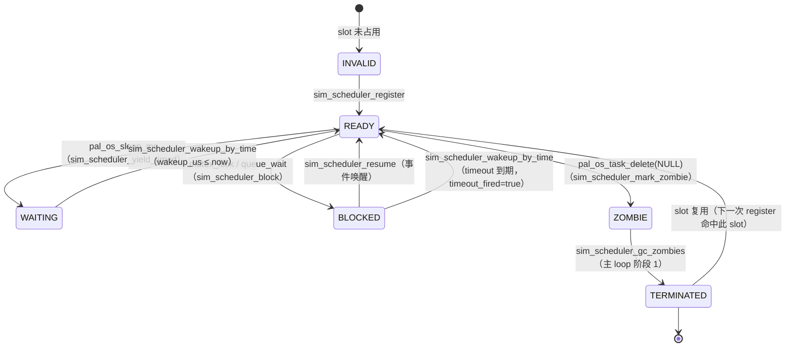

# 4.7 仿真侧协作式调度器模型（Cooperative Deterministic Scheduler）

> **SSOT 状态**：本文件是 [ADR-0013 仿真协作式确定性调度](../../../decisions/unisim/0013-sim-cooperative-scheduler.md) 与 [ADR-0014 仿真单虚拟核取舍](../../../decisions/unisim/0014-sim-single-virtual-core.md) 的设计规范回写（fixup 计划 PLAN-20260702-SIM-COOP-SCHED-FIXUP F6 交付）。ADR 记录决策历程；本文件记录当前系统真相。

## 1. 目的

WinkMicroOS 仿真侧（host 与 wasm 两 target）实现的**协作式确定性调度器**（Wink Sim Scheduler），是替换退化"同步直调 `pal_os_task_create`"的多任务解决方案。核心目标：

1. **多任务并发**：支持 `while(1) { sleep; }` 任务模型；生产者-消费者通过 ringbuf 交互。
2. **Bit-exact 确定性**：相同注册顺序 + 相同让出模式 → 100% 可复现调度序列。
3. **零部署门槛**：wasm 单线程沙箱内运行，无需 SharedArrayBuffer / COOP/COEP。
4. **同源真机**：与 ESP32 FreeRTOS 的 App-level API 对齐（`pal_os_task_create` / `pal_os_sleep_ms` / `pal_os_ringbuf`）。

## 2. 任务状态机



状态定义（`sim_task_state_t`）：

| 状态 | 语义 | 由谁写入 |
|------|------|---------|
| `INVALID` | slot 未占用（memset 初始零值） | `sim_scheduler_reset` |
| `READY` | 可被 pick_next 选中运行 | register / wakeup_by_time / resume |
| `WAITING` | sleep_ms 时间等待，`wakeup_us > 0` 到期强制 READY | yield_timed |
| `BLOCKED` | 等待 mutex/queue，可有 timeout；`timeout_fired` 供 mutex_lock 返回 TIMEOUT | block |
| `ZOMBIE` | 已让出但 fiber 未释放，等主 loop GC | mark_zombie |
| `TERMINATED` | 已释放，slot 可被下次 register 复用 | gc_zombies |

## 3. 主调度 loop 结构

主 loop 位于 `pal_sim_scheduler_run`（各 target 分别实现）。Phase 顺序：

```
loop while (main_task 未 TERMINATED 且 max_ticks 未达)：
  [Phase 0] wasm 侧：poll pal_wasm_dispatch_pending_interrupts()
  [Phase 1] sim_scheduler_gc_zombies()  → ZOMBIE 转 TERMINATED，释放 fiber
  [Phase 2] sim_scheduler_wakeup_by_time(host_sim_time_us())  → 到期 WAITING/BLOCKED 转 READY
  [Phase 3] next = sim_scheduler_pick_next()
     ├─ NO_READY: host_sim_advance_to(next_wakeup_us); continue
     └─ 否则：
  [Phase 4] sim_scheduler_set_current(next)
            wall_start = host_wall_clock_us()   ← 物理墙钟（红线 11）
            sim_ctx_switch(main_ctx, task_ctx)
            sim_scheduler_set_current(NO_READY) ← 红线 15
            duration = host_wall_clock_us() - wall_start
            if duration > wcet_threshold: wink_runtime_fault(callbacks, 8002)
            if next == main_task_id: ticks_run++
```

## 4. 三个 pure decision functions

调度决策拆为三个无副作用的 pure 函数（`wink_sim_scheduler.c`），便于单测：

### 4.1 `sim_scheduler_pick_next`（Round-Robin）

伪代码：
```
start = (last_scheduled + 1) mod MAX_TASKS  # last_scheduled == NO_READY 时从 0 起
for i = 0 .. MAX_TASKS-1:
    id = (start + i) mod MAX_TASKS
    if tasks[id].state == READY:
        last_scheduled = id
        return id
return NO_READY
```

**语义边界**：本 wave 内不走 PRNG；`s_prng_state` 仅按 seed 初始化保留，供未来 Task 7（Chaos Scheduling）激活。R7 注意：slot 被 gc_zombies 释放并复用时新 task 首次调度会延迟一轮，是可接受的简化取舍。

### 4.2 `sim_scheduler_wakeup_by_time(now_us)`

伪代码：
```
count = 0
for t in tasks:
    if t.state in (WAITING, BLOCKED) and t.wakeup_us > 0 and t.wakeup_us ≤ now_us:
        was_blocked = (t.state == BLOCKED)
        t.state = READY
        t.wakeup_us = 0
        if was_blocked:
            t.timeout_fired = true
            t.blocked_on = 0
        count++
return count
```

### 4.3 `sim_scheduler_gc_zombies`

伪代码：
```
for t in tasks:
    if t.state == ZOMBIE:
        sim_ctx_destroy(t.ctx)  # 主 loop 上下文安全 DeleteFiber
        t.ctx = NULL
        t.state = TERMINATED
```

## 5. host vs wasm 语义对照

| 维度 | host (Windows) | wasm (Emscripten) |
|------|---------------|-------------------|
| Fiber API | `ConvertThreadToFiber` / `CreateFiber` / `SwitchToFiber` / `DeleteFiber` | `emscripten_fiber_init` / `emscripten_fiber_swap` |
| 时钟源（业务） | `host_sim_time_us()` — 静态累加，测试可 `host_sim_advance_to(us)` 显式推进 | `pal_wasm_advance_virtual_clock(us)` — JS Worker 唯一写入 |
| 时钟源（WCET） | `host_wall_clock_us()`（QPC） | `emscripten_get_now() * 1000` |
| 栈下限 | `WINK_SIM_STACK_MIN = 32 KB` | `WINK_SIM_STACK_MIN = 16 KB` + `WINK_SIM_ASYNCIFY_MIN = 2 KB` |
| 中断 dispatch | no-op（no async IRQ） | `pal_wasm_dispatch_pending_interrupts()` 每 tick poll |
| Wall-clock helper 共享 | `test/stubs/host_wall_clock.h`（pal 与测试共用） | inline `wasm_wall_clock_us` |

## 6. 已知保真度边界（ADR-0013 §边界的执行层落地）

1. **纯 CPU 计算不可被强制抢占** — 若任务无 yield 点且 slice 物理耗时 > 5ms（默认 `WINK_SIM_TASK_WCET_THRESHOLD_US`，`WINK_SIM_WCET_THRESHOLD_US` env 可覆盖；`CI` env 检出时自动放宽 10x），主 loop 触发 `wink_runtime_fault(callbacks, 8002)`。
2. **微观指令级竞态不可模拟** — 单虚拟核协作式，参见 [ADR-0014 §具体不覆盖 bug 类型](../../../decisions/unisim/0014-sim-single-virtual-core.md)。
3. **中断唤醒延迟** — wasm 侧粒度 = O(scheduler tick)，主 loop 顶部 `pal_wasm_dispatch_pending_interrupts()`。真机是硬件微秒级响应。
4. **`busy_wait_us` 只推进虚拟时钟** — 物理 CPU 只花微秒，不会触发 WCET 8002（`test_sim_scheduler_wcet_fault.c` 反证）。

## 7. `pal_os_task_delete` 语义边界（fixup R10）

四种调用模式的行为契约，避免未来 AI codegen 误用：

| 调用形式 | 语义 | 实现路径 |
|---------|------|---------|
| `pal_os_task_delete(NULL)`（自删） | 当前任务进入 ZOMBIE，主 loop GC 回收 | `mark_zombie(cur) → sim_ctx_switch(cur_ctx, main_ctx)` |
| `pal_os_task_delete(other_handle)`（他删，目标非 running） | 目标进入 ZOMBIE，主 loop GC 回收；目标 fiber 从 register 后未跑或已让出至 main | `mark_zombie(id)` |
| `pal_os_task_delete(self_handle)`（他删语法但目标是自己） | 建议：pal 层未来加 branch 显式对齐至自删路径；当前实现按他删处理，不允许"标 ZOMBIE 后继续跑自己 C 代码" | 同上 |
| `pal_os_task_delete(other_handle)` 但目标正被主 loop 切入 | ⚠️ **仿真侧禁止** —— 逻辑上不可能（单虚拟核 + 协作式，同一时刻只有一个 fiber 在跑；"他人"必然让出至 main） | assert fail 兜底 |

## 8. `sim_scheduler_task_count` 语义边界（fixup R11）

`task_count` 返回"当前 slot 中 `state ∈ {READY, WAITING, BLOCKED, ZOMBIE}` 的任务数"。**ZOMBIE 视为活跃**，直到 `gc_zombies` 转 TERMINATED 释放 slot。

**用户视角**：这个 task 是否可以被 introspect —— ZOMBIE 的元数据（name/id/priority）仍可访问，故算活跃。

若需要"当前可运行 task 数"，应用 `sim_scheduler_count_by_state(READY)`（本 wave 不实现，Task 7 引入抢占时再补）。

## 9. 与其他 ADR 的关系

- [ADR-0003 仿真保真度边界](../../../decisions/unisim/0003-simulation-fidelity-boundary.md)：本模型是"保真度边界" 在多任务维度的具体落实。
- [ADR-0007 协作循环执行模型](../../../decisions/core/0007-cooperative-loop-execution-model.md)：单任务的协作模型；本调度器是它在多任务维度的自然延伸（每个任务是一个"协作循环"，主 loop 在 slice 间调度）。
- [ADR-0012 契约诚实](../../../decisions/core/0012-contract-honesty-over-silent-degradation.md)：WCET 8002 fault 路径必须携带 callbacks 让 App on_fault 被调，禁止 `wink_runtime_fault(NULL, 8002)` 掩盖问题（fixup 计划红线 16）。

## 10. 关键验收测试

| 测试 | 门禁语义 |
|------|---------|
| `test_sim_scheduler` | 11 用例覆盖 pick_next / wakeup_by_time / block/resume / stack clamp / zombie |
| `test_sim_scheduler_e2e` | dual-task ringbuf 生产者-消费者场景 |
| `test_sim_scheduler_zombie_gc` | 自删 fiber 释放 |
| `test_sim_scheduler_wcet_fault` | CPU busy-loop 触发 8002；`busy_wait_us` 不误报（**C2 修复门禁**） |
| `test_sim_scheduler_determinism` | 同 seed 一致；本 wave RR 语义边界锁定 |
| `test_sim_scheduler_stack_clamp` | 真 host fiber 层栈下限 clamp |
| `test_single_task_semantic_regression` | avoidance_car 业务字段与 baseline 一致（R-002） |

## 11. 多任务示例 App

`dual_task_demo` 演示了协作式调度器的多任务并发能力：

### 11.1 架构

```
[sensor_task] --(ringbuf)--> [motor_task]
       \                         /
        \-- sleep 20ms         /-- sleep 30ms
```

- **sensor_task**（20ms 周期）：模拟超声波距离测量，将数据推入 ringbuf
- **motor_task**（30ms 周期）：从 ringbuf 读取最新距离，根据阈值控制舵机角度
- **ringbuf**：跨任务通信通道

### 11.2 关键代码模式

```c
static void app_init(void) {
    /* 创建 ringbuf */
    s_rb = pal_os_ringbuf_create(64);
    
    /* 创建两个任务 */
    pal_os_task_create(sensor_task, "sensor", 32*1024, NULL, 5, PAL_OS_CORE_ANY, &s_sensor_h);
    pal_os_task_create(motor_task, "motor", 32*1024, NULL, 5, PAL_OS_CORE_ANY, &s_motor_h);
}

static void sensor_task(void* arg) {
    while (1) {
        /* ... 产生 mock 数据 ... */
        pal_os_ringbuf_push(s_rb, &mock_dist, sizeof(mock_dist));
        pal_os_sleep_ms(20);  /* yield 点 */
    }
}

static void motor_task(void* arg) {
    while (1) {
        /* ... 从 ringbuf 读取 ... */
        pal_os_sleep_ms(30);  /* yield 点 */
    }
}
```

### 11.3 调度行为

调度器采用 round-robin 策略，两个任务交替执行：
1. sensor_task 运行 → 推数据 → sleep 20ms → yield
2. 调度器切换到 motor_task → 读取数据 → sleep 30ms → yield
3. 调度器再次切换到就绪的任务

同 seed 下调度序列完全可复现。

## 12. 未来演进路标

- **Task 7 Chaos Scheduling**：pick_next 引入 PRNG 交错扫描，激发潜在 race。届时 `test_sim_scheduler_determinism` Case 2 的 EQUAL 断言需改为 NOT_EQUAL 作为反测。
- **抢占式调度**：目前纯协作式；如引入 preemption 需评估与 bit-exact 确定性的冲突（可能需要"抢占决策也走 seed 驱动"）。
- **SMP 仿真**：ADR-0014 明确拒绝，任何 SMP 需求需新起 ADR-0015。

---

*相关文档：[ADR-0013](../../../decisions/unisim/0013-sim-cooperative-scheduler.md) · [ADR-0014](../../../decisions/unisim/0014-sim-single-virtual-core.md) · [ADR-0007](../../../decisions/core/0007-cooperative-loop-execution-model.md) · fixup 计划 [PLAN-20260702](../../../implementation-plans/unisim/2026-07-02-sim-cooperative-scheduler-fixup-plan.md)*

