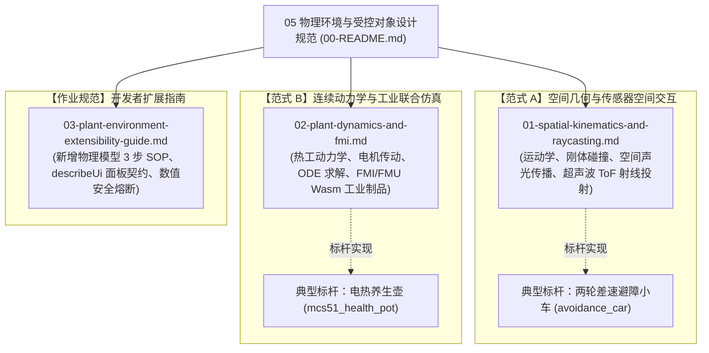

# 05 物理环境与受控对象设计规范 (Plant & Environment Physics Model)

> 📚 **设计规范 SSOT**：本文档是 Wink-AI 嵌入式仿真系统（WinkMicroOS）中**数字实验台栈第 4 层（外设与环境交互的物理模型）**的架构总入口与核心事实源。
> 
> 🔗 **上游依赖**：[`../01-system-overall/01-system-overview.md`](../01-system-overall/01-system-overview.md) §2 数字化四层模型  
> 🔗 **实施计划**：[`../../implementation-plans/core/2026-09-19-plant-and-environment-design-docs-plan.md`](../../implementation-plans/core/2026-09-19-plant-and-environment-design-docs-plan.md)

---

## 1. 架构定位与核心使命

### 1.1 系统四层数字化模型的顶层（Layer 4）
在 [`01-system-overview.md`](../01-system-overall/01-system-overview.md) 所确立的“嵌入式固件栈 ⇄ 数字实验台栈”对偶双轮体系中，物理仿真严格分为四层递进：

```text
┌──────────────────────────────────────────────┐        ┌──────────────────────────────────────────────┐
│       嵌入式固件栈 (Embedded Firmware Stack)    │        │   数字实验台栈 (Harness Stack - 物理孪生沙箱)   │
├──────────────────────────────────────────────┤        ├──────────────────────────────────────────────┤
│  App 层  (业务状态机、意图编排、决策回调)         │ ◄────► │  4. 物理环境交互模型 (Plant & Environment)    │ ◄── 本模块 SSOT
│  BAL 层  (纯算法 math、闭环控制 control)     │ ◄────► │  3. 外设模型 (传感器/执行器机电特性、故障机)   │
│  DAL 层  (器件语义 API: dal_ultrasonic_read) │ ◄────► │  2. 外设通道模型 (数据面 5 通道、Pin 仲裁器)  │
│  PAL 层  (平台 HAL / OSAL: pal_gpio/timer)   │ ◄────► │  1. 芯片模型 (虚拟时钟、Wasm沙箱、中断/调度)  │
└──────────────────────────────────────────────┘        └──────────────────────────────────────────────┘
```

* **Layer 1~3**（芯片、通道、外设）解决的是**“微控制器与元器件的电气行为”**；
* **Layer 4（本模块）**解决的是**“元器件与外部物理世界法则（力、热、光、电、声、空间几何）交互”**的连续数学求解。

### 1.2 核心使命：打破“开环假动画”，实现真实物理闭环
* **开环痛点**：传统 Web 仿真中，UI 点亮发热盘 LED、舵机转动只是视觉假动画；由于缺少环境真实物理场，温度探头读数恒定为 25°C，固件运行到第 20 秒干烧斜率保护必然误报 `E-03` 故障死锁；
* **闭环使命**：本模块为系统注入**严谨的连续物理定律求解器**。执行器的电平/PWM 必须真实积分转化为物理能量输入，求解出的连续状态量（温度、位移、转速、声波空间飞行时间）实时反哺给传感器，赋予固件真实的**“物理世界动态反馈”**。

---

## 2. 核心原则：CPS 仿真的“双翼对偶律”与四大铁律

### 2.1 双翼对偶律 (Peripherals ⇄ Plants Duality)
在信息物理融合系统（CPS）仿真中，控制器与物理世界的交互天然呈现左右对偶结构：

```text
       ┌────────────────────────────────────────────────────────┐
       │             WinkMicroOS 嵌入式固件 (Controller)           │
       └────────────────────────────────────────────────────────┘
                 ▲                                  │
      (ADC 码 / 虚拟引脚)                       (GPIO / PWM 电平)
                 │                                  ▼
┌────────────────────────────────┐  微步同步  ┌────────────────────────────────┐
│  左翼：电气外设与变送器体系      │ ───────── │  右翼：物理受控对象体系          │
│  (Peripherals / Transducers)   │ ◀──────── │  (Plant Models / FMU)          │
│  - 按键 / 数码管 / 蜂鸣器       │ (连续物理量)│  - 发热盘水温动力学 (一阶热工)  │
│  - NTC 阻温分压与 ADC 变送器    │  T(t), ω  │  - BLDC 电机反电动势 / 转矩    │
│  - 超声波换能器声电变送         │  ToF, x   │  - 空间三维网格与运动学障碍物   │
└────────────────────────────────┘            └────────────────────────────────┘
```

* **左翼（外设与变送器 Peripherals）**：仅负责“物理量 $\leftrightarrow$ 电气量”的转换（如 NTC 仅负责将连续温度 $T$ 查表计算为分压电阻和 ADC 采样码），**严禁承担任何物理场动态方程积分**；
* **右翼（受控对象与环境 Plants & Environment）**：负责空间几何、动力学微分方程、连续能量传递的数值求解，**严禁感知微控制器引脚编号或 ADC 寄存器**；
* **中枢（微步调度器 Orchestrator）**：以固定虚拟时间步长（如 1ms 量子）锁步推进，将执行器电平转为物理能量输入，再将物理计算结果分发给左翼传感器。

### 2.2 四大使命级原则（P1 ~ P4）
* **P1 固件零感知 (Zero-Firmware-Perception)**：
  固件源码严格只经 PAL/HAL 与 DAL 接口与外设交互，绝对不感知外部是内置 ODE、FMU 工业模型还是真实硬件；**严禁在固件中为了迎合静态仿真而削弱安规阈值或加仿真宏旁路**。
* **P2 插件即变送器 (Transducer-Only Plugins)**：
  外设插件仅承担变送职责（物理量 $\leftrightarrow$ 电气信号），物理场演算完全交由右翼物理对象管辖。
* **P3 纯物理闭环驱动 (Physics-Driven Loop)**：
  状态量的演化必须基于真实微分方程（连续热容、电磁转矩、刚体运动学）积分，严禁在 UI 侧伪造跳变或硬编码状态转换。
* **P4 跨端确定性边界 (Deterministic Tolerance Boundary)**：
  根据 ADR-0055 规范，同一物理场景在不同宿主（Headless CLI、浏览器 Web Worker）执行时：
  * **离散状态轨迹**（GPIO 高低电平、状态机跳迁、UART 字节流）必须达到 **bit-exact（逐位绝对一致）**；
  * **连续浮点状态量**（温度、转速、位姿坐标）按预定义公差（Tolerance）严格对齐，严禁未经验证宣称跨引擎字节一致。

---

## 3. 两大物理交互范式与文档导航

针对不同产品品类的物理特性，本模块将物理环境交互划分为两大范式，并提供对应的权威规范：



### 文档矩阵清单：

| 文档序号 | 规范文档 | 管辖范围与核心主题 | 典型应用对象 |
|---|---|---|---|
| **01** | [`01-spatial-kinematics-and-raycasting.md`](./01-spatial-kinematics-and-raycasting.md) | **空间几何与感知交互**：刚体运动学、差速轮位姿演化、三维障碍物碰撞体积、声波飞行时间（ToF）射线检测与回波脉宽转换。 | 智能避障小车、四轴无人机、扫地机器人 |
| **02** | [`02-plant-dynamics-and-fmi.md`](./02-plant-dynamics-and-fmi.md) | **连续动力学与 FMI 扩展**：一阶/高阶热网络微分方程、电机机电转矩反电势方程、FMI 2.0/3.0 Wasm 工业模型流水线、`fmu.lock.json` 信任锚。 | 养生壶、电熨斗、微波炉、变频电机 |
| **03** | [`03-plant-environment-extensibility-guide.md`](./03-plant-environment-extensibility-guide.md) | **开发者扩展指南与防腐层**：3 步新增物理模型 SOP、`describeUi()` 控制面板声明规范、Finite Guard 双向有限性熔断拦截、ADR-0067 激励互斥。 | 全品类新产品接入 |

---

## 4. 与相关模块的接口与职责边界

| 关联模块 | 职责分工 | 交互边界与接口协议 |
|---|---|---|
| **02-wink-micro-os (DAL/PAL)** | 嵌入式固件栈内部 | 固件仅读写引脚电平与传感器语义 API，完全感知不到受控物理模型的存在（P1 固件零感知）。 |
| **04-wasm-simulation** | 虚拟运行时内核 | 提供时钟推进（VirtualClock）、步长编排器（`PlantOrchestrator`）与 Wasm 沙箱调度。 |
| **07-platform-governance** | 器件模型注册表 | 定义外设的变送参数（如 NTC 的 B 值、R25 标称阻值），作为左翼接收物理量并输出采样码。 |
| **wink-plugin-plants** | 物理插件生态仓库 | 承载具体的物理模型驱动类实现（如 `first_order_thermal`、`dc_motor_kinematics`）。 |
