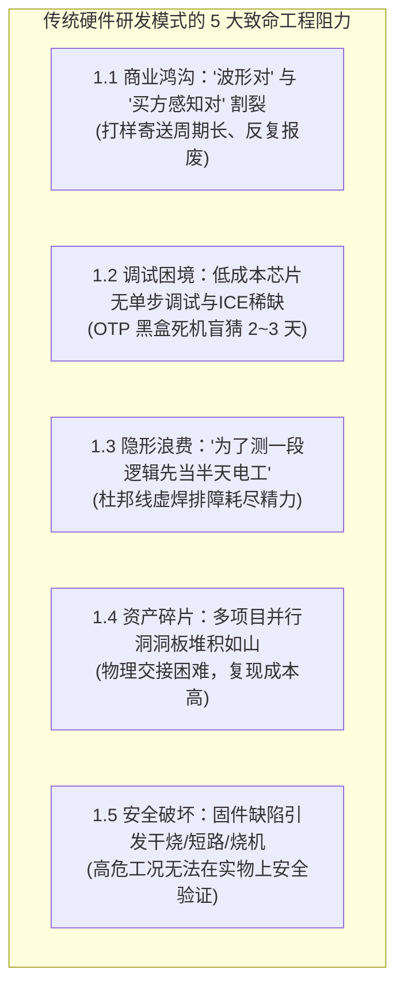
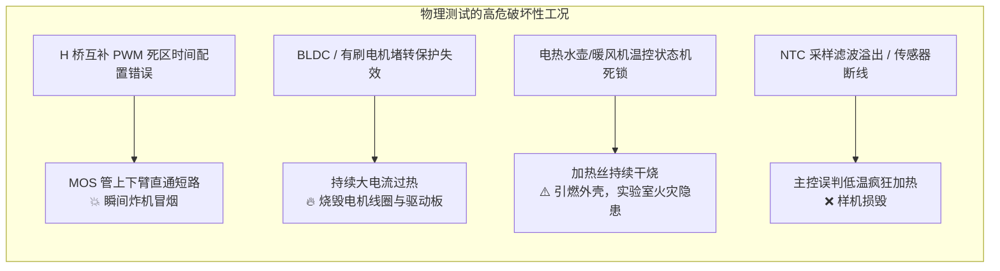
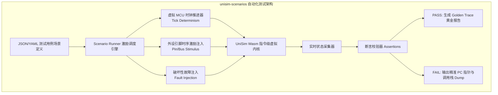
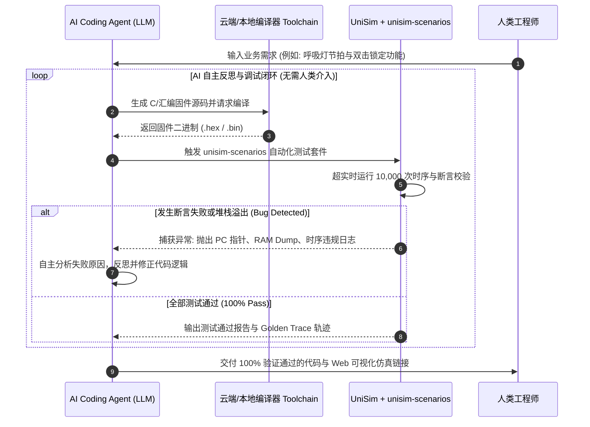
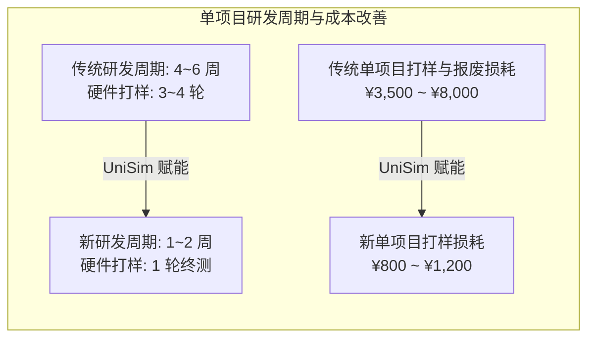

# 嵌入式在线仿真平台商业分析报告：传统研发困境、AI 自动化闭环与产业破局

| 文档属性 | 详情说明 |
| :--- | :--- |
| **报告类型** | 产业痛点剖析、商业价值量化与竞品生态战略研判白皮书 |
| **所属模块** | `wink-ai-embedded/docs/zh/product/market-analysis.md` |
| **核心议题** | 传统“开发板+示波器”硬件研发困境、`unisim-scenarios` 与 AI 自主闭环、全球竞品缺陷与国产低成本芯片蓝海 |
| **适用对象** | 嵌入式方案商创始人/CTO、消费电子产品总监、外贸出海供应链负责人、AI Agent 研发工程师 |
| **版本状态** | **Release 1.0 (商业与技术评审基准 - SSOT)** |

---

## Executive Summary (执行摘要)

在消费电子、智能玩具、个护健康与小家电（以**义乌玩具、澄海数码、顺德家电、深圳消费电子**为代表）的万亿级硬件产业集群中，嵌入式系统研发正面临**“研发周期被压缩到周级、价格战卷到几毛钱、产品交互复杂度指数级上升”**与**“传统基于实物开发板+示波器的研发流程效率低下”**之间的尖锐矛盾。

长期以来，业界习惯于“先接线焊板、插逻辑分析仪调波形、烧录样片寄送快递、等 PCB 回来再测真机”的研发范式。这种范式在单兵简单控制时代尚可维系，但在现代高敏捷产业链中暴露出 **5 大硬件环境困境** 与 **测试联调人在回路（Human-in-the-Loop）的致命低效**。

与此同时，全球现有的嵌入式仿真器（如 Proteus、Wokwi、QEMU、Renode）由于历史基因与学术偏好，普遍聚焦于欧美主流 32 位 MCU 或传统教学芯片，**集体忽视了年出货量数十亿颗、在现代制造业中作为支柱但学术界冷门的国产 8 位/16 位工业芯片（应广 Padauk、芯海/芯芒微、中微 Cmsemicon、松翰 Sonix、合泰 Holtek 等）**。

```
┌──────────────────────────────────────────────────────────────────────────────────────────────────┐
│                                   传统研发范式 vs 在线仿真新范式                                    │
├────────────────────────────────┬────────────────────────────────┬───────────────────────────────┤
│ 维度                           │ 传统模式 (开发板 + 示波器)     │ 在线仿真新范式 (UniSim + AI)   │
├────────────────────────────────┼────────────────────────────────┼───────────────────────────────┤
│ **客户需求对齐**               │ 7~15 天寄送样板，反复返工      │ 10 秒分享 Web 交互孪生链接    │
│ **低成本芯片排障**             │ OTP 盲猜加打点，偶发死机 2~3 天│ 指令级透明白盒，断点行号秒级定位│
│ **外设原型搭建**               │ 面包板接线半天，排查虚焊接触不良│ Web 画布 1 分钟拖拽直连        │
│ **破坏性/极端工况测试**        │ 易引发短路炸机、烧电机、干烧起火│ 虚拟环境无损注入千度高温与断线│
│ **测试联调与 AI 闭环**         │ 物理台架伪闭环 (依赖人工按键/调环境) │ `unisim-scenarios` 全软件激励，超实时自愈 │
│ **国产 8/16 位工业芯片支持**   │ 依赖稀缺且昂贵的原厂 ICE 仿真盒 │ 深度覆盖国产小家电/玩具主流芯片│
└────────────────────────────────┴────────────────────────────────┴───────────────────────────────┘
```

本报告旨在从**产业工程阻力、测试联调瓶颈、全球竞品生态缺陷、商业 ROI 量化模型以及客户付费与商业化落地路径**等维度，为 UniSim 嵌入式在线仿真平台的产业定位与商业战略提供完整论证。

---

## 1. 传统研发模式的产业真实困境与硬件环境工程阻力

很多资深嵌入式工程师会提出一个经典质疑：
> *“我们平时用开发板调代码，接逻辑分析仪看波形，等 PCB 回来测真机，这套流程跑了几十年，为什么还需要网页在线仿真？”*

在单兵纯技术研发场景下，传统流程确实能走通；但在现代大规模协作的工业产业链中，**传统“开发板 + 示波器”的研发模式正在遭遇 5 个致命的商业与工程瓶颈**。



---

### 1.1 困境一：“波形对”与“买方体验对”之间的巨大商业鸿沟

在消费电子、玩具与小家电贸易中，**技术人员与商业决策者之间存在着天然的“语意失焦”**：

*   **工程师视角**：在开发板上接上示波器与逻辑分析仪，量出 PWM 占空比 30%、蜂鸣器输出 2kHz 方波、I2C 时序严格满足 100kbps 协议规范，确认电信号完全符合技术规范。
*   **外贸买方视角**：外贸商、品牌产品经理、海外买家**完全看不懂示波器上的电平波形**。买家唯一在乎的是：
    *   *“按键按下的阻尼感与灯光渐变节拍是否对得上？”*
    *   *“玩具娃娃眼皮眨动与发声的音效节奏是否协调？”*
    *   *“小家电屏显 UI 菜单切换是否顺滑自然？”*
*   **商业代价与返工泥潭**：
    *   双方无法通过示波器电信号达成商业共识。传统模式下，方案公司只能焊打样板、烧录固件、组装工程样机，通过顺丰或 DHL 快递给买方（国内 2~3 天，海外 7~15 天）。
    *   买方拿到实物后，通常会提出诸如*“灯光呼吸太急促了”、“蜂鸣器提示音太刺耳”、“舵机摆头速度不够可爱”*等非功能性主观反馈。
    *   方案公司改写几个参数后，**重新烧片打样、重新快递寄送，反复迭代 2~4 轮**。
    *   **经常发生样板寄到海外后，客户轻描淡写一句“节奏不是我想要的”，导致前面两周的硬件工时、打样费用与高昂国际快递成本全部报废**，甚至直接错失当季外贸订单排期。

```text
【传统打样确认链路】(耗时 2~4 周)
需求提出 ──► 硬件搭线 ──► 示波器量波形 ──► 打样组装 ──► 顺丰/DHL 快递 ──► 买方试玩 ──► "感觉不对" ──► 重写打样 (死循环)

【UniSim 孪生体验链路】(耗时 10 分钟)
需求提出 ──► 网页拖拽外设 ──► 固件在线仿真 ──► 生成 URL 链接 ──► 买方手机端秒开体验 ──► 当场在线调整确认 ──► 锁定订单
```

---

### 1.2 困境二：低成本芯片生态“无好用单步调试”的残酷现实

在高端 32 位 MCU（如 STM32、ESP32、NXP）领域，几十元人民币即可买到带 SWD/JTAG 硬件断点与单步调试的开发板，现代 IDE 可以随时打断点查看局部变量与调用栈。

然而，在**出货量以数十亿计的几毛钱至一元钱极低成本芯片（如应广 PDK、松翰 Sonix、合泰 Holtek、中微 Cmsemicon、芯海/芯芒微）**生态中，工程师面临极其恶劣的调试环境：

1.  **原厂硬件仿真盒（ICE）昂贵且极其稀缺**：
    *   以应广、松翰等为代表的原厂硬件 ICE（In-Circuit Emulator）售价普遍高达数千至上万元人民币。
    *   5~20 人的中小型方案公司通常只舍得采购 1~2 台。每逢项目冲刺，多个项目组工程师必须排队抢占仿真盒，严重阻塞研发流水线。
2.  **Flash 工程样片成本高且擦写寿命脆弱**：
    *   低成本量产芯片大多是 OTP（One Time Programmable，一次性烧录掩膜）或极小容量 Flash。原厂提供的可重复擦写工程样片单价极高（往往是量产片的 10~50 倍），且擦写寿命仅数十次至百余次，极易老化损坏失效。
3.  **黑盒死机排障极其痛苦（“盲人摸象”）**：
    *   OTP 芯片与低端量产片**根本没有硬件调试接口（无 JTAG/SWD）**。
    *   一旦物理样机发生跑飞、死机、看门狗复位，芯片内部的 PC 指针、寄存器状态、RAM 堆栈全部处于“黑盒不可见”状态。
    *   工程师唯一的手段是：**盲加打点代码**（比如在不同分支翻转某个 GPIO 点亮 LED 或发送串口字符），重新烧录芯片观察。如果遇到偶发性竞争冒险或中断嵌套死锁，**一个偶发 BUG 往往需要排查 2~3 天**，研发心智负担极大。

---

### 1.3 困境三：“为了测一段逻辑，先当半天电工”的隐形工时浪费

在实际研发过程中，工程师验证业务逻辑的前置准备工作极其繁琐。

*   **传统开发板模式**：
    *   若要验证一个*“双按键长按组合键 + RGB 呼吸灯过渡 + 8 段蜂鸣器音效 + 舵机摆动”*的玩具/小家电业务逻辑：
    *   工程师必须先从抽屉里翻找面包板、杜邦线、上拉电阻、NPN 三极管驱动、发光二极管、蜂鸣片和舵机；
    *   花费整整半天时间在面包板上插满密密麻麻的飞线，甚至需要动用烙铁飞线焊接；
    *   在测试过程中，经常遇到杜邦线内部断芯接触不良、面包板簧片氧化、三极管引脚接错等问题，**工程师往往耗费两三个小时排查硬件接线，最后发现是虚焊，严重分散了核心算法与逻辑开发的精力**。
*   **Web 在线仿真模式**：
    *   在网页画布上，工程师从组件库中拖入按键、RGB LED、蜂鸣器和舵机控件，连线 1 分钟搞定；
    *   直接加载编译生成的二进制（`.hex`/`.bin`），立即启动逻辑验证，彻底消灭“电工准备工时”。


*图 1-1：传统硬件联调模式下，插满杜邦线与外设的脆弱物理开发板（接线耗时、接触不良且极难复现）*

---

### 1.4 困境四：多项目并行资产的碎片化与交接成本（嵌入式研发的“Pre-Office 纸质档案时代”）

中小型嵌入式方案公司和 ODM 工厂的生存法则是“以多打快”，一个团队通常需要**同时并行推进 10~30 个案子**。

*   **物理工装的维护噩梦（手工作坊与纸质档案时代）**：
    *   长期以来，传统嵌入式研发仍深陷类似“打字机与纸质档案柜时代”的窘境：工程师的办公桌上常常摆满 10~20 块插满飞线、裸露元器件的洞洞板与开发板，抽屉里塞满贴着手写胶带的废弃样板盒，稍有触碰就会短路或飞线脱落。
    *   客户临时要求改动 3 个月前的一个老项目时，工程师需要翻箱倒柜找回当年的样板，重新回忆接线定义，甚至发现当年的样板已经氧化损坏，必须重新焊接搭建。
*   **人员流动与交接断层**：
    *   工程师离职时，留下一堆没有接线图纸的杂乱硬件板卡，接线散落，新人接手几乎无法还原测试环境，前人案子彻底沦为无法复原的“硬件黑洞”，往往只能推倒重来。
*   **数字资产的云端秒级复现（类比 Office / Figma 的数字化飞跃）**：
    *   **正如 Microsoft Office 将“纸质公文与实体档案柜”终结并跃升为“可检索、可协作、秒级分发的数字文档”，Figma 将“离线设计图传输”终结并跃升为“云端实时协同画布”**；
    *   UniSim 平台的本质是**开启嵌入式硬件工程的“全面数字化转型”**：将脆弱、不可复现的物理面包板与飞线工装，彻底**数字化、资产化为轻量标准的云端孪生工程（包含标准化外设拓扑 JSON、引脚映射、场景脚本与固件二进制）**。
    *   任何团队成员只需打开一个 **标准化 URL 链接**，即可在 1 秒内完整克隆与复现当年的软硬件环境，实现工程资产从“物理抽屉堆叠”向“数字资产云端流转”的跨越。

---

### 1.5 困境五：防止程序缺陷导致硬件损毁与高危极端工况验证

在涉及**功率驱动、发热元件与动力机构**的小家电与电机控制项目中，初期固件缺陷具有极高的物理破坏性：



1.  **MOS 管直通短路炸机**：电机驱动固件在初始化 PWM 定时器时，如果死区时间（Dead-time）配置错误或上下桥臂极性反相，会导致 MOS 管同时导通，瞬间产生几十安培短路电流，**打样板直接炸机冒烟，损坏昂贵的主控与功率器件**。
2.  **电机堵转干烧**：在玩具机械臂或筋膜枪调试初期，若堵转检测算法存在缺陷，电机在卡死状态下持续承受大电流，数秒内即可烧毁电机绕组。
3.  **小家电高温干烧危险**：电热水壶、养生壶、电暖器在验证过温断电保护与干烧防护时，若在物理样板上直接测试，一旦固件状态机在异常分支发生死锁，发热盘会持续干烧至数百摄氏度，存在严重的**火灾隐患与人身安全风险**。
4.  **纯软件虚拟验证的安全性**：
    *   在 UniSim 仿真环境中，可以**零成本、零危险地无损注入极端破坏性参数**（如虚拟注入发热盘温度达到 1000℃、注入 NTC 采样瞬间断线、注入电机转速骤降为 0）；
    *   系统以纳秒级精度监控 MOS 管直通与时序违规，在没有任何硬件损耗的前提下，彻底把关高危工况下的安全降级熔断逻辑。

---

## 2. 测试联调瓶颈与“unisim-scenarios + AI 自主闭环”范式革新

### 2.1 传统测试联调痛点：“人在回路（Human-in-the-Loop）”的手动测试陷阱

在传统嵌入式研发流程中，系统联调与回归测试极度依赖**人工手动操作**：

```
┌────────────────────────────────────────────────────────────────────────────┐
│                  传统测试模式：人在回路 (Human-in-the-Loop)                 │
├────────────────────────────────────────────────────────────────────────────┤
│ 固件编译 ─► 烧录器烧写 ─► 人工手指按键 ─► 眼睛观察 LED ─► 耳朵听蜂鸣器音效 │
│    ▲                                                                       │
│    └──────────── 无法自动化 ── 耗费大量人力 ── 测试覆盖率 < 15% ───────────┘│
└────────────────────────────────────────────────────────────────────────────┘
```

*   **人力成本高且无法规模化**：测试人员必须坐在测试台前，机械地反复按动按键、旋转旋钮、插拔电源。一个拥有 10 种工作模式的产品，手动跑完一次基础用例需要 30 分钟，无法集成到现代软件工程的 CI/CD 持续集成流水线中。
*   **低概率边缘 Case（Corner Cases）在物理硬件上手工无法复现**：
    *   **微秒级并发竞态**：用户在双键模式下，两根手指同时按下的时间差在 100 微秒以内的极限情况；
    *   **定时器溢出与中断嵌套冲突**：在 ADC 中断采样的同时恰好触发外部按键中断与定时器溢出；
    *   **电源临界抖动与按键弹跳极限**：按键机械弹跳在 15~20ms 临界值时的消抖状态机穿透；
    *   **堆栈溢出（Stack Overflow）与内存越界**：在特定长按 + 旋钮快转组合下，函数深层调用导致 8 位单片机极小 RAM（如 64 字节）被击穿。
*   **出货后翻车风险极高**：这些百万分之一概率的边缘 Bug，人工手动测试根本按不出来；但一旦产品批量出货数十万台，必然会在消费者手中爆发，导致大面积退货与品牌信誉崩塌。

---

### 2.1.1 认知误区破除：为什么“自动烧录 + 逻辑分析仪”依然无法让 AI 真正自主闭环？

很多嵌入式开发者和 AI 算法工程师常有一个直觉误区：
> *“现在大模型已经能写代码，我们通过脚本连接烧录器（如 esptool / pyOCD）自动把固件烧进单片机，再挂上逻辑分析仪自动抓取引脚波形，不就已经实现自动化测试和 AI 闭环了吗？”*

这种基于实物台架的“硬件自动化”在概念上看似跑通，但在真实工业研发中，**物理现实的四大刚性约束让所谓的闭环支离破碎**：

```text
┌─────────────────────────────────────────────────────────────────────────────────┐
│              实物硬件台架自动化 (自动烧录 + 逻辑分析仪) 的四大物理刚性枷锁         │
├───────────────────┬─────────────────────────────────────────────────────────────┤
│ 1. 交互仍需人手   │ 按键长短按、双键微秒级并发、滑动旋钮，仍需人工按或机械治具 │
│ 2. 极端工况极难复现│ 接触不良断线、瞬间电源跌落、千度干烧，实物强测极难复现且易炸机 │
│ 3. 物理时间刚性制约│ 物理世界 1 秒等于 1 秒，万次循环耗时数天，OTP/Flash 寿命脆弱│
│ 4. 拓扑无法自主变更│ 更换引脚或增减外设，AI 无法自己插拔杜邦线，必须停机人工介入│
└───────────────────┴─────────────────────────────────────────────────────────────┘
```

1.  **物理交互仍需“人在回路”（人肉按键无法摆脱）**：
    *   AI 能够自动烧写固件，但测试业务逻辑往往需要大量的人机交互操作：*“长按按键 3 秒进入配网”、“两根手指在 100μs 内同时按下双键切换模式”、“快速旋转编码器旋钮调温”*。
    *   此时，**依然需要测试员坐在测试台前用手指反复按键**；
    *   若试图用实物治具（如电磁铁推杆、微型舵机机械臂）模拟人工按键，不仅治具制造成本高昂（几千到数万元），而且机械结构极易磨损松动、震动移位对不准引脚，维护机械治具的工时甚至超过了写代码本身。
2.  **边缘与破坏性工况在实物上极难安全复现**：
    *   在真实开发板上，AI 无法随心所欲构造与稳定复现极端边缘物理工况：比如“NTC 温度传感器引脚发生 50μs 的瞬时接触不良断线”、“发热盘干烧失控温度骤升至 800℃”、“供电电压在临界复位阈值边缘微幅跌落毛刺”。受环境温漂、器件离散性与随机噪声影响，偶发硬件 Bug 往往“只出现一次便再难捕捉”；
    *   如果为了测试保护与自愈逻辑而强行在实物开发板上模拟这些破坏性工况，极易发生 **MOS 管直通短路瞬间炸机冒烟、加热丝干烧起火**，不仅无法安全重复验证，更会直接毁损测试台架，导致自动化流水线彻底瘫痪。
3.  **物理时间与硬件擦写损耗的刚性枷锁**：
    *   实物台架被物理世界严格束缚在“1 秒等于 1 秒”的绝对时间尺度中。要验证一个状态机在 10,000 次按键状态流转中是否存在微小的内存泄漏或看门狗异常，物理台架必须实打实连续运行数小时甚至整夜；
    *   更致命的是硬件寿命磨损：国产极低成本芯片大多是 OTP（一次性烧录掩膜），就算使用少量昂贵的 Flash 工程样片，其擦写寿命通常也仅有数百次，跑几次高频自动测试样片便直接报废。
4.  **硬件拓扑变更必须依赖人工停机走线**：
    *   若 AI 在迭代算法或排查管脚冲突时（例如发现某个 GPIO 是 ESP32 的 Strapping 启动管脚需要避让），AI 无法通过代码“隔空拔插杜邦线”，依然必须叫停自动化流水线，等待人类工程师前往实验室重新拔插接线。

**结论**：建立在脆弱实物台架之上的“自动烧录 + 抓波”只是**物理浅层自动化（Fake Loop）**，根本无法支撑现代高并发、高频迭代的 AI 研发。真正的 AI 闭环必须建立在 **“硬件即代码（Hardware as Code）”的纯软件超实时数字沙箱（UniSim + unisim-scenarios）** 之中。

---

### 2.2 `unisim-scenarios` 自动化测试体系：确定性时间与脚本驱动

UniSim 引入了专门针对嵌入式时序与外设交互的 **`unisim-scenarios` 场景驱动测试体系**，彻底将测试从物理时间和人工束缚中解放出来：



#### 2.2.1 核心机制与技术特性

1.  **超实时（Hyper-Real-Time）极速运行**：
    *   在 Wasm 虚拟机中，时间的推进由虚拟时钟 Tick 控制，脱离了物理世界 1 秒等于 1 秒的刚性限制。
    *   在真实世界中需要运行 1 小时的高频按键耐久与状态流转测试，在 `unisim-scenarios` 中**仅需 3~5 秒即可跑完数万个事件循环**。
2.  **纳秒级确定性时钟（Deterministic Timing）**：
    *   所有事件（按键按下、电平拉高、ADC 数据就绪、串口接收）均绑定在精确的虚拟 CPU Cycle 上。
    *   测试具有 **100% 的可复现性（Zero Flakiness）**。只要初始种子和固件二进制相同，无论在 Windows、Mac 还是 CI/CD 服务器上运行，执行轨迹完全一致。
3.  **模糊测试与边界压力遍历（Scenario Fuzzing）**：
    *   内置 Fuzzer 引擎，可自动在 `[0, 50ms]` 随机时间窗口内向多个 GPIO 引脚注入随机脉冲、毛刺抖动与高频连击，系统性遍历状态机所有未定义分支，强制逼出潜在的死锁与堆栈击穿。

---

### 2.3 AI-in-the-Loop：构建 AI 自动写代码与仿真自愈的完整闭环

在生成式 AI 与大语言模型（LLM）席卷软件开发的今天，**AI 编写嵌入式代码的最大瓶颈是“缺乏可执行、可感知的实时反馈闭环”**：

*   以往让 AI 写单片机 C 代码或汇编，AI 写完后无法运行；只能由人类烧进单片机测试，发现不对再把报错发给 AI，人类充当了低效的“人肉烧录测试机”。
*   **UniSim + `unisim-scenarios` 为 AI Agent 提供了完美的“虚拟沙箱实验室”**，构建了纯软件的 **AI 自主研发闭环（AI-in-the-Loop）**：



*   **价值跃迁**：AI 可以在沙箱中自主尝试、自主编译、自主在虚拟仿真中用脚本施加激励、自主读取虚拟内存与外设输出、自主纠错。在交付给人类工程师之前，已经完成了成千上万次确定性验证，使 AI 生成的嵌入式代码可用率从不足 30% 提升至 **95% 以上**。

---

## 3. 全球主流嵌入式仿真平台横向对比与生态空白研判

为了清晰界定 UniSim 的商业护城河，必须对全球主流嵌入式仿真产品进行全面拆解。

### 3.1 竞品全景分析

```
                           【全球主流嵌入式仿真产品生态象限】
   高复杂/高端架构 ▲
                  │
                  │   [QEMU]                     [Renode]
                  │   • 32/64位 Linux/Server     • 复杂物联网多节点网络
                  │   • 纯系统级指令模拟         • Cortex-M / RISC-V 高端工业
                  │
                  │
                  │   [Proteus]                  [Wokwi]
                  │   • 传统原理图 SPICE 电路    • 现代 Web 创客教育
                  │   • 单机重型, 贵, 传统 51/AVR• 主打 Arduino / ESP32
                  │
                  │                                  ★【UniSim 独占蓝海生态位】★
                  │                                  • 国产低成本 8/16 位工业主流芯片
                  │                                  • 应广 PDK / 松翰 / 合泰 / 芯海 / 中微
                  │                                  • Web 敏捷协同 + AI 自动化场景闭环
   低成本/工业下沉 ▼
                  └─────────────────────────────────────────────────────────────►
                     传统重型桌面软件                   现代 Web / 云原生协同
```

#### 1. Proteus (Labcenter Electronics)
*   **核心逻辑**：基于原理图的 SPICE 电路与混合信号仿真，是高校电子信息专业教学和传统硬件研发的经典工具。
*   **致命缺陷与生态痛点**：
    1.  **架构老旧且体积庞大**：单机安装包数 GB，启动缓慢，不支持云端化和现代 Web 浏览器跨平台协同。
    2.  **商业模式昂贵**：正版授权单套数万至十余万元人民币，小方案商普遍使用远古破解版，无法获得现代持续集成支持。
    3.  **对现代国产超低成本芯片完全空白**：芯片库停留在几十年前传统的 AT89C51、PIC、AVR 上，**完全不支持应广（Padauk）、芯海（Chipsea）、中微（Cmsemicon）等现代中国制造业实际出货量最大的 8 位芯片**。
    4.  **缺乏外贸交互与 AI 闭环能力**：界面为冷冰冰的原理图飞线，无法生成逼真的 3D 产品外观供商业买方体验，亦无现代自动化脚本驱动与 AI 接口。

#### 2. Wokwi
*   **核心逻辑**：基于 Web 技术的现代在线嵌入式模拟器，主打 Arduino、ESP32、Raspberry Pi Pico、STM32 等流行开源硬件。
*   **致命缺陷与生态痛点**：
    1.  **受众局限于创客与教育市场**：深度绑定 Arduino 和 Maker 社区，没有进入真实工业制造方案体系。
    2.  **不支持中国工业主力低成本芯片**：Wokwi 依赖开源社区贡献，其架构主要围绕 AVR/ARM/ESP32，对国内小家电玩具行业绝对垄断的应广 PDK、合泰、松翰等专用指令集没有任何支持。
    3.  **引脚级高频模拟的性能瓶颈**：在模拟复杂外设时引脚跳变开销大，缺乏针对工业级场景的深度压力测试框架（Fuzzing）与极端物理破坏注入机制。

#### 3. QEMU
*   **核心逻辑**：开源指令级仿真巨头，聚焦于大算力 32 位与 64 位 CPU（ARM Cortex-A、x86、RISC-V、MIPS），为 Linux 内核开发和虚拟化服务器提供支持。
*   **致命缺陷与生态痛点**：
    1.  **大炮打蚊子，架构过度重型**：QEMU 专为操作系统级虚拟化设计，内部机制庞杂。
    2.  **不适配微控制器（MCU）与低端专用架构**：无法细粒度模拟 8 位单片机的微秒级 GPIO、PWM、看门狗硬件时序与极小 RAM 特性，更不可能支持专用国产 OTP 芯片架构。

#### 4. Renode (Antmicro)
*   **核心逻辑**：专注于多节点多板网络协同仿真与复杂嵌入式物联网系统（跑 Zephyr/FreeRTOS），支持 ARM Cortex-M、RISC-V 等主流 32 位中高端处理器。
*   **致命缺陷与生态痛点**：
    1.  **学术与前沿工业导向**：主要服务于欧美高精尖物联网、汽车电子与开源芯片验证，使用 C# 与 Python 构建环境。
    2.  **完全不覆盖低成本下沉市场**：面对中国小家电与玩具产业几毛钱的芯片方案，Renode 既没有相关芯片模型，其重型工作流也与国内方案公司的短平快研发节奏完全脱节。

---

### 3.2 竞品横向对比全景矩阵

| 对比维度 | Proteus | Wokwi | QEMU | Renode | **UniSim (本项目)** |
| :--- | :--- | :--- | :--- | :--- | :--- |
| **软件架构载体** | 桌面本地 Windows 软件 (数GB) | Web 前端 (浏览器) | 命令行本地虚拟化系统 | 跨平台本地框架 (CLI/GUI) | **Web/Wasm 云端 + 浏览器秒级加载** |
| **主流支持芯片** | 传统 8051, PIC, AVR, ARM7 | AVR(Arduino), ESP32, Pico | ARMv7/v8, RISC-V, x86 | Cortex-M, RISC-V, 多核SoC | **国产 8/16位工业芯片 + 51/M0/ESP32** |
| **国产低成本芯片支持<br>(应广/松翰/合泰/中微/芯海)** | ❌ **完全不支持** | ❌ **完全不支持** | ❌ **完全不支持** | ❌ **完全不支持** | ✅ **深度支持 (指令集/外设/OTP级还原)** |
| **外贸商业协同与体验** | ❌ 纯电气原理图，买家看不懂 | ⚠️ 简易 2D 零件连线图 | ❌ 纯命令行 / 无 GUI | ❌ 无买方交互界面 | ✅ **高保真 2.5D/3D 动态外观与音效孪生** |
| **自动化测试与 Fuzzing** | ⚠️ 支持 VSM 脚本，极其晦涩 | ⚠️ 基础单元测试 | ⚠️ 支持自动化测试，偏系统级 | ✅ 支持 Robot Framework 测试 | ✅ **原生 `unisim-scenarios` 超实时 Fuzzing** |
| **AI Agent 闭环接入** | ❌ 封闭商业软件，无标准 API | ⚠️ 开放度中等 | ⚠️ 需复杂容器配置 | ⚠️ 配置与调试成本极高 | ✅ **AI-Native 标准 JSON/Wasm 沙箱接口** |
| **破坏性极端工况注入** | ⚠️ 仅限基础电气模拟 | ❌ 仅支持常规逻辑交互 | ❌ 无法模拟外设物理破坏 | ⚠️ 偏向网络故障注入 | ✅ **支持干烧/堵转/直通短路/断线全覆盖** |
| **获取与使用门槛** | 极高 (商业授权数万元 / 盗版) | 低 (免费+SaaS订阅) | 中 (开源但配置复杂) | 高 (需专业脚本与环境搭建) | **极低 (免安装，URL 链接秒级分发)** |

---

### 3.3 核心战略空白：深耕“学术界冷门，工业界主流”的国产芯片蓝海

```text
┌─────────────────────────────────────────────────────────────────────────────────┐
│                           中国制造的真实芯片底层现实                            │
├─────────────────────────────────────────────────────────────────────────────────┤
│                                                                                 │
│  【学术界与开源社区关注焦点】 (占仿真器 95% 精力)                                  │
│   • ARM Cortex-M4/M7, RISC-V 64, ESP32-S3, Linux 异构 SoC                      │
│   • 应用场景: 自动驾驶、前沿机器人、AIoT 智能音箱                               │
│                                                                                 │
│  ─────────────────────────────────────────────────────────────────────────────  │
│                                                                                 │
│  【中国沿海制造业实际出货主力】 (年出货量百亿颗，但处于仿真工具荒漠)             │
│   • 应广 (Padauk) PDK5S / PMS 系列 (双核/单核 8 位 OTP 芯片，单价 0.15~0.4 元)  │
│   • 松翰 (Sonix) / 合泰 (Holtek) 8位/16位家电专用控制芯片 (单价 0.4~1.2 元)     │
│   • 中微半导体 (Cmsemicon) / 芯海 (Chipsea) 8位低功耗触控/电机专用 MCU         │
│   • 普冉 (Puyang) / 辉芒微 (Fremont) / 华大 (HC32) 国产替代通用 MCU              │
│   • 应用场景: 玩具枪、发光棒、电热毯、筋膜枪、加湿器、电动牙刷、温控开关         │
│                                                                                 │
└─────────────────────────────────────────────────────────────────────────────────┘
```

*   **生态真空**：国际巨头和开源社区对这些单价几毛钱的芯片视而不见，认为其“架构简单、缺乏学术研究价值”。
*   **商业金矿**：这些芯片撑起了中国数以万计的中小方案公司与数十万亿美元的消费品出海。由于原厂开发工具普遍简陋、缺乏现代仿真与调试手段，**方案公司饱受开发周期慢、调试难、打样成本高的折磨，形成了巨大的未被满足的商业工具真空**。
*   **UniSim 的战略卡位**：UniSim 精准切入这一全球软件巨头看不上、开源社区做不好的**“国产工业低成本芯片仿真蓝海”**，以极高的单点技术深度构建坚不可摧的差异化壁垒。

---

## 4. 商业价值量化测算（ROI 模型）与行业降本增效

为了证明 UniSim 的投资回报率，我们以一个典型的**拥有 10 名工程师的中型消费电子方案公司（年均交付 40 个外贸/小家电案子）**为基准进行严谨财务与工时测算：



### 4.1 核心财务与工时测算矩阵

| 效益指标 | 传统模式指标 (年化数据) | UniSim 赋能后指标 (年化数据) | 单年量化节省 / 效益提升 |
| :--- | :--- | :--- | :--- |
| **打样与国际快递成本** | 40 项目 × 3 轮打样 = 120 次<br>打样+快递费约 ¥48,000 元 | 40 项目 × 1 轮打样 = 40 次<br>打样+快递费约 ¥16,000 元 | **年直接节省资金：¥32,000 元** |
| **电工搭线与排障工时** | 40 项目 × 16 工时/项 = 640 工时<br>(按工程师时薪 ¥80 元折算) | 40 项目 × 1 工时/项 = 40 工时<br>(Web 画布拖拽配置) | **年节省工时 600 小时<br>(折合间接研发费用 ¥48,000 元)** |
| **偶发死机定位与排障** | 年均 30 次疑难死机 × 2.5 天/次<br>= 75 工程师工作日 | 指令级白盒断点透视<br>= 30 次 × 0.5 小时 = 2 工作日 | **年释放 73 个工作日核心研发产能<br>(价值超过 ¥58,400 元)** |
| **原厂 ICE 仿真盒采购** | 10 人团队需 5 台 ICE 仿真盒<br>采购总支出约 ¥25,000 ~ ¥50,000 | 团队按需采购 1~2 台用于终测<br>日常调试全部依托 Web 仿真 | **一次性节省硬件固定资产采购：<br>¥20,000 ~ ¥35,000 元** |
| **掩膜 (Mask-OTP) 报废风险** | 行业年均 5% 掩膜失败/召回率<br>单次废模及补救损失 ¥50,000~¥100,000 | `unisim-scenarios` 超实时压测<br>拦截 90%+ 偶发死锁，风险降至 0.5% | **年均规避潜在重大质量坏账：<br>¥40,000 ~ ¥80,000 元/年** |
| **外贸成单周期与转化率** | 需等待样品寄达，周期 14~21 天<br>外贸意向订单转化率 ~30% | 10 分钟发送交互链接即时确认<br>外贸意向订单转化率提升至 **55%+** | **项目交付吞吐量提升 2 倍<br>年多承接 15~20 个新项目** |

> **综合测算结论**：一家 10 人方案公司引入 UniSim 平台后，**单年综合直接与间接经济效益超过 ¥200,000 人民币**，研发项目周转效率提升 **200%**，真正实现了“将研发风险左移，把商业流转提速”。

---

## 5. 产业链客户画像与付费意愿（WTP）深度透视与商业化落地路径

不同角色的付费心理和决策链条截然不同，商业化必须采取**“分层打击、软硬一体、网络效应倒逼”**的组合策略。

```
┌─────────────────────────────────────────────────────────────────────────────────┐
│                       客户画像分层与网络效应转化漏斗                            │
├─────────────────────────────────────────────────────────────────────────────────┤
│                                                                                 │
│  【Tier B: 外贸贸易商 / 品牌产品经理】 (网络效应原点 / 需求发起方)               │
│   • 特征: 义乌/深圳跨境电商、海外买手、消费电子品牌 PM                          │
│   • 痛点: 无法向海外买家展示未打样的产品，沟通节奏与质感成本极高               │
│   • 策略: 【完全免费使用】提供即开即用的 Web 交互展示端，倒逼方案商用 UniSim 交付 │
│                                      │                                          │
│                                      ▼ (倒逼采用)                               │
│  【Tier A: 中小方案公司 / ODM 工厂】 (商业变现支柱 / 付费主力)                   │
│   • 特征: 5~20 人规模，集中在澄海/深圳/顺德，年交付几十个案子                   │
│   • 痛点: 排队抢 ICE 仿真盒、死机排查慢、打样寄件成本高、怕写废 OTP            │
│   • 付费心理: 排斥纯无形 SaaS 订阅，偏好“硬件资产 + 专业服务”采购               │
│   • 策略: 【软硬一体套件 + 掩膜前认证报告】打包销售                             │
│                                      ▲                                          │
│                                      │ (生态引流)                               │
│  【Tier C: 个人开发者 / 创客 / 高校师生】 (流量底座 / 开发者生态)               │
│   • 特征: 个人极客、外包散户、电子信息专业学生                                 │
│   • 策略: 【社区免费版】基础芯片与开源器件全免费，构建技术口碑与社区模型库      │
│                                                                                 │
└─────────────────────────────────────────────────────────────────────────────────┘
```

### 5.1 Tier A 目标客群：中小方案公司（变现基本盘）
*   **商业现实与痛点**：老板普遍对无形纯软件的年度 SaaS 订阅极其敏感甚至抗拒，习惯了 Windows 下的免费/破解工具；但对**“能看得见、能插在电脑上跑的硬件工装与合规认证服务”**具有天然的采购预算习惯。
*   **可落地的变现产品组合**：
    1.  **软硬一体化自动化测试套件（Desk-HIL Hardware Suite）**：
        *   **产品形态**：基于 WebSerial 的百元级桌面自动化测试板 + UniSim 团队专业版 1 年授权。
        *   **定价策略**：¥2,499 ~ ¥4,999 元/套。硬件插入 USB 即自动与 Web 仿真器建立双向映射，支持虚拟引脚电平向实物单片机管脚一键映射。
    2.  **掩膜前仿真合格认证报告（Pre-Mask Audit Service）**：
        *   **产品形态**：在企业将 OTP 代码发往晶圆厂开掩膜（Mask）前，平台自动执行包含百万次 Fuzzing 压测的合规审计，出具不可篡改的《固件逻辑完整性与堆栈安全认证报告》。
        *   **定价策略**：按单收费（¥600 ~ ¥1,500 元/项目），为企业数万元的掩膜投片买“质量保险”。

### 5.2 Tier B 目标客群：外贸商与品牌 PM（网络效应裂变器）
*   **定位**：**永不收费的“行业标准制定者”**。
*   **运作逻辑**：外贸商在手机上体验过 UniSim 的 3D 声光交互链接后，会主动要求其合作的 5~10 家方案公司：“*以后新案子不要先寄板子，直接在 UniSim 上搭好链接发给我，我给外国客户确认*”。通过买方语境的商业刚需，**形成自下而上的网络效应，强力倒逼方案商入驻平台**。

---

## 6. 仿真平台的物理硬边界与现实局限（客观求真）

保持专业工具的严谨性与行业公信力，**严禁向客户过度夸大纯软件仿真的能力**。必须在产品文档中明确界定软件仿真与物理真机的分工边界：

```
┌─────────────────────────────────────────────────────────────────────────────────┐
│                           研发质量防御的双层漏斗模型                            │
├─────────────────────────────────────────────────────────────────────────────────┤
│                                                                                 │
│   【第一层：UniSim 纯软件仿真拦截】 (消灭 85%~90% 的研发隐患)                   │
│    • 状态机死锁与分支遗漏                                                       │
│    • 定时器、中断重入与微秒级并发竞态                                           │
│    • 8 位 MCU 极小 RAM 堆栈击穿与内存越界                                       │
│    • 声光节奏、按键长短按交互与外贸买方体验对齐                                 │
│    • 极端工况（干烧/堵转/死区配置）安全熔断逻辑                                 │
│                                                                                 │
│   ────────────────────────────────────────────────────────────────────────────  │
│                                                                                 │
│   【第二层：物理真机与电气把关】 (把关最后 10%~15% 的真实世界物理特性)           │
│    • 晶振温漂与电源电压跌落（Brown-out）瞬态特性                                │
│    • 散装杂牌元器件寄生参数、PCB 走线阻抗与 EMC/EMI 空间辐射                   │
│    • 几毛钱压电陶瓷蜂鸣片在塑料外壳内部的实际声学腔体共振杂音                   │
│    • 机械结构磨损、塑料齿轮背隙（Backlash）与装配公差                           │
│    • 工人装配烙铁漏电、静电击穿（ESD）与电池弹簧氧化接触不良                   │
│                                                                                 │
└─────────────────────────────────────────────────────────────────────────────────┘
```

*   **客观宣传准则**：UniSim 的使命是**“在 PCB 打样之前，以零硬件成本消灭所有软件逻辑缺陷与需求误解”**，而不是取代最终的量产产线测试（FCT）。

---

## 7. 总结与战略行动建议

### 7.1 核心价值全景回顾
1.  **打破商业鸿沟**：将 7~15 天的物理打样寄件流程，颠覆为 10 秒即开即用的 Web 交互数字孪生，大幅加速外贸与消费电子订单转化。
2.  **打破调试特权**：为缺乏 SWD/JTAG 硬件调试接口的国产廉价 8/16 位芯片（应广、松翰、合泰、中微等）提供指令级白盒透明仿真，将死机排障从数天缩减至数分钟。
3.  **开启数字化转型（嵌入式研发的 Office 时刻）**：消灭“先当半天电工”的面包板飞线浪费与抽屉废卡，如同 Office 将纸质档案升级为云端文档，将杂乱脆弱的物理外设彻底资产化为轻量、可版本化、秒级克隆的云端数字工程。
4.  **真正破局 AI 研发闭环**：挣脱“自动烧录仍需人工按键与调环境”的实物台架伪闭环，通过 `unisim-scenarios` 超实时全软件脚本驱动与确定性时钟，为 LLM 提供首个无需人手介入、可纳秒级排障与自主反思自愈的纯软件沙箱。
5.  **填补全球空白**：避开欧美高端 32 位处理器的红海竞争，精准垄断全球主流仿真器集体缺位的“国产工业低成本芯片蓝海生态”。

### 7.2 战略执行推进建议
1.  **单点突破核心芯片指令集**：率先做深做透**应广（Padauk PDK5S/PDK82）与 MCS-51 / STM8 / 合泰**微架构，确保指令周期、中断嵌套、看门狗时序与原厂芯片 100% 字节级一致。
2.  **完善 `unisim-scenarios` 标准化套件**：开放基于 JSON/YAML 的场景编排规范，支持一键生成时序波形对比报告与 Golden Trace 黄金对比链。
3.  **推行“软硬一体”商业化打法**：研发百元级 USB WebSerial 硬件测试伴侣，以硬件采购名义切入方案公司财务预算，降低商业化付费摩擦力。
4.  **提供高质量 3D 外观与外设贴图库**：持续丰富小家电面板、数码管、多彩呼吸灯与机械运动机构的高保真渲染组件，让外贸决策者一眼获得“量产真机质感”。
