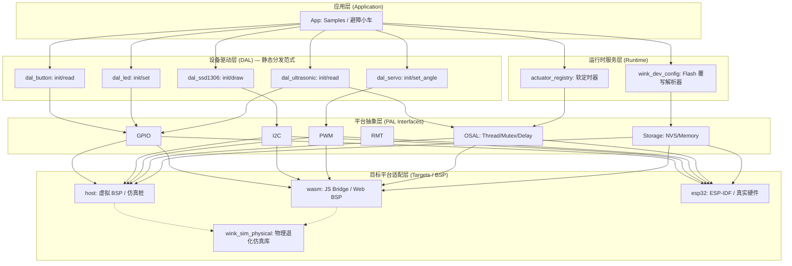

# WinkMicroOS 目录重组与架构演进提案

| 项 | 内容 |
|---|---|
| 创建日期 | 2026-06-29 |
| 状态 | Draft（草案） |
| **关联 ADR** | **[ADR-0001](../../decisions/core/0001-error-code-sign-convention.md)（负数错误码）、[ADR-0002](../../decisions/unisim/0002-dual-target-compilation.md)（双 target 同源编译）、[ADR-0004](../../decisions/core/0004-static-dispatch-vs-runtime-ops.md)（静态分发范式）、[ADR-0008](../../decisions/core/0008-dynamic-device-tree-config-flash.md)（Flash 设备树动态覆写）** |
| 关联设计规范 | `02-wink-micro-os/` 系列 |

---

## 0. 摘要

本提案定义 `wink-micro-os` 中长期的目录组织结构重构计划，旨在最大化代码可维护性、多平台可移植性和代码复用性，同时**严格遵循项目已达成的核心架构决策（ADR-0001 至 ADR-0008）**。

**核心架构原则重申（自 ADR）：**
1. ✅ **负数错误码**：所有可能失败的函数返回 `wink_status_t`，0 = 成功，负数 = 错误
2. ✅ **双 target 同源编译**：一份 C 代码同时兼容 Emscripten/wasm32 与 ESP-IDF/xtensa
3. ✅ **编译期静态分发**：采用「命名式 API + POD 结构体」，**不使用运行期 ops 虚表多态**
4. ✅ **AI 生成友好**：API 设计优先考虑 LLM 代码生成的确定性与静态校验可行性
5. ✅ **零编译污染**：仿真代码通过编译宏和 CMake 条件编译完全裁剪

---

## 1. 核心设计使命与原则

WinkMicroOS 是一个**以 LLM 代码生成为核心体验、以 Web 浏览器端高帧率基准仿真为命门**的垂直智能硬件开发平台。所有架构决策必须以此为第一优先级。

**设计约束优先级排序：**
1. **AI 可生成性（P0）**：API 必须直观、命名一致、无复杂指针强转，静态规则可低成本验证
2. **Wasm 仿真性能（P0）**：消除运行期间接调用开销，支持 Bypass 旁路直通 Web 3D 渲染
3. **双端同源确定性（P1）**：host/Wasm/esp32 行为 100% 可复现
4. **MCU 资源极简（P2）**：零动态内存分配，最小化 RAM/Flash 占用
5. **通用扩展性（P3）**：在不违反上述约束的前提下，最大化驱动框架的可扩展性

---

## 2. 提议的目录结构

为支持从 5 个驱动扩展到 50+ 个驱动，以及多硬件板级支持，提议以下目录布局：

```
wink-micro-os/
├── cmake/                      # CMake 工具链文件与通用编译配置
├── docs/                       # 设计文档、API 参考、ADR 决策记录
├── pal/                        # Platform Abstraction Layer（仅接口定义 + 通用实现）
│   ├── osal/                   # OS 服务接口（线程、互斥锁、环形缓冲区）
│   │   ├── pal_osal.h
│   │   ├── pal_delay.h
│   │   └── pal_trace.h
│   └── hal/                    # 硬件外设接口（GPIO, I2C, SPI, PWM, ADC, RMT, Storage）
│       ├── pal_gpio.h
│       ├── pal_i2c.h
│       ├── pal_pwm.h
│       ├── pal_rmt.h
│       ├── pal_adc.h
│       └── pal_storage.h
├── targets/                    # 平台特定实现（适配器层）
│   ├── common/                 # 各平台共享组件（如物理仿真库）
│   │   ├── include/
│   │   │   └── wink_sim_physical.h
│   │   └── src/
│   │       └── wink_sim_physical.c
│   ├── host/                   # Host 平台 stub（Windows/Linux/macOS 仿真）
│   ├── wasm/                   # WebAssembly 绑定层与 JS Bridge
│   ├── esp32/                  # ESP32 SoC 特定 PAL 实现
│   │   ├── common/             # ESP32 通用外设适配器
│   │   └── boards/             # 板级支持包（BSP）
│   │       └── devkitc/        # ESP32 DevKitC 开发板
│   └── baremetal/              # 裸金属 ARM/AVR 适配（预留）
├── dal/                        # Device Abstraction Layer（平台无关驱动）
│   ├── input/                  # 输入器件（按键、编码器）
│   │   ├── dal_button.h
│   │   └── dal_button.c
│   ├── output/                 # 输出器件（LED、继电器）
│   │   ├── dal_led.h
│   │   └── dal_led.c
│   ├── actuator/               # 执行器（舵机、步进电机）
│   │   ├── dal_servo.h
│   │   └── dal_servo.c
│   ├── display/                # 显示器驱动
│   │   ├── dal_ssd1306.h
│   │   └── dal_ssd1306.c
│   └── sensor/                 # 传感器（超声波、DHT11 等）
│       ├── dal_ultrasonic.h
│       └── dal_ultrasonic.c
├── runtime/                    # OS 核心服务与应用生命周期
│   ├── include/
│   │   ├── wink_actuator_registry.h
│   │   ├── wink_dev_config.h    # ADR-0008：设备树配置解析器
│   │   └── wink_status.h
│   └── src/
│       ├── wink_actuator_registry.c
│       └── wink_dev_config.c    # ADR-0008：Flash 配置覆写实现
├── samples/                    # 应用示例（避障小车、OLED 仪表盘等）
│   ├── avoidance_car/
│   └── oled_dashboard/
├── test/                       # 单元测试、集成测试与测试桩
│   ├── unity/                  # Unity 测试框架
│   └── stubs/                  # JS 仿真 host stub
└── tools/                      # 构建脚本、代码生成器与仿真面板
```

---

## 3. 关键抽象与隔离边界

为确保结构在多年开发中可维护，定义严格的层间边界。



---

### 边界 1：PAL API 与 Target 实现分离

* **约束**：`pal/` 目录下**只包含 C 头文件**，声明抽象接口（如 `pal_gpio_read`）。`pal/` 中不应包含任何平台特定的 C 源文件。
* **实现**：平台特定代码完全移至 `targets/<platform>/`。编译目标为 `esp32` 时，CMake 编译 `targets/esp32/` 中的适配器文件并链接。编译为 `host` 时，编译 `targets/host/` 中的适配器。
* **对齐 ADR**：遵循 [ADR-0002](../../decisions/unisim/0002-dual-target-compilation.md) 双 target 同源编译原则。

---

### 边界 2：DAL 设备模型 — 静态分发范式（**已对齐 ADR-0004**）

> ⚠️ **重要修正**：原提案中的「运行期 ops 虚表多态」设计**违反了项目已采纳的 ADR-0004 决策**。以下为校正后的正确设计。

#### 设计原则（自 ADR-0004）

**有意识地偏离 Linux/Zephyr 经典 OOP 范式**，转而采用：
- ✅ **命名式 API**：每类外设拥有独立且直观的函数命名空间
- ✅ **POD 结构体**：设备实例为纯数据结构，**不包含任何函数指针**
- ✅ **编译期静态分发**：无 `call_indirect` 运行时间接调用开销
- ✅ **AI 生成友好**：LLM 可以 100% 确定性地生成调用代码

#### 典型 API 形态

```c
// 超声波传感器 POD 结构体（纯数据，无函数指针）
typedef struct {
    uint8_t trig_pin;           // 触发引脚
    uint8_t echo_pin;           // 回声引脚
    uint32_t timeout_us;        // 超时阈值（微秒）
    // 仿真状态字段（仅 SIMULATION 编译时有效）
#if defined(SIMULATION)
    float sim_distance_m;       // 仿真距离（Bypass 旁路直通 Web 3D）
    uint32_t sim_last_read_tick;
#endif
} dal_ultrasonic_t;

// 命名式 API（静态分发，无虚表查找）
wink_status_t dal_ultrasonic_init(dal_ultrasonic_t *dev,
                                   uint8_t trig_pin, uint8_t echo_pin);
wink_status_t dal_ultrasonic_read(dal_ultrasonic_t *dev, float *distance_m);

// 按键 POD 结构体
typedef struct {
    uint8_t pin;
    bool active_low;
    pal_gpio_pull_t pull;
    // 消抖状态
    uint32_t debounce_ms;
    uint32_t last_press_tick;
    bool last_raw_state;
    bool stable_state;
} dal_button_t;

// 按键命名式 API
wink_status_t dal_button_init(dal_button_t *dev, uint8_t pin,
                               bool active_low, pal_gpio_pull_t pull_cfg);
wink_status_t dal_button_read(dal_button_t *dev, bool *pressed);
```

#### 为什么**不使用**统一 ops 虚表？

根据 [ADR-0004](../../decisions/core/0004-static-dispatch-vs-runtime-ops.md) §3.1 的决策：

| 维度 | 经典 ops 多态 | 静态分发 + 命名式 API |
|------|-------------|---------------------|
| **AI 代码生成** | ❌ 复杂指针强转易产生幻觉 | ✅ 100% 确定性生成 |
| **Wasm 性能** | ❌ `call_indirect` 破坏优化 | ✅ 直接函数调用，支持 Bypass |
| **RAM 占用** | ❌ 每个设备多 4-8 字节虚表指针 | ✅ 零额外开销 |
| **调试友好** | ❌ 虚表遮挡真实数据 | ✅ 纯 POD，gdb 直接查看所有状态 |
| **运行时热插拔** | ✅ 支持 | ❌ 非本项目刚需（编译期拓扑已确定） |

#### 仿真 Bypass 旁路机制（静态分发的核心优势）

在 SIMULATION 编译时，DAL 驱动可以**直接旁路硬件模拟**，直通 Web 3D 渲染器的计算结果：

```c
wink_status_t dal_ultrasonic_read(dal_ultrasonic_t *dev, float *distance_m) {
#if defined(SIMULATION)
    // Bypass：直接返回 JS 仿真引擎计算的碰撞距离
    // 跳过所有 GPIO 时序模拟、超时循环等物理层开销
    *distance_m = dev->sim_distance_m;
    return WINK_OK;
#else
    // 真机：执行真实的 GPIO 触发与回声脉冲测量
    pal_gpio_set_level(dev->trig_pin, 1);
    pal_delay_us(10);
    pal_gpio_set_level(dev->trig_pin, 0);
    // ... 真实硬件时序逻辑
#endif
}
```

这一机制将 Wasm-JS 频繁通信带来的性能开销**降低几个数量级**，是高帧率 Web 仿真的关键基石。

---

### 边界 3：总线抽象层（BAL）与共享外设并发安全

* **约束**：真实硬件共享 I2C/SPI 总线。DAL 驱动直接访问总线传输会导致死锁和并发损坏。
* **实现**：在 `pal/hal/` 下定义总线控制器层，由 PAL 实现保证线程安全：
  - `pal_i2c_bus_lock()` / `pal_i2c_bus_unlock()` 内部互斥保护
  - DAL 驱动仅与挂载在总线上的设备节点通信，无需关心底层并发
* **对齐 ADR**：兼容静态分发范式，不引入多态开销。

---

### 边界 4：物理仿真库（`wink_sim_physical`）

* **约束**：`wink_sim_physical` 必须平台无关，但纯仿真脚手架代码。
* **实现**：
  - 头文件位于 `targets/common/include/wink_sim_physical.h`
  - 源文件位于 `targets/common/src/wink_sim_physical.c`
  - CMake 确保仅当 `-DSIMULATION=ON` 或目标平台为 `host`/`wasm` 时才编译
  - 在 `esp32` 和 `baremetal` 目标平台上，CMake 完全不添加这些目录，实现零编译污染
* **对齐 ADR**：遵循 [ADR-0002](../../decisions/unisim/0002-dual-target-compilation.md) 同源编译原则。

---

## 4. 硬件配置系统：静态 POD + Flash 动态覆写（**已对齐 ADR-0008**）

> ⚠️ **重要修正**：原提案中的「JSON 配置 + 运行时动态解析」设计**未考虑 ADR-0008 已落地的混合自适应模式**。以下为校正后的正确设计。

根据 [ADR-0008](../../decisions/core/0008-dynamic-device-tree-config-flash.md)，采用 **混合自适应模式**：

### 4.1 核心设计：静态 POD 占位 + Flash 配置动态覆盖

```
      [ 前端 Web 画布：仅引脚/外设参数变更 ]
                       │
                       ▼ (不触发云编译，秒级生效)
      [ 生成微型二进制配置 dev_tree.bin (数十字节) ]
                       │
                       ▼ (WebSerial 发送自定义指令)
         [ 写入物理板 Flash 存储（ESP32: NVS） ]
                       │
                       ▼ (软重启 MCU)
      [ 静态 POD 实例装载默认值 ] ──► [ 读取 Flash 动态覆盖 ] ──► [ 执行硬件 init ]
```

### 4.2 代码生成器职责

**前端代码生成器（Codegen）** 的输出分为两类：

| 变更类型 | 触发条件 | 输出格式 | 生效方式 |
|---------|---------|---------|---------|
| **拓扑变更** | 新增/删除外设、变更外设类型 | `device_tree.c` + `device_tree.h` | 需云编译 + 全量烧录（分钟级） |
| **参数微调** | 修改引脚、调整脉宽、修改超时 | `dev_tree.bin`（对称二进制块） | WebSerial 下发 + 软重启（秒级） |

### 4.3 配置文件格式：对称二进制块（非 JSON）

为了在解析效率、Flash 占用和内存消耗之间取得平衡，**放弃 JSON 解析器**，采用轻量二进制格式：

```c
// ADR-0008 §5.2 定义的权威格式
#pragma pack(push, 1)
typedef struct {
    uint32_t magic;           // 校验魔数 0x474E4957 ("WINK")
    uint16_t version;         // 配置结构版本号（版本门控）
    uint16_t total_devices;   // 配置的器件总数
    uint32_t crc32;           // CRC-32/ISO-HDLC 校验
    
    struct {
        uint32_t device_id;   // 外设在设备树中的静态 hash ID
        uint8_t  params[16];  // 扁平覆写缓冲区
    } items[];
} wink_dev_config_t;
#pragma pack(pop)
```

**CRC-32 契约**（ADR-0008 §5.3）：
- 多项式：`0xEDB88320`（ISO-HDLC / zlib / PNG 同款）
- 初始值：`0xFFFFFFFF`，最终异或：`0xFFFFFFFF`
- 输入输出均反射（reflected）
- Host 端实现为前端 Codegen 对接的**权威参考**

### 4.4 运行时覆写流程

```c
// 在 sample app_init 顶部、dal_*_init 之前调用
wink_status_t device_tree_apply_flash_config(void) {
    // 1. 通过 pal_storage 抽象读取配置
    wink_dev_config_t *cfg = NULL;
    wink_status_t st = pal_storage_read("dtcfg", &cfg, sizeof(*cfg));
    
    // 2. 读取失败或校验不通过 → 优雅降级，使用编译期默认值
    if (st != WINK_OK || cfg->magic != WINK_CFG_MAGIC) {
        return WINK_ERR_UNSUPPORTED;  // 静默降级
    }
    
    // 3. 版本门控：布局变更必须 bump version，旧版本一律不解析
    if (cfg->version != 1) {
        return WINK_ERR_VERSION;       // 静默降级
    }
    
    // 4. 按 device_id 分发表项到各 DAL 的 apply_override 函数
    for (int i = 0; i < cfg->total_devices; i++) {
        const wink_dev_config_item_t *item = &cfg->items[i];
        switch (item->device_id) {
            case DEV_ID_FRONT_RADAR:
                dal_ultrasonic_apply_override(&front_radar, item->params);
                break;
            case DEV_ID_NECK_SERVO:
                dal_servo_apply_override(&neck_servo, item->params);
                break;
            // ... 其他外设
        }
    }
    
    return WINK_OK;
}

// 之后从 POD 字段重建参数喂 dal_*_init
// 例如：dal_servo_init(&neck_servo, (dal_servo_config_t){
//           .pin = neck_servo.pin,  // 已被覆写函数更新
//           .min_pulse_us = neck_servo.min_pulse_us,
//           .max_pulse_us = neck_servo.max_pulse_us,
//       });
```

---

## 5. 重组路线图（分阶段迁移）

为避免破坏 CI 流水线或阻塞开发进度，目录迁移分阶段执行：

### Phase 1：PAL 内部分区（无破坏性变更）

1. 创建 `pal/osal/` 和 `pal/hal/` 子目录
2. 将现有头文件移动到对应分类：
   - `pal_osal.h`, `pal_delay.h`, `pal_trace.h` → `pal/osal/`
   - `pal_gpio.h`, `pal_i2c.h`, `pal_pwm.h`, `pal_rmt.h`, `pal_adc.h`, `pal_storage.h` → `pal/hal/`
3. 更新 CMake 包含目录，增加转发头文件保持向后兼容
4. **验证**：运行 host 和 esp32 编译，所有测试通过

**风险等级**：🟢 低（仅移动头文件，不改代码）

---

### Phase 2：Targets 目录标准化与分离

1. 创建 `targets/common/src/` 和 `targets/common/include/`
2. 将 `wink_sim_physical.h` 和 `wink_sim_physical.c` 移动到 `targets/common/`
3. 分离通用仿真测试代码与硬件目标代码
4. 更新 CMakeLists.txt，动态编译 `targets/common` 仅当 `SIMULATION=ON`
5. **验证**：SIMULATION=ON/OFF 两种编译模式均正常工作

**风险等级**：🟢 低（仅移动文件，不改实现）

---

### Phase 3：DAL 分类分区

1. 在 `dal/include/` 和 `dal/src/` 下创建分类子目录：
   - `input/`（按键、编码器）
   - `output/`（LED、继电器）
   - `actuator/`（舵机、步进电机）
   - `display/`（SSD1306 等）
   - `sensor/`（超声波、DHT11 等）
2. 将现有扁平驱动文件移动到对应分类
3. 更新全局 CMake 核心源文件追踪配置
4. **验证**：所有单元测试和集成测试通过

**风险等级**：🟢 低（仅移动文件，不改 API 或实现）

---

### Phase 4：板级支持包（BSP）拆分与代码生成器对接

1. 创建 `targets/esp32/boards/devkitc/` 并移动引脚配置
2. 代码生成器输出对接 ADR-0008 规范：
   - 生成静态 `device_tree.c/h`（拓扑变更时）
   - 生成 `dev_tree.bin` 二进制配置块（参数微调时）
3. 实现前端 WebSerial 配置下发协议
4. **验证**：参数微调无需编译即可秒级在真机生效

**风险等级**：🟡 中（涉及新功能开发）

---

## 6. 后续演进方向

### 6.1 局部多态化（如确实需要）

如果未来确实面临「同一种业务抽象（如距离传感器）需要支持多种具体硬件实现（如超声波和激光）」的需求，根据 ADR-0004 §4 的演进路径：

- ✅ **不破坏 BAL 层的静态 API 契约**
- ✅ **在 DAL 内部进行局部多态化**：例如在 `dal_ultrasonic.c` 内部引入微型 ops 虚表，或根据设备实例中的配置字段使用静态 `switch-case` 分发
- ❌ **不向上层暴露多态**：对 AI 生成和仿真保持静态命名友好性

### 6.2 低资源目标编译期裁剪

针对 Flash 空间极度紧张、无文件系统支持的资源受限目标（如低容量 STM32、AVR），可通过编译宏 `HAS_FLASH_CONFIG_ESCAPE` 在编译期将 Flash 读取、二进制解析器等逻辑完全裁剪掉，退化为纯静态分发模式。

---

## 7. 验收标准

- [ ] Phase 1-3 完成后，所有现有 host 单元测试 100% 通过
- [ ] Phase 1-3 完成后，ESP32 目标编译无错误、无警告
- [ ] Phase 1-3 完成后，Wasm 目标编译无错误
- [ ] 目录结构完全符合 §2 定义
- [ ] 所有设计决策均能在对应 ADR 中找到依据

