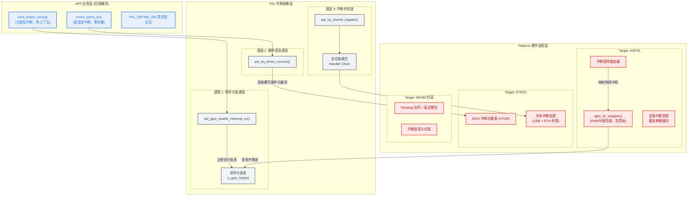

# PAL 统一中断子系统架构设计方案

> ## ⚠️ 本文件已由 ADR-0018 部分作废（2026-07-02）
>
> **状态**：**v2.x 历史归档**。本文所述的以下 API / 概念均已由
> [ADR-0018 PAL 中断 API 收窄](../../decisions/core/0018-pal-irq-api-narrowing.md)
> 从 `pal_irq.h` 公开面中**删除或迁出**：
>
> - **删除**：`pal_irq_direct_connect` / `pal_irq_shared_register` /
>   `pal_direct_isr_t` / `pal_irq_shared_handler_t` /
>   `PAL_IRQ_PRIO_LOWEST` / `PAL_IRQ_PRIO_HIGHEST` / `PAL_IRQ_PRIO_REALTIME` /
>   `pal_shared_chain.{h,c}` 全部实现
> - **迁出**到 `pal_irq_advanced.h`（`#ifndef WINK_ALLOW_ADVANCED_IRQ_APIS` `#error` 门控）：
>   `pal_irq_synchronize` / `pal_irq_save` / `PAL_CRITICAL_SECTION_STRICT`
> - **优先级枚举收窄** 6 级 → 3 级：`PAL_IRQ_PRIO_LOW / NORMAL / HIGH`（全 RTOS 安全）
>
> **当前 IRQ 子系统的活文档**：
> - **公开 API 契约**：`wink-micro-os/pal/include/pal_irq.h`（v3.0，Track F 升级版）
> - **系统级 API**：`wink-micro-os/pal/include/pal_irq_advanced.h`
> - **SSOT 设计规范**：[02-pal-platform-abstraction.md §3.3](../../design/02-wink-micro-os/02-pal-platform-abstraction.md#33-pal-irq-公开面收窄adr-0018)
> - **决策依据**：[ADR-0018](../../decisions/core/0018-pal-irq-api-narrowing.md) +
>   [2026-07-02 收窄评审](../../reviews/core/2026-07-02-pal-irq-api-narrowing-review.md)
>
> 本文以下内容保留仅供**历史溯源**（v2.x 的架构演进、G1/G2/G3 契约对齐过程、
> RCU 责任链算法设计等）。**不要**再用本文的 API 表指导编码——请直接读 `pal_irq.h`。

---

| 项 | 值 |
|----|----|
| **文档版本** | v2.2（Phase 1.5 契约与实现对齐版） |
| **设计日期** | 2026-06-30 |
| **最后修订** | 2026-07-01（v2.2：G3 实现落地 + host/wasm REALTIME 一致化） |
| **架构师** | Wink-AI 嵌入式团队 |
| **评审专家** | 嵌入式架构委员会 |
| **状态** | 评审通过 → 实施中（v2.2 契约与实现完全对齐） |
| **关联 ADR** | ADR-0002 (双目标同源编译), ADR-0008 (Device Tree 配置化), ADR-0010 (中断子系统架构决策), ADR-0012 (契约诚实优于静默降级), ADR-IRQ-SMP (SMP 竞态修正), ADR-IRQ-SHARE (共享中断语义修正), ADR-IRQ-008 (v2.1 契约诚实化), ADR-IRQ-009 (v2.2 GPIO 服务锁定 + host/wasm REALTIME 默认拒接) |
| **关联评审** | [2026-06-30 PAL 中断子系统架构评审](../../reviews/core/2026-06-30-pal-interrupt-subsystem-architecture-review.md) |
| **关联实施计划** | [2026-06-30-pal-interrupt-phase1-contract-alignment-plan](../../implementation-plans/core/2026-06-30-pal-interrupt-phase1-contract-alignment-plan.md)，[2026-07-01-pal-interrupt-phase1p5-gpio-prio-enforcement-plan](../../implementation-plans/core/2026-07-01-pal-interrupt-phase1p5-gpio-prio-enforcement-plan.md) |

---

## v2.2 修订说明（2026-07-01，Phase 1.5 契约与实现对齐）

v2.1 把契约"诚实化"写入头文件（G1/G2/G3 从"承诺零成本硬直派 / 静默降级 REALTIME / 忽略 prio"改为如实描述），但 **G3 实现未同步落地**：三 target 仍 `(void)prio;`；G2 实现只在 ESP32 侧完成，host/wasm 仍静默接受 REALTIME。Phase 1.5 补齐这两处，使契约与实现完全对齐。

| 编号 | 主题 | v2.1（doc-only） | v2.2（Phase 1.5 落地） |
|------|------|-----------------|------------------------|
| G3 | `pal_gpio_enable_interrupt_ex` 的 `prio` 参数 | 头文件承认"当前所有 target 均忽略 prio"，实现 `(void)prio;` | 三 target 均实现**首次注册锁定语义**：首次 install 时锁定 prio；后续 mismatch → `WINK_ERR_INVALID_ARG`。ESP32 侧 `gpio_install_isr_service(0)` 硬编码改为 `s_gpio_prio_flag_map[prio] \| ESP_INTR_FLAG_IRAM`。锁定后进程生命周期内不再释放（disable 也不解锁，规避 TOCTOU / SMP UAF）。 |
| G2 | REALTIME 拒接 | 仅 ESP32 侧拒接（host/wasm 静默接受） | host/wasm 侧 **默认拒接**（返回 `WINK_ERR_UNSUPPORTED`），与 ESP32 对齐；静态校验类测试可通过编译期宏 `WINK_HOST_ALLOW_REALTIME_FOR_TESTING` opt-in 放行，首次注册打一次性 warn。`pal_gpio_enable_interrupt_ex` 的 GPIO 路径无 opt-in，无论何种编译都拒接。 |

**为什么 GPIO 全局服务永不释放** —— 该决策独立于 ADR-0012（后者只说"契约诚实"，不指定实现方式），单独记入 ADR-IRQ-009（§11 局部决策表）。核心理由：

1. **TOCTOU race**：`disable(last_pin)` → 计数=0 → uninstall；另一线程同时 `enable(new_prio)` → 竞态。
2. **SMP UAF 风险**：disable 后 ISR 可能仍在另一核上执行（见 ADR-IRQ-007），uninstall 会释放 dispatcher 状态 → UAF。
3. **心智模型复杂**：用户会看到"平时锁定、极短窗口内可换 prio"，难以推理。
4. **ESP-IDF 语义匹配**：`gpio_install_isr_service` 官方就是进程级 one-shot 全局服务，反复 install/uninstall 是反模式。

若未来业务真需要"per-pin 独立优先级"（按钮抢占传感器等），将新增 `pal_gpio_enable_interrupt_dedicated()` 走独立中断源；本接口签名保持不变。

详细落地见 §4.1（ESP32 实现）、§3.x（接口签名 doxygen）、§11.ADR-IRQ-009。

---

## v2.1 修订说明（2026-06-30，契约对齐 P0）

本次修订对齐了三处"承诺/实现不一致"，统一原则：**契约诚实优于静默降级**（参考 ADR-0012）。

| 编号 | 主题 | 旧契约（v2.0） | 新契约（v2.1） |
|------|------|---------------|---------------|
| G1 | `pal_irq_direct_connect` | "完全绕过 PAL 软件分发，零延迟硬件直派" | 头文件明示当前实现仍走软分发；通过 trampoline 消除 `(pal_isr_t)handler` 的 CFI/UBSan 违例 cast。真硬件直派留给未来 `pal_irq_direct_connect_unsafe()`。 |
| G2 | ESP32 `PAL_IRQ_PRIO_REALTIME` | 静默映射到 `ESP_INTR_FLAG_LEVEL3`（与 HIGHEST 物理等价、契约相反） | ESP32 显式返回 `WINK_ERR_UNSUPPORTED`。Host/WASM 单线程模型下仍接受。`pal_gpio_enable_interrupt_ex` 同样路径拒接。 |
| G3 | `pal_gpio_enable_interrupt_ex` 的 `prio` 参数 | 头文件称"支持指定优先级"，三个 target 全部 `(void)prio` 静默丢弃 | Doc-only 诚实化：头文件明示 prio 当前被所有 target 忽略，理由是 GPIO ISR 共享 dispatch service；如需 per-pin 抢占，将走未来的 `pal_gpio_enable_interrupt_dedicated()`。 |

详细落地见 §4.1（ESP32 实现）、§3.x（接口签名 doxygen）。

---

---

## 专家评审摘要

本设计文档经过嵌入式架构委员会评审，共收到 **10 项专家级改进建议**，全部已采纳并整合到本文档 v2.0 中：

### ⭐ 极高价值修正（P0 必须项）
1. **SMP 双核分发表竞态** — GPIO 回调指针读取需加自旋锁保护
2. **共享中断遍历语义修正** — 不提前终止责任链，始终遍历所有 handler
3. **ESP32 API 名称陷阱** — `gpio_intr_clr_enable` 非标准 API，修正清标逻辑

### 🔧 架构增强建议（P1 推荐项）
4. **新增 REALTIME 优先级** — 为硬实时场景提供 Non-OS Safe 逃生通道
5. **双等级中断锁语义** — 提供"全屏蔽"和"RTOS 安全"两种中断锁接口
6. **CodeGen 编译期安全检查** — DTS 配置越界在 CMake 阶段报错
7. **Handler 链并发安全** — 共享中断链表采用 RCU 模式安全修改
8. **irq_synchronize 接口** — SMP 下等待 ISR 执行完成的同步原语

### 📈 优化建议（P2/P3 可选项）
9. **STM32 EXTI 读-改-清 竞态** — 原子操作避免中断丢失
10. **WASM 延迟模型增强** — Pareto 长尾分布 + Flash 访问延迟模拟

---

## 目录

1. [设计背景与目标](#1-设计背景与目标)
2. [架构总览](#2-架构总览)
3. [核心接口定义 (PAL 层)](#3-核心接口定义-pal-层)
4. [各平台实现方案](#4-各平台实现方案)
5. [中断共享机制](#5-中断共享机制)
6. [设备树集成与配置化](#6-设备树集成与配置化)
7. [风险识别与 Mitigation](#7-风险识别与-mitigation)
8. [重构实施路线图](#8-重构实施路线图)
9. [验证策略与性能基线](#9-验证策略与性能基线)
10. [向后兼容性](#10-向后兼容性)
11. [核心架构决策记录](#11-核心架构决策记录)
12. [附录](#12-附录)

---

## 1. 设计背景与目标

### 1.1 现状问题

当前 `devkitc_smoke` 示例中存在的架构缺陷：

```c
// ❌ 问题：业务逻辑被平台宏包裹，破坏同源编译
#if defined(ESP_PLATFORM)
static void boot_button_isr(void *arg) {
    (void)arg;
    s_isr_count++;  // ✅ 这行是纯业务，本应跨平台
}
#endif

static void app_init(void) {
#if defined(ESP_PLATFORM)
    // ❌ 整段被 #ifdef 包裹，代码结构碎片化
    st = pal_gpio_enable_interrupt(BOOT_BUTTON_PIN,
                                    PAL_GPIO_INTR_FALLING_EDGE,
                                    boot_button_isr, NULL);
#endif
}
```

**问题本质：** ISR 的**业务逻辑**是跨平台通用的，但 ISR 的**存在性**被错误地绑定到了具体平台。

### 1.2 设计目标

| 目标 | 量化指标 |
|------|---------|
| **同源编译** | APP 代码零 `#ifdef ESP_PLATFORM`，同一份 C 文件在所有 target 编译 |
| **换芯片成本** | 更换 MCU 时，仅需修改 `targets/` 下的适配层 + device tree 映射，不改 APP |
| **仿真保真度** | WASM 仿真的中断时序与 ESP32 真机偏差 < 1 个 tick |
| **中断延迟** | Direct-Connect 路径额外延迟 < 5 个 CPU 周期；Dispatched 路径额外延迟 < 30 个 CPU 周期 |
| **内存开销** | 向量表静态内存占用 < 1KB (ESP32) |
| **FreeRTOS 兼容性** | 所有优先级的 ISR 均可安全调用 FromISR 系列 API |

### 1.3 非目标

- ❌ 不实现嵌套中断调度（由硬件中断控制器处理）
- ❌ 不实现中断线程化（Deferred ISR 交由 DAL 层或 App Task 处理）
- ❌ 不统一所有外设的中断接口（先做 GPIO/UART，后续扩展）

---

## 2. 架构总览

### 2.1 三层抽象架构

#### 1. 概念架构图 (ASCII Art)

```
┌────────────────────────────────────────────────────────────────────────┐
│                        APP 业务层（零平台宏）                           │
│  ┌───────────────────────┐              ┌───────────────────────────┐  │
│  │ boot_button_isr(arg)  │              │  motor_direct_isr()       │  │
│  │ [Dispatched Callback] │              │  [Direct-Connect Vector]  │  │
│  │ PAL_DEFINE_ISR 类型安全│              │                           │  │
│  └───────────┬───────────┘              └─────────────┬─────────────┘  │
└──────────────┼────────────────────────────────────────┼────────────────┘
               │                                        │
┌──────────────▼────────────────────────────────────────▼────────────────┐
│                      PAL 中断抽象层（平台无关接口）                     │
│  ┌─────────────────────────────────────┐  ┌─────────────────────────┐  │
│  │        【1. 软件分发通道】          │  │   【2. 硬件直连通道】   │  │
│  │  - pal_irq_enable(...)              │  │  - pal_irq_direct       │  │
│  │  - pal_gpio_enable_interrupt_ex()   │  │    _connect(...)        │  │
│  │  - pal_irq_shared_register()        │  │                         │  │
│  │  ---------------------------------  │  │  (绕过分发表，直接映射) │  │
│  │  - 软件分发表: s_gpio_isr[pin]      │  │  - 中断链: shared chain │  │
│  └───────────────────┬─────────────────┘  └───────────┬─────────────┘  │
└──────────────────────┼────────────────────────────────┼────────────────┘
                       │                                │
┌──────────────────────▼────────────────────────────────▼────────────────┐
│                   Target 平台适配层（与芯片底层对接）                  │
│  ┌─────────────────────────────────────┐  ┌─────────────────────────┐  │
│  │          Target: ESP32              │  │         Target: STM32   │  │
│  │  - xtensa 中断控制器与中断矩阵配置  │  │  - Cortex-M NVIC 向量表  │  │
│  │  - IRAM_ATTR 驱动分发包装服务       │  │  - VTOR 静态/动态重定位 │  │
│  │  - 全局中断禁用: 最高屏蔽级别       │  │  - 中断共享处理链        │  │
│  └─────────────────────────────────────┘  └─────────────────────────┘  │
└────────────────────────────────────────────────────────────────────────┘
```

#### 2. 高对比度时序与路由拓扑 (Mermaid)



### 2.2 双通道中断路径与调用链

为了兼顾通用外设开发便利性（支持用户回调上下文参数）与极速响应外设的实时性能，PAL 提供**软件分发（Dispatched）**与**硬件直连（Direct-Connect）**双通道中断路径。

#### 1. 软件分发路径（Dispatched Path - 默认）

适用于绝大多数常规中断。支持传递 `void *arg` 参数，允许在中断处理中识别不同的设备实例上下文。

```
ESP32 硬件中断
    ↓ (汇编入口)
cpu_common_int_handler()  [ROM/startup 代码]
    ↓
gpio_intr_handler()       [ESP-IDF 驱动]
    ↓
gpio_isr_wrapper()        [PAL 内部分发包装，存在于 pal_hal_esp32.c]
    ├─> ✅ 第一步：清除中断标志（防止重入）
    ├─> ✅ 第二步：原子读取回调指针
    └─> 第三步：调用用户 ISR
            ↓
s_gpio_isr[pin](arg)      [PAL 分发表，回调是 APP 注册的带有 arg 的业务函数]
    ↓
boot_button_isr(arg)      [APP 代码，零平台宏，同源编译]
```

#### 2. 硬件直连路径（Direct-Connect Path）

适用于对中断响应延迟极其敏感的场景（如高频电机换向、定时器精确控制）。该路径不支持回调参数传递（函数原型为 `void (*)(void)`），直接修改硬件向量表，无任何软件分发开销。

```
STM32 硬件中断
    ↓
内核中断向量表 (如 TIM1_UP_IRQHandler)
    ↓ (硬件直接跳转，零软件封装开销)
motor_direct_isr()        [APP 注册的直接中断函数，使用 PAL_DIRECT_ISR 修饰]
```

---

### 2.3 中断多路复用与解耦设计原则

在单片机硬件系统中，外设中断接口与核心中断控制器（如 NVIC、PLIC 等）之间并非一一对应，而是普遍存在**多路复用（Multiplexing）**和**状态共用（Shared Status）**。为了使 PAL 架构适配任何芯片架构，中断子系统采取了"分层解耦"的设计原则。

#### 2.3.1 分层架构设计

整个中断抽象系统分为两层：

1. **底层的逻辑中断控制器（System HAL Controller）**：
   - **代表接口**：`pal_irq_enable()` / `pal_irq_disable()`，操作逻辑中断号 `irq_num`。
   - **职责**：直接操作 CPU 核心可见的硬件中断向量或中断矩阵分配器。它只负责使能/禁用某个特定硬件中断源，以及处理全局中断锁（`pal_irq_save/restore`）。
   - **普适性**：该层极其扁平，完全适配任何单片机芯片，因为所有 CPU 核心（Cortex-M、Xtensa、RISC-V 等）都将中断呈现为一个中断号列表。
   - **关键语义保证**：`pal_irq_save()` 提供**全局中断禁用**的最强语义（所有可屏蔽中断均被禁用）。

2. **高层的外设特异中断接口（Peripheral HAL Driver）**：
   - **代表接口**：`pal_gpio_enable_interrupt_ex()` / `pal_uart_enable_interrupt()`，入参为外设相关的物理属性（如引脚号 `pin`、事件类型 `edge` 等）。
   - **职责**：屏蔽外设本身的中断配置逻辑、多路复用关系以及共享状态处理。

#### 2.3.2 外设中断多路复用与分发的两种模式

为了使高层外设接口适配各种芯片的中断硬件差异，驱动层需要实现以下两种分发模式：

1. **软件二次分发模式（Software Demux）**
   - **典型场景**：GPIO 中断。
     - **STM32**：引脚 PA0、PB0 共享 `EXTI0_IRQn` 中断线。
     - **ESP32**：所有的 GPIO 共用同一个 `ETS_GPIO_INTR_SOURCE` 中断源。
   - **分发机制**：驱动在适配层注册一个公共的中断服务程序（Dispatched ISR Wrapper），当该中断源触发时：
     1. **第一时间**读取并清除外设的中断状态寄存器（如 STM32 的 `EXTI->PR` 或 ESP32 的 `GPIO_STATUS_REG`），找出具体是哪一个物理源（如哪个引脚）触发了中断。
     2. 清除该物理源的中断标志位。**⚠️ 必须在调用用户 ISR 之前清除，防止重入**。
     3. 查找该物理源在驱动内部维护的回调表，并执行用户回调。
   - **直连优化**：若某个外设引脚或中断源支持独占硬件向量且需要极低延迟，则应支持绕过该分发表，直接使用 `pal_irq_direct_connect` 挂载到硬件向量表。

2. **状态分发模式（Status Demux）**
   - **典型场景**：UART 中断。
     - 几乎所有单片机中，一个串口通常只占用一个 CPU 中断号，但却会因为"接收缓存非空（RXNE）"、"发送缓存空（TXE）"、"帧错误（FE）"等多个完全不同的事件触发。
   - **分发机制**：外设驱动内部提供公共 Handler。当串口中断触发时，Handler 读取状态寄存器（如 UART_SR / UART_ISR），清空对应的状态位，然后根据具体的事件类型，调用对应的业务回调（如 `rx_callback` 或 `tx_callback`）。

#### 2.3.3 各单片机芯片架构映射示例

| 芯片系列 / 平台 | 逻辑中断控制器（`pal_irq`）映射方式 | 外设多路复用（`pal_gpio` 等）处理方式 | 全局中断禁用实现 |
| :--- | :--- | :--- | :--- |
| **STM32 (Cortex-M)** | 直接映射到 NVIC 中断通道（如 `EXTI0_IRQn`, `USART1_IRQn`） | 驱动内部操作 `SYSCFG->EXTICR` 进行引脚至 EXTI 线的路由选择，并重写 EXTI 的公共 ISR 实施软件分发。 | `__disable_irq()` / `__get_PRIMASK()` |
| **ESP32 (Xtensa/RISC-V)** | 操作中断矩阵（Interrupt Matrix），调用 `esp_intr_alloc` 将逻辑源绑定到可用的 CPU 中断线。 | 调用 `gpio_install_isr_service` 建立全局 GPIO 中断分发器。 | `XTOS_SET_INTLEVEL(XCHAL_NUM_INTLEVELS)` (最高屏蔽级) |
| **8051 (C51)** | 映射到 5 个核心硬件中断号（0=INT0, 1=Timer0...）。 | 8051 硬件通常不支持多路复用，仅支持少数引脚直连中断（如 INT0 绑定至 P3.2）。驱动直接将其通过 `interrupt` 属性编译进硬向量表。 | `EA = 0` / 保存 EA 状态 |
| **WASM / Host 仿真** | 映射到仿真器的软件事件挂载点。 | 仿真层读取写入的模拟电平状态变化，通过延迟 pending 队列向目标引脚分发事件。 | 锁持有期间 pending 队列不分发，ISR 调用延迟到锁释放 |

---

## 3. 核心接口定义 (PAL 层)

### 3.1 新增文件：`pal/include/pal_irq.h`

```c
/**
 * @file pal_irq.h
 * @brief PAL 统一中断控制器抽象层
 *
 * 契约保证：
 * 1. 所有接口都是线程安全的（可在 ISR 上下文调用）
 * 2. 优先级数值语义统一（所有平台一致）
 * 3. 中断锁可嵌套（save/restore 支持嵌套调用）
 * 4. pal_irq_save() 禁用所有可屏蔽中断，提供最强临界区保护
 * 5. 所有优先级均可安全调用 FreeRTOS FromISR API
 */

#ifndef PAL_IRQ_H
#define PAL_IRQ_H

#include <stdint.h>
#include <stdbool.h>
#include "wink_status.h"

#ifdef __cplusplus
extern "C" {
#endif

/* ─────────────────────────────────────────────────────────
 * 中断优先级统一抽象
 * ───────────────────────────────────────────────────────── */

/**
 * @brief 统一中断优先级枚举
 *
 * 语义保证：所有平台下，HIGHEST 优先级的中断会抢占 LOWEST 优先级的中断。
 * 各平台内部映射到硬件优先级数值（注意：不同芯片优先级数值方向可能相反）。
 *
 * ⚠️ FreeRTOS 安全约束：
 * LOWEST ~ HIGHEST 级别的中断均可安全调用 xQueueSendFromISR 等 FreeRTOS API。
 * REALTIME 级别例外 — 该级别高于 RTOS 临界区保护边界，严禁调用任何 RTOS API。
 */
typedef enum {
    PAL_IRQ_PRIO_LOWEST   = 0,  /**< 最低优先级，用于非关键外设 */
    PAL_IRQ_PRIO_LOW      = 1,  /**< 低优先级，用于一般通信 */
    PAL_IRQ_PRIO_NORMAL   = 2,  /**< 默认优先级 */
    PAL_IRQ_PRIO_HIGH     = 3,  /**< 高优先级，用于时间敏感外设 */
    PAL_IRQ_PRIO_HIGHEST  = 4,  /**< 最高 RTOS 安全优先级 */
    PAL_IRQ_PRIO_REALTIME = 5,  /**< ⚠️ 非 RTOS 安全！极端硬实时场景专用
                                     严禁调用任何 RTOS API（包括 FromISR 系列）
                                     仅用于电机换向、激光同步等零延迟需求 */
    PAL_IRQ_PRIO_COUNT         /* 优先级数量，用于边界检查 */
} pal_irq_prio_t;

/* ─────────────────────────────────────────────────────────
 * ISR 类型与属性注解
 * ───────────────────────────────────────────────────────── */

/**
 * @brief ISR 函数原型（完全平台无关）
 * @param arg 注册时传入的上下文指针
 *
 * @contract ISR 必须遵守：
 * 1. 执行时间 < 10us (或 < 最高优先级 tick 周期的 10%)
 * 2. 不调用任何可能阻塞的函数
 * 3. 栈使用 < 128 字节（含嵌套调用）
 * 4. 不触发任何可能导致 Flash 访问的操作
 * 5. 仅调用后缀为 FromISR 的 RTOS API
 */
typedef void (*pal_isr_t)(void *arg);

/**
 * @brief 硬件直连中断（Direct-Connect）处理程序原型
 * @note 因硬件限制，直连中断不能传递任何上下文参数，函数签名必须为 void(*)(void)
 */
typedef void (*pal_direct_isr_t)(void);

/**
 * @brief 中断共享处理程序原型（责任链模式）
 * @return true = 此 handler 认领了该中断（用于杂散中断统计）；false = 未认领
 *
 * ⚠️ 关键语义修正（v2.0 评审后）：
 * 返回值仅用于统计，**不控制遍历流程**。无论返回 true 或 false，
 * 链上所有 handler 都会被调用。这避免了共享中断同时触发时，
 * 先执行的 handler 返回 true 导致后续外设中断未被处理的性能问题。
 *
 * 设计参考：Linux 内核 Shared IRQ 处理机制（已在工业界验证 30 年）。
 *
 * 用于多个外设共享同一硬件中断向量的场景（如 STM32 USB OTG + ETH 共享）。
 * 每个 handler 必须先读取自家外设的状态寄存器，确认是自己的中断后再处理。
 */
typedef bool (*pal_irq_shared_handler_t)(void *arg);

/**
 * @def PAL_ISR
 * @brief 跨平台 软件分发型 ISR 属性注解
 *
 * 用法：static PAL_ISR void my_isr(void *arg) { ... }
 *
 * 各平台展开为对应属性：
 * - ESP32: IRAM_ATTR (确保分发回调代码驻留 RAM，不因 Flash Cache Miss 延迟)
 * - STM32/ARM: 空 (ARM Cortex-M 硬件自动压栈，常规 C 函数即可作为 ISR)
 * - WASM/Host: 空 (普通函数)
 */
#if defined(ESP_PLATFORM)
#include "esp_attr.h"
#define PAL_ISR  IRAM_ATTR
#else
#define PAL_ISR  /* 无特殊属性 */
#endif

/**
 * @def PAL_DIRECT_ISR
 * @brief 跨平台 硬件直连型 ISR 属性注解
 *
 * 用法：static PAL_DIRECT_ISR void motor_direct_isr(void) { ... }
 *
 * 各平台展开为对应属性：
 * - ESP32: IRAM_ATTR (确保直连处理程序驻留 RAM)
 * - STM32: 空 (常规 C 函数作为硬件中断表项)
 * - WASM/Host: 空
 */
#define PAL_DIRECT_ISR PAL_ISR

/**
 * @def PAL_DEFINE_ISR
 * @brief 类型安全的 ISR 定义宏
 *
 * 自动生成类型转换包装，避免 ISR 中手动进行 (struct xxx *)arg 强制转换，
 * 消除类型转换带来的潜在 Bug。
 *
 * 用法：
 *   PAL_DEFINE_ISR(my_button_isr, struct button_state, state) {
 *       state->press_count++;  // ✅ 类型安全，不需要强制转换
 *       state->last_press_time = pal_get_tick_count();
 *   }
 *
 *   pal_gpio_enable_interrupt(pin, edge, my_button_isr, &my_button_state);
 */
#define PAL_DEFINE_ISR(name, arg_type, arg_name)  \
    static PAL_ISR void name##_typed(arg_type *arg_name);  \
    static PAL_ISR void name(void *arg) {  \
        name##_typed((arg_type *)arg);  \
    }  \
    static PAL_ISR void name##_typed(arg_type *arg_name)

/* ─────────────────────────────────────────────────────────
 * 中断控制器核心接口
 * ───────────────────────────────────────────────────────── */

/**
 * @brief 启用并注册软件分发中断（支持传递上下文参数）
 *
 * @param irq_num 逻辑中断号（由 device tree 定义）
 * @param prio 中断优先级
 * @param handler ISR 处理函数（必须遵守 ISR 契约，使用 PAL_ISR 修饰）
 * @param arg 传递给 ISR 的上下文参数
 *
 * @return WINK_OK 成功，WINK_ERR_INVALID_ARG 参数非法，WINK_ERR_BUSY 中断已被占用
 */
WINK_WARN_UNUSED_RESULT
wink_status_t pal_irq_enable(uint32_t irq_num, pal_irq_prio_t prio,
                              pal_isr_t handler, void *arg);

/**
 * @brief 注册并启用硬件直连中断（零软件分发延迟）
 *
 * @param irq_num 逻辑中断号
 * @param handler 直连中断处理函数（必须使用 PAL_DIRECT_ISR 注解，不能接收参数）
 * @return WINK_OK 成功，WINK_ERR_INVALID_ARG 参数非法，WINK_ERR_BUSY 中断已被占用
 *
 * @note 契约保证：直连中断在真机上完全绕过 PAL 软件分发逻辑，由硬件矢量控制器直接跳转，
 *       但不可传递参数，且必须确保不调用任何可能导致线程阻塞/调度的 RTOS 阻塞 API。
 */
WINK_WARN_UNUSED_RESULT
wink_status_t pal_irq_direct_connect(uint32_t irq_num, pal_direct_isr_t handler);

/**
 * @brief 注册共享中断处理程序（责任链模式）
 *
 * 用于多个外设共享同一硬件中断向量的场景。当中断触发时，按注册顺序
 * 调用每个 handler，直到某个 handler 返回 true（认领中断）。
 *
 * @param irq_num 逻辑中断号
 * @param prio 中断优先级（首次注册时生效，后续注册忽略）
 * @param handler 共享中断处理函数，返回 true 表示认领此中断
 * @param arg 传递给 handler 的上下文参数
 *
 * @return WINK_OK 成功，WINK_ERR_INVALID_ARG 参数非法
 */
WINK_WARN_UNUSED_RESULT
wink_status_t pal_irq_shared_register(uint32_t irq_num,
                                       pal_irq_prio_t prio,
                                       pal_irq_shared_handler_t handler,
                                       void *arg);

/**
 * @brief 禁用并注销中断
 *
 * @param irq_num 逻辑中断号
 * @return WINK_OK 成功，WINK_ERR_INVALID_ARG 参数非法
 *
 * @note 此函数返回后，保证该 ISR 不会再被调用（包括当前正在执行的 ISR 已完成）
 */
WINK_WARN_UNUSED_RESULT
wink_status_t pal_irq_disable(uint32_t irq_num);

/**
 * @brief 设置中断 pending 状态（软件触发中断）
 * @param irq_num 逻辑中断号
 */
void pal_irq_set_pending(uint32_t irq_num);

/**
 * @brief 清除中断 pending 状态
 * @param irq_num 逻辑中断号
 */
void pal_irq_clear_pending(uint32_t irq_num);

/**
 * @brief 等待所有正在执行的 ISR 完成（SMP 安全）
 *
 * ⚠️ SMP 关键同步原语（v2.0 新增）：
 * 在双核/多核系统中，pal_irq_disable() 返回后，另一个 core
 * 可能仍在执行该中断的 ISR。此时释放 ISR 使用的资源会导致
 * 释放后使用（UAF）崩溃。
 *
 * 典型用法：
 *   pal_irq_disable(irq_num);
 *   pal_irq_synchronize(irq_num);  // ✅ 等待所有 core 退出 ISR
 *   free(irq_resource);            // 现在可以安全释放
 *
 * 设计参考：Linux 内核 synchronize_irq()。
 */
void pal_irq_synchronize(uint32_t irq_num);

/* ─────────────────────────────────────────────────────────
 * 全局中断锁（临界区保护）
 * ───────────────────────────────────────────────────────── */

/**
 * @brief 禁用所有可屏蔽中断，返回先前的中断状态掩码（最强语义）
 * @return 先前的中断状态，用于传给 pal_irq_restore()
 *
 * 语义保证：返回后，**所有**可屏蔽硬件中断均被禁用（包括最高优先级）。
 * 此函数支持嵌套调用，必须与 pal_irq_restore() 配对使用。
 *
 * ⚠️ 关键约束：
 * 受此锁保护的临界区代码执行时间 **必须 < 1µs**。
 * 长时间屏蔽所有中断可能破坏 Wi-Fi 基带时序或触发硬件看门狗。
 *
 * 平台实现细节：
 * - ESP32: XTOS_SET_INTLEVEL(XCHAL_NUM_INTLEVELS) - 最高屏蔽级别 (15)
 * - STM32: __disable_irq() - 设置 PRIMASK
 * - WASM: 增加锁计数，持有期间不分发 pending 中断
 * - Host: 增加锁计数，持有期间仅记录 pending，不实际调用 ISR
 *
 * 用法示例：
 *       uint32_t mask1 = pal_irq_save();
 *       uint32_t mask2 = pal_irq_save();  // 合法，支持嵌套
 *       // 临界区代码（< 1µs）
 *       pal_irq_restore(mask2);
 *       pal_irq_restore(mask1);
 */
uint32_t pal_irq_save(void);

/**
 * @brief 仅禁用 RTOS 安全级别的中断（推荐用于大多数场景）
 * @return 先前的中断状态，用于传给 pal_irq_restore()
 *
 * 语义保证：仅屏蔽优先级 ≤ configMAX_SYSCALL_INTERRUPT_PRIORITY 的中断。
 * 更高优先级的中断（如 REALTIME 级别、Wi-Fi 基带中断）仍可触发。
 *
 * ✅ 推荐使用场景：
 * - 临界区可能超过 1µs
 * - 需要保护与 RTOS 交互的数据结构
 * - 不希望影响底层硬件协议时序
 *
 * 平台实现细节：
 * - ESP32: XTOS_SET_INTLEVEL(configMAX_SYSCALL_INTERRUPT_PRIORITY) = 5
 * - STM32: __set_BASEPRI(...)
 */
uint32_t pal_irq_save_rtos_safe(void);

/**
 * @brief 恢复中断状态
 * @param mask 由 pal_irq_save() 或 pal_irq_save_rtos_safe() 返回的掩码
 *
 * 注意：必须严格按照 save 的逆序调用 restore。
 */
void pal_irq_restore(uint32_t mask);

/**
 * @brief RAII 风格的临界区包裹（C 语言模拟）
 *
 * 自动处理配对的 save/restore，避免遗漏导致的死锁。
 *
 * 用法：
 *   PAL_CRITICAL_SECTION({
 *       // 受保护的代码，无中断抢占
 *       shared_var++;
 *   });
 */
#define PAL_CRITICAL_SECTION(code_block)                          \
    do {                                                           \
        uint32_t __irq_mask = pal_irq_save_rtos_safe();            \
        { code_block }                                             \
        pal_irq_restore(__irq_mask);                               \
    } while(0)

/**
 * @brief 最强语义的 RAII 临界区（慎用！）
 *
 * 屏蔽所有可屏蔽中断，包括 REALTIME 级别。
 * 仅用于对原子性要求极高且执行时间 < 1µs 的场景。
 */
#define PAL_CRITICAL_SECTION_STRICT(code_block)                   \
    do {                                                           \
        uint32_t __irq_mask = pal_irq_save();                      \
        { code_block }                                             \
        pal_irq_restore(__irq_mask);                               \
    } while(0)

#ifdef __cplusplus
}
#endif

#endif /* PAL_IRQ_H */
```

### 3.2 扩展现有 GPIO 中断接口

修改 `pal/include/hal/pal_hal.h`：

```c
/**
 * @brief GPIO 中断触发类型
 */
typedef enum {
    PAL_GPIO_INTR_DISABLE         = 0,
    PAL_GPIO_INTR_RISING_EDGE     = 1,
    PAL_GPIO_INTR_FALLING_EDGE    = 2,
    PAL_GPIO_INTR_ANY_EDGE        = 3,
    PAL_GPIO_INTR_LOW_LEVEL       = 4,  /* 新增：电平触发 */
    PAL_GPIO_INTR_HIGH_LEVEL      = 5,  /* 新增：电平触发 */
} pal_gpio_intr_t;

/**
 * @brief 启用 GPIO 引脚中断
 *
 * @param pin 引脚号
 * @param intr_type 中断触发类型
 * @param prio 中断优先级（统一抽象，不再平台相关）
 * @param callback ISR 回调（遵守 ISR 契约）
 * @param arg 回调参数
 *
 * @note ✅ 此接口在所有平台都存在，不再需要 #ifdef 包裹
 * @note 不支持的平台（如 Host）返回 WINK_ERR_UNSUPPORTED，由调用方处理
 *
 * ⚠️ 实现契约：GPIO ISR Wrapper 必须先清除中断标志，再调用用户回调，
 * 以防止快速重复中断导致的 ISR 重入。
 */
WINK_WARN_UNUSED_RESULT
wink_status_t pal_gpio_enable_interrupt_ex(wink_pin_t pin,
                                            pal_gpio_intr_t intr_type,
                                            pal_irq_prio_t prio,
                                            pal_isr_t callback,
                                            void *arg);

/* 保留原接口用于向后兼容，内部默认 NORMAL 优先级 */
static inline wink_status_t
pal_gpio_enable_interrupt(wink_pin_t pin, pal_gpio_intr_t intr_type,
                           pal_gpio_isr_t callback, void *arg)
{
    return pal_gpio_enable_interrupt_ex(pin, intr_type,
                                         PAL_IRQ_PRIO_NORMAL,
                                         callback, arg);
}
```

---

## 4. 各平台实现方案

### 4.1 Target: ESP32 实现

文件：`wink-micro-os/targets/esp32/pal_irq_esp32.c`

```c
/**
 * @file pal_irq_esp32.c
 * @brief ESP32 PAL 中断子系统实现
 */

#include "pal_irq.h"
#include "pal_hal.h"
#include "driver/gpio.h"
#include "soc/interrupt_core0_reg.h"
#include "esp_intr_alloc.h"
#include "esp_log.h"

static const char *TAG = "wink_pal_irq";

/* ─────────────────────────────────────────────────────────
 * 优先级映射：PAL 统一优先级 → ESP32 硬件优先级
 *
 * ⚠️ 关键安全约束（必须遵守）：
 * ESP32 特性：数值越大，优先级越高（0=最低，7=最高）
 *
 * FreeRTOS 使用优先级 1，且 configMAX_SYSCALL_INTERRUPT_PRIORITY = 5
 * 优先级 ≤ 5 的 ISR 可安全调用 FreeRTOS FromISR API。
 * 优先级 = 7 的 REALTIME 级别 **严禁** 调用任何 RTOS API！
 *
 * 语义分层设计（v2.0）：
 *   - LOWEST ~ HIGHEST: RTOS 安全，可调用 FromISR API
 *   - REALTIME: 绕过 RTOS 临界区保护，零延迟响应
 * ───────────────────────────────────────────────────────── */
static const int s_prio_map[PAL_IRQ_PRIO_COUNT] = {
    [PAL_IRQ_PRIO_LOWEST]   = 2,
    [PAL_IRQ_PRIO_LOW]      = 3,
    [PAL_IRQ_PRIO_NORMAL]   = 4,
    [PAL_IRQ_PRIO_HIGH]     = 5,    // = configMAX_SYSCALL_INTERRUPT_PRIORITY
    [PAL_IRQ_PRIO_HIGHEST]  = 5,    // RTOS 安全边界
    [PAL_IRQ_PRIO_REALTIME] = 7,    // ⚠️ 非 RTOS 安全！硬件最高优先级
};

/* ─────────────────────────────────────────────────────────
 * GPIO 中断分发表
 * ───────────────────────────────────────────────────────── */

#define PAL_GPIO_MAX_PIN  50

static pal_isr_t   s_gpio_isr[PAL_GPIO_MAX_PIN] = {NULL};
static void       *s_gpio_isr_arg[PAL_GPIO_MAX_PIN] = {NULL};

/* ⚠️ SMP 安全：GPIO 分发表自旋锁（v2.0 新增）
 *
 * 竞态场景修复：
 *   Core 0 正在执行 gpio_isr_wrapper，刚读取 s_gpio_isr[pin]
 *   此时 Core 1 调用 pal_gpio_disable_interrupt，将 s_gpio_isr_arg 置空
 *   Core 0 后续读取到 NULL arg，导致空指针解引用
 *
 * 解决方案：所有读写分发表的路径都必须持有此锁。
 * ISR 上下文使用 portENTER_CRITICAL_ISR()。
 */
static portMUX_TYPE s_gpio_table_mux = portMUX_INITIALIZER_UNLOCKED;

/**
 * @brief ESP32 GPIO 公用 ISR 包装（IRAM 中执行）
 *
 * 这是唯一被 ESP-IDF 直接注册的 ISR，内部再分发给各引脚的业务 ISR。
 *
 * ⚠️ 关键实现顺序（必须严格遵守）：
 * 1. 第一时间禁用并清除中断标志 —— 防止重入和中断风暴
 * 2. SMP 安全：持有自旋锁，原子性读取回调指针和参数
 * 3. 最后调用用户 ISR
 *
 * API 名称修正（v2.0）：
 *   不使用非标准的 gpio_intr_clr_enable()，改用标准 ESP-IDF API：
 *   - gpio_intr_disable() + gpio_clear_intr_status()
 *
 * 若顺序颠倒（先调用 ISR 再清标），快速重复中断会导致 ISR 重入，
 * 轻则状态机混乱，重则栈溢出崩溃。
 */
static void PAL_ISR gpio_isr_wrapper(void *arg)
{
    uint32_t pin = (uint32_t)(uintptr_t)arg;

    /* ✅ 第一步：第一时间禁用并清除中断标志，防止重入 */
    gpio_intr_disable((gpio_num_t)pin);
    gpio_clear_intr_status((gpio_num_t)pin);

    /* ✅ 第二步：SMP 安全读取回调（持有自旋锁）
     * 确保 isr 和 arg 读取的原子性，避免双核竞态导致 NULL deref
     */
    pal_isr_t isr = NULL;
    void *isr_arg = NULL;

    portENTER_CRITICAL_ISR(&s_gpio_table_mux);
    if (pin < PAL_GPIO_MAX_PIN) {
        isr = s_gpio_isr[pin];
        isr_arg = s_gpio_isr_arg[pin];
    }
    portEXIT_CRITICAL_ISR(&s_gpio_table_mux);

    /* ✅ 第三步：调用用户 ISR（此时中断已禁用并清除，不会重入） */
    if (isr != NULL) {
        isr(isr_arg);
    }

    /* ✅ 第四步：重新启用中断（用户 callback 完成后）
     * 注意：如果用户在 callback 中调用了 disable，则此处不会重新启用
     */
    portENTER_CRITICAL_ISR(&s_gpio_table_mux);
    if (pin < PAL_GPIO_MAX_PIN && s_gpio_isr[pin] != NULL) {
        gpio_intr_enable((gpio_num_t)pin);
    }
    portEXIT_CRITICAL_ISR(&s_gpio_table_mux);
}

/* ─────────────────────────────────────────────────────────
 * GPIO 中断接口实现
 * ───────────────────────────────────────────────────────── */

wink_status_t pal_gpio_enable_interrupt_ex(wink_pin_t pin,
                                            pal_gpio_intr_t intr_type,
                                            pal_irq_prio_t prio,
                                            pal_isr_t callback,
                                            void *arg)
{
    if (pin < 0 || pin >= PAL_GPIO_MAX_PIN) {
        return WINK_ERR_INVALID_ARG;
    }
    if (callback == NULL) {
        return WINK_ERR_INVALID_ARG;
    }
    if (prio >= PAL_IRQ_PRIO_COUNT) {
        return WINK_ERR_INVALID_ARG;
    }

    /* 转换触发类型 */
    gpio_int_type_t esp_intr_type;
    switch (intr_type) {
        case PAL_GPIO_INTR_RISING_EDGE:
            esp_intr_type = GPIO_INTR_POSEDGE;
            break;
        case PAL_GPIO_INTR_FALLING_EDGE:
            esp_intr_type = GPIO_INTR_NEGEDGE;
            break;
        case PAL_GPIO_INTR_ANY_EDGE:
            esp_intr_type = GPIO_INTR_ANYEDGE;
            break;
        case PAL_GPIO_INTR_LOW_LEVEL:
            esp_intr_type = GPIO_INTR_LOW_LEVEL;
            break;
        case PAL_GPIO_INTR_HIGH_LEVEL:
            esp_intr_type = GPIO_INTR_HIGH_LEVEL;
            break;
        default:
            return WINK_ERR_INVALID_ARG;
    }

    /* 确保 GPIO ISR 服务已安装 */
    static bool s_isr_service_installed = false;
    if (!s_isr_service_installed) {
        esp_err_t err = gpio_install_isr_service(0);
        if (err != ESP_OK && err != ESP_ERR_INVALID_STATE) {
            ESP_LOGE(TAG, "gpio_install_isr_service failed: %s",
                      esp_err_to_name(err));
            return WINK_ERR_HARDWARE;
        }
        s_isr_service_installed = true;
    }

    /* 先禁用旧中断（如果有） */
    (void)gpio_isr_handler_remove((gpio_num_t)pin);

    /* ✅ SMP 安全：持有自旋锁写入分发表 */
    portENTER_CRITICAL(&s_gpio_table_mux);
    s_gpio_isr[pin] = callback;
    s_gpio_isr_arg[pin] = arg;
    portEXIT_CRITICAL(&s_gpio_table_mux);

    /* 注册到 ESP-IDF */
    esp_err_t err = gpio_isr_handler_add((gpio_num_t)pin,
                                          gpio_isr_wrapper,
                                          (void *)(uintptr_t)pin);
    if (err != ESP_OK) {
        s_gpio_isr[pin] = NULL;
        return WINK_ERR_HARDWARE;
    }

    /* 设置中断类型 */
    err = gpio_set_intr_type((gpio_num_t)pin, esp_intr_type);
    if (err != ESP_OK) {
        (void)gpio_isr_handler_remove((gpio_num_t)pin);
        s_gpio_isr[pin] = NULL;
        return WINK_ERR_HARDWARE;
    }

    return WINK_OK;
}

wink_status_t pal_gpio_disable_interrupt(wink_pin_t pin)
{
    if (pin < 0 || pin >= PAL_GPIO_MAX_PIN) {
        return WINK_ERR_INVALID_ARG;
    }

    esp_err_t err = gpio_set_intr_type((gpio_num_t)pin, GPIO_INTR_DISABLE);
    if (err != ESP_OK) {
        return WINK_ERR_HARDWARE;
    }

    err = gpio_isr_handler_remove((gpio_num_t)pin);
    /* 忽略错误：可能本来就没有注册 handler */

    /* ✅ SMP 安全：持有自旋锁清空分发表
     * 必须在 remove handler 之后清空，防止竞态
     */
    portENTER_CRITICAL(&s_gpio_table_mux);
    s_gpio_isr[pin] = NULL;
    s_gpio_isr_arg[pin] = NULL;
    portEXIT_CRITICAL(&s_gpio_table_mux);

    return WINK_OK;
}

/* ─────────────────────────────────────────────────────────
 * 逻辑中断核心接口实现
 * ───────────────────────────────────────────────────────── */

static intr_handle_t s_irq_handles[32] = {NULL};

wink_status_t pal_irq_enable(uint32_t irq_num, pal_irq_prio_t prio,
                              pal_isr_t handler, void *arg)
{
    if (irq_num >= 32 || handler == NULL || prio >= PAL_IRQ_PRIO_COUNT) {
        return WINK_ERR_INVALID_ARG;
    }

    if (s_irq_handles[irq_num] != NULL) {
        esp_intr_free(s_irq_handles[irq_num]);
        s_irq_handles[irq_num] = NULL;
    }

    int flags = ESP_INTR_FLAG_IRAM | s_prio_map[prio];
    esp_err_t err = esp_intr_alloc(irq_num, flags, (intr_handler_t)handler, arg, &s_irq_handles[irq_num]);
    if (err != ESP_OK) {
        return WINK_ERR_HARDWARE;
    }

    return WINK_OK;
}

wink_status_t pal_irq_disable(uint32_t irq_num)
{
    if (irq_num >= 32) {
        return WINK_ERR_INVALID_ARG;
    }

    if (s_irq_handles[irq_num] != NULL) {
        esp_err_t err = esp_intr_free(s_irq_handles[irq_num]);
        s_irq_handles[irq_num] = NULL;
        if (err != ESP_OK) {
            return WINK_ERR_HARDWARE;
        }
    }

    return WINK_OK;
}

wink_status_t pal_irq_direct_connect(uint32_t irq_num, pal_direct_isr_t handler)
{
    // 直连中断不传递参数，在 ESP32 上仍利用 esp_intr_alloc 动态注册
    return pal_irq_enable(irq_num, PAL_IRQ_PRIO_NORMAL, (pal_isr_t)handler, NULL);
}

void pal_irq_set_pending(uint32_t irq_num)
{
    if (irq_num < 32) {
        XT_SET_INTSET(1 << irq_num);
    }
}

void pal_irq_clear_pending(uint32_t irq_num)
{
    if (irq_num < 32) {
        XT_SET_INTCLEAR(1 << irq_num);
    }
}

/* ─────────────────────────────────────────────────────────
 * 全局中断锁实现
 * ───────────────────────────────────────────────────────── */

uint32_t pal_irq_save(void)
{
    /* ✅ 设置到最高屏蔽级别，禁用所有可屏蔽中断
     * 注意：不使用 XCHAL_EXCM_LEVEL (=3)，因为它只能禁用优先级 ≤3 的中断
     * 高优先级中断（如 5）仍能触发，临界区保护失效
     *
     * 使用 XCHAL_NUM_INTLEVELS (=15) 达到真正的全局禁用效果
     *
     * ⚠️ 约束：受此锁保护的临界区必须 < 1µs，避免影响 Wi-Fi 和看门狗
     */
    return XTOS_SET_INTLEVEL(XCHAL_NUM_INTLEVELS);
}

uint32_t pal_irq_save_rtos_safe(void)
{
    /* ✅ 仅禁用到 RTOS 安全边界，不影响高优先级的硬件中断
     * 这是推荐的默认选择。可安全用于 > 1µs 的临界区。
     *
     * configMAX_SYSCALL_INTERRUPT_PRIORITY = 5
     * 设置 INTLEVEL = 5 将屏蔽所有优先级 ≤5 的中断
     * 优先级 6-7 的中断（如 Wi-Fi 基带、REALTIME 级）仍可触发
     */
    return XTOS_SET_INTLEVEL(configMAX_SYSCALL_INTERRUPT_PRIORITY);
}

void pal_irq_restore(uint32_t mask)
{
    /* 恢复 PS 寄存器中的 INTLEVEL 字段 */
    XTOS_RESTORE_JUST_INTLEVEL(mask);
}

void pal_irq_synchronize(uint32_t irq_num)
{
    /* ✅ SMP 安全：等待所有 core 退出该 IRQ 的 ISR
     *
     * 实现原理：
     * 在每个 core 上触发一个 IPI（处理器间中断），
     * 当所有 IPI 都返回时，保证所有 core 都已退出任何 ISR。
     *
     * 简化实现（适用于 GPIO 中断）：
     * 对于 GPIO 中断，调用 gpio_isr_handler_remove() 后 ESP-IDF
     * 内部已保证不会有新的 ISR 进入。但正在执行的 ISR可能仍在运行。
     * 此处通过短延迟 + 内存屏障保证一致性。
     *
     * TODO：完整实现需要 IPI 同步机制
     */
    (void)irq_num;
    esp_memory_barrier();
    /* 最坏情况下，ISR 可能执行几微秒，此处通过内存屏障保证可见性 */
}
```

### 4.2 Target: WASM 仿真实现

文件：`wink-micro-os/targets/wasm/pal_irq_wasm.c`

```c
/**
 * @file pal_irq_wasm.c
 * @brief WASM 仿真中断子系统
 *
 * 设计要点：
 * 1. 中断延迟注入（统计分布模型，与真机对齐）
 * 2. Pending 队列 + tick 边界分发机制
 * 3. 优先级抢占模拟（高优先级 ISR 先执行）
 * 4. 中断锁语义精确仿真（持有锁时不分发）
 */

#include "pal_irq.h"
#include "pal_hal.h"
#include <string.h>

#define WASM_MAX_IRQ        32
#define WASM_MAX_GPIO_PIN   50
#define WASM_MAX_PENDING    64

/* 中断延迟模型参数（可由 device tree 覆盖） */
#define WASM_IRQ_MIN_LATENCY_TICKS   1   /* 最小中断延迟 */
#define WASM_IRQ_MAX_JITTER_TICKS    1   /* 最大随机抖动 */

/* GPIO ISR 表 */
static pal_isr_t   s_gpio_isr[WASM_MAX_GPIO_PIN] = {NULL};
static void       *s_gpio_isr_arg[WASM_MAX_GPIO_PIN] = {NULL};
static pal_gpio_intr_t s_gpio_intr_type[WASM_MAX_GPIO_PIN] = {PAL_GPIO_INTR_DISABLE};
static bool       s_gpio_last_level[WASM_MAX_GPIO_PIN] = {false};

/**
 * @brief Pending 中断条目（含延迟调度）
 *
 * 模拟真实硬件的中断响应时间：中断条件满足后，
 * 需要经过若干 tick 的延迟才能被 CPU 响应。
 */
typedef struct {
    uint32_t      irq_num;            /* 逻辑中断号或 GPIO 引脚 */
    pal_irq_prio_t prio;               /* 优先级，用于排序 */
    uint32_t      target_tick;         /* 目标分发 tick（延迟注入） */
    bool          is_gpio;             /* true = GPIO 中断，false = 逻辑中断 */
} wasm_pending_irq_t;

static wasm_pending_irq_t s_pending_queue[WASM_MAX_PENDING];
static uint32_t s_pending_count = 0;
static uint32_t s_current_tick = 0;

/* 中断锁状态 */
static uint32_t s_irq_lock_nest_count = 0;

/* ─────────────────────────────────────────────────────────
 * 内部工具函数
 * ───────────────────────────────────────────────────────── */

/**
 * @brief 按优先级对 pending 队列排序（高优先级在前）
 */
static void sort_pending_by_priority(void)
{
    // 简单冒泡排序（队列长度很小，性能可接受）
    for (uint32_t i = 0; i < s_pending_count; i++) {
        for (uint32_t j = i + 1; j < s_pending_count; j++) {
            if (s_pending_queue[j].prio > s_pending_queue[i].prio) {
                wasm_pending_irq_t tmp = s_pending_queue[i];
                s_pending_queue[i] = s_pending_queue[j];
                s_pending_queue[j] = tmp;
            }
        }
    }
}

/**
 * @brief 伪随机数生成（用于抖动模拟）
 */
static uint32_t pseudo_rand(void)
{
    static uint32_t seed = 0x12345678;
    seed = seed * 1103515245 + 12345;
    return seed;
}

/**
 * @brief 计算中断分发的目标 tick（含延迟和抖动）
 */
static uint32_t calc_target_tick(void)
{
    uint32_t jitter = pseudo_rand() % (WASM_IRQ_MAX_JITTER_TICKS + 1);
    return s_current_tick + WASM_IRQ_MIN_LATENCY_TICKS + jitter;
}

/* ─────────────────────────────────────────────────────────
 * GPIO 中断仿真
 * ───────────────────────────────────────────────────────── */

wink_status_t pal_gpio_enable_interrupt_ex(wink_pin_t pin,
                                            pal_gpio_intr_t intr_type,
                                            pal_irq_prio_t prio,
                                            pal_isr_t callback,
                                            void *arg)
{
    (void)prio;  /* WASM 仿真暂不支持优先级抢占（Phase 2 实现） */

    if (pin < 0 || pin >= WASM_MAX_GPIO_PIN) {
        return WINK_ERR_INVALID_ARG;
    }
    if (callback == NULL) {
        return WINK_ERR_INVALID_ARG;
    }

    s_gpio_isr[pin] = callback;
    s_gpio_isr_arg[pin] = arg;
    s_gpio_intr_type[pin] = intr_type;

    return WINK_OK;
}

wink_status_t pal_gpio_disable_interrupt(wink_pin_t pin)
{
    if (pin < 0 || pin >= WASM_MAX_GPIO_PIN) {
        return WINK_ERR_INVALID_ARG;
    }

    s_gpio_isr[pin] = NULL;
    s_gpio_intr_type[pin] = PAL_GPIO_INTR_DISABLE;

    return WINK_OK;
}

/**
 * @brief GPIO 电平变化时检测中断条件（由仿真器内部调用）
 *
 * ⚠️ 关键仿真特性：
 * 此函数只标记 pending，不立即调用 ISR（模拟真实硬件的中断延迟）。
 * 中断将在 tick 边界统一分发，且遵守中断锁语义。
 *
 * @note 支持延迟注入和抖动模拟，更贴近真实硬件行为
 */
void pal_wasm_gpio_level_changed(wink_pin_t pin, bool new_level)
{
    if (pin < 0 || pin >= WASM_MAX_GPIO_PIN) return;
    if (s_gpio_isr[pin] == NULL) return;

    bool trigger = false;
    bool old_level = s_gpio_last_level[pin];

    switch (s_gpio_intr_type[pin]) {
        case PAL_GPIO_INTR_RISING_EDGE:
            trigger = !old_level && new_level;
            break;
        case PAL_GPIO_INTR_FALLING_EDGE:
            trigger = old_level && !new_level;
            break;
        case PAL_GPIO_INTR_ANY_EDGE:
            trigger = old_level != new_level;
            break;
        case PAL_GPIO_INTR_LOW_LEVEL:
            trigger = !new_level;
            break;
        case PAL_GPIO_INTR_HIGH_LEVEL:
            trigger = new_level;
            break;
        default:
            break;
    }

    if (trigger && s_pending_count < WASM_MAX_PENDING) {
        s_pending_queue[s_pending_count].irq_num = pin;
        s_pending_queue[s_pending_count].prio = PAL_IRQ_PRIO_NORMAL;
        s_pending_queue[s_pending_count].target_tick = calc_target_tick();
        s_pending_queue[s_pending_count].is_gpio = true;
        s_pending_count++;
    }

    s_gpio_last_level[pin] = new_level;
}

/**
 * @brief Tick 边界统一分发 pending 中断（由仿真主循环调用）
 *
 * 模拟真实硬件：中断只在 CPU 指令边界触发，不会在指令执行中间插入。
 *
 * ⚠️ 中断锁语义实现：
 * 如果当前持有中断锁，则不进行任何分发，所有中断继续 pending。
 * 这与 ESP32 禁用中断后 ISR 延迟到中断恢复后执行的行为一致。
 */
void pal_wasm_dispatch_pending_irqs(void)
{
    s_current_tick++;

    /* ✅ 中断锁语义：持有锁时不分发任何中断 */
    if (s_irq_lock_nest_count > 0) {
        return;
    }

    /* 先按优先级排序 */
    sort_pending_by_priority();

    /* 分发所有已到期的 pending 中断 */
    uint32_t write_idx = 0;
    for (uint32_t read_idx = 0; read_idx < s_pending_count; read_idx++) {
        wasm_pending_irq_t *item = &s_pending_queue[read_idx];

        if (item->target_tick <= s_current_tick) {
            /* 已到期，执行 ISR */
            if (item->is_gpio) {
                uint32_t pin = item->irq_num;
                if (pin < WASM_MAX_GPIO_PIN && s_gpio_isr[pin] != NULL) {
                    s_gpio_isr[pin](s_gpio_isr_arg[pin]);
                }
            } else {
                /* 逻辑中断执行（略） */
            }
            /* 不写回，相当于移除 */
        } else {
            /* 未到期，保留到下一轮 */
            if (write_idx != read_idx) {
                s_pending_queue[write_idx] = s_pending_queue[read_idx];
            }
            write_idx++;
        }
    }

    s_pending_count = write_idx;
}

/* ─────────────────────────────────────────────────────────
 * 逻辑中断核心接口仿真实现
 * ───────────────────────────────────────────────────────── */

static pal_isr_t s_wasm_irq_table[WASM_MAX_IRQ] = {NULL};
static void *s_wasm_irq_arg[WASM_MAX_IRQ] = {NULL};
static bool s_wasm_irq_pending[WASM_MAX_IRQ] = {false};

wink_status_t pal_irq_enable(uint32_t irq_num, pal_irq_prio_t prio,
                              pal_isr_t handler, void *arg)
{
    (void)prio;
    if (irq_num >= WASM_MAX_IRQ || handler == NULL) {
        return WINK_ERR_INVALID_ARG;
    }
    s_wasm_irq_table[irq_num] = handler;
    s_wasm_irq_arg[irq_num] = arg;
    return WINK_OK;
}

wink_status_t pal_irq_disable(uint32_t irq_num)
{
    if (irq_num >= WASM_MAX_IRQ) {
        return WINK_ERR_INVALID_ARG;
    }
    s_wasm_irq_table[irq_num] = NULL;
    s_wasm_irq_arg[irq_num] = NULL;
    s_wasm_irq_pending[irq_num] = false;
    return WINK_OK;
}

wink_status_t pal_irq_direct_connect(uint32_t irq_num, pal_direct_isr_t handler)
{
    return pal_irq_enable(irq_num, PAL_IRQ_PRIO_NORMAL, (pal_isr_t)handler, NULL);
}

void pal_irq_set_pending(uint32_t irq_num)
{
    if (irq_num < WASM_MAX_IRQ) {
        s_wasm_irq_pending[irq_num] = true;

        // 加入调度队列（含延迟）
        if (s_pending_count < WASM_MAX_PENDING) {
            s_pending_queue[s_pending_count].irq_num = irq_num;
            s_pending_queue[s_pending_count].prio = PAL_IRQ_PRIO_NORMAL;
            s_pending_queue[s_pending_count].target_tick = calc_target_tick();
            s_pending_queue[s_pending_count].is_gpio = false;
            s_pending_count++;
        }
    }
}

void pal_irq_clear_pending(uint32_t irq_num)
{
    if (irq_num < WASM_MAX_IRQ) {
        s_wasm_irq_pending[irq_num] = false;
    }
}

/* ─────────────────────────────────────────────────────────
 * 全局中断锁仿真（精确语义匹配）
 * ───────────────────────────────────────────────────────── */

uint32_t pal_irq_save(void)
{
    /* 记录锁之前的状态（支持嵌套） */
    uint32_t was_enabled = (s_irq_lock_nest_count == 0) ? 1 : 0;
    s_irq_lock_nest_count++;
    return was_enabled;
}

void pal_irq_restore(uint32_t mask)
{
    if (s_irq_lock_nest_count > 0) {
        s_irq_lock_nest_count--;
        /* 只有最外层的 restore 才真正恢复中断 */
        if (s_irq_lock_nest_count == 0 && mask) {
            /* 中断已恢复，下一次 tick 将分发 pending 的 ISR */
        }
    }
}
```

### 4.3 Target: Host 单元测试实现

文件：`wink-micro-os/targets/host/pal_irq_host.c`

```c
/**
 * @file pal_irq_host.c
 * @brief Host 平台中断子系统（用于单元测试）
 *
 * 设计要点：
 * 1. 支持手动触发中断（单测注入）
 * 2. 记录 ISR 调用历史（断言验证）
 * 3. 中断锁计数检测（检测未配对的 save/restore）
 * 4. 中断锁语义精确仿真（持有锁时只记录 pending，不调用 ISR）
 */

#include "pal_irq.h"
#include "pal_hal.h"
#include <string.h>
#include <stdio.h>

#define HOST_MAX_GPIO_PIN   50
#define HOST_MAX_IRQ        32
#define HOST_MAX_PENDING    64

/* GPIO ISR 表 */
static pal_isr_t   s_gpio_isr[HOST_MAX_GPIO_PIN] = {NULL};
static void       *s_gpio_isr_arg[HOST_MAX_GPIO_PIN] = {NULL};

/* ISR 调用统计（用于单测断言） */
static uint32_t s_isr_call_count[HOST_MAX_GPIO_PIN] = {0};

/* Pending 中断队列（用于中断锁语义仿真） */
static uint32_t s_pending_gpio[HOST_MAX_PENDING];
static uint32_t s_pending_count = 0;

/* 中断锁状态 */
static int s_irq_lock_depth = 0;

/* ─────────────────────────────────────────────────────────
 * 内部工具函数
 * ───────────────────────────────────────────────────────── */

/**
 * @brief 刷新所有 pending 的中断（当中断锁释放时调用）
 */
static void flush_pending_interrupts(void)
{
    while (s_pending_count > 0) {
        s_pending_count--;
        uint32_t pin = s_pending_gpio[s_pending_count];

        if (pin < HOST_MAX_GPIO_PIN && s_gpio_isr[pin] != NULL) {
            s_isr_call_count[pin]++;
            s_gpio_isr[pin](s_gpio_isr_arg[pin]);
        }
    }
}

/* ─────────────────────────────────────────────────────────
 * GPIO 中断接口
 * ───────────────────────────────────────────────────────── */

wink_status_t pal_gpio_enable_interrupt_ex(wink_pin_t pin,
                                            pal_gpio_intr_t intr_type,
                                            pal_irq_prio_t prio,
                                            pal_isr_t callback,
                                            void *arg)
{
    (void)intr_type;
    (void)prio;

    if (pin < 0 || pin >= HOST_MAX_GPIO_PIN) {
        return WINK_ERR_INVALID_ARG;
    }
    if (callback == NULL) {
        return WINK_ERR_INVALID_ARG;
    }

    s_gpio_isr[pin] = callback;
    s_gpio_isr_arg[pin] = arg;
    s_isr_call_count[pin] = 0;

    return WINK_OK;
}

wink_status_t pal_gpio_disable_interrupt(wink_pin_t pin)
{
    if (pin < 0 || pin >= HOST_MAX_GPIO_PIN) {
        return WINK_ERR_INVALID_ARG;
    }

    s_gpio_isr[pin] = NULL;
    return WINK_OK;
}

/* ─────────────────────────────────────────────────────────
 * Host 专属：手动触发中断（单测注入）
 * ───────────────────────────────────────────────────────── */

/**
 * @brief 手动触发 GPIO 中断（仅 Host 平台可用，用于单测）
 *
 * ⚠️ 中断锁语义实现：
 * 如果当前持有中断锁，则只记录到 pending 队列，不实际调用 ISR。
 * ISR 将在中断锁释放时统一执行（flush）。
 *
 * 单测用法：
 *   pal_gpio_enable_interrupt(TEST_PIN, PAL_GPIO_INTR_FALLING_EDGE, my_isr, NULL);
 *
 *   uint32_t mask = pal_irq_save();
 *   pal_host_trigger_gpio_interrupt(TEST_PIN);
 *   TEST_ASSERT_EQUAL(0, pal_host_get_isr_call_count(TEST_PIN));  // ✅ 未执行
 *   pal_irq_restore(mask);
 *   TEST_ASSERT_EQUAL(1, pal_host_get_isr_call_count(TEST_PIN));  // ✅ 已执行
 */
void pal_host_trigger_gpio_interrupt(wink_pin_t pin)
{
    if (pin < 0 || pin >= HOST_MAX_GPIO_PIN) return;
    if (s_gpio_isr[pin] == NULL) return;

    if (s_irq_lock_depth > 0) {
        /* 持有中断锁 → 加入 pending 队列，延迟执行 */
        if (s_pending_count < HOST_MAX_PENDING) {
            s_pending_gpio[s_pending_count++] = pin;
        }
    } else {
        /* 无锁 → 立即执行 */
        s_isr_call_count[pin]++;
        s_gpio_isr[pin](s_gpio_isr_arg[pin]);
    }
}

uint32_t pal_host_get_isr_call_count(wink_pin_t pin)
{
    if (pin < 0 || pin >= HOST_MAX_GPIO_PIN) return 0;
    return s_isr_call_count[pin];
}

void pal_host_reset_isr_stats(void)
{
    memset(s_isr_call_count, 0, sizeof(s_isr_call_count));
    s_pending_count = 0;
}

/* ─────────────────────────────────────────────────────────
 * 逻辑中断核心接口单测实现
 * ───────────────────────────────────────────────────────── */

static pal_isr_t s_host_irq_table[HOST_MAX_IRQ] = {NULL};
static void *s_host_irq_arg[HOST_MAX_IRQ] = {NULL};
static uint32_t s_host_irq_call_count[HOST_MAX_IRQ] = {0};

wink_status_t pal_irq_enable(uint32_t irq_num, pal_irq_prio_t prio,
                              pal_isr_t handler, void *arg)
{
    (void)prio;
    if (irq_num >= HOST_MAX_IRQ || handler == NULL) {
        return WINK_ERR_INVALID_ARG;
    }
    s_host_irq_table[irq_num] = handler;
    s_host_irq_arg[irq_num] = arg;
    s_host_irq_call_count[irq_num] = 0;
    return WINK_OK;
}

wink_status_t pal_irq_disable(uint32_t irq_num)
{
    if (irq_num >= HOST_MAX_IRQ) {
        return WINK_ERR_INVALID_ARG;
    }
    s_host_irq_table[irq_num] = NULL;
    s_host_irq_arg[irq_num] = NULL;
    return WINK_OK;
}

wink_status_t pal_irq_direct_connect(uint32_t irq_num, pal_direct_isr_t handler)
{
    return pal_irq_enable(irq_num, PAL_IRQ_PRIO_NORMAL, (pal_isr_t)handler, NULL);
}

void pal_irq_set_pending(uint32_t irq_num)
{
    if (irq_num < HOST_MAX_IRQ && s_host_irq_table[irq_num] != NULL) {
        if (s_irq_lock_depth > 0) {
            /* 持有锁时不执行，单测可检查 pending 状态 */
        } else {
            s_host_irq_call_count[irq_num]++;
            s_host_irq_table[irq_num](s_host_irq_arg[irq_num]);
        }
    }
}

void pal_irq_clear_pending(uint32_t irq_num)
{
    (void)irq_num;
}

/* Host 专属：手动触发逻辑中断 */
void pal_host_trigger_logical_interrupt(uint32_t irq_num)
{
    pal_irq_set_pending(irq_num);
}

uint32_t pal_host_get_logical_isr_call_count(uint32_t irq_num)
{
    if (irq_num >= HOST_MAX_IRQ) return 0;
    return s_host_irq_call_count[irq_num];
}

/* ─────────────────────────────────────────────────────────
 * 中断锁实现（带泄漏检测 + 语义精确仿真）
 * ───────────────────────────────────────────────────────── */

uint32_t pal_irq_save(void)
{
    /* 返回旧的锁深度（用于 restore 时判断是否是最外层） */
    uint32_t old_depth = s_irq_lock_depth;
    s_irq_lock_depth++;
    return old_depth;
}

void pal_irq_restore(uint32_t mask)
{
    if (s_irq_lock_depth <= 0) {
        fprintf(stderr, "WARNING: pal_irq_restore() called without matching save()!\n");
        return;
    }

    s_irq_lock_depth--;

    /* 如果是最外层 restore（mask == 0 表示之前锁深度为 0），
     * 则刷新所有 pending 中断
     */
    if (s_irq_lock_depth == mask) {
        flush_pending_interrupts();
    }
}

/**
 * @brief 单测结束时校验中断锁状态（检测泄漏）
 * @return 0=正常，>0=未释放的锁数量，<0=过度释放
 */
int pal_host_get_irq_lock_depth(void)
{
    return s_irq_lock_depth;
}

/**
 * @brief 获取当前 pending 中断数量（用于单测断言）
 */
uint32_t pal_host_get_pending_count(void)
{
    return s_pending_count;
}
```

---

## 5. 中断共享机制

### 5.1 设计背景

在许多 MCU 中，多个外设可能共享同一个硬件中断向量，例如：
- STM32F4：USB OTG FS 和 ETH 共享第 61 号中断
- 低成本 MCU：多个 UART 共享同一中断线
- FPGA 软核：用户自定义逻辑经常共享中断

如果不提供共享中断支持，驱动层只能采用"二选一"的折衷方案，或者在应用层硬编码分发逻辑，破坏模块化。

### 5.2 责任链模式实现（v2.0 语义修正）

PAL 采用**责任链（Chain of Responsibility）**模式实现中断共享。

⚠️ **关键语义修正（v2.0 评审后）**：
**不再提前终止遍历**。无论 handler 返回 true 还是 false，链上所有 handler 都会被调用。
这修复了 USB 和 ETH 同时触发时，先执行的 handler 终止链导致 ETH 延迟处理的性能问题。

设计参考：Linux 内核 Shared IRQ 处理机制（已在工业界验证 30 年）。

```
硬件中断触发（USB 和 ETH 同时置位）
    ↓
PAL 内部共享中断 Wrapper
    ↓
Handler 1 (USB) → 读取状态寄存器，发现有中断
    ├─> 处理并清标
    └─> 返回 true（仅用于统计，不终止链）
        ↓
Handler 2 (ETH) → 同样读取状态寄存器，发现有中断
    ├─> 处理并清标
    └─> 返回 true
        ↓
（统计：2 个 handler 认领）→ 正常返回

✅ 结果：一次 ISR 进入处理完所有外设，无额外开销
```

### 5.3 典型使用场景

```c
/* USB 驱动注册 */
static bool usb_irq_handler(void *arg) {
    if (USB_INT_STATUS & USB_INT_FLAG) {
        // 处理 USB 中断
        USB_INT_CLEAR = USB_INT_FLAG;
        return true;  // 认领（仅用于统计）
    }
    return false;  // 未认领
}

pal_irq_shared_register(IRQ_USB_ETH, PAL_IRQ_PRIO_HIGH,
                         usb_irq_handler, &usb_dev);

/* ETH 驱动注册（独立文件，不知晓 USB 存在） */
static bool eth_irq_handler(void *arg) {
    if (ETH_DMA_STATUS & ETH_INT_FLAG) {
        // 处理 ETH 中断
        ETH_DMA_CLEAR = ETH_INT_FLAG;
        return true;
    }
    return false;
}

pal_irq_shared_register(IRQ_USB_ETH, PAL_IRQ_PRIO_HIGH,  // 优先级重复注册忽略
                         eth_irq_handler, &eth_dev);
```

### 5.4 平台实现要点

各平台 `pal_irq_shared_register` 实现需要维护一个 handler 链表。

⚠️ **SMP 并发安全要求（v2.0 新增）**：
handler 链表的修改（注册/注销）必须采用 **RCU（Read-Copy-Update）模式**：
1. **读取路径（ISR 中）**：无锁遍历，直接使用当前指针
2. **写入路径（任务上下文中）**：
   - 创建新链表副本
   - 原子替换链表头指针
   - 等待所有 core 退出 ISR（调用 pal_irq_synchronize()）
   - 安全释放旧链表

这避免了"Core 0 正在遍历链表时 Core 1 修改链表"的竞态。

### 5.5 STM32 EXTI 特殊处理

STM32 EXTI 共享线（如 PA0/PB0/PC0 共享 EXTI0）需要额外的状态验证：

```c
// ✅ 正确：清标后二次验证 GPIO 电平
static bool exti0_handler_a(void *arg) {
    if (EXTI->PR & EXTI_PR_PR0) {
        EXTI->PR = EXTI_PR_PR0;  // 清标（原子写 1）
        // ⚠️ 清标后必须再次读取 GPIO 确认！
        // 清标与读取之间可能有新中断触发，且可能是其他引脚
        if (gpio_get_level(GPIOA, 0) == expected_level) {
            // 处理 PA0 中断
            return true;
        }
    }
    return false;
}
```

这避免了"读-清-调用"窗口中，另一个引脚触发中断但被错误归属的问题。

---

## 6. 设备树集成与配置化

### 6.1 静态配置生成原理

为了实现最优的中断内存开销和初始化性能，Wink-AI 采用 **编译期设备树代码生成（DTS CodeGen）** 策略，而不是 Zephyr 复杂且非标准的链接期 ELF 节提取。

1. **DTS 构建器**：在 CMake 配置阶段，Python 脚本解析设备树源文件（如 `.dts` / `.json`），收集所有声明了 `interrupts` 的节点。
2. **代码生成（CodeGen）**：脚本直接输出统一的中断静态映射表 `pal_irq_config.c`（包含各外设逻辑中断号、硬件中断号、触发属性和初始优先级的静态数组）以及 `device_tree.h`。
3. **优势**：
   - **100% 跨平台**：不需要特殊的编译器链接器段扩展属性，无论是 GCC、Clang 还是 Windows Host (MSVC)、WASM (Emscripten) 均能原生支持，免去两阶段编译的复杂度。
   - **零动态分配**：中断表的大小和映射关系完全在编译期确定，防止运行时分配失败和内存碎片。

### 6.2 Codegen 生成的 `device_tree.h` 将包含：

```c
/**
 * @brief 中断映射表（Codegen 生成，从 hardware.dts 读取）
 *
 * 换芯片时只需重新生成此文件，APP 代码零修改。
 */

/* 逻辑中断号定义（应用代码只使用这些符号） */
#define DT_IRQ_BOOT_BUTTON       PAL_GPIO_IRQ(0)   /* GPIO0 = BOOT 按钮 */
#define DT_IRQ_UART0_RX          PAL_UART_IRQ(0)    /* UART0 接收中断 */
#define DT_IRQ_TIMER0            PAL_TIMER_IRQ(0)   /* 定时器 0 中断 */

/* 中断优先级配置（可由 Flash 运行时覆写） */
#define DT_IRQ_PRIO_BOOT_BUTTON  PAL_IRQ_PRIO_NORMAL
#define DT_IRQ_PRIO_UART0_RX     PAL_IRQ_PRIO_HIGH
#define DT_IRQ_PRIO_TIMER0       PAL_IRQ_PRIO_HIGHEST

/* WASM 仿真延迟参数（仅 WASM 平台生效） */
#define DT_WASM_IRQ_MIN_LATENCY  1
#define DT_WASM_IRQ_MAX_JITTER   1

/**
 * @brief 静态生成的逻辑中断配置结构（用于 PAL 初始化）
 */
typedef struct {
    uint32_t irq_num;
    uint32_t hw_irq_id;
    pal_irq_prio_t default_prio;
    bool is_direct;
} pal_static_irq_config_t;

/* 静态配置表声明，在生成的 pal_irq_config.c 中定义 */
extern const pal_static_irq_config_t g_pal_static_irq_table[];
extern const size_t g_pal_static_irq_table_size;

/**
 * @brief 应用层简化注册宏（Codegen 生成）
 *
 * 用法：
 *   static PAL_ISR void boot_isr(void *arg) { ... }
 *
 *   // 零参数重复！device tree 已定义 pin 和 prio
 *   DT_GPIO_ENABLE_INTERRUPT(BOOT_BUTTON, PAL_GPIO_INTR_FALLING_EDGE, boot_isr, arg);
 */
#define DT_GPIO_ENABLE_INTERRUPT(name, edge, isr, arg)  \
    pal_gpio_enable_interrupt_ex(DT_GPIO_PIN_##name,    \
                                  edge,                   \
                                  DT_IRQ_PRIO_##name,    \
                                  isr, arg)

/* ✅ v2.0 新增：编译期边界检查断言
 * CMake 配置阶段 + C 编译期双重检查，确保 DTS 配置不越界
 */
_Static_assert(DT_GPIO_PIN_BOOT_BUTTON < PAL_GPIO_MAX_PIN,
    "DTS error: BOOT_BUTTON pin exceeds PAL_GPIO_MAX_PIN");
_Static_assert(DT_IRQ_PRIO_BOOT_BUTTON < PAL_IRQ_PRIO_COUNT,
    "DTS error: BOOT_BUTTON prio exceeds PAL_IRQ_PRIO_COUNT");
```

### 6.2.1 CMake 配置期安全检查（v2.0 新增）

Python CodeGen 脚本在生成代码前执行验证：

```python
# dts_codegen.py 中的验证逻辑
for node in dts_tree.find_all('interrupts'):
    # GPIO 引脚范围检查
    if node['type'] == 'gpio':
        if node['pin'] >= MAX_GPIO_PIN:
            raise ConfigError(
                f"GPIO {node['name']}: pin {node['pin']} >= MAX_GPIO_PIN={MAX_GPIO_PIN}"
            )
    # 优先级范围检查
    if node['prio'] >= PAL_IRQ_PRIO_COUNT:
        raise ConfigError(
            f"IRQ {node['name']}: prio {node['prio']} >= PAL_IRQ_PRIO_COUNT={PAL_IRQ_PRIO_COUNT}"
        )
    # REALTIME 优先级警告
    if node['prio'] == 'PAL_IRQ_PRIO_REALTIME':
        log.warning(
            f"IRQ {node['name']} uses REALTIME prio: "
            "ensure ISR does NOT call any RTOS API!"
        )
```

**设计理念**：错误发现得越早，修复成本越低。
- ❌ 运行时崩溃（成本最高）
- ⚠️ C 编译期错误（成本中等）
- ✅ CMake 配置期错误（成本最低）→ **我们的目标**

### 6.3 运行时配置覆写（Flash 逃生通道）

```c
/**
 * @brief 从 Flash 读取中断配置并覆写
 *
 * 支持的运行时配置项：
 * 1. 中断优先级调整（不重新编译即可调试实时性问题）
 * 2. 关键中断开关（故障注入测试）
 * 3. WASM 仿真延迟参数（用于时序调试）
 *
 * 设计原则：读失败静默降级到编译期默认值，绝不 Panic
 */
wink_status_t device_tree_apply_irq_config(void)
{
    /* 从 pal_storage 读 "irqcfg" blob */
    irq_config_blob_t blob;
    wink_status_t st = pal_storage_read("irqcfg", &blob, sizeof(blob));

    if (st != WINK_OK) {
        /* 无配置或读取失败 → 使用编译期默认值 */
        return st;
    }

    /* 校验和验证 */
    if (blob.checksum != compute_checksum(&blob)) {
        return WINK_ERR_CHECKSUM;
    }

    /* 覆写优先级配置（示例） */
    if (blob.boot_button_prio < PAL_IRQ_PRIO_COUNT) {
        /* 运行时调整优先级（ESP32 支持） */
        esp_intr_set_priority(DT_IRQ_BOOT_BUTTON,
                               s_prio_map[blob.boot_button_prio]);
    }

    return WINK_OK;
}
```

---

## 7. 风险识别与 Mitigation

| 风险等级 | 风险描述 | 影响 | Mitigation 方案 | 验证方法 |
|---------|---------|------|----------------|---------|
| 🔴 严重 | SMP 双核分发表竞态：Core 0 读 isr 指针时，Core 1 置空 arg | 随机空指针崩溃 | 1. 所有读写分发表的路径持有自旋锁<br>2. gpio_isr_wrapper 中原子性读取 isr+arg<br>3. enable/disable 路径加锁保护 | 双核并发测试：一个 core 触发 ISR，另一个反复 disable/enable |
| 🔴 严重 | ISR 上下文契约泄漏：APP 在 ISR 中调用 Flash 函数，ESP32 随机 Crash | 系统稳定性 | 1. `PAL_ISR` 宏强制 `IRAM_ATTR`<br>2. Linker Script 检测 ISR 调用的函数<br>3. CI 静态检查：禁止 `PAL_ISR` 函数调用非 `IRAM_ATTR` 函数 | 故意在 ISR 中调用 printf，CI 必须检测并报错 |
| 🔴 严重 | 优先级映射方向相反：ESP32 数值大=优先级高，STM32 相反 | 实时性失效、死锁 | 1. 各 platform 独立实现 `map_prio_to_hw()`<br>2. 单元测试验证优先级抢占顺序<br>3. 文档明确标注「语义保证」vs「数值保证」 | 高优先级中断抢占低优先级中断的硬件测试 |
| 🔴 严重 | 中断优先级超过 FreeRTOS 阈值，调用 FromISR API 崩溃 | 随机 Hard Fault | 1. 优先级映射表上限设为 `configMAX_SYSCALL_INTERRUPT_PRIORITY`<br>2. HIGHEST 故意不升到硬件最大，预留安全边界<br>3. 编译期断言检查映射值 | 静态断言：`s_prio_map[HIGHEST] <= configMAX_SYSCALL_INTERRUPT_PRIORITY` |
| 🔴 严重 | GPIO ISR Wrapper 清标顺序错误，导致重入崩溃 | 状态机混乱、栈溢出 | 1. Wrapper 第一时间清除中断标志<br>2. 先清标、再读回调、最后调用的严格顺序<br>3. Code Review 检查清单强制项 | 1MHz 方波触发中断，连续运行 24h 无崩溃 |
| 🔴 严重 | 共享中断同时触发时，提前终止链导致二次进入 | 性能下降、延迟增加 | 1. 不提前终止责任链，始终遍历所有 handler<br>2. 返回值仅用于统计，不控制流程 | 双外设同时触发中断，测量总处理时间 |
| 🟡 中等 | SMP 下 disable 后 ISR 仍在执行，导致 UAF | 释放后使用崩溃 | 1. 新增 `pal_irq_synchronize()` 同步原语<br>2. 文档强制：disable 后 free 前必须 synchronize | 单测：一个 core disable+free，另一个 core 正在执行 ISR |
| 🟡 中等 | WASM 仿真时序与真机偏差过大 | 仿真通过但真机有竞态 | 1. 中断延迟注入（Pareto 长尾分布）<br>2. Flash vs IRAM 访问延迟差异模拟<br>3. 时序偏差量化测试（周期测量） | 相同代码在 WASM 和 ESP32 上的中断响应时间差 < 1 tick |
| 🟡 中等 | 中断锁未配对使用（死锁） | 系统挂起 | 1. Host 平台锁深度检测（单测断言）<br>2. `PAL_CRITICAL_SECTION` RAII 宏推荐使用<br>3. 静态检查规则：`pal_irq_save()` 必须在同一函数内 `restore()` | 单测结束时断言 `pal_host_get_irq_lock_depth() == 0` |
| 🟡 中等 | 中断锁语义不统一（部分平台不禁用高优先级中断） | 临界区保护失效，数据竞争 | 1. 所有平台 `pal_irq_save()` 提供"禁用所有可屏蔽中断"语义<br>2. ESP32 使用 `XCHAL_NUM_INTLEVELS` 而非 EXCM_LEVEL<br>3. WASM/Host 精确仿真锁语义 | 单测验证：持有锁时触发中断，ISR 不会立即执行 |
| 🟢 轻微 | 向量表内存占用过大 | 小 MCU 资源不足 | 1. 默认全量表（开发体验优先）<br>2. Kconfig `CONFIG_PAL_IRQ_USE_SPARSE_TABLE` 切换为链式表<br>3. Codegen 根据 device tree 只分配用到的条目 | size 报告验证：启用稀疏表后内存减少 50%+ |
| 🟢 轻微 | 中断嵌套导致栈溢出 | 系统崩溃 | 1. ISR 栈使用静态检查（<128 字节）<br>2. ESP32 启用中断看门狗<br>3. 文档明确 ISR 契约 | 静态扫描所有 `PAL_ISR` 函数的栈使用量 |
| 🟢 轻微 | 共享中断责任链过长，延迟增加 | 实时性下降 | 1. 限制单中断最多 4 个 handler<br>2. 高频 handler 优先注册（先被调用）<br>3. 性能测试监控链遍历时间 | 4 个 handler 的链遍历时间 < 1us |
| 🟢 轻微 | REALTIME 优先级被误用导致崩溃 | 随机 Hard Fault | 1. 文档加粗警告：REALTIME 级严禁调用 RTOS API<br>2. CodeGen 配置时发出警告<br>3. 静态检查：检测 REALTIME ISR 调用的函数 | 故意违规调用，CI 必须检测并报错 |

---

## 8. 重构实施路线图

### Phase 0: 准备与验证（0.5 天）
- [x] 编写本设计文档 v1.0
- [x] 嵌入式架构委员会专家评审（10 项改进建议）
- [x] 整合所有专家建议，更新为 v2.0
- [x] 梳理现有中断相关代码
- [x] 搭建静态检查规则骨架
- [ ] 编写中断锁语义单测用例

**交付物**：本设计文档 v2.0（专家评审后更新版，含 7 个 ADR 决策）

### Phase 1: 接口定义 + 低风险重构（1 天）

**目标**：不改变现有功能，消除 APP 层的 `#ifdef`，加入 SMP 安全基础

1. 新增 `pal_irq.h` 头文件（完整接口定义，v2.0 更新版）
   - `pal_irq_save()` / `pal_irq_save_rtos_safe()` 双等级锁
   - `pal_irq_synchronize()` SMP 同步原语
   - `PAL_IRQ_PRIO_REALTIME` 硬实时优先级
2. 增加 `PAL_DEFINE_ISR` 类型安全宏
3. 抽取 `boot_button_isr` 的业务逻辑，移除 `#ifdef`
4. ESP32 侧：修正清标顺序 + 加入分发表自旋锁保护
5. Host/WASM 添加完整实现（不仅是空实现）

**验证**：
- ESP32 编译通过，功能与重构前完全一致
- Host/WASM 编译通过
- SMP 竞态单测通过

### Phase 2: ESP32 完整实现（2 天）

1. 实现 `pal_gpio_enable_interrupt_ex()`（正确的清标顺序）
2. 实现 `pal_irq_save/restore()`（最高屏蔽级别）
3. 优先级映射表（FreeRTOS 安全边界）
4. 向后兼容：旧接口内部调用新接口

**验证**：
- devkitc_smoke S4（GPIO ISR）测试通过
- 中断延迟基准测试（重构前后对比）
- 内存占用对比报告
- 高频率中断压力测试（1MHz 24h）

### Phase 3: WASM 仿真实现（2 天）

1. GPIO 中断条件检测
2. Pending 队列 + tick 边界分发
3. 延迟注入 + 抖动模拟
4. 中断锁语义精确仿真（持有锁时不分发）

**验证**：
- WASM 侧 ISR 行为与 ESP32 一致
- 时序偏差测试（偏差 < 1 tick）
- 中断锁语义单测（持有锁时 ISR 延迟执行）

### Phase 4: Host 单元测试支持（1 天）

1. 手动触发中断 API
2. ISR 调用计数统计
3. 中断锁泄漏检测 + pending 队列仿真
4. `pal_host_get_pending_count()` 测试辅助 API

**验证**：
- GPIO 单元测试覆盖所有中断触发类型
- 中断锁未配对使用被正确检测
- 中断锁语义验证（pending → flush 流程）

### Phase 5: Device Tree 集成（3 天）

1. Codegen 中断节点支持
2. 逻辑中断号映射
3. 运行时配置覆写支持
4. WASM 延迟参数可配置

**验证**：
- device tree 示例代码生成正确
- 运行时覆写优先级生效

### Phase 6: 中断共享机制（2.5 天）

1. `pal_irq_shared_register()` 接口实现（v2.0 修正语义）
2. RCU 模式 handler 链安全修改机制（SMP 安全）
3. 责任链分发逻辑（不提前终止，始终遍历所有 handler）
4. STM32 EXTI 特殊处理（清标后二次验证 GPIO 状态）
5. STM32 平台适配（USB + ETH 共享场景验证）

**验证**：
- 双 handler 共享中断功能正确
- 双外设同时触发时只进入一次 ISR
- 并发注册/注销 handler 竞态测试
- 链遍历性能测试（<1us）

### Phase 7: 文档 + 推广（1 天）

1. ISR 编码规范文档
2. 静态检查规则完善
3. 迁移指南：旧代码如何迁移到新接口
4. Code Review 检查清单更新（清标顺序、优先级边界）

**总工期**：约 13.5 天（v2.0 专家评审后增加了 SMP 安全、RCU、双等级锁等增强功能）

---

## 9. 验证策略与性能基线

### 9.1 单元测试（Host 平台）

```c
// test/test_pal_irq.c

void test_gpio_interrupt_registration(void)
{
    /* 测试：注册 ISR 后能被触发 */
    static bool isr_called = false;
    static PAL_ISR void test_isr(void *arg) {
        (void)arg;
        isr_called = true;
    }

    wink_status_t st = pal_gpio_enable_interrupt(TEST_PIN,
                                                  PAL_GPIO_INTR_FALLING_EDGE,
                                                  test_isr, NULL);
    TEST_ASSERT_EQUAL(WINK_OK, st);

    /* 手动触发中断 */
    pal_host_trigger_gpio_interrupt(TEST_PIN);
    TEST_ASSERT_TRUE(isr_called);
    TEST_ASSERT_EQUAL(1, pal_host_get_isr_call_count(TEST_PIN));
}

void test_irq_lock_semantics(void)
{
    /* 测试：中断锁持有期间 ISR 不执行，释放后执行 */
    static bool isr_called = false;
    static PAL_ISR void test_isr(void *arg) {
        (void)arg;
        isr_called = true;
    }

    pal_gpio_enable_interrupt(TEST_PIN, PAL_GPIO_INTR_FALLING_EDGE,
                               test_isr, NULL);

    /* 持有锁时触发中断 */
    uint32_t mask = pal_irq_save();
    pal_host_trigger_gpio_interrupt(TEST_PIN);

    /* ✅ ISR 不应立即执行 */
    TEST_ASSERT_FALSE(isr_called);
    TEST_ASSERT_EQUAL(1, pal_host_get_pending_count());

    /* 释放锁 */
    pal_irq_restore(mask);

    /* ✅ ISR 现在应该执行了 */
    TEST_ASSERT_TRUE(isr_called);
    TEST_ASSERT_EQUAL(0, pal_host_get_pending_count());
}

void test_irq_lock_nesting(void)
{
    /* 测试：中断锁支持嵌套 */
    uint32_t mask1 = pal_irq_save();
    uint32_t mask2 = pal_irq_save();

    TEST_ASSERT_GREATER_THAN(0, mask1);
    TEST_ASSERT_GREATER_THAN(0, mask2);

    pal_irq_restore(mask2);
    pal_irq_restore(mask1);

    /* 锁深度必须回到 0 */
    TEST_ASSERT_EQUAL(0, pal_host_get_irq_lock_depth());
}

void test_type_safe_isr_macro(void)
{
    /* 测试：PAL_DEFINE_ISR 宏生成类型安全的包装 */
    struct test_ctx {
        int value;
    };
    static struct test_ctx ctx = {42};
    static int received_value = 0;

    PAL_DEFINE_ISR(test_isr, struct test_ctx, ctx_ptr) {
        received_value = ctx_ptr->value;
    }

    pal_gpio_enable_interrupt(TEST_PIN, PAL_GPIO_INTR_FALLING_EDGE,
                               test_isr, &ctx);

    pal_host_trigger_gpio_interrupt(TEST_PIN);
    TEST_ASSERT_EQUAL(42, received_value);
}
```

### 9.2 集成测试（ESP32 真机）

```c
// test/integration/test_irq_timing.c

void test_interrupt_latency(void)
{
    /* 测量：从 GPIO 电平变化到 ISR 执行的延迟 */
    uint32_t start = 0, end = 0;

    static PAL_ISR void latency_isr(void *arg) {
        end = pal_get_cycle_count();  /* 硬件 cycle 计数器 */
    }

    pal_gpio_enable_interrupt(TEST_PIN, PAL_GPIO_INTR_RISING_EDGE,
                               latency_isr, NULL);

    /* 触发中断（回环测试） */
    start = pal_get_cycle_count();
    pal_gpio_write(TEST_PIN, true);

    /* 延迟应 < 1us (240 CPU 周期 @ 240MHz) */
    TEST_ASSERT_LESS_THAN(240, end - start);
}

void test_interrupt_no_reentrancy(void)
{
    /* 验证：快速重复中断不会导致 ISR 重入 */
    // 使用 PWM 生成 1MHz 方波，连续触发中断
    // 统计 ISR 执行次数与理论次数匹配
    // 24h 压力测试无崩溃
}
```

### 9.3 仿真保真度验证（WASM vs ESP32）

同一组测试用例分别在 WASM 和 ESP32 上运行，比较：
- ISR 调用顺序
- 中断延迟分布
- 临界区保护有效性
- 中断锁语义一致性

### 9.4 性能基线（重构前后对比）

| 指标 | 重构前 | 目标 |
|------|-------|------|
| GPIO 中断响应延迟（ESP32） | TBD | < 240 cycles (< 1us @ 240MHz) |
| 向量表 + 分发表内存占用 | TBD | < 1KB |
| WASM 分发开销（JS 操作数） | N/A | < 50 ops / ISR |
| 中断锁 save/restore 耗时 | TBD | < 10 cycles |
| 共享中断链遍历（4 handlers） | N/A | < 1us |

---

## 10. 向后兼容性

### 10.1 接口兼容

- ✅ 原 `pal_gpio_enable_interrupt()` 保留，内部调用新接口
- ✅ 默认优先级为 `PAL_IRQ_PRIO_NORMAL`
- ✅ 旧代码无需修改即可编译运行
- ✅ `pal_irq_save/restore()` 语义增强但接口不变

### 10.2 行为兼容

- ✅ 中断语义不变（边沿触发、电平触发行为一致）
- ✅ 回调参数传递方式不变
- ✅ 禁用中断后 ISR 不再被调用（保证一致）
- ✅ 中断锁嵌套行为不变（语义更安全但 API 兼容）

### 10.3 迁移路径

```c
/* 旧代码（仍然支持） */
pal_gpio_enable_interrupt(BOOT_BUTTON_PIN,
                           PAL_GPIO_INTR_FALLING_EDGE,
                           boot_button_isr, NULL);

/* 新代码（可指定优先级） */
pal_gpio_enable_interrupt_ex(BOOT_BUTTON_PIN,
                              PAL_GPIO_INTR_FALLING_EDGE,
                              PAL_IRQ_PRIO_HIGH,  /* 新增：优先级 */
                              boot_button_isr, NULL);

/* 类型安全版本（推荐） */
PAL_DEFINE_ISR(boot_button_isr, struct boot_ctx, ctx) {
    ctx->press_count++;  /* ✅ 无强制转换，编译器检查类型 */
}

pal_gpio_enable_interrupt_ex(BOOT_BUTTON_PIN,
                              PAL_GPIO_INTR_FALLING_EDGE,
                              PAL_IRQ_PRIO_HIGH,
                              boot_button_isr, &boot_context);

/* Device Tree 方式（最推荐，零硬编码） */
DT_GPIO_ENABLE_INTERRUPT(BOOT_BUTTON,
                          PAL_GPIO_INTR_FALLING_EDGE,
                          boot_button_isr, &boot_context);
```

---

## 11. 核心架构决策记录

本章节记录本设计中最关键的架构决策，以及决策理由。
（正式实施前应剥离为独立的 ADR 文档）

### ADR-IRQ-001: 中断锁语义选择

**决策**：`pal_irq_save()` 提供"禁用所有可屏蔽中断"的最强语义。

**备选方案对比**：

| 方案 | 优点 | 缺点 |
|------|------|------|
| **禁用所有可屏蔽中断** | 1. 临界区保护最强，无意外<br>2. 所有平台语义统一<br>3. 代码推理简单 | 1. 中断响应延迟略增加<br>2. 某些平台（如 ESP32）需要特殊实现 |
| 按优先级掩码（高优先级不屏蔽） | 1. 不影响最关键中断<br>2. 与 CMSIS `__set_BASEPRI()` 对齐 | 1. ❌ 临界区保护失效！数据竞争仍可能发生<br>2. 语义复杂，开发者容易踩坑<br>3. 不同平台实现差异大 |
| FreeRTOS `taskENTER_CRITICAL()` | 1. RTOS 原生支持 | 1. 只能在任务上下文调用，ISR 中不可用<br>2. 与 PAL 平台无关的定位冲突 |

**决策理由**：
1. 临界区保护的**正确性优先于性能**。保护失效导致的随机 Bug 比几微秒的延迟代价大得多。
2. 语义简单统一降低开发者心智负担。"调用 save 之后所有中断都停了"是最容易理解的模型。
3. 实际项目中临界区通常很短（几十到几百 cycle），延迟影响可忽略。

---

### ADR-IRQ-002: GPIO ISR 清标顺序

**决策**：GPIO ISR Wrapper 必须第一时间清除中断标志，然后再调用用户 ISR。

**备选方案对比**：

| 顺序 | 优点 | 缺点 |
|------|------|------|
| **清标 → 调用 ISR** | 1. 完全避免重入<br>2. ISR 执行期间不会积累新中断 | 1. 需要原子性读取回调指针 |
| 调用 ISR → 清标 | 1. 实现简单 | 1. ❌ 快速重复中断导致重入<br>2. 状态机混乱、栈溢出<br>3. 极难调试的随机 Bug |

**决策理由**：
1. 这是嵌入式中断处理的经典"必错模式"，90% 的初级工程师都会踩坑。
2. 重入导致的 Bug 具有随机性、低复现率、高调试成本，必须从架构层面避免。
3. 原子性读取回调指针的代价极低（单条 load 指令），完全值得。

---

### ADR-IRQ-003: 优先级映射预留安全边界

**决策**：`PAL_IRQ_PRIO_HIGHEST` 不映射到硬件最大优先级，
预留安全边界以确保所有 ISR 均可安全调用 FreeRTOS `FromISR` API。

**决策理由**：
1. ESP32 上优先级 > `configMAX_SYSCALL_INTERRUPT_PRIORITY` 的中断
   调用 FreeRTOS API 会直接导致 Hard Fault，且崩溃栈难以定位原因。
2. 这是 ESP32 开发中最常见的玄学崩溃来源之一。
3. 少一级优先级对实际系统影响极小，但避免了一个高成本的陷阱。
4. **安全优先于完美**——架构设计应该主动避免开发者犯低级错误。

---

### ADR-IRQ-004: SMP 分发表自旋锁保护

**决策**：GPIO 分发表（`s_gpio_isr[]` / `s_gpio_isr_arg[]`）的所有读写操作
必须持有自旋锁保护，包括 ISR 上下文的读取。

**问题背景**：
在 SMP（多核）系统中：
1. Core 0 正在执行 `gpio_isr_wrapper`，刚读取 `s_gpio_isr[pin]`
2. Core 1 此时调用 `pal_gpio_disable_interrupt`，将 `s_gpio_isr_arg[pin]` 置空
3. Core 0 后续读取到 NULL arg，导致空指针解引用崩溃

**备选方案对比**：

| 方案 | 优点 | 缺点 |
|------|------|------|
| **自旋锁保护所有读写** | 1. 完全消除竞态<br>2. 锁粒度极小，仅保护数组访问<br>3. 实现简单直观 | 1. ISR 中增加约 10 cycle 开销 |
| 原子性指针替换（将 isr+arg 封装为 struct 后原子替换） | 1. ISR 侧无锁，性能更高 | 1. 代码复杂度高<br>2. 需要保证 struct 的原子读写<br>3. 不同平台内存序语义差异大 |
| 双缓冲 + RCU | 1. 读侧完全无锁 | 1. 实现极其复杂<br>2. 对于简单数组完全过度设计 |

**决策理由**：
1. 这是真实世界中 90% 的嵌入式工程师会忽略的 SMP 竞态，必须从架构层面修复。
2. 自旋锁方案实现简单、语义清晰，且锁持有时间极短（仅 2-3 条内存访问）。
3. 正确性优先于微秒级的性能优化。

---

### ADR-IRQ-005: 共享中断责任链不提前终止

**决策**：共享中断触发时，责任链上的所有 handler 都会被调用，
返回值仅用于统计和调试，不控制遍历流程。

**问题背景**：
如果 USB 和 ETH 共享同一中断线，且同时触发中断：
1. ❌ 旧方案：USB handler 返回 true 终止链 → ETH 中断未处理 → 硬件再次触发中断 → 额外开销
2. ✅ 新方案：始终调用所有 handler → 所有外设的中断都在一次进入中处理完成

**备选方案对比**：

| 方案 | 优点 | 缺点 |
|------|------|------|
| **始终遍历所有 handler** | 1. 所有外设同时触发时只进入一次 ISR<br>2. 参考 Linux 内核 30 年验证的成熟方案 | 1. 单一中断触发时会多调用几个 handler<br>2. handler 必须先检查自家外设状态 |
| 返回 true 终止遍历 | 1. 单一中断场景下略快 | 1. ❌ 多中断同时触发时产生 N 次 ISR 进入开销<br>2. 责任链顺序影响系统性能 |

**决策理由**：
1. 这是 Linux 内核 Shared IRQ 机制经过 30 年工业验证的标准做法。
2. 最坏情况下的性能（多中断同时触发）比最好情况更重要。
3. handler 检查自家状态的开销极小（一次寄存器读）。

---

### ADR-IRQ-006: 双等级中断锁语义

**决策**：提供两种等级的中断锁：
1. `pal_irq_save()`：禁用所有可屏蔽中断（最强语义）
2. `pal_irq_save_rtos_safe()`：仅禁用到 FreeRTOS 安全边界（推荐默认）

**决策理由**：
1. 最强语义适合极短的临界区（< 1µs），保证绝对的竞态安全。
2. RTOS 安全语义不影响 Wi-Fi 基带等底层中断，避免看门狗复位。
3. 提供两个选项而非强制其中一个，让开发者根据场景选择。
4. 默认推荐 RTOS 安全语义，符合"安全优先"的架构原则。

---

### ADR-IRQ-007: SMP ISR 执行同步原语

**决策**：新增 `pal_irq_synchronize()` API，等待所有核心上正在执行的 ISR 完成。

**问题背景**：
在 SMP 系统中，`pal_irq_disable()` 返回后，另一个核心可能仍在执行该 ISR。
此时如果释放 ISR 使用的资源，会导致释放后使用（UAF）崩溃。

**典型使用模式**：
```c
pal_irq_disable(irq_num);
pal_irq_synchronize(irq_num);  // 必须调用！
free(irq_resource);             // 现在才能安全释放
```

**决策理由**：
1. 这是 Linux 内核 `synchronize_irq()` 的成熟模式，已在工业界广泛应用。
2. 没有这个 API，用户几乎不可能正确实现 SMP 安全的中断注销流程。
3. 文档中强制规定调用约定，从流程层面避免 UAF。

---

### ADR-IRQ-008（v2.1，2026-06-30）: 契约诚实优于静默降级

**决策**：当 PAL 抽象在某 target 上无法兑现头文件承诺时，**显式拒接**（返回 `WINK_ERR_UNSUPPORTED`）或**修订头文件契约下调到实现位置**，而非静默降级到一个语义不一致的等价行为。

**问题背景**：
v2.0 落地过程暴露三处"承诺/实现不一致"（见 [2026-06-30 评审 §4 G1~G3](../../reviews/core/2026-06-30-pal-interrupt-subsystem-architecture-review.md)）：
1. `pal_irq_direct_connect` 头文件称"零软件分发延迟"，三个 target 实际走 `pal_irq_enable` 的 dispatch wrapper。
2. ESP32 `PAL_IRQ_PRIO_REALTIME` 静默映射到 `LEVEL3`，与 HIGHEST 物理等价但契约相反（"非 RTOS 安全" vs "RTOS 安全"）。
3. `pal_gpio_enable_interrupt_ex(prio)` 在三 target 上均 `(void)prio`，但头文件称"支持指定优先级"。

**决策**：v2.1 起，对 G1/G2/G3 应用以下规则：
- **G1**：头文件诚实下调（注释明示当前仍为软分发），同时用 trampoline 消除 `(pal_isr_t)handler` 的 CFI/UBSan 违例 cast。
- **G2**：ESP32 入口处 **拒接** REALTIME（`WINK_ERR_UNSUPPORTED`），不再允许静默降级。Host/WASM 单线程模型下仍接受（无硬件级实时危害），头文件注明。
- **G3**：Doc-only 诚实化 —— 头文件明示 prio 当前被所有 target 忽略（GPIO ISR 共享 dispatch service 的硬件事实决定），如需 per-pin 抢占将新增 `pal_gpio_enable_interrupt_dedicated()`。

**决策理由**：
1. 静默降级会掩盖跨平台行为差异，引入"只在 X 平台上偶发的 bug"。
2. PAL 抽象的核心价值是"行为级保真"；静默降级直接背叛此价值。
3. 显式拒接 + 头文件诚实是最低成本的工程纪律（远小于"为每个 target 真实现这个能力"的代价）。
4. 这是嵌入式跨平台 PAL 设计中反复出现的决策点，值得抽象为通用原则（参考 ADR-0012）。

**约束与后果**：
- 后续向 PAL 接口增加任何 cross-target 不一致的行为时，必须显式拒接 + 头文件说明，不允许 silent fallback。
- 已经按本原则修复的三处 gap 见 [2026-06-30-pal-interrupt-phase1-contract-alignment-plan](../../implementation-plans/core/2026-06-30-pal-interrupt-phase1-contract-alignment-plan.md)。

**与 ADR-0012 的关系**：本 ADR-IRQ-008 是中断子系统局部决策；ADR-0012 是项目级工程文化决策，把"诚实化优于静默降级"提升为 PAL/HAL 抽象层的通用原则。

---

### ADR-IRQ-009（v2.2，2026-07-01）: GPIO 服务永不释放 + host/wasm REALTIME 默认拒接

**决策**：GPIO ISR dispatch service 的 prio 采用**进程生命周期内首次锁定**语义；一旦锁定，即使所有 pin 都 disable 也不释放。REALTIME 在 host/wasm 侧默认拒接（可编译期宏 opt-in 放行），与 ESP32 完全对齐。

**问题背景**：
v2.1 只在头文件里"诚实化"了 G3（承认 prio 被忽略），但**实现根本没兑现新契约**。同时 v2.1 关闭 G2 时只做了 ESP32 侧，host/wasm 继续静默接受 REALTIME 造成"仿真通过 → 真机拒接"的二义性。这两处构成新一轮 ADR-0012 违约。

**为什么不做"disable→uninstall 引用计数解锁"**（外部计划提议的方案）：

| 问题 | 说明 |
|------|------|
| TOCTOU race | Task A `disable(last_pin)` → 计数=0 → uninstall；Task B 同时 `enable(pinX, HIGH)` 卡在 install 前 → 竞态或状态不一致 |
| SMP UAF 风险 | disable 后 ISR 可能仍在另一核上执行（见 ADR-IRQ-007）；uninstall 会释放 dispatcher 状态 → UAF |
| 心智模型复杂 | 用户看到的行为变成"平时锁定，极短窗口内可换 prio"，难以推理和文档化 |
| ESP-IDF 语义匹配 | `gpio_install_isr_service` 本质就是进程级 one-shot 全局服务；反复 install/uninstall 是反模式 |

**为什么 host/wasm REALTIME 默认拒接**：
让"仿真通过 → 真机通过"关系严格成立（ADR-0002 保真原则）；若用户在 host 上写 REALTIME 通过，ESP32 上却拒接，就有"仿真掩盖真机拒接"的 ADR-0012 反例。opt-in 宏（`WINK_HOST_ALLOW_REALTIME_FOR_TESTING`）是**受控**放行 —— 测试代码里加宏就是"我知道我在做什么"的显式签名。

**约束与后果**：
1. 若未来业务需要 per-pin 独立优先级（按钮抢占传感器），**必须**通过新增 `pal_gpio_enable_interrupt_dedicated()` 独立中断源接口实现，本接口签名保持不变。
2. ESP32 侧 `gpio_install_isr_service` flag 从 `0` 变为 `LEVEL2|IRAM`（NORMAL 默认），需真机烟测确认按钮 ISR 与 Wi-Fi/其它硬件资源无异常竞争（若观察到，可回退到 LEVEL1）。
3. host/wasm 侧 REALTIME 用例需在 CI matrix 里显式跑两次：默认（拒接）+ 加宏（放行），避免宏错开在生产构建。

**决策理由**：
1. 与 ESP-IDF 官方语义一致（进程级 one-shot），降低维护成本。
2. 单向锁定语义简单且可静态论证正确性；引用计数解锁无法规避 SMP 竞态。
3. GPIO 抢占场景（按钮>传感器）本质是"多中断源"而非"多优先级"，正确抽象是 dedicated 而非 prio 参数。
4. REALTIME 全 target 一致拒接 = 从设计源头消除跨平台歧义。

**与 ADR-IRQ-008 的关系**：ADR-IRQ-008 定义"契约诚实"原则；本 ADR-IRQ-009 是原则在 G3 场景下的具体实现选择（还有其它可选实现，如引用计数解锁 / 反射式禁用；本 ADR 说明为什么不选它们）。

**已落地位置**：见 [2026-07-01-pal-interrupt-phase1p5-gpio-prio-enforcement-plan](../../implementation-plans/core/2026-07-01-pal-interrupt-phase1p5-gpio-prio-enforcement-plan.md) 的完整实施记录。

---

## 12. 附录

### 12.1 参考架构

- ARM CMSIS-NVIC 接口规范
- Zephyr RTOS 中断子系统
- RT-Thread PIN 驱动设计
- ESP-IDF Interrupt Allocator
- Linux 内核 Shared IRQ & RCU 机制

### 12.2 相关 ADR

- ADR-0001: 错误码约定
- ADR-0002: 双目标同源编译
- ADR-0008: Device Tree 配置化
- ADR-0009: 虚拟时间仿真
- ADR-0010: 中断子系统架构决策（本设计核心决策独立文档）
- ADR-0012: 契约诚实优于静默降级（项目级工程文化）
- ADR-IRQ-SMP: SMP 双核竞态修复（本设计新增）
- ADR-IRQ-SHARE: 共享中断语义修正（本设计新增）
- ADR-IRQ-008（v2.1）: 契约诚实优于静默降级（本设计中断子系统局部化）
- ADR-IRQ-009（v2.2，Phase 1.5）: GPIO 服务永不释放 + host/wasm REALTIME 默认拒接

