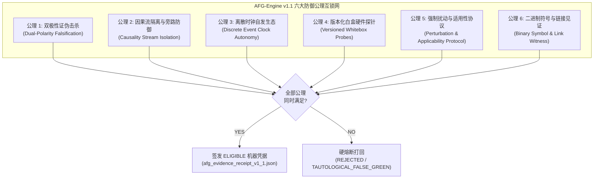
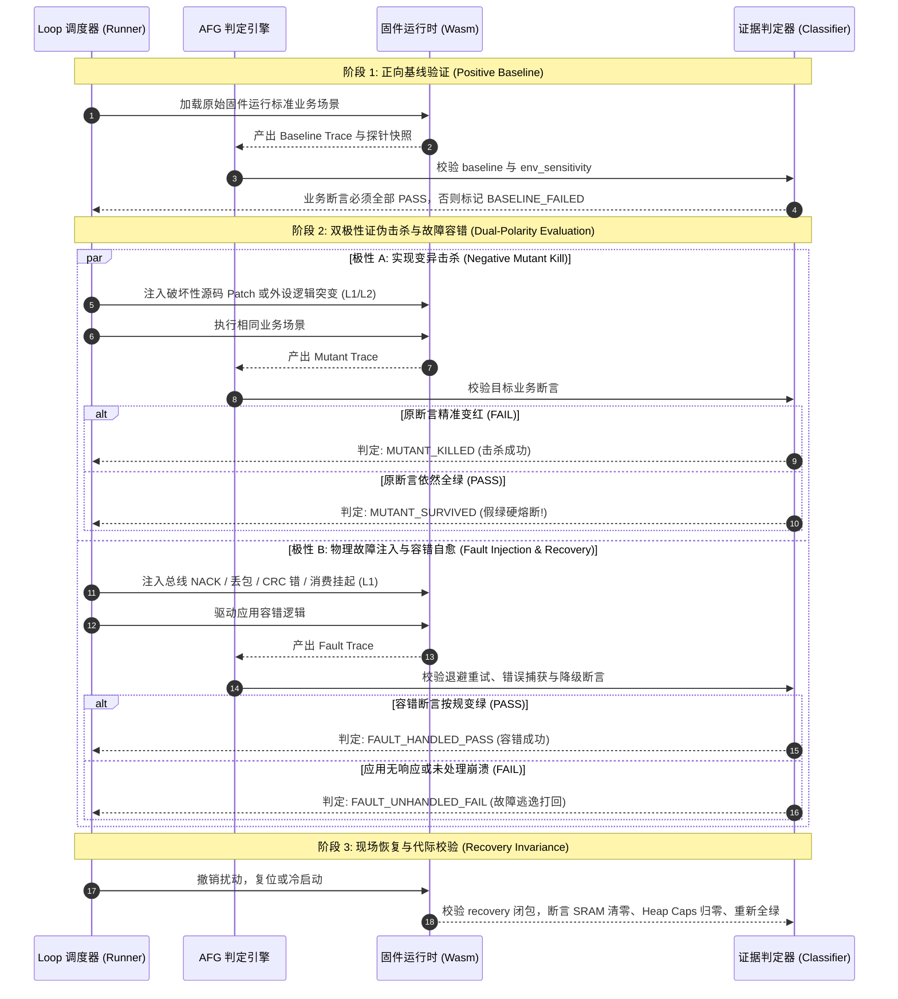

<!-- SPDX-License-Identifier: LGPL-3.0-only -->
# ESP-IDF 防假绿机器验证引擎（AFG-Engine）架构与校验契约规格

| 项 | 内容 |
|---|---|
| 设计编号 | `TECH-DESIGN-20261009-ESP-IDF-ANTI-FALSE-GREEN-ENGINE` |
| 日期 / 修订 | 2026-10-09，Asia/Shanghai；`v1.1` 架构加固与工程协同落地版 |
| 状态 | **Active / Accepted Specification**；防假绿机器判定顶层技术契约基准 |
| 关联技术设计 | [Loop 可靠性契约](esp-idf-loop-reliability-contract.md)、[Batch 0 证据契约](esp-idf-batch0-evidence-contract.md) |
| 关联整改计划 | [AFG-Engine 整改实施计划](../../implementation-plans/esp32/2026-10-09-esp-idf-afg-engine-remediation-and-implementation-plan.md)、[Checklist 与 Loop 整改计划](../../implementation-plans/esp32/2026-10-09-esp-idf-loop-issues-and-remediation-plan.md) |
| 本轮执行计划 | [防假绿全面整改与执行质量基线](../../../implementation-plans/esp32/2026-10-09-anti-false-green-total-remediation/00-MASTER-OVERVIEW.md)（v1.1 Draft；实施待确认，不改变本契约的已接受要求） |
| 关联评审文档 | [AFG 契约完整性评审](../../reviews/esp32/2026-10-09-esp-idf-afg-engine-contract-completeness-review.md)、[Checklist 深度评审](../../reviews/esp32/2026-10-08-esp-idf-verified-checklist-deep-review.md) |
| 治理依据 | [能力全景图谱字典](../../../../wink-micro-app/vendor/esp_idfv61/.governance/catalog/capability-catalog.yaml)、[分类规范](../../../../wink-micro-app/vendor/esp_idfv61/.governance/specs/CLASSIFICATION-SPEC.md)、[ADR-0001 错误码符号](../../../decisions/core/0001-error-code-sign-convention.md)、[ADR-0004 静态分发](../../../decisions/core/0004-static-dispatch-vs-runtime-ops.md)、[ADR-0012 契约诚实](../../../decisions/core/0012-contract-honesty-over-silent-degradation.md)、[ADR-0091 多配置正交](../../../decisions/unisim/0091-esp-idf-multi-config-orthogonal-schema.md)、[ADR-0092 治理宪章](../../../decisions/unisim/0092-esp-idf-simulation-governance-and-capability-charter.md) |
| 平台目标 | WebAssembly 仿真环境（Wasm-browser / Host）及 ESP-IDF v6.1 xtensa 物理硬件同源行为闭环 |

---

## 1. 架构目标与防假绿核心公理 (The 6 Axioms v1.1)

本规范旨在终结“只看脚本退出码 0 即判定通过”的虚假全绿现象，为 WinkMicroOS Loop 治理工程建立基于**机器强制反向证伪、极性正交归因与物理因果互锁**的自动化判定引擎（**Anti-False-Green Engine，简称 AFG-Engine**）。

**宿主工程环境边界与分工**：AFG 引擎作为专职的验证算法与防假绿判定内核，运行于 [Loop 可靠性契约](esp-idf-loop-reliability-contract.md) 提供的执行上下文（`RunContext`）与进程监管器（Job Object）安全沙箱之内。AFG 引擎定性为 **无副作用的纯计算核验器（Pure Verifier）**，其判定结论仅输出 `ELIGIBLE`、`REJECTED` 或 `INCOMPLETE` 并生成机器签名回执；SSOT 清单的更新与正式凭据归档完全委托给独立的 CAS 文件锁事务发布服务（`PromotionService`），杜绝引擎兼任运动员与裁判员。

### 1.1 绝对避免假绿的六大防御公理 (The 6 Axioms v1.1)



1. **公理 1（双极性证伪击杀 / Dual-Polarity Falsification）**：
   - 证明系统的健壮性必须由双极性实验共同闭环：**没有被成功击杀过的业务断言，其正向通过不具备证明力**；
   - **极性正交分离**：明确区分“实现变异”与“故障自愈”。实现变异注入旨在证明断言敏锐度，预期结果为**原业务断言精准变红（FAIL -> MUTANT_KILLED）**；外部故障注入旨在证明容错能力，预期结果为**故障降级/自愈断言精准变绿（PASS -> FAULT_HANDLED_PASS）**。严禁将故障自愈成功误判为变异存活。
2. **公理 2（因果流隔离与旁路防御 / Causality Stream Isolation）**：
   - 激励注入源（Source）与观察接收端（Sink）必须建立端到端因果依赖，**严禁测试 Fixture 绕过固件业务逻辑直接在底层做镜像短路直连**；
   - **放行合规回显**：对于合法 Echo/转发业务（如 UART Echo、CAN 转发），允许输入数据与输出数据内容相等，但因果图必须证明数据真实流经固件环形缓冲区与中断服务程序（`firmware_traversed == true`），严禁外部线缆直通自拉自唱。
3. **公理 3（离散时钟自发生态 / Discrete Event Clock Autonomy）**：
   - 硬件生产必须由离散事件调度器（DES）或宿主时钟步进器（`ISimulationClockStepper`）独立自发推进，**严禁在 Read/Getter API 中同步 pump 偷推时间伪造节拍**；
   - 废除无物理依据的固定延迟魔数，硬件动作耗时与背压容差必须由声明的外设波特率、采样率和有界缓冲区模型动态参数化驱动。
4. **公理 4（版本化白盒硬件探针 / Versioned Whitebox Probes）**：
   - 黑盒返回 `ESP_OK` 不代表硬件真实就绪，必须通过外设门面导出的白盒状态探针快照（代际 Token、Heap Caps 堆记账、FIFO 水位线、状态机 Stage）进行状态断言；
   - **探针纯只读与 ABI 版本化**：读取探针操作严禁对硬件状态机或虚拟时间产生副作用；探针结构体首两字段强制固定为 `0x0101` 版本号与 64 字节尺寸，杜绝结构体偏移错位引发虚假判定。
5. **公理 5（强制物理扰动与 N/A 适用性协议 / Physical Perturbation & Applicability Protocol）**：
   - 每一个硬件外设与通信协议能力，必须配对至少一个真实物理负向刺激（如总线 NACK、CRC 损坏、CS 断线、时钟抖动、缓冲区溢出）；
   - **引入合规 N/A 豁免机制**：纯控制台计算、基础引导（`hello_world`）或纯构建系统（`build_system`）等无物理外设绑定的业务，允许声明经过独立审计认证的 `allow_na_physical_fault` 协议与 `na_rule_id`，免除无意义的物理断线要求。
6. **公理 6（二进制符号与链接见证 / Binary Symbol & Link Witness）**：
   - 应用声明的能力必须在编译产物（Wasm/ELF）中有真实的导出/重定位符号，杜绝空标声明与幽灵能力（Phantom Capability）；
   - 兼容编译器优化，允许通过正式规范的链接见证（Link Witness）与运行时执行见证（Runtime Witness）证明内联函数（Static Inline）与 LTO 优化函数的真实调用。

---

## 2. 核心架构与模块契约

### 2.1 双极性判定流水线与四态断言矩阵

流水线执行器必须对每个候选应用执行 **三阶段双极性闭环协议**，完整驱动并核验 7 类必需检查闭包（Evidence Classes）：



#### 四态断言期望判定矩阵 (Four-State Expectation Matrix)

| 检查阶段 | 评估类型 (`evidence_class`) | 注入手段 | 目标断言类型 | 期望断言状态 | AFG 判定结论 | 晋升资格 |
|---|---|---|---|---|---|---|
| **阶段 1** | `baseline` | 无扰动标准环境 | 业务功能断言 | **PASS** | `BASELINE_OK` | 阶段通过 |
|  | `matcher_self_check` | 故意向断言喂错误数据 | 匹配器自身校验 | **PASS** (报出错误) | `MATCHER_VALID` | 阶段通过 |
|  | `env_sensitivity` | 改变外部物理参数 | 业务输出梯度断言 | **PASS** | `SENSITIVITY_MET` | 阶段通过 |
| **阶段 2 (极性 A)** | `implementation_mutation`<br/>`driver_mutation` | L2 源码补丁 / L1 驱动突变 | **原业务功能断言** | **FAIL** (合同容差内) | **`MUTANT_KILLED`** | **阶段通过** |
|  | (变异未击杀) | L2 源码补丁 | 原业务功能断言 | **PASS** (依然全绿) | **`MUTANT_SURVIVED`** | **硬熔断拒收** |
| **阶段 2 (极性 B)** | `fault_injection` | L1 总线断线 / CRC 错 | **错误处理/降级断言** | **PASS** (按合同捕获) | **`FAULT_HANDLED_PASS`** | **阶段通过** |
|  | (故障未捕获) | L1 总线断线 / CRC 错 | 错误处理/降级断言 | **FAIL** (未处理崩溃) | **`FAULT_UNHANDLED_FAIL`**| **硬熔断拒收** |
|  | `backpressure` | 挂起消费任务时间窗口 | 溢出事件与丢包断言 | **PASS** (捕获 Overrun) | **`BACKPRESSURE_VERIFIED`**| **阶段通过** |
|  | `causality_loop` | 输入与输出等值回显 | 固件缓冲区穿越探针 | **PASS** (`traversed=true`) | **`CAUSALITY_VALID`** | **阶段通过** |
| **阶段 3** | `recovery` | 撤销注入并冷重启 | 内存记账与状态机断言 | **PASS** (`leak=0`) | **`RECOVERED`** | **阶段通过** |

---

### 2.2 多域错误码契约规范 (Error Domain Taxonomy)

为彻底消灭跨 ABI 边界导致的错误码符号混淆，系统正式确立 **四大独立错误域（Taxonomy）**，严禁使用 `< 0` 或 `!= 0` 的模糊匹配：

```
┌────────────────────────────────────────────────────────────────────────┐
│                        四大类型化错误域契约体系                         │
├─────────────────────┬───────────────────┬──────────────┬───────────────┤
│ 错误域 (Domain)      │ 数据类型          │ 成功表示     │ 错误表示法则  │
├─────────────────────┼───────────────────┼──────────────┼───────────────┤
│ 1. domain: esp_err  │ uint32_t / int32  │ 0 (ESP_OK)   │ 正数表示错误  │
│                     │                   │              │ 例: ESP_ERR_TIMEOUT = 0x107 (263) │
├─────────────────────┼───────────────────┼──────────────┼───────────────┤
│ 2. domain: wink_stat│ int32_t           │ 0 (WINK_OK)  │ 负数表示错误 (ADR-0001) │
│                     │ (wink_status_t)   │              │ 例: WINK_ERR_TIMEOUT = -2        │
├─────────────────────┼───────────────────┼──────────────┼───────────────┤
│ 3. domain: posix    │ int (API 返回 -1) │ >= 0         │ 检查全局 errno (正整数)        │
│                     │                   │              │ 例: errno == ETIMEDOUT (110)      │
├─────────────────────┼───────────────────┼──────────────┼───────────────┤
│ 4. domain: nimble_hs│ int               │ 0 (BLE_HS_OK)│ NimBLE 专有正数状态码          │
│                     │                   │              │ 例: BLE_HS_EDONE = 3              │
└─────────────────────┴───────────────────┴──────────────┴───────────────┘
```

#### C 门面层转换桥接口
在 `wink-micro-os/frameworks/esp_idf/` 中提供严格的类型转换桥接函数，门面层对外返回纯正 `esp_err_t`：
```c
/* wink-micro-os/frameworks/esp_idf/include/esp_err.h */
esp_err_t wink_status_to_esp_err(wink_status_t status);
wink_status_t esp_err_to_wink_status(esp_err_t err);
```

#### YAML 断言语法类型化约束
测试用例中的错误码断言必须声明域与具体符号，由 `G/tools/loop/error_matcher.py` 进行严格类型校验：
```yaml
assert_error:
  domain: esp_err
  symbol: ESP_ERR_TIMEOUT
  raw_value: 0x107
```

---

### 2.3 契约族原型（Contract Archetypes）三阶递进继承架构

为治理 312 个示例全量展开导致的配置爆炸，AFG-Engine 正式建立统一术语定义：**将领域通用的断言、探针与故障注入规范模板统称为“契约族原型（Contract Archetype）”**。

```
.governance/archetypes/
├── archetype_start.yaml         # 原型 1: 系统启动、Banner、倒计时与热重启
├── archetype_uart_stream.yaml   # 原型 2: 双向数据流、波特率与因果回显图
├── archetype_adc_sampling.yaml  # 原型 3: 连续采样、时钟步进、动态背压与校准
├── archetype_gpio_matrix.yaml   # 原型 4: 引脚方向、高低电平跳变与滤波
└── archetype_ledc_pwm.yaml      # 原型 5: PWM 占空比定点、稳态与渐变积分
```

#### 原型继承规约
1. **差量继承声明（Diff-only Claims）**：子示例 `proofplan.json` 通过 `inherits: <archetype_id>` 继承父原型，必须显式声明 `archetype_claim_diff` 列表；
2. **非空交集守恒校验**：子示例 Claim 集合与父原型 Standard Claims 必须具备非空交集，若交集为空，解析器抛出 `ERR_ARCHETYPE_CLAIM_EMPTY_DIFF` 阻断执行；
3. **分阶递进交付体系**：
   - **Tier 1（基础外设 5 族）**：WS-4 首期交付，直接解锁 Pilot 3 项标杆；
   - **Tier 2（常用总线与存储 14 族）**：`I2C`、`SPI`、`TIMER`、`DAC`、`NVS`、`VFS`、`HTTP`、`SOCKET` 等；
   - **Tier 3（复杂无线通信与协处理器 20 族）**：`BLE`、`WIFI`、`ULP`、`MCPWM`、`PARLIO` 等。

---

### 2.4 白盒硬件探针 ABI 版本化与 Wasm C-ABI 导出

固件门面必须实现只读白盒探针接口，供测试框架直接核验内部寄存器与内存状态。结构体首两字段强制固定，严格保证二进制布局稳定性：

```c
/* wink-micro-os/frameworks/esp_idf/include/sim_probe/esp_sim_probe.h */
#pragma once
#include <stdint.h>
#include <stdbool.h>

#define WINK_SIM_PROBE_ABI_VERSION_1_1 0x0101
#define WINK_SIM_PROBE_STRUCT_SIZE_BYTES 64

#if defined(WINK_TARGET_SIMULATION) || defined(SIMULATION)

typedef struct {
    uint32_t probe_abi_version;    /* 偏移 0:  固定 0x0101 (v1.1) */
    uint32_t probe_size_bytes;     /* 偏移 4:  固定 64 字节，校验前向兼容尺寸 */
    uint32_t generation_token;     /* 偏移 8:  代际 Token，句柄销毁后置为非法值 */
    uint32_t allocated_bytes;      /* 偏移 12: Heap Caps 追踪的硬件内存记账字节 */
    uint16_t fifo_watermark;       /* 偏移 16: 硬件 FIFO / DMA 缓冲区当前水位线 */
    uint8_t  state_machine_stage;  /* 偏移 18: 状态机内部阶段枚举 */
    bool     is_hardware_busy;     /* 偏移 19: 硬件外设总线忙标志 */
    bool     in_isr_context;       /* 偏移 20: 处于模拟的中断 ISR 上下文 */
    uint8_t  power_domain_state;   /* 偏移 21: 电源域状态: 0=Active, 1=Light, 2=Deep */
    uint16_t reserved_alignment;   /* 偏移 22: 字节对齐保留字段 */
    uint32_t pending_irq_mask;     /* 偏移 24: 挂起未决的中断掩码 */
    uint64_t virtual_timestamp_us; /* 偏移 28: 当前硬件绑定的虚拟时间戳 (微秒) */
    uint32_t validity_mask;        /* 偏移 36: 字段有效性位图 (每一位代表字段有效性) */
    uint8_t  reserved_padding[24]; /* 偏移 40: 填充预留字节，对齐至总长 64 字节 */
} pal_sim_hardware_probe_t;

/* C 运行时获取探针接口 (纯只读，无时钟推进副作用) */
int pal_sim_get_probe(uint32_t domain_id, uint32_t instance_id, pal_sim_hardware_probe_t *out_probe);

/* Wasm 线性内存安全导出函数 (C-ABI) */
#if defined(__EMSCRIPTEN__)
#include <emscripten.h>
EMSCRIPTEN_KEEPALIVE uint32_t wink_sim_copy_probe(
    uint32_t domain_id,
    uint32_t instance_id,
    uint8_t *out_buffer,
    uint32_t max_len
);
#endif

#else
/* 物理真机编译 (xtensa-esp32-elf): 完全宏消除，零 Flash 与零 RAM 开销 */
typedef struct { int unused; } pal_sim_hardware_probe_t;
#define pal_sim_get_probe(d, i, p) (-1)
#endif
```

**判定引擎校验规则**：AFG 引擎在读取探针前必须校验 `probe_abi_version == 0x0101` 且 `probe_size_bytes == 64`。若版本或尺寸不匹配，立即报错 `ERR_PROBE_ABI_MISMATCH` 并硬熔断拒收。

---

### 2.5 离散时钟步进协议（DES）与参数化背压规范

彻底废除 Read-pump 模型与固定 100ms 溢出假设：

1. **时钟推进单一源头**：虚拟时钟只能由外部 Harness/Runner 显式调用 `pal_sim_step_us(delta_us)` 或由离散事件调度器（DES）事件驱动推进。任何 Getter/Read 调用、白盒探针读取或空断言严禁偷推时间；
2. **同 Tick 因果偏序（Happens-Before）**：在同一次微秒时钟步进内，配置变更、中断触发、数据入队与应用消费严格遵循因果偏序执行；
3. **动态背压容差模型**：
   - 生产速率 $R_{prod}$ 由配置的采样率（如 ADC 20kHz）或波特率（UART 115200bps）驱动；
   - 缓冲区容量 $C_{buf}$ 为有界固定深度（如 16 字节 FIFO 或 256 样本 DMA 链表）；
   - 测试切片计算理论溢出时间 $T_{overrun} = C_{buf} / R_{prod}$；消费者挂起时间必须满足 $T_{pause} > T_{overrun}$，且恢复后必须断言捕获 `BUFFER_OVERRUN` 或丢包事件。

---

### 2.6 全依赖构建沙箱与算子预算控制

#### 1. 七要素全闭包构建缓存 Key 算法
构建沙箱（`build_sandbox.py`）必须将以下 7 类要素联合计算 SHA-256，彻底杜绝修改头文件或编译器后命中陈旧 Wasm 产物的假绿漏洞：
```python
build_cache_key = hashlib.sha256(
    app_source_digest.encode()          # 1. 业务应用源码摘要
    + header_closure_digest.encode()     # 2. 依赖的所有公开/私有头文件闭包摘要
    + effective_sdkconfig_digest.encode()# 3. 最终生效的 sdkconfig 宏摘要
    + toolchain_version.encode()         # 4. 编译器版本 (如 emscripten-3.1.56)
    + facade_git_sha.encode()            # 5. 仿真门面驱动 Git 提交哈希
    + patch_content_digest.encode()      # 6. 变异补丁内容摘要
    + config_profile_id.encode()         # 7. 配置项 ID (如 standard)
).hexdigest()
```

#### 2. 双层变异与预算控制规则
- **L1 仿真级硬件扰动（优先）**：免编译、毫秒级执行，覆盖 80% 总线断线、CRC 损坏与丢包场景；
- **L2 固件源码编译变异（受控）**：针对核心逻辑分支与不变量生成 Patch，**每个 Claim 严格限制最多 1 个 L2 变异算子**，超出直接报 `ERR_L2_BUDGET_EXCEEDED` 拒收；
- **等价变异禁止自动豁免**：凡变异存活一律判定为 `MUTANT_SURVIVED` 熔断。唯一豁免通道为独立架构审计员签署的 `equivalent_mutant_witness.json`。

---

### 2.7 执行身份（ExecutionIdentity）与防伪芯片分流

AFG-Engine 将 `ExecutionIdentity` 确立为判定的首要前置输入，杜绝跨芯片外设冒充：

```python
@dataclass
class ExecutionIdentity:
    app_id: str
    config_id: str
    target_soc: str             # 声明的芯片，如 esp32, esp32s3, esp32p4
    backend: str                # wasm_browser / host_native
    sdkconfig_digest: str
    toolchain_version: str
    probe_abi_version: int      # 必须为 0x0101
    probe_size_bytes: int       # 必须为 64
    simulated_soc_or_model: Optional[str] = None
    soc_support_verified_by_kconfig: bool = False
```

#### 芯片独占外设防伪与三态分流准则（ADR-0091）
已知物理硬件独占外设表：
- `cap.bus.i3c_master`: `esp32p4`
- `cap.dma.async_crc`: `esp32p4`
- `cap.dma.async_color_convert`: `esp32p4`
- `cap.coproc.lp_core`: `esp32c6`, `esp32p4`
- `cap.net.bridge_vlan`: `esp32p4`

**分流判定**：若 `target_soc: esp32` 声明了上述独占能力，AFG-Engine 判定规则：
1. **排他独占（Hardware Exclusive）**：若无 Kconfig 宏支持且非纯软件模拟，立即输出 `IDENTITY_MISMATCH (ERR_SOC_SPOOFING)` 拒收，必须在 SSOT 中将其调度置为 `deferred` 或独立建立 `target_soc: esp32p4` 配置；
2. **Kconfig 宏支持**：通过静态解析确认包含 `IDF_TARGET_ESP32`，标注 `soc_support_verified_by_kconfig: true` 并放行；
3. **通用协议栈模拟**：仅限纯软件通用代码，必须显式登记 `simulated_soc_or_model: generic_behavioral` 并签署降级声明。

---

## 3. Capability Catalog 能力字典与 39 契约族映射全景矩阵

针对能力图谱字典，全面扩充新增原子能力并绑定对应的契约族 Archetype 原型：

| 序号 | 能力前缀 | 代表 Capability | 对应契约族 Archetype | 固有假绿漏洞机理 | 必需 Canary 变异 / 故障注入 | 必需物理白盒探针断言 |
|---|---|---|---|---|---|---|
| 1 | **`cap.core.*`** | `fiber_task`<br/>`sync_tokens`<br/>`category_heap`<br/>`hot_restart` | `archetype_start.yaml` | 协程让出掩盖锁竞争；销毁句柄继续使用；热重启保留脏静态数据 | ① 注销互斥锁后调用 `Take`；<br/>② 热重启跳过 BSS 清零 | 断言代际 Token 失效；断言 Heap Caps 归零；断言静态数据复位初值 |
| 2 | **`cap.analog.*`** | `adc_oneshot`<br/>`adc_continuous`<br/>`dac_out`<br/>`comparator_etm` | `archetype_adc_sampling.yaml` | 读取时偷推时钟；消费挂起不溢出；直连回读自拉自唱 | ① 故意清除 ADC 校准寄存器；<br/>② 挂起消费任务 $T_{pause} > T_{overrun}$ | 零旁路因果流；断言捕获 `BUFFER_OVERRUN` 或丢包；断言校准误差 |
| 3 | **`cap.pulse.*`** | `tx_buffer`<br/>`rx_capture`<br/>`pcnt_quad`<br/>`ledc_fade`<br/>`mcpwm_motor` | `archetype_ledc_pwm.yaml` | 占空比 0ms 瞬阶跃冒充渐变；正交编码器直接读变量；触摸按键未模拟 RC | ① 定时器分频改大 10 倍；<br/>② 注入 200ns RMT 毛刺；<br/>③ 交换正交相位 | 渐变必须按时钟步进切片断言斜率；反相脉冲断言计数倒扣 |
| 4 | **`cap.bus.*`** | `i2c_master`<br/>`spi_master`<br/>`uart_stream`<br/>`i3c_master` | `archetype_uart_stream.yaml`<br/>`archetype_bus_i2c.yaml` | 无限队列掩盖 FIFO 满溢；未挂载从机永远返回 OK 全零；Echo 绕过固件线缆直通 | ① 故意拉高 SPI 片选 CS 线；<br/>② 访问未注册 I2C 从机地址；<br/>③ 灌入 2 倍深度数据流 | 未注册从机断言返回 `ESP_ERR_TIMEOUT`；断言 FIFO 水位线；Echo 必须断言穿越固件缓冲区 |
| 5 | **`cap.proto.*`** | `ws2812`<br/>`nec_ir`<br/>`twai_can`<br/>`i2s_stream` | `archetype_proto_can.yaml`<br/>`archetype_proto_strip.yaml` | WS2812 未发复位码；CAN 帧未模拟仲裁与 ACK；I2S 丢弃采样不报错 | ① CAN 帧注入碰撞仲裁失败；<br/>② 裁剪 WS2812 复位低电平至 10us；<br/>③ 注入 I2S 时钟抖动 | CAN 断言自动重发与错误计数；断言 WS2812 复位电平 $\ge 50\mu s$；I2S 断言 Underflow 事件 |
| 6 | **`cap.vfs.*`** | `mem_sandbox`<br/>`nvs_partition`<br/>`spiffs_format`<br/>`fatfs_vfs` | `archetype_storage_nvs.yaml`<br/>`archetype_storage_fs.yaml` | libc 穿透宿主物理磁盘；未注入崩溃掩盖断电丢失；格式化仅置位未擦除 | ① 写入临时文件更名前注入 SIGKILL；<br/>② 破坏 Superblock 魔数；<br/>③ 破坏 Payload 尾 CRC32 | 崩溃重启断言 2PC 自愈生效；格式化断言 Inode 清零；断言宿主无未授权文件逃逸 |
| 7 | **`cap.storage.*`**| `wear_levelling`<br/>`sdmmc_host`<br/>`partition_api` | `archetype_storage_sdmmc.yaml` | 纯 RAM 冒充 Flash 忽略写 0 特性；SD 卡跳过 CMD0 协商 | ① 未经 erase 覆盖写不同数据；<br/>② 注入 SD 命令 CRC7 错 | 覆盖写断言按位与报错；SD 初始化断言协商耗时；越界写断言非法地址 |
| 8 | **`cap.net.*`** | `bsd_socket`<br/>`http_client`<br/>`mqtt_client`<br/>`sntp_client`<br/>`bridge_vlan` | `archetype_net_socket.yaml`<br/>`archetype_net_http.yaml` | Mock 盲目返回 200 OK；忽略断网重连与退避；SNTP 立即返回宿主时间 | ① 注入 TCP FIN/RST 强制闪断；<br/>② Mock 服务端返回 503 与畸形 JSON；<br/>③ 注入网络延迟 5000ms | 必须断言应用捕获 `DISCONNECTED` 并执行指数退避重连；超时断言 `ETIMEDOUT` |
| 9 | **`cap.wifi.*`** | `station_mode`<br/>`ap_mode` | `archetype_wifi_sta.yaml`<br/>`archetype_wifi_ap.yaml` | 调用 start 瞬间转为 GOT_IP；密码错误仍返回成功；未模拟 Beacon | ① 注入错误的 WPA2 握手密码；<br/>② 注入 Beacon 广播丢包率 50% | 密码错误必须断言收到 `DISCONNECTED` 且 reason=`AUTH_FAIL`；连接经历状态机时延 |
| 10 | **`cap.ble.*`** | `gap_adv`<br/>`gatt_server`<br/>`gatt_client`<br/>`smp_security` | `archetype_ble_nimble.yaml` | 广播包超 31 字节静默通过；配对无 PIN 直接授权；GATT 越权读写 | ① 注入超 31 字节 Legacy 广播包；<br/>② 注入错误 Passkey；<br/>③ 越权写只读特征 | 广播超长断言 `ESP_ERR_INVALID_SIZE`；配对错误断言 `BLE_HS_EAUTH`；越权断言权限拒绝 |
| 11 | **`cap.media.*`** | `camera_dma`<br/>`lcd_panel` | `archetype_media_display.yaml` | 相机全黑伪造成功；帧率未受 PCLK 约束；刷屏未等待 TE 同步信号 | ① 模拟传感器未响应 SCCB 探测；<br/>② 传输中途切断 VSYNC 信号 | 探测失败断言 `ESP_ERR_NOT_FOUND`；场同步提前切断断言抛出 `FRAME_TRUNCATED` |
| 12 | **`cap.dma.*`** | `memcpy_sim`<br/>`double_buffer`<br/>`async_crc` | `archetype_dma_channel.yaml` | 同步 memcpy 冒充异步 DMA；未检查描述符所有权；乒乓切换无锁覆盖 | ① 传入未对齐或非 DMA 内存指针；<br/>② 将描述符 EOF 链表置空 | 非 DMA 内存断言 `ESP_ERR_INVALID_ARG`；DMA 启动 CPU 立即非阻塞返回；断言半完成中断 |
| 13 | **`cap.coproc.*`** | `ulp_fsm`<br/>`ulp_riscv`<br/>`lp_core` | `archetype_coproc_ulp.yaml` | 主核修改内存冒充 ULP 执行；唤醒信号未走 RTC 中断路由 | ① 在 ULP 固件插入非法操作码；<br/>② 篡改 ULP 比较阈值 | 非法指令断言 ULP 暂停并置异常寄存器；阈值未达断言主核保持休眠 |
| 14 | **`cap.build.*`** | `component_reg`<br/>`kconfig_parse` | `archetype_build_system.yaml` | 声明依赖未编译；Kconfig 宏变更未触发增量重编 | ① 引入未定义依赖组件；<br/>② 修改关键驱动使能宏 | 依赖缺失断言构建报错；宏禁用断言符号被裁剪；重编产物 SHA-256 必然变化 |

---

## 4. 交付凭据规格与 SSOT CAS 事务解耦

### 4.1 机器反向击杀证据回执规格 (`afg_evidence_receipt_v1_1.json`)

每个经过 AFG-Engine 评定的候选包，根目录必须生成并签署符合以下 Schema 的机器凭据：

```json
{
  "$schema": "https://wink-micro-os.org/schemas/afg-evidence-receipt-v1.1.json",
  "schema_version": "1.1",
  "app_id": "peripherals/uart/uart_echo",
  "config_id": "standard",
  "overall_verdict": "ELIGIBLE",
  "execution_identity": {
    "app_id": "peripherals/uart/uart_echo",
    "config_id": "standard",
    "target_soc": "esp32",
    "backend": "wasm_simulation",
    "sdkconfig_digest": "sha256-4c9f...81e2",
    "toolchain_version": "emscripten-3.1.56",
    "probe_abi_version": 257,
    "probe_size_bytes": 64,
    "simulated_soc_or_model": null,
    "soc_support_verified_by_kconfig": false
  },
  "claims_evaluation": [
    {
      "claim_id": "claim.uart.echo.bidirectional_flow",
      "status": "PASSED",
      "reasons": []
    },
    {
      "claim_id": "claim.uart.echo.disable_rx_mutation_kill",
      "status": "PASSED",
      "reasons": []
    }
  ],
  "axioms_evaluation": {
    "axiom_1_dual_polarity_kill": "MET",
    "axiom_2_causality_stream_isolation": "MET",
    "axiom_3_discrete_clock_autonomy": "MET",
    "axiom_4_whitebox_probe_invariants": "MET",
    "axiom_5_physical_perturbation": "MET",
    "axiom_6_binary_symbol_witness": "MET"
  },
  "rejection_reasons": [],
  "timestamp_utc": "2026-10-09T04:06:42Z",
  "receipt_digest": "sha256-bd9144a1...c039"
}
```

### 4.2 引擎职责边界与 Promotion CAS 事务解耦

AFG-Engine 严格遵循单一职责原则，严禁直接读写正式治理资产：

```
┌─────────────────────────────────────────────────────────────┐
│ 1. AFG-Engine 判定内核 (Pure Verifier)                       │
│    输入: Evidence Package + ProofPlan + Artifacts            │
│    计算: 双极性击杀矩阵 + 探针版本 + 离散时钟 + 符号对账      │
│    输出: AFGReceipt (overall_verdict in ELIGIBLE/REJECTED/INCOMPLETE) │
│    特性: 纯内存与只读沙箱计算，无全局文件系统写副作用       │
└──────────────────────────────┬──────────────────────────────┘
                               │ 签发签名凭据 (afg_evidence_receipt_v1_1.json)
                               ▼
┌─────────────────────────────────────────────────────────────┐
│ 2. PromotionService (CAS 事务发布器)                         │
│    前置门禁: 核验 receipt.overall_verdict == "ELIGIBLE"      │
│    临界区操作:                                               │
│      ① 跨进程文件锁 (Lock Lease, TTL=30s, 带探活与自愈)       │
│      ② 读回 checklist.data.json 比对 CAS Expected Version    │
│      ③ 写入临时文件 checklist.data.json.tmp.<pid>             │
│      ④ 原子重命名替换 (os.replace) 并记录发布日志            │
│    特性: 异常崩溃自动丢弃临时文件，零脏数据污染             │
└─────────────────────────────────────────────────────────────┘
```

### 4.3 判定引擎自身双闭环元测试套件 (Meta Invariants Suite)

为兑现契约自身的防伪能力，AFG-Engine 判定代码必须通过专职的元不变性测试套件 [test_afg_engine_meta_invariants.py](../../../../wink-micro-app/vendor/esp_idfv61/.governance/gates/tests/test_afg_engine_meta_invariants.py)：

1. **负向反例套件（META-01 ~ META-26，必须 100% 拦截拒收）**：
   - `META-01`：空断言或无 Claim -> 输出 `INCOMPLETE`；
   - `META-02`：仅控制台正则匹配而无领域状态断言 -> 报 `LOG_ONLY_ASSERTION` 拒收；
   - `META-03`：变异代码分支未触达 -> 报 `MUTATION_NOT_ACTIVATED` 拒收；
   - `META-04`：变异存活全绿 -> 报 `MUTANT_SURVIVED` 熔断拒收；
   - `META-05`：故障未捕获或异常崩溃 -> 报 `FAULT_UNHANDLED_FAIL` 拒收；
   - `META-06`：零耗时跳跃 -> 报 `ZERO_TIME_PROGRESSION` 拒收；
   - `META-07/08`：跨域错误码符号混淆 -> 报 `ERROR_DOMAIN_MISMATCH` 拒收；
   - `META-09`：Echo 回显未穿越固件缓冲区 -> 报 `CAUSALITY_VIOLATION` 拒收；
   - `META-10/11`：探针 ABI 版本非 0x0101 或尺寸非 64 字节 -> 报 `ERR_PROBE_ABI_MISMATCH` 拒收；
   - `META-12`：构建产物哈希篡改 -> 报 `ARTIFACT_HASH_MISMATCH` 拒收；
   - `META-15/16`：原型继承缺少差量声明或交集为空 -> 报 `ERR_ARCHETYPE_CLAIM_EMPTY_DIFF` 拒收；
   - `META-17`：L2 源码变异超出预算 1 -> 报 `ERR_L2_BUDGET_EXCEEDED` 拒收；
   - `META-18`：挂起消费未发生 Overrun -> 报 `BACKPRESSURE_VIOLATION` 拒收；
   - `META-19`：冷重启残留脏状态 -> 报 `RECOVERY_INVARIANT_VIOLATION` 拒收；
   - `META-22`：滥用 N/A 豁免协议未填规则 ID -> 报 `INVALID_NA_PROTOCOL` 拒收；
   - `META-23`：变异引发编译链接报错冒充击杀 -> 报 `MUTATION_BUILD_FAILED` 拒收；
   - `META-25`：SoC 芯片身份冒用（P4 独占外设打 esp32 标签） -> 报 `IDENTITY_MISMATCH` 拒收；
   - `META-26`：工具链版本漂移命中旧产物 -> 构建缓存 Key 强制失效触发重建。
2. **黄金正例套件（META-POS-01 ~ META-POS-05，必须 100% 签发 ELIGIBLE）**：
   - 验证标准基线 PASS + 变异精准击杀 + 故障依规自愈 + 探针正常 + 签名完整时，引擎稳定输出 `ELIGIBLE`，证明判定器无无条件拒绝死锁。

### 4.4 审计拒绝与硬熔断条件

在自动化 Gate 与独立架构审计时，出现以下任一情形，一律以 `REJECT: TAUTOLOGICAL_FALSE_GREEN` 阻断发布：

1. **变异存活（Mutant Survived）**：注入破坏性补丁后原业务目标断言依然全部保持 PASS；
2. **故障逃逸（Fault Unhandled）**：注入网络闪断或 CRC 损坏后，固件未进入退避/降级模式直接挂死；
3. **因果旁路（Bypassed Fixture）**：场景脚本在 Fixture 内部直连跳过固件缓冲区自拉自唱；
4. **探针失配（Probe ABI Mismatch）**：探针版本不等于 `0x0101` 或结构体尺寸不等于 64 字节；
5. **身份欺骗（SoC Spoofing）**：声明了芯片独占外设但在不支持的目标芯片下伪造测试通过；
6. **时延造假（Zero-Time Jump）**：流式采集、渐变脉冲或网络握手耗时为 0；
7. **幽灵能力（Phantom Capability）**：声明了 Capability 但在构建产物中找不到符号或有效链接见证；
8. **预算超标（Budget Exceeded）**：单个 Claim 触发了超过 1 个 L2 源码变异。

### 4.5 终结口头声明与默认贴标

SSOT 中的 `delivery_state` 只能由 `PromotionService` 校验本引擎输出的 `ELIGIBLE` 凭据后驱动更新。严禁任何人为主观干预、脚本默认贴标或“根据历史相似度推断通过”。没有包含变异反向击杀证明与版本化探针的凭据，一律视为未经验证（Unverified）。
