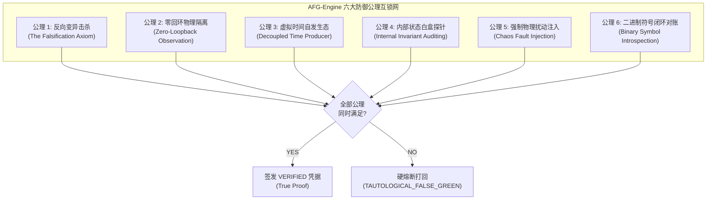
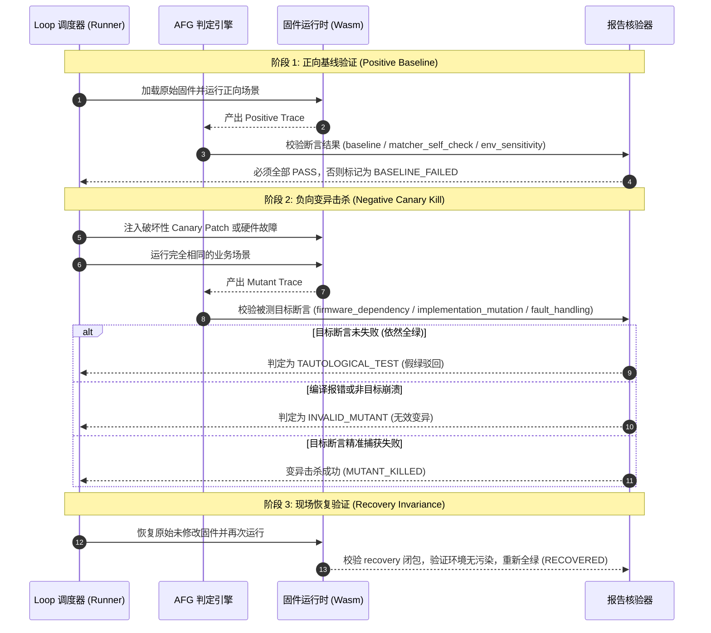
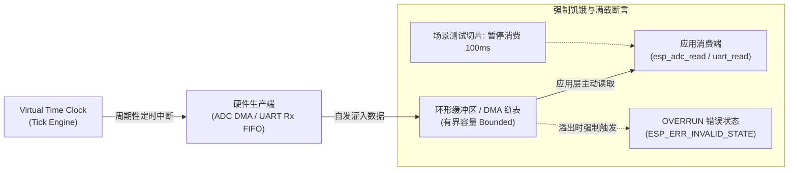

<!-- SPDX-License-Identifier: LGPL-3.0-only -->
# ESP-IDF 防假绿机器验证引擎（AFG-Engine）架构与校验契约规格

| 项 | 内容 |
|---|---|
| 设计编号 | `TECH-DESIGN-20261009-ESP-IDF-ANTI-FALSE-GREEN-ENGINE` |
| 日期 / 修订 | 2026-10-09，Asia/Shanghai；`v1.0` |
| 状态 | **Active / Proposed Specification**；防假绿机器判定顶层技术契约基准 |
| 关联合同与计划 | [Loop 可靠性契约](esp-idf-loop-reliability-contract.md)、[Batch 0 证据契约](esp-idf-batch0-evidence-contract.md)、[Checklist 与 Loop 整改计划](../../../implementation-plans/esp32/2026-10-09-esp-idf-loop-issues-and-remediation-plan.md) |
| 治理依据 | [能力全景图谱字典](../../../../wink-micro-app/vendor/esp_idfv61/.governance/catalog/capability-catalog.yaml)、[分类规范](../../../../wink-micro-app/vendor/esp_idfv61/.governance/specs/CLASSIFICATION-SPEC.md)、[ADR-0012 契约诚实](../../../decisions/core/0012-contract-honesty-over-silent-degradation.md)、[ADR-0092 治理宪章](../../../decisions/unisim/0092-esp-idf-simulation-governance-and-capability-charter.md) |
| 平台目标 | WebAssembly 仿真环境（Wasm-browser / Host）及 ESP-IDF v6.1 xtensa 物理硬件同源行为闭环 |

---

## 1. 架构目标与防假绿核心公理

本规范旨在终结“只看脚本退出码 0 即判定通过”的虚假全绿现象，为 WinkMicroOS Loop 治理工程建立基于**机器强制反向证伪与物理因果互锁**的自动化判定引擎（**Anti-False-Green Engine，简称 AFG-Engine**）。

**宿主工程环境边界与分工**：AFG 引擎作为专职的验证算法与防假绿判定内核，运行于 [Loop 可靠性契约](esp-idf-loop-reliability-contract.md) 提供的执行上下文（`RunContext`）与进程监管器（Job Object）安全沙箱之内。本契约不涉及宿主 OS 进程分配、文件锁与 CAS 发布，专职裁决固件与仿真行为的真实性。

### 1.1 绝对避免假绿的六大防御公理 (The 6 Axioms)



1. **公理 1（反向变异击杀）**：没有被成功击杀过的断言，其正向通过不具备证明力。必须证明移除或破坏功能时测试可靠变红。
2. **公理 2（零回环物理隔离）**：激励注入源（Source）与观察接收端（Sink）物理隔离，严禁断言直接回读输入通道数据。
3. **公理 3（虚拟时间自发生态）**：硬件生产必须由虚拟时钟独立自发推进，严禁在 Read/Getter API 中同步 pump 伪造节拍。
4. **公理 4（内部状态白盒探针）**：黑盒返回 `ESP_OK` 不代表成功，必须通过内部寄存器、代际 Token、内存记账（Heap Caps）与状态机阶段断言。
5. **公理 5（强制物理扰动注入）**：每个功能能力必须配对至少一个真实物理负向刺激（如断线、丢包、CRC 损坏、断电）。
6. **公理 6（二进制符号闭环对账）**：声明的能力必须在编译产物（Wasm/ELF）中有真实的导出/调用符号，杜绝空标声明。

---

## 2. 核心架构与模块契约

### 2.1 双极性强制证伪流水线 (Dual-Polarity Pipeline)

流水线执行器必须对每个候选应用执行 **三阶段双极性闭环协议**，完整驱动并收集 ProofPlan 中定义的 **7 类必需检查闭包**：



#### 2.1.1 ProofPlan 7 类必需检查闭包与流水线映射

AFG 引擎执行时，必须严格将上层输入 `proofplan.json` 的 7 类检查闭包映射至双极性三阶段流水线，缺一不可：

| 流水线阶段 | 绑定的必需检查闭包 (Evidence Class) | 验证目标与判定条件 | 失败处理策略 |
|---|---|---|---|
| **阶段 1：正向基线** | 1. `baseline` | 原始固件在标准场景下全绿运行 | 直接标记 `BASELINE_FAILED` 终止 |
|  | 2. `matcher_self_check` | 故意向断言器喂入错误数据，验证断言器自身未退化为恒真桩 | 判定为断言器失效，硬熔断打回 |
|  | 3. `env_sensitivity` | 调整外部环境激励参数，断言业务输出产生预期的相应物理变化 | 判定为假绿稳态，硬熔断打回 |
| **阶段 2：负向击杀** | 4. `firmware_dependency` | 停用底层固件使能（如关闭外设使能宏），断言目标业务可靠报错 | 判定为桩代码假绿，硬熔断打回 |
|  | 5. `implementation_mutation` | 注入 Canary 变异算子，断言目标业务在容差窗口内精准失败 | 判定为 `MUTANT_SURVIVED` 假绿熔断 |
|  | 6. `fault_handling` | 注入混沌物理故障（如断线、丢包），断言固件按预期降级或自愈 | 判定为未处理异常，硬熔断打回 |
| **阶段 3：现场恢复** | 7. `recovery` | 撤销所有扰动，重启或复原后断言系统无内存泄漏且重新转绿 | 判定为状态污染，标记 `LEAK_FAILED` |

#### 2.1.2 击杀判定矩阵 (Kill Classification Matrix)

| 变异执行现象 | 目标业务断言 | 系统基础设施状态 | 判定结论 | 是否允许晋升 |
|---|---|---|---|---|
| 预期业务失败 | **FAIL** (在合同容差窗口内) | 正常运行至断言点 | **MUTANT_KILLED (击杀成功)** | **YES (通过本阶段)** |
| 依然全绿 | **PASS** | 正常运行 | **MUTANT_SURVIVED (假绿熔断)** | **NO (硬拒收)** |
| 编译/链接报错 | 未触达 | 编译器直接退出 1 | **BUILD_REJECTED (无效变异)** | **NO (需更换算子)** |
| 非目标提前崩溃 | 未触达 | 段错误 / 内存越界 | **COLLATERAL_CRASH (意外崩溃)** | **NO (不计为业务击杀)** |
| 执行超时挂死 | 未触达 | 超出时限强杀 | **TIMEOUT_DEADLOCK (挂死)** | **NO (算子设计缺陷)** |

---

### 2.2 静态反回环与物理时延检测器 (Anti-Loopback & Pin Causality Detector)

报告校验器 [report_contract.py](../../../../wink-micro-app/vendor/esp_idfv61/.governance/gates/report_contract.py) 必须前置运行两项物理真实性静态与动态检查：

#### 1. 静态 AST 数据流防回环规则 (Static Anti-Loopback Rule)
校验器在读取场景脚本时，构建引脚/通道拓扑图：
- **回环检测规则**：凡是在步骤 $S_i$ 中声明 `INPUT_ANALOG(channel=C, voltage=V)` 或 `INPUT_GPIO(pin=P, level=L)`，并且在步骤 $S_{i+k}$ 中断言相同通道 `ASSERT_EQUAL(channel=C, expected=V)`，系统自动检查底层外设连线拓扑；
- **判定**：若该通道未显式配置物理级外部回环设备（如电阻分压环回模型），且直接镜像输入数值，系统直接标记 `VIOLATION_SELF_ECHO`，拒绝执行。

#### 2. 物理时延因果下限规则 (Minimum Physical Delay Rule)
在虚拟时钟中，硬件动作必须消耗非零的物理时间步长：
- **DAC / ADC 采样**：每次采样转换耗时 $T_{conv} \ge \frac{1}{f_{sample}}$（例如 20kHz 连续采样，每帧产生时延必 $\ge 50\mu s$）；
- **PWM / LEDC 渐变**：渐变耗时 $T_{fade}$ 必须满足 $T_{fade} \ge \text{target\_time} \times (1 - \text{margin})$，严禁在 $0\mu s$ 内完成多阶占空比跳跃；
- **Flash / NVS 擦写**：扇区擦除耗时 $\ge 10ms$，写入耗时 $\ge 100\mu s$。凡在同一微秒 Tick 内完成大块 Flash 写入的，判定为未经时延模拟的虚假内存桩。

---

### 2.3 能力图谱与二进制 ABI 符号硬对账 (Capability-to-Binary Symbol Enforcer)

建立独立的二进制符号门禁工具 `.governance/tools/check_capability_symbols.py`，与 [capability-catalog.yaml](../../../../wink-micro-app/vendor/esp_idfv61/.governance/catalog/capability-catalog.yaml) 进行机器互锁：

```text
                               ABI 符号闭环验证流
┌─────────────────────────┐        ┌─────────────────────────┐
│ capability-catalog.yaml │        │  firmware.wasm / .elf   │
│ (声明 capabilities 集合) │        │   (构建生成的最终二进制) │
└────────────┬────────────┘        └────────────┬────────────┘
             │                                  │
             ▼                                  ▼
      [解析 owned_paths]                [wasm-objdump / readelf]
      提取必需 C ABI 符号集合            提取 Export & Reloc 符号表
             │                                  │
             └────────────────► ◄───────────────┘
                                │
                                ▼
                       [集合包含性严格校验]
          (Declared Symbols ⊆ Binary Active Symbols)
```

**判定规则**：
1. 若应用声明了某能力（如 `cap.pulse.ledc_fade`），但在导出的符号表与重定位表中未出现 `ledc_set_fade_with_time` 或其依赖符号，门禁立即报错：`ERR_PHANTOM_CAPABILITY_DECLARED`；
2. 若构建参数开启了 `--gc-sections` 且某驱动符号被完全剥离，说明该应用业务源码未曾真实调用该驱动，SSOT 中对应的能力声明必须被标记为冗余并剔除（收敛 Q-05 错配问题）。

---

### 2.4 固件白盒状态探针规范 (Whitebox State Probes Protocol)

C 运行时门面必须统一实现只读白盒探针接口，供测试框架直接核验硬件内部状态，防止黑盒仅凭 `ESP_OK` 假绿：

```c
/* wink-micro-os/pal/include/pal_sim_probe.h */
#pragma once
#include <stdint.h>
#include <stdbool.h>

#ifdef SIMULATION
typedef struct {
    uint32_t generation_token;     /* 当前代际 Token，销毁或句柄失效后变为 0 或非法值 */
    uint32_t allocated_bytes;      /* 真实硬件内存分配记账字节数 (Heap Caps 追踪) */
    uint16_t fifo_watermark;       /* 硬件 FIFO / 环形缓冲区当前水位线 */
    uint8_t  state_machine_stage;  /* 状态机内部 Stage 阶段枚举 */
    bool     is_hardware_busy;     /* 硬件总线或硬件加速器是否处于忙状态 */
    bool     in_isr_context;       /* 当前是否处于模拟的中断 ISR 上下文 */
    uint8_t  power_domain_state;   /* 电源域状态: 0=Active, 1=LightSleep, 2=DeepSleep, 3=Gated */
    uint32_t pending_irq_mask;     /* 当前挂起且未决的中断掩码 */
} pal_sim_hardware_probe_t;

/* 由各门面驱动实现的只读状态探针 */
int pal_sim_get_probe(uint32_t handle, pal_sim_hardware_probe_t *out_probe);
#endif
```

测试断言必须包含对 `pal_sim_get_probe()` 的直接断言，严禁将成功判定建立在应用层 `printf()` 日志或黑盒返回值的表面现象上。

---

### 2.5 虚拟时间自发异步生产与背压测试规范 (Autonomous Virtual-Time Producer)

彻底废除 Read-pump 模型，所有涉及流式和连续硬件采集的外设必须遵守 **自发时钟事件总线规范**：



**背压与溢出强制测试标准**：
- 场景测试必须包含一段**“消费者人为延迟/挂起”**的时间窗口；
- 在此窗口内，底层由于缺乏读取，环形缓冲区必须在预定时刻填满，并可靠触发 `BUFFER_OVERRUN` 错误事件；
- 恢复读取后，驱动必须能够清空错误标志并继续接收。凡无法触发溢出的驱动，直接认定为伪造的同步桩。

---

### 2.6 混沌物理故障注入协议 (Chaos Fault Injection Protocol)

为兑现公理 5（强制物理扰动注入），AFG 引擎提供标准化的非侵入式故障注入管道：

```text
                     故障注入与自愈协议生命周期
 ┌────────────────┐      ┌────────────────┐      ┌────────────────┐
 │  1. 正向稳态    │ ───► │  2. 故障注入    │ ───► │  3. 自愈恢复    │
 │ (Normal State) │      │ (Chaos Fault)  │      │ (Auto Recovery)│
 └────────────────┘      └────────────────┘      └────────────────┘
   断言正常业务链路         断言捕获特定错误码       断言无污染重新转绿
                           断言进入退避/降级模式     断言代际与状态机复位
```

1. **瞬态扰动（Transient Fault）**：包括总线 NACK、CRC 误码、TCP 丢包、电平抖动。系统断言应用层重试机制或错误计数器递增；
2. **硬性故障（Permanent/Fatal Fault）**：包括引脚短路、未注册从机寻址、断电崩溃。系统断言硬件驱动返回合同约定的负错误码（如 `ESP_ERR_TIMEOUT`）或触发 2PC 启动自愈；
3. **恢复不变性（Recovery Invariance）**：故障解除后，系统必须能清除错误状态，回归正常通信，证明资源无泄漏且未锁死。

---

### 2.7 变异算子分层编码体系与等价变异裁定协议 (Operator Taxonomy & Equivalent Mutant Protocol)

#### 1. 变异算子统一编码分层体系 (Taxonomy)

为保证全生命周期算子可追溯且杜绝编译爆炸，AFG-Engine 算子库分为两层并遵循严格命名法：

- **L1 仿真级硬件扰动算子 (`L1-OP-<DOMAIN>-<NAME>`)**：
  - 特征：免编译、通过仿真总线/引脚直接注入（毫秒级执行）；
  - 命名格式：`L1-OP-<DOMAIN>-<ACTION>`（例如 `L1-OP-BUS-SPI-DISCONNECT-CS`、`L1-OP-ANALOG-ADC-CLEAR-CAL`、`L1-OP-NET-TCP-RST-INJECT`）；
  - 用途：优先用于协议、总线、模拟量等外部硬件场景的物理扰动与负向证伪。
- **L2 固件源码编译变异算子 (`L2-OP-<DOMAIN>-<NAME>`)**：
  - 特征：针对 C 源码逻辑、分支与不变量生成 Patch，触发 Wasm 重新编译；
  - 命名格式：`L2-OP-<DOMAIN>-<TARGET>`（例如 `L2-OP-CORE-MUTEX-DISABLE`、`L2-OP-PULSE-LEDC-PERIOD-DOUBLE`、`L2-OP-STORAGE-NVS-CRC-CORRUPT`）；
  - 预算控制：**每个 Claim 严格限制最多 2 个 L2 变异算子**，且以 `(source_sha256, patch_sha256)` 为键进行 Wasm 构建缓存。

#### 2. 等价变异 (Equivalent Mutant) 严苛防假绿协议

在突变测试（Mutation Testing）中，部分代码改动可能在外部行为上“恰好等价”而不引发断言失败：

1. **机器禁止自动豁免**：AFG 判定引擎在执行变异后，凡目标断言保持 `PASS`（变异存活），**机器一律判定为 `MUTANT_SURVIVED` 并执行硬熔断拒收**。严禁在工具脚本中设置“忽略存活变异”的默认白名单；
2. **唯一特许人工裁决通道**：
   - 若测试编写者主张某存活变异属于“理论上的等价变异”，测试者必须向证据包提交 **形式化语义见证报告 (`equivalent_mutant_witness.json`)**，详细阐述代码语义数学等价性证明；
   - 该见证报告必须由**具有独立授权的架构审计员（Independent Auditor）**在 `audit-decision.json` 中明确签署并背书，方可特许放行。任何未经独立审计签字的“等价变异”一律视为假绿漏洞。

---

## 3. Capability Catalog 二十大能力字典防假绿落地全景矩阵

针对 [capability-catalog.yaml](../../../../wink-micro-app/vendor/esp_idfv61/.governance/catalog/capability-catalog.yaml) 中定义的全部 20 个能力字典前缀（63 项全量能力），执行以下逐项**固有假绿漏洞机理、Canary 击杀算子、物理/白盒断言与 ABI 符号对账规则**，杜绝任何能力维度的漏网假绿：

| 序号 | 能力字典 | 代表 Capability | 固有假绿漏洞机理 (Pitfalls) | 必需 Canary 变异注入 (公理 1 / 5) | 必需物理/白盒断言 (公理 2~4) | 必需 ABI 符号闭环 (公理 6) |
|---|---|---|---|---|---|---|
| 1 | **`cap.core.*`** | `fiber_task`<br/>`sync_tokens`<br/>`category_heap`<br/>`hot_restart` | 单线程协程协作让出掩盖锁竞态；信号量重复释放未报错；已销毁句柄使用未 panic；重启保留脏静态变量 | ① 故意注销互斥锁后调用 `Take`；<br/>② 临界区内注入延迟打乱让出时序；<br/>③ 模块热重启跳过 BSS 内存清零 | 断言代际 Token 失效；断言分类堆记账在释放后严格归零；断言重启后静态变量恢复初值 | `xTaskCreatePinnedToCore`<br/>`xSemaphoreCreateMutexStatic`<br/>`heap_caps_malloc`<br/>`esp_restart` |
| 2 | **`cap.analog.*`** | `adc_oneshot`<br/>`adc_dma`<br/>`dac_out` | 输入通道与回读通道直连（自拉自唱）；`read()` 同步 pump 伪造时钟节拍；底层失败填充常数 `1000+i*10` | ① ADC 校准寄存器故意清零；<br/>② 外部 DAC 负载电阻接地短路；<br/>③ 应用挂起暂停消费 100ms | 零回环物理隔离；转换时延 $T_{conv} \ge 1/f_{sample}$；消费暂停必须触发 DMA Overrun；未使能引脚断言 0V | `adc_oneshot_read`<br/>`adc_continuous_read`<br/>`dac_oneshot_output_voltage` |
| 3 | **`cap.pulse.*`** | `tx_buffer`<br/>`rx_capture`<br/>`pcnt_quad`<br/>`ledc_fade`<br/>`mcpwm_motor`<br/>`touch_pad` | 占空比 0ms 瞬阶跃冒充渐变；WS2812 仅数 pulse 数量不验纳秒脉宽；正交编码器直接读变量；触摸按键未模拟 RC 充放电 | ① 定时器时钟源分频改大 10 倍；<br/>② 注入 200ns 的 RMT 毛刺脉冲；<br/>③ 交换正交编码器 A/B 脉冲相位 | 渐变必须在 25%/50%/75% 切片断言占空比斜率；微秒波形积分器比对高低电平时间；反相脉冲断言计数倒扣 | `rmt_transmit`<br/>`ledc_set_fade_with_time`<br/>`pcnt_unit_get_count`<br/>`mcpwm_set_duty` |
| 4 | **`cap.bus.*`** | `i2c_master`<br/>`spi_master`<br/>`uart_stream`<br/>`temp_sensor`<br/>`parlio` | 通用 SPI 门面硬编码特定 EEPROM；无限内存队列掩盖 FIFO 满溢；未挂载从机总线永远返回 OK 且读数全 0 | ① 故意拉高 SPI 片选 CS 线（断线）；<br/>② I2C 改写为未注册从机地址；<br/>③ 灌入 2 倍于 FIFO 深度的数据流 | 未注册从机必须断言 `ESP_ERR_TIMEOUT` 或 NACK；断言 FIFO 水位线；超载断言硬件流控 RTS 拉高或丢帧 | `spi_device_transmit`<br/>`i2c_master_write_read_device`<br/>`uart_read_bytes`<br/>`temperature_sensor_get_celsius` |
| 5 | **`cap.proto.*`** | `ws2812`<br/>`nec_ir`<br/>`twai_can`<br/>`i2s_stream` | WS2812 数组写完即返回成功，未发复位码；CAN 帧未模拟仲裁与 ACK；I2S 丢弃采样点不报错 | ① CAN 帧 ID 注入碰撞仲裁失败；<br/>② 裁剪 WS2812 复位码至 10us；<br/>③ 注入 I2S BCLK 时钟抖动 | CAN 仲裁失败断言自动重发与错误计数；断言 WS2812 复位低电平 $\ge 50\mu s$；I2S 消费不足断言 Underflow | `led_strip_set_pixel`<br/>`twai_transmit`<br/>`twai_receive`<br/>`i2s_channel_write` |
| 6 | **`cap.vfs.*`** | `mem_sandbox`<br/>`nvs_partition`<br/>`spiffs_format`<br/>`fatfs_vfs` | libc `fopen` 穿透宿主物理磁盘；单次读写未注入崩溃掩盖断电丢失；格式化仅置标志位未清空数据 | ① 写入临时文件后、更名前注入 `SIGKILL`；<br/>② 故意破坏分区 Superblock 魔数；<br/>③ 破坏 Payload 尾部 CRC32 | 崩溃重启断言 2PC 自愈状态机生效；格式化后断言原文件打不开且 Inode 归零；断言宿主无逃逸文件 | `nvs_commit`<br/>`esp_vfs_spiffs_register`<br/>`esp_vfs_fat_spiflash_mount` |
| 7 | **`cap.storage.*`** | `wear_levelling`<br/>`sdmmc_host`<br/>`partition_api` | 以纯 RAM 数组冒充 Flash 扇区擦除（忽略未擦除写 0 物理特性）；SD 卡跳过 CMD0 协商直接读写 | ① 未经 erase 直接覆盖写不同数据；<br/>② 注入 SD 卡命令 CRC7 校验错；<br/>③ 访问超出分区范围的物理扇区 | 覆盖写必须断言按位与（Bitwise AND）或报错；SD 初始化必须断言完整协商时延（$\ge 10ms$）；越界断言非法地址 | `esp_partition_erase_range`<br/>`esp_partition_write`<br/>`sdmmc_card_init` |
| 8 | **`cap.net.*`** | `event_pump`<br/>`http_client_mock`<br/>`mqtt_client_mock`<br/>`http_server`<br/>`bsd_socket`<br/>`sntp_client`<br/>`host_socket`<br/>`host_ws_tunnel` | Mock 客户端盲目返回 200 OK 或 CONNECTED；忽略断网重连与 TCP 拥塞；SNTP 立即返回宿主时间 | ① 注入 TCP FIN/RST 强制闪断；<br/>② Mock 服务端返回 503 与畸形 JSON；<br/>③ 注入网络延迟突增至 5000ms | 必须断言应用捕获 `DISCONNECTED` 并执行指数退避重连；超时断言 `ETIMEDOUT`；SNTP 断言状态机逐步推进 | `esp_http_client_perform`<br/>`esp_mqtt_client_start`<br/>`socket`<br/>`send`<br/>`recv`<br/>`esp_sntp_init` |
| 9 | **`cap.wifi.*`** | `station_mode`<br/>`ap_mode` | 调用 `esp_wifi_start()` 瞬间转为 `GOT_IP`；密码错误仍返回连接成功；未模拟扫描与 Beacon 帧 | ① 注入错误的 WPA2 握手密码；<br/>② 注入 AP 广播 Beacon 帧丢失；<br/>③ 注入无线信道丢包率 50% | 错误密码必须断言收到 `DISCONNECTED` 且 reason=`AUTH_FAIL`；连接过程必须经历状态机时延（$\ge 500ms$） | `esp_wifi_init`<br/>`esp_wifi_set_mode`<br/>`esp_wifi_connect`<br/>`esp_wifi_start` |
| 10 | **`cap.mesh.*`** | `esp_now` | 无连接通信默认对端 100% 收到；广播报文无时延无冲突；未模拟对端 ACK 机制 | ① 将对端 Peer MAC 设为未注册地址；<br/>② 注入无线信道碰撞（ACK 丢失） | 未注册 Peer 发送断言 `ESP_ERR_ESPNOW_NOT_FOUND`；丢包场景断言发送回调返回 `ESP_NOW_SEND_FAIL` | `esp_now_init`<br/>`esp_now_add_peer`<br/>`esp_now_send`<br/>`esp_now_register_send_cb` |
| 11 | **`cap.ble.*`** | `gap_adv`<br/>`gatt_server`<br/>`gatt_client`<br/>`smp_security` | 广播包超 31 字节仍静默通过；配对过程无需 PIN 码直接授权；GATT 读写无权限鉴权 | ① 注入超 31 字节的 Legacy 广播包；<br/>② 注入错误的配对 Passkey；<br/>③ 尝试越权写入只读 Characteristic | 广播超长必须断言 `ESP_ERR_INVALID_SIZE`；配对错误断言 `ESP_GATT_AUTH_FAIL`；越权写入断言权限拒绝 | `esp_ble_gap_start_advertising`<br/>`esp_ble_gatts_create_service`<br/>`esp_ble_gatts_send_response` |
| 12 | **`cap.pm.*`** | `light_sleep`<br/>`deep_sleep`<br/>`dynamic_freq` | 休眠退化为 `sleep(0)` 且外设时钟未关断；深度休眠后 RAM 数据未丢失；调频未改变外设 APB 波特率 | ① 配置普通 GPIO 作为唯一 RTC 唤醒源；<br/>② 调频后不更新 UART 波特率分频器；<br/>③ 注入唤醒超时故障 | 深度休眠唤醒断言 `RTC_DATA_ATTR` 保留而普通 SRAM 清零；断言唤醒原因枚举精准匹配；UART 波形时序按频率缩放 | `esp_light_sleep_start`<br/>`esp_deep_sleep_start`<br/>`esp_pm_configure`<br/>`esp_sleep_get_wakeup_cause` |
| 13 | **`cap.crypto.*`** | `mbedtls_shim`<br/>`hw_sha_aes` | 硬件加速器直接转发至纯软件空操作；加密密文与明文相同；IV 向量重用未报错 | ① 输入明文翻转 1 个比特；<br/>② 注入错误的 AES 密钥长度；<br/>③ 破坏 SHA 哈希上下文状态 | 翻转 1 比特后断言密文发生雪崩效应（差异度 $\ge 40\%$）；比对标准 NIST 向量；断言硬件加速器忙标志 | `mbedtls_aes_crypt_cbc`<br/>`mbedtls_sha256_finish`<br/>`esp_aes_crypt_cbc` |
| 14 | **`cap.system.*`** | `console_cmd`<br/>`ota_update`<br/>`app_trace` | OTA 镜像签名错误仍允许写入引导区；控制台输入任意命令均返回 OK；回滚标记未写入分区 | ① 破坏 OTA 固件头部校验和或魔数；<br/>② 向控制台输入非法未知参数；<br/>③ 模拟新固件启动崩溃 | 固件头破坏断言 `esp_ota_end()` 报错；启动崩溃断言引导加载器自动回滚到原运行分区（`otadata` 状态机回跳） | `esp_ota_begin`<br/>`esp_ota_write`<br/>`esp_ota_set_boot_partition`<br/>`esp_console_run` |
| 15 | **`cap.usb.*`** | `cdc_acm`<br/>`serial_jtag` | 无视 USB 枚举与端点握手状态直接读写；端点缓冲区满溢静默丢包 | ① 拔除虚拟 USB 连接（D+/D- 悬空）；<br/>② 注入端点 STALL 状态；<br/>③ 发送未定义端点描述符请求 | 断开连接必须断言写操作阻塞或报错；STALL 注入断言清除前无法收发；枚举过程断言经历 DEFAULT->CONFIGURED | `tinyusb_cdcacm_write_queue`<br/>`tinyusb_cdcacm_read_queue`<br/>`usb_serial_jtag_read_bytes` |
| 16 | **`cap.coproc.*`** | `ulp_fsm`<br/>`ulp_riscv` | ULP 程序未真实执行，主核修改共享内存冒充 ULP 运行；唤醒主核信号未走 RTC 中断路由 | ① 在 ULP 固件中插入未定义操作码；<br/>② 篡改 ULP 唤醒主核的比较阈值 | 非法指令断言 ULP 暂停并置位异常寄存器；断言主核休眠期维持 RTC 慢速时钟；阈值未达断言主核绝不唤醒 | `ulp_load_binary`<br/>`ulp_run`<br/>`ulp_set_wakeup_period` |
| 17 | **`cap.media.*`** | `camera_dma` | 相机采集返回全黑（0x00）伪造成功；帧率未受像素时钟 PCLK 约束；DMA 描述符链表未闭环 | ① 模拟传感器未响应 SCCB 探测；<br/>② 一帧传输中途提前切断 VSYNC 信号 | SCCB 探测失败断言驱动报错 `ESP_ERR_NOT_FOUND`；场同步提前切断断言抛出 `FRAME_TRUNCATED`；帧时延 $T \ge 1/\text{fps}$ | `esp_camera_init`<br/>`esp_camera_fb_get`<br/>`esp_camera_fb_return` |
| 18 | **`cap.dma.*`** | `memcpy_sim`<br/>`double_buffer` | CPU 同步 `memcpy` 冒充异步 DMA；未检查描述符所有权位；双缓冲乒乓切换时无互锁覆盖 | ① 传入未在 DMA 允许内存区分配的指针；<br/>② 将描述符 EOF 链表置空产生死循环 | 非 DMA 内存断言 `ESP_ERR_INVALID_ARG`；DMA 启动后 CPU 立即返回非阻塞；双缓冲断言交替触发半完成与全完成中断 | `gdma_start`<br/>`gdma_link_descriptors`<br/>`gdma_register_rx_event_callbacks` |
| 19 | **`cap.irq.*`** | `isr_dispatch`<br/>`edge_trigger` | 中断处理函数在主任务同步调用（无 ISR 限制）；中断嵌套未屏蔽低优先级；GPIO 边沿触发仅电平有效 | ① 在 ISR 中调用阻塞型 API（带超时 Take）；<br/>② 注入脉宽小于滤波阈值的连续毛刺 | ISR 调用阻塞 API 必须断言触发 `xPortInIsrContext()` 崩溃；滤波窗口内毛刺断言绝不产生边沿中断 | `gpio_isr_handler_add`<br/>`esp_intr_alloc`<br/>`xSemaphoreGiveFromISR` |
| 20 | **`cap.build.*`** | `component_reg`<br/>`kconfig_parse` | 声明组件依赖却未参与编译；Kconfig 宏变更未触发增量重编；头文件修改未使依赖闭包失效 | ① CMakeLists.txt 中引入未定义组件；<br/>② 修改 sdkconfig 中关键驱动使能宏 | 依赖缺失断言构建器报错；宏禁用后断言代码中 `#if CONFIG_...` 被裁减；重编断言产物 SHA-256 必然变化 | `sdkconfig.h`<br/>`idf_component_register` |

---

## 4. 交付与凭据密封规则

### 4.1 机器反向击杀证据凭据规格 (`canary_mutation_kill_receipt.json`)

每个被判定为真正的通过（True Green）候选证据包，其根目录必须包含符合以下 Schema 的反向击杀回执：

```json
{
  "$schema": "https://wink-micro-os.org/schemas/canary-kill-receipt-v1.json",
  "receipt_version": "1.0.0",
  "app_id": "peripherals/spi_master_hd_eeprom",
  "config_id": "standard",
  "target": "wasm_browser",
  "baseline_run": {
    "trace_sha256": "3a8b...12ef",
    "assertions_passed": 12,
    "assertions_failed": 0,
    "execution_time_ms": 35.2
  },
  "canary_kills": [
    {
      "claim_id": "claim.bus.spi.eeprom_transfer",
      "operator_id": "L1_DISCONNECT_CS_PIN",
      "fault_category": "chaos_bus_fault",
      "mutant_patch_sha256": null,
      "expected_failed_assertion": "ASSERT_SPI_TRANSACTION_SUCCESS",
      "actual_outcome": {
        "status": "MUTANT_KILLED",
        "caught_at_step": 3,
        "error_code_observed": "ESP_ERR_TIMEOUT",
        "latency_causality_met": true,
        "symbol_introspection_verified": true
      }
    }
  ],
  "whitebox_probe_receipt": {
    "generation_token_initial": 1001,
    "generation_token_final": 1002,
    "peak_fifo_watermark": 16,
    "heap_leak_bytes": 0,
    "isr_context_violations": 0
  },
  "recovery_run": {
    "trace_sha256": "3a8b...12ef",
    "assertions_passed": 12,
    "assertions_failed": 0,
    "state_restored": true
  },
  "receipt_timestamp_utc": "2026-10-09T09:30:00Z",
  "engine_signature": "AFG-Engine-v1.0-sha256-bd91...44a1"
}
```

### 4.2 审计拒绝与硬熔断条件

独立审计员（Auditor）或自动化 Gate 检查时，出现以下任一情形，一律以 `REJECT: TAUTOLOGICAL_FALSE_GREEN` 阻断发布：

1. **缺失击杀回执**：候选包内缺少 `canary_mutation_kill_receipt.json`，或 JSON 校验失败；
2. **变异存活（Mutant Survived）**：在注入故障或 Canary Patch 后，被测业务目标断言依然全部保持 PASS；
3. **回环违规（Echo Loopback）**：静态 AST 检测器发现输入通道与断言通道之间存在未经物理衰减的镜像回环；
4. **时延造假（Zero-Time Jump）**：ADC 采样、LEDC 渐变、Flash 写入或网络连接在虚拟时钟中耗时为 0；
5. **幽灵能力（Phantom Capability）**：声明了 Capability 但在编译二进制中找不到对应的导出/重定位符号；
6. **白盒探针失效（Probe Failure）**：Heap 记账泄漏不为 0，或代际 Token 未变化。

### 4.3 终结口头声明与默认贴标

SSOT 中的 `status` 字段只能由本引擎的成功执行回执驱动更新。严禁任何人工干预、脚本默认贴标或“根据历史相似度推断通过”。没有击杀回执，一律视为未经验证（Unverified）。

