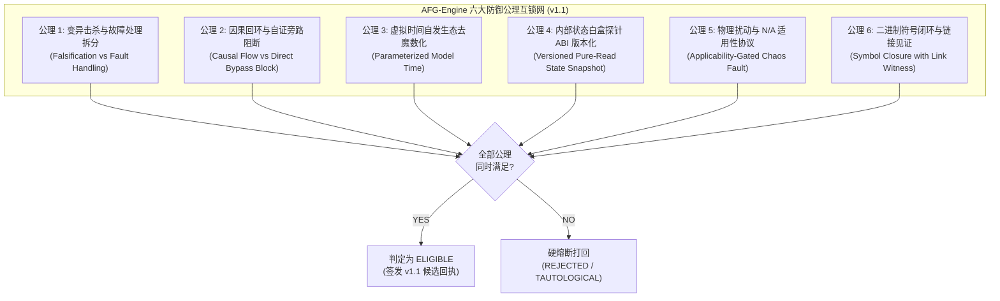
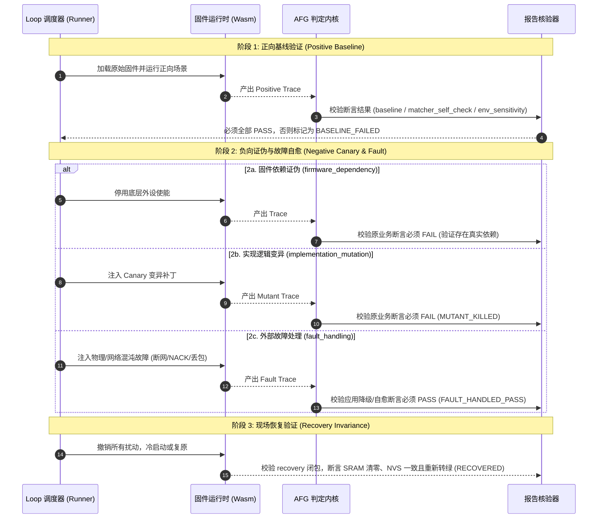

<!-- SPDX-License-Identifier: LGPL-3.0-only -->
# ESP-IDF 防假绿机器验证引擎（AFG-Engine）架构与校验契约规格

| 项 | 内容 |
|---|---|
| 设计编号 | `TECH-DESIGN-20261009-ESP-IDF-ANTI-FALSE-GREEN-ENGINE` |
| 日期 / 修订 | 2026-10-09，Asia/Shanghai；`v1.1` 架构深度加固与落地闭环版 |
| 状态 | **Active Specification**；防假绿机器判定顶层技术契约基准 |
| 关联合同与计划 | [Loop 可靠性契约](esp-idf-loop-reliability-contract.md)、[Batch 0 证据契约](esp-idf-batch0-evidence-contract.md)、[Checklist 与 Loop 整改计划](../../../implementation-plans/esp32/2026-10-09-esp-idf-loop-issues-and-remediation-plan.md)、[AFG 整改与实施计划](../../../implementation-plans/esp32/2026-10-09-esp-idf-afg-engine-remediation-and-implementation-plan.md) |
| 治理依据 | [多域错误码契约](../../../../wink-micro-os/frameworks/esp_idf/docs/03-error-domain-contract.md)、[能力全景图谱字典](../../../../wink-micro-app/vendor/esp_idfv61/.governance/catalog/capability-catalog.yaml)、[分类规范](../../../../wink-micro-app/vendor/esp_idfv61/.governance/specs/CLASSIFICATION-SPEC.md)、[ADR-0001 负数错误码](../../../decisions/core/0001-error-code-sign-convention.md)、[ADR-0004 静态分发](../../../decisions/core/0004-static-dispatch-vs-runtime-ops.md)、[ADR-0012 契约诚实](../../../decisions/core/0012-contract-honesty-over-silent-degradation.md)、[ADR-0091 正交身份](../../../decisions/unisim/0091-esp-idf-multi-config-orthogonal-schema.md)、[ADR-0092 治理宪章](../../../decisions/unisim/0092-esp-idf-simulation-governance-and-capability-charter.md) |
| 平台目标 | WebAssembly 仿真环境（Wasm-browser / Host）及 ESP-IDF v6.1 xtensa 物理硬件同源行为闭环 |

---

## 1. 架构目标与防假绿核心公理

本规范旨在终结“只看脚本退出码 0 即判定通过”的虚假全绿现象，为 WinkMicroOS Loop 治理工程建立基于**机器强制反向证伪与物理因果互锁**的自动化判定引擎（**Anti-False-Green Engine，简称 AFG-Engine**）。

**宿主工程环境边界与分工**：
AFG 引擎作为专职的验证算法与防假绿判定内核，运行于 [Loop 可靠性契约](esp-idf-loop-reliability-contract.md) 提供的执行上下文（`RunContext`）与进程监管器（Job Object）安全沙箱之内。**判定内核专职判定候选包是否达到 `ELIGIBLE` 资格，完全剥离 CAS 晋升特权与主清单文件写操作**。

### 1.1 绝对避免假绿的六大防御公理 (The 6 Axioms v1.1)



1. **公理 1（变异击杀与故障处理极性拆分，AFG-R04）**：
   - **实现变异（Canary Patch）**：以破坏核心业务实现逻辑为手段，**原目标业务断言必须 FAIL**，否则判定为变异存活（`MUTANT_SURVIVED`）假绿；
   - **故障注入（Chaos Fault Injection）**：以模拟外部物理/网络故障为手段，断言被测系统按照降级、重试退避或自愈规范可靠响应，**预期断言必须 PASS**（判定为 `FAULT_HANDLED_PASS`），杜绝将正常自愈误判为击杀失败。

2. **公理 2（因果回环与自证旁路阻断，AFG-R07）**：
   - 彻底废除教条的“物理衰减”公理，确立“禁止绕过固件业务的自证旁路”；
   - **合法业务放行**：放行合理的 UART Echo、网络 Ping-Pong、协议栈回显等输入等于输出的合法业务场景；
   - **因果图硬拦截**：严禁在测试 Fixture 内部直接通过内存拷贝、全局变量或模拟通道短路绕过固件业务逻辑。数据流必须经过被测固件与驱动的完整因果拓扑图（通过探针与断点见证）。

3. **公理 3（虚拟时间自发生态与去魔数化，AFG-R08 / AFG-R09）**：
   - 废除 10ms/500ms 固定魔数与全局 100ms 溢出假设；
   - 虚拟时钟完全由声明的保真度时基与离散事件调度器（DES）自发驱动推进；
   - 背压与缓冲区容差由声明的采样率、流控策略与缓冲区深度参数模型动态计算；
   - 严禁在 Read/Getter API 或空断言中同步 pump 伪造节拍，禁止探针读取产生时间推进副作用。

4. **公理 4（内部状态白盒探针 ABI 版本化与纯读契约，AFG-R11）**：
   - 废除侵入底层 PAL 的私有诊断结构体，统一定义在 `frameworks/esp_idf/include/sim_probe/esp_sim_probe.h`；
   - 探针保持 POD 结构，首两个字段固定为 `probe_abi_version`（初版 `0x0101`）与 `probe_size_bytes`；
   - 探针提供纯只读快照，Wasm 线性内存穿越导出 `wink_sim_copy_probe` C-ABI，真机硬件编译下退化为空宏零开销。

5. **公理 5（强制物理扰动注入与 N/A 适用性协议，AFG-R03）**：
   - 涉及外设总线、通信或物理交互的能力必须配对至少一个 L1/L2 物理扰动；
   - **引入 N/A 适用性协议**：对纯算法计算（如 CRC/数学库）、纯构建系统示例（`build_system/*`）或简单控制台打印，允许显式声明 `applicability_rule_id: na_pure_computational` 并签署豁免声明，免除无意义物理断线伪测试。

6. **公理 6（二进制符号闭环与链接见证，AFG-R12）**：
   - 声明的能力必须在编译产物（Wasm/ELF）中有真实的符号见证；
   - 允许规范化的链接见证（Link Witness），兼容内联函数（`static inline`）与链接时优化（LTO）；
   - 若某驱动符号因 `--gc-sections` 被完全剥离且无 Link Witness，判定为幽灵能力（`ERR_PHANTOM_CAPABILITY_DECLARED`）予以剥离。

---

## 2. 核心架构与模块契约

### 2.1 双极性强制证伪流水线 (Dual-Polarity Pipeline v1.1)

流水线执行器必须对每个候选应用执行 **三阶段双极性闭环协议**，完整驱动并收集 ProofPlan 中定义的 **7 类必需检查闭包**：



#### 2.1.1 四态预期断言矩阵 (Four-State Assertion Matrix)

| 检查项类别 (Evidence Class) | 测试意图 | 预期断言结果 | 判定结论 | 失败处理策略 |
|---|---|---|---|---|
| **1. baseline** | 原始固件在正常激励下行为 | **PASS** | `BASELINE_PASS` | 标记 `BASELINE_FAILED` 终止 |
| **2. matcher_self_check** | 故意喂入错误数据检验断言器 | **PASS** (断言器正确捕获) | `MATCHER_VALID` | 断言器退化恒真桩，熔断打回 |
| **3. env_sensitivity** | 改变物理环境参数观测输出 | **PASS** (业务输出同步变化) | `SENSITIVITY_PASS` | 稳态桩假绿，熔断打回 |
| **4. firmware_dependency** | 关断底层硬件使能 | **FAIL** (原业务断言必须失败) | `DEPENDENCY_VERIFIED` | 桩代码自测，熔断打回 |
| **5. implementation_mutation** | 注入 Canary 破坏实现 | **FAIL** (原业务断言必须失败) | `MUTANT_KILLED` | 变异存活（`MUTANT_SURVIVED`）熔断打回 |
| **6. fault_handling** | 注入外部网络/总线故障 | **PASS** (系统符合降级/自愈断言) | `FAULT_HANDLED_PASS` | 未正确处理故障，熔断打回 |
| **7. recovery** | 撤销扰动后重新复原 | **PASS** (系统无泄漏且重新转绿) | `RECOVERY_PASS` | 状态污染/泄漏，标记 `LEAK_FAILED` |

---

### 2.2 虚拟时间步进协议与 DES 调度契约 (AFG-R08 / AFG-R09)

为杜绝时间推进副作用与伪造节拍，运行时虚拟时钟必须遵循 **ISimulationClockStepper 契约**：

```text
                      ISimulationClockStepper 契约拓扑
   ┌────────────────────────────────────────────────────────┐
   │         Runner / 离散事件调度器 (Discrete Event Sim)      │
   └───────────────┬────────────────────────┬───────────────┘
                   │ pal_sim_step_us(Δt)    │
                   ▼                        ▼
       ┌────────────────────────┐┌────────────────────────┐
       │   ADC 异步生产者采样    ││   UART Rx FIFO 数据注入 │
       │ (按采样率参数自发入队)  ││ (按波特率时钟自发推进) │
       └────────────────────────┘└────────────────────────┘
                   │                        │
                   ▼ (只读快照)              ▼ (只读快照)
       ┌──────────────────────────────────────────────────┐
       │     pal_sim_get_probe() 白盒探针 (时间推进增量 Δt = 0) │
       └──────────────────────────────────────────────────┘
```

#### 2.2.1 核心时间步进约束
1. **显式步进唯一性**：虚拟时间 $\tau$ 只能由测试 Harness 显式调用 `pal_sim_step_us(delta_us)`，或由离散事件调度器根据事件队列推进；
2. **探针纯读零副作用**：调用任何探针接口 `pal_sim_get_probe()` 或 Getter API，其内部虚拟时间增量恒为 $0\mu s$；
3. **同 Tick 因果偏序（Happens-Before）**：在同一次步进 Tick 内，配置变更、中断挂起、ISR 触发及事件回调严格遵循偏序发生；
4. **动态背压模型**：
   - 生产速率 $R_{prod}$ 由外设参数配置决定（如 ADC 连续模式 $f_s = 20\text{kHz}$，每 $50\mu s$ 产生 1 样本）；
   - 消费者挂起时间窗口 $T_{stall}$ 超过缓冲区满载时延 $T_{overflow} = \frac{\text{FIFO\_CAPACITY}}{R_{prod}}$ 时，外设必须可靠触发 Overrun 错误。

---

### 2.3 白盒探针协议与 ABI 版本化规格 (AFG-R11)

头文件位置：`wink-micro-os/frameworks/esp_idf/include/sim_probe/esp_sim_probe.h`。

```c
#if defined(WINK_TARGET_SIMULATION) || defined(SIMULATION)

#define WINK_SIM_PROBE_ABI_VERSION_1_1 0x0101

typedef struct {
    uint32_t probe_abi_version;    /* 固定偏移 0，初版 0x0101 */
    uint32_t probe_size_bytes;     /* sizeof(pal_sim_hardware_probe_t) 前向兼容校验 */
    uint32_t generation_token;     /* 代际 Token，销毁或句柄失效后变为 0 */
    uint32_t allocated_bytes;      /* Heap Caps 追踪字节数 */
    uint16_t fifo_watermark;       /* 硬件 FIFO 当前水位线 */
    uint8_t  state_machine_stage;  /* 状态机内部阶段枚举 */
    bool     is_hardware_busy;     /* 硬件总线忙标志 */
    bool     in_isr_context;       /* 模拟 ISR 上下文标志 */
    uint8_t  power_domain_state;   /* 电源域状态: 0=Active, 1=LightSleep, 2=DeepSleep */
    uint32_t pending_irq_mask;     /* 挂起中断掩码 */
    uint64_t virtual_timestamp_us; /* 当前虚拟时间戳（微秒） */
    uint32_t validity_mask;        /* 字段有效性位图 (BIT0: fifo, BIT1: stage, ...) */
} pal_sim_hardware_probe_t;

/* Wasm 线性内存安全拷贝函数 (C-ABI) */
WINK_EXPORT uint32_t wink_sim_copy_probe(
    uint32_t domain_id,
    uint32_t instance_id,
    uint8_t *out_buffer,
    uint32_t max_len
);

#else /* 物理硬件编译 (xtensa-esp32-elf 等) */
typedef struct { uint32_t _unused; } pal_sim_hardware_probe_t;
#define pal_sim_get_probe(d, i, o) (-1)
#define wink_sim_copy_probe(d, i, b, l) (0)
#endif
```

#### 2.3.1 探针校验门禁
- 引擎在解析探针时，首先检查 `probe_abi_version == 0x0101` 且 `probe_size_bytes == sizeof(...)`；
- 版本或大小不匹配时，立即返回 `ERR_PROBE_ABI_MISMATCH` 并中止判决，防止内存漂移导致假绿。

---

## 3. 契约族原型与 Diff-only 继承体系 (AFG-R01)

为避免 312 个示例重复维护数万行模板断言，采用**契约族原型（Contract Archetype）**分阶继承体系：

```yaml
# 存储于 G/archetypes/archetype_uart_stream.yaml
archetype_id: archetype_uart_stream
tier: 1
standard_claims:
  - id: claim.bus.uart.bidirectional_causality
    description: "UART 双向数据流动经固件处理后流出"
  - id: claim.bus.uart.baud_integrity
    description: "波特率失配时产生有效帧错误"
default_l1_injectors:
  - id: L1-OP-UART-FRAME-ERROR
    action: inject_framing_error
  - id: L1-OP-UART-DISABLE-INTR
    action: disable_rx_interrupt
```

具体示例 `proofplan.json` 只需声明特异性 Diff：
```json
{
  "app_id": "peripherals/uart/uart_echo",
  "inherits": "archetype_uart_stream",
  "diff_claims": [
    {
      "claim_id": "claim.bus.uart.echo_loopback_verified",
      "override_matcher": "HELLO_ESP32_WINK"
    }
  ]
}
```

---

## 4. 交付、回执规格与职责解耦 (AFG-R19 / AFG-R20)

### 4.1 机器证据回执规格 (`afg_evidence_receipt_v1_1.json`)

```json
{
  "$schema": "https://wink-micro-os.org/schemas/afg-evidence-receipt-v1.1.json",
  "receipt_version": "1.1.0",
  "execution_identity": {
    "app_id": "peripherals/uart/uart_echo",
    "config_id": "standard",
    "target_soc": "esp32",
    "backend": "wasm_simulation",
    "profile": "standard",
    "sdkconfig_digest": "4f1a...b2c3",
    "toolchain_version": "emscripten-3.1.56"
  },
  "verdict": "ELIGIBLE",
  "baseline_run": {
    "trace_sha256": "3a8b...12ef",
    "assertions_passed": 8,
    "assertions_failed": 0
  },
  "falsification_runs": [
    {
      "claim_id": "claim.bus.uart.bidirectional_causality",
      "evidence_class": "implementation_mutation",
      "operator_id": "L2-OP-UART-ECHO-DISABLE",
      "expected_outcome": "FAIL",
      "observed_status": "MUTANT_KILLED",
      "error_domain_verified": "esp_err"
    },
    {
      "claim_id": "claim.bus.uart.fault_tolerance",
      "evidence_class": "fault_handling",
      "operator_id": "L1-OP-UART-FRAME-ERROR",
      "expected_outcome": "PASS",
      "observed_status": "FAULT_HANDLED_PASS",
      "error_domain_verified": "esp_err"
    }
  ],
  "probe_witness": {
    "probe_abi_version": "0x0101",
    "generation_token_active": true,
    "heap_leak_bytes": 0
  },
  "recovery_run": {
    "state_restored": true,
    "assertions_passed": 8
  },
  "engine_signature": "AFG-Engine-v1.1-sha256-e91b...33c2",
  "evaluated_at_utc": "2026-10-09T10:00:00Z"
}
```

### 4.2 职责解耦与 CAS 发布事务

1. **引擎职责收敛**：AFG 引擎只输出 `AFGResult(ELIGIBLE | REJECTED | INCOMPLETE)` 及回执文件，**严禁自行写入主清单 `checklist.data.json`**；
2. **晋升服务原子发布**：`PromotionService` 读取 `afg_evidence_receipt_v1_1.json`，在跨进程临界区文件锁保护下，执行 CAS 版本校验，采用 `Write-Temp-Then-Atomic-Replace` 更新 `checklist.data.json`，任何异常中断均触发无污染回滚。
