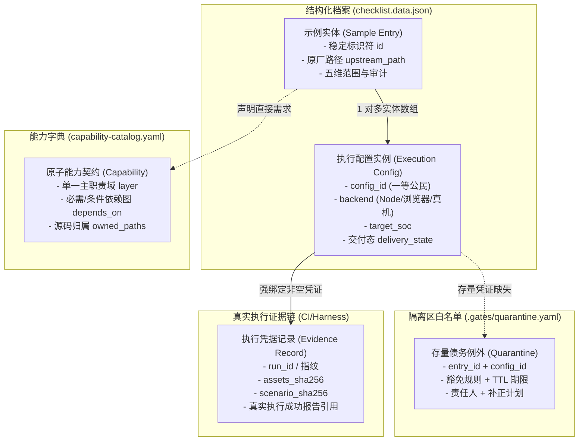
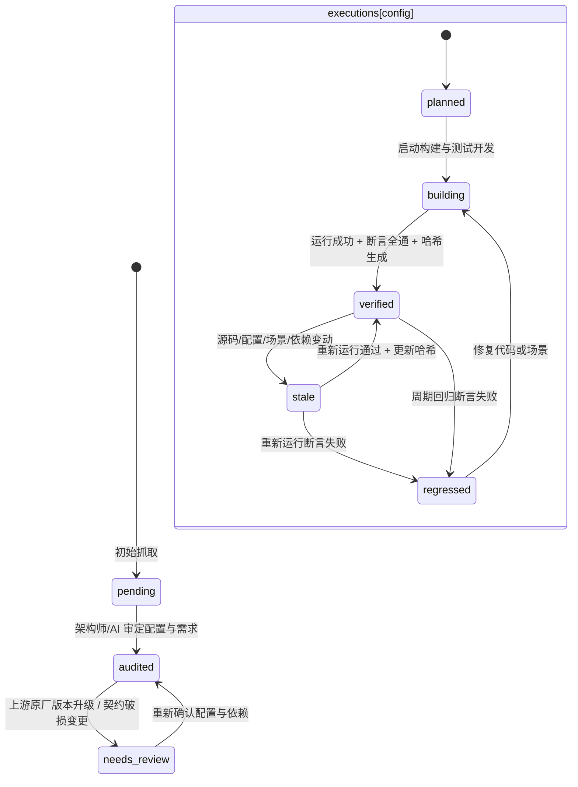

<!-- SPDX-License-Identifier: GPL-3.0-only -->
# ESP-IDF 分类体系数据 Schema 与枚举终版规格 (Classification Schema Spec)

| 项 | 内容 |
|---|---|
| 文档层级 | ② 技术设计规格（Tech Design Spec） |
| 状态 | **Active / 阶段 A 核心交付物** |
| 制定日期 | 2026-09-29 |
| 实施计划依归 | [实施计划（阶段 A）](../../../implementation-plans/esp32/2026-09-29-esp-idf-classification-baseline-remediation-plan.md) |
| 管辖数据源 | [`checklist.data.json`](../../../../wink-micro-app/vendor/esp_idfv61/checklist.data.json)、[`capability-catalog.yaml`](../../../../wink-micro-app/vendor/esp_idfv61/capability-catalog.yaml)、`.gates/quarantine.yaml` |
| 管辖门禁 | [门禁系统技术设计](esp-idf-classification-gate-system.md)（Gate 1 结构与凭证、Gate 2 架构分层、Gate 4 依赖回归） |
| 核心 ADR | [ADR-0012](../../../decisions/core/0012-contract-honesty-over-silent-degradation.md)、[ADR-0002](../../../decisions/unisim/0002-dual-target-compilation.md)、[ADR-0003](../../../decisions/unisim/0003-simulation-fidelity-boundary.md)、[ADR-0090](../../../decisions/unisim/0090-centralized-pluggable-gate-system.md) |
| 核心设计规范 | [UniSim 生产口径与保真边界](../../design/04-wasm-simulation/01-overview/03-production-contract.md) |

---

## 一、 实体模型与事实所有权矩阵

为彻底消除“字段混用、凭证悬空、无凭证通过、门禁误判”的系统性风险，本规格确立以下四大核心实体及其单一真理（SSOT）归属：



### 事实所有权矩阵 (SSOT Matrix)

| 事实域 | 单一真理持有者 (SSOT) | 消费与校验方 | 派生或只读视图 | 严禁行为 |
|---|---|---|---|---|
| **全局治理法则与裁决树** | [`CLASSIFICATION-SPEC.md`](../../../../wink-micro-app/vendor/esp_idfv61/CLASSIFICATION-SPEC.md) | CI 门禁、架构师 | 培训材料、文档附录 | 严禁门禁自行发明未入规范的判定规则 |
| **原子能力图谱与依赖关系** | [`capability-catalog.yaml`](../../../../wink-micro-app/vendor/esp_idfv61/capability-catalog.yaml) | Gate 1, Gate 4, 闭包生成器 | 文档能力字典展示表 | 严禁在示例条目中手工维护第二份传递依赖数组 |
| **示例元数据、配置与交付态** | [`checklist.data.json`](../../../../wink-micro-app/vendor/esp_idfv61/checklist.data.json) | Gate 1, 看板渲染脚本 | [`CHECKLIST.md`](../../../../wink-micro-app/vendor/esp_idfv61/CHECKLIST.md) | 严禁手工编辑 Markdown 看板文件篡改状态 |
| **物理引脚与外设拓扑事实** | 示例目录 `device-tree.json` | 仿真加载器、Gate 1 比对器 | 数据源中的 `external_topology` 需求项 | 严禁在 JSON 数据源维护第二套引脚映射事实 |
| **真实执行结果与防伪凭据** | 执行测试链生成的结构化报告 | Gate 1 校验器 | 示例条目的 `evidence` 字段索引 | 严禁在无运行报告情况下人工填报哈希冒充验证 |
| **历史债务与过渡期豁免** | `.gates/quarantine.yaml` | Gate 执行器（带限域参数） | 看板 `[?]` 标识 | 严禁门禁在 CI 运行时自动写文件修改状态 |

---

## 二、 五维正交状态模型与闭环判定

状态模型必须正交解耦，彻底消灭“已验证条目在同一文档中仍显示为规划缺口”的语义矛盾。状态机由五个相互独立、可严格校验的维度构成：

### 1. 维度定义与枚举空间

```
[1] 产品范围 (Scope)     ──► unknown | in_scope | out_of_scope
[2] 投入安排 (Schedule)  ──► active | deferred
[3] 需求审计 (Audit)     ──► pending | audited | needs_review
[4] 依赖满足度 (Deps)    ──► unknown | satisfied | blocked (由依赖图闭包动态计算，不手工存储)
[5] 交付证据态 (Delivery) ──► planned | building | verified | stale | regressed
```

| 维度 | 字段位置 | 完整枚举 | 语义与法律含义 |
|---|---|---|---|
| **产品范围**<br>`scope.inclusion` | 示例根部 | `unknown` | 尚未完成产品定义与硬件适用性核验，严禁默认排除或纳入 |
| | | `in_scope` | 正式纳入 WinkMicroOS 仿真与运行支持目标范围 |
| | | `out_of_scope` | 明确不纳入支持；必须具备不可逆物理介质事实，并提供编译期阻断 |
| **投入安排**<br>`scope.schedule` | 示例根部 | `active` | 当前阶段正常排期投入资源实现与演进 |
| | | `deferred` | 属于产品目标，但依赖重型外部模型或低优先级生态，暂缓资源投入 |
| **需求审计**<br>`audit.verdict` | 示例根部 | `pending` | 初始抓取状态，尚未深入核验源码调用链与架构分层 |
| | | `audited` | 经架构师/AI 审定，且明确覆盖声明的配置集合与契约版本 |
| | | `needs_review` | 上游源码变更、依赖能力契约修订或配置变化，原审定失效，需复审 |
| **能力满足度**<br>*(Dynamic Closure)* | 内存派生计算 | `unknown` | 依赖图谱中存在尚未支持解析的条件边，或依赖能力状态未明 |
| | | `satisfied` | 该配置所需要的所有原子能力直接需求与传递依赖闭包全部为 `implemented` 或 `verified` |
| | | `blocked` | 至少一项必需能力依赖为 `planned` 或受到底层物理契约硬性阻断 |
| **交付证据态**<br>`executions[].delivery_state`| 配置实例内部 | `planned` | 尚未开始构建或运行验证；或原豁免期满回退 |
| | | `building` | 资产构建或场景编写进行中，尚未产出完整有效证据 |
| | | `verified` | 当前配置已产出完整防伪凭据，且最新执行报告证实断言全部成功 |
| | | `stale` | 证据陈旧：源码、资产、场景、编译器变动导致旧凭证失效，待重验 |
| | | `regressed` | 回归失败：在重新运行中发生断言失败、崩溃或超时 |

---

### 2. 统一“有效 Verified”与看板打勾 `[x]` 的唯一充要条件

为确保整个系统只有一套判据，**CI 门禁与看板渲染脚本必须强制遵循完全同一套数学闭包判定**：

$$\text{CanCheckMark}(E, C) \iff \begin{cases} 
E.\text{scope.inclusion} = \text{"in\_scope"} \\
\land\ E.\text{audit.verdict} = \text{"audited"} \ \land\ C.\text{config\_id} \in E.\text{audit.audited\_configs} \\
\land\ \text{EvaluateDependencyClosure}(E, C) = \text{"satisfied"} \\
\land\ C.\text{delivery\_state} = \text{"verified"} \\
\land\ \text{ValidateHashesNonEmptyAndMatchWorkspace}(C.\text{evidence}) = \text{True} \\
\land\ \text{ValidateExecutionReportSuccess}(C.\text{evidence.execution\_report\_ref}) = \text{True}
\end{cases}$$

**硬性防御约束**：
1. **测试失败绝不能打勾**：若某条目产物哈希完整，但重跑断言失败（处于 `regressed`），或执行报告缺失，看板**严禁打勾 `[x]`**；
2. **排除项绝不能打勾**：`out_of_scope` 示例即使其预期拒绝断言（Fail-Loud SLA）验证通过，在看板中仅显示 `[-] 排除已验证`，绝不计入已支持打勾统计；
3. **隔离区豁免项绝不能打勾**：处于存量隔离区白名单中的 `provisional_unverified` 条目，看板一律渲染为 `[?] 待补凭证`。

---

### 3. 失效流转状态机 (Invalidation State Machine)



---

## 三、 `checklist.data.json` 完整 JSON Schema 规格 (v2.0)

本 Schema 为治理数据源的机器校验基准（适用于 Gate 1 校验器）。

```json
{
  "$schema": "https://json-schema.org/draft/2020-12/schema",
  "$id": "https://wink-ai.org/schemas/esp-idf-classification-v2.0.json",
  "title": "ESP-IDF 示例分类与交付元数据 Schema",
  "type": "object",
  "required": [
    "spec_version",
    "generated_at",
    "total_entries",
    "summary",
    "entries"
  ],
  "properties": {
    "spec_version": {
      "type": "string",
      "pattern": "^2\\.[0-9]+\\.[0-9]+$"
    },
    "generated_at": {
      "type": "string",
      "format": "date-time"
    },
    "total_entries": {
      "type": "integer",
      "const": 478
    },
    "summary": {
      "type": "object",
      "required": ["scope_in", "scope_out", "scope_unknown", "audited", "verified_configs"],
      "properties": {
        "scope_in": { "type": "integer" },
        "scope_out": { "type": "integer" },
        "scope_unknown": { "type": "integer" },
        "audited": { "type": "integer" },
        "verified_configs": { "type": "integer" }
      }
    },
    "entries": {
      "type": "array",
      "items": { "$ref": "#/$defs/sample_entry" }
    }
  },
  "$defs": {
    "sample_entry": {
      "type": "object",
      "required": [
        "id",
        "display_id",
        "upstream_path",
        "written_at_spec_version",
        "scope",
        "audit",
        "required_capabilities",
        "executions"
      ],
      "properties": {
        "id": {
          "type": "string",
          "pattern": "^esp\\.[a-z0-9_]+(\\.[a-z0-9_]+)+$"
        },
        "display_id": {
          "type": "integer",
          "minimum": 1,
          "maximum": 478
        },
        "upstream_path": {
          "type": "string",
          "pattern": "^examples/.+$"
        },
        "written_at_spec_version": {
          "type": "string"
        },
        "scope": {
          "type": "object",
          "required": ["inclusion", "exclusion_reason", "schedule"],
          "properties": {
            "inclusion": {
              "type": "string",
              "enum": ["unknown", "in_scope", "out_of_scope"]
            },
            "exclusion_reason": {
              "type": ["string", "null"]
            },
            "schedule": {
              "type": "string",
              "enum": ["active", "deferred"]
            }
          }
        },
        "audit": {
          "type": "object",
          "required": ["verdict", "auditor", "audited_at", "audited_configs"],
          "properties": {
            "verdict": {
              "type": "string",
              "enum": ["pending", "audited", "needs_review"]
            },
            "auditor": { "type": ["string", "null"] },
            "audited_at": { "type": ["string", "null"], "format": "date-time" },
            "audited_configs": {
              "type": "array",
              "items": { "type": "string" }
            },
            "dispute_ref": { "type": ["string", "null"] },
            "ruling_path": { "type": ["string", "null"] }
          }
        },
        "required_capabilities": {
          "type": "array",
          "uniqueItems": true,
          "items": {
            "type": "string",
            "pattern": "^cap\\.[a-z0-9_]+(\\.[a-z0-9_]+)+$"
          }
        },
        "compatibility": {
          "type": "object",
          "required": ["source_code_policy"],
          "properties": {
            "source_code_policy": {
              "type": "string",
              "enum": ["zero_modification_mirror", "wrapper_main", "shimmed_harness", "upstream_modified"]
            },
            "header_closure": {
              "type": "array",
              "items": { "type": "string" }
            },
            "sdkconfig_overrides": { "type": "object" }
          }
        },
        "fidelity_contract": {
          "type": "object",
          "required": ["axes_declared", "concurrency_model"],
          "properties": {
            "axes_declared": {
              "type": "object",
              "properties": {
                "axis_a_channels": { "type": "string" },
                "axis_b_timebase": { "type": "string" },
                "axis_c_timer": { "type": "string" },
                "axis_d_interrupt": { "type": "string" },
                "axis_e_concurrency": { "type": "string" },
                "axis_f_diagnostics": { "type": "string" }
              }
            },
            "concurrency_model": {
              "type": "string",
              "enum": ["cooperative_fiber", "preemptive_rtos", "single_thread_polling"]
            }
          }
        },
        "executions": {
          "type": "array",
          "minItems": 1,
          "items": { "$ref": "#/$defs/execution_config" }
        }
      }
    },
    "execution_config": {
      "type": "object",
      "required": [
        "config_id",
        "backend",
        "target_soc",
        "profile",
        "delivery_state",
        "acceptance",
        "evidence"
      ],
      "properties": {
        "config_id": {
          "type": "string",
          "pattern": "^[a-z0-9_]+(-[a-z0-9_]+)*$"
        },
        "backend": {
          "type": "string",
          "enum": ["wasm_browser", "wasm_node", "esp32_hardware", "host_native"]
        },
        "target_soc": {
          "type": "string",
          "enum": ["esp32", "esp32s3", "esp32c3", "esp32c6", "all"]
        },
        "profile": {
          "type": "string",
          "enum": ["standard", "minimal", "debug", "coverage"]
        },
        "delivery_state": {
          "type": "string",
          "enum": ["planned", "building", "verified", "stale", "regressed"]
        },
        "acceptance": {
          "type": "object",
          "required": ["type", "observability_level"],
          "properties": {
            "type": {
              "type": "string",
              "enum": ["wasm_simulation", "host_native", "build_toolchain", "expected_rejection", "differential_parity"]
            },
            "observability_level": {
              "type": "string",
              "enum": ["L1_ui", "L2_log", "L3_probe", "L4_internal", "LX_deadlock"]
            },
            "scenario_path": { "type": ["string", "null"] },
            "timeout_virtual_us": { "type": ["integer", "null"] },
            "timeout_wall_ms": { "type": ["integer", "null"] },
            "positive_cases": { "type": "array" },
            "negative_cases": { "type": "array" },
            "sla_error_symbol": { "type": ["string", "null"] }
          }
        },
        "evidence": {
          "type": ["object", "null"],
          "required": [
            "run_id",
            "assets_sha256",
            "scenario_sha256",
            "execution_report_ref",
            "verified_commit",
            "verified_at"
          ],
          "properties": {
            "run_id": { "type": "string" },
            "assets_sha256": { "type": "string", "pattern": "^[a-f0-9]{64}$" },
            "scenario_sha256": { "type": "string", "pattern": "^[a-f0-9]{64}$" },
            "execution_report_ref": { "type": "string" },
            "verified_commit": { "type": "string", "pattern": "^[a-f0-9]{7,40}$" },
            "verified_at": { "type": "string", "format": "date-time" },
            "diff_parity": {
              "type": "object",
              "required": ["sim_run_id", "hw_run_id", "ruleset_version", "tolerance_us", "observed_vectors"],
              "properties": {
                "sim_run_id": { "type": "string" },
                "hw_run_id": { "type": "string" },
                "ruleset_version": { "type": "string" },
                "tolerance_us": { "type": "integer", "minimum": 0 },
                "observed_vectors": { "type": "array", "items": { "type": "string" } }
              }
            }
          }
        }
      }
    }
  }
}
```

---

## 四、 `capability-catalog.yaml` 规格与依赖闭包解析

### 1. Catalog 条目规范与条件依赖扩展

能力字典（[`capability-catalog.yaml`](../../../../wink-micro-app/vendor/esp_idfv61/capability-catalog.yaml)）定义系统所有受管原子能力契约。每个能力 ID 必须属于单一职责域，并声明其必需与可选条件依赖。

```yaml
# capability-catalog.yaml Schema 示例
capabilities:
  cap.proto.ws2812:
    name: "WS2812 协议模型"
    layer: model                         # 单一职责域，见下节映射
    status: implemented                  # planned | implemented | stub | verified
    description: "领域模型 WS2812 时序编解码与灯带色彩管线"
    owned_paths:
      - "wink-micro-os/dal/src/output/dal_ws2812.c"
      - "wink-micro-os/targets/wasm/models/ws2812_model.c"
    soc_support: [esp32, esp32s3, esp32c3, esp32c6]
    depends_on:
      mandatory:
        - "cap.pulse.tx_buffer"          # 必需底层脉冲发生能力
        - "cap.core.fiber_task"          # 必需协程任务环境
      conditional:
        - when:
            profile: "debug"
          requires:
            - "cap.diag.pulse_trace"     # 仅在调试配置下引入时序追踪

  cap.pulse.tx_buffer:
    name: "微秒脉冲发射缓冲"
    layer: pal
    status: implemented
    description: "微秒级离散脉冲电平序列发送抽象 (RMT/PWM 抽象)"
    owned_paths:
      - "wink-micro-os/pal/include/hal/pal_rmt.h"
      - "wink-micro-os/targets/wasm/pal_wasm_rmt.c"
      - "wink-micro-os/targets/esp32/pal_esp32_rmt.c"
    soc_support: [esp32, esp32s3, esp32c3, esp32c6]
    cross_mcu_evidence:
      - "wink-micro-os/frameworks/mcs51/targets/wasm/pal_timer_pulse.c"
    depends_on:
      mandatory:
        - "cap.core.sync_tokens"
```

### 2. 依赖解析器算法与三条防御红线

解析器为指定示例的指定配置计算有效依赖闭包时，执行如下确定性算法：

```python
def resolve_dependency_closure(sample_entry, execution_config, catalog):
    closure = set()
    worklist = list(sample_entry["required_capabilities"])
    
    while worklist:
        cap_id = worklist.pop(0)
        if cap_id not in catalog["capabilities"]:
            raise CatalogResolutionError(f"未声明的能力 ID: {cap_id}")
            
        if cap_id in closure:
            continue
        closure.add(cap_id)
        
        cap_def = catalog["capabilities"][cap_id]
        deps = cap_def.get("depends_on", {})
        
        # 1. 必需边解析
        for req in deps.get("mandatory", []):
            if req not in closure:
                worklist.append(req)
                
        # 2. 条件边解析（防御性求值）
        for cond in deps.get("conditional", []):
            predicate = cond.get("when", {})
            # 防御红线 1：当前解析器不支持的高阶语法强制拒绝
            for key in predicate:
                if key not in ["profile", "backend", "target_soc"]:
                    raise UnsupportedConditionGrammarError(
                        f"能力 {cap_id} 包含解析器尚不支持的条件谓词: {key}"
                    )
            
            # 防御红线 2：配置缺失按 unknown 阻断，严禁默认 false
            matches = True
            for k, expected in predicate.items():
                if k not in execution_config or execution_config[k] is None:
                    raise MissingConfigurationContextError(
                        f"解析条件依赖 {cap_id} 时配置缺失上下文字段: {k}"
                    )
                if execution_config[k] != expected:
                    matches = False
                    break
                    
            if matches:
                for req in cond.get("requires", []):
                    if req not in closure:
                        worklist.append(req)
                        
    return sorted(list(closure))
```

### 3. 六大职责域与仓库物理架构映射

| 规范六类职责域 | 主责与边界 | 仓库既有代码映射 | 禁止行为 |
|---|---|---|---|
| **Facade (① 门面层)** | 原厂 ESP-IDF C API 符号导出、句柄转换、内存记账 | `wink-micro-os/frameworks/esp_idf/` | 严禁编写硬件寄存器操作、严禁内联设备仿真应答 |
| **PAL/DAL (② 固件驱动)** | **PAL**：平台硬件抽象接口与芯片实现；<br>**DAL**：跨平台器件级驱动（按 ADR-0004 静态分发） | `wink-micro-os/pal/`<br>`wink-micro-os/dal/`<br>`wink-micro-os/targets/` | 严禁在 PAL 出现器件协议字段（如 RGB/WS2812 时序） |
| **Core Sim (③ 仿真内核)** | 虚拟时基（B 轴）、纤程协程调度（E 轴）、中断仲裁（D 轴） | `wink-micro-os/targets/wasm/wink_sim_*.c`<br>`wink-micro-os/osal/` | 严禁掺杂任何具体业务协议逻辑 |
| **Model (④ 虚拟模型)** | 外部被测器件应答（EEPROM, LCD, 传感器）、协议解码器 | 仿真器件模型包、测试 harness | 严禁替代被测固件逻辑提前产生假成功应答 |
| **Build (⑤ 构建与配置)** | CMake 组件解析、Kconfig 宏映射、编译期 SLA 生成 | `wink-tools/`、`codegen/` | 严禁在运行时动态解析 CMake 语法 |
| **Host Bridge (⑥ 宿主隧道)**| 原生 Socket、WebSocket 全双工网络/串口宿主代理 | `wink-micro-os/targets/wasm/host_*.c` | 严禁暴露宿主系统未经沙箱保护的任意本地资源 |

---

## 五、 历史存量债务隔离区规格 (`quarantine.yaml`)

为解决当前数据源中 10 个条目声明 `verified` 但哈希全部为 `null` 的历史包袱，特设立本隔离区白名单配置。

### 1. 白名单规则文件定义 (`.gates/quarantine.yaml`)

```yaml
# SPDX-License-Identifier: GPL-3.0-only
spec_version: "2.0.0"
description: "WinkMicroOS ESP-IDF 示例历史存量债务隔离区白名单"

# 隔离条目列表：严格限域，过期自动阻断
quarantined_entries:
  - id: "esp.get_started.blink"
    config_id: "wasm_sim_standard"
    rule_exemptions:
      - "gate1.evidence_hash_present"
      - "gate1.execution_report_verified"
    reason: "早期打样接入遗留条目，缺少防伪哈希与结构化运行凭据"
    quarantined_at: "2026-09-29T14:00:00Z"
    grace_period_expires: "2026-10-13T23:59:59Z"   # 14 天硬性 TTL
    owner: "sim_core_team"
    migration_action_on_expiry: "revert_to_planned"

  - id: "esp.get_started.hello_world"
    config_id: "wasm_sim_standard"
    rule_exemptions:
      - "gate1.evidence_hash_present"
      - "gate1.execution_report_verified"
    reason: "早期打样接入遗留条目，缺少防伪哈希与结构化运行凭据"
    quarantined_at: "2026-09-29T14:00:00Z"
    grace_period_expires: "2026-10-13T23:59:59Z"
    owner: "sim_core_team"
    migration_action_on_expiry: "revert_to_planned"
```

### 2. 门禁与看板消费准则

1. **门禁只读纯函数约束**：
   - Gate 执行器读取 `.gates/quarantine.yaml`。若当前被检 PR 涉及的条目在白名单中且未过 `grace_period_expires`，对应豁免规则判定为 `WARNING (Quarantined Debt)`，不阻断 PR；
   - **TTL 逾期硬阻断**：一旦系统时间超过 `grace_period_expires`，门禁立即判为 `ERROR (Quarantine Expired)` 强制阻断合并；
   - **严禁门禁修改文件**：门禁严禁在执行过程中擅自把 JSON 里的状态改回 `planned`。状态回退必须由维护者提交显式的数据迁移 PR。
2. **看板渲染投影**：
   - 处于有效隔离期的条目，看板状态列强制渲染为 **`[?] 待补凭证 (Quarantined)`**；
   - 严禁渲染为绿色勾选 `[x]`，统计中独立列出“存量隔离待补数（10条）”，不计入交付率分子。

---

## 六、 验收与断言规范：基于 `WINK_SLA_ERROR` 的 Fail-Loud 编译期拦截

为落实 [ADR-0012](file:///d:/workspaces/ai-coding/wink-ai/wink-ai-embedded/docs/decisions/core/0012-contract-honesty-over-silent-degradation.md)（*契约诚实优于静默降级*），凡归类为 `scope.inclusion == "out_of_scope"` 的示例，必须提供机器可验证的物理介质排除凭据，并在编译期 Fail-Loud 阻断。

### 1. 物理介质不可逆排除声明契约

```json
"acceptance": {
  "type": "expected_rejection",
  "observability_level": "LX_deadlock",
  "sla_error_symbol": "esp_efuse_burn_bit",
  "expected_compile_error": "Wink SLA Violation: Physical Efuse irreversible medium is unsupported"
}
```

### 2. 头文件编译期阻断实现标准

在 `wink-micro-os/frameworks/esp_idf/include/wink_sla.h` 中严格定义拦截宏：

```c
#ifndef WINK_SLA_H_
#define WINK_SLA_H_

#if defined(SIMULATION) && !defined(WINK_ALLOW_UNSAFE_STUBS)
#define WINK_SLA_UNSUPPORTED_PHYSICAL(msg) \
    __attribute__((error("Wink SLA Violation: [Physical Hardware Required] " msg)))
#else
#define WINK_SLA_UNSUPPORTED_PHYSICAL(msg)
#endif

// 物理不可逆 Efuse 烧写示例强制拦截
void esp_efuse_burn_bit(int bit) 
    WINK_SLA_UNSUPPORTED_PHYSICAL("物理芯片熔丝 Efuse 烧写不可逆，仿真环境显式禁止以防破坏真机数据契约");

#endif // WINK_SLA_H_
```

**Gate 1 机器校验断言**：针对 `expected_rejection` 类型的条目，门禁必须启动真实编译链编译该示例工程，断言其**编译必定失败**，且 `stderr` 中必须精确命中 `expected_compile_error` 字符串。任何静默编译成功或退出码为 0 的行为均判定为严重架构违规（Fake Stub Leak）。

---

## 七、 实施与迁移路线图

本规格的制定标志着 **阶段 A（语义与 Schema 裁决）** 完成。后续推进步骤如下：

```
[阶段 A：完成] ──► [阶段 B：新 ADR + 规范回写] ──► [阶段 C：最小闭环验证] ──► [阶段 D：存量 478 条清洗] ──► [阶段 E：基线冻结]
 本规格已确立        提交 Schema 升级决策 ADR       用 blink 打通全链路          生成迁移脚本与隔离区           全量门禁生效
```

- **阶段 B 立即交付物**：
  1. 拟定《ADR-0091：ESP-IDF 示例多配置与五维正交数据 Schema 架构》（决策本规格带来的破损性结构升级）；
  2. 回写更新 [`CLASSIFICATION-SPEC.md`](../../../../wink-micro-app/vendor/esp_idfv61/CLASSIFICATION-SPEC.md) 至由破坏性裁决确定的目标版本，吸纳本规格定义并如实修正门禁现状描述；
  3. 更新 [`PLAYBOOK.md`](../../../../wink-micro-app/vendor/esp_idfv61/PLAYBOOK.md) 操作流程至五阶段标准 SOP。
