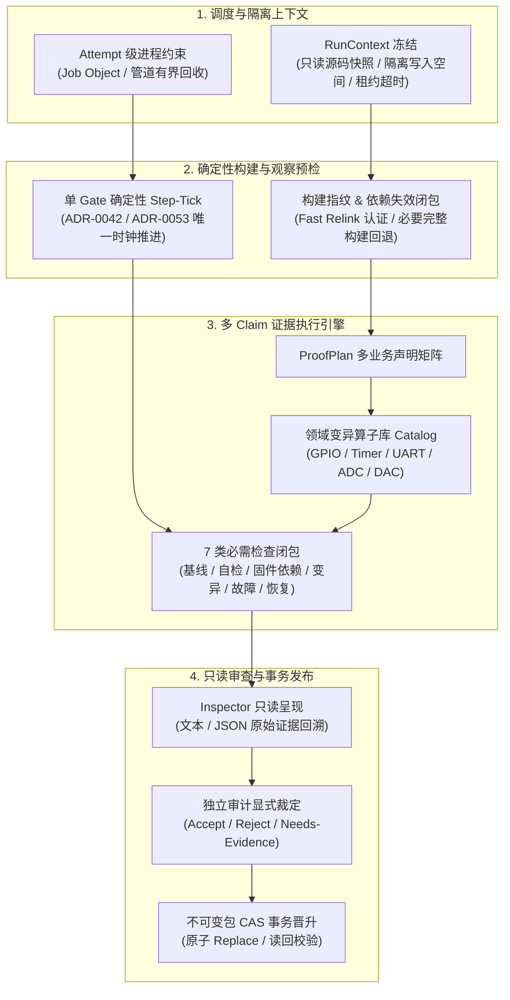

<!-- SPDX-License-Identifier: LGPL-3.0-only -->
# ESP-IDF Autonomous Governance Loop 可靠性技术契约规格

| 项 | 内容 |
|---|---|
| 设计编号 | `TECH-DESIGN-20261008-ESP-IDF-LOOP-RELIABILITY-CONTRACT` |
| 日期 / 修订 | 2026-10-08，Asia/Shanghai；`v1.0` |
| 状态 | **Active / Accepted**；L0 阶段冻结的技术契约基准 |
| 关联合同与计划 | [ESP-IDF Loop 加固与已验证项整改实施计划](../../../implementation-plans/esp32/2026-10-08-esp-idf-verified-remediation-and-loop-hardening-plan.md) |
| 现行技术依据 | [Batch 0 候选证据与双实证绑定](esp-idf-batch0-evidence-contract.md)、[分类规范](../../../../wink-micro-app/vendor/esp_idfv61/.governance/specs/CLASSIFICATION-SPEC.md)、[治理宪章 ADR-0092](../../../decisions/unisim/0092-esp-idf-simulation-governance-and-capability-charter.md) |
| 平台目标 | WebAssembly 仿真环境（Wasm-browser / Host）及 ESP-IDF v6.1 xtensa 物理硬件同源适配 |

---

## 1. 架构目标与工程防线体系

本契约作为 WinkMicroOS 治理系统 **Option B 引擎** 的核心技术规范，旨在通过强隔离、确定性时钟、严格身份绑定与独立审计机制，根除虚假通过（False Green）、跨应用报告借用、进程泄漏与缓存污染。



---

## 2. 核心对象与 Schema 契约

### 2.1 统一执行上下文 (`RunContext`)

每个候选评估尝试必须分配唯一的 `RunContext`，禁止共享写目录与环境变量上下文。

```json
{
  "$schema": "https://json-schema.winkmicroos.org/governance/run-context-v1.json",
  "run_context_id": "CTX-20261008-0001",
  "batch_id": "BATCH-20261008-WAVE1",
  "attempt_index": 1,
  "app_identity": {
    "app_id": "esp.peripherals.uart.uart_echo",
    "target_app_dir": "peripherals/uart_echo",
    "config_id": "wasm_sim_standard",
    "soc": "esp32",
    "backend": "wasm_browser"
  },
  "paths": {
    "readonly_source_snapshot": ".governance/runs/<run_id>/snapshot/source/",
    "candidate_writable_root": ".governance/runs/<run_id>/candidate_app/",
    "build_cache_namespace": ".governance/runs/<run_id>/cache/"
  },
  "supervision": {
    "job_object_assigned": true,
    "max_wallclock_duration_s": 120,
    "max_virtual_time_duration_s": 60,
    "file_lock_backoff_ms": [100, 200, 400]
  },
  "clock": {
    "prng_seed": "0x5EED2026",
    "quantum_us": 1000,
    "same_timestamp_order_version": "v1.1"
  }
}
```

- **生产者**：`LoopRunner` 调度器。
- **消费者**：`LoopPipeline`、构建器、证据执行器、`HeuristicSafetyChecker`。
- **拒绝规则**：路径越界（试图写入非 candidate_writable_root）、配置歧义、快照指纹不一致时立即抛出 `ContextIntegrityException` 阻断。

---

### 2.2 构建清单 (`build-manifest.json`)

```json
{
  "$schema": "https://json-schema.winkmicroos.org/governance/build-manifest-v1.json",
  "build_id": "BLD-20261008-UART-01",
  "target_platform": "wasm32-unknown-emscripten",
  "toolchain_version": "emcc 6.0.9",
  "source_digest": "sha256:4f1a23...",
  "dependency_closure": [
    "wink-micro-os/pal/include/pal_uart.h",
    "wink-micro-os/targets/wasm/pal_wasm_ch2_uart.c"
  ],
  "compiler_flags": ["-O2", "-sWASM=1", "-DWINK_TARGET_WASM"],
  "fast_relink": {
    "eligible": false,
    "fallback_reason": "Header file modified; mandatory complete clean rebuild triggered"
  },
  "verified_exports": [
    "app_main",
    "pal_uart_write_bytes",
    "pal_uart_read_bytes"
  ]
}
```

---

### 2.3 运行清单 (`run-manifest.json`)

```json
{
  "$schema": "https://json-schema.winkmicroos.org/governance/run-manifest-v1.json",
  "run_id": "RUN-20261008-UART-01",
  "build_id": "BLD-20261008-UART-01",
  "scenario_digest": "sha256:7b9c12...",
  "raw_report_digest": "sha256:9c8e41...",
  "exit_code": 0,
  "virtual_duration_us": 5000000,
  "wallclock_duration_ms": 1420
}
```

---

### 2.4 不可变候选证据包 (`candidate-package`)

完整的候选证据包在完成所有检查后密封归档，包含：
1. `context.json` (`RunContext`)
2. `build-manifest.json`
3. `run-manifest.json`
4. `proofplan.json`
5. `patch.diff`（若有变异代码）
6. `raw_report.json`
7. `package_summary.json`（包含全文件 SHA-256 目录树哈希）

---

## 3. 确定性虚拟时间与单 Gate 推进契约

依据 **ADR-0042** 与 **ADR-0053**：
1. **单 Gate 原则**：整个仿真体系内仅允许单一虚拟时钟 Gate 决定时序推进。禁止宿主墙钟（Host Wall-clock）经过量参与业务时间计算。
2. **Step-Tick 事件推进判定**：
   $$\Delta t = \min \left( t_{\text{task\_wake}}, t_{\text{hw\_alarm}}, t_{\text{scenario\_input}}, t_{\text{obs\_deadline}} \right) - t_{\text{current}}$$
   推进过程中严禁跳过任何未处理的中间事件。
3. **同刻事件确定性排序**：
   对于微秒级时间戳完全相同的并发事件，遵循以下总序：
   `场景外部输入注入 (Priority 1) -> 硬件中断/定时器到期 (Priority 2) -> 调度器任务就绪与上下文切换 (Priority 3) -> 观察探针采样 (Priority 4)`。
4. **AT-28 验收标准**：
   固定种子下，空闲宿主与高负载宿主（4 线程 CPU 压力）分别进行 20 次重放测试，语义轨迹与断言判定必须达到 100% 绝对一致，虚拟时间偏差严格为 0。

---

## 4. 业务声明 ProofPlan 与领域变异算子库 (Catalog)

### 4.1 ProofPlan 结构

每个待测应用在测试前必须冻结一份由领域专家或独立审计复核的 `ProofPlan`：
- 每项核心功能分配稳定的 `claim_id`（如 `CLAIM-UART-LOOPBACK-01`）。
- 映射源码依据、API 出口、时间窗口、观察能力与容差。
- 绑定 7 类必需检查闭包：
  1. `baseline`：正常基线通过；
  2. `matcher_self_check`：断言器预置失败验证；
  3. `env_sensitivity`：环境与输入激励敏感性；
  4. `firmware_dependency`：选择性停用目标固件行为后断言失败；
  5. `implementation_mutation`：领域变异算子破坏实现后断言击杀；
  6. `fault_handling`：声明故障注入后系统按预期降级/处理；
  7. `recovery`：扰动清除后冷启动与稳态复原。

---

### 4.2 领域变异算子库 (Catalog) 规范

| 领域 | 算子 ID | 变异动作 | 期望断言反应 |
|---|---|---|---|
| **GPIO** | `MUT-GPIO-INV` | 目标引脚写入电平取反 (`level = !level`) | 目标电平比对断言在窗口内明确失败 |
| **GPIO** | `MUT-GPIO-PIN` | 业务引脚映射改错 (如 GPIO_4 改为 GPIO_5) | 目标引脚事件断言超时无反应 |
| **Timer** | `MUT-TMR-PERIOD`| 计数周期变更 (如 1000us 改为 2000us) | 频率/周期时间断言容差超限失败 |
| **Timer** | `MUT-TMR-RELOAD`| 破坏自动重装载标志 (`auto_reload = false`) | 第二次及后续告警断言超时失败 |
| **UART** | `MUT-UART-PAYLOAD`| 破坏发送缓冲区首字节 (`data[0] ^= 0xFF`) | 数据回读内容匹配断言失败 |
| **ADC** | `MUT-ADC-CHAN` | 读取通道改错 (如 ADC1_CH0 改为 CH1) | 电压读数偏离预期范围断言失败 |
| **DAC** | `MUT-DAC-SCALE`| 输出比例因子截断 (`voltage /= 2`) | 模拟阶梯电压幅值断言失败 |

- **未知与等价性语义**：
  若变异发生后断言未能击杀，系统严格记录为 `MUTATION_SURVIVED`，禁止自动标记为“等价变异”。必须由独立审计者结合语义见证进行人工定性。

---

## 5. 进程归属与 Windows 资源约束机制

1. **Attempt 级 Job Object 绑定**：
   在派生执行子进程（Node.js / Emscripten / Python Worker）前，主控制器必须创建 Windows Job Object 并配置 `JOB_OBJECT_LIMIT_KILL_ON_JOB_CLOSE`。
2. **有界回收超时契约**：
   - Graceful Terminate：发送 SIGTERM / Ctrl-Break，限时 3000 ms；
   - Force Kill：Job Object 关闭或 `taskkill /F /T` 兜底，限时 1000 ms；
   - 管道清理：强制关闭 stdout/stderr 句柄，捕获截断日志并标注 `DIAGNOSTIC_TRUNCATED`。
3. **文件占用有限退避**：
   Windows 下遭遇 `SharingViolationException`（错误码 32），执行指数退避重试：
   `Attempt 1: 100ms -> Attempt 2: 200ms -> Attempt 3: 400ms`。
   累计 700 ms 后仍无法获取句柄则明确报错退出，禁止吞噬异常或覆盖历史有效文件。

---

## 6. 只读 Inspector 与独立审计规格 (`winkcli audit inspect-candidate`)

### 6.1 CLI 交互规格

- **命令形态**：
  `winkcli audit inspect-candidate --candidate <path-or-run-id> [--json]`
- **呈现效率指标**：
  在常规大小的候选包（≤ 50MB）上，必须在 **15 秒内** 完成原始凭据解析并呈现以下事实：
  1. 候选身份（App ID, Config ID, Git Commit, SoC, Backend）；
  2. 7 类检查执行状态（Pass / Fail / Skipped / Missing）；
  3. 变异击杀证据与 Catalog 映射；
  4. 实际输出值与预期匹配差值明细；
  5. 剩余限制与已知缺口。

### 6.2 独立审计决定数据结构

审计决定必须由独立主体明确签署，并与不可变包哈希强绑定：

```json
{
  "$schema": "https://json-schema.winkmicroos.org/governance/audit-decision-v1.json",
  "candidate_package_sha256": "8a3d7f9b2c...",
  "app_id": "esp.peripherals.uart.uart_echo",
  "config_id": "wasm_sim_standard",
  "auditor": {
    "role": "independent_reviewer",
    "identity": "arch_team_lead",
    "signed_at_utc": "2026-10-08T12:11:00Z"
  },
  "verdict": "ACCEPT",
  "contract_coverage_confirmed": true,
  "rationales": "All 7 evidence classes fully passed; UART payload mutation correctly killed with negative assertion receipt."
}
```

- **三态裁定**：`ACCEPT`（接受）、`REJECT`（拒绝）、`NEEDS_EVIDENCE`（待补证据）。
- 缺项、变异存活或身份歧义时，禁止签署 `ACCEPT`。

---

## 7. 事务晋升与历史兼容机制

1. **发布前置条件**：
   - 候选包密封完成且哈希通过校验；
   - 存在有效的 `audit-decision.json`（Verdict 为 `ACCEPT`）；
   - 回归门禁（Gate 1–5）全绿。
2. **原子 CAS 替换**：
   - 在目标目录写入 `verified_candidate.<uuid>.tmp`；
   - 持有全局登记锁；
   - 通过文件系统原子重命名/replace 替换为正式证据；
   - 读回核验数据一致性后，调用 `generate_checklist_v1_1.py` 刷新看板。
3. **历史报告兼容**：
   - 46 项历史已验证报告允许作为只读诊断读取；
   - 禁止在未补齐 ProofPlan 与独立审计前，将历史报告直接包装为新契约下的发布包。
