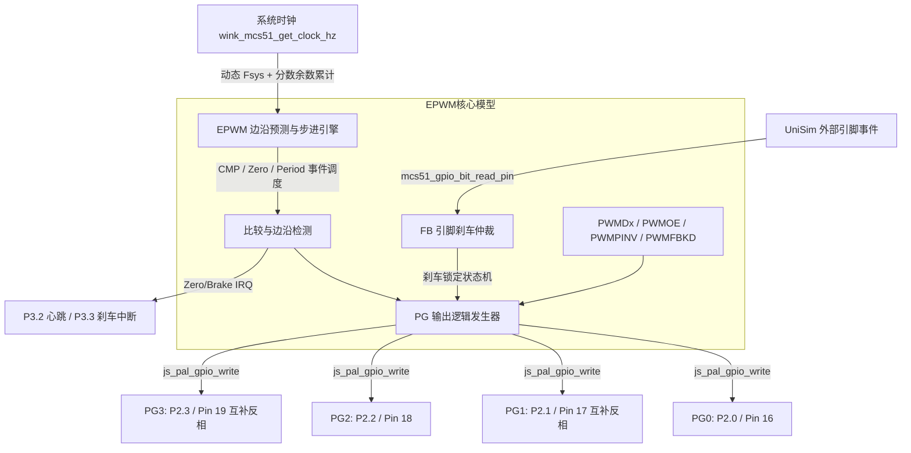

# CMS8S78xx EPWM 外设物理波形输出与故障刹车闭环技术设计规格 (Phase 2)

- **文档编号**: `TECH-20261010-CMS8S78XX-AFG-PHASE2-EPWM`
- **日期 / 状态**: 2026-10-10 / Active (已确立并按手册 V1.1.1 严格修订)
- **目标组件**: CMS8S78xx EPWM 模拟驱动 (`cms8s_epwm.cpp`)、SFR 寄存器垫片 (`REG_CMS8S78XX.H`) 与 4 个标杆用例 (`epwm_down_count`, `epwm_updown_count`, `epwm_brake_fb`, `epwm_brake_stop`)
- **解决缺陷**: [假绿与完整性审查](../../reviews/mcs51/2026-10-09-cms8s78xx-false-green-and-framework-completeness-review.md) 中的核心缺陷 **F1 (缺少 PG 波形)**、**F2 (FB 刹车绕过外部 GPIO)**、**F3 (系统时钟写死 24MHz)**
- **芯片手册事实来源**: `docs/vendors/Cmsemicon/CMS8S78xx参考手册_V1.1.1.pdf` 第 16 章（EPWM）
- **遵循规范**: 
  - [ADR-0004 编译期静态分发](../../../docs/decisions/core/0004-static-dispatch-vs-runtime-ops.md)
  - [ADR-0072 双时钟域配额追赶](../../../docs/decisions/core/0072-dual-clock-domain-and-quota-catchup.md)
  - [ADR-0068 UniSim 物理波形边沿与虚拟时间戳](../../../docs/decisions/unisim/0068-waveform-edge-and-virtual-timestamp.md)
  - [ADR-0009 物理行为仿真与故障注入](../../../docs/decisions/unisim/0009-physical-behavior-simulation-fault-injection.md)

---

## 1. 架构背景与现状痛点

在 CMS8S78xx 官方示例库中，EPWM（增强型脉宽调制器）占据了 8 个示例，是变频控制与电机驱动的核心器件。但在既有运行时实现中存在三项严重的“假绿”与硬件语义失真缺陷：

```
+---------------------------------------------------------------------------------------------------+
| 既有缺陷现状:                                                                                      |
| 1. [F3] 时钟硬编码与截断: ticks = elapsed_us * 24 / factor (写死 24MHz，且短步进丢失分数余量)           |
| 2. [F2] 刹车读 Latch: resolve_ps_pin_val() 读 sfr_shadow，无视 UniSim 真实外部引脚注入电平              |
| 3. [F1] 无 PG 物理波形: 仅在零点翻转 P3.2(pin 26)，PG0~PG3 处于静默 Hi-Z，占空比/互补/波形断言无闭环    |
| 4. [硬件语义偏差]:                                                                                 |
|    - 输出通道臆测为 6 通道（实际硬件仅 PG0~PG3 四路，组成两对互补通道）                                 |
|    - 互补模式误用 PWMCON & 0x08 (bit 3 为成组 GROUPEN；互补实际为 PWMMODE[5:4] == 01b, 即 0x10)        |
|    - 运行控制误将 bit 7 当使能 (官方 bit 6 为 PWMRUN 分频时钟禁止位；计数由 PWMCNTE 每通道使能)         |
|    - 垫片定义错误：REG_CMS8S78XX.H 中 EPWM_PWMCON_PWMRUN_Pos 误定义为 7 (官方标准为 6)                 |
|    - 预分频模型使用 1 << (PSC & 7) (手册明确非零为 PSC+1，零为停止预分频时钟)                           |
|    - 刹车模式混淆：原有单测将 Suspend 当作即时恢复，原厂 Stop 模式清零 PWMCNTE 的硬件锁定未被建模       |
+---------------------------------------------------------------------------------------------------+
```

---

## 2. 硬件事实与寄存器规范矩阵 (CMS8S78xx Ch.16)

对照原厂参考手册 V1.1.1 第 16 章，核准并建立精确语义规范：

### 2.1 通道架构与引脚映射
- **通道总数**: 4 通道（PG0、PG1、PG2、PG3），组织为两对：
  - Pair 0: PG0（主）/ PG1（从，互补通道）
  - Pair 1: PG2（主）/ PG3（从，互补通道）
- **引脚复用映射 (`PxxCFG == 0x04`)**:
  - PG0: 首选 P2.0 (Pin 16)；备选 P0.0 (Pin 0)、P1.7 (Pin 15)
  - PG1: 首选 P2.1 (Pin 17)；备选 P0.1 (Pin 1)、P1.6 (Pin 14)
  - PG2: 首选 P2.2 (Pin 18)；备选 P0.2 (Pin 2)、P1.5 (Pin 13)
  - PG3: 首选 P2.3 (Pin 19)；备选 P0.3 (Pin 3)、P1.4 (Pin 12)
- **状态存储**: 驱动模型结构体仅需 `uint8_t pg_pin_level[4]`。

### 2.2 控制寄存器语义核准
| 寄存器 | 位段 | 手册定义 | 模型正确行为 |
|---|---|---|---|
| `PWMCON` (0xF120) | Bit 6 `PWMRUN` | 0 = 使能预分频/分频；1 = 禁止 (PSC/DIV 清零) | 垫片修复为 Pos 6，模型检查 `(pwmcon & 0x40) == 0` |
| `PWMCON` (0xF120) | Bits 5:4 `PWMMODE` | 00 = 独立模式；01 = 互补模式 (`0x10`)；10 = 同步模式 (`0x20`) | 互补判断为 `(pwmcon & 0x30) == 0x10` |
| `PWMCON` (0xF120) | Bit 3 `GROUPEN` | 1 = PG0/PG2 同步、PG1/PG3 同步；0 = 通道独立 | 成组模式输出控制 |
| `PWMCON` (0xF120) | Bit 1 `CNTTYPE` | 0 = 边沿对齐（向下计数）；1 = 中心对齐（上下计数） | 决定计数器递增/递减与比较拉高/拉低事件 |
| `PWMCNTE` (0xF126) | Bits 3:0 | PWM0~PWM3 独立计数使能位 (1=使能, 0=停止) | 运行使能的根本条件：`cnte & (1 << ch)` |
| `PWM01PSC` / `PWM23PSC` | Bits 7:0 | 00H = 预分频停止，通道计数停止；非零 = $F_{sys} / (PSC + 1)$ | 预分频比计算：`psc == 0 ? 0 : (psc + 1)` |
| `PWMnDIV` (n=0..3) | Bits 2:0 | 000=/2, 001=/4, 010=/8, 011=/16, 100=/1, 其余=$F_{sys}$ | 二级分频比直通计算 |
| `PWMBRKC` (0xF15C) | Bits 1:0 `BRKMS` | 00=Stop, 01=Suspend, 10=Recover, 11=Delay Recover | 刹车状态机核心模式 |
| `PWMBRKC` (0xF15C) | Bit 3 `BRKCLR` | 故障清除位 (只写 1)。当输入撤销 (BRKAF=0) 时写 1 清除刹车状态 | 手动清除机制 |
| `PWMBRKC` (0xF15C) | Bit 7 `BRKOSF` | 故障输出状态标志 (只读)：1 = 处于刹车冻结电平 | 刹车冻结指示 |
| `PWMFBKD` (0xF167) | Bits 3:0 | 各通道刹车时强制冻结电平 (1=高电平, 0=低电平) | 硬件锁死旁路电平 |

---

## 3. 详细设计与实现细节



### 3.1 动态时钟解耦与分数余数累积 (解决 F3)
在 `cms8s_epwm.cpp` 中维护分数余数累加器 `uint32_t tick_fraction_rem[4]`：
1. **时钟频率获取**: 动态读取 `uint32_t fsys = wink_mcs51_get_clock_hz()`。
2. **步进 ticks 换算 (含分数累积)**:
   $$\mathrm{dividend} = \mathrm{elapsed\_us} \times fsys + \mathrm{tick\_fraction\_rem}[ch]$$
   $$\mathrm{divisor} = 1000000 \times \mathrm{prescaler} \times \mathrm{divider}$$
   $$\mathrm{ticks} = \frac{\mathrm{dividend}}{\mathrm{divisor}}, \quad \mathrm{tick\_fraction\_rem}[ch] = \mathrm{dividend} \pmod{\mathrm{divisor}}$$
3. **变频处理**: 在发生主频动态切换时，强制先结算已流逝的虚拟时间，再以新主频初始化下一区间，杜绝短步进积累丢失。

### 3.2 按边沿调度预测 (`cms8s_epwm_next_event_us`)
为了防止仿真微步进跨过脉冲跳变点导致丢波形，`cms8s_epwm_next_event_us()` 必须预测**所有输出变化时刻**：
1. **边沿对齐 (Down-Count)**:
   - 比较匹配点：$CNTn \to CMPn$（由低拉高）所需剩余 ticks；
   - 零点：$CNTn \to 0$（由高拉低并重载）所需剩余 ticks。
2. **中心对齐 (Up-Down Count)**:
   - 向上比较匹配点：$CNTn \uparrow CMPn$（由低拉高）所需 ticks；
   - 周期顶点：$CNTn \uparrow PERIODn$（转向下计数）所需 ticks；
   - 向下比较匹配点：$CNTn \downarrow CMPn$（由高拉低）所需 ticks；
   - 零点：$CNTn \downarrow 0$（转向上计数）所需 ticks。
3. **全局事件时间取最小值**:
   $$\Delta t = \min_{ch \in \text{active}} (\mathrm{ticks\_to\_next\_edge}[ch]) \times \frac{1000000 \times \mathrm{factor}}{fsys}$$
   确保调度器在每个电平跳变瞬态精准唤醒 `poll()` 并触发物理波形上报。

### 3.3 外部 GPIO 刹车仲裁 (解决 F2)
重构 `resolve_ps_pin_val()`：
- 废弃读取内部 `sfr_shadow`；
- 使用标准框架接口 `mcs51_gpio_bit_read_pin(port, bit)`；
- 按照 `PS_FB0` / `PS_FB1` 寄存器映射真实外部引脚（如 P0.6、P1.4 等）；
- 支持 UniSim 仿真场景通过 `INPUT_GPIO` 驱动物理引脚并被模型实时感知。

### 3.4 刹车模式完整生命周期状态机
1. **Recover 模式 (`BRKMS == 10b`)**:
   - 故障输入触发 $\to$ 置位 `BRKAF` 与 `BRKOSF`，输出立即锁定至 `PWMFBKD` 电平；
   - 故障输入撤销 $\to$ 清除 `BRKAF`，但 `BRKOSF` 维持锁定；
   - 在指定的 Reload 计数加载点（零点/周期点）$\to$ 硬件自动清除 `BRKOSF`，输出自动恢复波形。
2. **Stop 模式 (`BRKMS == 00b`)**:
   - 故障输入触发 $\to$ **硬件清零 `PWMCNTE` 停止计数器**，置位 `BRKOSF`，输出锁定至 `PWMFBKD`；
   - 故障输入撤销 $\to$ `PWMCNTE` 保持为 0，输出保持锁定；
   - 软件写 `PWMBRKC[3]=1` (BRKCLR) $\to$ 清除 `BRKOSF`；
   - 软件写 `PWMCNTE |= mask` $\to$ 计数器恢复运行，波形输出恢复。
3. **Suspend 模式 (`BRKMS == 01b`)**:
   - 故障输入撤销后，需软件写 `PWMBRKC[3]=1` 并在下一加载点恢复。
4. **硬件与 ISR 解耦**:
   - 无论 `EA` 或 `PWMIE` 是否使能，硬件刹车旁路保护在输入触发时均立即无条件冻结 PG 输出。

### 3.5 PG0~PG3 物理波形电平解算 (解决 F1)
1. **边沿对齐波形 (Down-Count)**:
   - 周期 $T = (PERIODn + 1) \times T_{pwm}$；
   - 当 $CNTn \le CMPn$ 且 $CNTn > 0$ 时主通道有效（高电平 1）；当 $CNTn > CMPn$ 或 $CNTn == 0$ 时主通道无效（低电平 0）；
   - 占空比 $D = \frac{CMPn + 1}{PERIODn + 1}$（$CMPn \ge 1$）；$CMPn == 0$ 时占空比为 0%。
2. **中心对齐波形 (Up-Down Count, 对称)**:
   - 周期 $T = 2 \times PERIODn \times T_{pwm}$；
   - 当向上计数 $CNTn \ge CMPn$ 且向下计数 $CNTn > CMPn$ 时主通道有效（高电平 1）；其余区间为低电平 0；
   - 占空比 $D = \frac{2 \times PERIODn - 2 \times CMPn - 1}{2 \times PERIODn}$（$CMPn \ge 1$）；$CMPn == 0$ 时占空比为 100%。
3. **互补模式 (`PWMMODE[5:4] == 01b`)**:
   - Pair 0 从通道 PG1 电平为 $!\mathrm{PG0}$（死区禁用时）；Pair 1 从通道 PG3 电平为 $!\mathrm{PG2}$。
4. **极性反转 (`PWMPINV`)**:
   - 若 `PWMPINV & (1 << ch)` 置位，输出电平翻转。
5. **输出使能 (`PWMOE`)**:
   - 仅当 `PWMOE & (1 << ch)` 置位且对应 `PxxCFG == 0x04` 时，调用 `js_pal_gpio_write(pin, level, 3)` 驱动物理引脚。

---

## 4. 治理标杆清单、物理断言与理论容差

| 标杆用例 | 原厂配置特征 | 理论参数与公式 | 改造后物理断言 (`.scenario.json`) |
|---|---|---|---|
| **`epwm_down_count`** | 下计数, $PERIOD=4800$, $CMP=2400$, 互补, 24MHz | $T = (4800+1)/24\text{MHz} = 200.04167\,\mu\text{s}$<br>$f = 4998.96\,\text{Hz}$, 占空比 50.01% | 1. 断言 PG0(P2.0) 频率 $4998.96 \pm 5\,\text{Hz}$，占空比 $50 \pm 1\%$<br>2. 断言 PG1(P2.1) 频率一致且与 PG0 严格互补反相 |
| **`epwm_updown_count`** | 中心对称, $PERIOD=4800$, $CMP=2400$, 互补, 24MHz | $T = 2 \times 4800 / 24\text{MHz} = 400.0\,\mu\text{s}$<br>$f = 2500.00\,\text{Hz}$, 占空比 49.99% | 1. 断言 PG0(P2.0) 频率 $2500 \pm 2\,\text{Hz}$，居中对称脉冲<br>2. 断言 PG1(P2.1) 严格互补反相 |
| **`epwm_brake_fb`** | 外部 FB0(P0.6) 刹车, Recover 模式 | 触发刹车冻结 PG0/1=1, PG2/3=0；撤销后下一个加载点恢复 | 1. 初始阶段断言 PG0~PG3 正常波形<br>2. 20ms 注入 P0.6 拉高，断言 P3.3 翻转且窗口冻结 PG0/1=1, PG2/3=0<br>3. 40ms 撤销 P0.6，断言加载点后波形恢复正常<br>4. 60ms 再次注入 P0.6，断言二次冻结闭环 |
| **`epwm_brake_stop`** | 软件刹车触发, Stop 模式 | 触发刹车硬件清零 PWMCNTE，撤销后仍保持保护，BRKCLR+置位使能后恢复 | 1. 软件刹车触发时，断言 P3.3 翻转且 PG0/1 强制冻结为 1<br>2. 软件撤销刹车，断言 PG0/1 依然保持冻结<br>3. 驱动执行 BRKCLR + PWMCNTE 启动后，断言恢复波形 |

---

## 5. 模型变异防御矩阵 (Mutation Defense Matrix)

为了防止断言器退化为假绿，设计专门的模型级变异测试，验证正向用例在故障注入下**必须被精准拦截（返回退出码 1 且报告目标断言失败）**：

| 变异代码 | 变异注入操作 | 预期正向用例表现 | 成功拦截判定标准 |
|---|---|---|---|
| **MUT-PG-DISABLE** | 驱动中注释掉 `js_pal_gpio_write()` | `epwm_down_count` 失败 | 报告 `PG0 pin 16 has no edges / timeout`，退出码 1 |
| **MUT-COMP-INVERT** | 驱动中互补模式强制同相输出 (`PG1 = PG0`) | `epwm_down_count` 失败 | 报告 `PG0 and PG1 complementary check failed`，退出码 1 |
| **MUT-FB-IGNORE** | 驱动中屏蔽外部 FB0 引脚输入 | `epwm_brake_fb` 失败 | 报告 `P3.3 ISR did not trigger / PG not frozen`，退出码 1 |
| **MUT-CLOCK-FIXED** | 驱动中恢复写死 24MHz 时钟 | 动态降频测试失败 | 报告 `Frequency mismatch at 6MHz`，退出码 1 |
| **MUT-STOP-NO-CNTE**| Stop 模式不硬件清零 `PWMCNTE` | `epwm_brake_stop` 失败 | 报告 `PWMCNTE was not cleared on stop brake`，退出码 1 |

> **运行隔离规则**: 变异用例与变异测试套件由专门脚本 `run_cms8s78xx_mutations.py` 驱动，不与 `run_cms8s78xx_baseline.py` 的 `*.scenario.json` 目录混放，避免污染常规基线。

---

## 6. 功能支持边界与裁剪声明 (Phase 2 Boundary)

| 功能特性 | Phase 2 支持状态 | 边界说明 |
|---|---|---|
| **死区控制 (Dead Time)** | 声明不覆盖 | 4 个标杆用例均配置 `PWMDTE = 0` 关闭死区；Phase 2 保证互补模式逻辑正确，不宣称死区纳秒级延迟已闭环 |
| **单次模式 (One-shot)** | 基础支持 | 标杆聚焦于连续运行模式 (`PWMCNTM = 1`)，单次模式按硬件标志清零 |
| **非对称中心对齐** | 基础支持 | 标杆聚焦于对称计数 (`ASYMEN = 0`)，非对称寄存器保留映射 |
| **输出掩码 (PWMMSK)** | 基础支持 | 默认无掩码透传 |
| **刹车模式** | 重点覆盖 | 全面覆盖并严格实现 Stop、Suspend、Recover、Delay Recover 硬件状态机 |
