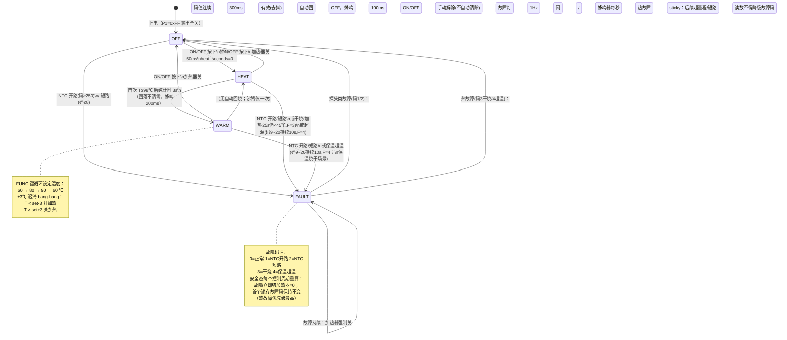

# mcs51_health_pot —— 养生壶（电热水壶）仿真应用设计文档

> 平台：WinkMicroOS · MCS-51 零侵入仿真拦截层（Axis-B，ADR-0070~0076）
> MCU 模型：AT89C52 内核（REGX52.H 方言）+ 外置 ADC0832 测温
> 仿真通道：CH1 GPIO（输入/输出/外部中断）· CH2 UART（遥测）· CH3 模拟量（NTC→ADC0832）
> 固件：`health_pot.c`（Keil C51 风格，经 `mcs51_cleanup.py` 清洗为 C++17 原生/wasm 编译，源码不改）

---

## 1. 功能概述

养生壶典型小家电控制程序：NTC 探头测温 → 继电器驱动发热盘 → 按键交互 → LED/蜂鸣器反馈。

| 功能 | 说明 |
|---|---|
| 烧水模式（HEAT） | 开机后全功率加热，水温达到 98 ℃ 判定沸腾；进入沸腾确认后**纯计时 3 s**（确认期内水温因热惯性/NTC 滞后回落不清零、不重热，避免继电器在 98 ℃ 附近通断活锁），随后转入保温 |
| 保温模式（WARM） | 目标温度 60/80/90 ℃ 三档，FUNC 键循环切换；±3 ℃ 迟滞 bang-bang 控温，防继电器抖动 |
| 关机（OFF） | 任意工作状态按 ON/OFF 回到待机，加热器关断 |
| 按键交互 | ON/OFF（P3.2，兼 INT0）、FUNC（P3.3，兼 INT1），20 ms 软件消抖，按下蜂鸣器 50 ms 短鸣 |
| 声音提示 | 有源蜂鸣器：按键 50 ms（`BEEP_KEY_TICKS`）、沸腾完成 200 ms（`BEEP_BOILDONE_TICKS`）、故障进入 1 s（`BEEP_ALARM_TICKS`）、故障态每秒 100 ms 短促报警（**60 s 后静音**，仅 LED 继续闪烁，`FAULT_BEEP_TIMEOUT`） |
| 指示灯 | 加热灯（HEAT，HEAT 状态全程亮，含沸腾确认期）、保温灯（WARM，保温态亮）、故障灯（FAULT，故障态 1 Hz 闪烁，由 `blink_toggle` 驱动避免 `tick10ms` 16-bit 溢出相位跳变） |
| 安全保护 | 四类故障，任一触发立即关断加热器并进入 FAULT：① NTC 开路（ADC 码 ≥250，F=1）② NTC 短路/脱落（ADC 码 ≤8，F=2）③ 干烧保护（加热器连续工作 25 s 水温仍 <45 ℃，F=3，**注：25 s 为仿真加速值，真机典型 120~180 s**）④ 保温超温（HEAT/WARM 态 ADC 码连续 10 s 处于 9~20 超量程热区间——LUT 把温度钳在 105 ℃，超温只能看原始码；码 50 为正常沸腾，裕量充足；F=4，**10 s 为仿真加速值**）。**故障优先级 sticky**：热故障（F=3/4）一旦锁存，后续任何探头读数（含干烧把 NTC 拖入超量程/短路区）都不得降级为可自动清除的探头故障；热故障须人工按 ON/OFF 解除。探头类故障（F=1/2）须连续 3 个控制周期（300 ms）读数有效才自动回 OFF（去抖，防接触不良反复跳变），且不自动重启加热。**隐式 POST**：`control_task()` 的探头检查在状态机转移**之前**执行——若探头在上电时已坏，首个 100 ms tick 即进 FAULT，任何按键事件在同一原子控制周期内被消费，不可能先进 HEAT 再回 FAULT（按键消抖本身还需 20 ms，额外增加了安全裕量） |
| ADC 滤波 | `adc_read_filtered()` 中值滤波（median-of-3）：抑制电源纹波与继电器开关瞬态的单次采样噪声尖峰，三次 ADC0832 读取 < 100 µs @ 12 MHz |
| 串口遥测 | UART mode-1，每秒一帧：`T=<温度>C,S=<状态>,H=<加热>,F=<故障码>\n`，供 headless `ASSERT_BUS_PAYLOAD` 断言与上位机观测 |
| 软件时基 | Timer0 mode-1，10 ms 周期中断（12 MHz 教学晶振，1 计数=1 µs，重装 65536−10000=0xD8F0） |
| 波特率发生器 | Timer1 mode-2（8-bit 自动重装），TH1=0xFD → 9600 bps @ 11.0592 MHz（仿真下 TI 同步置位、T1 惰性；真机必须初始化且换 11.0592 MHz 晶振） |

**不做（超出当前通道能力或非本产品需求）**：OLED 显示（bit-bang I2C 从机模型为 Stage-3 Class A 未建项，本设计用 LED+UART 替代显示）；无源蜂鸣器音调（PWM 调频为 Stage-3 项，用有源蜂鸣器 GPIO 开关替代）；WS2812/网络/DAC/电机（8051 不适用或 Class B）。

---

## 2. 硬件清单（BOM）

| # | 器件 | 型号/规格 | 作用 | 仿真映射 |
|---|---|---|---|---|
| 1 | MCU | STC89C52 / AT89C52 类（40 DIP） | 主控 | `mcs51_devboard`，P0–P3 线性引脚 0–31 |
| 2 | ADC | ADC0832（8-bit 串行 SAR，3 线） | NTC 电压采样（89C52 片内无 ADC） | Level-2 pin-trap 从机模型 `mcs51_adc0832.cpp`，模拟轨 pin 32（CH0） |
| 3 | 温度探头 | NTC 热敏电阻 10kΩ（B≈3950）+ 上拉至 VREF | 水温→电压（上拉接法：**码值冷高热低**） | headless `INPUT_ANALOG` 驱动 rail pin 32 |
| 4 | 加热器 | 发热盘 + 继电器/可控硅模组 | 加热执行 | GPIO 输出 → `led` 型插件 `heater_relay`（开关量观测点） |
| 5 | 蜂鸣器 | 有源蜂鸣器（5 V，内置振荡） | 按键/完成/报警提示 | GPIO 输出 → `led` 型插件 `buzzer` |
| 6 | 指示灯 ×3 | LED（红=加热 / 绿=保温 / 红=故障） | 状态指示 | GPIO 输出 → `led` 插件 `led_heat/led_warm/led_fault`（低电平点亮） |
| 7 | 按键 ×2 | 轻触按键（接地，内部上拉） | ON/OFF、FUNC | GPIO 输入 → `button` 插件 `btn_onoff/btn_func`（低有效） |
| 8 | 串口 | 片内 UART（TXD=P3.1） | 遥测输出 | CH2：`js_pal_uart_write` → UARTBus TX 时间线 |

> 说明：headless 内置插件类型清单中无独立 `relay`/`buzzer` 类型，二者与 `led` 同为单脚开关量执行器，故设备树统一用 `type: "led"` 声明（状态通道 `on`）；电气语义由标签与固件逻辑区分。真机上继电器/蜂鸣器为独立驱动电路，引脚分配不变。

---

## 3. 引脚分配

线性引脚号 = `port×8 + bit`（P0.0–P3.7 → 0–31，ADR-0074 D3）；模拟轨 pin = `32 + ADC通道号`。

| 引脚 | 线性号 | 方向 | 器件/信号 | 有效电平 | 备注 |
|---|---|---|---|---|---|
| P1.0 | 8 | 输出 | 加热继电器 HEATER | 高 | 继电器吸合=加热 |
| P1.1 | 9 | 输出 | 有源蜂鸣器 BUZZER | 高 | — |
| P1.2 | 10 | 输出 | 加热指示灯 LED_HEAT | **低** | 0=点亮 |
| P1.3 | 11 | 输出 | 保温指示灯 LED_WARM | **低** | 0=点亮 |
| P1.4 | 12 | 输出 | 故障指示灯 LED_ERR | **低** | 1 Hz 闪烁 |
| P2.0 | 16 | 输出 | ADC0832 CS | 低有效 | 板级 codegen 绑定（`mcs51_board_config.h`） |
| P2.1 | 17 | 输出 | ADC0832 CLK | — | bit-bang 时钟 |
| P2.2 | 18 | 双向 | ADC0832 DIO（DI/DO 共线，3 线制） | — | 采样时切换方向 |
| P3.1 | 25 | 输出 | UART TXD（遥测） | — | SCON mode 1，轮询发送 |
| P3.2 | 26 | 输入 | ON/OFF 按键（兼 INT0） | **低** | 20 ms 消抖；EXT int 模型轮询 |
| P3.3 | 27 | 输入 | FUNC 按键（兼 INT1） | **低** | 20 ms 消抖 |
| 模拟轨 32 | — | 输入 | NTC（ADC0832 CH0） | — | `INPUT_ANALOG adcChannel:32` |

未用引脚：P0 口全部、P1.5–P1.7、P2.3–P2.7、P3.0(RXD)/P3.4(T0)/P3.5(T1)/P3.6/P3.7。
> 注：按键走主循环轮询消抖（功能级保真足够）；INT0/INT1 外部中断模型（`mcs51_extint.cpp`）同时存在但本固件未挂 `interrupt 0/2` ISR，引脚复用无冲突。

> **仿真关键约定（准双向口初始化，ADR-0077 已落地）**：8051 准双向口**上电复位即为输入态（锁存器=1，弱上拉）**。拦截层在 framework init 即对 P0–P3 播种「shadow=0xFF + WEAK-HIGH 弱高驱动」（精确镜像硅片上电态），且 GPIO 写 ABI 带驱动强度轴（锁存 1=WEAK 弱上拉、锁存 0=SUPPLY 强灌低，见 `07-mcs51-simulation-interception.md` §2.6）。故固件可照标准 Keil 惯例写 **`P1 = 0xFF; P2 = 0xFF; P3 = 0xFF;`**——与上电影子同值 → diff=0、无边沿、不重复注册；按键按下时插件 SUPPLY-LOW 胜过 WEAK-HIGH 上拉，释放后回高，**零冲突**。早期「固件不写输入口 P3」的 workaround 已随 ADR-0077 移除。

---

## 4. 软件架构

### 4.1 任务分层（超级循环 + Timer0 时基）

```
Timer0 ISR (10 ms)                主循环 main while(1)
┌───────────────────┐            ┌──────────────────────────────────────┐
│ 重装 TH0/TL0       │            │ _nop_() 协作微步（fiber 让出/事件汇合）│
│ tick_flag = 1     │ ──置位──▶  │ 每 10 ms：button_scan() 消抖扫描      │
└───────────────────┘            │ 每 100 ms：control_task() 测温+状态机 │
                                 │ 每 1 s：  one_second_task()          │
                                 │           干烧看门狗 + UART 遥测       │
                                 │ 每 10 ms：outputs_refresh() 输出刷新  │
                                 └──────────────────────────────────────┘
```

- **测温**：`adc_read_filtered(0)` → 内部 3 次 `adc0832_read(0)` bit-bang 13 时钟读 8-bit 码，取中值（median-of-3，3 元素排序网络）→ `ntc_code_to_temp()` 6 断点线性插值 LUT（码值冷高热低，段间线性插值确保保温迟滞带 ±3 ℃ 分辨率充足）。ADC0832 模型 0 µs 即时转换，码值在第 3 个 CLK 上升沿从模拟轨拉取。bit-bang 时序与仓库 canonical 样例（`wink-micro-os/test/mcs51/samples/iron_ntc.c`、`adc0832_read.c`）逐沿一致：配置 3 个上升沿（Start / SGL-DIF / ODD-SIGN）后 CLK **保持高电平**（rise 3 只发 `CLK=1`、不带尾随 `CLK=0`），释放 DIO，读循环首个 `CLK=0` 即 ADC 呈现 MSB 的下降沿。**关键教训**：此处曾多插时钟沿（rise 3 后加 `CLK=1;CLK=0` 再加一个 "park HIGH" `CLK=1` 脉冲，本意保真机 MSB 沿）——仿真 ADC0832 pin-trap FSM 按时钟沿移位出 bit，多沿使后续读码整体错位（沸腾码 50 被读成偏冷的 >60），导致 temp 永不到 98 ℃、加热器不切断（沸腾/超温/沸腾确认/继电器 dwell 四个场景一同回归）。median-of-3 与 boil_confirm 经二分排除非根因。
- **控温**：保温态 ±3 ℃ 迟滞：`T < set−3` 开加热，`T > set+3` 关加热（带无符号下溢防护：`warm_set > WARM_HYST_C` 前置检查）；烧水态直通加热至 98 ℃，首次到温进入沸腾确认子态（`boil_confirm` 标志），确认期 3 s 纯计时、加热器关、温度回落不退出。
- **继电器 dwell（最小断开间隔，触点延寿）**：保温 bang-bang 的**再吸合边沿**受 `RELAY_DWELL_SECONDS` 门控——加热器驱动须已断开满 N 秒（仿真 3 s 加速值，真机 30~60 s）才允许重新吸合，由 `relay_off_sec`（1 s 粒度、`one_second_task()` 内累计，封顶 255；boot 预置 255 故首次加热不被延迟）判定。机械继电器额定 10万~20万次、带载切换拉弧烧蚀是寿命主因，dwell 降低临界点抖动导致的频繁动作。**所有断开边沿（故障 / ON-OFF 键 / 沸腾到温 / 过热切断）一律即时、绝不被 dwell 延迟**——dwell 只推迟"吸合"，永不推迟"断开"。
- **安全**：每 100 ms 控制周期重算故障态；探头故障（F=1/2）进入即时、恢复需连续 3 个有效样本（300 ms 去抖）后自动回 OFF；干烧（F=3，HEAT 态 1 s 粒度累计看门狗）与保温超温（F=4，HEAT/WARM 态原始码 9~20 持续 10 s）为**热故障，sticky 锁存**——`enter_fault()` 对已在 FAULT 态的调用保持首个故障码不变（热故障只可能先于探头故障锁存），必须人工按 ON/OFF 解除。故障蜂鸣器在持续 60 s 后自动静音（`fault_beep_seconds >= FAULT_BEEP_TIMEOUT`），仅 LED 继续闪烁，避免持续扰民。

### 4.2 状态机逻辑图



### 4.3 状态→输出真值表

| 状态 | 加热器 HEATER | 加热灯 | 保温灯 | 故障灯 | 蜂鸣器 |
|---|---|---|---|---|---|
| OFF | 0 | 灭 | 灭 | 灭 | 仅按键 50 ms |
| HEAT（加热中） | 1 | **亮** | 灭 | 灭 | 按键 50 ms |
| HEAT（≥98℃ 保持 3s） | 0 | **亮**（HEAT 状态全程亮） | 灭 | 灭 | 保持结束 200 ms |
| WARM（T < set−3） | 1 | 灭 | **亮** | 灭 | FUNC 切换 50 ms |
| WARM（T > set+3） | 0 | 灭 | **亮** | 灭 | — |
| FAULT | **0（强制）** | 灭 | 灭 | **1 Hz 闪烁**（`blink_toggle`） | 进入 1 s + 每秒 100 ms（**60 s 后静音**） |

### 4.4 NTC 码值—温度对照（LUT，线性插值）

NTC 上拉至 VREF（分压公式：`V_adc = Vref × R_ntc / (R_pull + R_ntc)`）：水温低→电阻大→分压高→ADC 码大。

6 个断点间采用**线性插值**（非阶梯），确保保温 ±3 ℃ 迟滞带在任何温度区间都有足够分辨率：

| ADC 码（8-bit） | ≥240 | ≥200 | ≥150 | ≥100 | ≥60 | ≥30 | <30 |
|---|---|---|---|---|---|---|---|
| 温度 ℃（断点值） | 25 | 40 | 60 | 80 | 95 | 105 | 105（钳位） |

> 示例：码值 175（200→150 区间中点）→ 插值温度 = 40 + (60−40)×(200−175)/(200−150) = **50 ℃**。

故障阈值：码 ≥ 250 = 开路（满幅）；码 ≤ 8 = 短路（0 幅）；码 9~20 = **超量程热区间**（温度已越过 LUT 105 ℃ 钳位，正常沸腾读 ~50 不落入），HEAT/WARM 态连续 10 s 落此区间判超温 F=4。短路带（≤8）在控制周期即时判 F=2，超温带（9~20）为秒级看门狗，二者互不重叠。

### 4.5 UART 遥测帧

每秒一帧（轮询 TX，SBUF 写后忙等 TI）：

```
T=025C,S=0,H=0,F=0\n
```

| 字段 | 含义 |
|---|---|
| `T=` | 温度 ℃，固定 3 位十进制（便于断言匹配） |
| `S=` | 状态：0=OFF 1=HEAT 2=WARM 3=FAULT |
| `H=` | 加热器驱动：0/1 |
| `F=` | 故障码：0=正常 1=开路 2=短路 3=干烧 4=保温超温 |

**波特率发生器**：UART mode-1 需 Timer1 产生波特率时钟。固件在 `timer0_init()` 之后初始化 Timer1 mode-2（8-bit 自动重装），TMOD 掩码操作保护 Timer0 低 4 位不被覆盖（`TMOD &= 0x0F; TMOD |= 0x20;`）。TH1 = 0xFD → 9600 bps @ 11.0592 MHz（SMOD=0：`TH1 = 256 − Fosc/(384×baud) = 256 − 3 = 253`）。仿真模型中 TI 同步置位、不校验波特率，故 T1 功能上惰性；真机必须初始化且更换 11.0592 MHz 晶振（12 MHz 下 9600 bps 误差 ~+7%，超 ±5% UART 容限）。

### 4.6 上电安全保证（隐式 POST）

本固件**不需要**独立的上电自检（POST）ADC 采样——`control_task()` 的架构设计已提供等效保证：

1. 每个 100 ms 控制周期内，**探头有效性检查**（NTC 开路/短路判据）在 `switch(state)` 状态机转移**之前**执行
2. 若探头在上电时已坏（开路/短路），首个 100 ms tick 中 `enter_fault()` → `state = ST_FAULT` 先于任何 `evt_onoff` 的处理
3. 用户按键消抖需要 20 ms（2 个 10 ms tick），而控制周期在 100 ms 边界才执行——即使用户在上电前已按住按键，`evt_onoff` 也只能在 `control_task()` 中被消费，此时探头检查已经完成
4. 结论：不存在「探头已坏但用户按键导致加热器先通电」的时间窗口

> 注：仿真环境中模拟轨默认为 0（= NTC 短路码），场景须在首次 100 ms 控制 tick 之前注入有效温度（当前场景于 30 ms 注入）。同步 POST 在 `main()` 初始化阶段运行时模拟轨尚未注入，会产生误报——因此隐式 POST 同时是仿真兼容的最优解。

---

## 5. 仿真通道映射（对照 UniSim ABI Catalog）

| 功能 | UniSim 通道 | ABI 符号 / 机制 | headless 注入/断言 |
|---|---|---|---|
| 继电器/蜂鸣器/LED 输出 | CH1 GPIO 输出 | sbit diff-edge → `js_pal_gpio_write(pin,level)` | `ASSERT_POINT gpio:8..12` / `plugin:*/on` |
| 按键输入 | CH1 GPIO 输入 | `js_pal_gpio_read_state(pin)` 三路读脚 | `INPUT_PLUGIN_EVENT SET_PRESSED`（button 插件） |
| NTC 测温 | CH3 模拟量 | ADC0832 pin-trap FSM → `mcs51_adc_get_value` → `js_pal_adc_read_norm(32)` | `INPUT_ANALOG adcChannel:32 valueNorm` |
| 遥测 | CH2 UART TX | SBUF 写 hook → `js_pal_uart_write(0,...)` | `ASSERT_BUS_PAYLOAD`（uart bus 0, tx） |

**固件侧器件（codegen-only）声明**：ADC0832 在 `wink-app.json` 中以 `type:"adc0832"` 声明，**仅**被板级 codegen（`mcs51_board_config.py` → `MCS51_HAS_ADC0832` + 引脚宏，bridge 内静态绑定 pin-trap FSM）消费；它没有 host 插件 manifest。运行时设备树发射器（wink-ai `runtime_device_tree.py`）的固件侧器件跳过集 `_FIRMWARE_ONLY_DEVICE_TYPES = {adc0832, thermal_heater_plate}` 会跳过它，不校验、不写入 `device-tree.json`。`thermal_heater_plate`（Track B 热插件）同属此类。

**UART 空闲间隔分帧（ADR-0065 已落地）**：`BusAnalyzer.parseUartBurst` 按相邻字节 `atUs` 空闲间隔切包——`gap > max(4×帧时长, 5000µs)` 即结束当前包、下一字节起新包。1 Hz 遥测拆成逐帧独立包，每帧包时间戳取首字节时刻。因此 `ASSERT_BUS_PAYLOAD` 窗口可用精确区间定位「某一秒那一帧」（本应用场景已使用精确区间窗口）。matcher 为单包内 UTF-8 子串，须写**帧内连续子串**（字段序 `S,H,F`，如 `S=3,H=0,F=2`，不能跳字段）。

| 10 ms 时基 | CTRL 时钟/IRQ | Timer0 mode-1 惰性溢出 + 向量 1（虚拟 µs 时钟） | 由 `DirectWasmEngine` 推进虚拟时钟 |

**模拟轨换算约定（重要）**：ADC0832 shim 取 12-bit 轨值的**低字节**作为 8-bit 码（`mcs51_adc_get_value() & 0xFF`，`mcs51_adc0832.cpp:95`）。故 headless 注入码值 K 时：

```
valueNorm = K / 4095        （不是 K/255）
例：码 240（25℃ 冷水）→ valueNorm ≈ 0.0586
    码 150（60℃ 温水）→ valueNorm ≈ 0.0366
    码 50 （≥98℃ 沸腾）→ valueNorm ≈ 0.0122
    码 0   （短路故障）→ valueNorm = 0
```

**时序注意**：模拟轨默认为 0（= NTC 短路判据）。场景必须在**首次 100 ms 控制 tick 之前**注入冷水温度（本设计场景于 30 ms 注入），否则固件上电即进 FAULT。

---

## 6. Headless 验证场景

| 场景文件 | 覆盖路径 | 关键断言 |
|---|---|---|
| `health-pot-boil-warm.scenario.json` | 快乐路径：OFF→HEAT→（98℃×3s）→WARM→FUNC 切档→迟滞重加热→ON/OFF 关机 | 加热继电器 on/off、加热/保温灯、遥测 `S=1,H=1` / `S=2,H=0`、迟滞再加热、关机 |
| `health-pot-fault-guard.scenario.json` | 安全路径：加热中 NTC 短路→FAULT（加热器立即关）→探头恢复（300 ms 去抖）→自动回 OFF | 故障后继电器 off、遥测 `S=3,F=2`、恢复后 `S=0,F=0` 且不自动重启加热 |
| `health-pot-dryfire.scenario.json` | 干烧路径：冷水持续加热 >25 s→F=3；随后注入短路码（干烧拖超量程）→F 仍=3 不降级；探头恢复但不按键→仍 FAULT；按 ON/OFF→回 OFF | 20 s 仍加热、~29 s 起 `S=3,H=0,F=3`（帧相位由 400 ms 按键时刻决定，有 ±1 s 节拍漂移）、短路注入后 sticky 保持 F=3、无按键不自动清除、手动解除后 `S=0,F=0` |
| `health-pot-overtemp.scenario.json` | 保温超温路径：沸腾转 WARM 后注入码 15（超量程热）持续 10 s→F=4 | 正常沸腾（码 50）不误触发、WARM 态 ~15 s `S=3,H=0,F=4`、探头恢复不自动清除、手动 ON/OFF 解除 |
| `health-pot-ntc-open.scenario.json` | NTC 开路故障路径：加热中注入码 255（开路）→F=1→探头恢复→300 ms 去抖→自动回 OFF | 故障后继电器 off、遥测 `S=3,F=1`、恢复后 `S=0,F=0` 且不自动重启加热 |
| `health-pot-boil-confirm-dip.scenario.json` | 沸腾确认期温度回落验证：加热到 98℃→确认期注入 92℃→加热器保持 OFF（不因回落重热）→3 s 后正常转 WARM | 确认期加热器持续 OFF、回落不重置计时、正常转保温 |

运行（跨仓 CLI，目录形式）：

```powershell
python D:\MyWorkSpace_program\lowcode-nocode\ai-app\wink-ai\packages\wink-tools\wink.py sim run `
  --mode headless --app mcs51_health_pot `
  --scenarios wink-micro-app\mcs51_health_pot\unisim-scenarios
```

构建产物：`health_pot.c` →（`mcs51_cleanup.py`）→ `health_pot.cpp` → 链接 `wink_mcs51_compat` → `unisim-assets/wink_simulator.{js,wasm}`（wasm-only；host/esp32 不出 target，mcs51 树在 `ESP_PLATFORM` 自跳过）。

---

## 7. 文件清单

```
wink-micro-app/mcs51_health_pot/
├── health_pot.c                       # Keil C51 风格固件（唯一 app 源，不改写原文件）
├── CMakeLists.txt                  # cleanup→.cpp→链 wink_mcs51_compat（ADR-0075 契约）
├── wink-app.json                   # 板级/设备声明（adc0832 codegen + led/button 设备）
├── DESIGN.md                       # 本文件
├── unisim-assets/
│   └── device-tree.json            # 运行时插件声明（relay/buzzer 用 led 型，3 LED，2 按键）
└── unisim-scenarios/
    ├── health-pot-boil-warm.scenario.json         # 快乐路径
    ├── health-pot-fault-guard.scenario.json       # NTC 短路安全路径（恢复去抖）
    ├── health-pot-dryfire.scenario.json            # 干烧 sticky + 手动解除
    ├── health-pot-overtemp.scenario.json           # 保温超温 F=4
    ├── health-pot-ntc-open.scenario.json           # NTC 开路 F=1（对称覆盖）
    └── health-pot-boil-confirm-dip.scenario.json   # 沸腾确认期温度回落
```

## 8. 后续可扩展（Stage-3 Class A，零用户代码改动）

1. **bit-bang I2C 从机模型**（ADC0832 pin-trap 为模板）→ 接 SSD1306 OLED 实时显示温度/设定/状态。
2. **定时边沿注入队列** → 干烧探头可换为真实水位开关/温度开关脉冲模型；蜂鸣器升级为无源音调。
3. **PWM 占空比边沿测量** → 加热器改可控硅调功（相位/过零）时观测功率占空比。
4. Track B 热物理插件（`thermal_heater_plate` 连续热平衡）→ 免去 `INPUT_ANALOG` 脚本注温度，水温由加热功率+热容自动演化。

**跨仓 host 框架增强（wink-ai/unisim）**：

5. **准双向口弱上拉建模**（**已落地**，ADR-0077 Accepted）：8051 锁存 1 = WEAK 弱上拉（外部 SUPPLY 强低可压倒、不冲突）、锁存 0 = SUPPLY 强灌低。`js_pal_gpio_write` 新增 `strength` 强度轴（数值恒等映射 host `DriveStrength`，缺省兜底 SUPPLY），mcs51 proxy 上升沿报 WEAK/下降沿报 SUPPLY，framework init 播种 P0–P3「shadow=0xFF + WEAK-HIGH 驱动」。固件已恢复标准 `P1=P2=P3=0xFF` 初始化，早期「不写输入口」规避已删除（详见 §3 仿真关键约定）。
6. **UART 空闲间隔分帧**（**已落地**，ADR-0065 Accepted）：`BusAnalyzer.parseUartBurst` 现按相邻字节 `atUs` 空闲间隔切包——`gap > max(4×帧时长, 5000µs)` 即结束当前包、下一字节起新包，包时间戳取该帧首字节；阈值由端口波特率 config 推算。背靠背/轮询回显字节（gap≈0 或 ~1ms）不切碎，1 Hz 遥测拆成逐帧包。因此 `ASSERT_BUS_PAYLOAD` 窗口可直接用精确晚起点定位「某一秒那一帧」（本应用场景已改回精确区间，不再钉 `0ms` 起点）。

---

## 9. 仿真 vs 真机差异矩阵

> 从仿真走向量产硬件时，以下差异需要工程师关注：

| 特性 | 仿真行为 | 真机行为 | 影响 |
|------|----------|----------|------|
| 温度演化 | `INPUT_ANALOG` 脚本注入，无热惯性 | 水温由热容/散热自然演化 | 沸腾确认期关加热器后水温会回落；保温振荡频率不同 |
| ADC 转换时间 | 0 µs 即时（pin-trap FSM） | ~32 µs（ADC0832 典型） | bit-bang 时序 margin |
| 继电器吸合延时 | 0 µs（GPIO 即刻生效） | 5~15 ms 机械延时 | 快速开关场景下实际加热功率偏差 |
| 电源纹波/ADC 噪声 | 无（理想模拟轨） | NTC 分压受纹波影响 ±1~2 LSB | **已缓解**：固件已增加 median-of-3 滤波（`adc_read_filtered`），在仿真下透明、在真机上抑制单次尖峰；真机 PCB 还应在 NTC 分压点加 RC 滤波（100nF // 10kΩ） |
| 硬件看门狗 | 无 WDT 外设建模；固件 `wdt_init()/wdt_feed()` 在 `#ifdef __C51__` 下编译为空（sim 惰性） | 真机 mandatory：STC12/15 片内 WDT（`WDT_CONTR`，STC12=0xE1 / STC15=0xC1），经典 AT89C52 无片内 WDT 需外挂 MAX813L/IMP706 | **已脚手架化**：喂狗仅在主循环每 tick 一次（绝不放 ISR，否则前台跑飞而中断存活时狗不叫）；超时 ~1 s 远大于最长主循环阻塞（UART 整帧 ~24 ms @9600 + ADC <100 µs）。真机移植选带 WDT 的 MCU 或外挂 IC |
| 继电器 dwell（最小断开间隔） | 3 s 加速值（`RELAY_DWELL_SECONDS`），仅门控保温再吸合边沿 | 30~60 s min-off-time；机械继电器额定 10万~20万次、带载拉弧烧蚀为寿命主因 | **已实现**：dwell 降频延寿；所有断开边沿即时不受限。中功率真机可改过零触发 SSR/可控硅，消除机械触点与电弧 |
| 掉电/闪断与 BOD | 不建模 Vcc 跌落；boot 恒 `state=ST_OFF, heater_on=0`（来电不自动续跑） | Vcc 闪断跌落期 MCU 端口与继电器会抖动 chatter；需 BOD/复位 IC（MAX809/MAX813L 类）；继电器选 **NO 常开型**（失电即断，8051 复位弱上拉 ~200 µA 推不动驱动管） | 软件 half 已保证（必须人工再按 ON/OFF）；硬件 half 需 BOD + NO 继电器。**加热电器禁止"掉电记忆加热态"自恢复**——干烧风险 |
| 干烧检测阈值 | 25 s（加速测试） | 120~180 s（真实 1.0~1.8 L 水壶 + 1000 W 发热盘） | 当前值在真机上会大量误触发；更鲁棒的真机判据为加热 N 秒后 **ΔT/斜率看门狗**（对水量/初温/市电电压自适应），水位开关/温度开关为首选直测手段 |
| 沸腾判据 | 98 ℃ 绝对阈值 | 海拔相关：拉萨沸点约 88 ℃，硬编码 98 ℃ 永不达成（只能靠干烧兜底，体验失效） | 真机产品多用温度平台检测（dT/dt < 阈值持续 N 秒）对气压自适应 |
| XDATA 遥测槽 | `XBYTE[0x10..0x13]` 为仿真观测钩子（MOVX 被拦截层捕获） | 真机 MOVX 会驱动 P0（数据/低地址）+ **P2（高地址=0x00）**，每秒一帧的写周期会把 P2.0/P2.1/P2.2（ADC0832 CS/CLK/DIO）拽低——CS 产生有效下降沿、CLK 被干扰，三线时序被破坏 | 真机移植必须编译开关移除遥测写，或将地址重定向到真实 XRAM（并避免高地址落在 P2.0~P2.2） |
| UART 发送 | `while(!TI)` 忙等，模型中 TI 同步置位、零耗时 | 9600 bps 下整帧 ~24 字节阻塞约 24 ms（> 2 个 10 ms tick）；tick_flag 为布尔量，丢拍不补，消抖节拍/闪灯相位抖动 | 真机应 TX 中断化或降帧频 |
| 晶振/波特率 | Timer0 按 12 MHz 教学晶振 | 12 MHz 下无标准波特率（9600 误差约 +7%，超 ±5% 限） | **已部分修复**：固件已初始化 T1 mode-2 波特率发生器（TH1=0xFD → 9600 bps @ 11.0592 MHz），仿真下惰性；真机需换 11.0592 MHz 晶振 |
| 故障蜂鸣器策略 | 与真机同行为 | 持续鸣响可能扰民（酒店/办公场景） | **已实现**：故障蜂鸣器 60 s 超时静音（`FAULT_BEEP_TIMEOUT`），仅 LED 继续 1 Hz 闪烁；符合 IEC 60335-1 Annex R 有限报警指导 |
| 安全认证 | 不涉及 | 需通过 GB 4706.1 + GB 4706.19（含 Annex R 软件评估） | **软件保护不得作为唯一保护**：加热回路必须串联独立硬件后备——双金属片温控器（stator）+ 一次性温度保险丝（TFO/TCO），在 MCU 失控/继电器粘连时硬件独立断电；另需防溢/防倾倒开关 |
