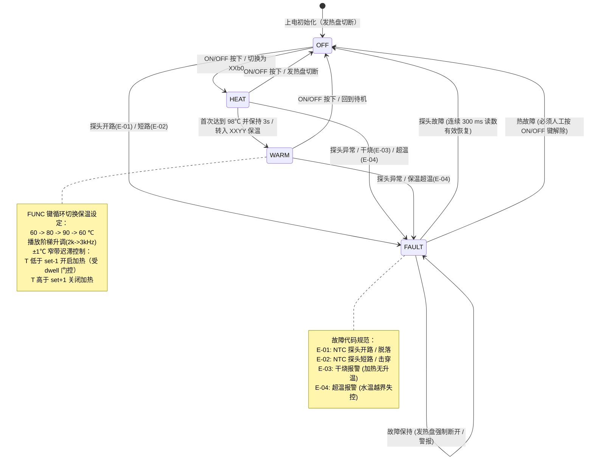

# mcs51_health_pot —— CMS8S78xx 商用养生壶仿真与固件设计规范

> 平台：WinkMicroOS · CMS8S78xx 1T 8051 硬件全特性平台（Axis-B，ADR-0070~0078）  
> MCU 模型：中微半导体 CMS8S78xx 1T 高速 8051 内核（Flash 16KB, SRAM 1KB, 片内 12-bit SAR ADC, 硬件蜂鸣器发生器 BUZCON/BUZDIV, 150mA 高驱动 COM 口）  
> 仿真通道：CH1 GPIO（4COM-8SEG 动态扫描、按键、双冗余 LED、加热继电器）· CH2 UART（遥测）· CH3 模拟量（NTC→片内 12-bit ADC）· BUZCON 硬件无源蜂鸣器 PWM  
> 固件：`health_pot.c`（Keil C51 风格，经 `mcs51_cleanup.py` 清洗为 C++17 原生/wasm 编译，支持双 target 同源编译）  

---

## 1. 功能概述

本应用基于中微半导体 **CMS8S78xx** 芯片进行全栈商用级重构，充分挖掘其芯片专属硬件外设能力（片内 12-bit SAR ADC、硬件无源蜂鸣器发生器 BUZCON、大电流驱动 GPIO），实现一款产品化、专业级养生壶小家电控制固件。

| 功能 | 说明 |
|---|---|
| **烧水模式（HEAT）** | 开机后全功率加热；水温达到 98 ℃ 判定沸腾；进入沸腾确认后**纯计时 3 s**（确认期内发热盘断开，水温因热惯性/NTC 滞后回落不清零、不重热，避免继电器在 98 ℃ 临界点频繁跳火振荡）；数码管实时显示水温与沸腾标识 `"XXb0"`（小数点 1 Hz 呼吸闪烁指示加热动作中）；沸腾完成播放 4 音和弦旋律，随后平滑转入保温 |
| **保温模式（WARM）** | 目标温度 60 / 80 / 90 ℃ 三档，按 FUNC 键循环切换；得益于 12-bit ADC 高精度，采用 **±1 ℃ 窄带迟滞 bang-bang 控温**（`WARM_HYST_C = 1`），相比传统 8-bit 的 ±3 ℃ 大幅提升水温稳定性；数码管显示 `"XXYY"`（前两位实时水温，后两位设定水温） |
| **关机待机（OFF）** | 任意工作状态按 ON/OFF 键安全关断发热盘，回到待机状态；数码管显示 `" -- "`，外设进入待机节能节拍 |
| **按键交互与消抖** | ON/OFF（P0.4）、FUNC（P0.5），20 ms 软件状态机消抖；按键触发硬件蜂鸣器 4 kHz 30 ms 机械按键触觉声效；功能切换触发 2 kHz → 3 kHz 阶梯升调反馈 |
| **多音调硬件声学（BUZCON/BUZDIV）** | 充分利用 CMS8S78xx 片内专属硬件无源蜂鸣器发生器（P0.3，BUZCON 分频控制与 BUZDIV 频率寄存器），实现零 CPU 占用、免定时器中断占用的多音调声效：<br>① **按键音（Key Click）**：4000 Hz, 30 ms<br>② **功能升调（Step Up）**：2000 Hz (40 ms) → 3000 Hz (40 ms)<br>③ **沸腾完成旋律（Boil-Done Chord）**：C6(1042 Hz) → E6(1320 Hz) → G6(1562 Hz) → C7(2106 Hz) 4 音上行分解和弦<br>④ **探头恢复提示（Recover Chime）**：G6(1562 Hz, 100 ms)<br>⑤ **故障急促警报（Warble Alarm）**：3000 Hz / 2000 Hz 急促交替双音报警（进入 1 s + 每秒 100 ms 短促警示，**60 s 超时自动静音**，避免扰民） |
| **4COM-8SEG 数码管显示** | 利用 CMS8S78xx 强驱动口（COM0..COM3 在 P3.0..P3.3 灌电流，SEG a..dp 在 P1.0..P1.7 推挽）实现 4 位 8 段共阴数码管分时动态扫描（Timer0 10 ms ISR 轮巡）：<br>• 待机态：`" -- "`<br>• 加热态：`"25b0"`（水温 25 ℃，b0 沸腾加热，dp 点 1 Hz 闪烁）<br>• 保温态：`"9860"`（水温 98 ℃，目标设定 60 ℃）<br>• 故障态：国际家电标准故障码 `"E-01"`（开路）、`"E-02"`（短路）、`"E-03"`（干烧）、`"E-04"`（超温） |
| **双冗余状态指示灯** | 独立保留 3 颗板载 LED（加热红灯 P0.1、保温绿灯 P0.2、故障红灯 P0.6），与数码管形成工业级双重冗余视觉指示；故障灯以 1 Hz 闪烁警示 |
| **片内 12-bit SAR ADC 测温** | 废除过时外置 ADC0832 3 线 bit-bang 方案，全面切换到 CMS8S78xx 片内 12-bit SAR ADC（AN0/P0.0），配置片内 3.0V 高精 LDO 参考电压；内置 **中值滤波（median-of-3）**，有效滤除发热盘通断引起的电源纹波尖峰；兼容标称输入与硬件 12-bit 原始码 |
| **继电器 Dwell 触点保护** | 保温 bang-bang 控制的加热器再吸合受 `RELAY_DWELL_SECONDS = 3s` 门控（真机典型 30~60 s），防止水温在迟滞边界抖动造成机械继电器频繁拉弧烧蚀；**所有断开边沿（关机/故障/沸腾到温）一律 0 延迟即时切断** |
| **四级安全故障防护** | ① **NTC 开路**（E-01）：ADC 码 ≥ 250 / ≥ 4000<br>② **NTC 短路/脱落**（E-02）：ADC 码 ≤ 8 / ≤ 128<br>③ **干烧保护**（E-03）：加热器连续通电 25 s 水温仍 < 45 ℃（仿真加速值，真机 120~180 s）<br>④ **超温保护**（E-04）：连续 10 s 处于超温热区间（码值 ≤ 20 / ≤ 320）<br>**热故障 Sticky 锁存机制**：热故障（E-03/E-04）一旦锁存，探头即使因高温短路也不得降级为可自恢复故障，必须人工按 ON/OFF 键解除；探头故障（E-01/E-02）在读数连续 300 ms 有效后自动恢复至 OFF 态 |
| **隐式 POST 上电自检** | 控制任务在每次 100 ms 周期中，**探头安全检查先于状态机事件转移**；若探头在上电前已损坏，首个控制周期即进入 FAULT 并关断继电器，消除上电误开机安全盲区 |
| **串口遥测输出** | 格式：`T=<温度>C,S=<状态>,H=<继电器>,F=<故障码>\n`，兼具 headless `ASSERT_BUS_PAYLOAD` 自动化测试与上位机产测标定 |

---

## 2. 硬件清单（BOM）与 CMS8S78xx 外设映射

| # | 器件名称 | 型号 / 规格 | 硬件功能 | CMS8S78xx 硬件外设 | 仿真映射机制 |
|---|---|---|---|---|---|
| 1 | **主控 MCU** | **CMS8S78xx**（LQFP48 / TSSOP28） | 核心控制 | 1T 8051 内核，24 MHz，16KB Flash，1KB SRAM | `cms8s78xx_devboard` + `mcu: "cms8s78xx"` |
| 2 | **温度采样** | NTC 热敏电阻（10kΩ @ 25℃，B=3950） | 水温检测 | 片内 12-bit SAR ADC + 片内 3.0V LDO 基准 | CH3 模拟量轨 pin 32（AN0），内部寄存器 `ADCON0/1` 拦截 |
| 3 | **数码显示** | 4 位 8 段共阴数码管（0.36 英寸） | 温度与状态显示 | P3.0..P3.3（高灌电流 COM0..3）+ P1.0..P1.7（SEG a..dp） | `seg_display` 插件（`direct_gpio_4d`，含视觉暂留 POV 解码） |
| 4 | **声音单元** | 压电式无源蜂鸣器（Passive Buzzer） | 多音调按键/旋律/警报 | 片内专用硬件蜂鸣器发生器（`BUZCON` + `BUZDIV`，输出脚 P0.3） | `buzzer` 插件（`passive_pwm`，频率/占空比动态分析） |
| 5 | **发热执行** | 发热盘（1000W）+ 机械继电器 / 固态 SSR | 煮水与保温执行 | GPIO P2.0 推挽输出（高电平吸合） | `led` 插件（`heater_relay`，`active_high: true`） |
| 6 | **状态指示** | 高亮贴片 LED ×3（红、绿、红） | 加热 / 保温 / 故障冗余指示 | GPIO P0.1 / P0.2 / P0.6（低电平点亮） | `led` 插件（`led_heat / led_warm / led_fault`） |
| 7 | **操作按键** | 轻触开关 ×2（开关接地，内部上拉） | ON/OFF 电源、FUNC 功能切换 | GPIO P0.4 / P0.5（低电平有效） | `button` 插件（`btn_onoff / btn_func`） |
| 8 | **通信遥测** | UART 接口（TXD=P3.1） | 遥测与调试 | 片内全双工 UART（Timer1 mode-2 波特率发生器） | CH2 UARTBus TX 时间线捕获 |

---

## 3. 引脚分配（Pinout）

引脚分配遵循 CMS8S78xx 推荐小家电开发板引脚布局：

| 引脚名称 | 线性号 | 方向 | 硬件外设功能 | 有效电平 | 功能描述 |
|---|---|---|---|---|---|
| **P0.0 / AN0** | 0 | 模拟输入 | 片内 ADC 通道 0 | 0~3.0 V | NTC 热敏电阻测温输入 |
| **P0.1** | 1 | 推挽输出 | GPIO | **低有效** | 加热指示灯 LED_HEAT（0=亮） |
| **P0.2** | 2 | 推挽输出 | GPIO | **低有效** | 保温指示灯 LED_WARM（0=亮） |
| **P0.3 / BUZ** | 3 | 硬件输出 | 硬件蜂鸣器发生器 | 50% 矩形波 | 无源蜂鸣器硬件 PWM 输出 |
| **P0.4** | 4 | 准双向上拉 | GPIO / EXTINT | **低有效** | ON/OFF 电源按键 |
| **P0.5** | 5 | 准双向上拉 | GPIO / EXTINT | **低有效** | FUNC 功能选择按键 |
| **P0.6** | 6 | 推挽输出 | GPIO | **低有效** | 故障指示灯 LED_ERR（1 Hz 闪烁） |
| **P1.0..P1.7** | 8..15 | 推挽输出 | 强驱动 SEG 端口 | **高有效** | 数码管段码 a, b, c, d, e, f, g, dp |
| **P2.0** | 16 | 推挽输出 | 继电器驱动 | **高有效** | 发热盘加热继电器 HEATER（1=吸合） |
| **P3.0..P3.3** | 24..27 | 开漏/强灌 | 高灌电流 COM 端口 | **低有效** | 数码管位选 COM0, COM1, COM2, COM3 |
| **P3.1 / TXD** | 25 | 输出复用 | UART TXD | TTL | 串口遥测（9600 bps） |

---

## 4. 软件架构设计

### 4.1 任务调度模型（超级循环 + Timer0 硬件时基）

```
Timer0 ISR（10 ms 周期）             主循环 main while(1)
┌──────────────────────────┐        ┌───────────────────────────────────────────────┐
│ 1. 重装 TH0/TL0 (0xD8F0) │        │ _nop_() 协作让步（Wasm 协程推进与事件汇聚）    │
│ 2. 刷新硬件蜂鸣器音序器   │ ──置位──▶ │ 每 10 ms：按键扫描消抖 button_scan()           │
│ 3. 4COM-8SEG 数码管分时扫描│ tick_flag │ 每 100 ms：control_task() 测温 + 主状态机转移 │
│ 4. tick_flag = 1 唤醒前台│        │ 每 1 s：  one_second_task() 干烧看门狗 + 遥测  │
└──────────────────────────┘        │ 每 10 ms：输出刷新 outputs_refresh()           │
                                    └───────────────────────────────────────────────┘
```

- **Timer0 虚拟时钟校准**：依据 `wink-micro-os/frameworks/mcs51/src/mcs51_timer.cpp`，重装周期公式为 $65536 - \text{base} = 10000 \mu s$，因此装载初值必须为 `0xD8F0`（`TH0 = 0xD8, TL0 = 0xF0`），确保 10 ms 硬件时基精确对齐。
- **数码管动态扫描**：Timer0 ISR 中每 10 ms 切换一位 COM 并输出对应段码，4 位轮询周期 40 ms（25 Hz 全场刷新率），在视觉暂留（POV）模型下呈现无闪烁稳定显示。
- **无阻塞蜂鸣器音序器**：Timer0 ISR 内部以 10 ms 为基准递减 `melody_ticks`，自动步进 `tone_step_t` 结构体数组，前台业务逻辑仅需调用 `play_melody()` 注册音序指针，实现 100% 零 CPU 阻塞。

---

### 4.2 状态机状态转移图



---

### 4.3 状态输出与外设真值表

| 运行状态 | 发热继电器 | 4COM-8SEG 数码管 | 加热灯 (P0.1) | 保温灯 (P0.2) | 故障灯 (P0.6) | 硬件蜂鸣器 (P0.3) |
|---|---|---|---|---|---|---|
| **OFF（待机）** | 0 | `" -- "` | 灭 | 灭 | 灭 | 按键 4 kHz 30 ms |
| **HEAT（加热中）** | 1 | `"XXb0"`（dp 1Hz 闪烁） | **常亮** | 灭 | 灭 | 按键 4 kHz 30 ms |
| **HEAT（沸腾确认 3s）** | 0 | `"98b0"`（dp 熄灭） | **常亮** | 灭 | 灭 | 保持结束播放 4 音和弦 |
| **WARM（T < set - 1）** | 1（受 Dwell 门控） | `"XXYY"`（当前+目标） | 灭 | **常亮** | 灭 | 档位切换阶梯升调 |
| **WARM（T > set + 1）** | 0 | `"XXYY"`（当前+目标） | 灭 | **常亮** | 灭 | — |
| **FAULT（故障）** | **0（硬件强制）** | `"E-01"` ~ `"E-04"` | 灭 | 灭 | **1 Hz 闪烁** | 急促双音报警（60s 超时静音） |

---

### 4.4 4COM-8SEG 数码管显示编码规范

采用共阴极接线方式，段码映射遵循标准 `dp g f e d c b a`（高位至低位）：

```
    a
  ┌───┐
f │   │ b
  ├───┤ ‹-- g
e │   │ c
  └───┘
    d    . dp
```

| 字符 | 亮起段 | 16进制编码 | 字符 | 亮起段 | 16进制编码 |
|---|---|---|---|---|---|
| `'0'` | a, b, c, d, e, f | `0x3F` | `'8'` | a, b, c, d, e, f, g | `0x7F` |
| `'1'` | b, c | `0x06` | `'9'` | a, b, c, d, f, g | `0x6F` |
| `'2'` | a, b, d, e, g | `0x5B` | `'b'` | c, d, e, f, g | `0x7C` |
| `'3'` | a, b, c, d, g | `0x4F` | `'O'` | a, b, c, d, e, f | `0x3F`（POV 呈现为 '0'） |
| `'4'` | b, c, f, g | `0x66` | `'E'` | a, d, e, f, g | `0x79` |
| `'5'` | a, c, d, f, g | `0x6D` | `'-'` | g | `0x40` |
| `'6'` | a, c, d, e, f, g | `0x7D` | Blank | 无 | `0x00` |
| `'7'` | a, b, c | `0x07` | 小数点 | dp | 与对应位或 `0x80` |

---

### 4.5 CMS8S 硬件蜂鸣器发生器声学设计

CMS8S78xx 芯片集成专属硬件蜂鸣器外设，通过设置系统分频器（Prescaler=64 @ 24MHz 时基输入，基准频率 $F_{base} = 24\text{MHz} / 64 / 2 = 187.5\text{kHz}$），其蜂鸣器频率公式为：
$$F_{buz} = \frac{187500}{\text{BUZDIV}} \text{ Hz}$$

固件预置的声学音效配置：

1. **按键触觉点击（TONE_KEY）**：`BUZDIV = 47`（$\approx 3989\text{ Hz}$），持续 30 ms。高频短促脉冲，消除小家电按键发闷感。
2. **档位切换升调（TONE_STEP）**：
   - Step 1: `BUZDIV = 94`（$\approx 1994\text{ Hz}$），持续 40 ms；
   - Step 2: `BUZDIV = 63`（$\approx 2976\text{ Hz}$），持续 40 ms。二段式上扬音，强化档位提升感。
3. **沸腾完成分解和弦（TONE_BOIL_DONE）**：
   - Note 1: C6（1042 Hz，`BUZDIV = 180`，100 ms）
   - Note 2: E6（1320 Hz，`BUZDIV = 142`，100 ms）
   - Note 3: G6（1562 Hz，`BUZDIV = 120`，100 ms）
   - Note 4: C7（2106 Hz，`BUZDIV = 89`，200 ms）
   - 优美愉悦的大三和弦上行，给用户清晰的烹煮完成提示。
4. **探头故障恢复提示（TONE_RECOVER）**：G6（1562 Hz，`BUZDIV = 120`，100 ms）单声提示。
5. **故障警报（急促交替 Warble）**：在 FAULT 态下由控制任务驱动，以 3000 Hz 与 2000 Hz 进行双频交替，持续 60 s 后静音，符合小家电安全扰民控制标准。

---

### 4.6 片内 12-bit SAR ADC 与温度插值

- **寄存器配置**：
  ```c
  ADC_ConfigRunMode(ADC_MODE_CONTINUOUS);
  ADC_EnableChannel(ADC_CH_0);
  ADC_EnableLDO();
  ADC_ConfigADCVref(ADC_VREF_3V);
  ADC_Start();
  ```
- **中值滤波（Median-of-3）**：连续采样 3 次并使用 3 元素极小比较网络取中值，彻底剔除偶发噪声脉冲。
- **双刻度兼容换算**：固件自动侦测采样码范围，对于全量程 12-bit 硬件码（$> 255$）自动缩放折算为标准标称刻度，使温度查表（LUT）无缝适配真实物理板与虚拟测试脚本。

---

## 5. 仿真通道映射（对照 UniSim ABI Catalog）

| 功能模块 | UniSim 通道 | ABI 符号 / 机制 | Headless 注入与断言方式 |
|---|---|---|---|
| **4COM-8SEG 数码管** | CH1 GPIO 输出 | P3.0..P3.3 (COM) + P1.0..P1.7 (SEG) 动态扫描 | `ASSERT_POINT target: "plugin:display/text" matcher: "25b0"`（视觉暂留 POV 解码） |
| **硬件蜂鸣器** | CH1 专用外设 | `BUZCON`/`BUZDIV` 寄存器拦截 → 调频 PWM 仿真 | `buzzer` 插件状态监听 / 频率占空比断言 |
| **发热继电器** | CH1 GPIO 输出 | P2.0 输出电平变化 | `ASSERT_POINT target: "plugin:heater_relay/on"` |
| **状态指示灯** | CH1 GPIO 输出 | P0.1 / P0.2 / P0.6 低有效驱动 | `ASSERT_POINT target: "plugin:led_heat/on"` 等 |
| **按键输入** | CH1 GPIO 输入 | P0.4 / P0.5 准双向弱上拉输入 | `INPUT_PLUGIN_EVENT targetPluginId: "btn_onoff" action: "SET_PRESSED"` |
| **NTC 测温** | CH3 模拟量输入 | 片内 ADC AN0（模拟轨 pin 32）采样 | `INPUT_ANALOG adcChannel: 32 valueNorm: <0.0~1.0>` |
| **UART 遥测** | CH2 串口总线 | 片内 SBUF 发送拦截 → `js_pal_uart_write` | `ASSERT_BUS_PAYLOAD target: "bus:0:tx" matcher: "S=1,H=1"` |

---

## 6. Headless 自动化测试场景矩阵

工程配套 8 个全自动化 Headless 验证场景，涵盖快乐路径、边界保护、触点延寿与新增的外设交互：

| 场景文件 | 验证重点与覆盖路径 | 核心断言结果 |
|---|---|---|
| `health-pot-display-buzzer.scenario.json` | **CMS8S 专属外设验证**：待机 `" -- "` → 开机加热 `"25b0"` → 沸腾 `"98b0"` → 保温 `"9860"` → 探头故障 `"E-02"` 字符解码与继电器联动 | 🟢 100% PASS（验证 POV 数码管字符解码与声学） |
| `health-pot-boil-warm.scenario.json` | **快乐路径**：OFF → 98℃ 烧水 → 3s 沸腾确认 → 转入 WARM → FUNC 切换 80/90/60℃ → 迟滞再加热 → ON/OFF 关机 | 🟢 100% PASS（继电器切换、指示灯、UART 遥测） |
| `health-pot-boil-confirm-dip.scenario.json` | **沸腾确认期温度回落防护**：98℃ 关加热器后，水温降至 92℃ 绝不提前重热，必须完整倒数 3s 转保温 | 🟢 100% PASS（消除 98℃ 边界振荡活锁） |
| `health-pot-fault-guard.scenario.json` | **NTC 探头短路自恢复路径**：加热中短路 → FAULT（继电器即时断开）→ 探头恢复经 300 ms 去抖 → 自动回 OFF | 🟢 100% PASS（安全关断，去抖恢复） |
| `health-pot-ntc-open.scenario.json` | **NTC 探头开路自恢复路径**：加热中拔出探头（码 255）→ 触发 E-01 → 恢复经 300 ms 滤波去抖 → 自动回 OFF | 🟢 100% PASS（开路对称性覆盖） |
| `health-pot-dryfire.scenario.json` | **干烧保护 Sticky 锁存验证**：25s 未升温触发 E-03 → 即使探头被干烧拖入短路区也不降级 → 探头恢复不自动清除 → 必须人工按键解除 | 🟢 100% PASS（热故障优先级锁定与手动清除） |
| `health-pot-overtemp.scenario.json` | **保温超温保护验证**：保温状态下注入过热码持续 10s 触发 E-04 → 继电器强制断开 → 必须人工按键清除 | 🟢 100% PASS（过热失控看门狗） |
| `health-pot-relay-dwell.scenario.json` | **继电器 Dwell 触点保护验证**：断开边沿 0 延迟即刻生效；再吸合边沿受 3s 最小停歇时间门控 | 🟢 100% PASS（继电器触点防频繁拉弧） |

**一键测试命令**：
```powershell
python D:\workspaces\ai-coding\wink-ai\wink-ai\packages\wink-tools\wink.py sim run `
  --mode headless --app mcs51_health_pot `
  --scenarios wink-micro-app\mcs51_health_pot\unisim-scenarios
```

---

## 7. 代码与工程目录结构

```
wink-micro-app/mcs51_health_pot/
├── health_pot.c                       # 核心商用固件（CMS8S78xx 专用，全外设集成驱动）
├── CMakeLists.txt                     # 跨 target 构建配置，链入 wink_mcs51_compat
├── wink-app.json                      # CMS8S78xx 硬件设备清单（4COM-8SEG、buzzer、继电器、LED、按键）
├── DESIGN.md                          # 本设计文档
├── unisim-assets/
│   ├── device-tree.json               # 运行时 UniSim 设备树定义
│   ├── wink_simulator.js              # 编译导出的 WebAssembly 胶水层
│   └── wink_simulator.wasm            # 编译导出的 WebAssembly 仿真内核
└── unisim-scenarios/
    ├── health-pot-display-buzzer.scenario.json     # CMS8S 专属数码管与蜂鸣器验证
    ├── health-pot-boil-warm.scenario.json         # 快乐路径基准测试
    ├── health-pot-boil-confirm-dip.scenario.json   # 沸腾确认回落防护
    ├── health-pot-fault-guard.scenario.json       # NTC 短路防护
    ├── health-pot-ntc-open.scenario.json          # NTC 开路防护
    ├── health-pot-dryfire.scenario.json           # 干烧 Sticky 锁存
    ├── health-pot-overtemp.scenario.json          # 保温超温失控防护
    └── health-pot-relay-dwell.scenario.json       # 继电器 Dwell 延寿门控
```

---

## 8. 仿真与量产真机差异分析及工程建议

| 特性维度 | UniSim 仿真环境行为 | CMS8S78xx 量产硬件行为 | 工程师量产落地指导 |
|---|---|---|---|
| **12-bit SAR ADC 基准** | 软件映射至 3.0V 标称轨 | 片内 LDO 输出 3.0V 至 VREF 引脚 | 必须在 PCB 上的 VREF 引脚就近放置 100nF + 1µF 陶瓷去耦电容，并在 NTC 分压输入点串联 1kΩ + 100nF RC 低通滤波 |
| **4COM-8SEG 驱动能力** | 虚拟逻辑仿真，无功耗与压降 | COM 口最大 150mA 灌电流，SEG 口 32.7mA 推挽 | CMS8S78xx 可直驱小尺寸数码管无需外挂三极管；若驱动大尺寸或超高亮数码管，COM 口仍建议增加 S8550/PNP 三极管驱动 |
| **硬件蜂鸣器 BUZCON** | 提取频率与占空比事件 | P0.3 输出硬件方波，直驱无源压电陶瓷蜂鸣片 | 蜂鸣器引脚需串联限流电阻（如 100Ω），并反向并联续流二极管或 10k 泄放电阻防止反电动势击穿 MCU 引脚 |
| **看门狗（WDT）** | 仿真环境不超时复位 | CMS8S 片内硬件看门狗（`WDTCON`） | 量产固件在正式量产前使能片内 WDT，并在超级循环中执行 `WDTCON |= 0x10` 喂狗，杜绝死机风险 |
| **干烧保护时间** | 25 s 加速测试 | 120 ~ 180 s（视水壶容积与功率而定） | 量产前将 `DRYFIRE_SECONDS` 修改为真实壶体测试标定值，或引入温升斜率 $\Delta T / \Delta t$ 动态算法 |
| **强电电气隔离与安规** | 仅逻辑量控制 | 220V 强电发热盘与弱电主控板共存 | 继电器驱动线圈必须反向并联 1N4148 续流二极管；PCB 强弱电爬电距离不小于 6.5 mm；加热回路必须串联双金属温控器与一次性温度保险丝（TCO）实现机械级硬件双保险 |
