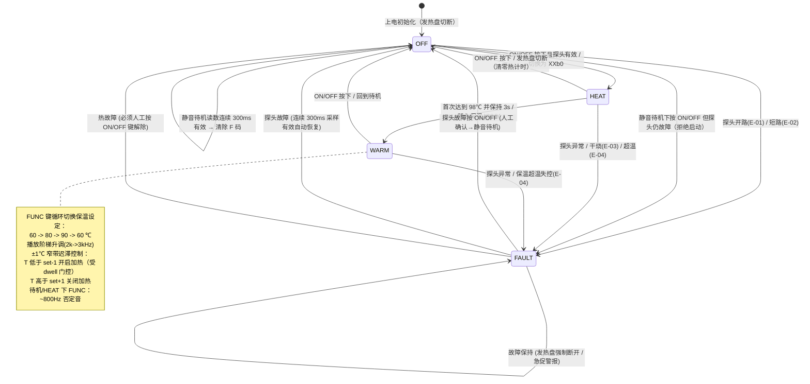

# CMS8S78xx 商用养生壶运行、测试与可观测性指南

> **应用目录**：[`wink-micro-app/mcs51_health_pot`](file:///D:/workspaces/ai-coding/wink-ai/wink-ai-embedded/wink-micro-app/mcs51_health_pot)  
> **芯片型号**：中微半导体 CMS8S78xx（1T 高速 8051 内核，片内 12-bit SAR ADC + 硬件无源蜂鸣器发生器 BUZCON）  
> **可观测性级别**：🎯 **Level 1（4COM-8SEG 数码管 + 3× 状态 LED）** + 🔊 **Level 1（硬件蜂鸣器多音调声学）** + 📜 **Level 2（UART 1Hz 结构化遥测）** + ⚡ **Level 3（继电器 Dwell 触点保护时序）**  
> **关联架构设计**：[DESIGN.md](file:///D:/workspaces/ai-coding/wink-ai/wink-ai-embedded/wink-micro-app/mcs51_health_pot/docs/DESIGN.md) · [ADR-0070~0078](../../../docs/design/decisions)  
> **适用对象**：固件工程师、嵌入式测试工程师（QA）、自动化 CI 门禁、硬件与产测工程师  

---

## 一、 程序做了什么（产品逻辑与原理全景）

本应用是基于 **CMS8S78xx** 芯片深度打造的商业级多功能养生壶（智能电热水壶）固件。通过充分挖掘 CMS8S78xx 的片内硬件外设（12-bit 高精 SAR ADC、硬件无源蜂鸣器发生器 BUZCON/BUZDIV、大电流驱动 COM 端口），构建了一个兼具高精度温控、多模态视听交互与五级安全闭环的小家电控制系统。

### 1. 核心控制逻辑与状态机

系统运行于基于 Timer0 10ms 硬件中断构建的非阻塞超级循环中，主状态机包含四大核心状态：



### 2. 外设与引脚硬件映射

| 引脚名称 | 线性号 | 硬件功能 | 驱动极性 | 物理外设说明 |
|---|---|---|---|---|
| **P0.0 / AN0** | 0 | 模拟输入 | 0~3.0V | NTC 热敏电阻测温，片内 12-bit SAR ADC 采样 |
| **P0.1** | 1 | 推挽输出 | **低有效** | 加热指示灯 LED_HEAT（0 = 点亮） |
| **P0.2** | 2 | 推挽输出 | **低有效** | 保温指示灯 LED_WARM（0 = 点亮） |
| **P0.3 / BUZ** | 3 | 硬件输出 | 50% 矩形波 | 硬件蜂鸣器发生器（BUZCON/BUZDIV 驱动无源蜂鸣器） |
| **P0.4** | 4 | 准双向上拉 | **低有效** | ON/OFF 电源按键（20 ms 软件消抖） |
| **P0.5** | 5 | 准双向上拉 | **低有效** | FUNC 功能按键（20 ms 软件消抖） |
| **P0.6** | 6 | 推挽输出 | **低有效** | 故障指示灯 LED_ERR（故障态 1 Hz 闪烁） |
| **P1.0..P1.7** | 8..15 | 推挽输出 | **高有效** | 4COM-8SEG 数码管段码 a, b, c, d, e, f, g, dp |
| **P2.0** | 16 | 推挽输出 | **高有效** | 发热盘加热继电器 HEATER（1 = 吸合加热） |
| **P3.0..P3.3** | 24..27 | 高灌电流 | **低有效** | 4COM-8SEG 数码管位选 COM0, COM1, COM2, COM3（专用，不再与 UART 复用） |
| **P2.1 / RXD** | 17 | 数字复用 | TTL | UART0 接收（引脚重映射，9600 bps） |
| **P2.2 / TXD** | 18 | 数字复用 | TTL | 串口遥测输出（引脚重映射，9600 bps，每秒一帧）；P3.0/P3.1 全部留给数码管 COM 驱动 |

---

### 3. 人机视听反馈与真值状态速查表

测试人员在测试时，可直接对照下表核对当前工作状态、数码管字符、蜂鸣器音律及执行器行为：

| 工作状态 | 4COM-8SEG 数码管 | 硬件蜂鸣器声学反馈 | 加热灯 (P0.1) | 保温灯 (P0.2) | 故障灯 (P0.6) | 继电器 (P2.0) |
|---|---|---|---|---|---|---|
| **OFF（待机态）** | `" -- "`（居中横杠） | 静音（按键时 4000 Hz / 30 ms 机械按键音） | 灭 | 灭 | 灭 | **断开 (0)** |
| **OFF（静音待机，探头故障已确认）** | `" -- "` | 报警停止；读数恢复播 G6 单音；再按 ON/OFF 被拒时重新报警 | 灭 | 灭 | 灭 | **锁定断开 (0)**（遥测 S=0,F=1/2） |
| **HEAT（全速烧水中）** | `"25b0"`（当前温 + b0，dp 点 1Hz 闪烁） | 4000 Hz 开机音 | **常亮 (0)** | 灭 | 灭 | **吸合 (1)** |
| **HEAT（沸腾确认 3s）** | `"98b0"`（dp 熄灭指示加热关断） | 3s 倒计时期间静音 | **常亮 (0)** | 灭 | 灭 | **断开 (0)** |
| **WARM（保温降温中）** | `"9860"`（前 2 位实际温，后 2 位目标温） | 转换瞬间播放 C6-E6-G6-C7 和弦旋律 | 灭 | **常亮 (0)** | 灭 | **断开 (0)** |
| **WARM（保温再加热）** | `"5960"`（T < 目标 - 1℃） | FUNC 切换播放 2kHz→3kHz 升调音 | 灭 | **常亮 (0)** | 灭 | **吸合 (1)**（受 3s Dwell 保护） |
| **FAULT: E-01** | `"E-01"`（NTC 探头开路/拔脱） | 3kHz/2kHz 急促交替双音报警（60s 超时静音） | 灭 | 灭 | **1 Hz 闪烁** | **强制切断 (0)** |
| **FAULT: E-02** | `"E-02"`（NTC 探头短路/击穿） | 3kHz/2kHz 急促交替双音报警（60s 超时静音） | 灭 | 灭 | **1 Hz 闪烁** | **强制切断 (0)** |
| **FAULT: E-03** | `"E-03"`（干烧报警：25s 未过 45℃，或 60s 未沸腾） | 3kHz/2kHz 急促交替双音报警（Sticky 锁存） | 灭 | 灭 | **1 Hz 闪烁** | **强制切断 (0)** |
| **FAULT: E-04** | `"E-04"`（超温报警：连续 10s > 105℃） | 3kHz/2kHz 急促交替双音报警（Sticky 锁存） | 灭 | 灭 | **1 Hz 闪烁** | **强制切断 (0)** |

---

## 二、 可观测性与仿真升维体系

本工程在 UniSim 仿真框架下实现了全方位的**信号升维与多维观测**：

```
                             ┌────────────────────────────────────────────────────────┐
                             │       嵌入式底层物理信号（MCS-51 仿真与硬件真实寄存器）      │
                             │   • P3.0..3 / P1.0..7 动态多路复用扫描 (25Hz 快速刷新)   │
                             │   • P0.3 BUZCON/BUZDIV 硬件定时器产生的方波调频         │
                             │   • P2.0 继电器开关脉冲与 Dwell 触点保护防抖              │
                             │   • AN0 模拟轨连续电压采样 (12-bit SAR ADC)             │
                             │   • P2.2 UART SBUF 字节流 (9600 bps，Timer1 波特率)    │
                             └───────────────────────────┬────────────────────────────┘
                                                         │
                        ┌────────────────────────────────┴───────────────────────────────┐
                        ▼                                                                ▼
      【维度 A: 升维至 Level 1/2 直观视听】                          【维度 B: 确定性自动化 CI 门禁】
     UniSim 虚拟外设与插件支持:                                      `unisim-scenarios/*.scenario.json`
     • 4COM-8SEG: POV 视觉暂留解码算法直接输出文本                   • 15 大自动化测试场景全面覆盖
       （`ASSERT_POINT target: "plugin:display/text"`）              • 纳秒/微秒级确定性时钟推进
     • 硬件蜂鸣器: 转换为实时音频合成与频率/占空比观测                 • 继电器开关、温度边界、热故障锁存断言
     • UART 遥测: `BusAnalyzer` 自动分帧与结构化断言                 • 彻底杜绝软硬件回归缺陷
```

1. **数码管动态扫描升维（POV 视觉暂留解码）**：  
   在物理硬件上，COM 与 SEG 是以 10 ms 间隔分时轮流点亮的。UniSim 搭载了 `direct_gpio_4d` 视觉暂留（Persistence of Vision）解码器，将快速切换的段码信号还原为人眼感知的完整字符串（如 `"25b0"`、`"E-02"`），测试脚本可以直接使用文本断言。
2. **硬件蜂鸣器发生器声学仿真**：  
   `BUZCON` 和 `BUZDIV` 的寄存器写入被实时映射为 `buzzer` 插件的音频振荡信号，不仅在 Web UI 中可以直接听到按键点击与沸腾旋律，在无头自动化中还能对频率和启闭时刻进行精准断言。
3. **结构化串口遥测分帧（ADR-0065）**：  
   固件每秒输出 `T=...C,S=...,H=...,F=...\n`，仿真框架依据字节间隔自动切包，支持测试脚本按精确时间窗口执行 `ASSERT_BUS_PAYLOAD` 匹配。

---

## 三、 如何构建与运行

所有构建、测试与仿真操作均由统一跨平台工具 `wink.py` 驱动。

### 1. 真实编译输出仿真资产（Real Build）

在执行测试或启动仿真前，执行 Wasm 真实编译：

```powershell
python packages/wink-tools/wink.py build sim --app mcs51_health_pot
```

> **产物检查**：编译成功后将在 [`unisim-assets/`](file:///D:/workspaces/ai-coding/wink-ai/wink-ai-embedded/wink-micro-app/mcs51_health_pot/unisim-assets) 目录下生成：
> * `device-tree.json`（设备树定义：数码管、蜂鸣器、继电器、LED、按键）
> * `wink_simulator.js`（Wasm 胶水文件）
> * `wink_simulator.wasm`（CMS8S78xx 仿真微内核固件）

### 2. 启动浏览器 GUI 交互式仿真（Web UI）

启动本地交互式仿真服务器并在浏览器中观察与操作：

```powershell
python packages/wink-tools/wink.py sim run --app mcs51_health_pot
```

终端将启动本地 HTTP 服务，浏览器自动打开仿真工作台。界面包含 4 位数码管、无源蜂鸣器声学组件、发热继电器状态、3 颗指示灯以及 ON/OFF 与 FUNC 交互按钮。

### 3. 一键运行全自动化 Headless 测试套件

在终端以无头（Headless）批处理模式运行全部 15 个自动化测试场景：

```powershell
python packages/wink-tools/wink.py sim run `
  --mode headless --app mcs51_health_pot `
  --scenarios ../wink-ai-embedded/wink-micro-app/mcs51_health_pot/unisim-scenarios
```

---

## 四、 测试验证全指南

### 1. 方式 A：浏览器 Web UI 人机交互手动测试（操作手册）

测试人员打开 Web UI 仿真界面后，可按以下步骤逐项验证产品功能：

#### 测试用例 1：开机烧水与沸腾保持验证（Happy Path）
1. **上电初态观察**：
   * 观察数码管：显示 `" -- "`（居中横杠）。
   * 观察指示灯与继电器：加热灯、保温灯、故障灯均熄灭；加热继电器处于断开态。
2. **开机启动**：
   * 鼠标单击虚拟按键 `btn_onoff`；
   * **现象**：听到 4000 Hz 清脆按键点击声；数码管立即切换为 `"25b0"`（25 表示当前水温 25 ℃，b0 表示沸腾加热，dp 小数点以 1 Hz 呼吸闪烁）；红色加热灯 `led_heat` 点亮；继电器 `heater_relay` 吸合开始全功率加热。
3. **水温上升至沸腾**：
   * 在模拟量调节滑块中将 NTC 温度逐步提升至 98 ℃；
   * **现象**：数码管实时刷新当前水温（如 `"45b0"` -> `"70b0"` -> `"98b0"`）；达到 98 ℃ 瞬间，dp 点停止闪烁，继电器立即断开进入 **3 秒沸腾确认期**；
   * 3 秒倒计时结束后，扬声器播放优雅的 **Do-Mi-Sol-Do 四音上行和弦旋律**；数码管自动切换为 `"9860"`；加热红灯熄灭，绿色保温灯 `led_warm` 点亮，系统无缝进入保温状态。

#### 测试用例 2：保温档位切换与迟滞温控
1. **档位切换**：
   * 在保温状态下单击 `btn_func`；
   * **现象**：蜂鸣器播放 2000 Hz → 3000 Hz 阶梯升调音；数码管显示由 `"9860"` 切换为 `"9880"`（设定值提升至 80 ℃）；再次点击切换为 `"9890"`（90 ℃）；第三次点击循环回 60 ℃。
2. **迟滞再加热（±1 ℃ Bang-bang）**：
   * 在 60 ℃ 保温档位下，调整水温至 58 ℃（低于设定值 - 1 ℃）；
   * **现象**：加热继电器重新吸合，绿色保温灯保持点亮；调整水温回升至 61 ℃（高于设定值 + 1 ℃），加热继电器断开。

#### 测试用例 3：探头故障（开路/短路）与自动恢复
1. **探头拔脱（开路）**：
   * 在加热过程中，将 NTC 模拟输入拉至满量程（开路：12-bit 原始码 4095 / valueNorm 1.0）；
   * **现象**：发热继电器**在 100 ms 内瞬时强制切断**；红色故障灯 `led_fault` 以 1 Hz 频率闪烁；数码管显示国际家电故障码 `"E-01"`；蜂鸣器发出 3000 Hz / 2000 Hz 急促交替报警音。
2. **探头恢复（滤波去抖）**：
   * 将模拟输入重新调整回正常室温（如 25 ℃）；
   * **现象**：系统经过 300 ms 滤波确认后，报警音停止并播放 G6 短促提示音；故障灯熄灭；数码管显示回退到待机状态 `" -- "`；**安全保证：加热器绝不会自动重新通电加热**。
3. **人工确认静音待机（任何状态电源键都安全）**：
   * 在 E-01/E-02 报警中按一次 `btn_onoff`；
   * **现象**：报警音立即停止、故障灯熄灭、数码管回到 `" -- "`，继电器保持断开（遥测为 `S=0,F=1/2`）；此时再按 `btn_onoff` 试图开机，会被**拒绝**并重新弹出 `E-01/E-02` 报警（防盲加热），伴随 ~800 Hz 否定音；探头修好（读数恢复正常）后约 300 ms 自动清除 F 码并播 G6 提示音，之后可正常开机。
4. **待机/加热态按 FUNC 的反馈**：在 OFF 或 HEAT 态按 `btn_func` 不切档（档位只在保温态有效），但蜂鸣器播放 ~800 Hz / 30 ms 否定音，明确提示"按键已识别但当前无效"。

#### 测试用例 4：干烧保护（Dry-fire，两级看门狗）与 Sticky 锁存
1. **注入干烧工况（一级）**：
   * 开机启动加热，保持输入温度持续低于 45 ℃ 长达 25 秒（模拟壶中无水导致探头感温失败）；
   * **现象**：计时满 25 秒瞬间，继电器立即切断；数码管锁死显示 `"E-03"`；故障灯 1 Hz 闪烁，报警音持续鸣响。
2. **二级（沸腾超时）盲区验证**：
   * 将温度稳定在 45 ℃ 以上但始终到不了 98 ℃（如保持 55 ℃，模拟敞盖散热/低电压/半壶水）；
   * **现象**：一级看门狗因温度 ≥ 45 ℃ 不触发，但加热器持续通电满 60 秒仍未沸腾时，二级看门狗以同一个 `"E-03"` 锁断（真机二级阈值需标定为 600~900 s）。
3. **验证 Sticky 锁存（热故障优先级最高）**：
   * 此时无论注入何种温度（包括探头短路 0V），故障码始终锁定为 `"E-03"`，绝不降级，也不自动消除；
   * 故障蜂鸣器在持续报警 60 秒后自动静音（防扰民保护），但故障灯与数码管持续警告；
   * **解除故障**：必须由人工点击 `btn_onoff` 键，系统才安全复位回到待机 `" -- "`。

---

### 2. 方式 B：Headless 确定性场景自动化测试矩阵（CI 门禁）

工程内置 **15 大标准场景脚本**（位于 [`unisim-scenarios/`](file:///D:/workspaces/ai-coding/wink-ai/wink-ai-embedded/wink-micro-app/mcs51_health_pot/unisim-scenarios) 目录下），全面覆盖各种功能分支与安全临界点：

| # | 场景脚本文件名 | 核心验证内容与覆盖路径 | 关键断言点 |
|:---:|---|---|---|
| 1 | [`health-pot-display-buzzer.scenario.json`](file:///D:/workspaces/ai-coding/wink-ai/wink-ai-embedded/wink-micro-app/mcs51_health_pot/unisim-scenarios/health-pot-display-buzzer.scenario.json) | **CMS8S 专属外设验证**：待机 `" -- "` → 加热 `"25b0"` → 沸腾 `"98b0"` → 保温 `"9860"` → 故障 `"E-02"` 字符解码断言 | `plugin:display/text` 全流程文本匹配、继电器联动 |
| 2 | [`health-pot-boil-warm.scenario.json`](file:///D:/workspaces/ai-coding/wink-ai/wink-ai-embedded/wink-micro-app/mcs51_health_pot/unisim-scenarios/health-pot-boil-warm.scenario.json) | **标准业务全流程（Happy Path）**：开机加热 → 98℃ 沸腾 → 3s 确认期 → 转入保温 → FUNC 循环切档 → 关机 | 加热继电器吸合/断开、指示灯电平、UART 遥测帧 `S=1` / `S=2` |
| 3 | [`health-pot-boil-confirm-dip.scenario.json`](file:///D:/workspaces/ai-coding/wink-ai/wink-ai-embedded/wink-micro-app/mcs51_health_pot/unisim-scenarios/health-pot-boil-confirm-dip.scenario.json) | **沸腾确认期温度回落抗扰**：达到 98℃ 后温度回落至 60℃，验证继电器不提前重热，必须满 3s 进保温 | `plugin:heater_relay/on: false`、计时不被清零 |
| 4 | [`health-pot-fault-guard.scenario.json`](file:///D:/workspaces/ai-coding/wink-ai/wink-ai-embedded/wink-micro-app/mcs51_health_pot/unisim-scenarios/health-pot-fault-guard.scenario.json) | **NTC 探头短路保护与自动恢复**：加热中注入短路码 → FAULT（继电器即时断开）→ 探头恢复 300ms 去抖 → 回 OFF | 继电器切断、遥测 `S=3,F=2`、恢复后 `S=0,F=0` 且不自加热 |
| 5 | [`health-pot-ntc-open.scenario.json`](file:///D:/workspaces/ai-coding/wink-ai/wink-ai-embedded/wink-micro-app/mcs51_health_pot/unisim-scenarios/health-pot-ntc-open.scenario.json) | **NTC 探头开路保护**：加热中注入满量程拔脱码（原始码 4095）→ FAULT → 探头恢复 300ms 去抖 → 自动回待机 | 遥测 `S=3,F=1`、继电器强制关断 |
| 6 | [`health-pot-dryfire.scenario.json`](file:///D:/workspaces/ai-coding/wink-ai/wink-ai-embedded/wink-micro-app/mcs51_health_pot/unisim-scenarios/health-pot-dryfire.scenario.json) | **干烧保护 Sticky 锁存**：持续加热 25s <45℃ 触发 F=3 → 注入短路不降级 → 恢复探头不自除 → 手动解除 | 遥测 `S=3,H=0,F=3` 稳定锁存、按键后复位 `S=0,F=0` |
| 7 | [`health-pot-overtemp.scenario.json`](file:///D:/workspaces/ai-coding/wink-ai/wink-ai-embedded/wink-micro-app/mcs51_health_pot/unisim-scenarios/health-pot-overtemp.scenario.json) | **保温超温保护（Thermal Runaway）**：保温状态下注入过热码持续 10s → 触发 F=4 保护锁存 | 遥测 `S=3,H=0,F=4`、必须手动按键清除 |
| 8 | [`health-pot-relay-dwell.scenario.json`](file:///D:/workspaces/ai-coding/wink-ai/wink-ai-embedded/wink-micro-app/mcs51_health_pot/unisim-scenarios/health-pot-relay-dwell.scenario.json) | **继电器 Dwell 触点保护**：断开边沿 0 延迟即时生效；再吸合边沿严格受满 3 秒最小断开间隔门控 | 频繁温度振荡下继电器吸合受时钟门控，抑制频繁跳火 |
| 9 | [`health-pot-uart-telemetry.scenario.json`](file:///D:/workspaces/ai-coding/wink-ai/wink-ai-embedded/wink-micro-app/mcs51_health_pot/unisim-scenarios/health-pot-uart-telemetry.scenario.json) | **UART 遥测链路**：待机态首帧 `T=025C,S=0,H=0,F=0`、加热态连续周期帧 `S=1,H=1` | `ASSERT_BUS_PAYLOAD` 帧内容与周期连续性（真机对应 Timer1 波特率初始化，防首帧死等 TI 死锁） |
| 10 | [`health-pot-display-cold-hold-clamp.scenario.json`](file:///D:/workspaces/ai-coding/wink-ai/wink-ai-embedded/wink-micro-app/mcs51_health_pot/unisim-scenarios/health-pot-display-cold-hold-clamp.scenario.json) | **显示标定边界**：5℃ 冷水显示 `"05b0"`（冷端锚点）、沸腾确认期 dp 熄灭（`segMask=[111,127,124,63]`）、105℃ 钳位 `"9960"` 不乱码 | `plugin:display/text` + `segMask` 段码精确断言 |
| 11 | [`health-pot-fault-blink-1hz.scenario.json`](file:///D:/workspaces/ai-coding/wink-ai/wink-ai-embedded/wink-micro-app/mcs51_health_pot/unisim-scenarios/health-pot-fault-blink-1hz.scenario.json) | **故障灯 1Hz 闪烁**：E-02 后 2.05s 灭 / 2.55s 亮 / 3.05s 灭（半周期 500ms） | 三点位 `led_fault/on` 相位采样，可区分 1Hz 与旧版 0.5Hz |
| 12 | [`health-pot-sensor-fault-powermute.scenario.json`](file:///D:/workspaces/ai-coding/wink-ai/wink-ai-embedded/wink-micro-app/mcs51_health_pot/unisim-scenarios/health-pot-sensor-fault-powermute.scenario.json) | **传感器故障电源可确认**：开机即开路 E-01 → ON/OFF 进静音待机 → 探头未恢复再按 ON/OFF 拒绝开机 → 恢复 300ms 自动清除 → 正常加热 | 任意状态电源键安全；`S=0,F=1` 静音遥测；拒绝盲加热 |
| 13 | [`health-pot-power-cycle-dwell.scenario.json`](file:///D:/workspaces/ai-coding/wink-ai/wink-ai-embedded/wink-micro-app/mcs51_health_pot/unisim-scenarios/health-pot-power-cycle-dwell.scenario.json) | **快速重启 Dwell**：HEAT 关机立即重开，断开 0 延迟、再吸合仍须等满 3s | 再吸合路径统一 dwell 门控，无零间隔拉弧 |
| 14 | [`health-pot-dryfire-stall.scenario.json`](file:///D:/workspaces/ai-coding/wink-ai/wink-ai-embedded/wink-micro-app/mcs51_health_pot/unisim-scenarios/health-pot-dryfire-stall.scenario.json) | **二级干烧**：水温停滞 55℃（越过一级 45℃ 盲区）持续加热 60s 未沸腾 → E-03 | `S=3,F=3` 锁存、手动解除 |
| 15 | [`health-pot-overtemp-heat.scenario.json`](file:///D:/workspaces/ai-coding/wink-ai/wink-ai-embedded/wink-micro-app/mcs51_health_pot/unisim-scenarios/health-pot-overtemp-heat.scenario.json) | **加热越界不假沸腾**：HEAT 中 raw≈15 期间继电器强制断开且不转 WARM，10s 后 E-04 | 无沸腾旋律误播；`S=3,F=4` 手动解除 |

#### 深度解析：专属数码管与蜂鸣器场景时序表（`health-pot-display-buzzer`）

| 步骤 | 仿真时间 (timeUs) | 动作类型 / 目标 | 预期值 / 参数 | 物理与测试意义 |
|:---:|:---:|---|:---:|---|
| 1 | `30ms` | `INPUT_ANALOG` -> 通道 32 | `valueNorm: 0.0586` | 上电初始化注入室温 25 ℃ 阻值，通过上电自检 |
| 2 | `200ms` | `ASSERT_POINT` -> `plugin:display/text` | `" -- "` | **待机显示断言**：验证 POV 动态扫描输出待机符号 |
| 3 | `400ms` | `INPUT_PLUGIN_EVENT` -> `btn_onoff` | `SET_PRESSED: true` | 按下 ON/OFF 电源键 |
| 4 | `600ms` | `INPUT_PLUGIN_EVENT` -> `btn_onoff` | `SET_PRESSED: false` | 释放 ON/OFF 电源键（完成有效按键脉冲） |
| 5 | `1200ms` | `ASSERT_POINT` -> `plugin:display/text` | `"25b0"` | **加热显示断言**：验证开机后显示温度 25 与沸腾加热标识 `b0` |
| 6 | `1200ms` | `ASSERT_POINT` -> `plugin:heater_relay/on` | `true` | **加热器吸合断言**：验证继电器闭合开始加热 |
| 7 | `1600ms` | `INPUT_ANALOG` -> 通道 32 | `valueNorm: 0.0047`（原始码 ≈19） | 注入沸腾水温 98 ℃ |
| 8 | `2000ms` | `ASSERT_POINT` -> `plugin:display/text` | `"98b0"` | **沸腾显示断言**：数码管显示当前水温 98 ℃ |
| 9 | `5200ms` | `ASSERT_POINT` -> `plugin:display/text` | `"9860"` | **保温显示断言**：3s 沸腾确认完成后转入保温，前两位水温 98，后两位目标 60 |
| 10 | `5500ms` | `INPUT_ANALOG` -> 通道 32 | `valueNorm: 0.0` | 注入 NTC 探头短路故障 |
| 11 | `6000ms` | `ASSERT_POINT` -> `plugin:display/text` | `"E-02"` | **故障码断言**：验证 4 位数码管直观呈现国际家电故障码 `E-02` |
| 12 | `6000ms` | `ASSERT_POINT` -> `plugin:heater_relay/on` | `false` | **安全切断断言**：发生故障瞬间发热盘被硬件级切断 |

---

### 3. 方式 C：串口 UART 遥测分析与产测监听

固件集成了全自动串口遥测功能（UART0 重映射到 **P2.2(TXD)/P2.1(RXD)**，Timer1 模式 2 自动重装 + T1M(Fosc/4) + SMOD 倍频，TH1=0xD9 → 实测 9615 bps，误差 0.16%；每秒发送一帧），数据帧格式如下：

```
T=025C,S=1,H=1,F=0\n
```

| 字段名 | 格式 | 含义说明 | 取值范围 |
|---|---|---|---|
| `T=` | 固定 3 位数字 | 当前水温（摄氏度） | `000` ~ `105` ℃ |
| `S=` | 1 位数字 | 主状态机运行状态 | `0`: OFF（待机） · `1`: HEAT（加热） · `2`: WARM（保温） · `3`: FAULT（故障） |
| `H=` | 1 位数字 | 加热继电器驱动电平 | `0`: 断开停止加热 · `1`: 吸合通电加热 |
| `F=` | 1 位数字 | 故障代码 | `0`: 正常 · `1`: 探头开路 · `2`: 探头短路 · `3`: 干烧保护（25s/60s 两级） · `4`: 超温保护。注：静音待机下允许 `S=0,F=1/2`（故障已人工确认、继电器锁定断开） |

> 💡 **产测提示**：自动化产测机床或上位机工装只需通过 USB 转 TTL 串口连接 **P2.2（TXD）** 与 GND，即可直接读取该字符串完成整机功能自动化检验，无需拆开外壳。

---

## 五、 物理硬件真机对照验证与量产测试建议

若工程师将本固件烧录至中微半导体 **CMS8S78xx 物理开发板或小家电量产控制板**，请参照以下硬件接线与工程指导：

### 1. 物理引脚接线与外围电路

```
                       ┌──────────────────────────────┐
                       │     CMS8S78xx 48-Pin MCU     │
                       │                              │
[NTC 10k 分压] ───────>│ P0.0 (AN0)                   │
[加热红灯 LED] <───────│ P0.1 (推挽强灌, 串 1k 电阻)    │
[保温绿灯 LED] <───────│ P0.2 (推挽强灌, 串 1k 电阻)    │
[无源蜂鸣器]   <───────│ P0.3 (BUZ 硬件 PWM, 串 100Ω)  │
[ON/OFF 按键] ────────>│ P0.4 (内上拉, 按键接地)        │
[FUNC 按键]   ────────>│ P0.5 (内上拉, 按键接地)        │
[故障红灯 LED] <───────│ P0.6 (推挽强灌, 串 1k 电阻)    │
                       │                              │
[数码管 SEG a..dp] <───│ P1.0..P1.7 (32.7mA 推挽输出) │ ──> 4 位 8 段共阴数码管
[发热盘继电器驱动] <───│ P2.0 (接 NPN/NMOS 驱动线圈)   │ ──> 220V 1000W 发热盘
[数码管 COM0..3]  <───│ P3.0..P3.3 (150mA 高灌电流口) │ ──> 数码管阴极选通
[串口遥测 TXD] ───────>│ P2.2 (9600 bps TXD, 重映射)  │ ──> 上位机 / 产测工装
                       └──────────────────────────────┘
```

### 2. 仪器打点观测指南

1. **示波器探测 P0.3（硬件蜂鸣器）**：
   * 在按键按下瞬间，示波器可抓取到精确的 4.0 kHz 50% 占空比方波，持续 30 ms；
   * 在沸腾完成时，示波器可观测到频率依次上扬的 4 组阶梯方波（1042 Hz -> 1320 Hz -> 1562 Hz -> 2106 Hz）。
2. **逻辑分析仪抓取 P3.0..3 与 P1.0..7（数码管动态扫描）**：
   * P3.0~P3.3 低电平依次轮流拉低，单槽宽度约为 10 ms，全场循环周期为 40 ms；
   * 段码 P1.0~P1.7 在对应槽位输出匹配字符字模，无明显重叠鬼影。

### 3. 量产安规与硬件防护指导（GB 4706.1 / GB 4706.19）

* **双重硬件保护（强制）**：软件保护（干烧看门狗、超温检测）不得作为唯一安全手段。加热回路必须物理串联**自恢复双金属片突跳温控器**（如 105℃ KSD301）与**一次性温度保险丝（TCO）**（如 135℃ 10A/250V），确保 MCU 跑飞或继电器触点熔焊粘连时硬件独立断电。
* **继电器线圈反电动势泄放**：继电器驱动线圈两端必须反向并联 1N4148 二极管，防止关断反峰浪涌串入 MCU 电源轨导致复位。
* **NTC 端口滤波**：NTC 测温线必须并联 100nF 陶瓷电容并串接 1kΩ 隔离电阻，防止 220V 交流发热盘启闭产生的空间电磁辐射干扰 ADC 采样。

---

## 六、 常见测试问题排查（Troubleshooting & FAQ）

### Q1: 运行自动化测试或启动仿真时，为什么数码管有时会显示 "E-02"？
> **解答**：`E-02` 为 NTC 探头短路故障（代码 $\le 8$）。在模拟仿真环境中，如果未向模拟轨（CH3）注入任何模拟电压，初始电压默认视作 0V（对应电阻极小短路）。所有场景脚本均在上电前（如 30 ms）注入有效冷水水温。手动测试时若清空了模拟输入，即会触发探头安全防护，属正常保护行为。

### Q2: 为什么水温烧到 98 ℃ 之后水温回落到 92 ℃，发热盘没有立刻重新启动？
> **解答**：这属于防振荡保护设计。在烧水过程中，首次达到 98 ℃ 时系统会进入 **3 秒沸腾确认期**。在确认期内，无论水温由于传感器滞后或热惯性如何波动，发热盘均保持关断并倒计时 3 秒，防止继电器在临界点频繁跳火损坏。3 秒结束后系统自动进入保温控制。

### Q3: 为什么发生干烧（E-03）或超温（E-04）后，将水温调回正常室温依然不能开机？
> **解答**：这是符合工业安全标准的 **Sticky 锁存机制**。干烧与超温属于严重热故障，必须由用户确认壶内重新加水后，**手动单击 ON/OFF 按键**才能解除锁定。探头自动读数绝不会消除热故障。

### Q4: 故障报警声持续响了一分钟后为什么自动停止了？
> **解答**：根据国际标准 IEC 60335-1 对家用电器扰民控制的要求，固件内置了 `FAULT_BEEP_TIMEOUT = 60s` 超时静音机制。报警 60 秒后硬件蜂鸣器自动关闭，但红色故障灯将继续保持 1 Hz 闪烁，数码管持续显示故障码，兼顾安全性与人机舒适性。

### Q5: 探头故障报警（E-01/E-02）响个不停时，按电源键能关机吗？
> **解答**：能，而且任何状态下电源键都是安全的。传感器故障时按一次 ON/OFF 会**人工确认故障**：停止声光报警、显示回 `" -- "`、继电器锁定断开（遥测仍为 `S=0,F=1/2`，便于售后读取）。此状态下若再次按 ON/OFF 试图开机，固件会拒绝并重新弹出故障，避免在无法测温时盲加热；探头恢复正常约 300 ms 后故障码自动清除（播 G6 提示音），随后即可正常开机。热故障 E-03/E-04 仍保持 Sticky，必须人工按 ON/OFF 解锁。
