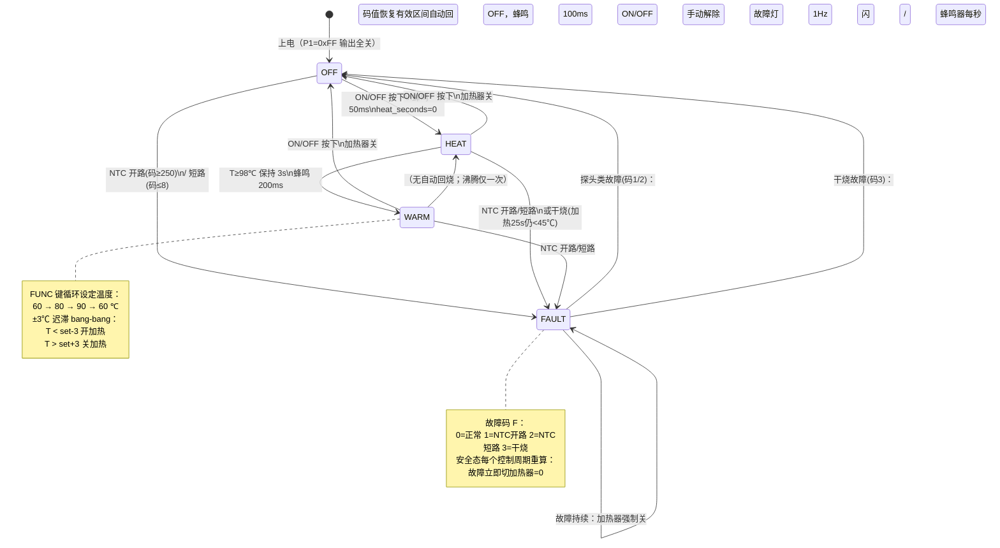

# mcs51_thermos —— 养生壶（电热水壶）仿真应用设计文档

> 平台：WinkMicroOS · MCS-51 零侵入仿真拦截层（Axis-B，ADR-0070~0076）
> MCU 模型：AT89C52 内核（REGX52.H 方言）+ 外置 ADC0832 测温
> 仿真通道：CH1 GPIO（输入/输出/外部中断）· CH2 UART（遥测）· CH3 模拟量（NTC→ADC0832）
> 固件：`thermos.c`（Keil C51 风格，经 `mcs51_cleanup.py` 清洗为 C++17 原生/wasm 编译，源码不改）

---

## 1. 功能概述

养生壶典型小家电控制程序：NTC 探头测温 → 继电器驱动发热盘 → 按键交互 → LED/蜂鸣器反馈。

| 功能 | 说明 |
|---|---|
| 烧水模式（HEAT） | 开机后全功率加热，水温达到 98 ℃ 判定沸腾，保持 3 s（防假沸）后自动转入保温 |
| 保温模式（WARM） | 目标温度 60/80/90 ℃ 三档，FUNC 键循环切换；±3 ℃ 迟滞 bang-bang 控温，防继电器抖动 |
| 关机（OFF） | 任意工作状态按 ON/OFF 回到待机，加热器关断 |
| 按键交互 | ON/OFF（P3.2，兼 INT0）、FUNC（P3.3，兼 INT1），20 ms 软件消抖，按下蜂鸣器 50 ms 短鸣 |
| 声音提示 | 有源蜂鸣器：按键 50 ms、沸腾完成 200 ms、故障进入 1 s、故障态每秒 100 ms 短促报警 |
| 指示灯 | 加热灯（HEAT，加热中亮）、保温灯（WARM，保温态亮）、故障灯（FAULT，故障态 1 Hz 闪烁） |
| 安全保护 | ① NTC 开路（ADC 码 ≥250）② NTC 短路/脱落（ADC 码 ≤8）③ 干烧保护（加热器连续工作 25 s 水温仍 <45 ℃）。任一触发立即关断加热器并进入 FAULT；探头类故障在探头恢复后自动回 OFF（不自动重启加热），干烧故障需人工按 ON/OFF 解除 |
| 串口遥测 | UART mode-1，每秒一帧：`T=<温度>C,S=<状态>,H=<加热>,F=<故障码>\n`，供 headless `ASSERT_BUS_PAYLOAD` 断言与上位机观测 |
| 软件时基 | Timer0 mode-1，10 ms 周期中断（12 MHz 教学晶振，1 计数=1 µs，重装 65536−10000=0xD8F0） |

**不做（超出当前通道能力或非本产品需求）**：OLED 显示（bit-bang I2C 从机模型为 Stage-3 Class A 未建项，本设计用 LED+UART 替代显示）；无源蜂鸣器音调（PWM 调频为 Stage-3 项，用有源蜂鸣器 GPIO 开关替代）；WS2812/网络/DAC/电机（8051 不适用或 Class B）。

---

## 2. 硬件清单（BOM）

| # | 器件 | 型号/规格 | 作用 | 仿真映射 |
|---|---|---|---|---|
| 1 | MCU | STC89C52 / AT89C52 类（40 DIP） | 主控 | `mcs51_devboard`，P0–P3 线性引脚 0–31 |
| 2 | ADC | ADC0832（8-bit 串行 SAR，3 线） | NTC 电压采样（89C52 片内无 ADC） | Level-2 pin-trap 从机模型 `mcs51_adc0832.cpp`，模拟轨 pin 32（CH0） |
| 3 | 温度探头 | NTC 热敏电阻 10kΩ（B≈3950）+ 上拉至 VREF | 水温→电压（上拉接法：**码值冷高热低**） | headless `INPUT_ANALOG` 驱动 rail pin 32 |
| 4 | 加热器 | 发热盘 + 继电器/可控硅模组 | 加热执行 | GPIO 输出 → `led` 型插件 `heater_relay`（开关量观测点） |
| 5 | 蜂鸣器 | 有源蜂鸣器（5 V，内置振荡） | 按键/完成/报警提示 | GPIO 输出 → `led` 型插件 `buzzer` |
| 6 | 指示灯 ×3 | LED（红=加热 / 绿=保温 / 红=故障） | 状态指示 | GPIO 输出 → `led` 插件 `led_heat/led_warm/led_fault`（低电平点亮） |
| 7 | 按键 ×2 | 轻触按键（接地，内部上拉） | ON/OFF、FUNC | GPIO 输入 → `button` 插件 `btn_onoff/btn_func`（低有效） |
| 8 | 串口 | 片内 UART（TXD=P3.1） | 遥测输出 | CH2：`js_pal_uart_write` → UARTBus TX 时间线 |

> 说明：headless 内置插件类型清单中无独立 `relay`/`buzzer` 类型，二者与 `led` 同为单脚开关量执行器，故设备树统一用 `type: "led"` 声明（状态通道 `on`）；电气语义由标签与固件逻辑区分。真机上继电器/蜂鸣器为独立驱动电路，引脚分配不变。

---

## 3. 引脚分配

线性引脚号 = `port×8 + bit`（P0.0–P3.7 → 0–31，ADR-0074 D3）；模拟轨 pin = `32 + ADC通道号`。

| 引脚 | 线性号 | 方向 | 器件/信号 | 有效电平 | 备注 |
|---|---|---|---|---|---|
| P1.0 | 8 | 输出 | 加热继电器 HEATER | 高 | 继电器吸合=加热 |
| P1.1 | 9 | 输出 | 有源蜂鸣器 BUZZER | 高 | — |
| P1.2 | 10 | 输出 | 加热指示灯 LED_HEAT | **低** | 0=点亮 |
| P1.3 | 11 | 输出 | 保温指示灯 LED_WARM | **低** | 0=点亮 |
| P1.4 | 12 | 输出 | 故障指示灯 LED_ERR | **低** | 1 Hz 闪烁 |
| P2.0 | 16 | 输出 | ADC0832 CS | 低有效 | 板级 codegen 绑定（`mcs51_board_config.h`） |
| P2.1 | 17 | 输出 | ADC0832 CLK | — | bit-bang 时钟 |
| P2.2 | 18 | 双向 | ADC0832 DIO（DI/DO 共线，3 线制） | — | 采样时切换方向 |
| P3.1 | 25 | 输出 | UART TXD（遥测） | — | SCON mode 1，轮询发送 |
| P3.2 | 26 | 输入 | ON/OFF 按键（兼 INT0） | **低** | 20 ms 消抖；EXT int 模型轮询 |
| P3.3 | 27 | 输入 | FUNC 按键（兼 INT1） | **低** | 20 ms 消抖 |
| 模拟轨 32 | — | 输入 | NTC（ADC0832 CH0） | — | `INPUT_ANALOG adcChannel:32` |

未用引脚：P0 口全部、P1.5–P1.7、P2.3–P2.7、P3.0(RXD)/P3.4(T0)/P3.5(T1)/P3.6/P3.7。
> 注：按键走主循环轮询消抖（功能级保真足够）；INT0/INT1 外部中断模型（`mcs51_extint.cpp`）同时存在但本固件未挂 `interrupt 0/2` ISR，引脚复用无冲突。

> **仿真关键约定（准双向口初始化）**：8051 准双向口**上电复位即为输入态（锁存器=1）**，故输入引脚（按键 P3.2/P3.3、RXD P3.0）**固件无需也不应写 `P3 = 0xFF`**。拦截层 SFR shadow 为 BSS（初值 0）：若固件对输入口写 1，会产生 0→1 diff 边沿，把 MCU 登记为该引脚的**强高驱动者**，与 button 插件的强低驱动在 PinArbiter 中冲突，读脚回退锁存值 → 按键永远读为高（失效）。本固件 `main()` 只初始化**输出口** `P1=0xFF`（执行器/LED idle）、`P2=0xFF`（ADC CS idle），**不写 P3**，与 `iron_ntc`/`button_led` 已验证惯例一致。

---

## 4. 软件架构

### 4.1 任务分层（超级循环 + Timer0 时基）

```
Timer0 ISR (10 ms)                主循环 main while(1)
┌───────────────────┐            ┌──────────────────────────────────────┐
│ 重装 TH0/TL0       │            │ _nop_() 协作微步（fiber 让出/事件汇合）│
│ tick_flag = 1     │ ──置位──▶  │ 每 10 ms：button_scan() 消抖扫描      │
└───────────────────┘            │ 每 100 ms：control_task() 测温+状态机 │
                                 │ 每 1 s：  one_second_task()          │
                                 │           干烧看门狗 + UART 遥测       │
                                 │ 每 10 ms：outputs_refresh() 输出刷新  │
                                 └──────────────────────────────────────┘
```

- **测温**：`adc0832_read(0)` bit-bang 13 时钟读 8-bit 码 → `ntc_code_to_temp()` 查表（6 段 LUT，码值冷高热低）。ADC0832 模型 0 µs 即时转换，码值在第 3 个 CLK 上升沿从模拟轨拉取。
- **控温**：保温态 ±3 ℃ 迟滞：`T < set−3` 开加热，`T > set+3` 关加热；烧水态直通加热至 98 ℃。
- **安全**：每 100 ms 控制周期重算故障态（故障不做"只锁存一次"，探头恢复可自动解除）；干烧为 1 s 粒度累计看门狗，干烧故障必须人工解除。

### 4.2 状态机逻辑图



### 4.3 状态→输出真值表

| 状态 | 加热器 HEATER | 加热灯 | 保温灯 | 故障灯 | 蜂鸣器 |
|---|---|---|---|---|---|
| OFF | 0 | 灭 | 灭 | 灭 | 仅按键 50 ms |
| HEAT（加热中） | 1 | **亮** | 灭 | 灭 | 按键 50 ms |
| HEAT（≥98℃ 保持 3s） | 0 | 亮 | 灭 | 灭 | 保持结束 200 ms |
| WARM（T < set−3） | 1 | 灭 | **亮** | 灭 | FUNC 切换 50 ms |
| WARM（T > set+3） | 0 | 灭 | **亮** | 灭 | — |
| FAULT | **0（强制）** | 灭 | 灭 | **1 Hz 闪烁** | 进入 1 s + 每秒 100 ms |

### 4.4 NTC 码值—温度对照（LUT）

NTC 上拉至 VREF：水温低→电阻大→分压高→ADC 码大。

| ADC 码（8-bit） | ≥240 | ≥200 | ≥150 | ≥100 | ≥60 | ≥30 | <30 |
|---|---|---|---|---|---|---|---|
| 温度 ℃ | 25 | 40 | 60 | 80 | 95 | 105 | 105（钳位） |

故障阈值：码 ≥ 250 = 开路（满幅）；码 ≤ 8 = 短路（0 幅）。

### 4.5 UART 遥测帧

每秒一帧（轮询 TX，SBUF 写后忙等 TI）：

```
T=025C,S=0,H=0,F=0\n
```

| 字段 | 含义 |
|---|---|
| `T=` | 温度 ℃，固定 3 位十进制（便于断言匹配） |
| `S=` | 状态：0=OFF 1=HEAT 2=WARM 3=FAULT |
| `H=` | 加热器驱动：0/1 |
| `F=` | 故障码：0=正常 1=开路 2=短路 3=干烧 |

---

## 5. 仿真通道映射（对照 UniSim ABI Catalog）

| 功能 | UniSim 通道 | ABI 符号 / 机制 | headless 注入/断言 |
|---|---|---|---|
| 继电器/蜂鸣器/LED 输出 | CH1 GPIO 输出 | sbit diff-edge → `js_pal_gpio_write(pin,level)` | `ASSERT_POINT gpio:8..12` / `plugin:*/on` |
| 按键输入 | CH1 GPIO 输入 | `js_pal_gpio_read_state(pin)` 三路读脚 | `INPUT_PLUGIN_EVENT SET_PRESSED`（button 插件） |
| NTC 测温 | CH3 模拟量 | ADC0832 pin-trap FSM → `mcs51_adc_get_value` → `js_pal_adc_read_norm(32)` | `INPUT_ANALOG adcChannel:32 valueNorm` |
| 遥测 | CH2 UART TX | SBUF 写 hook → `js_pal_uart_write(0,...)` | `ASSERT_BUS_PAYLOAD`（uart bus 0, tx） |

**固件侧器件（codegen-only）声明**：ADC0832 在 `wink-app.json` 中以 `type:"adc0832"` 声明，**仅**被板级 codegen（`mcs51_board_config.py` → `MCS51_HAS_ADC0832` + 引脚宏，bridge 内静态绑定 pin-trap FSM）消费；它没有 host 插件 manifest。运行时设备树发射器（wink-ai `runtime_device_tree.py`）的固件侧器件跳过集 `_FIRMWARE_ONLY_DEVICE_TYPES = {adc0832, thermal_heater_plate}` 会跳过它，不校验、不写入 `device-tree.json`。`thermal_heater_plate`（Track B 热插件）同属此类。

**UART 突发聚合（重要，影响总线断言窗口）**：host 侧 `BusAnalyzer.parseUartBurst` 把**所有连续同向 UART 字节聚成单个 burst 包**，不按空闲间隔/换行分帧，包时间戳 = 首字节时刻（≈第 1 帧 ~1 s）。因此每秒一帧、整段运行的遥测在时间线上是**一个**包，时间戳钉在 ~1 s。headless `ASSERT_BUS_PAYLOAD` 的 `windowUs` 若起点晚于 ~1 s 将 0 候选。**约定：本应用总线断言窗口起点一律 `0ms`**，由窗口终点门控内容生成纪元（时序本身由 `ASSERT_POINT` GPIO 断言精确保证）。matcher 为单包内 UTF-8 子串，须写**帧内连续子串**（字段序 `S,H,F`，如 `S=3,H=0,F=2`，不能跳字段）。
| 10 ms 时基 | CTRL 时钟/IRQ | Timer0 mode-1 惰性溢出 + 向量 1（虚拟 µs 时钟） | 由 `DirectWasmEngine` 推进虚拟时钟 |

**模拟轨换算约定（重要）**：ADC0832 shim 取 12-bit 轨值的**低字节**作为 8-bit 码（`mcs51_adc_get_value() & 0xFF`，`mcs51_adc0832.cpp:95`）。故 headless 注入码值 K 时：

```
valueNorm = K / 4095        （不是 K/255）
例：码 240（25℃ 冷水）→ valueNorm ≈ 0.0586
    码 150（60℃ 温水）→ valueNorm ≈ 0.0366
    码 50 （≥98℃ 沸腾）→ valueNorm ≈ 0.0122
    码 0   （短路故障）→ valueNorm = 0
```

**时序注意**：模拟轨默认为 0（= NTC 短路判据）。场景必须在**首次 100 ms 控制 tick 之前**注入冷水温度（本设计场景于 30 ms 注入），否则固件上电即进 FAULT。

---

## 6. Headless 验证场景

| 场景文件 | 覆盖路径 | 关键断言 |
|---|---|---|
| `unisim-scenarios/thermos-boil-warm.scenario.json` | 快乐路径：OFF→HEAT→（98℃×3s）→WARM→FUNC 切档→迟滞重加热→ON/OFF 关机 | 加热继电器 on/off、加热/保温灯、遥测 `S=1,H=1` / `S=2,H=0`、迟滞再加热、关机 |
| `unisim-scenarios/thermos-fault-guard.scenario.json` | 安全路径：加热中 NTC 短路→FAULT（加热器立即关）→探头恢复→自动回 OFF | 故障后继电器 off、遥测 `S=3,F=2`、恢复后 `S=0,F=0` 且不自动重启加热 |

运行（跨仓 CLI，目录形式）：

```powershell
python D:\MyWorkSpace_program\lowcode-nocode\ai-app\wink-ai\packages\wink-tools\wink.py sim run `
  --mode headless --app mcs51_thermos `
  --scenarios wink-micro-app\mcs51_thermos\unisim-scenarios
```

构建产物：`thermos.c` →（`mcs51_cleanup.py`）→ `thermos.cpp` → 链接 `wink_mcs51_compat` → `unisim-assets/wink_simulator.{js,wasm}`（wasm-only；host/esp32 不出 target，mcs51 树在 `ESP_PLATFORM` 自跳过）。

---

## 7. 文件清单

```
wink-micro-app/mcs51_thermos/
├── thermos.c                       # Keil C51 风格固件（唯一 app 源，不改写原文件）
├── CMakeLists.txt                  # cleanup→.cpp→链 wink_mcs51_compat（ADR-0075 契约）
├── wink-app.json                   # 板级/设备声明（adc0832 codegen + led/button 设备）
├── DESIGN.md                       # 本文件
├── unisim-assets/
│   └── device-tree.json            # 运行时插件声明（relay/buzzer 用 led 型，3 LED，2 按键）
└── unisim-scenarios/
    ├── thermos-boil-warm.scenario.json    # 快乐路径
    └── thermos-fault-guard.scenario.json  # 安全保护路径
```

## 8. 后续可扩展（Stage-3 Class A，零用户代码改动）

1. **bit-bang I2C 从机模型**（ADC0832 pin-trap 为模板）→ 接 SSD1306 OLED 实时显示温度/设定/状态。
2. **定时边沿注入队列** → 干烧探头可换为真实水位开关/温度开关脉冲模型；蜂鸣器升级为无源音调。
3. **PWM 占空比边沿测量** → 加热器改可控硅调功（相位/过零）时观测功率占空比。
4. Track B 热物理插件（`thermal_heater_plate` 连续热平衡）→ 免去 `INPUT_ANALOG` 脚本注温度，水温由加热功率+热容自动演化。

**跨仓 host 框架增强（wink-ai/unisim，需独立 ADR + 实施计划，本次未动）**：

5. **准双向口弱上拉建模**：8051 锁存 1 = 弱上拉（外部强低可压倒）、锁存 0 = 强驱动低。现 host `js_pal_gpio_write` 把所有 MCU 写登记为 `DriveStrength.SUPPLY` 强驱动。改为「锁存 1→WEAK 弱上拉 + 上电种子、锁存 0→SUPPLY 强低」后，固件即可用标准 `Pn = 0xFF` 初始化输入口而不与输入插件冲突，idle 高输出脚也能被插件正确读为高（当前靠固件「不写输入口」惯例规避）。
6. **UART 空闲间隔分帧**：`BusAnalyzer.parseUartBurst` 现把连续同向字节聚成单包、时间戳钉在首字节，导致多帧遥测无法按窗口定位。改为按字节间空闲间隔（或 `\n`）分帧后，`ASSERT_BUS_PAYLOAD` 窗口即可精确定位到某一秒的帧（当前约定窗口起点 `0ms` 规避）。
