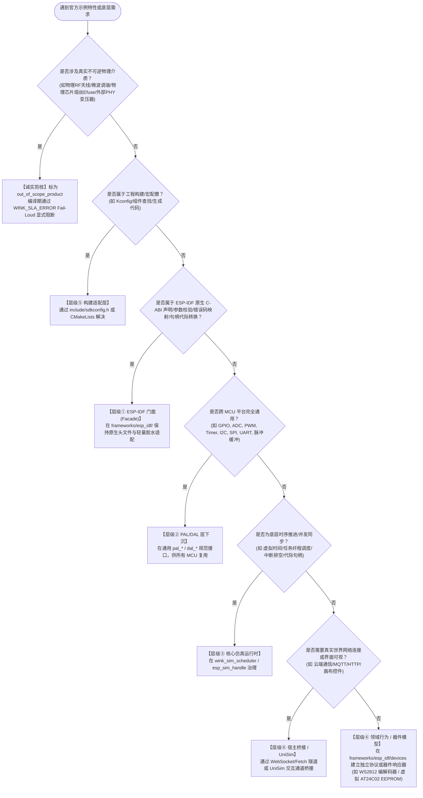
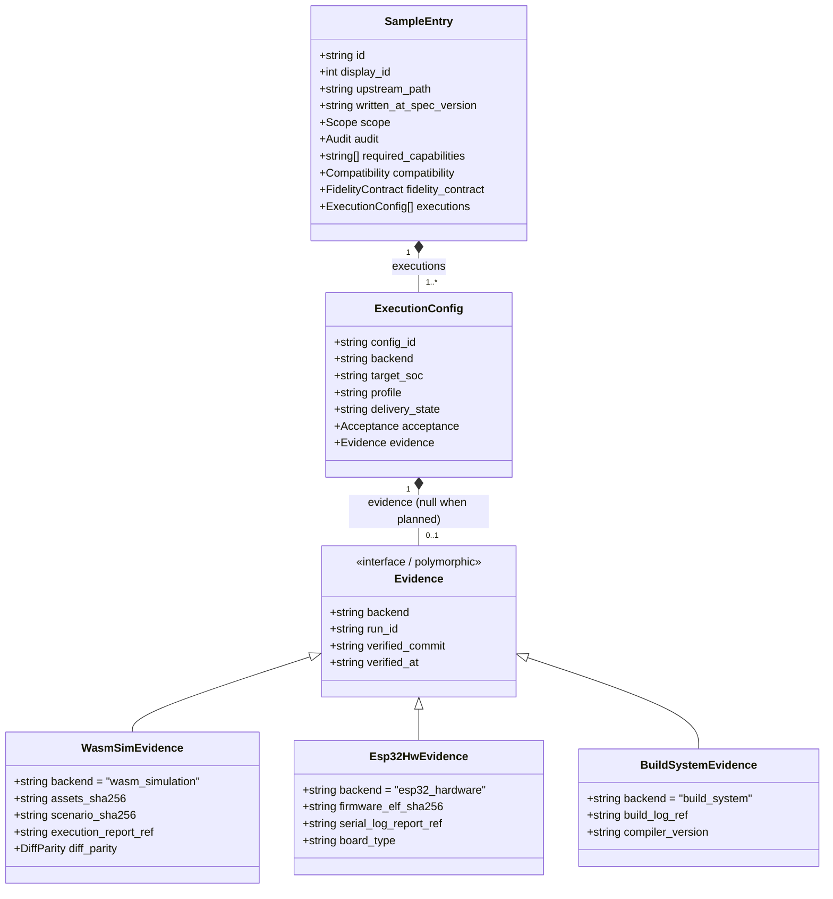
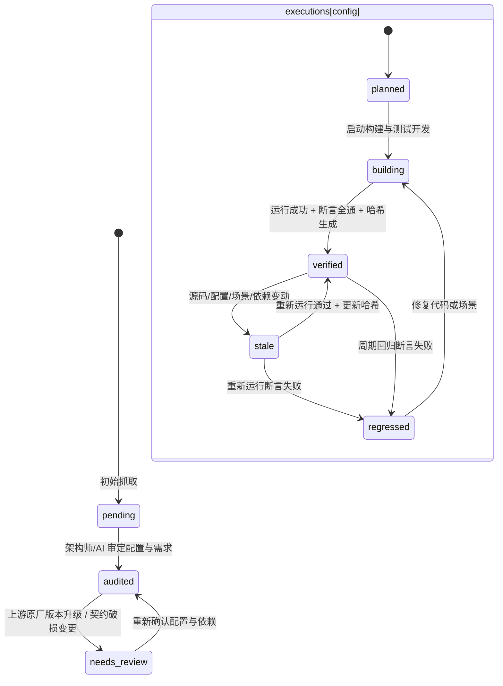

<!-- SPDX-License-Identifier: Apache-2.0 -->
# ESP-IDF 官方示例仿真分类标准、能力图谱与治理规范 (Classification Spec)

> **版本**：v2.0 (Proposed Revision / 破损性升级方案)  
> **适用目标**：ESP-IDF v6.1 官方 478 个独立示例工程全生命周期治理  
> **五位一体协同矩阵**：  
> - 📜 **分类规范（宪章法典）**：[`CLASSIFICATION-SPEC.md`](CLASSIFICATION-SPEC.md)（本文档：定义架构职责、分类决策树与准入裁判标准）  
> - 🧩 **能力字典（能力 SSOT）**：[`capability-catalog.yaml`](capability-catalog.yaml)（原子能力图谱单一真理源，含 `depends_on` 依赖图，支持反向影响分析与 CI 校验）  
> - 💾 **结构化档案（数据 SSOT）**：[`checklist.data.json`](checklist.data.json)（478 个示例的多配置实体与五维正交元数据单一真理源，Schema v2.0）  
> - 🚦 **门禁注册表（CI 目标真理源）**：[`.gates/gates.yaml`](.gates/gates.yaml)（Gate 1~4 全部规则的声明式注册表，见实施计划；当前过渡期通过现行校验脚本执行，待 `.gates/` 架构合入后全面切换）  
> - 🛠️ **操作手册（实施 SOP）**：[`PLAYBOOK.md`](PLAYBOOK.md)（定义单个示例迁移的五阶段工程流水线与硬性门禁）  
> - 📊 **执行看板（派生视图）**：[`CHECKLIST.md`](CHECKLIST.md)（由数据源单向渲染生成的只读看板，严禁纯手工编辑）  
> **核心关联 ADR**：  
> - [ADR-0012：契约诚实优于静默降级（PAL/HAL 抽象层通用原则）](../../../docs/decisions/core/0012-contract-honesty-over-silent-degradation.md)  
> - [ADR-0002：双 Target 同源编译原则](../../../docs/decisions/unisim/0002-dual-target-compilation.md)  
> - [ADR-0003：生产口径与保真边界约束（永不承诺虚实恒等）](../../../docs/decisions/unisim/0003-simulation-fidelity-boundary.md)  
> - [ADR-0014：单虚拟核单线程仿真调度模型](../../../docs/decisions/unisim/0014-sim-single-virtual-core.md)  
> - [ADR-0043：YAML 驱动的分层架构防腐检查与 Lint 体系](../../../docs/decisions/tools/0043-yaml-driven-layer-lint.md)  
> - [ADR-0053：虚拟时间因果同刻总序仲裁模型](../../../docs/decisions/unisim/0053-sim-same-timestamp-event-total-order.md)  
> - [ADR-0085：ESP-IDF 门面 SOC_CAPS 与 PAL 能力双事实源架构](../../../docs/decisions/core/0085-esp-idf-facade-soc-caps-vs-pal-caps-dual-ssot.md)  
> - [ADR-0087：仿真资产通道与芯片级数据所有权模型](../../../docs/decisions/core/0087-esp-idf-asset-channels-and-soc-data-ownership.md)  
> - [ADR-0089：分类记账堆内存与边界防御模型](../../../docs/decisions/core/0089-esp-idf-heap-caps-allocation-contract.md)  
> - [ADR-0090：集中式可插拔门禁系统（`.gates/` 架构）](../../../docs/decisions/unisim/0090-centralized-pluggable-gate-system.md)  
> - [ADR-0091：ESP-IDF 示例分类多配置实例与五维正交 Schema 架构决策](../../../docs/decisions/unisim/0091-esp-idf-multi-config-orthogonal-schema.md)  
> **核心关联技术设计**：  
> - [ESP-IDF 分类体系数据 Schema 与枚举终版规格](../../../docs/zh/tech-designs/esp32/esp-idf-classification-schema-spec.md)（阶段 A 终版标准）  
> - [`docs/zh/design/04-wasm-simulation/`](../../../docs/zh/design/04-wasm-simulation/00-README.md)（UniSim 现行保真轴 A~F SSOT）

---

## 零、 核心宪章原则与防腐化铁律

在推进 478 个官方示例的规模化迁移时，**分类规则的绝对准确性直接决定了仿真系统的架构寿命**。如果缺乏严格的分类规范，仅凭开发者的直觉或脚本的机械匹配，系统必将迅速滑向“PAL 层被专用外设挤压膨胀、门面层充斥未经隔离的假 stub、无凭证宣称支持”的毁灭性深渊。

本规范确立以下**五大不可妥协的宪章铁律**：

### 铁律一：给“能力”分配职责，严禁给“外设名称”划地盘
- 外设名称（如 `RMT`, `ADC`, `I2C`）只是厂商的硬件模块命名，**不能直接作为架构分层的依据**；
- 真实系统是由细粒度的“能力链条”构成的（例如：微秒脉冲发射缓冲属于底层能力，而 WS2812 协议时序或 NEC 红外编码属于协议模型层）；
- **严禁因为外设叫“RMT”就一刀切禁止进入 PAL，也严禁因为叫“ADC”就想当然认为它是普通的模拟采样**。必须沿着调用链条拆解为原子能力，精准映射至对应的架构层。

### 铁律二：示例与能力是网状多对多复用，严禁单维静态 Tier 固化
- 一个官方示例通常依赖多个维度的运行时能力（如一个灯带工程同时依赖：脉冲发射驱动、虚拟时间微秒推进、异步完成通知、WS2812 协议编码）；
- 一项成熟的基建能力同时服务于几十个官方示例；
- **Schema 中严禁定义静态的“Tier 1 / Tier 2”单一归类字段**。示例的分层与复杂性由其引用的原子能力动态聚合决定，必须通过 [`capability-catalog.yaml`](capability-catalog.yaml) 建立可复用、可查询、可反向影响分析的网状图谱。

### 铁律三：五维正交模型与证据强绑定，严禁未审先排与无凭证验证
- 严格区分 **产品范围（unknown/in/out）**、**投入安排（active/deferred）**、**需求审计（pending/audited/needs_review）**、**能力依赖满足度（动态闭包）** 与 **交付证据态（planned/building/verified/stale/regressed）** 五维正交维度，彻底消除“已完成交付却仍被称为规划缺口”的语义矛盾；
- 严禁将“尚未审定”轻率判定为产品排除；
- 任何产品级排除（`out_of_scope`）必须具备不可逆物理介质事实，并在编译期通过 `WINK_SLA_ERROR` Fail-Loud 显式阻断，绝不留伪造数据的假空桩；
- 严禁任何没有真实执行报告与防伪哈希的条目被判定为 `verified`。

### 铁律四：执行配置（executions）为一等公民实体，门禁与看板唯一打勾判定闭包
- 示例档案下挂载实体数组 `executions: [...]`，每个配置实例明确标识后端（`wasm_browser`、`wasm_node`、`esp32_hardware`、`host_native`）与目标芯片；**严禁一个后端的测试通过自动覆盖其他配置**；
- **门禁系统与看板渲染脚本必须强制遵循完全同一套六位一体充要判定闭包**：必须范围有效、审计覆盖、依赖闭包全部 satisfied、声明 verified、哈希匹配工作区、**且绑定的最新执行报告证实真实执行断言全过**。测试断言失败处于 `regressed` 或报告缺失者严禁打勾 `[x]`。

### 铁律五：边界争议走仲裁流程，门禁坚持纯函数只读
- 分类判定出现分歧时，当事人在 PR 中标注 `classification-dispute`；
- 架构师在 3 个工作日内出具裁定（记录裁定推演路径与依据，回写元数据 `audit` 字段）；
- **门禁纯函数原则**：门禁在 CI 运行时严禁修改任何数据文件；TTL 到期后豁免失效仅报告阻断 Error，状态回退通过显式数据迁移 PR 完成；
- 涉及 Schema 破损性变更时触发规范版本号升级（如 v2.0）并执行可复核的数据迁移。

---

## 一、 偏差溯源：现有清单历史执行偏差案例复盘

通过对当前 `CHECKLIST.md` 及早期生成脚本 `generate_esp_idfv61_checklist.py` 的深度审查，发现由于缺乏严密的分类规范与校验机制，清单中暴露出了**严重的理解偏差与执行隐患**。以下四大典型案例必须引以为戒：

| 官方示例相对路径与真实编号 | 现有清单中的描述与归类 | 实际真实底层依赖与架构现实 | 导致的执行偏差与致命危害 |
|---|---|---|---|
| `peripherals/rmt/ir_nec_transceiver` (#063)<br>`peripherals/rmt/musical_buzzer` (#066)<br>`peripherals/rmt/stepper_motor` (#068) | 均被机械化描述为：<br>“驱动虚拟 WS2812 彩灯” | 这些示例使用的是 RMT 的红外载波收发、高频步进电机脉冲发生器以及变频音频蜂鸣器逻辑，**与彩灯没有任何关系**。 | **能力收缩误判**：将通用的“可编程脉冲发生与捕获控制器（RMT）”，错误收缩成“彩灯专用控制器”，导致后续无法支持红外遥控与电机类应用。 |
| `system/ulp/ulp_fsm/ulp_adc` (#171) | 被描述为：<br>“对接 PAL pal_adc，支持 ADC 模拟量转换与虚拟电位器控件” | 该示例核心是**在低功耗协处理器（ULP FSM / RISC-V）上独立编译、运行汇编/二进制固件**，在主 CPU 休眠时采集数据并通过共享 RTC 内存唤醒主核。 | **架构层级严重漏水**：完全漏掉了独立的协处理器运行时沙箱、汇编构建链及跨核 IPC 内存共享机制，误以为写个普通的 ADC 驱动就能跑通。 |
| `protocols/http_server/ws_echo_server` (#197) | 被描述为：<br>“WebSocket 客户端长连接” | 该示例是完整的 **HTTP WebSocket 服务端（Server-side Echo）**，需要在 ESP32 上监听端口、握手升级并管理多客户端 Session。 | **实现方向彻底倒置**：客户端（Client）与服务端（Server）在网络监听、连接池管理及验收断言上存在本质对立，直接导致实现代码南辕北辙。 |
| `build_system/cmake/*` (#426~#432，共 7 项)<br>`build_system/*` (#426~#444，共 19 项) | 整组工程被直接排除：<br>“声明 Out-of-Scope，不属于运行时业务代码” | 这一组示例是验证 ESP-IDF 官方组件依赖、自定义构建规则、二进制打包与头文件搜索路径的**黄金语料**。 | **产品兼容目标撕裂**：用户要求的是“现成 ESP-IDF 原生工程无缝在系统内编译运行”，全量排除构建系统示例直接在工具链兼容性上留下了巨大盲区。 |

> **根因定位**：早期生成脚本依赖路径中的字符串模式匹配（例如路径中只要有 `rmt` 就盲目套用 WS2812 模板，只要有 `adc` 就盲目套用电位器模板），并且直接将自增数字编号写死在非稳定结构中。这证明了：**缺乏形式化语义规范的脚本机械普查，绝不能充当架构裁决的依据！**

---

## 二、 六层架构职责与判定决策树

跨靶仿真系统自上而下严格划分为**六大职责层**，与工程基准分层（App / BAL / DAL / PAL / Targets）紧密对齐。任何示例所依赖的任何一项特性，其实现必须且只能归属于以下六层之一：

```
+───────────────────────────────────────────────────────────────────────────────────────────────────────────+
│                                     跨靶仿真系统六层架构职责分工                                          │
+─────────────────┬────────────────────────────────┬───────────────────────────┬────────────────────────────+
│ 架构层级        │ 仓库物理映射路径               │ 核心承担职责 (MUST DO)    │ 严禁越界行为 (FORBIDDEN)   │
+─────────────────┼────────────────────────────────┼───────────────────────────┼────────────────────────────+
│ ① ESP-IDF 门面  │ wink-micro-os/frameworks/      │ 保留乐鑫原生 C-ABI 声明； │ 严禁在门面内自建复杂驱动状 │
│   (Facade)      │ esp_idf/ (BAL 门面适配)        │ 参数校验；句柄代际转换；  │ 态机；严禁直接持有真实外设 │
│                 │                                │ 错误码转换；调用语义适配  │ 硬件                       │
+─────────────────┼────────────────────────────────┼───────────────────────────┼────────────────────────────+
│ ② 平台抽象层    │ wink-micro-os/pal/             │ 提供跨 MCU 通用硬件抽象； │ 严禁塞入特定芯片私有协议！ │
│   (PAL/DAL)     │ wink-micro-os/dal/             │ 纯微秒脉冲/总线缓冲；     │ 严禁包含高层业务数据结构   │
│                 │                                │ 外设器件模型驱动          │                            │
+─────────────────┼────────────────────────────────┼───────────────────────────┼────────────────────────────+
│ ③ 核心仿真运行  │ wink-micro-os/targets/wasm/    │ 微秒级虚拟时间推进；纤程  │ 严禁依赖具体外设语义；     │
│   (Core Sim)    │ wink-micro-os/osal/            │ 协作式任务调度；结构化    │ 严禁依赖外部真实物理时间   │
│                 │                                │ Trace 记录；同刻因果仲裁  │                            │
+─────────────────┼────────────────────────────────┼───────────────────────────┼────────────────────────────+
│ ④ 领域行为与器  │ wink-micro-os/frameworks/      │ 控制器复杂协议状态机；    │ 严禁直接调用宿主未隔离的系 │
│   件模型 (Model)│ esp_idf/devices/               │ 特定总线协议编解码；外部  │ 统调用；必须通过统一总线   │
│                 │ 或独立 DAL 驱动模块            │ 硬件器件应答              │ 挂载                       │
+─────────────────┼────────────────────────────────┼───────────────────────────┼────────────────────────────+
│ ⑤ 构建适配层    │ wink-micro-os/codegen/         │ Kconfig 宏转义与默认值    │ 严禁侵入用户 C 业务源码；  │
│   (Build Layer) │ include/sdkconfig.h            │ 注入；CMake 原厂工程透明  │ 保持应用源码一行不改       │
│                 │ CMakeLists.txt                 │ 组装；组件搜索路径解耦    │                            │
+─────────────────┼────────────────────────────────┼───────────────────────────┼────────────────────────────+
│ ⑥ 前端与宿主桥  │ UniSim 前端桥接层 /            │ 提供真实网络隧道代理；    │ 严禁固件直接感知宿主差异； │
│   (Host Bridge) │ host_bridge 适配模块           │ UniSim 画布渲染；虚拟     │ 必须经由仿真事件泵调度     │
│                 │                                │ 按键/旋钮输入注入         │                            │
+─────────────────┴────────────────────────────────┴───────────────────────────┴────────────────────────────+
```

### 架构下沉归属判定决策树 (Decision Tree)

> ⚠️ **重要**：决策树的判定对象是**示例所依赖的每一项原子能力**，而非示例本身。  
> 示例所依赖的每项能力独立走一次决策树，汇总后通过引用的原子能力反查 Catalog 计算其行为归属。



---

## 三、 示例元数据 Schema 规范 (v2.0，基于 ADR-0091)

每一个官方示例在登记档案（`checklist.data.json`）中必须完整记录结构化元数据，并由 CI 进行自动化 Schema 校验。自 v2.0 起，彻底破除“单示例单配置单证据”的局限，将 **多配置执行实例（`executions: [...]`）确立为一等公民实体**，实现后端宿主、芯片目标与凭据闭环的精确正交管理。

### 1. 核心实体结构模型



- **根级实体（示例公共属性）**：
  - `id`: 语义级全局唯一标识（`^esp\.[a-z0-9_]+(\.[a-z0-9_]+)+$`）；
  - `display_id`: 语料库展示序号（1~478）；
  - `upstream_path`: 相对原厂 examples 目录路径；
  - `written_at_spec_version`: 记录归属的规范版本（如 `2.0.0`）；
  - `scope`: 产品范围对象，包含 `inclusion` (`unknown | in_scope | out_of_scope`)、`schedule` (`active | deferred`)、`exclusion_reason`；
  - `audit`: 需求审定对象，包含 `verdict` (`pending | audited | needs_review`)、`auditor`、`audited_at`、`audited_configs`（明确覆盖的配置集合）；
  - `required_capabilities`: 依赖的原子能力 ID 列表；
  - `compatibility` 与 `fidelity_contract`: 源代码策略、头文件闭包与 UniSim A~F 保真轴声明。
- **配置实例实体（`executions[i]`）**：
  - `config_id`: 实例唯一命名（如 `sim-browser-esp32`, `sim-node-esp32c3`, `hw-esp32`）；
  - `backend`: 明确执行宿主后端（`wasm_browser | wasm_node | esp32_hardware | host_native`，严禁使用含糊的 `all`）；
  - `target_soc`: 目标芯片架构（`esp32 | esp32s3 | esp32c3 | esp32c6 | all`）；
  - `profile`: 运行规格（`standard | minimal | debug | coverage`）；
  - `delivery_state`: 交付证据状态（`planned | building | verified | stale | regressed`）；
  - `acceptance`: 验收场景与断言规格（`observability_level`, `scenario_path`, `timeout_virtual_us`, `timeout_wall_ms`, `positive_cases`, `negative_cases`）；
  - `evidence`: 防伪凭据对象（尚未通过时必须为 `null`，通过时支持版本化多态后端凭据模型：`wasm_simulation` 仿真凭据、`esp32_hardware` 物理芯片串口断言凭据、或 `build_system` 构建链接凭据，且均包含 `run_id`, `verified_commit`, `verified_at`）。

### 2. 完整 JSON Schema 规格 (Draft 2020-12)

```json
{
  "$schema": "https://json-schema.org/draft/2020-12/schema",
  "$id": "https://wink-ai.org/schemas/esp-idf-classification-v2.0.json",
  "title": "ESP-IDF 示例分类与交付元数据 Schema",
  "type": "object",
  "required": [
    "spec_version",
    "generated_at",
    "total_entries",
    "summary",
    "entries"
  ],
  "properties": {
    "spec_version": {
      "type": "string",
      "pattern": "^2\\.[0-9]+\\.[0-9]+$"
    },
    "generated_at": {
      "type": "string",
      "format": "date-time"
    },
    "total_entries": {
      "type": "integer",
      "const": 478
    },
    "summary": {
      "type": "object",
      "required": ["scope_in", "scope_out", "scope_unknown", "audited", "verified_configs"],
      "properties": {
        "scope_in": { "type": "integer" },
        "scope_out": { "type": "integer" },
        "scope_unknown": { "type": "integer" },
        "in_scope_active": { "type": "integer" },
        "in_scope_deferred": { "type": "integer" },
        "audited": { "type": "integer" },
        "verified_configs": { "type": "integer" }
      }
    },
    "entries": {
      "type": "array",
      "items": { "$ref": "#/$defs/sample_entry" }
    }
  },
  "$defs": {
    "sample_entry": {
      "type": "object",
      "required": [
        "id",
        "display_id",
        "upstream_path",
        "written_at_spec_version",
        "scope",
        "audit",
        "required_capabilities",
        "executions"
      ],
      "properties": {
        "id": {
          "type": "string",
          "pattern": "^esp\\.[a-z0-9_]+(\\.[a-z0-9_]+)+$"
        },
        "display_id": {
          "type": "integer",
          "minimum": 1,
          "maximum": 478
        },
        "upstream_path": {
          "type": "string",
          "pattern": "^examples/.+$"
        },
        "written_at_spec_version": {
          "type": "string"
        },
        "scope": {
          "type": "object",
          "required": ["inclusion", "exclusion_reason", "schedule"],
          "properties": {
            "inclusion": {
              "type": "string",
              "enum": ["unknown", "in_scope", "out_of_scope"]
            },
            "exclusion_reason": {
              "type": ["string", "null"]
            },
            "schedule": {
              "type": "string",
              "enum": ["active", "deferred"]
            }
          }
        },
        "audit": {
          "type": "object",
          "required": ["verdict", "auditor", "audited_at", "audited_configs"],
          "properties": {
            "verdict": {
              "type": "string",
              "enum": ["pending", "audited", "needs_review"]
            },
            "auditor": { "type": ["string", "null"] },
            "audited_at": { "type": ["string", "null"], "format": "date-time" },
            "audited_configs": {
              "type": "array",
              "items": { "type": "string" }
            },
            "dispute_ref": { "type": ["string", "null"] },
            "ruling_path": { "type": ["string", "null"] }
          }
        },
        "required_capabilities": {
          "type": "array",
          "uniqueItems": true,
          "items": {
            "type": "string",
            "pattern": "^cap\\.[a-z0-9_]+(\\.[a-z0-9_]+)+$"
          }
        },
        "compatibility": {
          "type": "object",
          "required": ["source_code_policy"],
          "properties": {
            "source_code_policy": {
              "type": "string",
              "enum": ["zero_modification_mirror", "wrapper_main", "shimmed_harness", "upstream_modified"]
            },
            "header_closure": {
              "type": "array",
              "items": { "type": "string" }
            },
            "sdkconfig_overrides": { "type": "object" }
          }
        },
        "fidelity_contract": {
          "type": "object",
          "required": ["axes_declared", "concurrency_model"],
          "properties": {
            "axes_declared": {
              "type": "object",
              "properties": {
                "axis_a_channels": { "type": "string" },
                "axis_b_timebase": { "type": "string" },
                "axis_c_timer": { "type": "string" },
                "axis_d_interrupt": { "type": "string" },
                "axis_e_concurrency": { "type": "string" },
                "axis_f_diagnostics": { "type": "string" }
              }
            },
            "concurrency_model": {
              "type": "string",
              "enum": ["cooperative_fiber", "preemptive_rtos", "single_thread_polling"]
            }
          }
        },
        "executions": {
          "type": "array",
          "minItems": 1,
          "items": { "$ref": "#/$defs/execution_config" }
        }
      }
    },
    "execution_config": {
      "type": "object",
      "required": [
        "config_id",
        "backend",
        "target_soc",
        "profile",
        "delivery_state",
        "acceptance",
        "evidence"
      ],
      "properties": {
        "config_id": {
          "type": "string",
          "pattern": "^[a-z0-9_]+(-[a-z0-9_]+)*$"
        },
        "backend": {
          "type": "string",
          "enum": ["wasm_browser", "wasm_node", "esp32_hardware", "host_native"]
        },
        "target_soc": {
          "type": "string",
          "enum": ["esp32", "esp32s3", "esp32c3", "esp32c6", "all"]
        },
        "profile": {
          "type": "string",
          "enum": ["standard", "minimal", "debug", "coverage"]
        },
        "delivery_state": {
          "type": "string",
          "enum": ["planned", "building", "verified", "stale", "regressed"]
        },
        "acceptance": {
          "type": "object",
          "required": ["type", "observability_level"],
          "properties": {
            "type": {
              "type": "string",
              "enum": ["wasm_simulation", "host_native", "build_toolchain", "expected_rejection", "differential_parity"]
            },
            "observability_level": {
              "type": "string",
              "enum": ["L1_ui", "L2_log", "L3_probe", "L4_internal", "LX_deadlock"]
            },
            "scenario_path": { "type": ["string", "null"] },
            "timeout_virtual_us": { "type": ["integer", "null"] },
            "timeout_wall_ms": { "type": ["integer", "null"] },
            "positive_cases": { "type": "array" },
            "negative_cases": { "type": "array" },
            "sla_error_symbol": { "type": ["string", "null"] }
          }
        },
        "evidence": {
          "type": ["object", "null"],
          "oneOf": [
            {
              "type": "null"
            },
            {
              "type": "object",
              "properties": {
                "backend": { "const": "wasm_simulation" },
                "run_id": { "type": "string" },
                "assets_sha256": { "type": "string", "pattern": "^[a-f0-9]{64}$" },
                "scenario_sha256": { "type": "string", "pattern": "^[a-f0-9]{64}$" },
                "execution_report_ref": { "type": "string" },
                "verified_commit": { "type": "string", "pattern": "^[a-f0-9]{7,40}$" },
                "verified_at": { "type": "string", "format": "date-time" },
                "diff_parity": {
                  "type": "object",
                  "required": ["sim_run_id", "hw_run_id", "ruleset_version", "tolerance_us", "observed_vectors"],
                  "properties": {
                    "sim_run_id": { "type": "string" },
                    "hw_run_id": { "type": "string" },
                    "ruleset_version": { "type": "string" },
                    "tolerance_us": { "type": "integer", "minimum": 0 },
                    "observed_vectors": { "type": "array", "items": { "type": "string" } }
                  }
                }
              },
              "required": [
                "backend",
                "run_id",
                "assets_sha256",
                "scenario_sha256",
                "execution_report_ref",
                "verified_commit",
                "verified_at"
              ]
            },
            {
              "type": "object",
              "properties": {
                "backend": { "const": "esp32_hardware" },
                "run_id": { "type": "string" },
                "firmware_elf_sha256": { "type": "string", "pattern": "^[a-f0-9]{64}$" },
                "serial_log_report_ref": { "type": "string" },
                "board_type": { "type": "string" },
                "verified_commit": { "type": "string", "pattern": "^[a-f0-9]{7,40}$" },
                "verified_at": { "type": "string", "format": "date-time" }
              },
              "required": [
                "backend",
                "run_id",
                "firmware_elf_sha256",
                "serial_log_report_ref",
                "board_type",
                "verified_commit",
                "verified_at"
              ]
            },
            {
              "type": "object",
              "properties": {
                "backend": { "const": "build_system" },
                "run_id": { "type": "string" },
                "build_log_ref": { "type": "string" },
                "compiler_version": { "type": "string" },
                "verified_commit": { "type": "string", "pattern": "^[a-f0-9]{7,40}$" },
                "verified_at": { "type": "string", "format": "date-time" }
              },
              "required": [
                "backend",
                "run_id",
                "build_log_ref",
                "compiler_version",
                "verified_commit",
                "verified_at"
              ]
            }
          ]
        }
      }
    }
  }
```

---

## 四、 公共能力图谱字典规范 (Capability Catalog)

公共原子能力图谱的唯一真理源位于 [`capability-catalog.yaml`](capability-catalog.yaml)。每一项能力必须具有单一明确的归属层级与源码责任路径（`owned_paths`），以支持 Gate 4 的影响闭包动态计算。

能力字典核心概览如下：

| 能力命名空间 | 标准能力 ID | 唯一主层级 | 状态 | 能力语义与实现说明 |
|---|---|---|---|---|
| **1. 核心与并发调度**<br>`cap.core.*` | `cap.core.fiber_task` | Core Sim (③) | Implemented | 纤程级任务创建、切换、挂起与协作调度 |
| | `cap.core.sync_tokens` | Core Sim (③) | Implemented | 32位代际令牌化信号量、互斥锁、队列与事件组 |
| | `cap.core.category_heap` | Facade (①) | Implemented | ADR-0089 分类记账与堆边界防御、Heap Caps 门面 |
| | `cap.core.hot_restart` | Core Sim (③) | Planned | Phase 4 Wasm 模块级彻底热重启与幂等重置 |
| **2. 模拟量与波形**<br>`cap.analog.*` | `cap.analog.adc_oneshot` | PAL/DAL (②) | Implemented | PAL 通用单次采样与引脚电平/毫伏转换 |
| | `cap.analog.adc_dma` | PAL/DAL (②) | Planned | 连续双缓冲 DMA 模拟量采集接口 |
| | `cap.analog.dac_out` | PAL/DAL (②) | Implemented | PAL 通用 DAC 模拟量电压输出 |
| **3. 脉冲与时序**<br>`cap.pulse.*` | `cap.pulse.tx_buffer` | PAL/DAL (②) | Implemented | PAL 通用微秒脉冲序列发送缓冲 (RMT Tx 引擎抽象) |
| | `cap.pulse.rx_capture` | PAL/DAL (②) | Planned | PAL 通用微秒脉冲电平跳变捕获 (RMT Rx 引擎抽象) |
| | `cap.pulse.pcnt_quad` | PAL/DAL (②) | Planned | PAL 通用正交编码脉冲计数 (PCNT) |
| **4. 通用串行与总线**<br>`cap.bus.*` | `cap.bus.i2c_master` | PAL/DAL (②) | Implemented | PAL 通用 I2C 主机模式 (标准/快速) 读写事务 |
| | `cap.bus.spi_master` | PAL/DAL (②) | Implemented | PAL 通用 SPI 主机轮询/DMA 传输 |
| | `cap.bus.uart_stream` | PAL/DAL (②) | Implemented | PAL 通用异步双工串口字符流传输与环形缓冲 |
| **5. 虚拟协议模型**<br>`cap.proto.*` | `cap.proto.ws2812` | Model (④) | Implemented | 领域模型 WS2812 RGB 协议时序编解码与灯带管道 |
| | `cap.proto.nec_ir` | Model (④) | Planned | 领域模型 NEC 格式 38kHz 红外载波收发解析 |
| | `cap.proto.twai_can` | Model (④) | Planned | 领域模型 CAN 帧过滤与虚拟总线广播 |
| | `cap.proto.i2s_stream` | Model (④) | Planned | 领域模型 I2S 音频流环形缓冲管道与时钟生成 |
| **6. 虚拟文件系统**<br>`cap.vfs.*` | `cap.vfs.mem_sandbox` | Model (④) | Implemented | 纯内存 Inode 树状沙箱文件系统 (POSIX VFS 适配) |
| | `cap.vfs.nvs_partition` | Model (④) | Implemented | 虚拟 Flash 分区表与 NVS 键值存储 |
| | `cap.vfs.spiffs_format` | Model (④) | Planned | SPIFFS 扁平文件系统镜像与挂载 |
| **7. 网络与真实连接**<br>`cap.net.*` | `cap.net.event_pump` | Facade (①) | Implemented | D2 异步深拷贝事件队列与信封分发 |
| | `cap.net.host_socket` | Host Bridge (⑥)| Implemented | 宿主 POSIX / WinSock 原生网络隧道代理 |
| | `cap.net.host_ws_tunnel`| Host Bridge (⑥)| Implemented | 浏览器 WebSocket 真实全双工网络代理 |
| **8. 协处理器与特殊硬件**<br>`cap.coproc.*` | `cap.coproc.ulp_fsm` | Model (④) | Planned | ULP 状态机汇编解释器与 RTC 共享慢速内存 |
| | `cap.coproc.ulp_riscv` | Model (④) | Planned | ULP RISC-V 32位 ELF 二进制加载器 |
| **9. DMA 与传输模型**<br>`cap.dma.*` | `cap.dma.memcpy_sim` | Core Sim (③) | Implemented | DMA 传输仿真为同步 memcpy 并更新描述符 |
| | `cap.dma.double_buffer` | Core Sim (③) | Planned | 乒乓双缓冲与完成中断回调分发 |
| **10. 中断与上下文**<br>`cap.irq.*` | `cap.irq.isr_dispatch` | Core Sim (③) | Implemented | ISR 上下文纤程模拟与栈隔离 |
| | `cap.irq.edge_trigger` | PAL/DAL (②) | Implemented | GPIO 边沿中断触发与去抖分发 |
| **11. 构建与配置**<br>`cap.build.*` | `cap.build.component_reg`| Build (⑤) | Implemented | idf_component_register 透明解析与依赖链接 |
| | `cap.build.kconfig_parse`| Build (⑤) | Implemented | sdkconfig.defaults 自动映射编译宏 |

### 能力图谱治理规则与依赖图规范
1. **单层不变量**：任何能力 ID 必须且只能属于单一主架构层，严禁“层级①/③”这类模糊标注；
2. **结构化依赖图（`depends_on`）**：
   - `mandatory`: 必需依赖数组，无论何种配置均必须满足；
   - `conditional`: 条件依赖数组，支持基于 `profile`、`backend`、`target_soc` 等静态属性的条件激发；
3. **条件求值三条解析防御红线**：
   - **红线一（语法白名单）**：仅允许有限比较操作符（`==`, `!=`, `in`）和受控变量路径（如 `config.profile`, `config.backend`），严禁任意表达式或动态代码注入；
   - **红线二（纯净执行上下文）**：隔离无状态求值，严禁访问宿主环境、全局变量或文件系统；
   - **红线三（失败即阻断边界 Fail-Close）**：凡遇到无法识别的语法、变量不存在或解析异常，该边严格判定为未满足（`unknown` / `blocked`），绝不允许静默放行；
4. **变更影响闭包**：新增或修改能力 ID 必须同时登记 `owned_paths`，供 CI Gate 4 动态计算回归范围；
5. **废弃周期**：废弃能力 ID 需先标记 `@deprecated` 并保留至少一个完整迁移批次缓冲期。

---

## 五、 五维正交状态模型与 SLA Fail-Loud 编译期断言

彻底消灭“已验证条目在同一文档中仍显示为规划缺口”或“未审定条目直接算作排除”的语义矛盾。WinkMicroOS 确立以下**五个相互独立、正交校验的系统状态维度**：

### 1. 五维正交维度定义与枚举空间

```
[1] 产品范围 (Scope)     ──► unknown | in_scope | out_of_scope
[2] 投入安排 (Schedule)  ──► active | deferred
[3] 需求审计 (Audit)     ──► pending | audited | needs_review
[4] 依赖满足度 (Deps)    ──► unknown | satisfied | blocked (由依赖图闭包动态计算，不手工存储)
[5] 交付证据态 (Delivery) ──► planned | building | verified | stale | regressed (依配置实例挂载)
```

| 维度 | 字段位置 | 完整枚举 | 语义与法律含义 |
|---|---|---|---|
| **产品范围**<br>`scope.inclusion` | 示例根部 | `unknown` | 尚未完成产品定义与硬件适用性核验，严禁默认排除或纳入 |
| | | `in_scope` | 正式纳入 WinkMicroOS 仿真与运行支持目标范围 |
| | | `out_of_scope` | 明确不纳入支持；必须具备不可逆物理介质事实，并提供编译期阻断 |
| **投入安排**<br>`scope.schedule` | 示例根部 | `active` | 当前阶段正常排期投入资源实现与演进 |
| | | `deferred` | 属于产品目标，但依赖重型外部模型或低优先级生态，暂缓资源投入 |
| **需求审计**<br>`audit.verdict` | 示例根部 | `pending` | 初始抓取状态，尚未深入核验源码调用链与架构分层，**严禁实施** |
| | | `audited` | 经架构师/AI 审定，且明确覆盖声明的配置集合与契约版本 |
| | | `needs_review` | 上游源码变更、依赖能力契约修订或配置变化，原审定失效，需复审 |
| **能力满足度**<br>*(Dynamic Closure)* | 内存派生计算 | `unknown` | 依赖图谱中存在尚未支持解析的条件边，或依赖能力状态未明 |
| | | `satisfied` | 该配置所需要的所有原子能力直接需求与传递依赖闭包全部为 `implemented` 或 `verified` |
| | | `blocked` | 至少一项必需能力依赖为 `planned` 或受到底层物理契约硬性阻断 |
| **交付证据态**<br>`executions[].delivery_state`| 配置实例内部 | `planned` | 尚未开始构建或运行验证；或原豁免期满回退 |
| | | `building` | 资产构建或场景编写进行中，尚未产出完整有效证据 |
| | | `verified` | 当前配置已产出完整防伪凭据，且最新执行报告证实断言全部成功 |
| | | `stale` | 证据陈旧：源码、资产、场景、编译器变动导致旧凭证失效，待重验 |
| | | `regressed` | 回归失败：在重新运行中发生断言失败、崩溃或超时 |

### 2. 统一“有效 Verified”与看板打勾 `[x]` 的唯一充要条件

为确保整个系统只有一套判据，**CI 门禁与看板渲染脚本必须强制遵循完全同一套六位一体充要判定闭包**：

$$\text{CanCheckMark}(E, C) \iff \begin{cases} 
E.\text{scope.inclusion} = \text{"in\_scope"} \\
\land\ E.\text{audit.verdict} = \text{"audited"} \ \land\ C.\text{config\_id} \in E.\text{audit.audited\_configs} \\
\land\ \text{EvaluateDependencyClosure}(E, C) = \text{"satisfied"} \\
\land\ C.\text{delivery\_state} = \text{"verified"} \\
\land\ \text{ValidateHashesNonEmptyAndMatchWorkspace}(C.\text{evidence}) = \text{True} \\
\land\ \text{ValidateExecutionReportSuccess}(C.\text{evidence.execution\_report\_ref}) = \text{True}
\end{cases}$$

**硬性防御约束**：
1. **测试断言失败绝不打勾**：若某条目产物哈希完整，但重跑断言失败（处于 `regressed`），或执行报告缺失，看板**严禁打勾 `[x]`**；
2. **排除项绝不打勾**：`out_of_scope` 示例即使其预期拒绝断言（Fail-Loud SLA）验证通过，在看板中仅显示 `[-] 排除已验证`，绝不计入已支持打勾统计；
3. **隔离区豁免项绝不打勾**：处于存量隔离区白名单中的 `provisional_unverified` 条目，看板一律渲染为 `[?] 待补凭证`。

### 3. 失效流转状态机 (Invalidation State Machine)



### 4. 物理介质排除 SLA 与 `WINK_SLA_ERROR` Fail-Loud 编译期断言

任何被标记为 `out_of_scope` 的条目，必须符合以下条件之一的物理不可逆介质约束：
1. **真实 RF / 物理微波介质**：如 DVP/CSI 专用物理摄像头传感器线缆、物理以太网磁隔离变压器 PHY；
2. **物理熔丝与一次性介质**：如物理芯片 OTP 熔丝 Efuse 真实烧写、硬件加密引擎外部私钥芯片注入；
3. **物理高频连续射频调谐**：需要纳秒级模拟射频反馈控制环路。

**Fail-Loud 编译期防伪断言机制**：
对于排除类特性，系统**绝不提供返回 0 的假空桩**。在对应的 ESP-IDF 门面头文件中，必须通过预编译 `#error` 显式阻断非法编译：

```c
/* wink-micro-os/frameworks/esp_idf/include/esp_phy.h */
#if defined(CONFIG_WINK_SIM_BUILD) && !defined(CONFIG_WINK_ALLOW_UNSUPPORTED_PHY)
#error "WINK_SLA_ERROR: Physical RF/PHY hardware medium is Out-of-Scope in WinkMicroOS simulation runtime! See docs/zh/design/04-wasm-simulation/01-overview/03-production-contract.md."
#endif
```

---

## 六、 首批六大代表性争议示例规范打样 (v2.0 规格)

以下 6 个打样已全面对齐 Schema v2.0 规格，包含多配置执行实例定义。**打样条目中尚未真实通过的草案模板诚实标注 `delivery_state: planned` 与 `evidence: null`，绝不伪造 SHA-256 哈希与虚假凭证**：

---

### 打样 1：`peripherals/adc/oneshot_read`
- **稳定 ID**：`esp.peripherals.adc.oneshot_read`（原编号 `#004`）
- **上游路径**：`examples/peripherals/adc/oneshot_read`
- **规范版本**：`written_at_spec_version: "2.0.0"`
- **产品范围**：`scope: { inclusion: "in_scope", schedule: "active", exclusion_reason: null }`
- **审计记录**：`audit: { verdict: "audited", auditor: "arch_team", audited_at: "2026-09-29T14:00:00Z", audited_configs: ["sim_browser_esp32"] }`
- **能力依赖**：`[cap.analog.adc_oneshot, cap.core.fiber_task]`
- **源代码兼容性**：`source_code_policy: "zero_modification_mirror"`
- **保真与调度**：`axis_a_channels: "event_stream"`, `axis_b_timebase: "deterministic_microsecond"`, `concurrency_model: "cooperative_fiber"`
- **执行配置实例 (`executions`)**：
  ```json
  [
    {
      "config_id": "sim_browser_esp32",
      "backend": "wasm_browser",
      "target_soc": "esp32",
      "profile": "standard",
      "delivery_state": "planned",
      "acceptance": {
        "type": "wasm_simulation",
        "observability_level": "L2_log",
        "scenario_path": "tests/scenarios/peripherals/adc/test_oneshot_read.json",
        "timeout_virtual_us": 1000000,
        "timeout_wall_ms": 3000,
        "positive_cases": [
          { "name": "adc_raw_conversion", "matcher": { "op": "between", "lo": 2043, "hi": 2053 } }
        ],
        "negative_cases": [
          { "stimulus": "voltage_3600mv", "expect_error": "ESP_ERR_INVALID_ARG", "detects": "voltage_overflow_check" }
        ]
      },
      "evidence": null
    }
  ]
  ```

---

### 打样 2：`system/ulp/ulp_fsm/ulp_adc`
- **稳定 ID**：`esp.system.ulp.ulp_fsm.ulp_adc`（真实编号 `#171`）
- **上游路径**：`examples/system/ulp/ulp_fsm/ulp_adc`
- **产品范围**：`scope: { inclusion: "in_scope", schedule: "deferred", exclusion_reason: "依赖独立 ULP 协处理器汇编沙箱与 RTC 慢速共享内存，当前暂缓投入" }`
- **审计记录**：`audit: { verdict: "audited", auditor: "arch_team", audited_at: "2026-09-29T14:00:00Z", audited_configs: ["sim_host_native_esp32"] }`
- **能力依赖**：`[cap.coproc.ulp_fsm, cap.analog.adc_oneshot, cap.core.fiber_task]`
- **执行配置实例 (`executions`)**：
  ```json
  [
    {
      "config_id": "sim_host_native_esp32",
      "backend": "host_native",
      "target_soc": "esp32",
      "profile": "standard",
      "delivery_state": "planned",
      "acceptance": {
        "type": "host_native",
        "observability_level": "L2_log",
        "scenario_path": "tests/scenarios/system/ulp/test_ulp_adc.json",
        "timeout_virtual_us": 2000000,
        "timeout_wall_ms": 5000,
        "positive_cases": [
          { "name": "ulp_wakeup_main_cpu", "matcher": { "op": "regex", "expected": "ULP-FSM woke up main CPU" } }
        ],
        "negative_cases": []
      },
      "evidence": null
    }
  ]
  ```

---

### 打样 3：`peripherals/rmt/led_strip`
- **稳定 ID**：`esp.peripherals.rmt.led_strip`（真实编号 `#064`）
- **上游路径**：`examples/peripherals/rmt/led_strip`
- **产品范围**：`scope: { inclusion: "in_scope", schedule: "active", exclusion_reason: null }`
- **审计记录**：`audit: { verdict: "audited", auditor: "arch_team", audited_at: "2026-09-29T14:00:00Z", audited_configs: ["sim_browser_esp32"] }`
- **能力依赖**：`[cap.pulse.tx_buffer, cap.proto.ws2812, cap.core.fiber_task]`
- **架构分层裁决**：
  - **PAL 层（Layer ②）**：仅提供纯微秒脉冲发射缓冲 `pal_rmt_tx_buffer`；
  - **领域模型层（Layer ④）**：`dal_ws2812` 负责将用户 RGB 数组编码为脉冲符号流并送往管道；
  - 现役代码 `pal_wasm_ch4_buffer.c` 中直接接收 RGB 缓冲区的 `pal_ws2812_write` 标记为 `@deprecated`，后续平滑回撤至 DAL 层，彻底消除分层倒灌。
- **执行配置实例 (`executions`)**：
  ```json
  [
    {
      "config_id": "sim_browser_esp32",
      "backend": "wasm_browser",
      "target_soc": "esp32",
      "profile": "standard",
      "delivery_state": "planned",
      "acceptance": {
        "type": "wasm_simulation",
        "observability_level": "L1_ui",
        "scenario_path": "tests/scenarios/peripherals/rmt/test_led_strip.json",
        "timeout_virtual_us": 500000,
        "timeout_wall_ms": 2000,
        "positive_cases": [
          { "name": "pixel_color_verified", "matcher": { "op": "eq", "expected": "pixel_0:#FF0000,pixel_7:#0000FF" } }
        ],
        "negative_cases": [
          { "stimulus": "invalid_pixel_index_9", "expect_error": "ESP_ERR_INVALID_ARG", "detects": "bounds_overflow" }
        ]
      },
      "evidence": null
    }
  ]
  ```

---

### 打样 4：`peripherals/rmt/ir_nec_transceiver`
- **稳定 ID**：`esp.peripherals.rmt.ir_nec_transceiver`（真实编号 `#063`）
- **上游路径**：`examples/peripherals/rmt/ir_nec_transceiver`
- **产品范围**：`scope: { inclusion: "in_scope", schedule: "deferred", exclusion_reason: "依赖高精度微秒脉冲捕获 (Rx Capture) 与 NEC 协议解码，当前阶段暂缓投入" }`
- **审计记录**：`audit: { verdict: "audited", auditor: "arch_team", audited_at: "2026-09-29T14:00:00Z", audited_configs: ["sim_browser_esp32"] }`
- **能力依赖**：`[cap.pulse.tx_buffer, cap.pulse.rx_capture, cap.proto.nec_ir]`
- **执行配置实例 (`executions`)**：
  ```json
  [
    {
      "config_id": "sim_browser_esp32",
      "backend": "wasm_browser",
      "target_soc": "esp32",
      "profile": "standard",
      "delivery_state": "planned",
      "acceptance": {
        "type": "wasm_simulation",
        "observability_level": "L2_log",
        "scenario_path": "tests/scenarios/peripherals/rmt/test_ir_nec.json",
        "timeout_virtual_us": 2000000,
        "timeout_wall_ms": 4000,
        "positive_cases": [
          { "name": "nec_loopback_match", "matcher": { "op": "eq", "expected": "addr:0x00FF,cmd:0x55AA" } }
        ],
        "negative_cases": [
          { "stimulus": "corrupted_preamble", "expect_error": "ESP_ERR_INVALID_RESPONSE", "detects": "preamble_timing_check" }
        ]
      },
      "evidence": null
    }
  ]
  ```

---

### 打样 5：`protocols/http_server/ws_echo_server`
- **稳定 ID**：`esp.protocols.http_server.ws_echo_server`（真实编号 `#197`）
- **上游路径**：`examples/protocols/http_server/ws_echo_server`
- **真实语义**：**HTTP Server 的 WebSocket 握手升级与 Echo 回显服务端**（非客户端，非纯 WS）。
- **产品范围**：`scope: { inclusion: "in_scope", schedule: "deferred", exclusion_reason: "依赖轻量级全双工服务端网络监听隧道，当前阶段暂缓投入" }`
- **审计记录**：`audit: { verdict: "audited", auditor: "arch_team", audited_at: "2026-09-29T14:00:00Z", audited_configs: ["sim_node_esp32"] }`
- **能力依赖**：`[cap.net.event_pump, cap.net.host_socket, cap.core.fiber_task]`
- **执行配置实例 (`executions`)**：
  ```json
  [
    {
      "config_id": "sim_node_esp32",
      "backend": "wasm_node",
      "target_soc": "esp32",
      "profile": "standard",
      "delivery_state": "planned",
      "acceptance": {
        "type": "wasm_simulation",
        "observability_level": "L3_probe",
        "scenario_path": "tests/scenarios/protocols/test_ws_echo_server.json",
        "timeout_virtual_us": 5000000,
        "timeout_wall_ms": 8000,
        "positive_cases": [
          { "name": "ws_handshake_and_echo", "matcher": { "op": "eq", "expected": "echo:hello_wink" } }
        ],
        "negative_cases": [
          { "stimulus": "invalid_upgrade_header", "expect_error": "HTTP_400_BAD_REQUEST", "detects": "handshake_parser" }
        ]
      },
      "evidence": null
    }
  ]
  ```

---

### 打样 6：`build_system/cmake/component_manager`
- **稳定 ID**：`esp.build_system.cmake.component_manager`（真实编号 `#426`）
- **上游路径**：`examples/build_system/cmake/component_manager`
- **真实语义**：验证原厂 `idf_component_register()` 在无 ESP-IDF 构建脚本下，能被 WinkMicroOS 编译体系透明导入并成功链接自定义组件符号。
- **产品范围**：`scope: { inclusion: "in_scope", schedule: "active", exclusion_reason: null }`
- **审计记录**：`audit: { verdict: "audited", auditor: "arch_team", audited_at: "2026-09-29T14:00:00Z", audited_configs: ["build_toolchain_native"] }`
- **能力依赖**：`[cap.build.component_reg]`
- **架构归属**：层级⑤（构建工具链），`behavior_layer: build_tooling`
- **执行配置实例 (`executions`)**：
  ```json
  [
    {
      "config_id": "build_toolchain_native",
      "backend": "host_native",
      "target_soc": "esp32",
      "profile": "standard",
      "delivery_state": "planned",
      "acceptance": {
        "type": "build_toolchain",
        "observability_level": "L2_log",
        "scenario_path": "tests/scenarios/build/test_component_manager.json",
        "timeout_virtual_us": null,
        "timeout_wall_ms": 15000,
        "positive_cases": [
          { "name": "build_zero_errors", "matcher": { "op": "exit_code_zero" } }
        ],
        "negative_cases": [
          { "stimulus": "missing_component_h", "expect_error": "COMPILATION_FAILED", "detects": "include_resolver" }
        ]
      },
      "evidence": null
    }
  ]
  ```

---

## 七、 自动化治理工具链、CI 硬门禁与隔离区机制

为了确保分类标准能够严格执行，任何人都无法通过“绕过流程”来破坏系统边界，系统挂载 **四项自动化执行硬门禁**，并统一通过只读纯函数与隔离区策略进行生命周期管理：

```text
               ┌────────────────────────────────────────────────────────┐
               │         PR 提交或代码合并阶段 CI 自动化审查流水线      │
               └───────────────────────────┬────────────────────────────┘
                                           │
       ┌───────────────────────────────────┼───────────────────────────────────┐
       ▼                                   ▼                                   ▼
 [Gate 1: SSOT 状态流转门禁]         [Gate 2: PAL 膨胀与命名拦截]        [Gate 3: 全量分层防线]
 纯函数校验 Schema v2.0              扫描 pal/ 与 targets/ 接口          运行 winkcli lint 检测
 6要素合取公式严格裁判！             严禁包含器件/协议关键词！           全量运行 6 大规则包！
 存量隔离区 14天 TTL 防御            新增 pal 接口必须登记 Catalog       分层倒灌/头文件污染阻断
       │                                   │                                   │
       └───────────────────────────────────┼───────────────────────────────────┘
                                           ▼
                                 [Gate 4: 依赖反向回归防御]
                                 基于 capability-catalog.yaml 的 owned_paths
                                 计算影响闭包，动态触发受影响示例重验！
```

### 1. CI 门禁检查点细则 (Pure Function Invariant)

- **门禁纯函数铁律**：CI 门禁在执行期间**严禁对任何数据文件进行写入或就地修正**。门禁只负责返回检查结果（`SUCCESS` / `WARNING` / `ERROR`）。任何状态变迁必须由显式的 Git PR 提交。
- **Gate 1（SSOT 状态流转与交付门禁）**：  
  校验 [`checklist.data.json`](checklist.data.json) 是否完全符合 Schema v2.0。对于每个执行配置实例：
  1. **打勾裁判严格遵循六要素合取公式 $\text{CanCheckMark}(E, C)$**：范围有效、审计覆盖、依赖全部 satisfied、声明 verified、哈希匹配当前磁盘真实产物、且最新执行报告证实全部断言通过；
  2. **断言失败与报告缺失判定**：处于 `regressed` 或报告缺失者严格判定为阻断，**严禁打勾 `[x]`**；
  3. **存量隔离区拦截**：参见下文 `.gates/quarantine.yaml` 规格。
- **Gate 2（PAL 膨胀与负向命名拦截）**：  
  检测 PR 修改了 `wink-micro-os/pal/`、`wink-micro-os/targets/` 或 `wink-micro-os/osal/` 时：
  1. 符号与函数参数中**禁止出现具体协议/器件语义词**（匹配正则：`ws2812|rgb|pixel|necir|at24|i2c_addr|touch_pad`）；
  2. 新增 `pal_*` 接口必须在 [`capability-catalog.yaml`](capability-catalog.yaml) 登记并提供跨 MCU 通用性论证。
- **Gate 3（全量分层门禁：`winkcli lint`）**：  
  执行 `winkcli lint --pack layering --pack api --pack dal --pack isr --pack user_surface --pack wasm`。任何分层倒灌或头文件污染立即阻断合并。
- **Gate 4（依赖反向回归防御与隔离）**：  
  基于 [`capability-catalog.yaml`](capability-catalog.yaml) 中登记的 `owned_paths` 计算变动影响闭包：
  1. **PR 级阻断集**：仅动态触发直接受影响能力的示例运行 Headless 回归；
  2. **Nightly 级全量集**：底层调度器（`wink_sim_scheduler.c`）等全局核心变动，纳入 Nightly 全量 478 自动化回归，防止单个 PR 审查超时。

### 2. 存量债务隔离区机制 (`.gates/quarantine.yaml`)

针对当前清单中 10 个条目声明 `verified` 但哈希全部为 `null` 的历史债务，通过隔离区进行受控过渡：
1. **隔离区白名单配置**：位于 `.gates/quarantine.yaml`，限定豁免规则并设置 **14 天硬性 TTL**（到期时间：`2026-10-13T23:59:59Z`）；
2. **TTL 到期硬阻断**：TTL 期限内对应条目报 `WARNING`；一旦 TTL 逾期，门禁立即判为 `ERROR` 阻断 CI；
3. **门禁只读回退防线**：门禁不会自动去修改 JSON 文件。到期未补充有效凭据的条目，由维护者提交显式 PR 回退至 `delivery_state: planned`；
4. **看板防御渲染**：隔离区内条目在 `CHECKLIST.md` 看板中一律渲染为 **`[?] 待补凭证 (Quarantined)`**，严禁渲染为绿色勾选 `[x]`。

### 3. 两阶段演进平滑过渡路线图 (Two-Step Transition Roadmap)

```
阶段 C (最小闭环验证) ───────────────► 阶段 D (全量迁移与门禁合入)
双轨读取模式 (Dual-Read Mode)          硬性切换为纯 Schema v2.0
兼容旧版数据字段校验                   旧版 Schema 字段一律拒绝阻断
.gates/quarantine.yaml 白名单启用      全量 478 条目转换为 executions: [...]
生成脚本支持 v1/v2 兼容打勾            仅通过六要素闭包裁判打勾，隔离区 14 天 TTL 生效
```

---

## 八、 总结与版本演进策略

本规范确立了 478 个官方示例规模化迁移的技术基准。

### 规范变更管理与版本演进策略
本规范版本号遵循 `MAJOR.MINOR.PATCH` 语义化规范：
- **Patch 变更**（如修正打样参数、补充负例断言、微调描述）：经代码审阅通过后直接合并 PR；
- **Minor 变更**（如新增原子能力 ID、扩充器件模型枚举、调整回归策略）：需提交 PR 补充设计说明并更新 Catalog；
- **Major / Breaking 变更**（如重构七维 Schema 字段、变更六层判定决策树）：必须先在 `docs/design/decisions/` 提交架构决策记录（ADR），经形式化评审 Accepted 后方可回写本文档，并提供数据迁移脚本自动升级历史档案。
