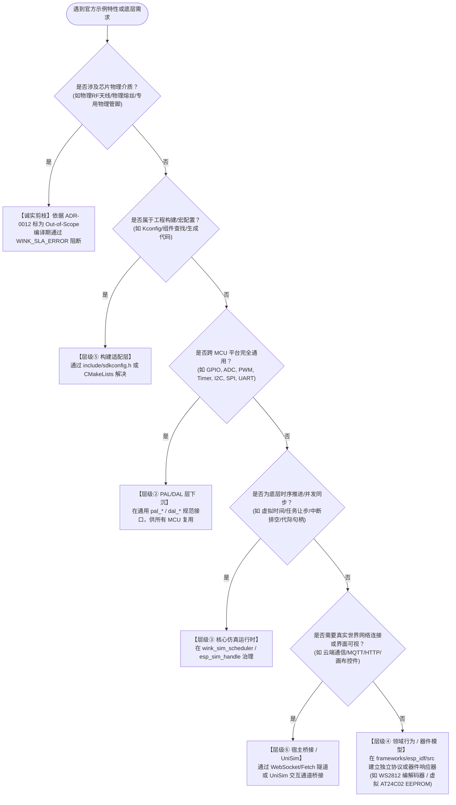

<!-- SPDX-License-Identifier: Apache-2.0 -->
# ESP-IDF 官方示例仿真分类标准、能力图谱与治理规范 (Classification Spec)

> **版本**：v1.0 (正式生效版)  
> **适用目标**：ESP-IDF v6.1 官方 478 个独立示例工程全生命周期治理  
> **三驾马车协同矩阵**：  
> - 📜 **分类规范（宪章法典）**：[`CLASSIFICATION-SPEC.md`](CLASSIFICATION-SPEC.md)（本文档：定义架构职责、能力图谱与准入裁判标准）  
> - 🛠️ **操作手册（实施 SOP）**：[`PLAYBOOK.md`](PLAYBOOK.md)（定义单个示例迁移的五阶段工程流水线与硬性门禁）  
> - 📊 **执行看板（状态总账）**：[`CHECKLIST.md`](CHECKLIST.md)（478 个示例的结构化状态追踪与证据台账）  
> **核心关联文档**：  
> - [ADR-0012：合约诚实与 Fail-Loud 原则](../../../docs/decisions/core/0012-contract-honesty-over-silent-degradation.md)  
> - [ADR-0053：虚拟时间因果同刻总序仲裁](../../../docs/decisions/core/0053-virtual-time-irq-total-order.md)  
> - [ADR-0089：分类记账堆内存模型](../../../docs/decisions/core/0089-heap-caps-accounting-model.md)  
> - [PLAN-20260929：ESP-IDF 深度架构评估与官方示例迁移总纲](../../../docs/implementation-plans/esp32/2026-09-29-esp-idf-simulation-deep-architecture-analysis-and-migration-strategy.md)  

---

## 零、 核心宪章原则与防腐化铁律

在推进 478 个官方示例的规模化迁移时，**分类规则的绝对准确性直接决定了仿真系统的架构寿命**。如果缺乏严格的分类规范，仅凭开发者的直觉或脚本的机械匹配，系统必将迅速滑向“PAL 层被专用外设挤压膨胀、门面层充斥虚假 mock、示例代码失真”的毁灭性深渊。

本规范确立以下**四大不可妥协的宪章铁律**：

### 铁律一：给“能力”分配职责，严禁给“外设名称”划地盘
- 外设名称（如 `RMT`, `ADC`, `I2C`）只是厂商的营销或硬件模块命名，**不能直接作为架构分层的依据**；
- 真实系统是由细粒度的“能力链条”构成的（例如：微秒脉冲缓冲区管理属于底层能力，而 WS2812 协议时序或 NEC 红外编码属于协议模型层）；
- **严禁因为某个外设叫“RMT”就一刀切禁止进入 PAL，也严禁因为叫“ADC”就想当然认为它是普通的模拟采样**。必须沿着调用链条拆解为原子能力，精准映射至对应的架构层。

### 铁律二：示例与能力是网状多对多复用，严禁单维静态 Tier 固化
- 一个官方示例通常依赖多个维度的运行时能力（如一个灯带工程同时依赖：脉冲发射驱动、虚拟时间微秒推进、异步完成通知、WS2812 协议编码）；
- 一项成熟的基建能力同时服务于几十个官方示例；
- **示例绝不能被简单粗暴地打上单一的“Tier 1 / Tier 2”静态标签**。必须通过“能力依赖字典（Capability Catalog）”建立可复用、可查询、可反向影响分析的网状图谱。

### 铁律三：范围、实现与证据三权分立，严禁滥用 Out-of-Scope 掩耳盗铃
- 严禁将“当前基建尚未实现”、“技术路线暂缓投入”或“依赖未就绪”的示例，轻率地标记为“硬件专用 / Out-of-Scope”来人为制造虚假的高兼容率；
- 严格区分 **待审定 / 规划缺口 / 暂缓投入 / 契约阻断 / 芯片不适用 / 明确产品排除** 六种精确状态，保持绝对的“合约诚实（Contract Honesty）”。

### 铁律四：结构化元数据为单一真理（SSOT），Markdown 为派生视图
- 示例的所有分类判定、依赖能力、架构归属与验收凭据，必须以结构化格式（`checklist.data.json`）作为唯一真相源；
- [CHECKLIST.md](CHECKLIST.md) 是由此数据源自动渲染生成的阅读看板，严禁纯手工随意修改表格数据而破坏机器校验链条。

---

## 一、 偏差溯源：现有清单历史执行偏差案例复盘

通过对当前 `CHECKLIST.md` 及早期生成脚本 `generate_esp_idfv61_checklist.py` 的深度审查，发现由于缺乏严密的分类规范，清单中已经暴露出**严重的理解偏差与执行隐患**。以下四大典型案例必须引以为戒：

| 官方示例相对路径 | 现有清单中的描述与归类 | 实际真实底层依赖与架构现实 | 导致的执行偏差与致命危害 |
|---|---|---|---|
| `peripherals/rmt/ir_nec_transceiver`<br>`peripherals/rmt/stepper_motor`<br>`peripherals/rmt/musical_buzzer` | 均被机械化描述为：<br>“驱动虚拟 WS2812 彩灯” | 这些示例使用的是 RMT 的红外载波收发、高频步进电机脉冲发生器以及变频音频蜂鸣器逻辑，**与彩灯没有任何关系**。 | **能力收缩误判**：将通用的“可编程脉冲发生与捕获控制器（RMT）”，错误收缩成“彩灯专用控制器”，导致后续无法支持红外遥控与电机类应用。 |
| `system/ulp/ulp_fsm/ulp_adc` | 被描述为：<br>“对接 PAL pal_adc，支持 ADC 模拟量转换与虚拟电位器控件” | 该示例核心是**在低功耗协处理器（ULP FSM / RISC-V）上独立编译、运行汇编/二进制固件**，在主 CPU 休眠时采集数据并通过共享 RTC 内存唤醒主核。 | **架构层级严重漏水**：完全漏掉了独立的协处理器运行时沙箱、汇编构建链及跨核 IPC 内存共享机制，误以为写个普通的 ADC 驱动就能跑通。 |
| `protocols/websocket/server` | 被描述为：<br>“WebSocket 客户端長连接” | 该示例是完整的 **WebSocket 服务端（Server-side）**，需要在 ESP32 上监听端口、握手升级并管理多客户端 Session。 | **实现方向彻底倒置**：客户端（Client）与服务端（Server）在网络监听、连接池管理及验收断言上存在本质对立，直接导致实现代码南辕北辙。 |
| `build_system/cmake/*` | 整组 19 个工程被直接排除：<br>“声明 Out-of-Scope，不属于运行时业务代码” | 这一组示例是验证 ESP-IDF 官方组件依赖、自定义构建规则、二进制打包与头文件搜索路径的**黄金语料**。 | **产品兼容目标撕裂**：用户要求的是“现成 ESP-IDF 原生工程无缝在系统内编译运行”，全量排除构建系统示例直接在工具链兼容性上留下了巨大盲区。 |

> **根因定位**：早期生成脚本依赖路径中的字符串模式匹配（例如路径中只要有 `rmt` 就盲目套用 WS2812 模板，只要有 `adc` 就盲目套用电位器模板），并且在未命中任何规则时默认将其划入 `In-Scope Pending`。这证明了：**缺乏形式化语义规范的脚本机械普查，绝不能充当架构裁决的依据！**

---

## 二、 六层架构职责与判定决策树

为了彻底消除各层之间的职责模糊与踢皮球现象，WinkMicroOS 将跨靶仿真系统自上而下严格划分为**六大职责层**。任何示例所依赖的任何一项特性，其实现必须且只能归属于以下六层之一：

```
+───────────────────────────────────────────────────────────────────────────────────────────+
│                                 跨靶仿真系统六层架构职责分工                              │
+─────────────────┬───────────────────────────────────────────┬─────────────────────────────+
│ 架构层级        │ 核心承担职责 (MUST DO)                    │ 严禁越界行为 (FORBIDDEN)    │
+─────────────────┼───────────────────────────────────────────┼─────────────────────────────+
│ ① ESP-IDF 门面  │ 保留乐鑫原生 C-ABI 声明；参数校验；句柄代  │ 严禁在门面内自建复杂驱动状态 │
│   (Facade)      │ 际化转换；错误码转换；调用语义适配        │ 机；严禁直接持有真实外设硬件 │
+─────────────────┼───────────────────────────────────────────┼─────────────────────────────+
│ ② 平台抽象层    │ 提供跨 MCU (8051/STM32/ESP32) 的极简通用  │ 严禁塞入特定芯片私有协议！  │
│   (PAL/DAL)     │ 硬件抽象；声明 target 能力差异边界         │ 严禁包含高层业务数据结构    │
+─────────────────┼───────────────────────────────────────────┼─────────────────────────────+
│ ③ 核心仿真运行  │ 微秒级虚拟时间推进；纤程协作式任务调度；   │ 严禁依赖具体外设语义；      │
│   (Core Sim)    │ 结构化 Trace 记录；同刻因果仲裁；中断排空 │ 严禁依赖外部真实物理时间    │
+─────────────────┼───────────────────────────────────────────┼─────────────────────────────+
│ ④ 领域行为与器  │ 控制器复杂状态机；特定总线协议编解码；     │ 严禁直接调用宿主未隔离的系统 │
│   件模型 (Model)│ 外部硬件器件应答 (EEPROM, Sensor, LCD)    │ 调用；必须通过统一总线挂载  │
+─────────────────┼───────────────────────────────────────────┼─────────────────────────────+
│ ⑤ 构建适配层    │ Kconfig 宏转义与默认值注入；CMake 原厂工程│ 严禁侵入用户 C 业务源码；   │
│   (Build Layer) │ 透明组装；组件搜索路径解耦                │ 保持应用源码一行不改        │
+─────────────────┼───────────────────────────────────────────┼─────────────────────────────+
│ ⑥ 前端与宿主桥  │ 提供真实网络隧道 (WebSocket/Fetch/Socket);│ 严禁固件直接感知宿主差异；  │
│   (Host Bridge) │ UniSim 画布渲染；虚拟按键/旋钮输入注入    │ 必须经由仿真事件泵调度      │
+─────────────────┴───────────────────────────────┴─────────────────────────────────────────+
```

### 架构下沉归属判定决策树 (Decision Tree)

遇到任何一个官方示例的新增特性或底层需求时，必须强制按顺序通过以下决策流判定其归属：



---

## 三、 示例七维元数据 Schema 规范

为实现机器可读、自动化验证并与 CI 门禁联动，每一个官方示例在登记档案（`checklist.data.json`）中必须完整记录以下 **七大维度元数据**：

```json
{
  "$schema": "http://json-schema.org/draft-07/schema#",
  "title": "EspIdfExampleEntry",
  "type": "object",
  "required": [
    "id",
    "upstream_path",
    "baseline",
    "required_capabilities",
    "architectural_placement",
    "compatibility",
    "fidelity_contract",
    "scope_and_maturity",
    "acceptance"
  ],
  "properties": {
    "id": { "type": "string", "pattern": "^[0-9]{3}$" },
    "upstream_path": { "type": "string" },
    "baseline": {
      "type": "object",
      "required": ["upstream_commit", "target_soc", "profile", "execution_backend", "external_topology"],
      "properties": {
        "upstream_commit": { "type": "string" },
        "target_soc": { "type": "string", "enum": ["esp32", "esp32s3", "esp32c3", "esp32c6", "all"] },
        "profile": { "type": "string", "enum": ["LITE", "STANDARD", "PRO"] },
        "execution_backend": { "type": "string", "enum": ["host_native", "wasm32_node", "wasm32_browser", "all"] },
        "external_topology": { "type": "string", "description": "外部引脚连线与虚拟外设挂载拓扑" }
      }
    },
    "required_capabilities": {
      "type": "array",
      "items": { "type": "string", "pattern": "^cap\\.[a-z0-9_\\-\\.]+$" },
      "description": "显式声明所依赖的原子能力 ID 集合"
    },
    "architectural_placement": {
      "type": "object",
      "required": ["interface_layer", "behavior_layer", "state_owner"],
      "properties": {
        "interface_layer": { "type": "string", "enum": ["facade", "pal", "build"] },
        "behavior_layer": { "type": "string", "enum": ["pal_target", "sim_kernel", "device_model", "host_tunnel"] },
        "state_owner": { "type": "string", "description": "静态状态机与生命周期重置者" }
      }
    },
    "compatibility": {
      "type": "object",
      "required": ["source_code_policy", "header_closure", "sdkconfig_overrides"],
      "properties": {
        "source_code_policy": { "type": "string", "enum": ["zero_modification_mirror", "shimmed_harness"] },
        "header_closure": { "type": "array", "items": { "type": "string" } },
        "sdkconfig_overrides": { "type": "object" }
      }
    },
    "fidelity_contract": {
      "type": "object",
      "required": ["timing_model", "concurrency_model", "unsupported_features"],
      "properties": {
        "timing_model": { "type": "string", "enum": ["deterministic_microsecond", "tick_level", "best_effort"] },
        "concurrency_model": { "type": "string", "enum": ["cooperative_fiber", "simulated_smp", "event_pump"] },
        "unsupported_features": { "type": "array", "items": { "type": "string" } }
      }
    },
    "scope_and_maturity": {
      "type": "object",
      "required": ["status", "tier", "audit_verdict"],
      "properties": {
        "status": {
          "type": "string",
          "enum": [
            "pending_audit",
            "in_scope_deficit",
            "in_scope_deferred",
            "contract_blocked",
            "soc_mismatch",
            "out_of_scope_product"
          ]
        },
        "tier": { "type": "string", "enum": ["Tier 1 (PAL下沉)", "Tier 2 (虚拟总线/隧道)", "Tier 3 (物理剪枝)", "Tier 0 (系统核心)"] },
        "audit_verdict": { "type": "string", "enum": ["audited", "candidate_provisional"] }
      }
    },
    "acceptance": {
      "type": "object",
      "required": ["observability_level", "scenario_path", "evidence_command"],
      "properties": {
        "observability_level": { "type": "string", "enum": ["Level 1 (UI可视)", "Level 2 (日志/网络)", "Level 3 (IO打点/Trace)", "Level 4 (内部静默)"] },
        "scenario_path": { "type": "string" },
        "evidence_command": { "type": "string" }
      }
    }
  }
}
```

---

## 四、 公共能力图谱字典 (Capability Catalog V1.0)

所有示例必须从以下标准能力字典中显式引用其依赖项，禁止随意发明无规范的字符串标记：

```
+───────────────────────────────────────────────────────────────────────────────────────────+
│                               公共原子能力图谱字典 (Catalog)                              │
+──────────────────────┬────────────────────────┬───────────────────────────────────────────+
│ 能力命名空间         │ 标准能力 ID            │ 归属层级与能力语义说明                    │
+──────────────────────┼────────────────────────┼───────────────────────────────────────────+
│ 1. 核心与并发调度    │ cap.core.fiber_task    │ [层级③] 纤程级任务创建、切换与生命周期    │
│    (cap.core.*)      │ cap.core.sync_tokens   │ [层级③] 32位代际令牌化信号量/队列/事件组  │
│                      │ cap.core.category_heap │ [层级①/③] ADR-0089 分类记账与堆边界防御  │
│                      │ cap.core.hot_restart   │ [层级③] Phase 4 Wasm 模块级彻底热重启     │
+──────────────────────┼────────────────────────┼───────────────────────────────────────────+
│ 2. 模拟量与波形      │ cap.analog.adc_oneshot │ [层级②] PAL 通用单次采样与引脚电平转换    │
│    (cap.analog.*)    │ cap.analog.adc_dma     │ [层级②/④] 连续双缓冲 DMA 模拟量采集      │
│                      │ cap.analog.dac_out     │ [层级②] PAL 通用 DAC 模拟量电压输出       │
+──────────────────────┼────────────────────────┼───────────────────────────────────────────+
│ 3. 脉冲与高精度时序  │ cap.pulse.tx_buffer    │ [层级②] PAL 通用微秒脉冲序列发送缓冲 (RMT)│
│    (cap.pulse.*)     │ cap.pulse.rx_capture   │ [层级②] PAL 通用微秒脉冲电平跳变捕获 (RMT)│
│                      │ cap.pulse.pcnt_quad    │ [层级②] PAL 通用正交编码脉冲计数 (PCNT)  │
+──────────────────────┼────────────────────────┼───────────────────────────────────────────+
│ 4. 通用串行与总线    │ cap.bus.i2c_master     │ [层级②] PAL 通用 I2C 主机模式 (标准/快速) │
│    (cap.bus.*)       │ cap.bus.spi_master     │ [层级②] PAL 通用 SPI 主机轮询/DMA 传输    │
│                      │ cap.bus.uart_stream    │ [层级②] PAL 通用异步双工串口字符流传输   │
+──────────────────────┼────────────────────────┼───────────────────────────────────────────+
│ 5. 虚拟协议与语义流  │ cap.proto.ws2812       │ [层级④] 领域模型 WS2812 协议编码与灯条管道│
│    (cap.proto.*)     │ cap.proto.nec_ir       │ [层级④] 领域模型 NEC 格式红外载波收发解析 │
│                      │ cap.proto.twai_can     │ [层级④] 领域模型 CAN 帧过滤与虚拟总线广播 │
│                      │ cap.proto.i2s_stream   │ [层级④] 领域模型 I2S 音频流环形缓冲管道   │
+──────────────────────┼────────────────────────┼───────────────────────────────────────────+
│ 6. 存储与虚拟文件系统│ cap.vfs.mem_sandbox    │ [层级④] 纯内存 Inode 树状沙箱文件系统     │
│    (cap.vfs.*)       │ cap.vfs.nvs_partition  │ [层级④] 虚拟 Flash 分区表与 NVS 键值存储  │
│                      │ cap.vfs.spiffs_format  │ [层级④] SPIFFS 扁平文件系统镜像与挂载     │
+──────────────────────┼────────────────────────┼───────────────────────────────────────────+
│ 7. 网络与真实连接    │ cap.net.event_pump     │ [层级①] D2 异步深拷贝事件队列与信封分发   │
│    (cap.net.*)       │ cap.net.host_socket    │ [层级⑥] 宿主 POSIX / WinSock 原生网络隧道 │
│                      │ cap.net.host_ws_tunnel │ [层级⑥] 浏览器 WebSocket 真实全双工网络代理│
+──────────────────────┼────────────────────────┼───────────────────────────────────────────+
│ 8. 协处理器与特殊硬件│ cap.coproc.ulp_fsm     │ [层级④] ULP 状态机汇编解释器与 RTC 共享内存│
│    (cap.coproc.*)    │ cap.coproc.ulp_riscv   │ [层级④] ULP RISC-V 32位 ELF 二进制加载器  │
+──────────────────────┴────────────────────────┴───────────────────────────────────────────+
```

---

## 五、 范围与成熟度六态分类标准

为了彻底终结“非黑即白”的粗暴划归，所有条目必须在以下 **六种范围与成熟度状态** 中严格归类：

```
                    ┌───────────────────────────────┐
                    │ 官方示例条目初次进入清单      │
                    └───────────────┬───────────────┘
                                    │
                                    ▼
                    ┌───────────────────────────────┐
                    │ [1] 待审定 (pending_audit)    │ 尚未完整读懂源码与底层依赖
                    └───────────────┬───────────────┘
                                    │ 经架构师/AI 审定七维信息
                                    ▼
        ┌───────────────────────────┴───────────────────────────┐
        ▼                                                       ▼
 纳入仿真规划目标 (In-Scope)                              不纳入目标 / 无法支持
        │                                                       │
        ├─► [2] 规划缺口 (in_scope_deficit)                     ├─► [4] 契约阻断 (contract_blocked)
        │       确认纳入，但当前基建有缺口，待排期实施                  纯软件模型无法兑现核心物理时序
        │                                                       │
        └─► [3] 暂缓投入 (in_scope_deferred)                    ├─► [5] 架构不适用 (soc_mismatch)
                属于产品目标，但当前阶段优先级低                        该 SoC 原生无此硬件 (如C3无DAC)
                                                                │
                                                                └─► [6] 明确产品排除 (out_of_scope_product)
                                                                        依据 ADR-0012 排除纯物理硬件
```

### 六态定义与支持承诺：
1. **`pending_audit`（待审定）**：
   - **定义**：仅通过脚本完成了初步目录抓取，尚未人工或深度审定其源码依赖、时序模型与外部硬件拓扑。
   - **承诺**：**严禁直接动手实施或打勾！** 必须先完成七维元数据登记并转为其他状态。
2. **`in_scope_deficit`（纳入目标，当前缺口）**：
   - **定义**：确认属于仿真器应支持的范围，但当前底层缺乏对应的能力（例如缺少 ADC 驱动或缺少 VFS 沙箱）。
   - **承诺**：属于常规兼容性缺口，列入排期开发计划。
3. **`in_scope_deferred`（纳入目标，暂缓投入）**：
   - **定义**：产品战略上需要支持，但需要重型外部器件模型（例如依赖复杂的第三方蓝牙心率计或特定型号触摸屏），当前阶段暂不投入资源。
4. **`contract_blocked`（契约阻断，无法兑现）**：
   - **定义**：固件逻辑强依赖纳秒级总线竞争、高速外部物理时钟锁相环，纯协作调度与宿主环境无法提供高保真契约。
   - **承诺**：必须在文档中明确记录无法兑现的具体技术机理。
5. **`soc_mismatch`（芯片架构不适用）**：
   - **定义**：当前示例所依赖的硬件在该 SoC 上物理不存在（例如在 ESP32-C3 上尝试运行仅存在于经典 ESP32 上的 DAC 示例）。
6. **`out_of_scope_product`（明确产品级排除）**：
   - **定义**：**严格遵循 ADR-0012**，属于外部不可逆物理硬件介质（DVP/CSI 摄像头物理传输、物理芯片熔丝 Efuse 烧写、物理以太网变压器 PHY、Wi-Fi 射频微波电路校准）。
   - **承诺**：编译期通过 `WINK_SLA_ERROR` Fail-Loud 显式阻断，绝不留伪造数据的假空桩。

---

## 六、 首批六大代表性争议示例规范打样

为了验证这套分类标准的严密性与落地性，选取之前最容易出现偏差的 6 个核心争议用例进行完整元数据打样：

---

### 打样 1：`peripherals/adc/oneshot_read` (#004)
- **上游路径**：`examples/peripherals/adc/oneshot_read`
- **适用基线**：`commit: fff9895c` | `SoC: all` | `Profile: STANDARD` | `Backend: all` | `外部拓扑: ADC1_CH0 挂载虚拟电位器`
- **能力依赖**：`[cap.analog.adc_oneshot, cap.core.fiber_task, cap.core.hot_restart]`
- **架构归属**：
  - 接口归属：`esp_adc/adc_oneshot.h` 门面层（层级①）
  - 行为实现：`pal_adc` 通用平台抽象层（层级②）
  - 状态持有：`pal_adc_sim_ctx`
- **保真契约**：微秒级采样；电压范围 0~3300mV；12位分辨率线性转换；不支持纳秒级模拟噪声注入。
- **范围成熟度**：`in_scope_deficit` | `🏛️ Tier 1 (PAL下沉)` | `audited`
- **验收标准**：UniSim Headless 注入模拟量 1650mV，断言应用读取 ADC Raw 值为 2048 (±5)。

---

### 打样 2：`system/ulp/ulp_fsm/ulp_adc` (#176)
- **上游路径**：`examples/system/ulp/ulp_fsm/ulp_adc`
- **适用基线**：`commit: fff9895c` | `SoC: esp32, esp32s3` | `Profile: PRO` | `Backend: host_native` | `外部拓扑: ULP 协处理器 + RTC IO`
- **能力依赖**：`[cap.coproc.ulp_fsm, cap.analog.adc_oneshot, cap.core.hot_restart]`
- **架构归属**：
  - 接口归属：`esp32/ulp.h` 门面层（层级①）
  - 行为实现：ULP FSM 指令集虚拟机模型（层级④）
  - 状态持有：`ulp_vm_sim_ctx` 与虚拟 RTC 慢速内存块
- **保真契约**：主核调用 `ulp_run()` 启动协处理器循环，主核进入低功耗挂起；ULP 虚拟机周期执行汇编采样，达到阈值产生软件中断唤醒主核。
- **范围成熟度**：`in_scope_deferred` | `🌐 Tier 2 (虚拟总线/模型)` | `audited`
- **验收标准**：主核挂起，ULP 采样到高电平后主核成功被唤醒并打印日志。

---

### 打样 3：`peripherals/rmt/led_strip` (#028)
- **上游路径**：`examples/peripherals/rmt/led_strip`
- **适用基线**：`commit: fff9895c` | `SoC: all` | `Profile: STANDARD` | `Backend: all` | `外部拓扑: GPIO18 挂载 8 颗虚拟 WS2812 级联灯珠`
- **能力依赖**：`[cap.pulse.tx_buffer, cap.proto.ws2812, cap.core.fiber_task]`
- **架构归属**：
  - 接口归属：`driver/rmt_tx.h` 门面层（层级①）
  - 行为实现：`pal_rmt` 脉冲缓冲（层级②） + WS2812 协议编码管道（层级④）
  - 状态持有：`rmt_tx_channel_t` + `dal_ws2812`
- **特别红线**：**严禁在 PAL 层编写 WS2812 颜色协议代码！** PAL 只接收脉冲符号流，由领域模型负责将脉冲解析为 RGB 数组送给前端。
- **范围成熟度**：`in_scope_deficit` | `🌐 Tier 2 (虚拟总线/模型)` | `audited`
- **验收标准**：UniSim 场景脚本断言第 1 颗与第 8 颗灯珠的 RGB 颜色值准确变更。

---

### 打样 4：`peripherals/rmt/ir_nec_transceiver` (#029)
- **上游路径**：`examples/peripherals/rmt/ir_nec_transceiver`
- **适用基线**：`commit: fff9895c` | `SoC: all` | `Profile: STANDARD` | `Backend: all` | `外部拓扑: GPIO18(TX) 环回连接至 GPIO19(RX)`
- **能力依赖**：`[cap.pulse.tx_buffer, cap.pulse.rx_capture, cap.proto.nec_ir]`
- **架构归属**：
  - 接口归属：`driver/rmt_tx.h` 与 `driver/rmt_rx.h` 门面层（层级①）
  - 行为实现：`pal_rmt` 微秒脉冲捕获（层级②） + NEC 红外协议状态机（层级④）
  - 状态持有：`rmt_channel_pair_ctx`
- **保真契约**：发送端按 38kHz 载波编码输出引导码、地址码与数据码；接收端通过跳变捕获滤除载波并解码出原始 32 位 NEC 用户数据。
- **范围成熟度**：`in_scope_deferred` | `🌐 Tier 2 (虚拟总线/模型)` | `audited`
- **验收标准**：发送地址 `0x00FF`、命令 `0x55AA`，接收端完整捕获并解码一致。

---

### 打样 5：`protocols/websocket/server` (#197)
- **上游路径**：`examples/protocols/websocket/server`
- **适用基线**：`commit: fff9895c` | `SoC: all` | `Profile: PRO` | `Backend: host_native` | `外部拓扑: 虚拟网络 Netif + 宿主端口监听`
- **能力依赖**：`[cap.net.event_pump, cap.net.host_socket, cap.core.fiber_task]`
- **架构归属**：
  - 接口归属：`esp_websocket_server.h` 门面层（层级①）
  - 行为实现：宿主原生 Socket 代理隧道（层级⑥）
  - 状态持有：`esp_ws_server_ctx`
- **保真契约**：在宿主环境监听指定 TCP 端口，响应 HTTP 101 Switching Protocols 升级握手，支持标准 WS 文本/二进制数据帧双向通信。
- **范围成熟度**：`in_scope_deferred` | `🌐 Tier 2 (宿主网络/隧道)` | `audited`
- **验收标准**：外部测试脚本向固件监听端口建立 WS 握手，发送 Echo 消息并断言收到相同回显。

---

### 打样 6：`build_system/cmake/custom_component` (#426)
- **上游路径**：`examples/build_system/cmake/custom_component`
- **适用基线**：`commit: fff9895c` | `SoC: all` | `Profile: STANDARD` | `Backend: all` | `外部拓扑: 纯软件构建`
- **能力依赖**：`[cap.core.fiber_task]`
- **架构归属**：
  - 接口归属：构建配置适配（层级⑤）
  - 行为实现：`wink-tools` CMake 原生组件解析器
  - 状态持有：无（无状态编译）
- **保真契约**：验证原厂 `idf_component_register()` 在无 ESP-IDF 构建脚本下，能被 WinkMicroOS 编译体系透明导入并成功链接自定义组件符号。
- **范围成熟度**：`in_scope_deficit` | `⚙️ Tier 0 (系统核心/构建)` | `audited`
- **验收标准**：`wink.py build sim` 0 errors 编译通过，并成功调用自定义组件函数打印输出。

---

## 七、 自动化治理工具链与 CI 准入执行门禁

为了确保分类标准能够严格执行，任何人都无法通过“绕过流程”来破坏系统边界，系统必须挂载 **四项自动化执行硬门禁**：

```text
               ┌────────────────────────────────────────────────────────┐
               │         PR 提交或代码合并阶段 CI 自动化审查流水线      │
               └───────────────────────────┬────────────────────────────┘
                                           │
       ┌───────────────────────────────────┼───────────────────────────────────┐
       ▼                                   ▼                                   ▼
 [Gate 1: 审计准入拦截]             [Gate 2: PAL 膨胀拦截]              [Gate 3: 架构分层防线]
 凡处于 pending_audit 状态          新增任何 pal_* API 必须关联         运行 winkcli lint 检测
 的示例，严禁进入实施流水线！       通用能力字典并提供多Target凭据！     禁止 ESP-IDF 数据结构倒灌！
       │                                   │                                   │
       └───────────────────────────────────┼───────────────────────────────────┘
                                           ▼
                                 [Gate 4: 证据陈旧作废]
                                 底层核心调度器/内存模型代码变动后，
                                 所有关联示例的测试证据必须全量自动重验！
```

### 1. 升级生成脚本 `generate_esp_idfv61_checklist.py`
- 废弃原来基于路径粗暴匹配并覆盖写入 Markdown 的落后模式；
- 脚本执行逻辑调整为：
  1. 读取单一真相源 `checklist.data.json`；
  2. 校验所有示例的七维元数据 Schema 是否合规；
  3. 校验所声明的能力 ID 是否全部在 `Capability Catalog` 中存在；
  4. 自动将 `checklist.data.json` 单向渲染输出为标准易读的 [CHECKLIST.md](CHECKLIST.md)。

### 2. CI 门禁检查点细则
- **Gate 1（未审定直接实施拦截）**：  
  如果某个 PR 试图将某个示例标记为 `[x]`（已完成），但该示例在数据库中的状态依然是 `pending_audit` 或 `audit_verdict == "candidate_provisional"`，CI 立即判为失败！必须先完成深度人工架构审定。
- **Gate 2（PAL 膨胀与私有化拦截）**：  
  一旦检测到 PR 修改了 `wink-micro-os/pal/include/`，自动化机器人立即检查是否包含 `esp_` 或厂商特有命名，并强制要求提交者提供该接口在 8051、STM32 等非 ESP 平台上的抽象通用性论证文档。
- **Gate 3（分层门禁：`winkcli lint`）**：  
  运行 `winkcli lint --pack layering --pack api`。任何上层框架门面或应用私有头文件一旦被底层驱动或 DAL 逆向 include，编译期直接阻断合并。
- **Gate 4（依赖反向回归防御）**：  
  当底层某项核心能力（如 `cap.pulse.tx_buffer` 或 `cap.core.sync_tokens`）发生代码重构时，CI 自动通过反向能力依赖树检索出所有受影响的官方示例，强制将其纳入必须通过的动态回归集合中。

---

## 八、 总结与执行路线图

本规范的发布，为后续整个 `CHECKLIST.md` 478 个官方示例的规模化迁移确立了唯一不可动摇的**宪法依据**。

后续落地的标准工作流程如下：
1. **本规范确立并归档**：作为整个迁移工程的技术总规；
2. **对 478 个示例建立初始结构化档案**：从粗糙文本迈向精确元数据，将所有未经人工深入核验的示例统一置于 `pending_audit` 保护态；
3. **按聚类能力推进迁移（以案促建）**：每一个迁移批次启动前，先审定该批次涉及的示例七维元数据，在实践中逐步充实并固化我们的能力图谱字典！
