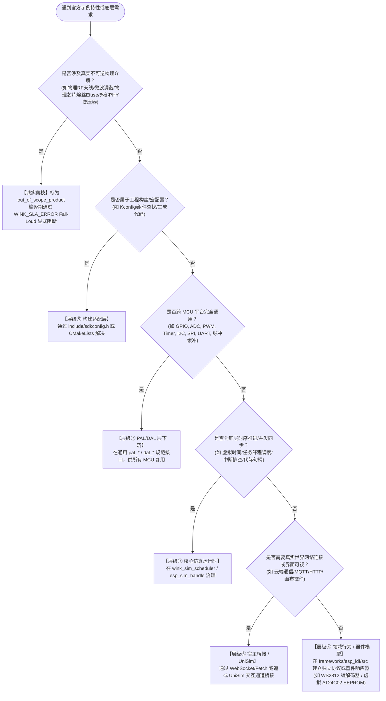

<!-- SPDX-License-Identifier: Apache-2.0 -->
# ESP-IDF 官方示例仿真分类标准、能力图谱与治理规范 (Classification Spec)

> **版本**：v1.1 (Proposed Revision / 征求意见稿)  
> **适用目标**：ESP-IDF v6.1 官方 478 个独立示例工程全生命周期治理  
> **五位一体协同矩阵**：  
> - 📜 **分类规范（宪章法典）**：[`CLASSIFICATION-SPEC.md`](CLASSIFICATION-SPEC.md)（本文档：定义架构职责、分类决策树与准入裁判标准）  
> - 🧩 **能力字典（能力 SSOT）**：[`capability-catalog.yaml`](capability-catalog.yaml)（原子能力图谱单一真理源，支持反向影响分析与 CI 校验）  
> - 💾 **结构化档案（数据 SSOT）**：[`checklist.data.json`](checklist.data.json)（478 个示例的结构化七维元数据单一真理源）  
> - 🚦 **门禁注册表（CI 真理源）**：[`.gates/gates.yaml`](.gates/gates.yaml)（Gate 1~4 全部规则的声明式注册表，唯一 CI 入口：`python .gates/run_gates.py --mode pr`）  
> - 🛠️ **操作手册（实施 SOP）**：[`PLAYBOOK.md`](PLAYBOOK.md)（定义单个示例迁移的五阶段工程流水线与硬性门禁）  
> - 📊 **执行看板（派生视图）**：[`CHECKLIST.md`](CHECKLIST.md)（由数据源单向渲染生成的只读看板，严禁纯手工编辑）  
> **核心关联 ADR**：  
> - [ADR-0012：契约诚实优于静默降级（PAL/HAL 抽象层通用原则）](../../../docs/decisions/core/0012-contract-honesty-over-silent-degradation.md)  
> - [ADR-0014：单虚拟核单线程仿真调度模型](../../../docs/decisions/unisim/0014-sim-single-virtual-core.md)  
> - [ADR-0043：YAML 驱动的分层架构防腐检查与 Lint 体系](../../../docs/decisions/tools/0043-yaml-driven-layer-lint.md)  
> - [ADR-0053：虚拟时间因果同刻总序仲裁模型](../../../docs/decisions/unisim/0053-sim-same-timestamp-event-total-order.md)  
> - [ADR-0085：ESP-IDF 门面 SOC_CAPS 与 PAL 能力双事实源架构](../../../docs/decisions/core/0085-esp-idf-facade-soc-caps-vs-pal-caps-dual-ssot.md)  
> - [ADR-0087：仿真资产通道与芯片级数据所有权模型](../../../docs/decisions/core/0087-esp-idf-asset-channels-and-soc-data-ownership.md)  
> - [ADR-0089：分类记账堆内存与边界防御模型](../../../docs/decisions/core/0089-esp-idf-heap-caps-allocation-contract.md)  
> - [ADR-0090：集中式可插拔门禁系统（`.gates/` 架构）](../../../docs/decisions/unisim/0090-centralized-pluggable-gate-system.md)
> **核心关联设计规范**：  
> - [`docs/zh/design/04-wasm-simulation/`](../../../docs/zh/design/04-wasm-simulation/00-README.md)（UniSim 现行保真轴 A~F SSOT：A-物理通道、B-时基、C-定时器语义、D-中断模型、E-调度并发、F-故障观测）

---

## 零、 核心宪章原则与防腐化铁律

在推进 478 个官方示例的规模化迁移时，**分类规则的绝对准确性直接决定了仿真系统的架构寿命**。如果缺乏严格的分类规范，仅凭开发者的直觉或脚本的机械匹配，系统必将迅速滑向“PAL 层被专用外设挤压膨胀、门面层充斥虚假 mock、示例代码失真”的毁灭性深渊。

本规范确立以下**五大不可妥协的宪章铁律**：

### 铁律一：给“能力”分配职责，严禁给“外设名称”划地盘
- 外设名称（如 `RMT`, `ADC`, `I2C`）只是厂商的硬件模块命名，**不能直接作为架构分层的依据**；
- 真实系统是由细粒度的“能力链条”构成的（例如：微秒脉冲发射缓冲属于底层能力，而 WS2812 协议时序或 NEC 红外编码属于协议模型层）；
- **严禁因为外设叫“RMT”就一刀切禁止进入 PAL，也严禁因为叫“ADC”就想当然认为它是普通的模拟采样**。必须沿着调用链条拆解为原子能力，精准映射至对应的架构层。

### 铁律二：示例与能力是网状多对多复用，严禁单维静态 Tier 固化
- 一个官方示例通常依赖多个维度的运行时能力（如一个灯带工程同时依赖：脉冲发射驱动、虚拟时间微秒推进、异步完成通知、WS2812 协议编码）；
- 一项成熟的基建能力同时服务于几十个官方示例；
- **Schema 中严禁定义静态的“Tier 1 / Tier 2”单一归类字段**。示例的分层与复杂性由其引用的原子能力动态聚合决定，必须通过 [`capability-catalog.yaml`](capability-catalog.yaml) 建立可复用、可查询、可反向影响分析的网状图谱。

### 铁律三：范围、实现与证据三权分立，严禁滥用 Out-of-Scope 掩耳盗铃
- 严禁将“当前基建尚未实现”、“技术路线暂缓投入”或“依赖未就绪”的示例，轻率地标记为“硬件专用 / Out-of-Scope”来人为制造虚假的高兼容率；
- 严格区分 **待审定 / 规划缺口 / 暂缓投入 / 契约阻断 / 明确产品排除** 五种精确范围状态；
- 任何产品级排除（`out_of_scope_product`）必须具备不可逆物理介质事实，并在编译期通过 `WINK_SLA_ERROR` Fail-Loud 显式阻断，拒绝任何假空桩。

### 铁律四：结构化元数据为单一真理（SSOT），Markdown 为派生视图
- 示例的所有分类判定、依赖能力、芯片矩阵与交付凭据，必须以结构化格式（[`checklist.data.json`](checklist.data.json) 及 [`capability-catalog.yaml`](capability-catalog.yaml)）作为唯一真相源；
- [`CHECKLIST.md`](CHECKLIST.md) 是由此数据源自动渲染生成的只读看板，**严禁纯手工随意修改表格数据**。任何 CI 门禁必须直接校验 JSON/YAML 数据源，不得依赖 Markdown 文本。

### 铁律五：边界争议必须走仲裁流程，严禁沉默搁置
- 分类判定出现分歧时，当事人在 PR 中标注 `classification-dispute`；
- 架构师在 3 个工作日内出具裁定（记录裁定推演路径与依据，回写元数据 `audit` 字段）；
- 如果现有决策树无法覆盖，必须先提交 ADR 修订决策树，再完成裁定；
- 涉及 Schema 破损性变更时触发规范版本号升级并执行数据迁移脚本。

---

## 一、 偏差溯源：现有清单历史执行偏差案例复盘

通过对当前 `CHECKLIST.md` 及早期生成脚本 `generate_esp_idfv61_checklist.py` 的深度审查，发现由于缺乏严密的分类规范与校验机制，清单中暴露出了**严重的理解偏差与执行隐患**。以下四大典型案例必须引以为戒：

| 官方示例相对路径与真实编号 | 现有清单中的描述与归类 | 实际真实底层依赖与架构现实 | 导致的执行偏差与致命危害 |
|---|---|---|---|
| `peripherals/rmt/ir_nec_transceiver` (#063)<br>`peripherals/rmt/musical_buzzer` (#066)<br>`peripherals/rmt/stepper_motor` (#068) | 均被机械化描述为：<br>“驱动虚拟 WS2812 彩灯” | 这些示例使用的是 RMT 的红外载波收发、高频步进电机脉冲发生器以及变频音频蜂鸣器逻辑，**与彩灯没有任何关系**。 | **能力收缩误判**：将通用的“可编程脉冲发生与捕获控制器（RMT）”，错误收缩成“彩灯专用控制器”，导致后续无法支持红外遥控与电机类应用。 |
| `system/ulp/ulp_fsm/ulp_adc` (#171) | 被描述为：<br>“对接 PAL pal_adc，支持 ADC 模拟量转换与虚拟电位器控件” | 该示例核心是**在低功耗协处理器（ULP FSM / RISC-V）上独立编译、运行汇编/二进制固件**，在主 CPU 休眠时采集数据并通过共享 RTC 内存唤醒主核。 | **架构层级严重漏水**：完全漏掉了独立的协处理器运行时沙箱、汇编构建链及跨核 IPC 内存共享机制，误以为写个普通的 ADC 驱动就能跑通。 |
| `protocols/http_server/ws_echo_server` (#197) | 被描述为：<br>“WebSocket 客户端长连接” | 该示例是完整的 **HTTP WebSocket 服务端（Server-side Echo）**，需要在 ESP32 上监听端口、握手升级并管理多客户端 Session。 | **实现方向彻底倒置**：客户端（Client）与服务端（Server）在网络监听、连接池管理及验收断言上存在本质对立，直接导致实现代码南辕北辙。 |
| `build_system/cmake/*` (#426~#432，共 7 项)<br>`build_system/*` (#426~#444，共 19 项) | 整组工程被直接排除：<br>“声明 Out-of-Scope，不属于运行时业务代码” | 这一组示例是验证 ESP-IDF 官方组件依赖、自定义构建规则、二进制打包与头文件搜索路径的**黄金语料**。 | **产品兼容目标撕裂**：用户要求的是“现成 ESP-IDF 原生工程无缝在系统内编译运行”，全量排除构建系统示例直接在工具链兼容性上留下了巨大盲区。 |

> **根因定位**：早期生成脚本依赖路径中的字符串模式匹配（例如路径中只要有 `rmt` 就盲目套用 WS2812 模板，只要有 `adc` 就盲目套用电位器模板），并且直接将自增数字编号写死在非稳定结构中。这证明了：**缺乏形式化语义规范的脚本机械普查，绝不能充当架构裁决的依据！**

---

## 二、 六层架构职责与判定决策树

跨靶仿真系统自上而下严格划分为**六大职责层**，与仓库基准分层（App / BAL / DAL / PAL / Targets）紧密对齐。任何示例所依赖的任何一项特性，其实现必须且只能归属于以下六层之一：

```
+───────────────────────────────────────────────────────────────────────────────────────────+
│                                 跨靶仿真系统六层架构职责分工                              │
+─────────────────┬───────────────────────────────────────────┬─────────────────────────────+
│ 架构层级        │ 核心承担职责 (MUST DO)                    │ 严禁越界行为 (FORBIDDEN)    │
+─────────────────┼───────────────────────────────────────────┼─────────────────────────────+
│ ① ESP-IDF 门面  │ 保留乐鑫原生 C-ABI 声明；参数校验；句柄代  │ 严禁在门面内自建复杂驱动状态 │
│   (Facade)      │ 际化转换；错误码转换；调用语义适配        │ 机；严禁直接持有真实外设硬件 │
+─────────────────┼───────────────────────────────────────────┼─────────────────────────────+
│ ② 平台抽象层    │ 提供跨 MCU (8051/STM32/ESP32) 的通用硬件  │ 严禁塞入特定芯片私有协议！  │
│   (PAL/DAL)     │ 抽象；纯微秒脉冲/总线缓冲；外设器件模型驱动│ 严禁包含高层业务数据结构    │
+─────────────────┼───────────────────────────────────────────┼─────────────────────────────+
│ ③ 核心仿真运行  │ 微秒级虚拟时间推进；纤程协作式任务调度；   │ 严禁依赖具体外设语义；      │
│   (Core Sim)    │ 结构化 Trace 记录；同刻因果仲裁；中断排空 │ 严禁依赖外部真实物理时间    │
+─────────────────┼───────────────────────────────────────────┼─────────────────────────────+
│ ④ 领域行为与器  │ 控制器复杂协议状态机；特定总线协议编解码； │ 严禁直接调用宿主未隔离的系统 │
│   件模型 (Model)│ 外部硬件器件应答 (EEPROM, Sensor, LCD)    │ 调用；必须通过统一总线挂载  │
+─────────────────┼───────────────────────────────────────────┼─────────────────────────────+
│ ⑤ 构建适配层    │ Kconfig 宏转义与默认值注入；CMake 原厂工程│ 严禁侵入用户 C 业务源码；   │
│   (Build Layer) │ 透明组装；组件搜索路径解耦                │ 保持应用源码一行不改        │
+─────────────────┼───────────────────────────────────────────┼─────────────────────────────+
│ ⑥ 前端与宿主桥  │ 提供真实网络隧道 (WebSocket/Fetch/Socket);│ 严禁固件直接感知宿主差异；  │
│   (Host Bridge) │ UniSim 画布渲染；虚拟按键/旋钮输入注入    │ 必须经由仿真事件泵调度      │
+─────────────────┴───────────────────────────────┴─────────────────────────────────────────+
```

### 架构下沉归属判定决策树 (Decision Tree)

> ⚠️ **重要**：决策树的判定对象是**示例所依赖的每一项原子能力**，而非示例本身。
> 示例所依赖的每项能力独立走一次决策树，汇总后通过引用的原子能力反查 Catalog 计算其行为归属。



---

## 三、 示例七维元数据 Schema 规范 (V1.1)

每一个官方示例在登记档案（`checklist.data.json`）中必须完整记录以下 **七大维度元数据**，并由 CI 进行自动化 Schema 校验：

```json
{
  "$schema": "http://json-schema.org/draft-07/schema#",
  "title": "EspIdfExampleEntryV1_1",
  "type": "object",
  "required": [
    "id",
    "display_id",
    "upstream_path",
    "written_at_spec_version",
    "baseline",
    "soc_matrix",
    "required_capabilities",
    "compatibility",
    "fidelity_contract",
    "scope_and_maturity",
    "delivery",
    "acceptance"
  ],
  "properties": {
    "id": { "type": "string", "pattern": "^esp\\.[a-z0-9_\\-\\.]+$", "description": "语义级稳定标识" },
    "display_id": { "type": "integer", "description": "语料库显示序号，纯展示用途" },
    "upstream_path": { "type": "string", "description": "相对上游 examples 根目录的路径" },
    "written_at_spec_version": { "type": "string", "pattern": "^[0-9]+\\.[0-9]+\\.[0-9]+$" },
    
    "baseline": {
      "type": "object",
      "required": ["upstream_commit", "profile", "execution_backend", "memory_profile", "external_topology"],
      "properties": {
        "upstream_commit": { "type": "string" },
        "profile": { "type": "string", "enum": ["LITE", "STANDARD", "PRO"] },
        "execution_backend": { "type": "string", "enum": ["host_native", "wasm32_node", "wasm32_browser", "all"] },
        "memory_profile": {
          "type": "object",
          "required": ["min_sram_kb", "requires_psram"],
          "properties": {
            "min_sram_kb": { "type": "integer" },
            "requires_psram": { "type": "boolean" },
            "dma_alignment_bytes": { "type": "integer", "default": 4 }
          }
        },
        "external_topology": {
          "type": "array",
          "items": {
            "type": "object",
            "required": ["bus", "role"],
            "properties": {
              "bus": { "type": "string", "enum": ["gpio", "i2c", "spi", "uart", "rmt", "adc", "dac", "sdio", "usb", "i2s", "twai", "virtual_netif"] },
              "role": { "type": "string", "enum": ["master", "slave", "loopback_tx", "loopback_rx", "standalone"] },
              "pin": { "type": "string" },
              "peer_pin": { "type": "string", "description": "用于回环时配对的目标管脚" },
              "address": { "type": "string", "description": "器件地址或服务端口（如 0x50, port:80）" },
              "device_model": { "type": "string", "description": "虚拟器件型号" },
              "device_count": { "type": "integer", "default": 1 }
            }
          },
          "description": "外部引脚连线、回环及虚拟外设挂载拓扑"
        }
      }
    },

    "soc_matrix": {
      "type": "object",
      "required": ["esp32", "esp32s3", "esp32c3", "esp32c6"],
      "additionalProperties": {
        "type": "object",
        "required": ["status"],
        "properties": {
          "status": { "type": "string", "enum": ["supported", "soc_mismatch", "untested"] },
          "mismatch_reason": { "type": ["string", "null"] }
        }
      }
    },

    "required_capabilities": {
      "type": "array",
      "items": { "type": "string", "pattern": "^cap\\.[a-z0-9_\\-\\.]+$" },
      "description": "所依赖的原子能力 ID 集合，必须在 capability-catalog.yaml 中已声明"
    },

    "compatibility": {
      "type": "object",
      "required": ["source_code_policy", "header_closure", "sdkconfig_overrides", "lifecycle"],
      "properties": {
        "source_code_policy": {
          "type": "string",
          "enum": ["zero_modification_mirror", "include_path_patch", "shim_header_inject", "wrapper_main", "shimmed_harness"]
        },
        "header_closure": { "type": "array", "items": { "type": "string" } },
        "sdkconfig_overrides": { "type": "object" },
        "lifecycle": {
          "type": "object",
          "required": ["reset_model", "clean_exit_supported"],
          "properties": {
            "reset_model": { "type": "string", "enum": ["wasm_instance_recreate", "soft_sys_reset", "app_destructor"] },
            "clean_exit_supported": { "type": "boolean" }
          }
        }
      }
    },

    "fidelity_contract": {
      "type": "object",
      "required": ["axes_declared", "concurrency_model", "concurrency_constraints"],
      "properties": {
        "axes_declared": {
          "type": "object",
          "description": "严格对齐 UniSim 现行 A~F 保真轴 SSOT (docs/zh/design/04-wasm-simulation/03-axes/)",
          "properties": {
            "axis_a_channel": { "type": "string", "enum": ["full_buffer", "event_stream", "stub"] },
            "axis_b_timebase": { "type": "string", "enum": ["deterministic_microsecond", "tick_approx"] },
            "axis_c_timer": { "type": "string", "enum": ["cycle_accurate", "tick_level"] },
            "axis_d_interrupt": { "type": "string", "enum": ["fiber_dispatch", "synchronous_callback"] },
            "axis_e_concurrency": { "type": "string", "enum": ["cooperative_fiber", "simulated_smp"] },
            "axis_f_fault_trace": { "type": "string", "enum": ["structured_trace", "log_only"] }
          }
        },
        "concurrency_model": { "type": "string", "enum": ["cooperative_fiber", "simulated_smp", "event_pump"] },
        "concurrency_constraints": {
          "type": "object",
          "required": ["requires_preemption", "spinlock_detected", "yield_mechanism"],
          "properties": {
            "requires_preemption": { "type": "boolean" },
            "spinlock_detected": { "type": "boolean" },
            "yield_mechanism": { "type": "string", "enum": ["explicit_yield", "quantum_slice", "event_wait"] }
          }
        },
        "unsupported_features": { "type": "array", "items": { "type": "string" } }
      }
    },

    "scope_and_maturity": {
      "type": "object",
      "required": ["status", "audit"],
      "properties": {
        "status": {
          "type": "string",
          "enum": [
            "pending_audit",
            "in_scope_deficit",
            "in_scope_deferred",
            "contract_blocked",
            "out_of_scope_product"
          ]
        },
        "audit": {
          "type": "object",
          "required": ["verdict", "auditor"],
          "properties": {
            "verdict": { "type": "string", "enum": ["audited", "candidate_provisional"] },
            "auditor": { "type": "string" },
            "audited_at": { "type": "string" },
            "dispute_ref": { "type": ["string", "null"] },
            "ruling_path": { "type": ["string", "null"] }
          }
        },
        "exclusion_evidence": {
          "type": "object",
          "properties": {
            "physical_medium": { "type": "string" },
            "sla_block_symbols": { "type": "array", "items": { "type": "string" } },
            "build_must_fail_with": { "type": "string" }
          }
        }
      }
    },

    "delivery": {
      "type": "object",
      "required": ["state"],
      "properties": {
        "state": { "type": "string", "enum": ["planned", "building", "verified", "regressed"] },
        "app_dir": { "type": ["string", "null"] },
        "assets_sha256": {
          "type": "object",
          "properties": {
            "device_tree": { "type": "string" },
            "js": { "type": "string" },
            "wasm": { "type": "string" }
          }
        },
        "scenario_sha256": { "type": ["string", "null"] },
        "last_verified_at": { "type": ["string", "null"] },
        "last_verified_commit": { "type": ["string", "null"] },
        "harness": { "type": ["string", "null"] }
      }
    },

    "acceptance": {
      "type": "object",
      "required": ["observability_level", "scenario_path", "evidence_command", "timeout_virtual_us", "timeout_wall_ms", "positive_cases", "negative_cases"],
      "properties": {
        "observability_level": { "type": "string", "enum": ["L1_ui", "L2_log", "L3_probe", "L4_internal", "LX_deadlock"] },
        "scenario_path": { "type": "string" },
        "evidence_command": { "type": "string" },
        "timeout_virtual_us": { "type": "integer" },
        "timeout_wall_ms": { "type": "integer" },
        "stimulus_vectors": {
          "type": "array",
          "items": {
            "type": "object",
            "required": ["at_virtual_us", "target", "action"],
            "properties": {
              "at_virtual_us": { "type": "integer" },
              "target": { "type": "string" },
              "action": { "type": "string" },
              "payload": { "type": "string" }
            }
          }
        },
        "positive_cases": {
          "type": "array",
          "items": {
            "type": "object",
            "required": ["name", "matcher"],
            "properties": {
              "name": { "type": "string" },
              "matcher": {
                "type": "object",
                "required": ["op"],
                "properties": {
                  "op": { "type": "string", "enum": ["eq", "between", "regex", "exit_code_zero"] },
                  "expected": { "type": "string" },
                  "lo": { "type": "number" },
                  "hi": { "type": "number" }
                }
              }
            }
          }
        },
        "negative_cases": {
          "type": "array",
          "description": "必须提供至少 1 条负向断言以检测假空桩 (Always-Succeed Stub)",
          "items": {
            "type": "object",
            "required": ["stimulus", "expect_error", "detects"],
            "properties": {
              "stimulus": { "type": "string" },
              "expect_error": { "type": "string" },
              "detects": { "type": "string" }
            }
          }
        },
        "regression_trigger": {
          "type": "string",
          "enum": ["always", "on_capability_change", "on_facade_change", "manual"],
          "default": "on_capability_change"
        }
      }
    }
  }
}
```

---

## 四、 公共能力图谱字典规范 (Capability Catalog)

公共原子能力图谱的唯一真理源位于 [`capability-catalog.yaml`](capability-catalog.yaml)。每一项能力必须具有单一明确的归属层级与源码责任路径（`owned_paths`），以支持 Gate 4 的影响闭包动态计算。

能力字典核心概览如下：

| 能力命名空间 | 标准能力 ID | 唯一主层级 | 状态 | 能力语义与实现说明 |
|---|---|---|---|---|
| **1. 核心与并发调度**<br>`cap.core.*` | `cap.core.fiber_task` | Core Sim (③) | Implemented | 纤程级任务创建、切换、挂起与协作调度 |
| | `cap.core.sync_tokens` | Core Sim (③) | Implemented | 32位代际令牌化信号量、互斥锁、队列与事件组 |
| | `cap.core.category_heap` | Facade (①) | Implemented | ADR-0089 分类记账与堆边界防御、Heap Caps 门面 |
| | `cap.core.hot_restart` | Core Sim (③) | Planned | Phase 4 Wasm 模块级彻底热重启与幂等重置 |
| **2. 模拟量与波形**<br>`cap.analog.*` | `cap.analog.adc_oneshot` | PAL/DAL (②) | Implemented | PAL 通用单次采样与引脚电平/毫伏转换 |
| | `cap.analog.adc_dma` | PAL/DAL (②) | Planned | 连续双缓冲 DMA 模拟量采集接口 |
| | `cap.analog.dac_out` | PAL/DAL (②) | Implemented | PAL 通用 DAC 模拟量电压输出 |
| **3. 脉冲与时序**<br>`cap.pulse.*` | `cap.pulse.tx_buffer` | PAL/DAL (②) | Implemented | PAL 通用微秒脉冲序列发送缓冲 (RMT Tx 引擎抽象) |
| | `cap.pulse.rx_capture` | PAL/DAL (②) | Planned | PAL 通用微秒脉冲电平跳变捕获 (RMT Rx 引擎抽象) |
| | `cap.pulse.pcnt_quad` | PAL/DAL (②) | Planned | PAL 通用正交编码脉冲计数 (PCNT) |
| **4. 通用串行与总线**<br>`cap.bus.*` | `cap.bus.i2c_master` | PAL/DAL (②) | Implemented | PAL 通用 I2C 主机模式 (标准/快速) 读写事务 |
| | `cap.bus.spi_master` | PAL/DAL (②) | Implemented | PAL 通用 SPI 主机轮询/DMA 传输 |
| | `cap.bus.uart_stream` | PAL/DAL (②) | Implemented | PAL 通用异步双工串口字符流传输与环形缓冲 |
| **5. 虚拟协议模型**<br>`cap.proto.*` | `cap.proto.ws2812` | Model (④) | Implemented | 领域模型 WS2812 RGB 协议时序编解码与灯带管道 |
| | `cap.proto.nec_ir` | Model (④) | Planned | 领域模型 NEC 格式 38kHz 红外载波收发解析 |
| | `cap.proto.twai_can` | Model (④) | Planned | 领域模型 CAN 帧过滤与虚拟总线广播 |
| | `cap.proto.i2s_stream` | Model (④) | Planned | 领域模型 I2S 音频流环形缓冲管道与时钟生成 |
| **6. 虚拟文件系统**<br>`cap.vfs.*` | `cap.vfs.mem_sandbox` | Model (④) | Implemented | 纯内存 Inode 树状沙箱文件系统 (POSIX VFS 适配) |
| | `cap.vfs.nvs_partition` | Model (④) | Implemented | 虚拟 Flash 分区表与 NVS 键值存储 |
| | `cap.vfs.spiffs_format` | Model (④) | Planned | SPIFFS 扁平文件系统镜像与挂载 |
| **7. 网络与真实连接**<br>`cap.net.*` | `cap.net.event_pump` | Facade (①) | Implemented | D2 异步深拷贝事件队列与信封分发 |
| | `cap.net.host_socket` | Host Bridge (⑥)| Implemented | 宿主 POSIX / WinSock 原生网络隧道代理 |
| | `cap.net.host_ws_tunnel`| Host Bridge (⑥)| Implemented | 浏览器 WebSocket 真实全双工网络代理 |
| **8. 协处理器与特殊硬件**<br>`cap.coproc.*` | `cap.coproc.ulp_fsm` | Model (④) | Planned | ULP 状态机汇编解释器与 RTC 共享慢速内存 |
| | `cap.coproc.ulp_riscv` | Model (④) | Planned | ULP RISC-V 32位 ELF 二进制加载器 |
| **9. DMA 与传输模型**<br>`cap.dma.*` | `cap.dma.memcpy_sim` | Core Sim (③) | Implemented | DMA 传输仿真为同步 memcpy 并更新描述符 |
| | `cap.dma.double_buffer` | Core Sim (③) | Planned | 乒乓双缓冲与完成中断回调分发 |
| **10. 中断与上下文**<br>`cap.irq.*` | `cap.irq.isr_dispatch` | Core Sim (③) | Implemented | ISR 上下文纤程模拟与栈隔离 |
| | `cap.irq.edge_trigger` | PAL/DAL (②) | Implemented | GPIO 边沿中断触发与去抖分发 |
| **11. 构建与配置**<br>`cap.build.*` | `cap.build.component_reg`| Build (⑤) | Implemented | idf_component_register 透明解析与依赖链接 |
| | `cap.build.kconfig_parse`| Build (⑤) | Implemented | sdkconfig.defaults 自动映射编译宏 |

### 能力图谱治理规则
1. **单层不变量**：任何能力 ID 必须且只能属于单一主架构层，严禁“层级①/③”这类模糊标注；
2. **变更影响闭包**：新增或修改能力 ID 必须同时登记 `owned_paths`，供 CI Gate 4 动态计算回归范围；
3. **废弃周期**：废弃能力 ID 需先标记 `@deprecated` 并保留至少一个完整迁移批次缓冲期。

---

## 五、 范围与成熟度分类标准

所有示例条目在档案中必须在以下 **五种状态** 中严格归类：

```
                    ┌───────────────────────────────┐
                    │ 官方示例条目初次进入清单      │
                    └───────────────┬───────────────┘
                                    │
                                    ▼
                    ┌───────────────────────────────┐
                    │ [1] 待审定 (pending_audit)    │ 尚未完成七维元数据深度核验
                    └───────────────┬───────────────┘
                                    │ 经架构师/AI 审定七维信息
                                    ▼
        ┌───────────────────────────┴───────────────────────────┐
        ▼                                                       ▼
 纳入仿真规划目标 (In-Scope)                              不纳入目标 / 无法支持
        │                                                       │
        ├─► [2] 规划缺口 (in_scope_deficit)                     ├─► [4] 契约阻断 (contract_blocked)
        │       确认纳入，但当前基建有缺口，待排期实施                  纯软件模型无法兑现纳秒/硬件物理时序
        │                                                       │
        └─► [3] 暂缓投入 (in_scope_deferred)                    └─► [5] 明确产品排除 (out_of_scope_product)
                属于产品目标，但依赖重型外部模型，暂缓投入              纯硬件不可逆介质，编译期 SLA 阻断
```

### 状态定义与支持承诺：
1. **`pending_audit`（待审定）**：仅通过脚本完成了初步目录抓取，尚未深入核验源码依赖。**严禁直接动手实施或交付！**
2. **`in_scope_deficit`（规划缺口）**：属于常规兼容性缺口，列入当前或近期排期开发计划。
3. **`in_scope_deferred`（暂缓投入）**：产品战略上需要支持，但需要重型外部器件模型，当前阶段暂不投入资源。
4. **`contract_blocked`（契约阻断）**：固件逻辑强依赖纳秒级总线竞争或外部时钟锁相环，纯协作调度环境无法提供高保真契约。必须在文档中明确记录无法兑现的具体技术机理。
5. **`out_of_scope_product`（明确产品排除）**：不可逆物理硬件介质（DVP/CSI 摄像头物理传输、物理芯片熔丝 Efuse 烧写、物理以太网变压器 PHY、Wi-Fi 射频微波电路校准）。**必须在编译期通过 `WINK_SLA_ERROR` Fail-Loud 显式阻断**，绝不留伪造数据的假空桩。

---

## 六、 首批六大代表性争议示例规范打样

以下 6 个打样经过与 `CHECKLIST.md` 真实条目严格对账，完全符合 V1.1 Schema 规范：

---

### 打样 1：`peripherals/adc/oneshot_read`
- **稳定 ID**：`esp.peripherals.adc.oneshot_read`（原编号 `#004`）
- **上游路径**：`examples/peripherals/adc/oneshot_read`
- **基线配置**：`commit: fff9895c` | `Profile: STANDARD` | `Backend: all`
- **内存规格**：`min_sram_kb: 32` | `requires_psram: false`
- **芯片矩阵**：`esp32: supported`, `esp32s3: supported`, `esp32c3: supported`, `esp32c6: supported`
- **外设拓扑**：
  ```json
  [{ "bus": "adc", "role": "standalone", "pin": "ADC1_CH0", "device_model": "potentiometer" }]
  ```
- **能力依赖**：`[cap.analog.adc_oneshot, cap.core.fiber_task]`
- **保真与调度**：
  - `axis_a_channel: event_stream`, `axis_b_timebase: deterministic_microsecond`, `axis_c_timer: cycle_accurate`
  - `concurrency_model: cooperative_fiber`, `yield_mechanism: explicit_yield`
- **状态与审计**：`status: in_scope_deficit`, `audit: { verdict: "audited", auditor: "arch_team" }`
- **交付凭据**：`delivery: { state: "planned" }`
- **验收断言**：
  - 超时：虚拟时间 1000000us / 墙钟 3000ms；
  - 激励：`at_virtual_us: 100000`, 注入模拟电压 1650mV；
  - 正例断言：ADC Raw 读数处于 `[2043, 2053]`（即 2048 ±5）；
  - 负例断言：注入超出范围电压 3600mV，断言接口返回 `ESP_ERR_INVALID_ARG`。

---

### 打样 2：`system/ulp/ulp_fsm/ulp_adc`
- **稳定 ID**：`esp.system.ulp.ulp_fsm.ulp_adc`（真实编号 `#171`）
- **上游路径**：`examples/system/ulp/ulp_fsm/ulp_adc`
- **基线配置**：`commit: fff9895c` | `Profile: PRO` | `Backend: host_native`
- **内存规格**：`min_sram_kb: 64` | `requires_psram: false`
- **芯片矩阵**：
  - `esp32: supported`
  - `esp32s3: supported`
  - `esp32c3: soc_mismatch (硬件无 ULP-FSM 协处理器，仅支持 LP-Core)`
  - `esp32c6: soc_mismatch (硬件无 ULP-FSM 协处理器)`
- **外设拓扑**：
  ```json
  [{ "bus": "gpio", "role": "standalone", "pin": "RTC_IO", "device_model": "ulp_coprocessor" }]
  ```
- **能力依赖**：`[cap.coproc.ulp_fsm, cap.analog.adc_oneshot, cap.core.fiber_task]`
- **状态与审计**：`status: in_scope_deferred`, `audit: { verdict: "audited", auditor: "arch_team" }`
- **验收断言**：主核挂起，ULP 采样到高电平后主核成功被唤醒并打印日志。

---

### 打样 3：`peripherals/rmt/led_strip`
- **稳定 ID**：`esp.peripherals.rmt.led_strip`（真实编号 `#064`）
- **上游路径**：`examples/peripherals/rmt/led_strip`
- **基线配置**：`commit: fff9895c` | `Profile: STANDARD` | `Backend: all`
- **芯片矩阵**：全系列支持 (`esp32`, `esp32s3`, `esp32c3`, `esp32c6`: supported)
- **外设拓扑**：
  ```json
  [{ "bus": "rmt", "role": "master", "pin": "GPIO18", "device_model": "ws2812", "device_count": 8 }]
  ```
- **能力依赖**：`[cap.pulse.tx_buffer, cap.proto.ws2812, cap.core.fiber_task]`
- **架构分层裁决**：
  - **PAL 层（Layer ②）**：仅提供纯微秒脉冲发射缓冲 `pal_rmt_tx_buffer`；
  - **领域模型层（Layer ④）**：`dal_ws2812` 负责将用户 RGB 数组编码为脉冲符号流并送往管道；
  - 现役代码 `pal_wasm_ch4_buffer.c` 中直接接收 RGB 缓冲区的 `pal_ws2812_write` 标记为 `@deprecated`，后续平滑回撤至 DAL 层，彻底消除分层倒灌。
- **状态与审计**：`status: in_scope_deficit`, `audit: { verdict: "audited", auditor: "arch_team" }`
- **验收断言**：UniSim 场景脚本断言第 1 颗与第 8 颗灯珠的 RGB 颜色值准确变更。

---

### 打样 4：`peripherals/rmt/ir_nec_transceiver`
- **稳定 ID**：`esp.peripherals.rmt.ir_nec_transceiver`（真实编号 `#063`）
- **上游路径**：`examples/peripherals/rmt/ir_nec_transceiver`
- **基线配置**：`commit: fff9895c` | `Profile: STANDARD` | `Backend: all`
- **芯片矩阵**：全系列支持 (`esp32`, `esp32s3`, `esp32c3`, `esp32c6`: supported)
- **外设拓扑**：
  ```json
  [
    { "bus": "rmt", "role": "loopback_tx", "pin": "GPIO18", "peer_pin": "GPIO19" },
    { "bus": "rmt", "role": "loopback_rx", "pin": "GPIO19", "peer_pin": "GPIO18" }
  ]
  ```
- **能力依赖**：`[cap.pulse.tx_buffer, cap.pulse.rx_capture, cap.proto.nec_ir]`
- **状态与审计**：`status: in_scope_deferred`, `audit: { verdict: "audited", auditor: "arch_team" }`
- **验收断言**：发送端发送地址 `0x00FF`、命令 `0x55AA`，接收端完整捕获并解码一致。

---

### 打样 5：`protocols/http_server/ws_echo_server`
- **稳定 ID**：`esp.protocols.http_server.ws_echo_server`（真实编号 `#197`）
- **上游路径**：`examples/protocols/http_server/ws_echo_server`
- **真实语义**：**HTTP Server 的 WebSocket 握手升级与 Echo 回显服务端**（非客户端，非纯 WS）。
- **基线配置**：`commit: fff9895c` | `Profile: PRO` | `Backend: host_native`
- **芯片矩阵**：全系列支持 (`esp32`, `esp32s3`, `esp32c3`, `esp32c6`: supported)
- **外设拓扑**：
  ```json
  [{ "bus": "virtual_netif", "role": "standalone", "address": "port:80", "device_model": "ws_echo_server" }]
  ```
- **能力依赖**：`[cap.net.event_pump, cap.net.host_socket, cap.core.fiber_task]`
- **状态与审计**：`status: in_scope_deferred`, `audit: { verdict: "audited", auditor: "arch_team" }`
- **验收断言**：外部测试脚本向固件监听端口建立 WS 握手，发送 Echo 消息并断言收到相同回显。

---

### 打样 6：`build_system/cmake/component_manager`
- **稳定 ID**：`esp.build_system.cmake.component_manager`（真实编号 `#426`）
- **上游路径**：`examples/build_system/cmake/component_manager`
- **真实语义**：验证原厂 `idf_component_register()` 在无 ESP-IDF 构建脚本下，能被 WinkMicroOS 编译体系透明导入并成功链接自定义组件符号。
- **基线配置**：`commit: fff9895c` | `Profile: STANDARD` | `Backend: all`
- **芯片矩阵**：全系列支持 (`esp32`, `esp32s3`, `esp32c3`, `esp32c6`: supported)
- **外设拓扑**：`[]`（无外部硬件拓扑）
- **能力依赖**：`[cap.build.component_reg]`
- **架构归属**：层级⑤（构建工具链），`behavior_layer: build_tooling`
- **状态与审计**：`status: in_scope_deficit`, `audit: { verdict: "audited", auditor: "arch_team" }`
- **验收断言**：`wink.py build sim` 0 errors 编译通过，并成功调用组件函数打印输出。

---

## 七、 自动化治理工具链与 CI 准入执行门禁

为了确保分类标准能够严格执行，任何人都无法通过“绕过流程”来破坏系统边界，系统必须挂载 **四项自动化执行硬门禁**：

```text
               ┌────────────────────────────────────────────────────────┐
               │         PR 提交或代码合并阶段 CI 自动化审查流水线      │
               └───────────────────────────┬────────────────────────────┘
                                           │
       ┌───────────────────────────────────┼───────────────────────────────────┐
       ▼                                   ▼                                   ▼
 [Gate 1: SSOT 状态流转门禁]         [Gate 2: PAL 膨胀与命名拦截]        [Gate 3: 全量分层防线]
 校验 checklist.data.json           扫描 pal/ 与 targets/ 接口          运行 winkcli lint 检测
 交付必须附带三件套哈希！           严禁包含器件/协议关键词！           全量运行 6 大规则包！
       │                                   │                                   │
       └───────────────────────────────────┼───────────────────────────────────┘
                                           ▼
                                 [Gate 4: 依赖反向回归防御]
                                 基于 capability-catalog.yaml 的 owned_paths
                                 计算影响闭包，动态触发受影响示例重验！
```

### 1. 升级生成脚本 `generate_esp_idfv61_checklist.py`
- 读取单一真相源 [`checklist.data.json`](checklist.data.json) 与 [`capability-catalog.yaml`](capability-catalog.yaml)；
- 校验所有示例的七维元数据 Schema 是否合规，确保引用的能力在 Catalog 中存在；
- 校验 `upstream_path` 必须在 478 语料库中唯一存在；
- 单向渲染输出为标准只读的 [`CHECKLIST.md`](CHECKLIST.md)。

### 2. CI 门禁检查点细则
- **Gate 1（SSOT 状态流转与交付门禁）**：  
  直接检查 [`checklist.data.json`](checklist.data.json)。任何 PR 若将示例的 `delivery.state` 标记为 `verified`，必须同时满足：
  1. `scope_and_maturity.status != "pending_audit"` 且 `audit.verdict == "audited"`；
  2. `delivery.assets_sha256` 中 `device_tree`、`js`、`wasm` 哈希非空且与磁盘真实文件匹配；
  3. 场景测试脚本 `acceptance.scenario_path` 真实存在。
- **Gate 2（PAL 膨胀与负向命名拦截）**：  
  检测 PR 修改了 `wink-micro-os/pal/`、`wink-micro-os/targets/` 或 `wink-micro-os/osal/` 时：
  1. 符号与函数参数中**禁止出现具体协议/器件语义词**（匹配正则：`ws2812|rgb|pixel|necir|at24|i2c_addr|touch_pad`）；
  2. 新增 `pal_*` 接口必须在 [`capability-catalog.yaml`](capability-catalog.yaml) 登记并提供跨 MCU 通用性论证。
- **Gate 3（全量分层门禁：`winkcli lint`）**：  
  执行 `winkcli lint --pack layering --pack api --pack dal --pack isr --pack user_surface --pack wasm`。任何分层倒灌或头文件污染立即阻断合并。
- **Gate 4（依赖反向回归防御与隔离）**：  
  基于 [`capability-catalog.yaml`](capability-catalog.yaml) 中登记的 `owned_paths` 计算变动影响闭包：
  1. **PR 级阻断集**：仅动态触发直接受影响能力的示例运行 Headless 回归；
  2. **Nightly 级全量集**：底层调度器（`wink_sim_scheduler.c`）等全局核心变动，纳入 Nightly 全量 478 自动化回归，防止单个 PR 审查超时。

---

## 八、 总结与版本演进策略

本规范确立了 478 个官方示例规模化迁移的技术基准。

### 规范变更管理与版本演进策略
本规范版本号遵循 `MAJOR.MINOR.PATCH` 语义化规范：
- **Patch 变更**（如修正打样参数、补充负例断言、微调描述）：经代码审阅通过后直接合并 PR；
- **Minor 变更**（如新增原子能力 ID、扩充器件模型枚举、调整回归策略）：需提交 PR 补充设计说明并更新 Catalog；
- **Major / Breaking 变更**（如重构七维 Schema 字段、变更六层判定决策树）：必须先在 `docs/design/decisions/` 提交架构决策记录（ADR），经形式化评审 Accepted 后方可回写本文档，并提供数据迁移脚本自动升级历史档案。
