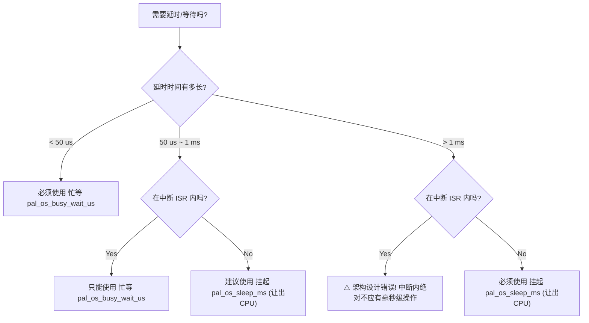

# App层编码踩坑经验汇总

本页面汇总了在开发 App 业务层代码（如 App Callbacks、ISR 回调等）时需要避免的常见高危踩坑点。

---

## 一、 中断（ISR）与延时调度约束

### 1.1 ISR 内部严禁调用任何可能阻塞或带锁的 API (如标准 printf)

*   **问题现象**：在中断服务函数（ISR）中调用 `pal_debug_printf` 导致系统抛出 `lock_acquire_generic` 崩溃并立即触发 Core 1 重置。
*   **深层原因**：标准的 `printf`/`vprintf` 在底层 C 库（如 picolibc/newlib）中实现了线程安全的标准输出流互斥锁。在硬件中断上下文（ISR）中，CPU 不允许执行任何会阻塞当前执行流、挂起线程或试图获取互斥锁（Mutex）的操作。
*   **正确实践**：
    *   ISR 内部应当保持纯净、快速。
    *   **严禁**在 ISR 内使用标准 `printf` 或 `pal_debug_printf`。
    *   如果必须在中断内调试打印，应使用平台无锁接口（如 ESP32 的 `esp_rom_printf`），或者最好仅在 ISR 中修改全局标志/计数器，由前台的普通任务线程进行异步打印。

### 1.2 ISR 中断上下文中严禁调用任务级阻塞/调度 API (如 pal_os_sleep_ms)

*   **问题现象**：在中断服务程序（ISR）中调用 `pal_os_sleep_ms` 模拟耗时操作，系统没有报 Panic（在禁用 Assert 的情况下），但实测该延时完全没有生效（耗时仅为几微秒），导致依赖该延时的测试逻辑（如 synchronize 阻塞性测试）直接失效。
*   **深层原因**：在 FreeRTOS 等 RTOS 环境下，`pal_os_sleep_ms` 底层依赖于 `vTaskDelay`。该 API 的核心作用是挂起当前执行任务并触发调度器进行上下文切换。然而，硬件中断上下文（ISR）的优先级高于任何任务且不属于任务上下文，此时**绝对不允许引起任务挂起或调度切换**。在使能 RTOS 调试时该调用会触发 `configASSERT` 导致 Panic 崩溃，而在生产/发布模式（禁用 Assert）下则会被静默忽略并立刻返回。
*   **正确实践**：
    *   在 ISR 中**严禁**使用 `pal_os_sleep_ms` 或任何可能触发任务调度的阻塞 API。
    *   若必须在中断中进行延迟（如某些特殊硬件驱动的微秒级初始化时序），必须使用**忙等延时（Busy-wait delay）**，例如调用 `pal_os_busy_wait_us`（在 ESP32 上对应 `esp_rom_delay_us`，纯靠读取硬件 CPU 计数器循环等待）。

### 1.3 延时选择黄金法则：忙等 (pal_os_busy_wait_us) vs 挂起 (pal_os_sleep_ms)

在嵌入式开发中，合理选择延时机制对于保证系统并发性能、降低功耗以及维持系统稳定性至关重要。

#### 延时抉择决策流



#### 详细对比与选型指南

1.  **超短时延时（小于 50 微秒）**
    *   **推荐方案**：使用 `pal_os_busy_wait_us` 进行**忙等（Busy-waiting / Spinning）**。
    *   **理由**：此时延时时间极短，远小于 RTOS 任务上下文切换的本身开销（切换开销通常为 `2us ~ 10us`，且系统滴答精度一般仅为 `1ms`）。采用忙等可提供纳米至微秒级的最高精度，且无系统调度开销。
2.  **长时延时（大于 1 毫秒）**
    *   **推荐方案**：使用 `pal_os_sleep_ms` 进行**任务挂起（Yielding / Blocking）**。
    *   **理由**：调用 `pal_os_sleep_ms` 会将当前任务放入 RTOS 延时等待队列并释放 CPU。CPU 可以去运行其他就绪的低优先级任务，或者在无任务可跑时进入 `Idle` 低功耗休眠（利用 `WFI` 指令关断核心时钟），可节省 90% 以上功耗。
    *   **避坑警告**：若长延时错误使用忙等，会导致低优先级任务彻底“饥饿”卡死，并极易触发看门狗（WDT）复位，或因霸占 CPU 引起优先级反转导致死锁。
3.  **中断服务程序（ISR）中的延时**
    *   **推荐方案**：在 ISR 中**严禁调用任何触发任务挂起的 API**（如 `pal_os_sleep_ms`），若必须延时只能使用超短时 `pal_os_busy_wait_us` 忙等。
    *   **基本原则**：ISR 必须保持快速与纯净，执行时间应控制在微秒级。如果在 ISR 内需要等待毫秒级操作，说明系统架构设计存在严重问题，应改为“在 ISR 中仅设置状态标志或发送任务通知，由前台的 worker 任务线程去执行毫秒级操作”。

---

## 二、 多核 SMP 并发与数据同步

### 2.1 多核 SMP 场景下的 L1 Cache 缓存不一致性

*   **问题现象**：Core 0 上的主任务修改了标记变量（如 `s_trigger_active = true`），但 Core 1 上的轮询任务完全读不到该变化，导致两个核之间的通信卡死。
*   **深层原因**：部分双核架构芯片（如 ESP32 的 Xtensa LX6 内核）**不具备硬件级 L1 Cache 一致性**。即使变量被声明为 `volatile`（仅能防止编译器将数据暂存到寄存器中），CPU 仍会首选从各自核心的 L1 Data Cache 中读取旧数据，无法感知另一个核对内存的修改。
*   **正确实践**：
    *   在编写跨核并发逻辑时，**避免使用简单的全局 volatile 变量轮询**。
    *   应当使用具备内存屏障（Memory Barrier）和锁机制的 RTOS 通信原语，例如 FreeRTOS 的 **Task Notifications（任务通知）**、**Semaphores（信号量）** 或 **Queue（队列）**，这些原语的底层会自动无效化 Cache 并强制写回，确保多核数据同步。

### 2.2 SMP 跨核碰撞测试中的“类型限定符丢失”与“时序伪碰撞”

*   **问题现象**：在多核 SMP 场景下设计并发碰撞测试，明明关闭了同步屏障（`TEST_ENABLE_SYNCHRONIZE = false`），但无论跑多少轮，ISR 都完全无法捕获到 UAF 崩溃，显示 `UAF detected: NO`；而开启同步时反而可能假性失败。
*   **深层原因**：
    1.  **Volatile 类型限定符被剥离（编译器寄存器缓存优化）**：
        全局共享资源指针声明为 `volatile T *ptr`，但在 ISR 入口中，被强制转换并赋值给了没有 `volatile` 修饰的局部变量：
        `T *res = (T *)ptr; // ⚠️ 丢掉了 volatile 属性`
        此时，编译器为了优化性能，会在 ISR 内的忙等延时（如 `pal_os_busy_wait_us(50)`）**之前**，就将 `res->magic` 预先读入 CPU 寄存器。即使另一个核在此期间覆写了物理内存，ISR 醒来后校验的依然是寄存器中的旧值，导致检测不到内存损坏。
    2.  **硬编排时序（Microsecond-level timing）在多核调度下不可靠**：
        如果依赖在 Core 1 的触发任务中以 `pal_os_busy_wait_us` 与 Core 0 的 `pal_os_sleep_ms` 盲等来对齐释放时间，会遇到两种死胡同：
        *   若 Done 标记设在第 50 次触发的 loop 结束后：由于 ISR 在 Core 1 上同步抢占触发任务，在 Done 变为 true 时第 50 次 ISR 必定已经执行完毕，Core 0 此时 free 无法与任何 ISR 碰撞。
        *   若 Done 标记设在第 50 次触发之前：Core 0 在 Core 1 还没来得及执行 `pal_irq_set_pending` 之前就完成了 `synchronize` 并 `free` 内存，导致启用同步时依然会假性失败。
*   **正确实践**：
    *   **保持 volatile 连续性**：跨核共享指针在赋值及使用时必须严格保持 `volatile` 类型修饰，如使用 `volatile T *res = ptr;`，阻止编译器在执行路径中把成员变量优化进 CPU 寄存器。
    *   **基于状态机（State-based）的精准碰撞协调**：
        放弃脆弱且不确定性的时间盲等。在测试逻辑内部引入轻量级的共享原子计数器（如 `s_test_irq_in_flight`）。
        *   当 `enable_synchronize` 为 `false` 时：Core 0 启动触发器后，主动轮询 `while (s_test_irq_in_flight == 0)`，直到确认 Core 1 的 ISR 已经开始执行且正处于忙等延时中，Core 0 才立刻执行内存毒化与 `free`，确保 100% 发生碰撞。
        *   当 `enable_synchronize` 为 `true` 时：先安全等待触发循环完全退出，再调用 `pal_irq_synchronize` 确认在飞中断全部归零，即可 100% 保证无 UAF。

### 2.3 跨核/任务逃生舱最佳实践：如何在协作式循环中维持高实时性与仿真对齐？

*   **问题背景**：在 WinkOS 协作式事件循环中，如果某个任务（如 3D 物理碰撞计算、神经网络推理、重型 I/O 读写）耗时太长，会导致主循环 Tick 周期被拉长，直接破坏高频控制回路（如 FOC 电机控制、平衡环算法）的 10ms 硬实时周期。
*   **深层原因**：WinkOS 为了保证 Web 仿真对齐与 AI 代码生成安全，在应用层放弃了“任务间抢占”。如果在单线程下顺序执行，任何一个慢任务都会阻塞后面的快任务（引发 8002 虚警 / WCET 超时）。
*   **正确实践**：
    *   **非对称前后台隔离拓扑**：
        1.  将**高频/高优控制逻辑（Task A）**留在 WinkOS 主循环中（由高优先级 RTOS 线程独占执行）。
        2.  将**低频/重型计算任务（Task B）**通过 OSAL `pal_task_create` 扔到后台（如 Core 0 或低优先级 RTOS 线程）独立运行。
        3.  当底层 RTOS 时钟滴答触发时，高优先级的 WinkOS 线程会**强行抢占**后台运行的任务 B，优先执行任务 A，从而保证任务 A 的实时性。
    *   **基于 `pal_ringbuf` 的无锁单向通信**：
        *   逃生舱任务与 WinkOS 主线程之间**严禁共享任何互斥锁（Mutex）**。所有的输入和输出数据必须只通过无锁、非阻塞的 `pal_ringbuf` 队列进行单向同步。
        *   这不仅彻底消除了多线程死锁风险，还在仿真侧打通了对齐链路——在 Wasm 仿真中，重型任务 B 被模拟为 JS 的异步事件（如 Promise/Worker），而主循环 A 仍以纯单线程在 Wasm 中被完美仿真。
    *   **架构反模式警告（Anti-pattern）**：
        *   **严禁泛用逃生舱**：切勿将所有应用任务都包装成原生 RTOS 线程。如果滥用逃生舱，将彻底丧失 WinkOS 的“两端同源仿真”价值与“AI 零锁死安全网”，使系统退化为普通且极其难以调试的多线程 RTOS。

---

## 三、 内存管理与安全防护（Testing-focused）

### 3.1 Use-After-Free (UAF) 的延迟显现与主动内存污染（Poisoning）

*   **问题现象**：测试关闭了中断同步屏障，但压力测试跑了成百上千轮依然显示 `PASSED`，未检测到 UAF。
*   **深层原因**：调用 `free(res)` 之后，这片内存的物理数据并不会立刻被操作系统清空或覆盖，原先写入的魔数（Magic Number）仍完好保留。此时如果异步的中断仍在读取它，很可能会假性“通过”校验。
*   **正确实践**：
    *   **不要依赖操作系统的 `free` 行为来暴露野指针访问**：在设计并发或异步资源释放的测试时，应当主动模拟指针失效的场景。
    *   在释放内存的前一瞬间或之后，应当主动往即将释放的控制块数据中写入脏数据（Poisoning，如 `0xAAAAAAAA`），模拟野指针所指向内存已被破坏的场景，从而 100% 暴露出 UAF 安全隐患。

---

## 四、 编译器安全校验与工程规约

### 4.1 编译器 `use-after-free` 警告与规避

*   **问题现象**：在 `free(res)` 语句之后为了检测 UAF 而对指针 `res` 进行写入，引发 GCC 12+ 编译器报 `pointer 'res' used after 'free' [-Werror=use-after-free]` 致命错误导致构建终止。
*   **深层原因**：现代编译器具备极强的静态分析能力，严禁在 `free` 后访问该指针的任何偏移量。
*   **正确实践**：
    *   如果需要手动污染内存，可以在 **`free()` 执行的前一瞬间**，优先修改需要测试的变量（例如将 `res->magic = 0xAAAAAAAA`），紧接着再调用 `free(res)`。
    *   这种写法逻辑上完全等效（因为此时多核的另一个 ISR 仍在并行运行，随时可能读到污染后的值），同时又能完美通过编译器的安全检查。

### 4.2 强制返回值校验与丢弃返回值警告（WINK_WARN_UNUSED_RESULT）

*   **问题现象**：调用 `pal_resource_claim` 等被 `WINK_WARN_UNUSED_RESULT` 修饰的函数时，如果不检查返回值，或直接强转 `(void)pal_resource_claim(...)`，在 GCC 16+ 等严格编译选项下仍会触发 `[-Werror=unused-result]` 致命错误导致构建终止。
*   **深层原因**：
    1.  为了系统的鲁棒性，底层核心 API 强制要求上层检查返回状态。
    2.  现代编译器更加严格，直接对函数调用进行 `(void)` 强转在某些编译器（如 GCC 16）中已经无法消除未检查返回值的警告。
*   **正确实践**：
    *   **核心原则**：在真实业务代码中，**必须优先接收返回值并进行校验与错误处理**。
    *   **不要在业务代码中使用文件级屏蔽**：严禁在生产的 `.c` 文件头部使用 `#pragma GCC diagnostic ignored "-Wunused-result"`，因为这会全局关闭检查，极易漏掉其他关键调用的返回值校验。
    *   **局部显式忽略的正确写法**：在测试用例、压力测试或确实有理由不校验的极少数特定调用处，应使用“**先赋值给临时变量，再使用 `(void)` 消除未使用变量警告**”的局部规避写法：
        ```c
        wink_status_t _status = pal_resource_claim(PAL_RESOURCE_GPIO_PIN, 100u + core_id, "stress");
        (void)_status; // 如果后面不使用，局部丢弃，不影响文件中其他代码的安全网
        ```
