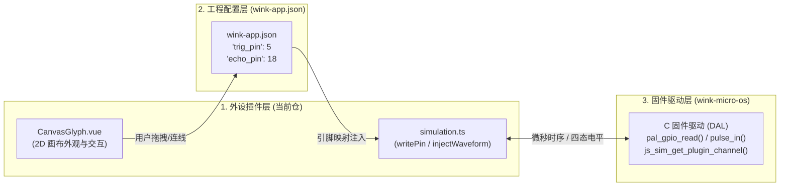

# 外设插件新手 15 分钟快速上手指南 (Quickstart Guide)

> **目标**：在 15 分钟内，学会从选模板、创建工程、编写仿真与 UI 定义，到本地编译自检与全栈联调的全流程。  
> **面向对象**：第一次开发 UniSim 4.0 外设插件的开发者。  
> **入口索引**：[README.md](./README.md)

---

## ⏱️ 时间预估与阶段产出

| 阶段 | 预计耗时 | 完成标准与产出 |
| :--- | :---: | :--- |
| **步骤 1：模板选择** | 2 分钟 | 根据硬件引脚与信号类型，选中对应的官方参考外设与基类。 |
| **步骤 2：建立外设工程** | 1 分钟 | 运行 `bun run create` 脚手架，一键生成完整工程骨架。 |
| **步骤 3：编写仿真与 UI** | 7 分钟 | 完成 `src/simulation.ts` (含 Manifest)、`src/definition.ts` 与画布组件。 |
| **步骤 4：编译自检与验证** | 3 分钟 | 运行 `bun run build`，在 Workbench 调测成功。 |
| **步骤 5：全栈软硬件闭环** | 2 分钟 | 在 `wink-app.json` 声明外设并在 C 固件中完成驱动对接。 |

---

## 🎯 步骤 1：选择外设模板 (Template Selection)

根据您要开发的外设的 **主信号 PinType**，选择最匹配的参考模板与基类：

| 主 PinType 分类 | 硬件特性与信号形态 | 典型外设 | 参考内置外设 | 继承基类 (Base Class) |
| :--- | :--- | :--- | :--- | :--- |
| **`digital_in`** | MCU 输出驱动外设；外设读取电平 | 单色 LED 灯、蜂鸣器 | `led` | `SimpleGpioPlugin` |
| **`digital_out`** | 外设驱动 MCU；UI/手势触发输入 | 物理按键、微动开关 | `button` | `SimpleGpioPlugin` |
| **`pwm`** | 占空比定时调制驱动；角度/速度执行器 | SG90 舵机、电机调速 | `rc_servo` | `BaseSimulationPlugin` |
| **`digital_in` + `digital_out`** | 触发/应答双数字脚；微秒级高保真脉冲 | 超声波测距 (HC-SR04) | `ultrasonic` | `BaseSimulationPlugin` |
| **`i2c_sda` + `i2c_scl`** | I2C 从设备；寄存器与帧缓冲 | 单色 OLED (SSD1306)、PCF8574 | `mono_oled` / `pcf8574` | `BaseSimulationPlugin` / `I2cPeripheralPlugin` |
| **`adc`** | 连续模拟电压输出 `[0.0, 1.0]` | 旋钮电位器、摇杆 | `analog_knob` | `BaseSimulationPlugin` |
| **`uart_tx` + `uart_rx`** | 串口总线数据帧 | GPS 模块、蓝牙透传 | `gps` | `BaseSimulationPlugin` |

---

## 📁 步骤 2：建立外设工程目录 (脚手架一键生成)

推荐使用内置脚手架命令，在 1 秒内生成标准工程：

```bash
# 格式：bun run create <外设名> [版本号] [分类]
bun run create my_sensor 1.0.0 sensor
```

脚本将在 `builtin/my_sensor/1.0.0/` 目录下全自动建立以下 8 个标准文件：

```text
builtin/my_sensor/1.0.0/
├── vite.config.sim.ts            # 仿真逻辑编译配置 (definePeripheralSimConfig)
├── vite.config.ui.ts             # 前端 UI 视图编译配置 (definePeripheralUiConfig)
├── tsconfig.json                 # TS 编译配置
├── README.md                     # 外设简要说明
└── src/
    ├── simulation.ts             # 仿真逻辑与 Manifest 契约入口
    ├── definition.ts             # 前端 UI 控件定义 (definePeripheral 接入入口)
    ├── CanvasGlyph.vue           # 2D 电路画布外观组件
    └── WorldWidget.vue           # 3D/物理世界交互组件
```

> **💡 手动配置提示**：若手动创建，只需配置两行官方预设：
> - `vite.config.sim.ts`: `export default definePeripheralSimConfig({ type: 'my_sensor' })`
> - `vite.config.ui.ts`: `export default definePeripheralUiConfig({ type: 'my_sensor' })`

---

## 💻 步骤 3：编写外设核心代码

### 3.1 编写 `src/simulation.ts`（物理仿真与 Manifest 契约）

在 UniSim 4.0 中，外设 Manifest 采用 **Code-First（代码首选）** 模式声明，通过 `normalizeManifest()` 保证类型安全：

```typescript
import {
  normalizeManifest,
  resolvePluginIdentity,
  BaseSimulationPlugin,
  type PluginContext,
  type PeripheralManifest,
  type ManifestFactory,
} from '@wink-ai/unisim';

const identity = resolvePluginIdentity(import.meta.url, 'my_sensor', '1.0.0', 'sensor');

export interface MySensorProps {
  sensitivity: number;
}

export interface MySensorState {
  active: boolean;
}

export function createMySensorManifest(): PeripheralManifest {
  return normalizeManifest({
    type: identity.type,
    version: identity.version,
    category: identity.category,
    displayName: 'My Custom Sensor',
    description: 'Custom 2-pin digital sensor',
    timingModel: 'event-driven',
    pins: [
      { name: 'SIG', pinType: 'digital_out', required: true },
      { name: 'VCC', pinType: 'vcc', required: false },
      { name: 'GND', pinType: 'gnd', required: false },
    ],
    properties: {
      sensitivity: { type: 'number', default: 50, min: 0, max: 100 },
    },
    stateChannels: {
      active: { type: 'boolean', default: false, description: 'Sensor active state' },
    },
    events: {
      SET_ACTIVE: {
        description: 'Set active state from UI slider/toggle',
        params: { active: { type: 'boolean', required: true } },
      },
    },
  });
}

export const mySensorManifest = createMySensorManifest();
export const mySensorManifestFactory: ManifestFactory = () => createMySensorManifest();

export class MySensorPlugin extends BaseSimulationPlugin<MySensorState, MySensorProps> {
  readonly manifest = mySensorManifest;
  private active = false;

  // 1. 初始化绑定钩子
  protected override onBound(
    _ctx: PluginContext<MySensorState>,
    _pinMapping: Record<string, number>,
    _props: MySensorProps,
  ): Partial<MySensorState> {
    this.active = false;
    this.ctx?.publish('active', false);
    this.ctx?.writePin('SIG', false);
    return { active: false };
  }

  // 2. 响应事件：Manifest 中的 SET_ACTIVE 经 mapEventToMethod 自动映射为 _active
  // ⚠️ 铁律：自动剔除 SET_ 前缀转小驼峰！必须命名为 _active，禁止写成 _setActive！
  _active(active: boolean): void {
    this.active = active;
    this.ctx?.publish('active', active);
    this.ctx?.writePin('SIG', active);
  }

  // 3. 销毁时释放引脚驱动
  onDestroy(): void {
    this.ctx?.releasePin('SIG');
  }
}

// 统一导出格式
export default {
  manifest: mySensorManifest,
  manifestFactory: mySensorManifestFactory,
  PluginClass: MySensorPlugin,
};
```

---

### 3.2 编写 `src/CanvasGlyph.vue` 与现成元件利用

开发者既可手写轻量 SVG/HTML，也可直接使用宿主预装成熟的 `@wokwi/elements` 硬件标签：

#### 🎨 现成硬件元件 Web Component 速查表：

| 硬件类型 | Wokwi 标签 | 常用 Props / 属性 | 适用外设 |
| :--- | :--- | :--- | :--- |
| **单色 LED** | `<wokwi-led>` | `:color="color" :value="lit"` | `led`、报警灯、状态指示灯 |
| **物理按键** | `<wokwi-pushbutton>` | `:color="color"` (事件 `@button-press`) | `button`、复位按键、微动开关 |
| **舵机执行器** | `<wokwi-servo>` | `:angle="angle"` (支持 0~180°) | `rc_servo`、机械臂关节 |
| **超声波模块** | `<wokwi-hc-sr04>` | 自带双探头与 4 引脚真实外观 | `ultrasonic` 测距传感器 |
| **旋钮电位器** | `<wokwi-potentiometer>` | `:min="0" :max="100" :value="val"` | `analog_knob`、音量旋钮 |
| **SSD1306 屏幕** | `<wokwi-ssd1306>` | 配合 I2C FrameBuffer 数据帧渲染 | `mono_oled` 单色显示屏 |
| **7段数码管** | `<wokwi-7segment>` | `:digits="digits" :values="values"` | 电子钟、计数器 |

#### 示例组件实现：

```vue
<script setup lang="ts">
defineProps<{
  active?: boolean;
  label?: string;
}>();
</script>

<template>
  <div class="my-sensor-glyph" :class="{ 'is-active': active }">
    <div class="sensor-indicator" />
    <span class="sensor-title">{{ label || 'My Sensor' }}</span>
  </div>
</template>

<style scoped>
.my-sensor-glyph {
  width: 80px;
  height: 60px;
  background: #1e293b;
  border: 1px solid #475569;
  border-radius: 6px;
  display: flex;
  flex-direction: column;
  align-items: center;
  justify-content: center;
  gap: 4px;
}
.sensor-indicator {
  width: 14px;
  height: 14px;
  border-radius: 50%;
  background: #64748b;
  transition: background 0.2s;
}
.my-sensor-glyph.is-active .sensor-indicator {
  background: #22c55e;
  box-shadow: 0 0 8px #22c55e;
}
.sensor-title {
  font-size: 11px;
  color: #94a3b8;
}
</style>
```

---

### 3.3 编写 `src/definition.ts` 与引脚热区定位

通过 `@wink-ai/unisim-ui` 的 `definePeripheral` 注册外设定义与通道响应式映射：

```typescript
import {
  definePeripheral,
  type PeripheralDefinition,
  type PeripheralPropsSchema,
} from '@wink-ai/unisim-ui';
import { resolvePluginIdentity } from '@wink-ai/unisim';
import CanvasGlyph from './CanvasGlyph.vue';
import WorldWidget from './WorldWidget.vue';

const identity = resolvePluginIdentity(import.meta.url, 'my_sensor', '1.0.0', 'sensor');

const sensorProps: PeripheralPropsSchema = {
  label: { type: 'string', default: 'My Sensor', description: 'Sensor label' },
  sensitivity: { type: 'number', default: 50, description: 'Detection sensitivity' },
};

export const mySensorDefinition: PeripheralDefinition = definePeripheral({
  type: identity.type,
  size: { width: 80, height: 60 },
  wireColor: '#38bdf8',
  // 📐 引脚热区坐标快速定位：以组件左上角 (0, 0) 为基准原点，向右 +X，向下 +Y
  pinsOverlay: {
    // 推荐左侧引脚外凸 5 像素（relX: -5），让导线端子完美贴合边框
    SIG: { relX: -5, relY: 20, wireNet: 'primary' },
    VCC: { relX: -5, relY: 35, wireNet: 'vcc', defaultConnection: 'VCC' },
    GND: { relX: -5, relY: 50, wireNet: 'gnd', defaultConnection: 'GND' },
  },
  props: sensorProps,
  canvas: CanvasGlyph,
  world: WorldWidget,
  ui: {
    // 实时数据映射：从仿真数据通道 (ctx.pluginChannels) 映射到 Vue Props
    canvasProps: (comp, ctx) => {
      const channel = ctx?.pluginChannels?.[comp.id] || {};
      return {
        label: comp.props?.label,
        active: Boolean(channel.active),
      };
    },
  },
});

export default mySensorDefinition;
```

---

## 🛠️ 步骤 4：编译打包与本地验证

### 4.1 执行一键构建

在 `wink-plugin-peripherals` 仓库根目录下执行构建命令：

```bash
bun run build
# 或者使用 PowerShell 脚本：
powershell -File build-peripherals.ps1
```

构建成功后，在 `builtin/my_sensor/1.0.0/dist/` 下将自动生成自包含产物：
- `simulation.js`：仿真算法 Bundle
- `frontend.js`：Vue 3 视图与元数据 Bundle
- `wink-ai.css`：作用域隔离样式文件
- `manifest.json`：标准化硬件契约
- `schema.json`：属性校验 Schema

### 4.2 运行无头单测 (Headless Testing)

对于包含换算公式或状态机的外设，推荐通过单元测试秒级验证：

```bash
bun test
```
详细单测编写方法请参阅 **[06-PHYSICS_AND_HEADLESS_TESTING.md](./06-PHYSICS_AND_HEADLESS_TESTING.md)**。

---

## 🌐 步骤 5：全栈软硬件三层闭环 (Full-Stack Closure)

外设插件不仅能在前端画布交互，还与真实的 C 语言固件 100% 连通闭环：



1. **工程配置 (`wink-app.json`)**：在设备的 `components` 或 `drivers` 中声明该外设及 MCU 引脚编号；
2. **C 驱动 (`wink-micro-os`)**：C 固件调用 `pal_gpio_read(sig_pin)` 或 `js_sim_get_plugin_channel("my_sensor:0", "active")` 读取信号；
3. **闭环完成**：在工作台点击运行，MCU 固件即可接收到由您的外设插件驱动的真实电平！

---

## ⏭️ 下一步

- **[02-MANIFEST_AND_METADATA_SPEC.md](./02-MANIFEST_AND_METADATA_SPEC.md)**：深入掌握 Manifest PinType 全集与 `mapEventToMethod` 映射契约。
- **[03-HIGH_FIDELITY_WAVEFORM_GUIDE.md](./03-HIGH_FIDELITY_WAVEFORM_GUIDE.md)**：掌握高保真微秒波形注入 (`injectWaveform`) 与五大硬件通道开发。
- **[04-BUILD_AND_PACKAGING_TOOLCHAIN.md](./04-BUILD_AND_PACKAGING_TOOLCHAIN.md)**：了解 Vite 构建预设工作原理与三级扫描加载机制。
- **[05-COMMON_PITFALLS_AND_FAQ.md](./05-COMMON_PITFALLS_AND_FAQ.md)**：排查方法名冲突、时间戳混用等常见陷阱。
- **[06-PHYSICS_AND_HEADLESS_TESTING.md](./06-PHYSICS_AND_HEADLESS_TESTING.md)**：编写无头单元测试，秒级自检算法。
